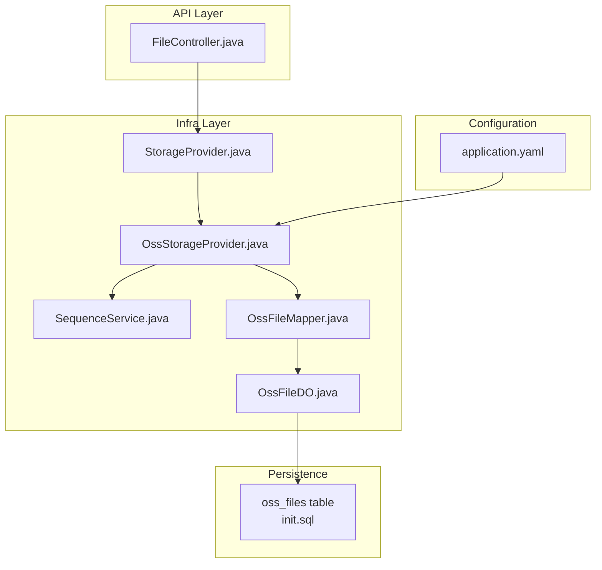
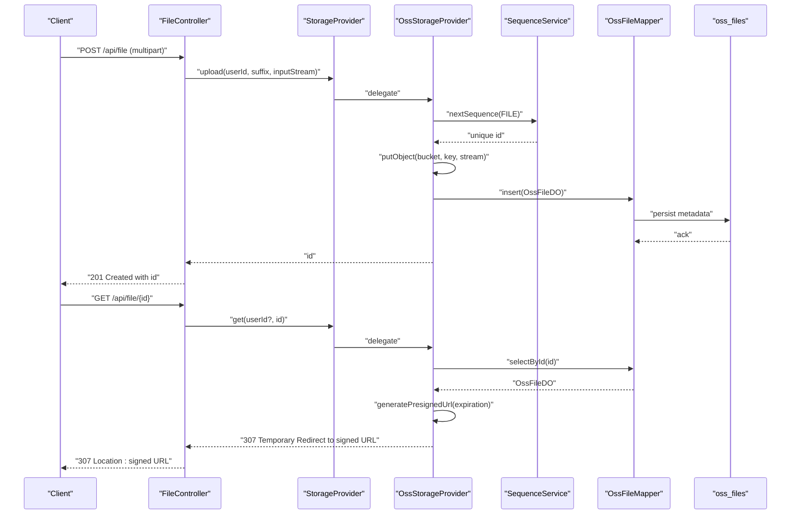
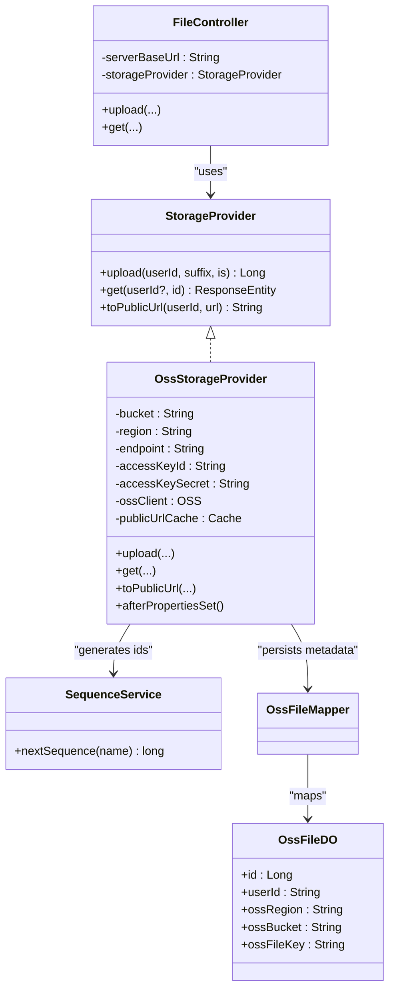
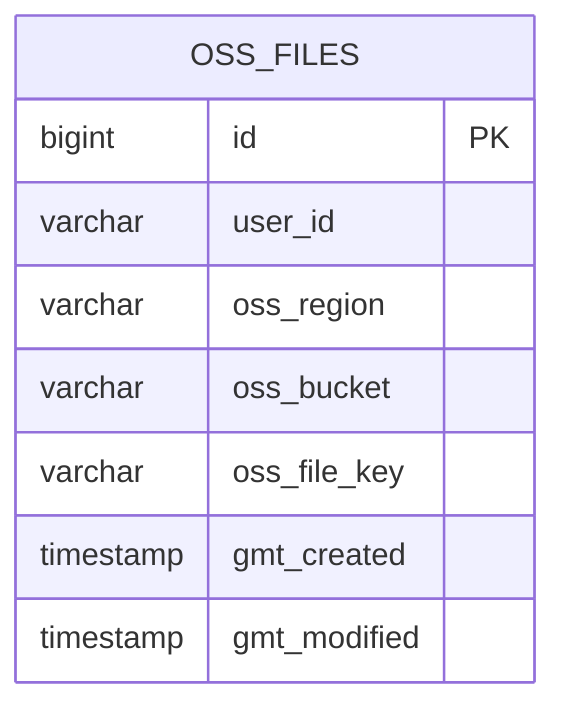

# Storage Providers

<cite>
**Referenced Files in This Document**
- [StorageProvider.java](file://backend_java/infra/src/main/java/com/aliyun/tam/x/tron/infra/storage/StorageProvider.java)
- [OssStorageProvider.java](file://backend_java/infra/src/main/java/com/aliyun/tam/x/tron/infra/storage/OssStorageProvider.java)
- [application.yaml](file://backend_java/bootstrap/src/main/resources/application.yaml)
- [init.sql](file://backend_java/bootstrap/src/main/resources/schema/init.sql)
- [FileController.java](file://backend_java/api/src/main/java/com/aliyun/tam/x/tron/api/FileController.java)
- [SequenceService.java](file://backend_java/infra/src/main/java/com/aliyun/tam/x/tron/infra/sequence/SequenceService.java)
- [OssFileDO.java](file://backend_java/infra/src/main/java/com/aliyun/tam/x/tron/infra/dal/dataobject/OssFileDO.java)
- [OssFileMapper.java](file://backend_java/infra/src/main/java/com/aliyun/tam/x/tron/infra/dal/mapper/OssFileMapper.java)
- [develop_guide.md](file://docs/en/develop_guide.md)
</cite>

## Table of Contents
1. [Introduction](#introduction)
2. [Project Structure](#project-structure)
3. [Core Components](#core-components)
4. [Architecture Overview](#architecture-overview)
5. [Detailed Component Analysis](#detailed-component-analysis)
6. [Dependency Analysis](#dependency-analysis)
7. [Performance Considerations](#performance-considerations)
8. [Troubleshooting Guide](#troubleshooting-guide)
9. [Conclusion](#conclusion)
10. [Appendices](#appendices)

## Introduction
This document explains the storage provider abstraction and implementation in Tron OneAgent. It covers the StorageProvider interface design, the default Alibaba Cloud OSS implementation, configuration and authentication requirements, bucket management, registration and dependency injection mechanisms, and practical examples for building custom storage providers. It also documents lifecycle management, error handling strategies, performance optimization techniques, and the contract methods for upload, retrieval, and metadata operations.

## Project Structure
The storage provider functionality resides primarily in the infrastructure module and integrates with the API layer and persistence layer.

**Diagram sources**
- [FileController.java:32-112](file://backend_java/api/src/main/java/com/aliyun/tam/x/tron/api/FileController.java#L32-L112)
- [StorageProvider.java:25-33](file://backend_java/infra/src/main/java/com/aliyun/tam/x/tron/infra/storage/StorageProvider.java#L25-L33)
- [OssStorageProvider.java:58-199](file://backend_java/infra/src/main/java/com/aliyun/tam/x/tron/infra/storage/OssStorageProvider.java#L58-L199)
- [SequenceService.java:40-178](file://backend_java/infra/src/main/java/com/aliyun/tam/x/tron/infra/sequence/SequenceService.java#L40-L178)
- [OssFileDO.java:26-76](file://backend_java/infra/src/main/java/com/aliyun/tam/x/tron/infra/dal/dataobject/OssFileDO.java#L26-L76)
- [OssFileMapper.java:24-30](file://backend_java/infra/src/main/java/com/aliyun/tam/x/tron/infra/dal/mapper/OssFileMapper.java#L24-L30)
- [init.sql:191-207](file://backend_java/bootstrap/src/main/resources/schema/init.sql#L191-L207)
- [application.yaml:32-51](file://backend_java/bootstrap/src/main/resources/application.yaml#L32-L51)

**Section sources**
- [StorageProvider.java:25-33](file://backend_java/infra/src/main/java/com/aliyun/tam/x/tron/infra/storage/StorageProvider.java#L25-L33)
- [OssStorageProvider.java:58-199](file://backend_java/infra/src/main/java/com/aliyun/tam/x/tron/infra/storage/OssStorageProvider.java#L58-L199)
- [application.yaml:32-51](file://backend_java/bootstrap/src/main/resources/application.yaml#L32-L51)
- [init.sql:191-207](file://backend_java/bootstrap/src/main/resources/schema/init.sql#L191-L207)

## Core Components
- StorageProvider interface defines the contract for pluggable storage backends with upload, retrieval, and optional public URL transformation.
- OssStorageProvider implements the interface for Alibaba Cloud OSS, handling uploads, signed URL generation, and metadata persistence.
- FileController integrates with the StorageProvider to expose file upload and retrieval endpoints.
- SequenceService generates unique identifiers for uploaded files.
- OssFileDO and OssFileMapper manage persisted metadata for OSS-backed files.

**Section sources**
- [StorageProvider.java:25-33](file://backend_java/infra/src/main/java/com/aliyun/tam/x/tron/infra/storage/StorageProvider.java#L25-L33)
- [OssStorageProvider.java:58-199](file://backend_java/infra/src/main/java/com/aliyun/tam/x/tron/infra/storage/OssStorageProvider.java#L58-L199)
- [FileController.java:32-112](file://backend_java/api/src/main/java/com/aliyun/tam/x/tron/api/FileController.java#L32-L112)
- [SequenceService.java:40-178](file://backend_java/infra/src/main/java/com/aliyun/tam/x/tron/infra/sequence/SequenceService.java#L40-L178)
- [OssFileDO.java:26-76](file://backend_java/infra/src/main/java/com/aliyun/tam/x/tron/infra/dal/dataobject/OssFileDO.java#L26-L76)
- [OssFileMapper.java:24-30](file://backend_java/infra/src/main/java/com/aliyun/tam/x/tron/infra/dal/mapper/OssFileMapper.java#L24-L30)

## Architecture Overview
The storage provider architecture follows a clean separation of concerns:
- API layer exposes HTTP endpoints for file operations.
- StorageProvider abstraction allows switching backends without changing API logic.
- Default OSS implementation manages credentials, client configuration, and signed URLs.
- Persistence layer stores OSS metadata for retrieval and access control.

**Diagram sources**
- [FileController.java:51-111](file://backend_java/api/src/main/java/com/aliyun/tam/x/tron/api/FileController.java#L51-L111)
- [StorageProvider.java:25-33](file://backend_java/infra/src/main/java/com/aliyun/tam/x/tron/infra/storage/StorageProvider.java#L25-L33)
- [OssStorageProvider.java:90-134](file://backend_java/infra/src/main/java/com/aliyun/tam/x/tron/infra/storage/OssStorageProvider.java#L90-L134)
- [SequenceService.java:104-132](file://backend_java/infra/src/main/java/com/aliyun/tam/x/tron/infra/sequence/SequenceService.java#L104-L132)
- [OssFileMapper.java:24-30](file://backend_java/infra/src/main/java/com/aliyun/tam/x/tron/infra/dal/mapper/OssFileMapper.java#L24-L30)
- [init.sql:191-207](file://backend_java/bootstrap/src/main/resources/schema/init.sql#L191-L207)

## Detailed Component Analysis

### StorageProvider Interface
The interface defines the contract for storage backends:
- upload(userId, suffix, inputStream): returns a unique numeric identifier for the stored resource.
- get(userId?, id): returns a response entity suitable for redirection or direct content delivery.
- toPublicUrl(userId, url): optional default method to transform a URL into a signed public URL when applicable.

Implementation notes:
- The interface is intentionally minimal to support pluggable backends.
- The default toPublicUrl method returns the input URL unchanged, enabling custom behavior in implementations.

**Section sources**
- [StorageProvider.java:25-33](file://backend_java/infra/src/main/java/com/aliyun/tam/x/tron/infra/storage/StorageProvider.java#L25-L33)

### OssStorageProvider Implementation
Key responsibilities:
- Configuration: Reads OSS settings from application properties and initializes the OSS client with secure defaults.
- Upload: Generates a unique ID, uploads the input stream to OSS, persists metadata, and logs the operation.
- Retrieval: Validates ownership, generates a pre-signed URL with expiration, and returns a redirect response.
- Public URL Transformation: Converts internal or OSS-hosted URLs into signed URLs for controlled access.

Configuration requirements:
- tron.file.provider.type must be set to "oss" to activate this implementation.
- tron.oss.bucket, tron.oss.region, tron.oss.endpoint, tron.oss.access-key-id, tron.oss.access-key-secret must be provided.
- tron.file.server.base-url can customize the response URL construction.

Authentication setup:
- Uses DefaultCredentialProvider with access key ID and secret.
- Client builder configuration sets signature version, protocol, timeouts, and retry policy.

Bucket management:
- Stores OSS metadata in the oss_files table with unique constraints on region/bucket/key.
- Ensures uniqueness and fast lookup by user_id and OSS key.

Lifecycle management:
- Implements InitializingBean to construct the OSS client during Spring initialization.
- Uses a cache to store pre-signed URLs for performance.

Error handling:
- Returns appropriate HTTP responses for not found, forbidden, and internal server errors.
- Catches exceptions during URL generation and logging.

**Section sources**
- [OssStorageProvider.java:58-199](file://backend_java/infra/src/main/java/com/aliyun/tam/x/tron/infra/storage/OssStorageProvider.java#L58-L199)
- [application.yaml:39-51](file://backend_java/bootstrap/src/main/resources/application.yaml#L39-L51)
- [OssFileDO.java:26-76](file://backend_java/infra/src/main/java/com/aliyun/tam/x/tron/infra/dal/dataobject/OssFileDO.java#L26-L76)
- [OssFileMapper.java:24-30](file://backend_java/infra/src/main/java/com/aliyun/tam/x/tron/infra/dal/mapper/OssFileMapper.java#L24-L30)
- [init.sql:191-207](file://backend_java/bootstrap/src/main/resources/schema/init.sql#L191-L207)

### FileController Integration
- Exposes multipart upload endpoint and a retrieval endpoint.
- Uses the StorageProvider bean if present; otherwise returns not found.
- Extracts user ID from request header and validates file name and extension.
- Delegates upload to the provider and constructs a response URL using server base URL or request context.

**Section sources**
- [FileController.java:32-112](file://backend_java/api/src/main/java/com/aliyun/tam/x/tron/api/FileController.java#L32-L112)

### SequenceService
- Provides unique numeric identifiers for uploaded files.
- Uses database-backed allocation with atomic increments and formatted timestamps.
- Supports configurable step sizes and retry logic.

**Section sources**
- [SequenceService.java:40-178](file://backend_java/infra/src/main/java/com/aliyun/tam/x/tron/infra/sequence/SequenceService.java#L40-L178)

### Metadata Model and Mapper
- OssFileDO represents persisted OSS metadata with user_id, region, bucket, and file key.
- OssFileMapper extends MyBatis-Plus base mapper for CRUD operations.
- Database schema ensures uniqueness and indexing for efficient lookups.

**Section sources**
- [OssFileDO.java:26-76](file://backend_java/infra/src/main/java/com/aliyun/tam/x/tron/infra/dal/dataobject/OssFileDO.java#L26-L76)
- [OssFileMapper.java:24-30](file://backend_java/infra/src/main/java/com/aliyun/tam/x/tron/infra/dal/mapper/OssFileMapper.java#L24-L30)
- [init.sql:191-207](file://backend_java/bootstrap/src/main/resources/schema/init.sql#L191-L207)

### Registration and Dependency Injection
- Conditional activation: OssStorageProvider is loaded only when the OSS class is present and tron.file.provider.type equals "oss".
- Autowiring: FileController declares an optional StorageProvider dependency; if absent, upload returns not found.
- Extension example: The development guide demonstrates adding a local filesystem provider with conditional property activation.

**Section sources**
- [OssStorageProvider.java:53-58](file://backend_java/infra/src/main/java/com/aliyun/tam/x/tron/infra/storage/OssStorageProvider.java#L53-L58)
- [FileController.java:48-50](file://backend_java/api/src/main/java/com/aliyun/tam/x/tron/api/FileController.java#L48-L50)
- [develop_guide.md:2082-2128](file://docs/en/develop_guide.md#L2082-L2128)

### Contract Methods Specification
- upload(userId, suffix, inputStream)
  - Purpose: Store content and return a unique numeric identifier.
  - Parameters:
    - userId: String identifying the owner.
    - suffix: String representing the file extension.
    - inputStream: InputStream of the content to store.
  - Returns: Long identifier.
  - Exceptions: Throws IOException on storage failures.
- get(userId?, id)
  - Purpose: Retrieve a resource; typically returns a redirect to a pre-signed URL or direct content.
  - Parameters:
    - userId?: Optional owner identifier for access control.
    - id: Numeric identifier of the stored resource.
  - Returns: ResponseEntity<?> suitable for redirect or content.
- toPublicUrl(userId, url)
  - Purpose: Transform a URL into a signed public URL when applicable.
  - Parameters:
    - userId: Owner identifier for access control.
    - url: Input URL to transform.
  - Returns: String representing the transformed URL or original if transformation is not applicable.

**Section sources**
- [StorageProvider.java:25-33](file://backend_java/infra/src/main/java/com/aliyun/tam/x/tron/infra/storage/StorageProvider.java#L25-L33)
- [OssStorageProvider.java:90-175](file://backend_java/infra/src/main/java/com/aliyun/tam/x/tron/infra/storage/OssStorageProvider.java#L90-L175)

### Practical Examples: Implementing Custom Storage Providers
- Local filesystem provider example:
  - Use @ConditionalOnProperty to activate when tron.file.provider.type equals "local".
  - Implement upload and get methods to write/read files under a configured base path.
  - Return appropriate ResponseEntity statuses for success, not found, and internal server error.
- Cloud storage providers:
  - Implement the same contract using SDKs for AWS S3, Google Cloud Storage, or Azure Blob Storage.
  - Manage credentials via environment variables or managed identity.
  - Generate pre-signed URLs with appropriate expiration and signing.
- Enterprise storage systems:
  - Integrate with on-premises NAS/SAN or proprietary APIs.
  - Persist metadata similarly to OssFileDO for uniform access patterns.

**Section sources**
- [develop_guide.md:2082-2128](file://docs/en/develop_guide.md#L2082-L2128)

## Dependency Analysis
The following diagram shows the primary dependencies among components:

**Diagram sources**
- [StorageProvider.java:25-33](file://backend_java/infra/src/main/java/com/aliyun/tam/x/tron/infra/storage/StorageProvider.java#L25-L33)
- [OssStorageProvider.java:58-199](file://backend_java/infra/src/main/java/com/aliyun/tam/x/tron/infra/storage/OssStorageProvider.java#L58-L199)
- [FileController.java:32-112](file://backend_java/api/src/main/java/com/aliyun/tam/x/tron/api/FileController.java#L32-L112)
- [SequenceService.java:40-178](file://backend_java/infra/src/main/java/com/aliyun/tam/x/tron/infra/sequence/SequenceService.java#L40-L178)
- [OssFileDO.java:26-76](file://backend_java/infra/src/main/java/com/aliyun/tam/x/tron/infra/dal/dataobject/OssFileDO.java#L26-L76)
- [OssFileMapper.java:24-30](file://backend_java/infra/src/main/java/com/aliyun/tam/x/tron/infra/dal/mapper/OssFileMapper.java#L24-L30)

**Section sources**
- [StorageProvider.java:25-33](file://backend_java/infra/src/main/java/com/aliyun/tam/x/tron/infra/storage/StorageProvider.java#L25-L33)
- [OssStorageProvider.java:58-199](file://backend_java/infra/src/main/java/com/aliyun/tam/x/tron/infra/storage/OssStorageProvider.java#L58-L199)
- [FileController.java:32-112](file://backend_java/api/src/main/java/com/aliyun/tam/x/tron/api/FileController.java#L32-L112)
- [SequenceService.java:40-178](file://backend_java/infra/src/main/java/com/aliyun/tam/x/tron/infra/sequence/SequenceService.java#L40-L178)
- [OssFileDO.java:26-76](file://backend_java/infra/src/main/java/com/aliyun/tam/x/tron/infra/dal/dataobject/OssFileDO.java#L26-L76)
- [OssFileMapper.java:24-30](file://backend_java/infra/src/main/java/com/aliyun/tam/x/tron/infra/dal/mapper/OssFileMapper.java#L24-L30)

## Performance Considerations
- Pre-signed URL caching: OssStorageProvider caches signed URLs to reduce repeated generation overhead.
- Client configuration: HTTPS protocol, signature version V4, and tuned timeouts improve reliability and performance.
- Unique ID generation: SequenceService batches allocations to minimize database round-trips.
- Access control checks: Early validation reduces unnecessary downstream operations.

**Section sources**
- [OssStorageProvider.java:85-88](file://backend_java/infra/src/main/java/com/aliyun/tam/x/tron/infra/storage/OssStorageProvider.java#L85-L88)
- [OssStorageProvider.java:181-188](file://backend_java/infra/src/main/java/com/aliyun/tam/x/tron/infra/storage/OssStorageProvider.java#L181-L188)
- [SequenceService.java:104-132](file://backend_java/infra/src/main/java/com/aliyun/tam/x/tron/infra/sequence/SequenceService.java#L104-L132)

## Troubleshooting Guide
Common issues and resolutions:
- Missing StorageProvider bean:
  - Symptom: Upload endpoint returns not found.
  - Cause: tron.file.provider.type not set or incompatible provider not on classpath.
  - Resolution: Set tron.file.provider.type to "oss" and ensure OSS SDK is included.
- Invalid OSS credentials:
  - Symptom: Upload fails with authentication errors.
  - Cause: Incorrect access key ID/secret or missing environment variables.
  - Resolution: Verify tron.oss.access-key-id and tron.oss.access-key-secret.
- Bucket or endpoint misconfiguration:
  - Symptom: Upload succeeds but retrieval fails.
  - Cause: Incorrect tron.oss.bucket, tron.oss.region, or tron.oss.endpoint.
  - Resolution: Confirm OSS bucket and region alignment with endpoint.
- File not found or permission denied:
  - Symptom: Retrieval returns not found or forbidden.
  - Cause: Nonexistent ID or mismatched user ID.
  - Resolution: Ensure the caller passes the correct user ID and the file exists.
- Internal server error during retrieval:
  - Symptom: Unexpected 500 response.
  - Cause: Exception during URL generation or metadata lookup.
  - Resolution: Check logs and verify OSS client configuration and network connectivity.

**Section sources**
- [FileController.java:56-58](file://backend_java/api/src/main/java/com/aliyun/tam/x/tron/api/FileController.java#L56-L58)
- [OssStorageProvider.java:112-134](file://backend_java/infra/src/main/java/com/aliyun/tam/x/tron/infra/storage/OssStorageProvider.java#L112-L134)
- [application.yaml:39-51](file://backend_java/bootstrap/src/main/resources/application.yaml#L39-L51)

## Conclusion
The storage provider abstraction cleanly separates file handling logic from backend specifics. The default OSS implementation offers robust configuration, authentication, and performance optimizations. The modular design enables easy extension to other backends while preserving the same API surface. Proper configuration, lifecycle management, and error handling ensure reliable file operations across environments.

## Appendices

### Configuration Reference
- tron.file.provider.type: Selects the active storage provider ("oss" or custom).
- tron.oss.bucket: Target OSS bucket name.
- tron.oss.region: OSS region identifier.
- tron.oss.endpoint: OSS endpoint URL.
- tron.oss.access-key-id: Access key ID for authentication.
- tron.oss.access-key-secret: Access key secret for authentication.
- tron.file.server.base-url: Optional base URL for constructed response links.

**Section sources**
- [application.yaml:39-51](file://backend_java/bootstrap/src/main/resources/application.yaml#L39-L51)

### Data Model Diagram

**Diagram sources**
- [init.sql:191-207](file://backend_java/bootstrap/src/main/resources/schema/init.sql#L191-L207)
- [OssFileDO.java:26-76](file://backend_java/infra/src/main/java/com/aliyun/tam/x/tron/infra/dal/dataobject/OssFileDO.java#L26-L76)