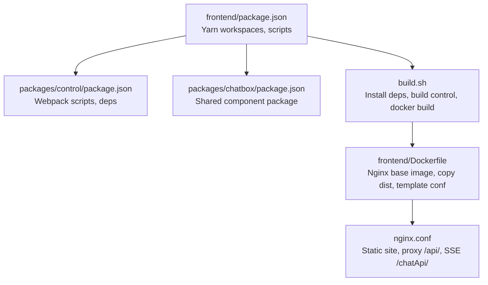
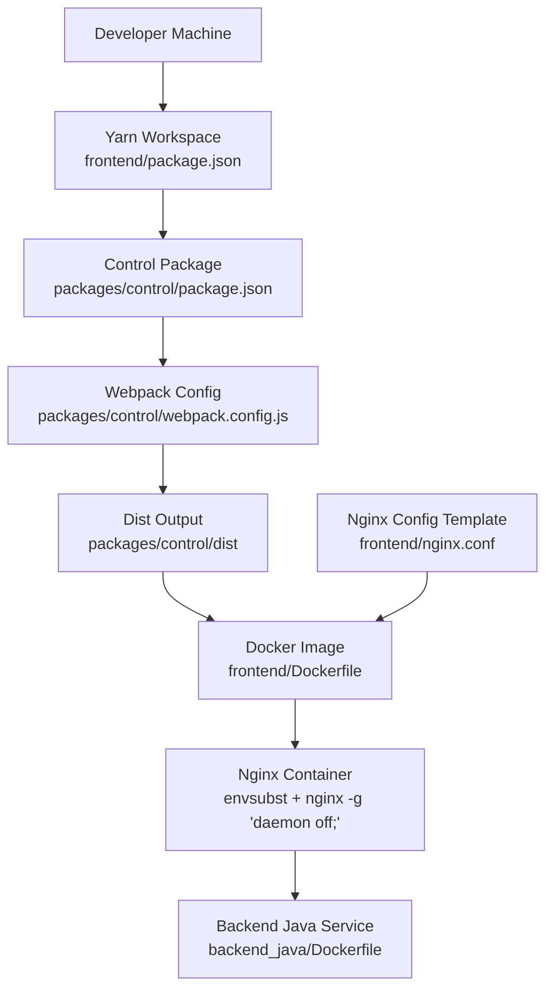
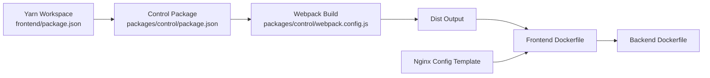

# Build System and Deployment

<cite>
**Referenced Files in This Document**
- [frontend/package.json](file://frontend/package.json)
- [frontend/build.sh](file://frontend/build.sh)
- [frontend/Dockerfile](file://frontend/Dockerfile)
- [frontend/nginx.conf](file://frontend/nginx.conf)
- [frontend/packages/control/package.json](file://frontend/packages/control/package.json)
- [frontend/packages/control/webpack.config.js](file://frontend/packages/control/webpack.config.js)
- [backend_java/Dockerfile](file://backend_java/Dockerfile)
</cite>

## Table of Contents
1. [Introduction](#introduction)
2. [Project Structure](#project-structure)
3. [Core Components](#core-components)
4. [Architecture Overview](#architecture-overview)
5. [Detailed Component Analysis](#detailed-component-analysis)
6. [Dependency Analysis](#dependency-analysis)
7. [Performance Considerations](#performance-considerations)
8. [Troubleshooting Guide](#troubleshooting-guide)
9. [Conclusion](#conclusion)
10. [Appendices](#appendices)

## Introduction
This document explains the frontend build system and deployment configuration for the Tron One Agent project. It covers the Yarn workspace setup, build scripts, dependency management, the Webpack-based build pipeline for the control application, Docker containerization, and Nginx configuration for serving static assets and proxying API traffic. Practical guidance is included for customizing build configurations, adding new build targets, optimizing bundles, environment-specific setups, and automating deployments.

## Project Structure
The frontend workspace is organized as a Yarn workspace with multiple packages. The primary package under development is control, which is built using Webpack. Supporting packages exist for shared components (e.g., chatbox). The workspace exposes top-level scripts to run development and production builds for the control package.

**Diagram sources**
- [frontend/package.json:1-12](file://frontend/package.json#L1-L12)
- [frontend/packages/control/package.json:1-60](file://frontend/packages/control/package.json#L1-L60)
- [frontend/packages/chatbox/package.json:1-5](file://frontend/packages/chatbox/package.json#L1-L5)
- [frontend/build.sh:1-80](file://frontend/build.sh#L1-L80)
- [frontend/Dockerfile:1-15](file://frontend/Dockerfile#L1-L15)
- [frontend/nginx.conf:1-78](file://frontend/nginx.conf#L1-L78)

**Section sources**
- [frontend/package.json:1-12](file://frontend/package.json#L1-L12)
- [frontend/packages/control/package.json:1-60](file://frontend/packages/control/package.json#L1-L60)
- [frontend/packages/chatbox/package.json:1-5](file://frontend/packages/chatbox/package.json#L1-L5)

## Core Components
- Yarn workspace configuration and scripts:
  - Workspaces define the packages directory for monorepo-style dependency management.
  - Top-level scripts delegate to the control package for dev and build commands.
- Control application build:
  - Uses Webpack with development and production modes.
  - Dependencies include React, Ant Design, routing, and HTTP clients.
- Docker packaging:
  - Nginx Alpine image is used as the runtime base.
  - Static assets are copied from the control package build output.
  - Nginx configuration is templated via environment substitution.
- Nginx serving and proxying:
  - Serves the control SPA under /control/.
  - Proxies /api/ to the backend endpoint and supports SSE via /chatApi/.

**Section sources**
- [frontend/package.json:4-10](file://frontend/package.json#L4-L10)
- [frontend/packages/control/package.json:5-9](file://frontend/packages/control/package.json#L5-L9)
- [frontend/packages/control/package.json:10-33](file://frontend/packages/control/package.json#L10-L33)
- [frontend/Dockerfile:1-15](file://frontend/Dockerfile#L1-L15)
- [frontend/nginx.conf:33-76](file://frontend/nginx.conf#L33-L76)

## Architecture Overview
The frontend build and deployment pipeline integrates Yarn workspaces, Webpack, Docker, and Nginx. The control application is built locally, packaged into a Docker image, and served by Nginx. API traffic is proxied to the backend service using environment-driven configuration.

**Diagram sources**
- [frontend/package.json:1-12](file://frontend/package.json#L1-L12)
- [frontend/packages/control/package.json:1-60](file://frontend/packages/control/package.json#L1-L60)
- [frontend/packages/control/webpack.config.js](file://frontend/packages/control/webpack.config.js)
- [frontend/Dockerfile:1-15](file://frontend/Dockerfile#L1-L15)
- [frontend/nginx.conf:1-78](file://frontend/nginx.conf#L1-L78)
- [backend_java/Dockerfile:1-18](file://backend_java/Dockerfile#L1-L18)

## Detailed Component Analysis

### Yarn Workspace Setup and Scripts
- Workspaces:
  - Declares packages/* as the workspace root for multiple packages.
- Scripts:
  - dev delegates to the control package’s dev script.
  - build delegates to the control package’s build script.
- Dependency management:
  - Packages can reference each other using names and version ranges.
  - The control package depends on chatbox and other UI libraries.

Practical customization tips:
- Add a new package under packages/ and include it in the workspaces array.
- Extend scripts to support additional targets (e.g., lint, test) and propagate them via top-level scripts.

**Section sources**
- [frontend/package.json:4-10](file://frontend/package.json#L4-L10)
- [frontend/packages/control/package.json:19](file://frontend/packages/control/package.json#L19)

### Webpack Build Pipeline for Control Application
- Scripts:
  - Development mode uses webpack-dev-server.
  - Production mode bundles assets for distribution.
- Dependencies and toolchain:
  - React, routing, UI components, HTTP client, and form libraries.
  - Babel presets and loaders for TypeScript/JSX, CSS, Less, and HTML injection.
- Asset handling:
  - HtmlWebpackPlugin injects index.html.
  - CopyWebpackPlugin can be used to copy static assets.
  - css-loader and style-loader handle styles; less and less-loader support Less preprocessing.

Optimization opportunities:
- SplitChunks configuration to separate vendor and application code.
- DefineMode plugins to inject environment variables at build time.
- Minification and tree-shaking are enabled in production mode by default.

**Section sources**
- [frontend/packages/control/package.json:5-9](file://frontend/packages/control/package.json#L5-L9)
- [frontend/packages/control/package.json:34-58](file://frontend/packages/control/package.json#L34-L58)

### Docker Packaging and Multi-stage Considerations
- Base image:
  - Nginx Alpine image is used for a lightweight runtime.
- Build steps:
  - Creates a directory for the control app under /usr/share/nginx/html/control.
  - Copies the control dist output into the static directory.
  - Copies the Nginx configuration template.
  - Exposes port 80.
- Runtime:
  - envsubst replaces placeholders in the template with environment variables.
  - Nginx runs in foreground mode.

Multi-stage build recommendation:
- Introduce a builder stage using Node.js to compile assets, then copy only the dist artifacts into the Nginx stage to reduce image size.

**Section sources**
- [frontend/Dockerfile:1-15](file://frontend/Dockerfile#L1-L15)

### Nginx Configuration for Static Serving and API Proxying
Key behaviors:
- Static site:
  - Serves the control SPA under /control/.
  - Uses try_files to support client-side routing.
- Redirect:
  - Root path redirects to /control/.
- API proxy:
  - /api/ proxies to the backend host/port defined by END_POINT.
  - Preserves upgrade headers for WebSocket/SSE.
- SSE handling:
  - /chatApi/ disables proxy buffering and cache to support streaming responses.
- Performance:
  - Gzip compression for common text-based assets.
  - Keepalive and sendfile tuned for efficient transfers.
  - Max body size configured for uploads.

Environment-driven configuration:
- END_POINT is substituted at runtime to route API traffic to the backend service.

**Section sources**
- [frontend/nginx.conf:33-76](file://frontend/nginx.conf#L33-L76)

### Build Automation Script
- Purpose:
  - Automates dependency installation, building the control app, and Docker image creation.
- Modes:
  - -prod uses the version from package.json for the image tag.
  - -tag <tag> suffixes the base version with _<tag>.
- Prerequisites:
  - Requires yarn and package.json to be present.
- Outputs:
  - Builds control dist, creates a tagged Docker image, and prints a docker run example with END_POINT.

Extending the script:
- Add linting, testing, or preview stages before building the Docker image.
- Support multiple environments (dev/stage/prod) by passing environment variables into docker build.

**Section sources**
- [frontend/build.sh:1-80](file://frontend/build.sh#L1-L80)

### Backend Java Service Containerization
- Base image and JDK:
  - Installs Java 17 and sets up the working directory.
- Artifacts:
  - Copies the Spring Boot jar and skills directory.
- Environment:
  - Sets timezone and environment variables for the service.
- Entrypoint:
  - Runs the Java application with optional JAVA_OPTS.

Integration note:
- The frontend Nginx container expects END_POINT to point to the backend service port.

**Section sources**
- [backend_java/Dockerfile:1-18](file://backend_java/Dockerfile#L1-L18)

## Dependency Analysis
The frontend build system exhibits a clear separation of concerns:
- Workspace orchestration (Yarn) manages multiple packages.
- The control package encapsulates the UI build pipeline (Webpack).
- Docker consolidates the static assets and Nginx runtime.
- Nginx handles routing, proxying, and performance tuning.
- The backend Java service provides APIs consumed by the frontend.

**Diagram sources**
- [frontend/package.json:1-12](file://frontend/package.json#L1-L12)
- [frontend/packages/control/package.json:1-60](file://frontend/packages/control/package.json#L1-L60)
- [frontend/packages/control/webpack.config.js](file://frontend/packages/control/webpack.config.js)
- [frontend/Dockerfile:1-15](file://frontend/Dockerfile#L1-L15)
- [frontend/nginx.conf:1-78](file://frontend/nginx.conf#L1-L78)
- [backend_java/Dockerfile:1-18](file://backend_java/Dockerfile#L1-L18)

**Section sources**
- [frontend/package.json:4-10](file://frontend/package.json#L4-L10)
- [frontend/packages/control/package.json:5-9](file://frontend/packages/control/package.json#L5-L9)

## Performance Considerations
- Bundle size optimization:
  - Enable code splitting via dynamic imports and splitChunks.
  - Remove unused dependencies and enable tree-shaking.
  - Prefer lightweight alternatives for heavy libraries.
- Asset delivery:
  - Leverage Nginx gzip and keepalive settings.
  - Serve static assets with far-future caching headers via Nginx.
- Build performance:
  - Use incremental builds during development.
  - Cache node_modules and consider Yarn workspaces’ hoisting benefits.
- Network efficiency:
  - Proxy streaming endpoints (SSE) without buffering.
  - Configure appropriate timeouts for long-running connections.

[No sources needed since this section provides general guidance]

## Troubleshooting Guide
Common issues and resolutions:
- Missing yarn:
  - Ensure yarn is installed and available in PATH before running the build script.
- Missing package.json:
  - Verify the presence of frontend/package.json before invoking build steps.
- Build failures:
  - Run the control package’s lint script to catch type and lint errors early.
- Docker build errors:
  - Confirm the control dist exists before copying into the image.
  - Validate the Nginx template path and environment variable substitution.
- Proxy connectivity:
  - Ensure END_POINT is set to the backend service address and port.
  - Check that the backend service is reachable from the frontend container network.

**Section sources**
- [frontend/build.sh:40-50](file://frontend/build.sh#L40-L50)
- [frontend/build.sh:52-58](file://frontend/build.sh#L52-L58)
- [frontend/Dockerfile:9-15](file://frontend/Dockerfile#L9-L15)
- [frontend/nginx.conf:42-69](file://frontend/nginx.conf#L42-L69)

## Conclusion
The frontend build and deployment system leverages Yarn workspaces, a Webpack-based build for the control application, and a streamlined Docker/Nginx runtime. The configuration is designed for simplicity and maintainability, with environment-driven proxying and clear separation between build, packaging, and runtime concerns. Extending the system involves adding new packages to the workspace, enhancing the Webpack pipeline, and refining Docker and Nginx configurations for specific environments.

[No sources needed since this section summarizes without analyzing specific files]

## Appendices

### Practical Examples

- Customizing Webpack for a new build target:
  - Add a new script in the control package’s package.json.
  - Extend the Webpack configuration to introduce a new entry and output target.
  - Reference: [frontend/packages/control/package.json:5-9](file://frontend/packages/control/package.json#L5-L9), [frontend/packages/control/webpack.config.js](file://frontend/packages/control/webpack.config.js)

- Adding a new workspace package:
  - Create a new directory under packages/<name> with its own package.json.
  - Include the new package in the workspaces array in frontend/package.json.
  - Reference: [frontend/package.json:4-6](file://frontend/package.json#L4-L6)

- Optimizing bundle size:
  - Introduce code splitting and vendor chunking in Webpack.
  - Enable minification and remove dead code.
  - Reference: [frontend/packages/control/package.json:34-58](file://frontend/packages/control/package.json#L34-L58)

- Environment-specific configurations:
  - Pass environment variables to the Docker build and runtime.
  - Use Nginx templates with envsubst for dynamic routing.
  - Reference: [frontend/build.sh:62-70](file://frontend/build.sh#L62-L70), [frontend/Dockerfile:14-15](file://frontend/Dockerfile#L14-L15), [frontend/nginx.conf:42-69](file://frontend/nginx.conf#L42-L69)

- CI/CD integration:
  - Use the build script to automate dependency installation, building, and Docker image creation.
  - Push images to a registry and deploy using your platform’s orchestrator.
  - Reference: [frontend/build.sh:52-78](file://frontend/build.sh#L52-L78)