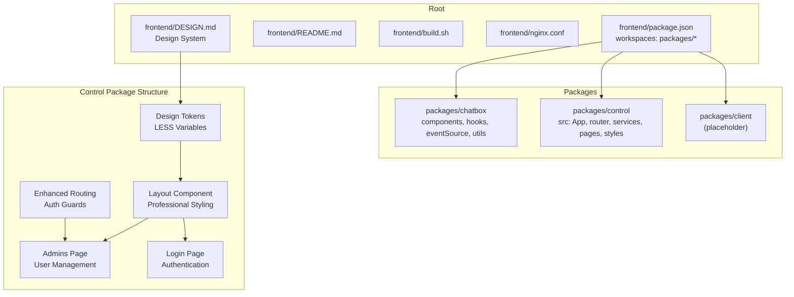
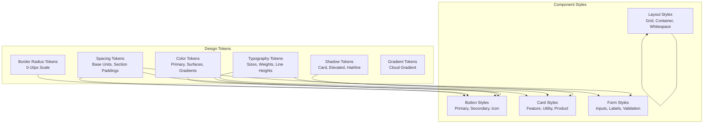
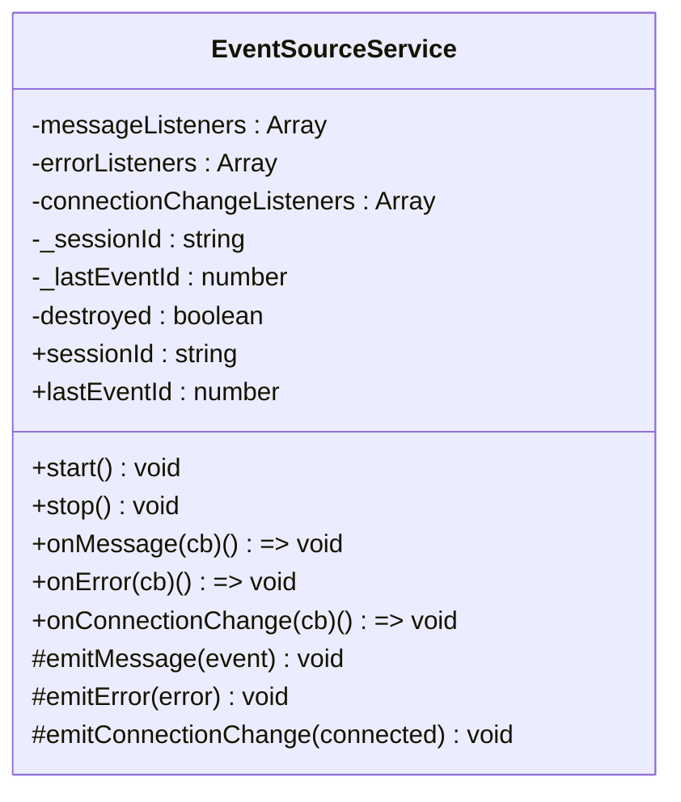
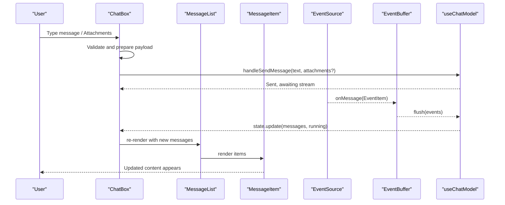
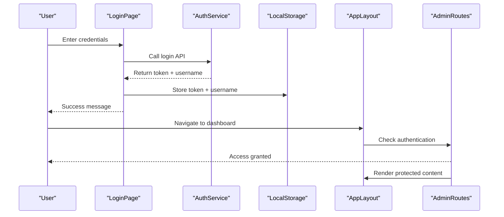
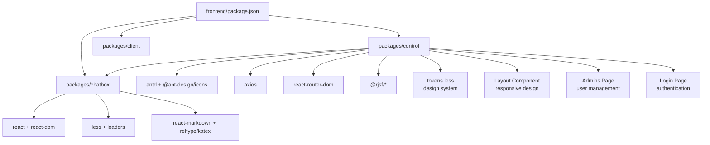
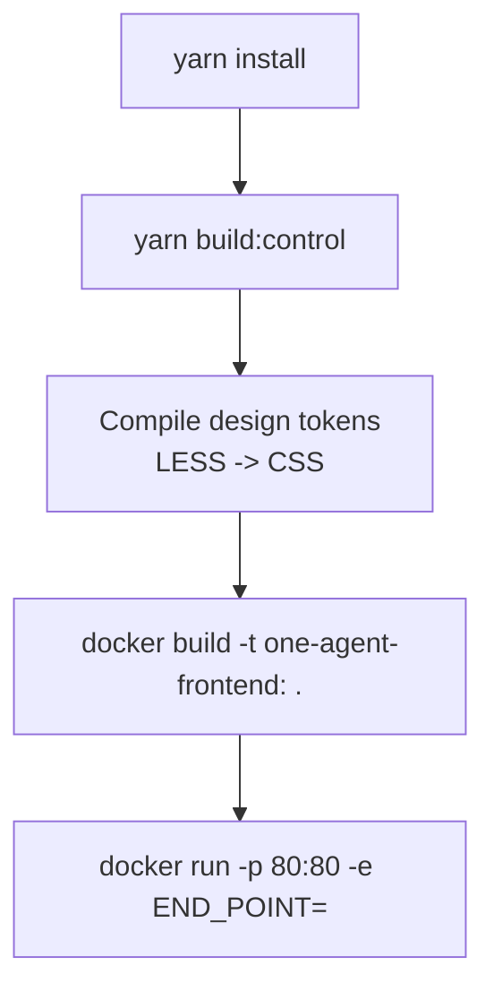

# Frontend Architecture

<cite>
**Referenced Files in This Document**
- [package.json](file://frontend/package.json)
- [README.md](file://frontend/README.md)
- [build.sh](file://frontend/build.sh)
- [nginx.conf](file://frontend/nginx.conf)
- [DESIGN.md](file://frontend/DESIGN.md)
- [packages/chatbox/index.ts](file://frontend/packages/chatbox/index.ts)
- [packages/chatbox/hooks/useChatModel.ts](file://frontend/packages/chatbox/hooks/useChatModel.ts)
- [packages/chatbox/eventSource/EventSource.ts](file://frontend/packages/chatbox/eventSource/EventSource.ts)
- [packages/chatbox/extends/ChatBox/index.tsx](file://frontend/packages/chatbox/extends/ChatBox/index.tsx)
- [packages/control/package.json](file://frontend/packages/control/package.json)
- [packages/control/src/App.tsx](file://frontend/packages/control/src/App.tsx)
- [packages/control/src/components/Layout/index.tsx](file://frontend/packages/control/src/components/Layout/index.tsx)
- [packages/control/src/components/Layout/index.module.less](file://frontend/packages/control/src/components/Layout/index.module.less)
- [packages/control/src/styles/tokens.less](file://frontend/packages/control/src/styles/tokens.less)
- [packages/control/src/config/theme.ts](file://frontend/packages/control/src/config/theme.ts)
- [packages/control/src/router/index.tsx](file://frontend/packages/control/src/router/index.tsx)
- [packages/control/src/pages/Admins/index.tsx](file://frontend/packages/control/src/pages/Admins/index.tsx)
- [packages/control/src/pages/Login/index.tsx](file://frontend/packages/control/src/pages/Login/index.tsx)
- [packages/control/src/services/admin.ts](file://frontend/packages/control/src/services/admin.ts)
- [packages/control/src/types/admin.interface.ts](file://frontend/packages/control/src/types/admin.interface.ts)
</cite>

## Update Summary
**Changes Made**
- Added comprehensive design system documentation with Alibaba Cloud design tokens
- Documented new Admins page with user management functionality
- Added Login page with professional styling and authentication flow
- Enhanced control panel layout with responsive design and professional styling
- Updated routing system with authentication guards and enhanced admin functionality
- Added design tokens system for consistent theming across components
- Documented professional control panel styling with gradient backgrounds and card-based layouts

## Table of Contents
1. [Introduction](#introduction)
2. [Project Structure](#project-structure)
3. [Design System and Tokens](#design-system-and-tokens)
4. [Core Components](#core-components)
5. [Architecture Overview](#architecture-overview)
6. [Detailed Component Analysis](#detailed-component-analysis)
7. [Admin Interface and Authentication](#admin-interface-and-authentication)
8. [Dependency Analysis](#dependency-analysis)
9. [Performance Considerations](#performance-considerations)
10. [Troubleshooting Guide](#troubleshooting-guide)
11. [Conclusion](#conclusion)
12. [Appendices](#appendices)

## Introduction
This document describes the Tron OneAgent frontend architecture. It is a React-based, TypeScript-powered workspace composed of three packages:
- chatbox: A reusable chat component library with event-driven streaming capabilities
- control: A comprehensive admin console application with professional design system, user management, and authentication
- client: Placeholder for future client-side integrations (not present in current structure)

The frontend features a complete redesign with a professional design system, responsive layouts, and comprehensive admin interface. The control application now includes user management, login functionality, and enhanced routing with authentication guards. The architecture integrates with backend APIs and WebSocket/SSE endpoints to power real-time, streaming conversations. It uses Yarn workspaces for monorepo management, Webpack for builds, Docker for containerization, and Nginx for production deployment.

## Project Structure
The frontend workspace is organized as a Yarn monorepo with three packages, featuring a comprehensive design system and professional admin interface:
- Root: workspace configuration and shared scripts
- packages/chatbox: chat UI components, event sources, hooks, and utilities
- packages/control: React application for agent management, user administration, and debugging
- packages/client: empty placeholder for future client-side features



**Diagram sources**
- [package.json:1-17](file://frontend/package.json#L1-L17)
- [DESIGN.md:1-646](file://frontend/DESIGN.md#L1-L646)
- [packages/control/src/components/Layout/index.tsx:1-162](file://frontend/packages/control/src/components/Layout/index.tsx#L1-L162)
- [packages/control/src/pages/Admins/index.tsx:1-250](file://frontend/packages/control/src/pages/Admins/index.tsx#L1-L250)
- [packages/control/src/pages/Login/index.tsx:1-96](file://frontend/packages/control/src/pages/Login/index.tsx#L1-L96)

**Section sources**
- [package.json:1-17](file://frontend/package.json#L1-L17)
- [DESIGN.md:1-646](file://frontend/DESIGN.md#L1-L646)

## Design System and Tokens

### Comprehensive Design System
The frontend implements a complete Alibaba Cloud design system with professional design tokens, responsive layouts, and consistent theming across all components.

**Design System Features:**
- **Color System**: Primary Cloud Blue (#1677ff), gradient atmospheres (blue→purple), surface tones (canvas, parchment, tiles)
- **Typography Scale**: Display sizes 56px-24px, body text 14px, consistent with PingFang SC/Microsoft YaHei
- **Spacing System**: 8px base unit with tokens for xxs-xs-sm-md-lg-xl-xxl-section
- **Border Radius Scale**: 0-16px with rounded.md (8px) as primary action radius
- **Component Tokens**: Buttons, cards, forms, navigation with consistent styling
- **Responsive Breakpoints**: 419px-1440px with progressive disclosure

**Design Tokens Implementation:**
- Centralized LESS variables in tokens.less
- Direct mapping to DESIGN.md specifications
- Consistent color, typography, and spacing tokens
- Gradient tokens for Cloud Gradient backgrounds
- Shadow tokens for card elevation



**Diagram sources**
- [packages/control/src/styles/tokens.less:1-121](file://frontend/packages/control/src/styles/tokens.less#L1-L121)
- [DESIGN.md:6-313](file://frontend/DESIGN.md#L6-L313)

**Section sources**
- [DESIGN.md:1-646](file://frontend/DESIGN.md#L1-L646)
- [packages/control/src/styles/tokens.less:1-121](file://frontend/packages/control/src/styles/tokens.less#L1-L121)

## Core Components
- chatbox package exports:
  - UI components: MessageItem, MessageList, TextContent, ActionContent, TaskContent, HitlContent
  - Hooks: useChatModel, useEventSource, useTTS
  - Event infrastructure: EventSource base class and implementations (Polling, SSE, WebSocket)
  - Utilities: event buffering and message update helpers
  - Extension surface: ChatBox component and service configuration

- control package now includes:
  - Professional layout system with responsive design
  - Admin management interface with user CRUD operations
  - Login authentication with token-based security
  - Enhanced routing with authentication guards
  - Design system integration with tokens.less
  - Theme configuration system
  - Comprehensive admin services and interfaces

- client package remains empty and reserved for future use.

**Section sources**
- [packages/chatbox/index.ts:1-36](file://frontend/packages/chatbox/index.ts#L1-L36)
- [packages/control/package.json:1-60](file://frontend/packages/control/package.json#L1-L60)
- [packages/control/src/pages/Admins/index.tsx:1-250](file://frontend/packages/control/src/pages/Admins/index.tsx#L1-L250)
- [packages/control/src/pages/Login/index.tsx:1-96](file://frontend/packages/control/src/pages/Login/index.tsx#L1-L96)

## Architecture Overview
The frontend architecture centers on a streaming-first chat experience powered by event sources and a reactive model, enhanced by a comprehensive design system and professional admin interface. The control application now features user management, authentication, and responsive design with gradient backgrounds and card-based layouts.

```mermaid
graph TB
subgraph "Control App with Design System"
C_App["App.tsx<br/>ConfigProvider + Router"]
C_Layout["Layout Component<br/>Professional Styling"]
C_Router["Enhanced Router<br/>Auth Guards + Admin Routes"]
C_Admin["Admins Page<br/>User Management"]
C_Login["Login Page<br/>Authentication"]
C_Theme["Theme Config<br/>Local Storage"]
C_Tokens["Design Tokens<br/>LESS Variables"]
end
subgraph "Chatbox Library"
CB_Index["index.ts exports"]
CB_Hooks["useChatModel.ts"]
CB_ES["EventSource.ts<br/>SSE/WebSocket/Polling"]
CB_Components["MessageList, MessageItem,<br/>TextContent, ActionContent, TaskContent, HitlContent"]
CB_Ext["ChatBox/index.tsx<br/>Header, Inputs, TTS"]
end
subgraph "Design System Integration"
DS_Colors["Color System<br/>Primary, Surfaces, Gradients"]
DS_Typography["Typography Scale<br/>Display-Body Sizes"]
DS_Spacing["Spacing System<br/>8px Base Unit"]
DS_Layout["Layout System<br/>Grid, Container, Whitespace"]
end
subgraph "Runtime"
WS["Backend SSE/WS endpoints"]
BUF["EventBuffer"]
STATE["useChatModel reducer state"]
end
C_App --> C_Layout
C_Layout --> C_Router
C_Router --> C_Admin
C_Router --> C_Login
C_Admin --> C_Tokens
C_Login --> C_Theme
C_Tokens --> DS_Colors
C_Tokens --> DS_Typography
C_Tokens --> DS_Spacing
C_Tokens --> DS_Layout
CB_Index --> CB_Hooks
CB_Hooks --> CB_ES
CB_ES --> BUF
BUF --> STATE
STATE --> CB_Ext
CB_ES <- --> WS
```

**Diagram sources**
- [packages/control/src/App.tsx:1-49](file://frontend/packages/control/src/App.tsx#L1-L49)
- [packages/control/src/components/Layout/index.tsx:1-162](file://frontend/packages/control/src/components/Layout/index.tsx#L1-L162)
- [packages/control/src/router/index.tsx:1-121](file://frontend/packages/control/src/router/index.tsx#L1-L121)
- [packages/control/src/pages/Admins/index.tsx:1-250](file://frontend/packages/control/src/pages/Admins/index.tsx#L1-L250)
- [packages/control/src/pages/Login/index.tsx:1-96](file://frontend/packages/control/src/pages/Login/index.tsx#L1-L96)
- [packages/chatbox/index.ts:1-36](file://frontend/packages/chatbox/index.ts#L1-L36)
- [packages/chatbox/hooks/useChatModel.ts:1-231](file://frontend/packages/chatbox/hooks/useChatModel.ts#L1-L231)

## Detailed Component Analysis

### State Management with useChatModel
The chat state is managed via a reducer pattern with explicit actions. It supports:
- Initializing from initialData
- Streaming event ingestion via an injected EventSource
- Event buffering to batch updates
- Running/stopped lifecycle tied to agent execution status
- Shadow user message insertion and status updates

Key behaviors:
- Reducer handles patching state, updating message lists from events, adding shadow user messages, and updating their status.
- Event buffer aggregates events and applies them to state periodically.
- Running flag controls whether the EventSource is started or stopped.
- Session ID and last event ID are synchronized with the EventSource to resume streams.


**Diagram sources**
- [packages/chatbox/hooks/useChatModel.ts:44-231](file://frontend/packages/chatbox/hooks/useChatModel.ts#L44-L231)

**Section sources**
- [packages/chatbox/hooks/useChatModel.ts:1-231](file://frontend/packages/chatbox/hooks/useChatModel.ts#L1-L231)

### Event Source Abstraction and Streaming
The EventSourceService defines a common interface for streaming:
- Listeners for messages, errors, and connection state changes
- Session ID and last event ID for resuming streams
- Abstract start/stop methods for concrete implementations

Concrete implementations (as exported by the library) include SSE, WebSocket, and polling variants. The control app injects an EventSource into useChatModel to receive real-time updates.



**Diagram sources**
- [packages/chatbox/eventSource/EventSource.ts:1-90](file://frontend/packages/chatbox/eventSource/EventSource.ts#L1-L90)

**Section sources**
- [packages/chatbox/eventSource/EventSource.ts:1-90](file://frontend/packages/chatbox/eventSource/EventSource.ts#L1-L90)

### ChatBox Component and Real-Time UI Updates
The ChatBox component orchestrates:
- Dynamic input mode selection based on supported content types
- Scroll management with auto-scroll and "back to bottom" affordance
- Integration with message list rendering and optional TTS playback
- Suggestions and HITL (Human-in-the-loop) handling
- Controlled sending flow with disabled states during running or pending HITL

It renders the header, message list, suggestions, and input area, and coordinates with the parent app's message handlers.



**Diagram sources**
- [packages/chatbox/extends/ChatBox/index.tsx:144-252](file://frontend/packages/chatbox/extends/ChatBox/index.tsx#L144-L252)
- [packages/chatbox/hooks/useChatModel.ts:120-178](file://frontend/packages/chatbox/hooks/useChatModel.ts#L120-L178)

**Section sources**
- [packages/chatbox/extends/ChatBox/index.tsx:1-347](file://frontend/packages/chatbox/extends/ChatBox/index.tsx#L1-L347)

## Admin Interface and Authentication

### Professional Control Panel Layout
The control application features a comprehensive layout system with professional styling:
- **Responsive Sidebar Navigation**: Collapsible sidebar with gradient backgrounds and hover effects
- **Header with User Controls**: User profile display and logout functionality
- **Content Area with Card Design**: Main content area styled as a card with shadows and rounded corners
- **Professional Color Scheme**: Cloud Blue primary color with gradient accents
- **Consistent Typography**: PingFang SC/Microsoft YaHei with proper hierarchy

**Layout Features:**
- Ant Design Layout components with custom styling
- Responsive breakpoint handling (834px for sidebar collapse)
- Gradient backgrounds for visual appeal
- Card-based content containers with shadows
- Consistent spacing and typography tokens

### Enhanced Admin Management
The Admins page provides comprehensive user management functionality:
- **User Listing**: Table view with username and creation date
- **User Creation**: Modal form for adding new administrators
- **Password Management**: Individual password reset functionality
- **User Deletion**: Confirmation dialog with safety checks
- **Real-time Updates**: Automatic refresh after CRUD operations

**Admin Functionality:**
- RESTful API integration for admin operations
- Form validation and error handling
- Modal dialogs for user interactions
- Loading states and success notifications
- Security restrictions (admin account protection)

### Professional Login System
The Login page features a clean, professional design:
- **Card-based Layout**: Centralized login form in styled card
- **Brand Identity**: Tron OneAgent branding with subtitle
- **Form Validation**: Ant Design form with validation rules
- **Loading States**: Visual feedback during authentication
- **Success/Error Messaging**: User-friendly notifications

**Login Features:**
- Username/password authentication
- Token-based session management
- Redirect to agents page on successful login
- Error handling and user feedback
- Responsive form sizing

### Enhanced Routing and Authentication
The routing system now includes comprehensive authentication:
- **Authentication Guards**: Route protection for admin pages
- **Login Redirect**: Automatic redirect to login for unauthenticated users
- **Hash Router**: Client-side routing with hash history
- **Nested Layout**: Shared layout for authenticated routes
- **Dynamic Navigation**: Menu items based on available routes

**Routing Features:**
- Protected routes with AuthGuard component
- Nested routing with AppLayout wrapper
- Hash-based routing for static hosting
- Automatic redirects and fallback routes
- Menu item synchronization with active routes



**Diagram sources**
- [packages/control/src/pages/Login/index.tsx:1-96](file://frontend/packages/control/src/pages/Login/index.tsx#L1-L96)
- [packages/control/src/router/index.tsx:1-121](file://frontend/packages/control/src/router/index.tsx#L1-L121)
- [packages/control/src/components/Layout/index.tsx:1-162](file://frontend/packages/control/src/components/Layout/index.tsx#L1-L162)

**Section sources**
- [packages/control/src/components/Layout/index.tsx:1-162](file://frontend/packages/control/src/components/Layout/index.tsx#L1-L162)
- [packages/control/src/pages/Admins/index.tsx:1-250](file://frontend/packages/control/src/pages/Admins/index.tsx#L1-L250)
- [packages/control/src/pages/Login/index.tsx:1-96](file://frontend/packages/control/src/pages/Login/index.tsx#L1-L96)
- [packages/control/src/router/index.tsx:1-121](file://frontend/packages/control/src/router/index.tsx#L1-L121)
- [packages/control/src/services/admin.ts:1-28](file://frontend/packages/control/src/services/admin.ts#L1-L28)
- [packages/control/src/types/admin.interface.ts:1-41](file://frontend/packages/control/src/types/admin.interface.ts#L1-L41)

## Dependency Analysis
- Root workspace depends on:
  - Yarn workspaces for package management
  - Scripts to run dev/build for the control package
- chatbox package exports:
  - Types, hooks, event sources, and components
  - Utility for updating messages by events
- control package now includes:
  - Professional design system with tokens.less
  - Enhanced admin services and interfaces
  - Authentication utilities and guards
  - Theme configuration system
  - Responsive layout components
  - Comprehensive styling with LESS modules



**Diagram sources**
- [package.json:1-17](file://frontend/package.json#L1-L17)
- [packages/control/package.json:1-60](file://frontend/packages/control/package.json#L1-L60)
- [packages/control/src/styles/tokens.less:1-121](file://frontend/packages/control/src/styles/tokens.less#L1-L121)

**Section sources**
- [package.json:1-17](file://frontend/package.json#L1-L17)
- [packages/control/package.json:1-60](file://frontend/packages/control/package.json#L1-L60)

## Performance Considerations
- Event buffering: Events are aggregated and applied in batches to reduce render churn and improve throughput.
- Auto-scroll throttling: Scroll position checks are throttled to avoid excessive layout recalculations.
- Conditional rendering: Multi-mode input toggles based on supported content types to minimize unnecessary DOM nodes.
- Lazy initialization: EventBuffer and other resources are lazily created to defer cost until needed.
- Design system optimization: Centralized tokens reduce CSS duplication and improve maintainability.
- Responsive design: Progressive disclosure reduces complexity on smaller screens.
- Build optimization: Webpack-based control app builds for production with design tokens compilation.

## Troubleshooting Guide
- Cross-origin issues: Configure development proxy in the control app's dev server to route /api and /chatApi to the backend host.
- SSE/WebSocket connectivity: Verify Nginx proxy settings for /api/ and /chatApi/, ensuring upgrade headers and disabling proxy buffering for SSE.
- Service configuration: Use the chatbox service configuration mechanism to set API prefix, origin, and authorization headers.
- Design system conflicts: Ensure tokens.less is properly imported and compiled before component styles.
- Authentication issues: Verify token storage and retrieval in localStorage for theme and auth persistence.
- Responsive layout problems: Check breakpoint values and media queries in layout components.
- Service configuration: Use the chatbox service configuration mechanism to set API prefix, origin, and authorization headers.
- Locale and i18n: Set locale via chatbox utilities to match UI text expectations.
- Docker/Nginx deployment: Use the provided build script to install dependencies, build the control app, and produce a Docker image; run with END_POINT pointing to the backend.

**Section sources**
- [README.md:252-279](file://frontend/README.md#L252-L279)
- [nginx.conf:42-69](file://frontend/nginx.conf#L42-L69)
- [build.sh:52-80](file://frontend/build.sh#L52-L80)

## Conclusion
The Tron OneAgent frontend is a modular, streaming-first React application built with Yarn workspaces and enhanced by a comprehensive design system. The chatbox library encapsulates real-time event handling, buffering, and rendering, while the control application now features professional user management, authentication, and responsive design with gradient backgrounds and card-based layouts. The architecture leverages modern tooling (Webpack, TypeScript, Ant Design), robust real-time transports (SSE/WebSocket), comprehensive design tokens, and containerized deployment (Docker + Nginx) to deliver a professional, extensible, and maintainable experience.

## Appendices

### Build and Deployment Workflow
- Install dependencies and build the control app with design system
- Produce a Docker image tagged with the package version or a custom tag
- Run the container and configure END_POINT to point to the backend



**Diagram sources**
- [build.sh:52-80](file://frontend/build.sh#L52-L80)

**Section sources**
- [build.sh:1-80](file://frontend/build.sh#L1-L80)
- [README.md:172-201](file://frontend/README.md#L172-L201)

### Nginx Proxy Configuration Notes
- API proxy: /api/ forwards to the backend host with WebSocket upgrade support
- SSE proxy: /chatApi/ requires disabling proxy buffering and setting long read timeouts
- Static routing: /control/ serves SPA routes via index.html fallback
- Design system assets: Ensure proper caching headers for compiled CSS from tokens

**Section sources**
- [nginx.conf:42-76](file://frontend/nginx.conf#L42-L76)

### Extending Chat Components and Integrating Services
- Extend ChatBox: customize header, input, and markdown components via props; integrate TTS and voice input
- Integrate services: configure API base URL, origin, and headers using the chatbox service configuration utility
- Add new content types: adjust supportInputTypes to toggle multi-mode input and render appropriate attachments
- Design system integration: use tokens.less variables for consistent theming across custom components
- Admin interface extensions: leverage existing admin services and interfaces for new management features

**Section sources**
- [README.md:103-123](file://frontend/README.md#L103-L123)
- [README.md:156-170](file://frontend/README.md#L156-L170)
- [packages/chatbox/extends/ChatBox/index.tsx:112-120](file://frontend/packages/chatbox/extends/ChatBox/index.tsx#L112-L120)
- [packages/control/src/styles/tokens.less:1-121](file://frontend/packages/control/src/styles/tokens.less#L1-L121)

### Design System Implementation Guide
- **Color Usage**: Use primary (#1677ff) for all interactive elements, gradients for hero sections
- **Typography**: Maintain zero letter-spacing for display sizes, 14px body text
- **Spacing**: Follow 8px base unit system for consistent layout
- **Components**: Implement button-primary, feature-card variants, and form components using tokens
- **Responsive**: Apply breakpoints from tokens.less for mobile-first design
- **Theming**: Store theme preferences in localStorage using theme.ts configuration

**Section sources**
- [DESIGN.md:315-646](file://frontend/DESIGN.md#L315-L646)
- [packages/control/src/styles/tokens.less:1-121](file://frontend/packages/control/src/styles/tokens.less#L1-L121)
- [packages/control/src/config/theme.ts:1-45](file://frontend/packages/control/src/config/theme.ts#L1-L45)