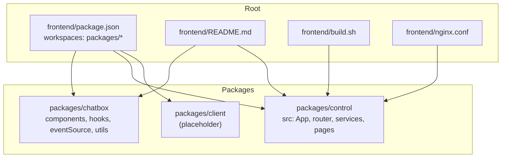
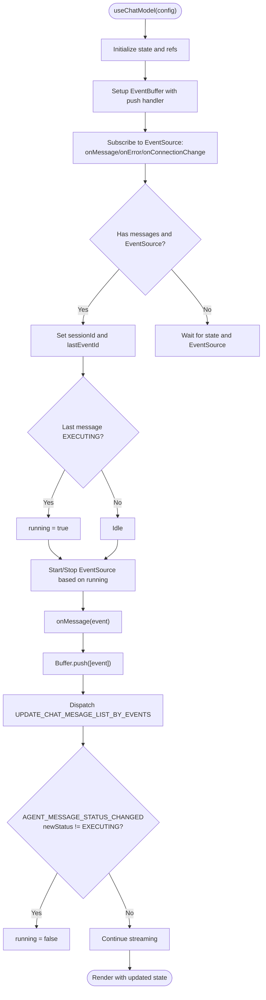
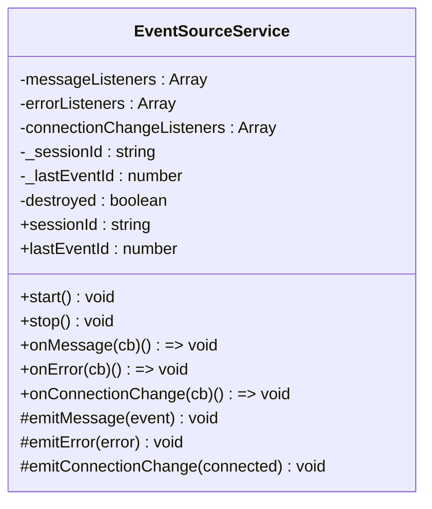
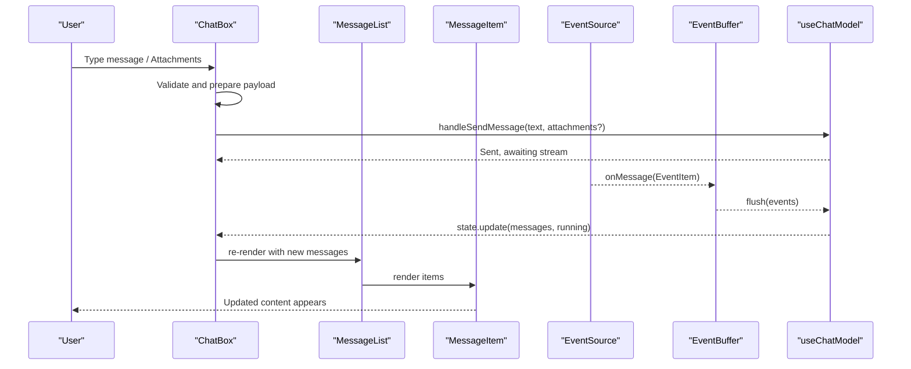
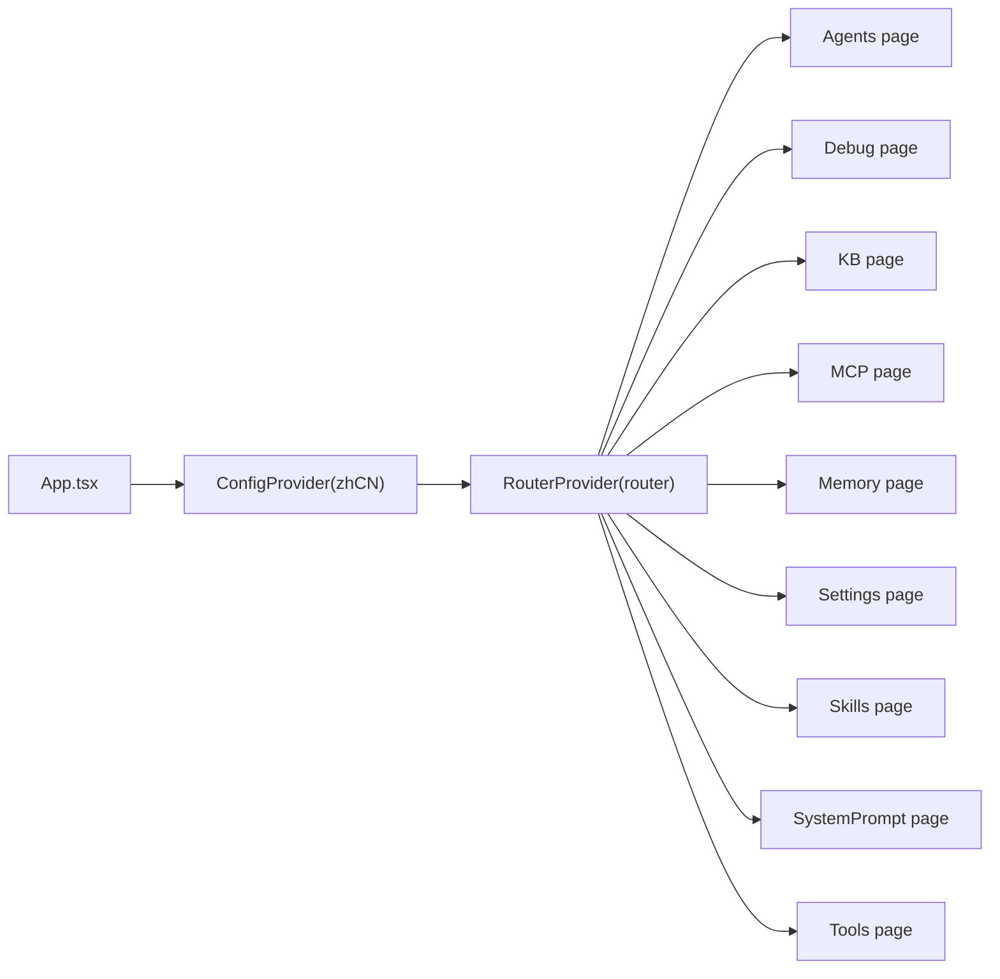
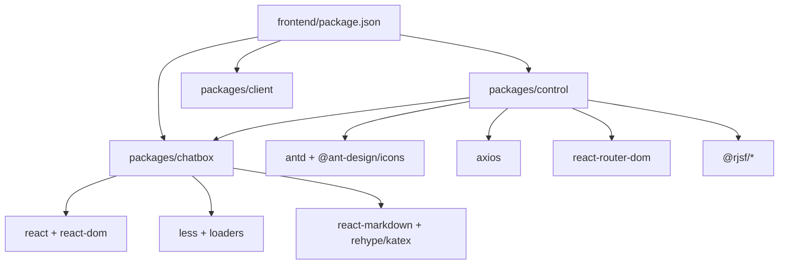
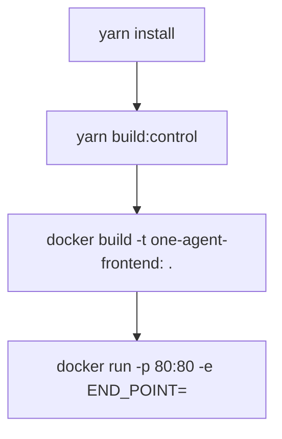

# Frontend Architecture

<cite>
**Referenced Files in This Document**
- [package.json](file://frontend/package.json)
- [README.md](file://frontend/README.md)
- [build.sh](file://frontend/build.sh)
- [nginx.conf](file://frontend/nginx.conf)
- [packages/chatbox/index.ts](file://frontend/packages/chatbox/index.ts)
- [packages/chatbox/hooks/useChatModel.ts](file://frontend/packages/chatbox/hooks/useChatModel.ts)
- [packages/chatbox/eventSource/EventSource.ts](file://frontend/packages/chatbox/eventSource/EventSource.ts)
- [packages/chatbox/extends/ChatBox/index.tsx](file://frontend/packages/chatbox/extends/ChatBox/index.tsx)
- [packages/control/package.json](file://frontend/packages/control/package.json)
- [packages/control/src/App.tsx](file://frontend/packages/control/src/App.tsx)
</cite>

## Table of Contents
1. [Introduction](#introduction)
2. [Project Structure](#project-structure)
3. [Core Components](#core-components)
4. [Architecture Overview](#architecture-overview)
5. [Detailed Component Analysis](#detailed-component-analysis)
6. [Dependency Analysis](#dependency-analysis)
7. [Performance Considerations](#performance-considerations)
8. [Troubleshooting Guide](#troubleshooting-guide)
9. [Conclusion](#conclusion)
10. [Appendices](#appendices)

## Introduction
This document describes the Tron OneAgent frontend architecture. It is a React-based, TypeScript-powered workspace composed of three packages:
- chatbox: A reusable chat component library with event-driven streaming capabilities
- control: A console application for agent configuration, debugging, and management
- client: Placeholder for future client-side integrations (not present in current structure)

The frontend integrates with backend APIs and WebSocket/SSE endpoints to power real-time, streaming conversations. It uses Yarn workspaces for monorepo management, Webpack for builds, Docker for containerization, and Nginx for production deployment. The document also covers state management patterns, real-time update mechanisms, extension points, and operational guidance.

## Project Structure
The frontend workspace is organized as a Yarn monorepo with three packages:
- Root: workspace configuration and shared scripts
- packages/chatbox: chat UI components, event sources, hooks, and utilities
- packages/control: React application for agent management and debugging
- packages/client: empty placeholder for future client-side features



**Diagram sources**
- [package.json:1-12](file://frontend/package.json#L1-L12)
- [README.md:1-279](file://frontend/README.md#L1-L279)
- [build.sh:1-80](file://frontend/build.sh#L1-L80)
- [nginx.conf:1-78](file://frontend/nginx.conf#L1-L78)

**Section sources**
- [package.json:1-12](file://frontend/package.json#L1-L12)
- [README.md:1-279](file://frontend/README.md#L1-L279)

## Core Components
- chatbox package exports:
  - UI components: MessageItem, MessageList, TextContent, ActionContent, TaskContent, HitlContent
  - Hooks: useChatModel, useEventSource, useTTS
  - Event infrastructure: EventSource base class and implementations (Polling, SSE, WebSocket)
  - Utilities: event buffering and message update helpers
  - Extension surface: ChatBox component and service configuration

- control package dependencies include:
  - React, React DOM, React Router
  - Ant Design and related UI libraries
  - Form schema framework (React JSON Schema Form)
  - HTTP client (Axios)
  - chatbox as a local dependency

- client package is currently empty and reserved for future use.

**Section sources**
- [packages/chatbox/index.ts:1-36](file://frontend/packages/chatbox/index.ts#L1-L36)
- [packages/control/package.json:1-60](file://frontend/packages/control/package.json#L1-L60)

## Architecture Overview
The frontend architecture centers on a streaming-first chat experience powered by event sources and a reactive model. The control application composes chatbox components to render sessions and manage agent configurations. Real-time updates are delivered via SSE/WebSocket, buffered and batched for performance, and rendered incrementally.

```mermaid
graph TB
subgraph "Control App"
C_App["App.tsx<br/>ConfigProvider + Router"]
C_Router["Router + Pages"]
C_Services["Services (agent, kb, mcp, memory, skill, tools)"]
end
subgraph "Chatbox Library"
CB_Index["index.ts exports"]
CB_Hooks["useChatModel.ts"]
CB_ES["EventSource.ts<br/>SSE/WebSocket/Polling"]
CB_Components["MessageList, MessageItem,<br/>TextContent, ActionContent, TaskContent, HitlContent"]
CB_Ext["ChatBox/index.tsx<br/>Header, Inputs, TTS"]
end
subgraph "Runtime"
WS["Backend SSE/WS endpoints"]
BUF["EventBuffer"]
STATE["useChatModel reducer state"]
end
C_App --> C_Router
C_Router --> C_Services
C_Services --> CB_Hooks
CB_Index --> CB_Hooks
CB_Hooks --> CB_ES
CB_ES --> BUF
BUF --> STATE
STATE --> CB_Ext
CB_Ext --> CB_Components
CB_ES <- --> WS
```

**Diagram sources**
- [packages/control/src/App.tsx:1-34](file://frontend/packages/control/src/App.tsx#L1-L34)
- [packages/chatbox/index.ts:1-36](file://frontend/packages/chatbox/index.ts#L1-L36)
- [packages/chatbox/hooks/useChatModel.ts:1-231](file://frontend/packages/chatbox/hooks/useChatModel.ts#L1-L231)
- [packages/chatbox/eventSource/EventSource.ts:1-90](file://frontend/packages/chatbox/eventSource/EventSource.ts#L1-L90)
- [packages/chatbox/extends/ChatBox/index.tsx:1-347](file://frontend/packages/chatbox/extends/ChatBox/index.tsx#L1-L347)

## Detailed Component Analysis

### State Management with useChatModel
The chat state is managed via a reducer pattern with explicit actions. It supports:
- Initializing from initialData
- Streaming event ingestion via an injected EventSource
- Event buffering to batch updates
- Running/stopped lifecycle tied to agent execution status
- Shadow user message insertion and status updates

Key behaviors:
- Reducer handles patching state, updating message lists from events, adding shadow user messages, and updating their status.
- Event buffer aggregates events and applies them to state periodically.
- Running flag controls whether the EventSource is started or stopped.
- Session ID and last event ID are synchronized with the EventSource to resume streams.



**Diagram sources**
- [packages/chatbox/hooks/useChatModel.ts:44-231](file://frontend/packages/chatbox/hooks/useChatModel.ts#L44-L231)

**Section sources**
- [packages/chatbox/hooks/useChatModel.ts:1-231](file://frontend/packages/chatbox/hooks/useChatModel.ts#L1-L231)

### Event Source Abstraction and Streaming
The EventSourceService defines a common interface for streaming:
- Listeners for messages, errors, and connection state changes
- Session ID and last event ID for resuming streams
- Abstract start/stop methods for concrete implementations

Concrete implementations (as exported by the library) include SSE, WebSocket, and polling variants. The control app injects an EventSource into useChatModel to receive real-time updates.



**Diagram sources**
- [packages/chatbox/eventSource/EventSource.ts:1-90](file://frontend/packages/chatbox/eventSource/EventSource.ts#L1-L90)

**Section sources**
- [packages/chatbox/eventSource/EventSource.ts:1-90](file://frontend/packages/chatbox/eventSource/EventSource.ts#L1-L90)

### ChatBox Component and Real-Time UI Updates
The ChatBox component orchestrates:
- Dynamic input mode selection based on supported content types
- Scroll management with auto-scroll and “back to bottom” affordance
- Integration with message list rendering and optional TTS playback
- Suggestions and HITL (Human-in-the-loop) handling
- Controlled sending flow with disabled states during running or pending HITL

It renders the header, message list, suggestions, and input area, and coordinates with the parent app’s message handlers.



**Diagram sources**
- [packages/chatbox/extends/ChatBox/index.tsx:144-252](file://frontend/packages/chatbox/extends/ChatBox/index.tsx#L144-L252)
- [packages/chatbox/hooks/useChatModel.ts:120-178](file://frontend/packages/chatbox/hooks/useChatModel.ts#L120-L178)

**Section sources**
- [packages/chatbox/extends/ChatBox/index.tsx:1-347](file://frontend/packages/chatbox/extends/ChatBox/index.tsx#L1-L347)

### Control Application Composition
The control application sets up:
- Ant Design localization and global styles
- Routing to various management pages (Agents, Debug, KB, MCP, Memory, Settings, Skills, SystemPrompt, Tools)
- Services for interacting with backend APIs (agent, kb, mcp, memory, skill, tools)
- Integration with chatbox components for live session views



**Diagram sources**
- [packages/control/src/App.tsx:1-34](file://frontend/packages/control/src/App.tsx#L1-L34)

**Section sources**
- [packages/control/src/App.tsx:1-34](file://frontend/packages/control/src/App.tsx#L1-L34)

## Dependency Analysis
- Root workspace depends on:
  - Yarn workspaces for package management
  - Scripts to run dev/build for the control package
- chatbox package exports:
  - Types, hooks, event sources, and components
  - Utility for updating messages by events
- control package depends on:
  - Ant Design ecosystem
  - chatbox as a local dependency
  - Axios for HTTP requests
  - React Router for navigation
  - JSON Schema Form for configuration UIs



**Diagram sources**
- [package.json:1-12](file://frontend/package.json#L1-L12)
- [packages/control/package.json:1-60](file://frontend/packages/control/package.json#L1-L60)

**Section sources**
- [package.json:1-12](file://frontend/package.json#L1-L12)
- [packages/control/package.json:1-60](file://frontend/packages/control/package.json#L1-L60)

## Performance Considerations
- Event buffering: Events are aggregated and applied in batches to reduce render churn and improve throughput.
- Auto-scroll throttling: Scroll position checks are throttled to avoid excessive layout recalculations.
- Conditional rendering: Multi-mode input toggles based on supported content types to minimize unnecessary DOM nodes.
- Lazy initialization: EventBuffer and other resources are lazily created to defer cost until needed.
- Build optimization: Webpack-based control app builds for production; consider code splitting and asset optimization for larger apps.

[No sources needed since this section provides general guidance]

## Troubleshooting Guide
- Cross-origin issues: Configure development proxy in the control app’s dev server to route /api and /chatApi to the backend host.
- SSE/WebSocket connectivity: Verify Nginx proxy settings for /api/ and /chatApi/, ensuring upgrade headers and disabling proxy buffering for SSE.
- Service configuration: Use the chatbox service configuration mechanism to set API prefix, origin, and authorization headers.
- Locale and i18n: Set locale via chatbox utilities to match UI text expectations.
- Docker/Nginx deployment: Use the provided build script to install dependencies, build the control app, and produce a Docker image; run with END_POINT pointing to the backend.

**Section sources**
- [README.md:252-279](file://frontend/README.md#L252-L279)
- [nginx.conf:42-69](file://frontend/nginx.conf#L42-L69)
- [build.sh:52-80](file://frontend/build.sh#L52-L80)

## Conclusion
The Tron OneAgent frontend is a modular, streaming-first React application built with Yarn workspaces. The chatbox library encapsulates real-time event handling, buffering, and rendering, while the control application composes these building blocks into a comprehensive management UI. The stack leverages modern tooling (Webpack, TypeScript, Ant Design), robust real-time transports (SSE/WebSocket), and containerized deployment (Docker + Nginx) to deliver a responsive, extensible experience.

[No sources needed since this section summarizes without analyzing specific files]

## Appendices

### Build and Deployment Workflow
- Install dependencies and build the control app
- Produce a Docker image tagged with the package version or a custom tag
- Run the container and configure END_POINT to point to the backend



**Diagram sources**
- [build.sh:52-80](file://frontend/build.sh#L52-L80)

**Section sources**
- [build.sh:1-80](file://frontend/build.sh#L1-L80)
- [README.md:172-201](file://frontend/README.md#L172-L201)

### Nginx Proxy Configuration Notes
- API proxy: /api/ forwards to the backend host with WebSocket upgrade support
- SSE proxy: /chatApi/ requires disabling proxy buffering and setting long read timeouts
- Static routing: /control/ serves SPA routes via index.html fallback

**Section sources**
- [nginx.conf:42-76](file://frontend/nginx.conf#L42-L76)

### Extending Chat Components and Integrating Services
- Extend ChatBox: customize header, input, and markdown components via props; integrate TTS and voice input
- Integrate services: configure API base URL, origin, and headers using the chatbox service configuration utility
- Add new content types: adjust supportInputTypes to toggle multi-mode input and render appropriate attachments

**Section sources**
- [README.md:103-123](file://frontend/README.md#L103-L123)
- [README.md:156-170](file://frontend/README.md#L156-L170)
- [packages/chatbox/extends/ChatBox/index.tsx:112-120](file://frontend/packages/chatbox/extends/ChatBox/index.tsx#L112-L120)