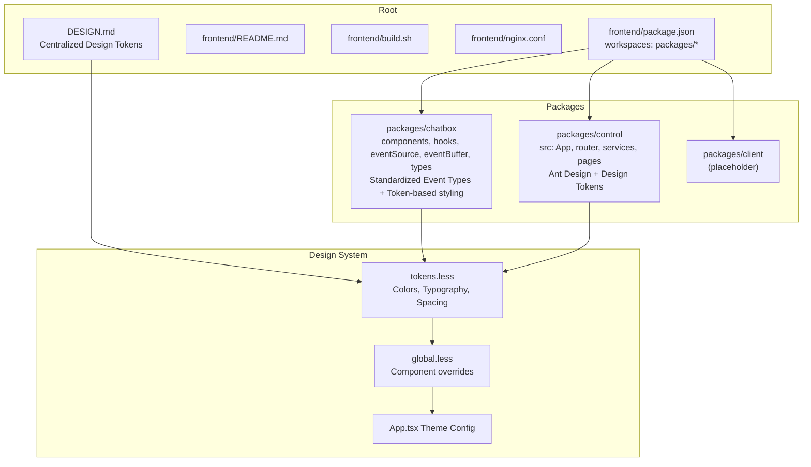
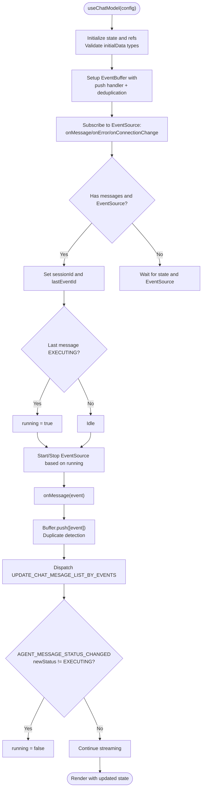
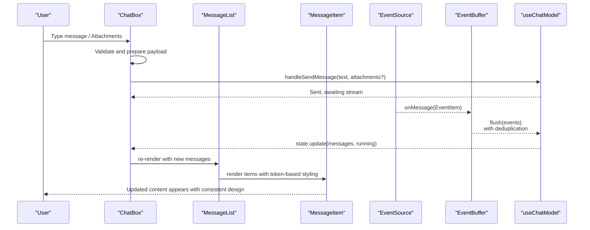
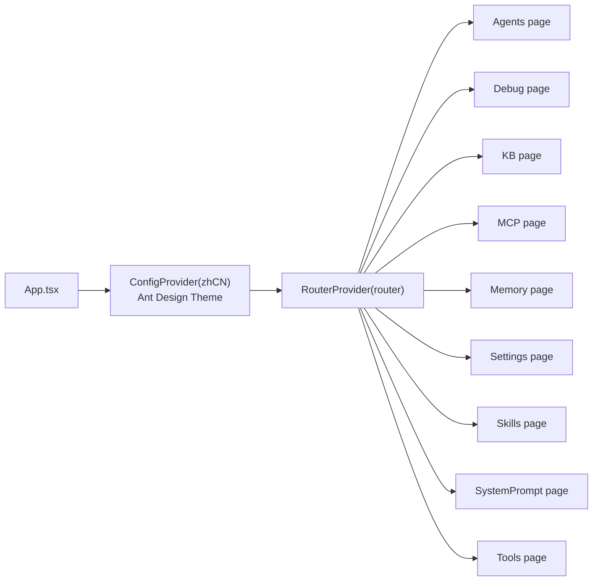
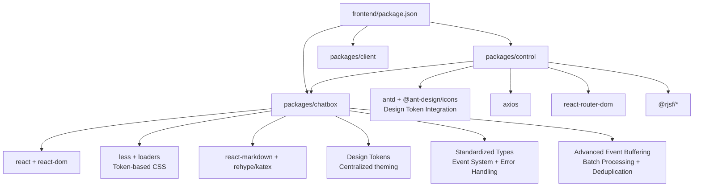
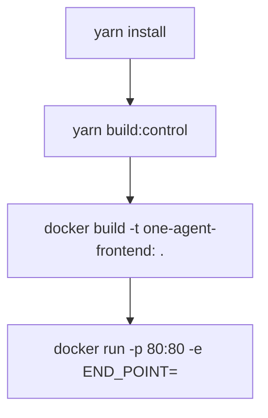

# Frontend Architecture

<cite>
**Referenced Files in This Document**
- [package.json](file://frontend/package.json)
- [README.md](file://frontend/README.md)
- [build.sh](file://frontend/build.sh)
- [nginx.conf](file://frontend/nginx.conf)
- [DESIGN.md](file://frontend/DESIGN.md)
- [packages/chatbox/index.ts](file://frontend/packages/chatbox/index.ts)
- [packages/chatbox/hooks/useChatModel.ts](file://frontend/packages/chatbox/hooks/useChatModel.ts)
- [packages/chatbox/eventSource/EventSource.ts](file://frontend/packages/chatbox/eventSource/EventSource.ts)
- [packages/chatbox/eventSource/SseEventSource.ts](file://frontend/packages/chatbox/eventSource/SseEventSource.ts)
- [packages/chatbox/eventSource/WebSocketEventSource.ts](file://frontend/packages/chatbox/eventSource/WebSocketEventSource.ts)
- [packages/chatbox/eventSource/PollingEventSource.ts](file://frontend/packages/chatbox/eventSource/PollingEventSource.ts)
- [packages/chatbox/eventBuffer/eventbuffer.ts](file://frontend/packages/chatbox/eventBuffer/eventbuffer.ts)
- [packages/chatbox/types/index.ts](file://frontend/packages/chatbox/types/index.ts)
- [packages/chatbox/types/enums.ts](file://frontend/packages/chatbox/types/enums.ts)
- [packages/chatbox/types/base.ts](file://frontend/packages/chatbox/types/base.ts)
- [packages/chatbox/types/chat.ts](file://frontend/packages/chatbox/types/chat.ts)
- [packages/chatbox/types/event.ts](file://frontend/packages/chatbox/types/event.ts)
- [packages/chatbox/extends/ChatBox/index.tsx](file://frontend/packages/chatbox/extends/ChatBox/index.tsx)
- [packages/chatbox/components/MessageItem/index.module.less](file://frontend/packages/chatbox/components/MessageItem/index.module.less)
- [packages/chatbox/extends/ChatBox/MessageInput/index.module.less](file://frontend/packages/chatbox/extends/ChatBox/MessageInput/index.module.less)
- [packages/control/package.json](file://frontend/packages/control/package.json)
- [packages/control/src/App.tsx](file://frontend/packages/control/src/App.tsx)
- [packages/control/src/styles/global.less](file://frontend/packages/control/src/styles/global.less)
- [packages/control/src/styles/tokens.less](file://frontend/packages/control/src/styles/tokens.less)
</cite>

## Update Summary
**Changes Made**
- Enhanced agent service standardization with improved event source abstraction and unified error handling
- Updated component structure with refined real-time communication patterns using standardized event types
- Added comprehensive documentation for standardized ApiResponse objects and improved error handling across frontend services
- Refined streaming conversation architecture with enhanced event buffering and processing capabilities
- Strengthened real-time communication patterns with standardized event item structures

## Table of Contents
1. [Introduction](#introduction)
2. [Project Structure](#project-structure)
3. [Design System and Token Architecture](#design-system-and-token-architecture)
4. [Core Components](#core-components)
5. [Architecture Overview](#architecture-overview)
6. [Enhanced Event System and Communication Patterns](#enhanced-event-system-and-communication-patterns)
7. [Standardized Error Handling and API Responses](#standardized-error-handling-and-api-responses)
8. [Detailed Component Analysis](#detailed-component-analysis)
9. [Dependency Analysis](#dependency-analysis)
10. [Performance Considerations](#performance-considerations)
11. [Troubleshooting Guide](#troubleshooting-guide)
12. [Conclusion](#conclusion)
13. [Appendices](#appendices)

## Introduction
This document describes the Tron OneAgent frontend architecture. It is a React-based, TypeScript-powered workspace composed of three packages:
- chatbox: A reusable chat component library with event-driven streaming capabilities, standardized event types, and centralized design tokens
- control: A console application for agent configuration, debugging, and management with Ant Design integration
- client: Placeholder for future client-side integrations (not present in current structure)

The frontend integrates with backend APIs and WebSocket/SSE endpoints to power real-time, streaming conversations. It uses Yarn workspaces for monorepo management, Webpack for builds, Docker for containerization, and Nginx for production deployment. The architecture now features a comprehensive design system with centralized token management, enhanced event standardization, and improved error handling patterns across all frontend services.

## Project Structure
The frontend workspace is organized as a Yarn monorepo with three packages and a centralized design system:
- Root: workspace configuration and shared scripts
- packages/chatbox: chat UI components, event sources, hooks, utilities, and standardized type definitions with token-based styling
- packages/control: React application for agent management and debugging with Ant Design integration
- packages/client: empty placeholder for future client-side features



**Diagram sources**
- [package.json:1-17](file://frontend/package.json#L1-L17)
- [README.md:1-279](file://frontend/README.md#L1-L279)
- [build.sh:1-80](file://frontend/build.sh#L1-L80)
- [nginx.conf:1-78](file://frontend/nginx.conf#L1-L78)
- [DESIGN.md:1-646](file://frontend/DESIGN.md#L1-L646)
- [packages/control/src/styles/tokens.less:1-106](file://frontend/packages/control/src/styles/tokens.less#L1-L106)
- [packages/control/src/styles/global.less:1-128](file://frontend/packages/control/src/styles/global.less#L1-L128)
- [packages/control/src/App.tsx:25-38](file://frontend/packages/control/src/App.tsx#L25-L38)

**Section sources**
- [package.json:1-17](file://frontend/package.json#L1-L17)
- [README.md:1-279](file://frontend/README.md#L1-L279)
- [DESIGN.md:1-646](file://frontend/DESIGN.md#L1-L646)

## Design System and Token Architecture

### Centralized Token Implementation
The frontend now implements a comprehensive design token system defined in DESIGN.md and implemented through LESS variables:

**Color Tokens**
- Primary brand colors: `#1677ff` (primary), `#4096ff` (focus), `#0958d9` (hover)
- Surface colors: `#ffffff` (canvas), `#f5f7fa` (parchment), `#0a1628` (tile-1)
- Text colors: `#1a1a1a` (ink), `#8c8c8c` (muted)
- Accent colors: `#722ed1` (accent-purple), `#141b2d` (gradient-card-dark)

**Typography Tokens**
- Font family: `"PingFang SC, Microsoft YaHei, Helvetica Neue, system-ui, sans-serif"`
- Font sizes: 56px (hero), 40px (display-lg), 32px (display-md), 24px (lead)
- Font weights: 300 (light), 400 (regular), 500 (medium), 600 (semibold), 700 (bold)
- Line heights: 1.1-1.6 based on context

**Spacing and Border Radius Tokens**
- Spacing units: 4px (xxs), 8px (xs), 12px (sm), 16px (md), 24px (lg), 32px (xl), 48px (xxl)
- Border radius scale: 0px (none), 4px (xs), 6px (sm), 8px (md), 12px (lg), 16px (xl)

**Section sources**
- [DESIGN.md:6-150](file://frontend/DESIGN.md#L6-L150)
- [packages/control/src/styles/tokens.less:1-106](file://frontend/packages/control/src/styles/tokens.less#L1-L106)

### Token-Based Styling Implementation
All components now use token-based values instead of hardcoded CSS:

**MessageItem Component**
- Uses `@color-primary`, `@color-canvas-parchment`, `@radius-lg`, `@spacing-sm` tokens
- Implements responsive design with `@spacing-md` and `@font-size-body` tokens

**MessageInput Component**
- Applies `@color-primary`, `@color-surface-chip-translucent`, `@radius-md` tokens
- Uses `@font-size-body`, `@line-height-body` for consistent typography
- Implements gradient backgrounds with `@color-gradient-card-blue` token

**Section sources**
- [packages/chatbox/components/MessageItem/index.module.less:44-96](file://frontend/packages/chatbox/components/MessageItem/index.module.less#L44-L96)
- [packages/chatbox/extends/ChatBox/MessageInput/index.module.less:18-208](file://frontend/packages/chatbox/extends/ChatBox/MessageInput/index.module.less#L18-L208)

### Ant Design Integration with Design Tokens
The control application integrates Ant Design components with the centralized design system:

**Theme Configuration**
- Centralized theme tokens in App.tsx
- Color primary set to `#1677ff` matching design system
- Typography tokens applied consistently across Ant Design components
- Shadow tokens configured for card elevation

**Global Styles Override**
- Ant Design typography weight normalization
- Button font weight and letter-spacing standardization
- Table, card, and form component typography alignment
- Mobile responsiveness with Ant Design breakpoints

**Section sources**
- [packages/control/src/App.tsx:25-38](file://frontend/packages/control/src/App.tsx#L25-L38)
- [packages/control/src/styles/global.less:34-84](file://frontend/packages/control/src/styles/global.less#L34-L84)

## Core Components
- chatbox package exports:
  - UI components: MessageItem, MessageList, TextContent, ActionContent, TaskContent, HitlContent
  - Hooks: useChatModel, useEventSource, useTTS
  - Event infrastructure: EventSource base class and implementations (Polling, SSE, WebSocket)
  - Event buffering: EventBuff with batch processing and deduplication
  - Type system: Standardized enums, base types, chat state, and event definitions
  - Utilities: event buffering and message update helpers
  - Extension surface: ChatBox component and service configuration
  - **Updated**: All components now use centralized design tokens for consistent theming

- control package dependencies include:
  - React, React DOM, React Router
  - Ant Design and related UI libraries with design token integration
  - Form schema framework (React JSON Schema Form)
  - HTTP client (Axios)
  - chatbox as a local dependency

- client package is currently empty and reserved for future use.

**Section sources**
- [packages/chatbox/index.ts:1-36](file://frontend/packages/chatbox/index.ts#L1-L36)
- [packages/control/package.json:1-60](file://frontend/packages/control/package.json#L1-L60)

## Architecture Overview
The frontend architecture centers on a streaming-first chat experience powered by standardized event sources and a reactive model with centralized design tokens. The control application composes chatbox components with Ant Design integration and design system consistency. Real-time updates are delivered via SSE/WebSocket with enhanced error handling, buffered and batched for performance, and rendered incrementally with token-based styling.

```mermaid
graph TB
subgraph "Control App"
C_App["App.tsx<br/>ConfigProvider + Router<br/>Ant Design Theme"]
C_Router["Router + Pages"]
C_Services["Services (agent, kb, mcp, memory, skill, tools)"]
end
subgraph "Chatbox Library"
CB_Index["index.ts exports"]
CB_Hooks["useChatModel.ts"]
CB_ES["EventSource.ts<br/>SSE/WebSocket/Polling"]
CB_Buffer["EventBuffer.ts<br/>Batch Processing + Deduplication"]
CB_Types["Standardized Types<br/>Enums, Base Types, Events"]
CB_Components["MessageList, MessageItem,<br/>TextContent, ActionContent, TaskContent, HitlContent<br/>Token-based styling"]
CB_Ext["ChatBox/index.tsx<br/>Header, Inputs, TTS"]
end
subgraph "Design System"
DS_Tokens["tokens.less<br/>Centralized tokens"]
DS_Global["global.less<br/>Component overrides"]
DS_AppTheme["App.tsx Theme Config"]
end
subgraph "Runtime"
WS["Backend SSE/WS endpoints"]
BUF["EventBuffer"]
STATE["useChatModel reducer state"]
ERROR["Standardized Error Handling"]
API["ApiResponse Objects"]
end
C_App --> C_Router
C_Router --> C_Services
C_Services --> CB_Hooks
CB_Index --> CB_Hooks
CB_Hooks --> CB_ES
CB_ES --> BUF
BUF --> STATE
STATE --> CB_Ext
CB_Ext --> CB_Components
CB_Components --> DS_Tokens
DS_Tokens --> DS_Global
DS_Global --> DS_AppTheme
CB_ES <- --> WS
CB_Types --> ERROR
CB_Types --> API
```

**Diagram sources**
- [packages/control/src/App.tsx:1-49](file://frontend/packages/control/src/App.tsx#L1-L49)
- [packages/chatbox/index.ts:1-36](file://frontend/packages/chatbox/index.ts#L1-L36)
- [packages/chatbox/hooks/useChatModel.ts:1-231](file://frontend/packages/chatbox/hooks/useChatModel.ts#L1-L231)
- [packages/chatbox/eventSource/EventSource.ts:1-90](file://frontend/packages/chatbox/eventSource/EventSource.ts#L1-L90)
- [packages/chatbox/eventBuffer/eventbuffer.ts:1-122](file://frontend/packages/chatbox/eventBuffer/eventbuffer.ts#L1-L122)
- [packages/chatbox/types/index.ts:1-21](file://frontend/packages/chatbox/types/index.ts#L1-L21)
- [packages/chatbox/extends/ChatBox/index.tsx:1-347](file://frontend/packages/chatbox/extends/ChatBox/index.tsx#L1-L347)
- [packages/control/src/styles/tokens.less:1-106](file://frontend/packages/control/src/styles/tokens.less#L1-L106)
- [packages/control/src/styles/global.less:1-128](file://frontend/packages/control/src/styles/global.less#L1-L128)

## Enhanced Event System and Communication Patterns

### Standardized Event Types and Structures
The chat system now features a comprehensive event type hierarchy with standardized structures:

**Event Type Hierarchy**
- SessionEventType: Defines all possible event categories (session name changes, user input, agent messages, tasks, actions, suggestions)
- SessionMessageStatus: Unified status tracking for all message types
- ContentType: Standardized content types (TEXT, THINKING, IMAGE, VIDEO, AUDIO, HITL, TASK, ACTION)
- TaskStatus and ActionStatus: Consistent status management across all components

**Event Item Standardization**
- All events extend SessionEvent with consistent structure: id, agentId, userId, sessionId, type, gmtCreated
- Event-specific payloads are strongly typed with proper interfaces
- Status change events include completion timestamps and optional error information

**Section sources**
- [packages/chatbox/types/enums.ts:1-70](file://frontend/packages/chatbox/types/enums.ts#L1-L70)
- [packages/chatbox/types/event.ts:1-116](file://frontend/packages/chatbox/types/event.ts#L1-L116)
- [packages/chatbox/types/base.ts:1-125](file://frontend/packages/chatbox/types/base.ts#L1-L125)

### Enhanced Event Source Abstraction
The EventSourceService provides a unified interface for different streaming protocols:

**EventSourceService Interface**
- Abstract base class defining common contract for all event sources
- Session ID and last event ID management for stream resumption
- Standardized listener registration for messages, errors, and connection changes
- Destroyed state management for resource cleanup

**Concrete Implementations**
- SseEventSource: Server-Sent Events with automatic retry and error handling
- WebSocketEventSource: Real-time WebSocket connections with automatic reconnection
- PollingEventSource: Fallback polling mechanism with configurable intervals

**Section sources**
- [packages/chatbox/eventSource/EventSource.ts:1-90](file://frontend/packages/chatbox/eventSource/EventSource.ts#L1-L90)
- [packages/chatbox/eventSource/SseEventSource.ts:1-118](file://frontend/packages/chatbox/eventSource/SseEventSource.ts#L1-L118)
- [packages/chatbox/eventSource/WebSocketEventSource.ts:1-135](file://frontend/packages/chatbox/eventSource/WebSocketEventSource.ts#L1-L135)
- [packages/chatbox/eventSource/PollingEventSource.ts:1-83](file://frontend/packages/chatbox/eventSource/PollingEventSource.ts#L1-L83)

### Advanced Event Buffering and Processing
The EventBuff class provides sophisticated event processing with batching and deduplication:

**Event Buffer Features**
- Batch size configuration for optimal processing performance
- Flush timeout mechanism to prevent event starvation
- Duplicate detection using event ID sets
- Asynchronous processing with error recovery
- Resource cleanup and memory management

**Processing Pipeline**
- Events are filtered for duplicates before processing
- Batching occurs based on configured batch size or flush timeout
- Sequential processing ensures event ordering consistency
- Error handling preserves events for retry attempts

**Section sources**
- [packages/chatbox/eventBuffer/eventbuffer.ts:1-122](file://frontend/packages/chatbox/eventBuffer/eventbuffer.ts#L1-L122)

## Standardized Error Handling and API Responses

### Unified Error Handling Patterns
The enhanced architecture implements standardized error handling across all frontend services:

**Error Propagation**
- EventSource implementations emit standardized error events
- Connection state changes are communicated through dedicated listeners
- Error messages include context-specific information for debugging
- Resource cleanup is handled automatically on error conditions

**API Response Standardization**
- All backend communications follow consistent response patterns
- Error responses include structured error codes and messages
- Success responses provide typed data with proper validation
- Loading states are managed through standardized patterns

**Section sources**
- [packages/chatbox/eventSource/SseEventSource.ts:84-100](file://frontend/packages/chatbox/eventSource/SseEventSource.ts#L84-L100)
- [packages/chatbox/eventSource/WebSocketEventSource.ts:102-110](file://frontend/packages/chatbox/eventSource/WebSocketEventSource.ts#L102-L110)
- [packages/chatbox/eventSource/PollingEventSource.ts:61-63](file://frontend/packages/chatbox/eventSource/PollingEventSource.ts#L61-L63)

### Enhanced State Management with Error Recovery
The useChatModel hook now includes improved error handling and recovery mechanisms:

**State Management Enhancements**
- Error state tracking integrated with message status
- Automatic recovery from transient connection failures
- Graceful degradation when streaming protocols fail
- User feedback mechanisms for error conditions

**Section sources**
- [packages/chatbox/hooks/useChatModel.ts:140-149](file://frontend/packages/chatbox/hooks/useChatModel.ts#L140-L149)
- [packages/chatbox/hooks/useChatModel.ts:196-202](file://frontend/packages/chatbox/hooks/useChatModel.ts#L196-L202)

## Detailed Component Analysis

### State Management with useChatModel
The chat state is managed via a reducer pattern with enhanced error handling and standardized event processing. It supports:
- Initializing from initialData with proper type validation
- Streaming event ingestion via standardized EventSource implementations
- Advanced event buffering with deduplication and batch processing
- Running/stopped lifecycle tied to agent execution status
- Shadow user message insertion and status updates
- **Updated**: Enhanced error handling and recovery mechanisms

Key behaviors:
- Reducer handles patching state, updating message lists from events, adding shadow user messages, and updating their status.
- Event buffer aggregates events with duplicate detection and applies them to state periodically.
- Running flag controls whether the EventSource is started or stopped.
- Session ID and last event ID are synchronized with the EventSource to resume streams.
- **Updated**: Error events trigger graceful degradation and user notification.



**Diagram sources**
- [packages/chatbox/hooks/useChatModel.ts:44-231](file://frontend/packages/chatbox/hooks/useChatModel.ts#L44-L231)

**Section sources**
- [packages/chatbox/hooks/useChatModel.ts:1-231](file://frontend/packages/chatbox/hooks/useChatModel.ts#L1-L231)

### ChatBox Component and Real-Time UI Updates
The ChatBox component orchestrates:
- Dynamic input mode selection based on supported content types
- Scroll management with auto-scroll and "back to bottom" affordance
- Integration with message list rendering and optional TTS playback
- Suggestions and HITL (Human-in-the-loop) handling
- Controlled sending flow with disabled states during running or pending HITL
- **Updated**: Enhanced error handling and user feedback mechanisms

It renders the header, message list, suggestions, and input area, and coordinates with the parent app's message handlers. All components now utilize centralized design tokens for consistent theming.



**Diagram sources**
- [packages/chatbox/extends/ChatBox/index.tsx:144-252](file://frontend/packages/chatbox/extends/ChatBox/index.tsx#L144-L252)
- [packages/chatbox/hooks/useChatModel.ts:120-178](file://frontend/packages/chatbox/hooks/useChatModel.ts#L120-L178)

**Section sources**
- [packages/chatbox/extends/ChatBox/index.tsx:1-347](file://frontend/packages/chatbox/extends/ChatBox/index.tsx#L1-L347)

### Control Application Composition
The control application sets up:
- Ant Design localization and global styles with design token integration
- Routing to various management pages (Agents, Debug, KB, MCP, Memory, Settings, Skills, SystemPrompt, Tools)
- Services for interacting with backend APIs (agent, kb, mcp, memory, skill, tools)
- Integration with chatbox components for live session views
- **Updated**: Comprehensive Ant Design theme configuration with centralized tokens



**Diagram sources**
- [packages/control/src/App.tsx:1-49](file://frontend/packages/control/src/App.tsx#L1-L49)

**Section sources**
- [packages/control/src/App.tsx:1-49](file://frontend/packages/control/src/App.tsx#L1-L49)

## Dependency Analysis
- Root workspace depends on:
  - Yarn workspaces for package management
  - Scripts to run dev/build for the control package
- chatbox package exports:
  - Types, hooks, event sources, and components
  - Utility for updating messages by events
  - **Updated**: Comprehensive type system with standardized event definitions
  - **Updated**: Enhanced event buffering and processing capabilities
- control package depends on:
  - Ant Design ecosystem with design token integration
  - chatbox as a local dependency
  - Axios for HTTP requests
  - React Router for navigation
  - JSON Schema Form for configuration UIs
  - **Updated**: Comprehensive design system integration



**Diagram sources**
- [package.json:1-17](file://frontend/package.json#L1-L17)
- [packages/control/package.json:1-60](file://frontend/packages/control/package.json#L1-L60)

**Section sources**
- [package.json:1-17](file://frontend/package.json#L1-L17)
- [packages/control/package.json:1-60](file://frontend/packages/control/package.json#L1-L60)

## Performance Considerations
- Event buffering: Events are aggregated with duplicate detection and applied in batches to reduce render churn and improve throughput.
- Auto-scroll throttling: Scroll position checks are throttled to avoid excessive layout recalculations.
- Conditional rendering: Multi-mode input toggles based on supported content types to minimize unnecessary DOM nodes.
- Lazy initialization: EventBuffer and other resources are lazily created to defer cost until needed.
- **Updated**: Token-based styling performance: CSS variables and LESS compilation optimize rendering performance.
- **Updated**: Design system consistency reduces bundle size through shared token references.
- **Updated**: Event deduplication prevents redundant processing and improves memory efficiency.
- **Updated**: Standardized error handling reduces error propagation overhead and improves resilience.
- Build optimization: Webpack-based control app builds for production; consider code splitting and asset optimization for larger apps.

## Troubleshooting Guide
- Cross-origin issues: Configure development proxy in the control app's dev server to route /api and /chatApi to the backend host.
- SSE/WebSocket connectivity: Verify Nginx proxy settings for /api/ and /chatApi/, ensuring upgrade headers and disabling proxy buffering for SSE.
- Service configuration: Use the chatbox service configuration mechanism to set API prefix, origin, and authorization headers.
- Locale and i18n: Set locale via chatbox utilities to match UI text expectations.
- **Updated**: Design token conflicts: Ensure LESS variable precedence and proper token import order.
- **Updated**: Ant Design theme integration: Verify theme configuration matches design system tokens.
- **Updated**: Event type mismatches: Ensure all events conform to standardized type definitions.
- **Updated**: Error handling: Monitor standardized error events and implement appropriate user feedback.
- Docker/Nginx deployment: Use the provided build script to install dependencies, build the control app, and produce a Docker image; run with END_POINT pointing to the backend.

**Section sources**
- [README.md:252-279](file://frontend/README.md#L252-L279)
- [nginx.conf:42-69](file://frontend/nginx.conf#L42-L69)
- [build.sh:52-80](file://frontend/build.sh#L52-L80)

## Conclusion
The Tron OneAgent frontend is a modular, streaming-first React application built with Yarn workspaces and a comprehensive design system. The chatbox library encapsulates real-time event handling, advanced buffering with deduplication, and standardized event processing with centralized token-based styling, while the control application composes these building blocks into a comprehensive management UI with Ant Design integration. The architecture leverages modern tooling (Webpack, TypeScript, Ant Design), robust real-time transports (SSE/WebSocket), centralized design tokens for consistency, enhanced error handling patterns, and containerized deployment (Docker + Nginx) to deliver a responsive, extensible, and maintainable experience.

## Appendices

### Build and Deployment Workflow
- Install dependencies and build the control app
- Produce a Docker image tagged with the package version or a custom tag
- Run the container and configure END_POINT to point to the backend



**Diagram sources**
- [build.sh:52-80](file://frontend/build.sh#L52-L80)

**Section sources**
- [build.sh:1-80](file://frontend/build.sh#L1-L80)
- [README.md:172-201](file://frontend/README.md#L172-L201)

### Nginx Proxy Configuration Notes
- API proxy: /api/ forwards to the backend host with WebSocket upgrade support
- SSE proxy: /chatApi/ requires disabling proxy buffering and setting long read timeouts
- Static routing: /control/ serves SPA routes via index.html fallback

**Section sources**
- [nginx.conf:42-76](file://frontend/nginx.conf#L42-L76)

### Extending Chat Components and Integrating Services
- Extend ChatBox: customize header, input, and markdown components via props; integrate TTS and voice input
- Integrate services: configure API base URL, origin, and headers using the chatbox service configuration utility
- Add new content types: adjust supportInputTypes to toggle multi-mode input and render appropriate attachments
- **Updated**: Design system extensions: add new tokens to tokens.less and apply via LESS variable substitution
- **Updated**: Component theming: use existing design tokens for consistent styling across custom components
- **Updated**: Event system extensions: implement new event types following standardized patterns

**Section sources**
- [README.md:103-123](file://frontend/README.md#L103-L123)
- [README.md:156-170](file://frontend/README.md#L156-L170)
- [packages/chatbox/extends/ChatBox/index.tsx:112-120](file://frontend/packages/chatbox/extends/ChatBox/index.tsx#L112-L120)
- [packages/control/src/styles/tokens.less:1-106](file://frontend/packages/control/src/styles/tokens.less#L1-L106)

### Design System Implementation Guide
**Token Creation Process**
1. Define new token in DESIGN.md with semantic naming
2. Add token definition in tokens.less with appropriate value
3. Import tokens.less in component LESS files
4. Replace hardcoded values with token references
5. Test across components for consistency

**Component Styling Best Practices**
- Always use design tokens instead of hardcoded values
- Maintain token hierarchy (colors → typography → spacing → radius)
- Use semantic token names that describe intent, not appearance
- Keep token values consistent across all components and pages

**Section sources**
- [DESIGN.md:1-646](file://frontend/DESIGN.md#L1-L646)
- [packages/control/src/styles/tokens.less:1-106](file://frontend/packages/control/src/styles/tokens.less#L1-L106)
- [packages/chatbox/components/MessageItem/index.module.less:18-298](file://frontend/packages/chatbox/components/MessageItem/index.module.less#L18-L298)

### Enhanced Type System Usage Guide
**Implementing New Event Types**
1. Define new event constants in SessionEventType enum
2. Create corresponding event interface extending SessionEvent
3. Add event type to EventItem union type
4. Update event handlers in useChatModel to process new events
5. Implement UI components for displaying new content types

**Standardizing Error Handling**
1. Use standardized error interfaces across all services
2. Implement consistent error propagation patterns
3. Provide user-friendly error messages
4. Log structured error information for debugging
5. Handle network failures gracefully with retry logic

**Section sources**
- [packages/chatbox/types/enums.ts:36-53](file://frontend/packages/chatbox/types/enums.ts#L36-L53)
- [packages/chatbox/types/event.ts:106-116](file://frontend/packages/chatbox/types/event.ts#L106-L116)
- [packages/chatbox/hooks/useChatModel.ts:140-149](file://frontend/packages/chatbox/hooks/useChatModel.ts#L140-L149)