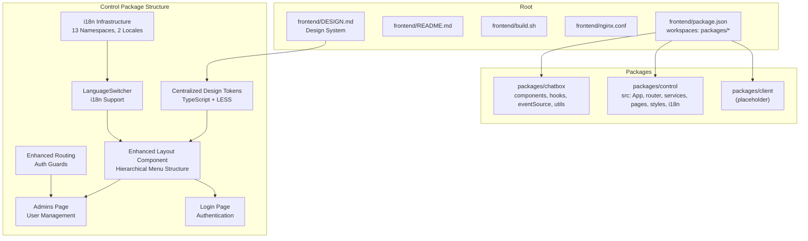
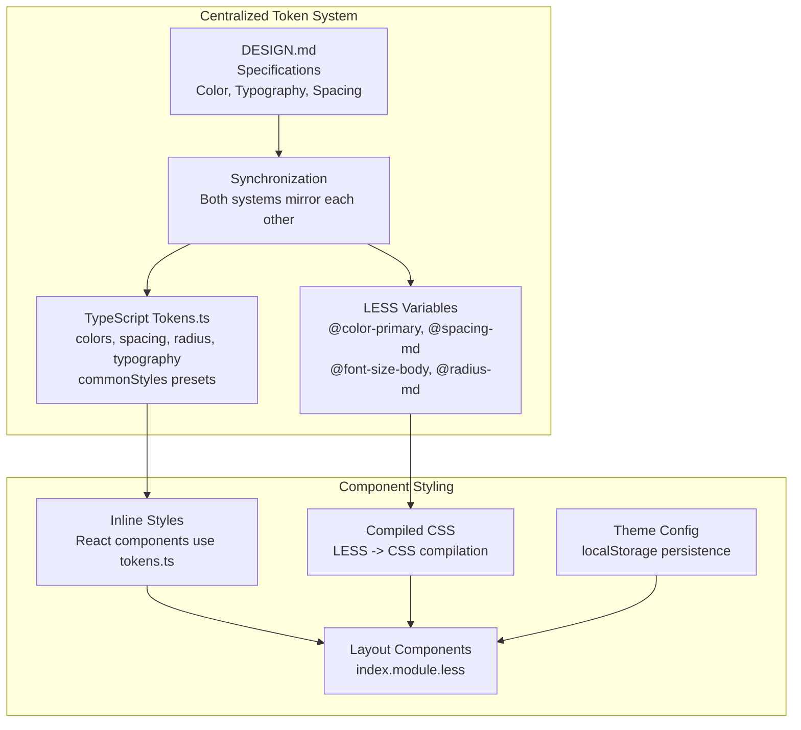
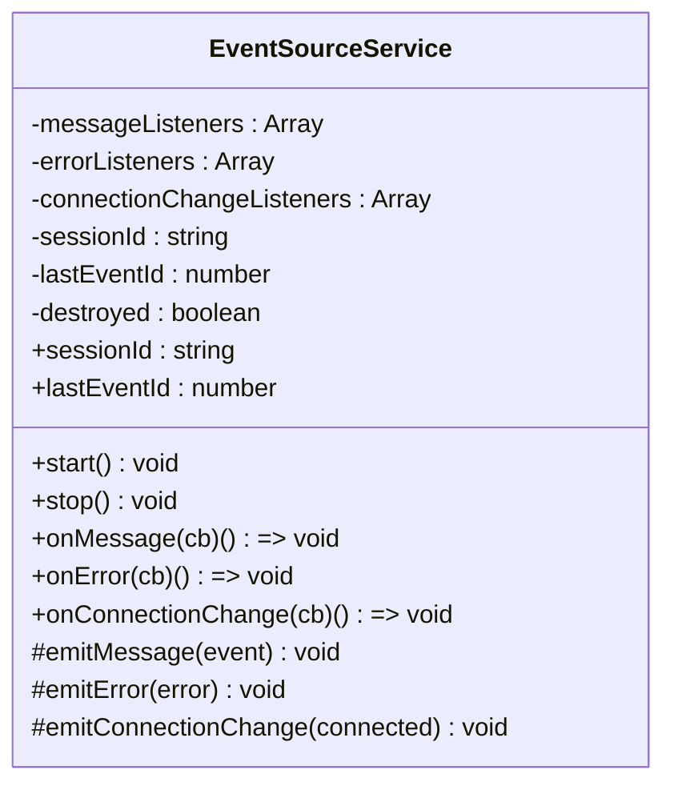
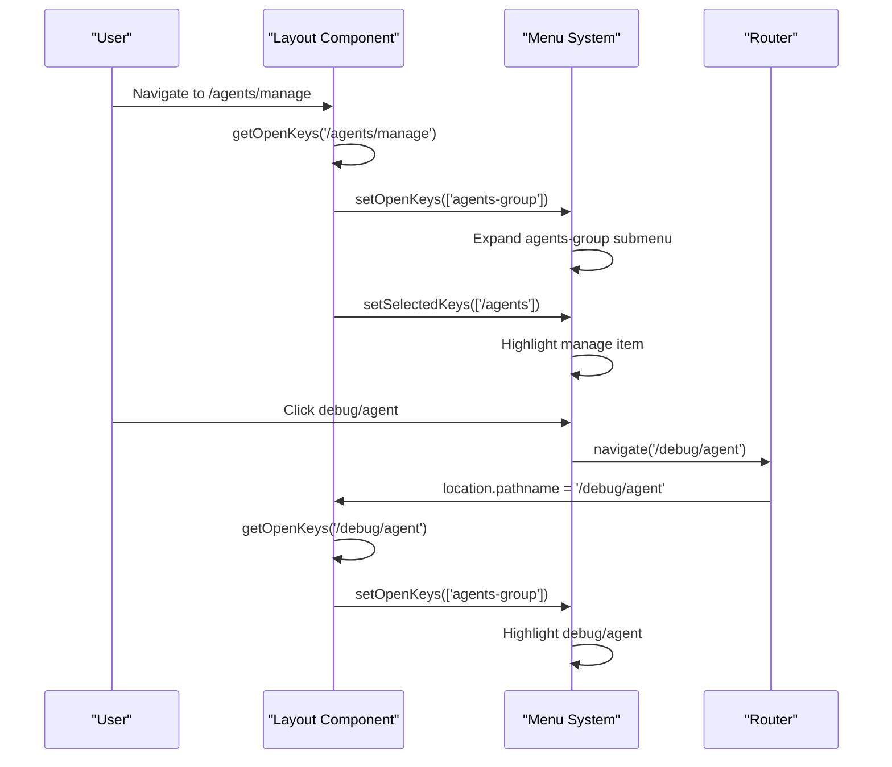
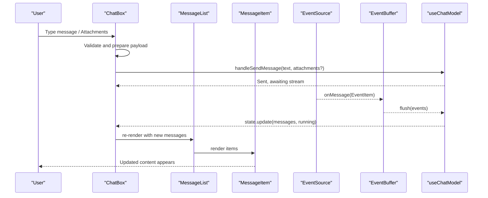
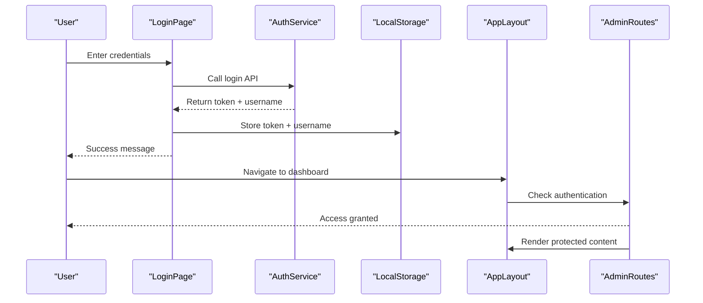
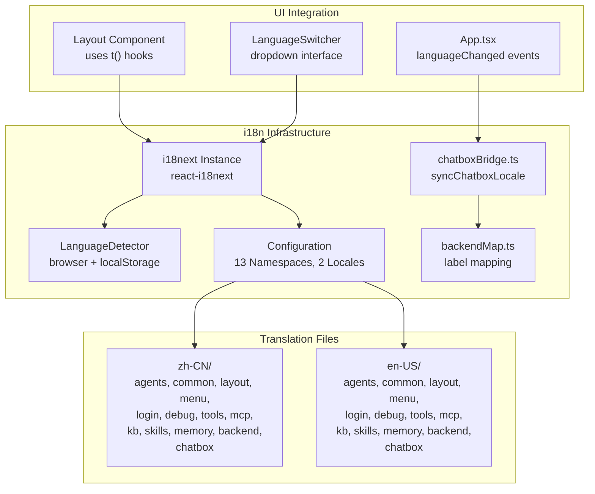
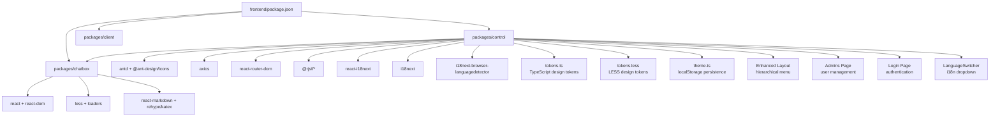
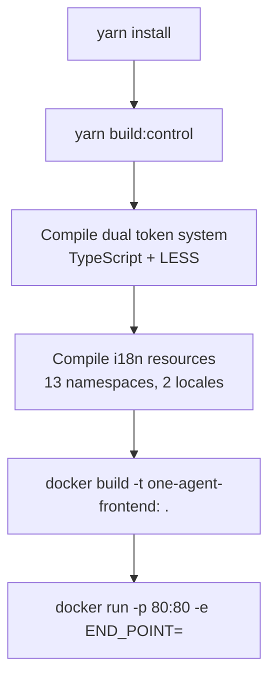

# Frontend Architecture

<cite>
**Referenced Files in This Document**
- [package.json](file://frontend/package.json)
- [README.md](file://frontend/README.md)
- [build.sh](file://frontend/build.sh)
- [nginx.conf](file://frontend/nginx.conf)
- [DESIGN.md](file://frontend/DESIGN.md)
- [packages/chatbox/index.ts](file://frontend/packages/chatbox/index.ts)
- [packages/chatbox/hooks/useChatModel.ts](file://frontend/packages/chatbox/hooks/useChatModel.ts)
- [packages/chatbox/eventSource/EventSource.ts](file://frontend/packages/chatbox/eventSource/EventSource.ts)
- [packages/chatbox/extends/ChatBox/index.tsx](file://frontend/packages/chatbox/extends/ChatBox/index.tsx)
- [packages/control/package.json](file://frontend/packages/control/package.json)
- [packages/control/src/App.tsx](file://frontend/packages/control/src/App.tsx)
- [packages/control/src/components/Layout/index.tsx](file://frontend/packages/control/src/components/Layout/index.tsx)
- [packages/control/src/components/Layout/index.module.less](file://frontend/packages/control/src/components/Layout/index.module.less)
- [packages/control/src/styles/tokens.ts](file://frontend/packages/control/src/styles/tokens.ts)
- [packages/control/src/styles/tokens.less](file://frontend/packages/control/src/styles/tokens.less)
- [packages/control/src/config/theme.ts](file://frontend/packages/control/src/config/theme.ts)
- [packages/control/src/router/index.tsx](file://frontend/packages/control/src/router/index.tsx)
- [packages/control/src/pages/Admins/index.tsx](file://frontend/packages/control/src/pages/Admins/index.tsx)
- [packages/control/src/pages/Login/index.tsx](file://frontend/packages/control/src/pages/Login/index.tsx)
- [packages/control/src/services/admin.ts](file://frontend/packages/control/src/services/admin.ts)
- [packages/control/src/types/admin.interface.ts](file://frontend/packages/control/src/types/admin.interface.ts)
- [packages/control/src/components/LanguageSwitcher/index.tsx](file://frontend/packages/control/src/components/LanguageSwitcher/index.tsx)
- [packages/control/src/i18n/index.ts](file://frontend/packages/control/src/i18n/index.ts)
- [packages/control/src/i18n/chatboxBridge.ts](file://frontend/packages/control/src/i18n/chatboxBridge.ts)
- [packages/control/src/i18n/backendMap.ts](file://frontend/packages/control/src/i18n/backendMap.ts)
- [packages/control/src/i18n/locales/en-US/layout.json](file://frontend/packages/control/src/i18n/locales/en-US/layout.json)
- [packages/control/src/i18n/locales/zh-CN/layout.json](file://frontend/packages/control/src/i18n/locales/zh-CN/layout.json)
- [packages/control/src/i18n/locales/en-US/menu.json](file://frontend/packages/control/src/i18n/locales/en-US/menu.json)
- [packages/control/src/i18n/locales/zh-CN/menu.json](file://frontend/packages/control/src/i18n/locales/zh-CN/menu.json)
- [packages/control/src/i18n/locales/en-US/common.json](file://frontend/packages/control/src/i18n/locales/en-US/common.json)
</cite>

## Update Summary
**Changes Made**
- Added comprehensive internationalization support with react-i18next framework integration
- Implemented LanguageSwitcher component for multi-language UI switching
- Created complete i18n infrastructure with 13 translation namespaces
- Added zh-CN and en-US locale support with automatic detection and persistence
- Integrated chatbox locale synchronization for seamless component translations
- Enhanced layout component with internationalized menu and user interface elements

## Table of Contents
1. [Introduction](#introduction)
2. [Project Structure](#project-structure)
3. [Design System and Tokens](#design-system-and-tokens)
4. [Core Components](#core-components)
5. [Architecture Overview](#architecture-overview)
6. [Detailed Component Analysis](#detailed-component-analysis)
7. [Admin Interface and Authentication](#admin-interface-and-authentication)
8. [Internationalization Support](#internationalization-support)
9. [Dependency Analysis](#dependency-analysis)
10. [Performance Considerations](#performance-considerations)
11. [Troubleshooting Guide](#troubleshooting-guide)
12. [Conclusion](#conclusion)
13. [Appendices](#appendices)

## Introduction
This document describes the Tron OneAgent frontend architecture. It is a React-based, TypeScript-powered workspace composed of three packages:
- chatbox: A reusable chat component library with event-driven streaming capabilities
- control: A comprehensive admin console application with professional design system, user management, authentication, and **internationalization support**
- client: Placeholder for future client-side integrations (not present in current structure)

The frontend features a complete redesign with a professional design system, responsive layouts, comprehensive admin interface, and **comprehensive internationalization support**. The control application now includes user management, login functionality, enhanced routing with authentication guards, centralized design token system, **multi-language support**, and a centralized design token system. The architecture integrates with backend APIs and WebSocket/SSE endpoints to power real-time, streaming conversations. It uses Yarn workspaces for monorepo management, Webpack for builds, Docker for containerization, and Nginx for production deployment.

## Project Structure
The frontend workspace is organized as a Yarn monorepo with three packages, featuring a comprehensive design system, professional admin interface, and **internationalization infrastructure**:
- Root: workspace configuration and shared scripts
- packages/chatbox: chat UI components, event sources, hooks, and utilities
- packages/control: React application for agent management, user administration, debugging, and **internationalization**
- packages/client: empty placeholder for future client-side features



**Diagram sources**
- [package.json:1-17](file://frontend/package.json#L1-L17)
- [DESIGN.md:1-646](file://frontend/DESIGN.md#L1-L646)
- [packages/control/src/components/Layout/index.tsx:1-189](file://frontend/packages/control/src/components/Layout/index.tsx#L1-L189)
- [packages/control/src/pages/Admins/index.tsx:1-250](file://frontend/packages/control/src/pages/Admins/index.tsx#L1-L250)
- [packages/control/src/pages/Login/index.tsx:1-96](file://frontend/packages/control/src/pages/Login/index.tsx#L1-L96)
- [packages/control/src/components/LanguageSwitcher/index.tsx:1-63](file://frontend/packages/control/src/components/LanguageSwitcher/index.tsx#L1-L63)
- [packages/control/src/i18n/index.ts:1-120](file://frontend/packages/control/src/i18n/index.ts#L1-L120)

**Section sources**
- [package.json:1-17](file://frontend/package.json#L1-L17)
- [DESIGN.md:1-646](file://frontend/DESIGN.md#L1-L646)

## Design System and Tokens

### Comprehensive Design System Implementation
The frontend implements a complete Alibaba Cloud design system with professional design tokens, responsive layouts, and consistent theming across all components. The design system now features a centralized TypeScript-based token system alongside traditional LESS variables.

**Design System Features:**
- **Color System**: Primary Cloud Blue (#1677ff), gradient atmospheres (blue→purple), surface tones (canvas, parchment, tiles)
- **Typography Scale**: Display sizes 56px-24px, body text 14px, consistent with PingFang SC/Microsoft YaHei
- **Spacing System**: 8px base unit with tokens for xxs-xs-sm-md-lg-xl-xxl-section
- **Border Radius Scale**: 0-16px with rounded.md (8px) as primary action radius
- **Component Tokens**: Buttons, cards, forms, navigation with consistent styling
- **Responsive Breakpoints**: 419px-1440px with progressive disclosure
- **TypeScript Integration**: Centralized tokens.ts for runtime styling and compile-time LESS variables

**Centralized Token System:**
- **TypeScript Tokens**: tokens.ts provides strongly-typed design tokens for inline styles
- **LESS Variables**: tokens.less maintains backward compatibility for CSS styling
- **Dual Synchronization**: Both systems stay in sync with DESIGN.md specifications
- **Runtime Styling**: TypeScript tokens enable dynamic theming and component styling
- **Build-time Optimization**: LESS compilation ensures efficient CSS delivery



**Diagram sources**
- [packages/control/src/styles/tokens.ts:1-171](file://frontend/packages/control/src/styles/tokens.ts#L1-L171)
- [packages/control/src/styles/tokens.less:1-195](file://frontend/packages/control/src/styles/tokens.less#L1-L195)
- [DESIGN.md:6-313](file://frontend/DESIGN.md#L6-L313)
- [packages/control/src/config/theme.ts:1-45](file://frontend/packages/control/src/config/theme.ts#L1-L45)

**Section sources**
- [DESIGN.md:1-646](file://frontend/DESIGN.md#L1-L646)
- [packages/control/src/styles/tokens.ts:1-171](file://frontend/packages/control/src/styles/tokens.ts#L1-L171)
- [packages/control/src/styles/tokens.less:1-195](file://frontend/packages/control/src/styles/tokens.less#L1-L195)
- [packages/control/src/config/theme.ts:1-45](file://frontend/packages/control/src/config/theme.ts#L1-L45)

## Core Components
- chatbox package exports:
  - UI components: MessageItem, MessageList, TextContent, ActionContent, TaskContent, HitlContent
  - Hooks: useChatModel, useEventSource, useTTS
  - Event infrastructure: EventSource base class and implementations (Polling, SSE, WebSocket)
  - Utilities: event buffering and message update helpers
  - Extension surface: ChatBox component and service configuration

- control package now includes:
  - Enhanced layout system with hierarchical menu structure and responsive design
  - Admin management interface with user CRUD operations
  - Login authentication with token-based security
  - Enhanced routing with authentication guards
  - Centralized design token system with TypeScript integration
  - Theme configuration system with localStorage persistence
  - Comprehensive admin services and interfaces
  - **Internationalization support with LanguageSwitcher component and complete i18n infrastructure**
  - **13 translation namespaces covering agents, common, layout, menu, login, debug, knowledge base, MCP, tools, skills, memory, chatbox, and backend domains**

- client package remains empty and reserved for future use.

**Section sources**
- [packages/chatbox/index.ts:1-36](file://frontend/packages/chatbox/index.ts#L1-L36)
- [packages/control/package.json:1-63](file://frontend/packages/control/package.json#L1-L63)
- [packages/control/src/pages/Admins/index.tsx:1-250](file://frontend/packages/control/src/pages/Admins/index.tsx#L1-L250)
- [packages/control/src/pages/Login/index.tsx:1-96](file://frontend/packages/control/src/pages/Login/index.tsx#L1-L96)
- [packages/control/src/components/LanguageSwitcher/index.tsx:1-63](file://frontend/packages/control/src/components/LanguageSwitcher/index.tsx#L1-L63)
- [packages/control/src/i18n/index.ts:1-120](file://frontend/packages/control/src/i18n/index.ts#L1-L120)

## Architecture Overview
The frontend architecture centers on a streaming-first chat experience powered by event sources and a reactive model, enhanced by a comprehensive design system, professional admin interface, and **comprehensive internationalization support**. The control application now features user management, authentication, responsive design with gradient backgrounds and card-based layouts, centralized token system for consistent theming, and **multi-language support with automatic detection and persistence**.

```mermaid
graph TB
subgraph "Control App with Enhanced Design System"
C_App["App.tsx<br/>ConfigProvider + Router"]
C_Layout["Enhanced Layout Component<br/>Hierarchical Menu Structure"]
C_Router["Enhanced Router<br/>Auth Guards + Admin Routes"]
C_Admin["Admins Page<br/>User Management"]
C_Login["Login Page<br/>Authentication"]
C_Theme["Theme Config<br/>Local Storage Persistence"]
C_Tokens["Centralized Tokens<br/>TypeScript + LESS"]
C_Lang["LanguageSwitcher<br/>i18n Support"]
C_I18n["i18n Infrastructure<br/>13 Namespaces, 2 Locales"]
end
subgraph "Chatbox Library"
CB_Index["index.ts exports"]
CB_Hooks["useChatModel.ts"]
CB_ES["EventSource.ts<br/>SSE/WebSocket/Polling"]
CB_Components["MessageList, MessageItem,<br/>TextContent, ActionContent, TaskContent, HitlContent"]
CB_Ext["ChatBox/index.tsx<br/>Header, Inputs, TTS"]
CB_Locale["Chatbox Locale Sync<br/>backendMap integration"]
end
subgraph "Design System Integration"
DS_Colors["Color System<br/>Primary, Surfaces, Gradients"]
DS_Typography["Typography Scale<br/>Display-Body Sizes"]
DS_Spacing["Spacing System<br/>8px Base Unit"]
DS_Layout["Layout System<br/>Grid, Container, Whitespace"]
TS_Tokens["TypeScript Tokens<br/>runtime styling"]
LESS_Tokens["LESS Variables<br/>compile-time CSS"]
end
subgraph "Runtime"
WS["Backend SSE/WS endpoints"]
BUF["EventBuffer"]
STATE["useChatModel reducer state"]
I18N["i18next instance<br/>languageChanged events"]
SYNC["syncChatboxLocale<br/>backend label mapping"]
end
C_App --> C_Layout
C_Layout --> C_Router
C_Router --> C_Admin
C_Router --> C_Login
C_Admin --> C_Tokens
C_Login --> C_Theme
C_Tokens --> DS_Colors
C_Tokens --> DS_Typography
C_Tokens --> DS_Spacing
C_Tokens --> DS_Layout
C_Lang --> C_Layout
C_I18n --> C_Lang
TS_Tokens --> DS_Colors
TS_Tokens --> DS_Typography
TS_Tokens --> DS_Spacing
LESS_Tokens --> DS_Colors
LESS_Tokens --> DS_Typography
LESS_Tokens --> DS_Spacing
CB_Index --> CB_Hooks
CB_Hooks --> CB_ES
CB_ES --> BUF
BUF --> STATE
STATE --> CB_Ext
CB_ES <- --> WS
I18N --> SYNC
SYNC --> CB_Locale
```

**Diagram sources**
- [packages/control/src/App.tsx:1-69](file://frontend/packages/control/src/App.tsx#L1-L69)
- [packages/control/src/components/Layout/index.tsx:1-189](file://frontend/packages/control/src/components/Layout/index.tsx#L1-L189)
- [packages/control/src/router/index.tsx:1-121](file://frontend/packages/control/src/router/index.tsx#L1-L121)
- [packages/control/src/pages/Admins/index.tsx:1-250](file://frontend/packages/control/src/pages/Admins/index.tsx#L1-L250)
- [packages/control/src/pages/Login/index.tsx:1-96](file://frontend/packages/control/src/pages/Login/index.tsx#L1-L96)
- [packages/control/src/styles/tokens.ts:1-171](file://frontend/packages/control/src/styles/tokens.ts#L1-L171)
- [packages/control/src/styles/tokens.less:1-195](file://frontend/packages/control/src/styles/tokens.less#L1-L195)
- [packages/chatbox/index.ts:1-36](file://frontend/packages/chatbox/index.ts#L1-L36)
- [packages/chatbox/hooks/useChatModel.ts:1-231](file://frontend/packages/chatbox/hooks/useChatModel.ts#L1-L231)
- [packages/control/src/i18n/index.ts:1-120](file://frontend/packages/control/src/i18n/index.ts#L1-L120)
- [packages/control/src/i18n/chatboxBridge.ts:1-31](file://frontend/packages/control/src/i18n/chatboxBridge.ts#L1-L31)

## Detailed Component Analysis

### State Management with useChatModel
The chat state is managed via a reducer pattern with explicit actions. It supports:
- Initializing from initialData
- Streaming event ingestion via an injected EventSource
- Event buffering to batch updates
- Running/stopped lifecycle tied to agent execution status
- Shadow user message insertion and status updates

Key behaviors:
- Reducer handles patching state, updating message lists from events, adding shadow user messages, and updating their status.
- Event buffer aggregates events and applies them to state periodically.
- Running flag controls whether the EventSource is started or stopped.
- Session ID and last event ID are synchronized with the EventSource to resume streams.


**Diagram sources**
- [packages/chatbox/hooks/useChatModel.ts:44-231](file://frontend/packages/chatbox/hooks/useChatModel.ts#L44-L231)

**Section sources**
- [packages/chatbox/hooks/useChatModel.ts:1-231](file://frontend/packages/chatbox/hooks/useChatModel.ts#L1-L231)

### Event Source Abstraction and Streaming
The EventSourceService defines a common interface for streaming:
- Listeners for messages, errors, and connection state changes
- Session ID and last event ID for resuming streams
- Abstract start/stop methods for concrete implementations

Concrete implementations (as exported by the library) include SSE, WebSocket, and polling variants. The control app injects an EventSource into useChatModel to receive real-time updates.



**Diagram sources**
- [packages/chatbox/eventSource/EventSource.ts:1-90](file://frontend/packages/chatbox/eventSource/EventSource.ts#L1-L90)

**Section sources**
- [packages/chatbox/eventSource/EventSource.ts:1-90](file://frontend/packages/chatbox/eventSource/EventSource.ts#L1-L90)

### Enhanced Layout Component with Hierarchical Menu Structure
The Layout component now features a sophisticated hierarchical menu system with intelligent navigation:
- **Hierarchical Menu Groups**: Agents, Tools, MCP, Knowledge Base with expandable submenus
- **Intelligent Path Matching**: Automatic submenu expansion based on current route
- **Dynamic Selection Highlighting**: Menu items highlight based on current location
- **Responsive Design**: Collapsible sidebar with trigger button
- **Professional Styling**: Gradient backgrounds, card-based content areas, and consistent spacing
- **Internationalization**: Menu items and user interface elements are fully localized

**Menu Structure Features:**
- Grouped navigation with icons for each major domain
- Automatic open/close state management based on route changes
- Selected item highlighting for better user orientation
- Responsive sidebar that collapses on smaller screens
- Professional color scheme with Cloud Blue primary accent
- **Localized labels using translation namespaces (menu, layout)**



**Diagram sources**
- [packages/control/src/components/Layout/index.tsx:41-63](file://frontend/packages/control/src/components/Layout/index.tsx#L41-L63)
- [packages/control/src/components/Layout/index.tsx:126-128](file://frontend/packages/control/src/components/Layout/index.tsx#L126-L128)

**Section sources**
- [packages/control/src/components/Layout/index.tsx:1-189](file://frontend/packages/control/src/components/Layout/index.tsx#L1-L189)

### ChatBox Component and Real-Time UI Updates
The ChatBox component orchestrates:
- Dynamic input mode selection based on supported content types
- Scroll management with auto-scroll and "back to bottom" affordance
- Integration with message list rendering and optional TTS playback
- Suggestions and HITL (Human-in-the-loop) handling
- Controlled sending flow with disabled states during running or pending HITL

It renders the header, message list, suggestions, and input area, and coordinates with the parent app's message handlers.



**Diagram sources**
- [packages/chatbox/extends/ChatBox/index.tsx:144-252](file://frontend/packages/chatbox/extends/ChatBox/index.tsx#L144-L252)
- [packages/chatbox/hooks/useChatModel.ts:120-178](file://frontend/packages/chatbox/hooks/useChatModel.ts#L120-L178)

**Section sources**
- [packages/chatbox/extends/ChatBox/index.tsx:1-347](file://frontend/packages/chatbox/extends/ChatBox/index.tsx#L1-L347)

## Admin Interface and Authentication

### Professional Control Panel Layout
The control application features a comprehensive layout system with professional styling:
- **Enhanced Sidebar Navigation**: Hierarchical menu structure with intelligent grouping and automatic expansion
- **Header with User Controls**: User profile display, **language switching**, and logout functionality
- **Content Area with Card Design**: Main content area styled as a card with shadows and rounded corners
- **Professional Color Scheme**: Cloud Blue primary color with gradient accents
- **Consistent Typography**: PingFang SC/Microsoft YaHei with proper hierarchy
- **Internationalization Integration**: All UI elements are fully localized

**Layout Features:**
- Ant Design Layout components with custom styling
- Responsive breakpoint handling (834px for sidebar collapse)
- Gradient backgrounds for visual appeal
- Card-based content containers with shadows
- Consistent spacing and typography tokens
- **LanguageSwitcher component integrated into header**

### Enhanced Admin Management
The Admins page provides comprehensive user management functionality:
- **User Listing**: Table view with username and creation date
- **User Creation**: Modal form for adding new administrators
- **Password Management**: Individual password reset functionality
- **User Deletion**: Confirmation dialog with safety checks
- **Real-time Updates**: Automatic refresh after CRUD operations

**Admin Functionality:**
- RESTful API integration for admin operations
- Form validation and error handling
- Modal dialogs for user interactions
- Loading states and success notifications
- Security restrictions (admin account protection)

### Professional Login System
The Login page features a clean, professional design:
- **Card-based Layout**: Centralized login form in styled card
- **Brand Identity**: Tron OneAgent branding with subtitle
- **Form Validation**: Ant Design form with validation rules
- **Loading States**: Visual feedback during authentication
- **Success/Error Messaging**: User-friendly notifications
- **Internationalization**: All form labels and messages are localized

**Login Features:**
- Username/password authentication
- Token-based session management
- Redirect to agents page on successful login
- Error handling and user feedback
- Responsive form sizing
- **Localized form fields and error messages**

### Enhanced Routing and Authentication
The routing system now includes comprehensive authentication:
- **Authentication Guards**: Route protection for admin pages
- **Login Redirect**: Automatic redirect to login for unauthenticated users
- **Hash Router**: Client-side routing with hash history
- **Nested Layout**: Shared layout for authenticated routes
- **Dynamic Navigation**: Menu items based on available routes
- **Internationalization**: Route labels and navigation elements are localized

**Routing Features:**
- Protected routes with AuthGuard component
- Nested routing with AppLayout wrapper
- Hash-based routing for static hosting
- Automatic redirects and fallback routes
- Menu item synchronization with active routes
- **Localized menu items and navigation labels**



**Diagram sources**
- [packages/control/src/pages/Login/index.tsx:1-96](file://frontend/packages/control/src/pages/Login/index.tsx#L1-L96)
- [packages/control/src/router/index.tsx:1-121](file://frontend/packages/control/src/router/index.tsx#L1-L121)
- [packages/control/src/components/Layout/index.tsx:1-189](file://frontend/packages/control/src/components/Layout/index.tsx#L1-L189)

**Section sources**
- [packages/control/src/components/Layout/index.tsx:1-189](file://frontend/packages/control/src/components/Layout/index.tsx#L1-L189)
- [packages/control/src/pages/Admins/index.tsx:1-250](file://frontend/packages/control/src/pages/Admins/index.tsx#L1-L250)
- [packages/control/src/pages/Login/index.tsx:1-96](file://frontend/packages/control/src/pages/Login/index.tsx#L1-L96)
- [packages/control/src/router/index.tsx:1-121](file://frontend/packages/control/src/router/index.tsx#L1-L121)
- [packages/control/src/services/admin.ts:1-28](file://frontend/packages/control/src/services/admin.ts#L1-L28)
- [packages/control/src/types/admin.interface.ts:1-41](file://frontend/packages/control/src/types/admin.interface.ts#L1-L41)

## Internationalization Support

### LanguageSwitcher Component
The control application now includes comprehensive internationalization support through the LanguageSwitcher component:
- **Multi-language Support**: English (en-US) and Chinese (zh-CN) languages
- **Automatic Detection**: Language detection based on browser settings
- **Persistent Storage**: Language preference saved in localStorage
- **Dropdown Interface**: Clean dropdown menu with language options
- **Icon Integration**: Globe icon with text labels for better UX
- **Namespace Integration**: Uses layout namespace for translation keys

**Language Switcher Features:**
- Ant Design Dropdown component with menu items
- Compact mode for minimal space usage
- Automatic language detection and selection
- Local storage persistence for user preferences
- Translation key integration with layout namespace
- **Real-time language switching with i18n.changeLanguage**

### Complete i18n Infrastructure
The frontend implements a comprehensive internationalization system with the following infrastructure:

**Framework Integration:**
- **react-i18next**: Modern i18n framework with React hooks
- **i18next-browser-languagedetector**: Automatic language detection
- **TypeScript Support**: Strongly-typed internationalization utilities
- **Namespace Organization**: 13 translation namespaces for different domains

**Supported Languages:**
- **Chinese (Simplified)**: zh-CN with Traditional Chinese characters
- **English**: en-US with American English conventions

**Translation Namespaces:**
- `agents`: Agent management interface translations
- `common`: Common UI elements and actions
- `layout`: Layout and navigation translations
- `menu`: Menu item labels and navigation text
- `login`: Authentication and login form translations
- `debug`: Debug interface and tool translations
- `kb`: Knowledge base management translations
- `mcp`: Model Context Protocol translations
- `tools`: Tool management and configuration translations
- `skills`: Skill management translations
- `memory`: Long-term memory management translations
- `chatbox`: Chat component and messaging translations
- `backend`: Backend service and tool name translations

**Configuration Features:**
- **Automatic Language Detection**: Based on browser settings and localStorage
- **Fallback Language**: Defaults to zh-CN when detection fails
- **Language Normalization**: Converts various language codes to supported formats
- **Persistence**: Saves user language preference in localStorage
- **Real-time Updates**: React components automatically re-render on language changes

**Integration with Chatbox:**
- **Locale Synchronization**: Automatically syncs chatbox component translations
- **Backend Label Mapping**: Maps backend-provided labels to i18n keys
- **Seamless Integration**: Chatbox components use translated text without additional configuration



**Diagram sources**
- [packages/control/src/i18n/index.ts:1-120](file://frontend/packages/control/src/i18n/index.ts#L1-L120)
- [packages/control/src/i18n/chatboxBridge.ts:1-31](file://frontend/packages/control/src/i18n/chatboxBridge.ts#L1-L31)
- [packages/control/src/i18n/backendMap.ts:1-40](file://frontend/packages/control/src/i18n/backendMap.ts#L1-L40)
- [packages/control/src/components/LanguageSwitcher/index.tsx:1-63](file://frontend/packages/control/src/components/LanguageSwitcher/index.tsx#L1-L63)
- [packages/control/src/App.tsx:1-69](file://frontend/packages/control/src/App.tsx#L1-L69)

**Section sources**
- [packages/control/src/components/LanguageSwitcher/index.tsx:1-63](file://frontend/packages/control/src/components/LanguageSwitcher/index.tsx#L1-L63)
- [packages/control/src/i18n/index.ts:1-120](file://frontend/packages/control/src/i18n/index.ts#L1-L120)
- [packages/control/src/i18n/chatboxBridge.ts:1-31](file://frontend/packages/control/src/i18n/chatboxBridge.ts#L1-L31)
- [packages/control/src/i18n/backendMap.ts:1-40](file://frontend/packages/control/src/i18n/backendMap.ts#L1-L40)
- [packages/control/src/App.tsx:1-69](file://frontend/packages/control/src/App.tsx#L1-L69)

## Dependency Analysis
- Root workspace depends on:
  - Yarn workspaces for package management
  - Scripts to run dev/build for the control package
- chatbox package exports:
  - Types, hooks, event sources, and components
  - Utility for updating messages by events
- control package now includes:
  - Enhanced design system with centralized tokens.ts
  - Hierarchical menu structure with intelligent navigation
  - **Internationalization support with LanguageSwitcher and complete i18n infrastructure**
  - Enhanced admin services and interfaces
  - Authentication utilities and guards
  - Theme configuration system with localStorage persistence
  - Responsive layout components with improved styling
  - Comprehensive styling with both TypeScript tokens and LESS modules
  - **react-i18next dependencies for internationalization**
  - **i18n configuration with 13 namespaces and 2 locales**



**Diagram sources**
- [package.json:1-17](file://frontend/package.json#L1-L17)
- [packages/control/package.json:1-63](file://frontend/packages/control/package.json#L1-L63)
- [packages/control/src/styles/tokens.ts:1-171](file://frontend/packages/control/src/styles/tokens.ts#L1-L171)
- [packages/control/src/styles/tokens.less:1-195](file://frontend/packages/control/src/styles/tokens.less#L1-L195)
- [packages/control/src/config/theme.ts:1-45](file://frontend/packages/control/src/config/theme.ts#L1-L45)

**Section sources**
- [package.json:1-17](file://frontend/package.json#L1-L17)
- [packages/control/package.json:1-63](file://frontend/packages/control/package.json#L1-L63)

## Performance Considerations
- Event buffering: Events are aggregated and applied in batches to reduce render churn and improve throughput.
- Auto-scroll throttling: Scroll position checks are throttled to avoid excessive layout recalculations.
- Conditional rendering: Multi-mode input toggles based on supported content types to minimize unnecessary DOM nodes.
- Lazy initialization: EventBuffer and other resources are lazily created to defer cost until needed.
- Centralized token system: TypeScript tokens reduce CSS duplication and improve maintainability.
- Responsive design: Progressive disclosure reduces complexity on smaller screens.
- Build optimization: Webpack-based control app builds for production with dual token system compilation.
- Theme persistence: localStorage-based theme configuration avoids repeated parsing overhead.
- **Language switching performance**: Efficient language detection and caching reduces translation overhead.
- **Namespace loading**: i18n loads only required namespaces, minimizing bundle size.
- **Chatbox locale sync**: Optimized synchronization prevents unnecessary re-renders.
- **Backend label mapping**: Cached mapping reduces translation lookup overhead.

## Troubleshooting Guide
- Cross-origin issues: Configure development proxy in the control app's dev server to route /api and /chatApi to the backend host.
- SSE/WebSocket connectivity: Verify Nginx proxy settings for /api/ and /chatApi/, ensuring upgrade headers and disabling proxy buffering for SSE.
- Service configuration: Use the chatbox service configuration mechanism to set API prefix, origin, and authorization headers.
- Design system conflicts: Ensure both tokens.ts and tokens.less are properly imported and compiled before component styles.
- Authentication issues: Verify token storage and retrieval in localStorage for theme and auth persistence.
- Responsive layout problems: Check breakpoint values and media queries in layout components.
- **Language switching issues**: Verify i18n configuration and translation files are properly loaded.
- **Translation namespace errors**: Ensure all 13 namespaces are properly configured in i18n/index.ts.
- **Locale and i18n**: Set locale via chatbox utilities to match UI text expectations.
- **Docker/Nginx deployment**: Use the provided build script to install dependencies, build the control app, and produce a Docker image; run with END_POINT pointing to the backend.
- **Chatbox locale synchronization**: Verify syncChatboxLocale function is called on language changes.
- **Backend label mapping**: Ensure backendMap.ts contains all required tool name mappings.

**Section sources**
- [README.md:252-279](file://frontend/README.md#L252-L279)
- [nginx.conf:42-69](file://frontend/nginx.conf#L42-L69)
- [build.sh:52-80](file://frontend/build.sh#L52-L80)

## Conclusion
The Tron OneAgent frontend is a modular, streaming-first React application built with Yarn workspaces and enhanced by a comprehensive design system and **complete internationalization support**. The chatbox library encapsulates real-time event handling, buffering, and rendering, while the control application now features professional user management, authentication, responsive design with gradient backgrounds and card-based layouts, centralized token system for consistent theming, and **multi-language support with automatic detection, persistence, and seamless integration**. The architecture leverages modern tooling (Webpack, TypeScript, Ant Design), robust real-time transports (SSE/WebSocket), comprehensive design tokens with both TypeScript and LESS implementations, **react-i18next framework integration**, and containerized deployment (Docker + Nginx) to deliver a professional, extensible, and maintainable experience.

## Appendices

### Build and Deployment Workflow
- Install dependencies and build the control app with enhanced design system and internationalization
- Produce a Docker image tagged with the package version or a custom tag
- Run the container and configure END_POINT to point to the backend



**Diagram sources**
- [build.sh:52-80](file://frontend/build.sh#L52-L80)

**Section sources**
- [build.sh:1-80](file://frontend/build.sh#L1-L80)
- [README.md:172-201](file://frontend/README.md#L172-L201)

### Nginx Proxy Configuration Notes
- API proxy: /api/ forwards to the backend host with WebSocket upgrade support
- SSE proxy: /chatApi/ requires disabling proxy buffering and setting long read timeouts
- Static routing: /control/ serves SPA routes via index.html fallback
- Design system assets: Ensure proper caching headers for compiled CSS from dual token system
- **i18n assets**: Ensure proper caching headers for translation JSON files

**Section sources**
- [nginx.conf:42-76](file://frontend/nginx.conf#L42-L76)

### Extending Chat Components and Integrating Services
- Extend ChatBox: customize header, input, and markdown components via props; integrate TTS and voice input
- Integrate services: configure API base URL, origin, and headers using the chatbox service configuration utility
- Add new content types: adjust supportInputTypes to toggle multi-mode input and render appropriate attachments
- Design system integration: use tokens.ts variables for consistent theming across custom components
- Admin interface extensions: leverage existing admin services and interfaces for new management features
- Token system extension: add new tokens to both tokens.ts and tokens.less for comprehensive coverage
- **Internationalization extension**: add new translation keys to appropriate namespace JSON files
- **Chatbox locale extension**: extend chatboxBridge.ts for additional component localization

**Section sources**
- [README.md:103-123](file://frontend/README.md#L103-L123)
- [README.md:156-170](file://frontend/README.md#L156-L170)
- [packages/chatbox/extends/ChatBox/index.tsx:112-120](file://frontend/packages/chatbox/extends/ChatBox/index.tsx#L112-L120)
- [packages/control/src/styles/tokens.ts:1-171](file://frontend/packages/control/src/styles/tokens.ts#L1-L171)
- [packages/control/src/styles/tokens.less:1-195](file://frontend/packages/control/src/styles/tokens.less#L1-L195)
- [packages/control/src/i18n/chatboxBridge.ts:1-31](file://frontend/packages/control/src/i18n/chatboxBridge.ts#L1-L31)

### Design System Implementation Guide
- **Color Usage**: Use primary (#1677ff) for all interactive elements, gradients for hero sections
- **Typography**: Maintain zero letter-spacing for display sizes, 14px body text
- **Spacing**: Follow 8px base unit system for consistent layout
- **Components**: Implement button-primary, feature-card variants, and form components using tokens
- **Responsive**: Apply breakpoints from tokens.less for mobile-first design
- **Theming**: Store theme preferences in localStorage using theme.ts configuration
- **TypeScript Integration**: Use tokens.ts for runtime styling and dynamic theming
- **LESS Integration**: Use tokens.less for compile-time CSS generation and component styling
- **Token Synchronization**: Keep tokens.ts and tokens.less in sync with DESIGN.md specifications

**Section sources**
- [DESIGN.md:315-646](file://frontend/DESIGN.md#L315-L646)
- [packages/control/src/styles/tokens.ts:1-171](file://frontend/packages/control/src/styles/tokens.ts#L1-L171)
- [packages/control/src/styles/tokens.less:1-195](file://frontend/packages/control/src/styles/tokens.less#L1-L195)
- [packages/control/src/config/theme.ts:1-45](file://frontend/packages/control/src/config/theme.ts#L1-L45)

### Enhanced Layout Component Usage
- **Hierarchical Menu**: Utilize the group-based menu structure for organizing navigation
- **Intelligent Selection**: Leverage automatic path-based menu selection and expansion
- **Responsive Design**: Take advantage of the collapsible sidebar for different screen sizes
- **Professional Styling**: Apply the established design tokens for consistent component appearance
- **Theme Integration**: Use the theme configuration system for persistent user preferences
- **Internationalization**: Use translation hooks (t()) for all UI text elements

**Section sources**
- [packages/control/src/components/Layout/index.tsx:77-124](file://frontend/packages/control/src/components/Layout/index.tsx#L77-L124)
- [packages/control/src/components/Layout/index.tsx:41-63](file://frontend/packages/control/src/components/Layout/index.tsx#L41-L63)
- [packages/control/src/config/theme.ts:1-45](file://frontend/packages/control/src/config/theme.ts#L1-L45)

### Internationalization Implementation Guide
- **Adding new translation keys**: Add keys to appropriate namespace JSON files (e.g., common.json, menu.json)
- **Using translations in components**: Import useTranslation hook and use t() function with namespace prefixes
- **Language detection**: Configure detection order and fallback languages in i18n configuration
- **Persisting language preferences**: Use localStorage key for storing user language choice
- **Chatbox integration**: Use syncChatboxLocale function to keep chatbox components localized
- **Backend label mapping**: Add new tool names to backendMap.ts for automatic translation
- **Namespace organization**: Keep related translations grouped in appropriate namespaces
- **Testing translations**: Verify all UI elements render correctly in both zh-CN and en-US locales

**Section sources**
- [packages/control/src/i18n/index.ts:1-120](file://frontend/packages/control/src/i18n/index.ts#L1-L120)
- [packages/control/src/i18n/chatboxBridge.ts:1-31](file://frontend/packages/control/src/i18n/chatboxBridge.ts#L1-L31)
- [packages/control/src/i18n/backendMap.ts:1-40](file://frontend/packages/control/src/i18n/backendMap.ts#L1-L40)
- [packages/control/src/components/LanguageSwitcher/index.tsx:1-63](file://frontend/packages/control/src/components/LanguageSwitcher/index.tsx#L1-L63)