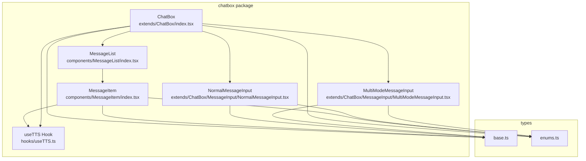
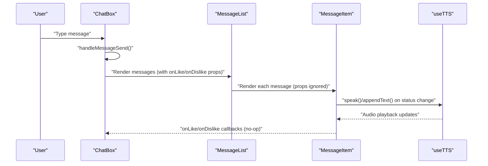
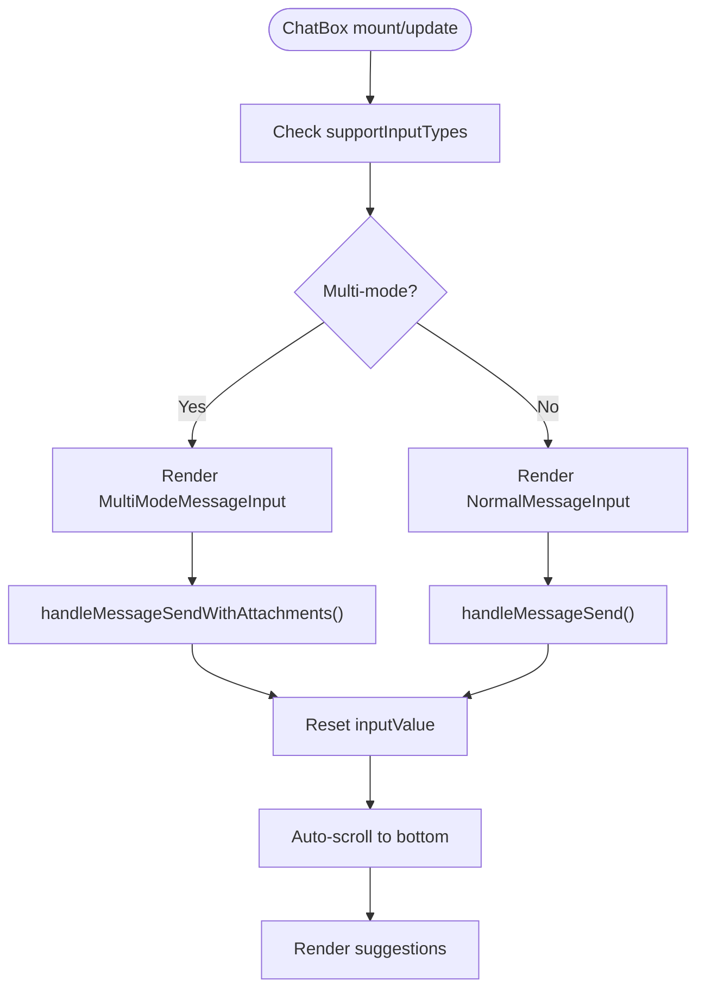
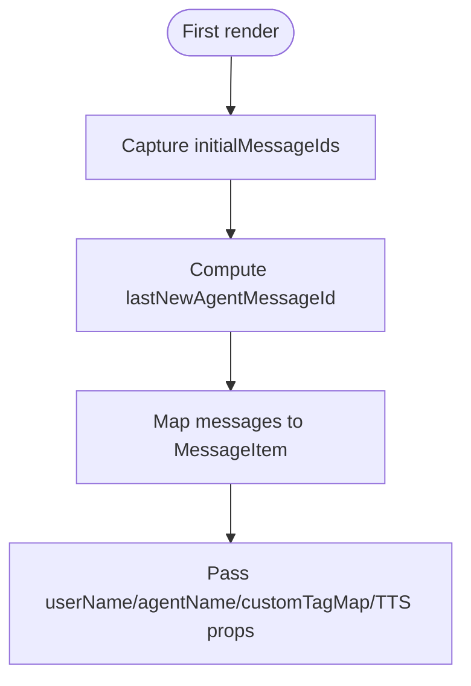
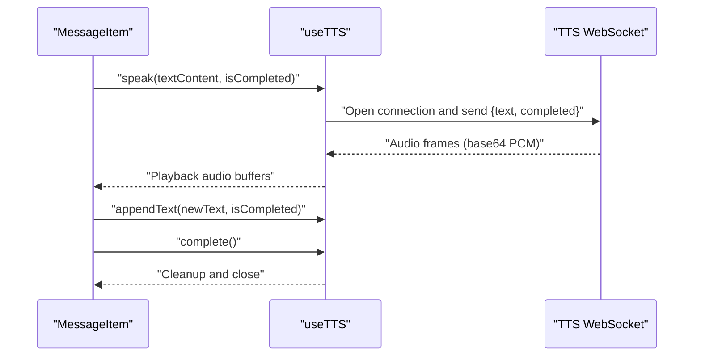
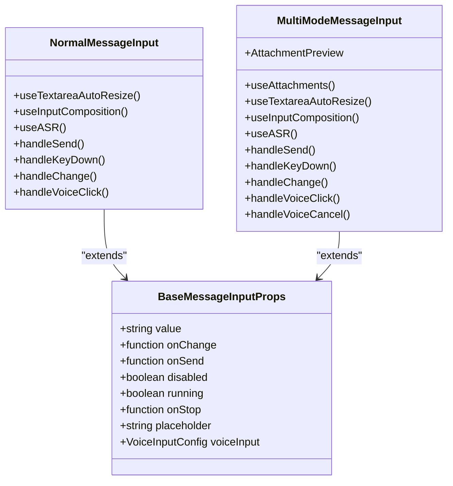
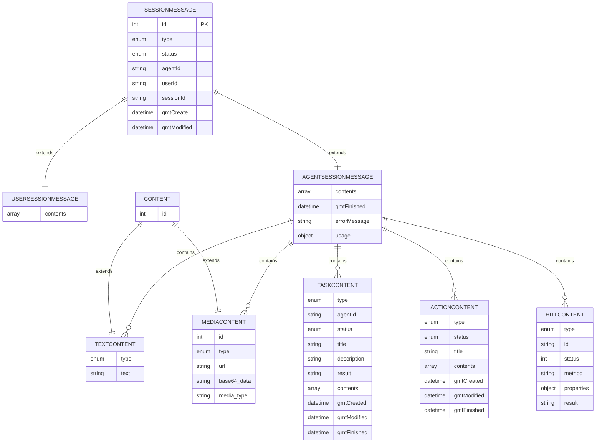
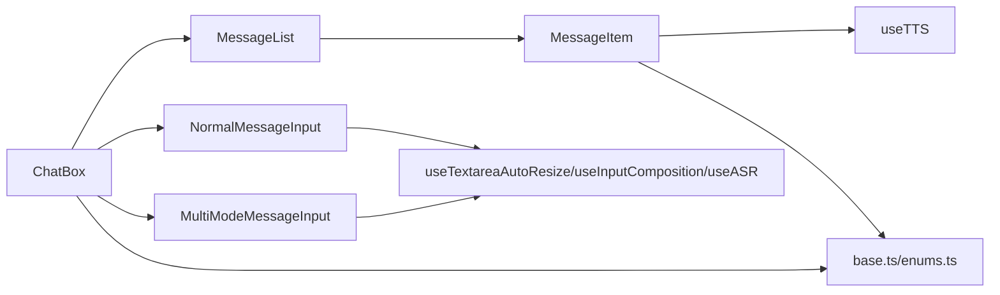

# React Component Structure

<cite>
**Referenced Files in This Document**
- [index.tsx](file://frontend/packages/chatbox/extends/ChatBox/index.tsx)
- [MessageList/index.tsx](file://frontend/packages/chatbox/components/MessageList/index.tsx)
- [MessageItem/index.tsx](file://frontend/packages/chatbox/components/MessageItem/index.tsx)
- [MessageInput/index.tsx](file://frontend/packages/chatbox/extends/ChatBox/MessageInput/index.tsx)
- [NormalMessageInput.tsx](file://frontend/packages/chatbox/extends/ChatBox/MessageInput/NormalMessageInput.tsx)
- [MultiModeMessageInput.tsx](file://frontend/packages/chatbox/extends/ChatBox/MessageInput/MultiModeMessageInput.tsx)
- [useTTS.ts](file://frontend/packages/chatbox/hooks/useTTS.ts)
- [base.ts](file://frontend/packages/chatbox/types/base.ts)
- [enums.ts](file://frontend/packages/chatbox/types/enums.ts)
- [index.ts](file://frontend/packages/chatbox/index.ts)
</cite>

## Update Summary
**Changes Made**
- Updated MessageItem component documentation to reflect removed like/dislike functionality
- Updated component architecture diagrams to show simplified state management
- Revised component lifecycle and event handling sections to remove unused callbacks
- Updated troubleshooting guide to reflect current functionality
- Modified TypeScript interfaces section to clarify remaining props

## Table of Contents
1. [Introduction](#introduction)
2. [Project Structure](#project-structure)
3. [Core Components](#core-components)
4. [Architecture Overview](#architecture-overview)
5. [Detailed Component Analysis](#detailed-component-analysis)
6. [Dependency Analysis](#dependency-analysis)
7. [Performance Considerations](#performance-considerations)
8. [Troubleshooting Guide](#troubleshooting-guide)
9. [Conclusion](#conclusion)
10. [Appendices](#appendices)

## Introduction
This document describes the React component structure of the Tron OneAgent frontend chat module. It focuses on the modular architecture centered around the chatbox package, the ChatBox component hierarchy, and the composition patterns used for rendering messages, handling user input, and integrating with external services such as TTS via WebSocket. The documentation reflects the current state where user feedback features (like/dislike) have been removed from the MessageItem component, simplifying state management and component responsibilities.

## Project Structure
The frontend is organized into packages. The chatbox package contains the primary chat UI components, supporting both single-modal and multi-modal input modes, message rendering, and TTS integration. The control package provides a control panel application with routing and page components. The client package appears to be empty in the current snapshot.

**Diagram sources**
- [index.tsx:85-333](file://frontend/packages/chatbox/extends/ChatBox/index.tsx#L85-L333)
- [MessageList/index.tsx:51-112](file://frontend/packages/chatbox/components/MessageList/index.tsx#L51-L112)
- [MessageItem/index.tsx:128-485](file://frontend/packages/chatbox/components/MessageItem/index.tsx#L128-L485)
- [NormalMessageInput.tsx:27-145](file://frontend/packages/chatbox/extends/ChatBox/MessageInput/NormalMessageInput.tsx#L27-L145)
- [MultiModeMessageInput.tsx:30-200](file://frontend/packages/chatbox/extends/ChatBox/MessageInput/MultiModeMessageInput.tsx#L30-L200)
- [useTTS.ts:106-377](file://frontend/packages/chatbox/hooks/useTTS.ts#L106-L377)
- [base.ts:26-124](file://frontend/packages/chatbox/types/base.ts#L26-L124)
- [enums.ts:18-69](file://frontend/packages/chatbox/types/enums.ts#L18-L69)

**Section sources**
- [index.ts:18-36](file://frontend/packages/chatbox/index.ts#L18-L36)

## Core Components
- **ChatBox**: The top-level chat container that orchestrates the header, message list, suggestions, and input area. It manages scrolling behavior, input mode selection, and integrates TTS playback for agent messages. **Updated**: Now passes through onLike/onDislike props but they are no longer functional.
- **MessageList**: Renders a list of messages and marks the last newly received agent message for special handling (e.g., auto-TTS). **Updated**: Still forwards onLike/onDislike props but they are ignored by MessageItem.
- **MessageItem**: Renders a single message, dispatches content-specific renderers (text, media, tasks, actions, HITL), handles TTS playback, and displays status and usage metrics. **Updated**: Removed like/dislike functionality - props remain but have no effect.
- **NormalMessageInput**: Single-modal text input with optional voice input and composition handling.
- **MultiModeMessageInput**: Multi-modal input supporting text, attachments, and voice input with attachment preview and upload state.
- **useTTS**: Hook that manages WebSocket-based TTS streaming, queueing audio buffers, and controlling playback lifecycle.

**Section sources**
- [index.tsx:41-79](file://frontend/packages/chatbox/extends/ChatBox/index.tsx#L41-L79)
- [MessageList/index.tsx:25-49](file://frontend/packages/chatbox/components/MessageList/index.tsx#L25-L49)
- [MessageItem/index.tsx:106-126](file://frontend/packages/chatbox/components/MessageItem/index.tsx#L106-L126)
- [NormalMessageInput.tsx:25-36](file://frontend/packages/chatbox/extends/ChatBox/MessageInput/NormalMessageInput.tsx#L25-L36)
- [MultiModeMessageInput.tsx:28-41](file://frontend/packages/chatbox/extends/ChatBox/MessageInput/MultiModeMessageInput.tsx#L28-L41)
- [useTTS.ts:72-100](file://frontend/packages/chatbox/hooks/useTTS.ts#L72-L100)

## Architecture Overview
The ChatBox composes MessageList and MessageItem to render conversation history. It conditionally renders NormalMessageInput or MultiModeMessageInput based on supported input types. MessageItem delegates content rendering to specialized renderers and integrates useTTS for agent audio playback. **Updated**: Prop drilling occurs from ChatBox down to MessageList and MessageItem, but like/dislike callbacks are no longer processed.

**Diagram sources**
- [index.tsx:144-173](file://frontend/packages/chatbox/extends/ChatBox/index.tsx#L144-L173)
- [MessageList/index.tsx:88-112](file://frontend/packages/chatbox/components/MessageList/index.tsx#L88-L112)
- [MessageItem/index.tsx:174-226](file://frontend/packages/chatbox/components/MessageItem/index.tsx#L174-L226)
- [useTTS.ts:277-310](file://frontend/packages/chatbox/hooks/useTTS.ts#L277-L310)

## Detailed Component Analysis

### ChatBox Component
**Updated**: Simplified to remove like/dislike functionality while maintaining prop forwarding.

Responsibilities:
- Manage input mode selection based on supportInputTypes.
- Control scroll behavior with auto-scroll and "back to bottom" UX.
- Render suggestions and integrate with external services (TTS, ASR).
- Gate send/stop actions based on running state and pending HITL.
- **Updated**: Pass through onLike/onDislike props to MessageList (now unused).

Key props and behaviors:
- Conditional input rendering: MultiModeMessageInput vs NormalMessageInput.
- Scroll detection and throttled scroll handler.
- Auto-scroll timer when running.
- Suggestions rendering and click handler.
- TTS integration via MessageList and MessageItem.

**Diagram sources**
- [index.tsx:113-120](file://frontend/packages/chatbox/extends/ChatBox/index.tsx#L113-L120)
- [index.tsx:306-333](file://frontend/packages/chatbox/extends/ChatBox/index.tsx#L306-L333)
- [index.tsx:144-173](file://frontend/packages/chatbox/extends/ChatBox/index.tsx#L144-L173)
- [index.tsx:220-227](file://frontend/packages/chatbox/extends/ChatBox/index.tsx#L220-L227)
- [index.tsx:229-252](file://frontend/packages/chatbox/extends/ChatBox/index.tsx#L229-L252)

**Section sources**
- [index.tsx:41-79](file://frontend/packages/chatbox/extends/ChatBox/index.tsx#L41-L79)
- [index.tsx:113-120](file://frontend/packages/chatbox/extends/ChatBox/index.tsx#L113-L120)
- [index.tsx:144-173](file://frontend/packages/chatbox/extends/ChatBox/index.tsx#L144-L173)
- [index.tsx:220-252](file://frontend/packages/chatbox/extends/ChatBox/index.tsx#L220-L252)

### MessageList Component
**Updated**: Maintains prop forwarding but ignores like/dislike callbacks.

Responsibilities:
- Iterate over messages and pass contextual props to MessageItem.
- Track initial message IDs to identify the last new agent message.
- Forward callbacks for expand toggles, TTS, and HITL (like/dislike props are passed but unused).

**Diagram sources**
- [MessageList/index.tsx:66-86](file://frontend/packages/chatbox/components/MessageList/index.tsx#L66-L86)
- [MessageList/index.tsx:88-112](file://frontend/packages/chatbox/components/MessageList/index.tsx#L88-L112)

**Section sources**
- [MessageList/index.tsx:25-49](file://frontend/packages/chatbox/components/MessageList/index.tsx#L25-L49)
- [MessageList/index.tsx:66-86](file://frontend/packages/chatbox/components/MessageList/index.tsx#L66-L86)
- [MessageList/index.tsx:88-112](file://frontend/packages/chatbox/components/MessageList/index.tsx#L88-L112)

### MessageItem Component
**Updated**: Removed like/dislike functionality - props remain but have no effect.

Responsibilities:
- Render message header, avatar, and timestamps.
- Route content rendering to specialized renderers based on ContentType.
- Integrate TTS playback with streaming text updates and completion signals.
- Display status indicators and usage metrics for agent messages.
- **Removed**: User interactions for like/dislike and HITL submission (callbacks still accepted but ignored).

TTS integration highlights:
- Extracts plain text from markdown for TTS.
- Manages WebSocket connection and audio queue.
- Streams partial text and completes when message status indicates success.

**Diagram sources**
- [MessageItem/index.tsx:174-226](file://frontend/packages/chatbox/components/MessageItem/index.tsx#L174-L226)
- [useTTS.ts:188-274](file://frontend/packages/chatbox/hooks/useTTS.ts#L188-L274)
- [useTTS.ts:301-364](file://frontend/packages/chatbox/hooks/useTTS.ts#L301-L364)

**Section sources**
- [MessageItem/index.tsx:106-126](file://frontend/packages/chatbox/components/MessageItem/index.tsx#L106-L126)
- [MessageItem/index.tsx:156-170](file://frontend/packages/chatbox/components/MessageItem/index.tsx#L156-L170)
- [MessageItem/index.tsx:174-226](file://frontend/packages/chatbox/components/MessageItem/index.tsx#L174-L226)
- [MessageItem/index.tsx:228-258](file://frontend/packages/chatbox/components/MessageItem/index.tsx#L228-L258)
- [MessageItem/index.tsx:300-357](file://frontend/packages/chatbox/components/MessageItem/index.tsx#L300-L357)
- [MessageItem/index.tsx:359-440](file://frontend/packages/chatbox/components/MessageItem/index.tsx#L359-L440)
- [MessageItem/index.tsx:442-458](file://frontend/packages/chatbox/components/MessageItem/index.tsx#L442-L458)
- [useTTS.ts:106-377](file://frontend/packages/chatbox/hooks/useTTS.ts#L106-L377)

### MessageInput Components
Responsibilities:
- NormalMessageInput: Single-modal text input with composition handling and optional voice input.
- MultiModeMessageInput: Adds attachment selection, preview, and upload state alongside text and voice input.

Shared capabilities:
- Auto-resize textarea.
- Composition event handling to avoid premature sends.
- Voice input via useASR hook with real-time and final text callbacks.
- Send on Enter (Shift+Enter for newline).
- Stop button when running and onStop provided.

**Diagram sources**
- [NormalMessageInput.tsx:25-36](file://frontend/packages/chatbox/extends/ChatBox/MessageInput/NormalMessageInput.tsx#L25-L36)
- [MultiModeMessageInput.tsx:28-41](file://frontend/packages/chatbox/extends/ChatBox/MessageInput/MultiModeMessageInput.tsx#L28-L41)
- [MessageInput/index.tsx:19-30](file://frontend/packages/chatbox/extends/ChatBox/MessageInput/index.tsx#L19-L30)

**Section sources**
- [NormalMessageInput.tsx:25-36](file://frontend/packages/chatbox/extends/ChatBox/MessageInput/NormalMessageInput.tsx#L25-L36)
- [NormalMessageInput.tsx:70-101](file://frontend/packages/chatbox/extends/ChatBox/MessageInput/NormalMessageInput.tsx#L70-L101)
- [MultiModeMessageInput.tsx:28-41](file://frontend/packages/chatbox/extends/ChatBox/MessageInput/MultiModeMessageInput.tsx#L28-L41)
- [MultiModeMessageInput.tsx:97-102](file://frontend/packages/chatbox/extends/ChatBox/MessageInput/MultiModeMessageInput.tsx#L97-L102)
- [MessageInput/index.tsx:19-30](file://frontend/packages/chatbox/extends/ChatBox/MessageInput/index.tsx#L19-L30)

### Types and Interfaces
**Updated**: MessageItemProps still includes onLike/onDislike props but they are no longer functional.

Core data structures:
- SessionMessage, UserSessionMessage, AgentSessionMessage define the shape of chat messages.
- Content types include TextContent, MediaContent, TaskContent, ActionContent, and HitlContent.
- Enums define statuses for tasks, actions, messages, and content types.

**Diagram sources**
- [base.ts:26-124](file://frontend/packages/chatbox/types/base.ts#L26-L124)
- [enums.ts:18-69](file://frontend/packages/chatbox/types/enums.ts#L18-L69)

**Section sources**
- [base.ts:26-124](file://frontend/packages/chatbox/types/base.ts#L26-L124)
- [enums.ts:18-69](file://frontend/packages/chatbox/types/enums.ts#L18-L69)

## Dependency Analysis
**Updated**: Dependencies remain the same but like/dislike callbacks are no longer processed.

- ChatBox depends on MessageList, Header, and MessageInput variants.
- MessageList depends on MessageItem and passes props downstream.
- MessageItem depends on specialized content renderers and useTTS.
- MessageInput components depend on shared hooks for resizing, composition, attachments, and ASR.
- All components consume types from base.ts and enums.ts.

**Diagram sources**
- [index.tsx:25-37](file://frontend/packages/chatbox/extends/ChatBox/index.tsx#L25-L37)
- [MessageList/index.tsx:18-23](file://frontend/packages/chatbox/components/MessageList/index.tsx#L18-L23)
- [MessageItem/index.tsx:18-31](file://frontend/packages/chatbox/components/MessageItem/index.tsx#L18-L31)
- [NormalMessageInput.tsx:18-22](file://frontend/packages/chatbox/extends/ChatBox/MessageInput/NormalMessageInput.tsx#L18-L22)
- [MultiModeMessageInput.tsx:18-23](file://frontend/packages/chatbox/extends/ChatBox/MessageInput/MultiModeMessageInput.tsx#L18-L23)
- [base.ts:18-24](file://frontend/packages/chatbox/types/base.ts#L18-L24)
- [enums.ts:18-69](file://frontend/packages/chatbox/types/enums.ts#L18-L69)

**Section sources**
- [index.tsx:25-37](file://frontend/packages/chatbox/extends/ChatBox/index.tsx#L25-L37)
- [MessageList/index.tsx:18-23](file://frontend/packages/chatbox/components/MessageList/index.tsx#L18-L23)
- [MessageItem/index.tsx:18-31](file://frontend/packages/chatbox/components/MessageItem/index.tsx#L18-L31)
- [NormalMessageInput.tsx:18-22](file://frontend/packages/chatbox/extends/ChatBox/MessageInput/NormalMessageInput.tsx#L18-L22)
- [MultiModeMessageInput.tsx:18-23](file://frontend/packages/chatbox/extends/ChatBox/MessageInput/MultiModeMessageInput.tsx#L18-L23)

## Performance Considerations
- **Updated**: Performance considerations remain largely unchanged as the removal of like/dislike functionality reduces unnecessary prop processing.
- Scrolling: ChatBox uses a throttled scroll handler and an auto-scroll timer while running to maintain responsiveness during streaming responses.
- Rendering: MessageList computes last-new-agent-message efficiently using a memoized scan and a ref to initial IDs to minimize re-renders.
- TTS: useTTS queues audio buffers and only starts playback when ready, avoiding redundant WebSocket connections by cleaning up on each new speak invocation.
- Input: Auto-resize and composition handlers prevent unnecessary reflows and ensure smooth typing and voice input experiences.

## Troubleshooting Guide
**Updated**: Removed troubleshooting items related to like/dislike functionality.

Common issues and remedies:
- TTS does not play:
  - Verify ttsWsUrl is reachable and secure origin is respected for WebSocket creation.
  - Confirm message status transitions to completed to trigger finalization.
- Messages not auto-scrolling:
  - Ensure running flag is set appropriately; the auto-scroll timer activates only when running is true.
  - Check scroll container ref is attached and scroll events are firing.
- Attachments not uploading:
  - Confirm accept attribute matches selected content types and that uploads are not in progress before sending.
- Voice input not working:
  - Validate voiceInput.wsUrl and ensure useASR hook receives onText/onFinalText callbacks.

**Section sources**
- [index.tsx:232-252](file://frontend/packages/chatbox/extends/ChatBox/index.tsx#L232-L252)
- [MessageItem/index.tsx:146-150](file://frontend/packages/chatbox/components/MessageItem/index.tsx#L146-L150)
- [MessageItem/index.tsx:228-258](file://frontend/packages/chatbox/components/MessageItem/index.tsx#L228-L258)
- [MultiModeMessageInput.tsx:77-84](file://frontend/packages/chatbox/extends/ChatBox/MessageInput/MultiModeMessageInput.tsx#L77-L84)
- [useTTS.ts:188-274](file://frontend/packages/chatbox/hooks/useTTS.ts#L188-L274)

## Conclusion
The Tron OneAgent chat module follows a clean, modular architecture with clear separation of concerns. ChatBox orchestrates the UI, MessageList/MessageItem handle rendering and TTS, and MessageInput variants manage user input across modalities. **Updated**: The architecture has been simplified by removing user feedback features, reducing complexity while maintaining core functionality. Strong TypeScript interfaces and enums provide robust contracts, while hooks encapsulate cross-cutting concerns like TTS and ASR. The design supports extensibility for new content types and UI layouts.

## Appendices

### Component Composition Patterns
**Updated**: Removed patterns related to like/dislike functionality.

- Container-Presentational: ChatBox acts as a container managing state and passing props; MessageList and MessageItem are presentational.
- Renderer Delegation: MessageItem switches content renderers based on ContentType, enabling reuse of TextContent, MediaContent, TaskContent, ActionContent, and HitlContent.
- Hook-Based Composition: useTTS, useTextareaAutoResize, useInputComposition, useAttachments, and useASR encapsulate behavior and are composed into input components.

**Section sources**
- [MessageItem/index.tsx:300-357](file://frontend/packages/chatbox/components/MessageItem/index.tsx#L300-L357)
- [useTTS.ts:106-377](file://frontend/packages/chatbox/hooks/useTTS.ts#L106-L377)
- [NormalMessageInput.tsx:18-22](file://frontend/packages/chatbox/extends/ChatBox/MessageInput/NormalMessageInput.tsx#L18-L22)
- [MultiModeMessageInput.tsx:18-23](file://frontend/packages/chatbox/extends/ChatBox/MessageInput/MultiModeMessageInput.tsx#L18-L23)

### Extending Chat Components
**Updated**: Removed guidance for implementing like/dislike functionality.

- Adding a new content type:
  - Define a new ContentType variant and extend Content union in base.ts.
  - Add a renderer component similar to TextContent, MediaContent, TaskContent, ActionContent, or HitlContent.
  - Update MessageItem's renderContent switch to handle the new type.
- Creating a new UI layout:
  - Extend ChatBox props to accept a custom header/userInput render function.
  - Compose new layout components and pass them via headerRender/userInputRender.
- Implementing custom message types:
  - Define the payload structure in base.ts and update enums.ts if needed.
  - Wire MessageItem to render the new content and integrate with TTS if applicable.

**Section sources**
- [base.ts:62-108](file://frontend/packages/chatbox/types/base.ts#L62-L108)
- [enums.ts:60-69](file://frontend/packages/chatbox/types/enums.ts#L60-L69)
- [MessageItem/index.tsx:300-357](file://frontend/packages/chatbox/components/MessageItem/index.tsx#L300-L357)
- [index.tsx:55-56](file://frontend/packages/chatbox/extends/ChatBox/index.tsx#L55-L56)

### TypeScript Interfaces and Prop Validation
**Updated**: Clarified that onLike/onDislike props exist but are non-functional.

- **ChatBoxProps**: Central contract for ChatBox, including session info, message list, callbacks, TTS flags, and suggestion props. **Updated**: Still includes onLike/onDislike props but they are no longer processed.
- **MessageListProps**: Defines message array and rendering-related callbacks. **Updated**: Still includes onLike/onDislike props but they are ignored.
- **MessageItemProps**: Includes content rendering, TTS flags, and feedback callbacks. **Updated**: onLike/onDislike props remain but have no effect.
- **Input props**: BaseMessageInputProps plus input-specific flags and voice configuration.

Recommendations:
- Use strict prop types as defined in the interfaces.
- Validate presence of required props (e.g., handleSendMessage) before invoking.
- Guard optional props (e.g., ttsWsUrl) with defaults inside components.
- **Updated**: Note that onLike/onDislike callbacks are no-op and can be safely ignored.

**Section sources**
- [index.tsx:41-79](file://frontend/packages/chatbox/extends/ChatBox/index.tsx#L41-L79)
- [MessageList/index.tsx:25-49](file://frontend/packages/chatbox/components/MessageList/index.tsx#L25-L49)
- [MessageItem/index.tsx:106-126](file://frontend/packages/chatbox/components/MessageItem/index.tsx#L106-L126)
- [MessageInput/index.tsx:21-26](file://frontend/packages/chatbox/extends/ChatBox/MessageInput/index.tsx#L21-L26)

### Component Lifecycle Management and Event Handling
**Updated**: Removed event handling for like/dislike functionality.

- **ChatBox**:
  - Scroll listener setup and cleanup.
  - Auto-scroll timer start/stop based on running state.
  - Back-to-bottom button visibility based on scroll threshold.
- **MessageItem**:
  - TTS lifecycle: connect on demand, stream partial text, finalize on completion.
  - Cleanup on unmount to stop audio and close WebSocket.
  - **Removed**: Like/dislike event handling (callbacks still accepted but ignored).
- **Inputs**:
  - Composition events to avoid premature sends.
  - Voice recording start/stop/cancel with proper state resets.

**Section sources**
- [index.tsx:220-252](file://frontend/packages/chatbox/extends/ChatBox/index.tsx#L220-L252)
- [MessageItem/index.tsx:174-226](file://frontend/packages/chatbox/components/MessageItem/index.tsx#L174-L226)
- [MessageItem/index.tsx:278-285](file://frontend/packages/chatbox/components/MessageItem/index.tsx#L278-L285)
- [NormalMessageInput.tsx:76-84](file://frontend/packages/chatbox/extends/ChatBox/MessageInput/NormalMessageInput.tsx#L76-L84)
- [MultiModeMessageInput.tsx:122-135](file://frontend/packages/chatbox/extends/ChatBox/MessageInput/MultiModeMessageInput.tsx#L122-L135)

### Integration with External Services
- TTS WebSocket:
  - useTTS initializes a WebSocket to the provided URL, decodes PCM audio, and plays via Web Audio API.
  - Handles streaming completion and error states.
- ASR (Voice Input):
  - useASR connects to a voice WebSocket and emits interim and final text to update input state.
- Suggestions:
  - ChatBox renders suggestions and triggers onSuggestionClick callbacks.

**Section sources**
- [useTTS.ts:188-274](file://frontend/packages/chatbox/hooks/useTTS.ts#L188-L274)
- [useTTS.ts:301-364](file://frontend/packages/chatbox/hooks/useTTS.ts#L301-L364)
- [NormalMessageInput.tsx:60-68](file://frontend/packages/chatbox/extends/ChatBox/MessageInput/NormalMessageInput.tsx#L60-L68)
- [MultiModeMessageInput.tsx:65-74](file://frontend/packages/chatbox/extends/ChatBox/MessageInput/MultiModeMessageInput.tsx#L65-L74)
- [index.tsx:281-293](file://frontend/packages/chatbox/extends/ChatBox/index.tsx#L281-L293)

### Testing Strategies
**Updated**: Removed testing strategies for like/dislike functionality.

- Unit tests for hooks:
  - Mock WebSocket and AudioContext to verify state transitions and audio queue behavior.
- Component tests:
  - Render ChatBox with mocked messages and callbacks; simulate user interactions (typing, sending, scrolling).
  - Test multi-modal input with mock file selection and attachment previews.
- Integration tests:
  - Simulate TTS WebSocket responses and assert audio playback and completion signals.
  - Validate HITL submission flow and suggestion click handlers.