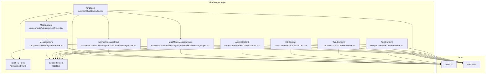
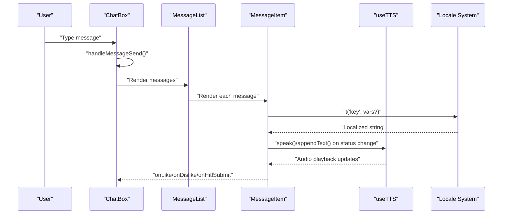
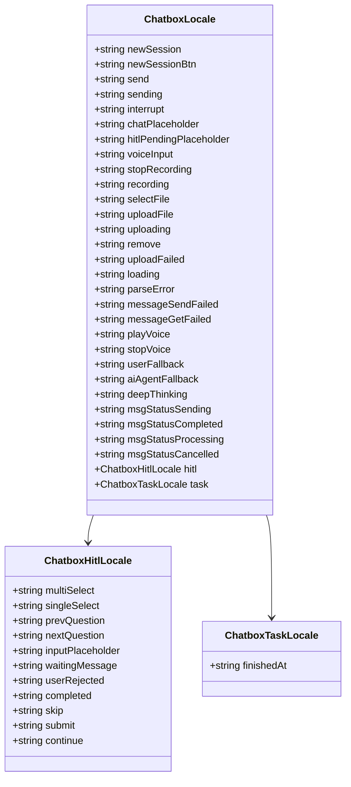
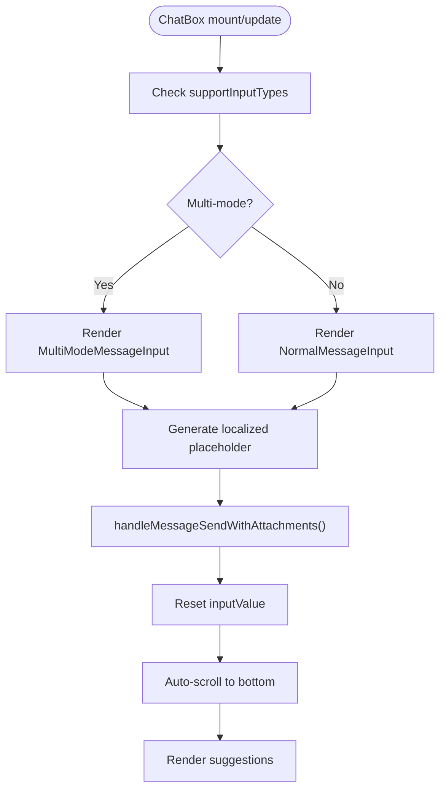
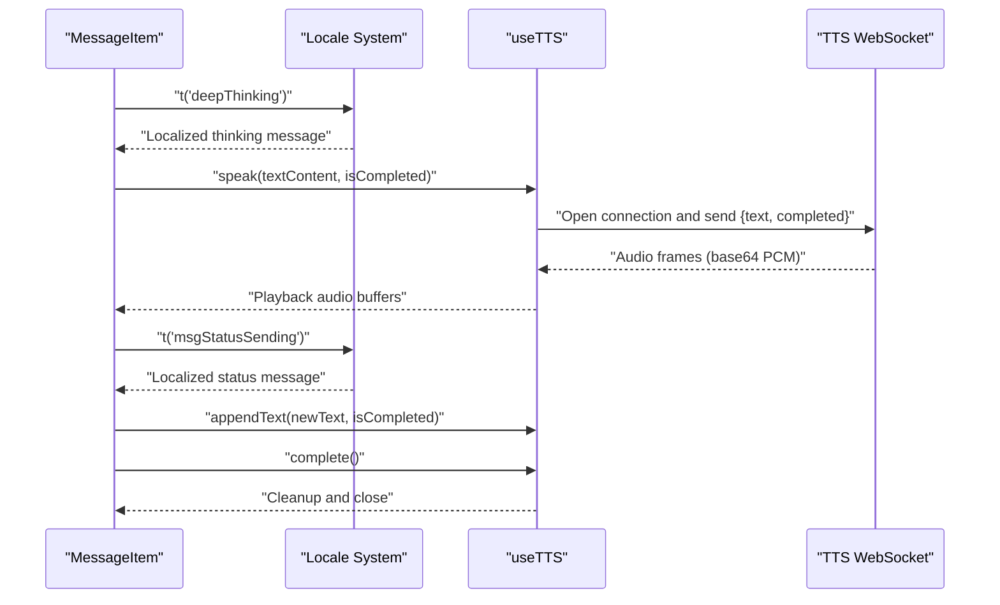
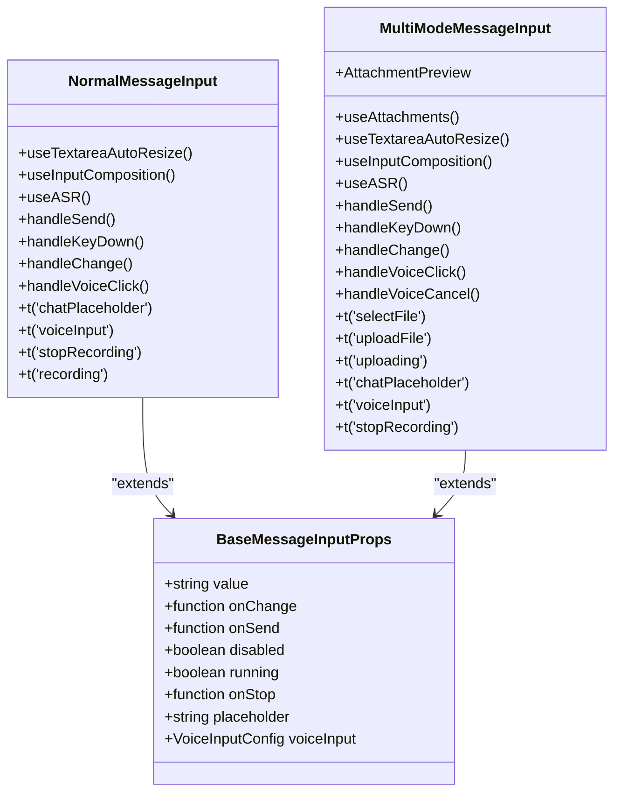
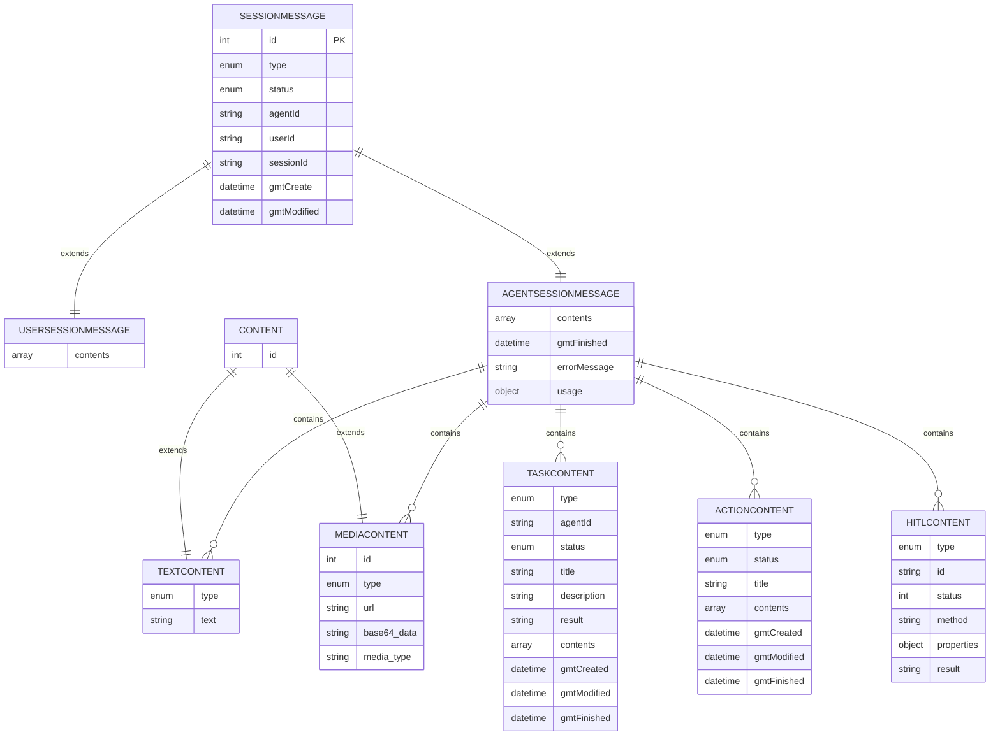
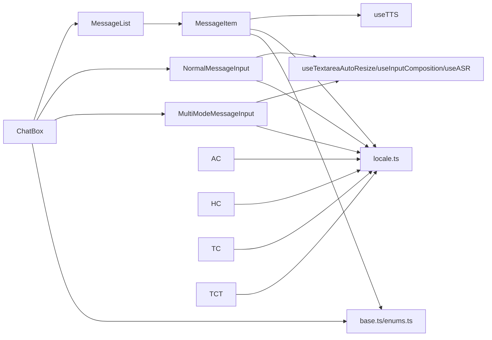

# React Component Structure

<cite>
**Referenced Files in This Document**
- [index.tsx](file://frontend/packages/chatbox/extends/ChatBox/index.tsx)
- [MessageList/index.tsx](file://frontend/packages/chatbox/components/MessageList/index.tsx)
- [MessageItem/index.tsx](file://frontend/packages/chatbox/components/MessageItem/index.tsx)
- [MessageInput/index.tsx](file://frontend/packages/chatbox/extends/ChatBox/MessageInput/index.tsx)
- [NormalMessageInput.tsx](file://frontend/packages/chatbox/extends/ChatBox/MessageInput/NormalMessageInput.tsx)
- [MultiModeMessageInput.tsx](file://frontend/packages/chatbox/extends/ChatBox/MessageInput/MultiModeMessageInput.tsx)
- [ActionContent/index.tsx](file://frontend/packages/chatbox/components/ActionContent/index.tsx)
- [HitlContent/index.tsx](file://frontend/packages/chatbox/components/HitlContent/index.tsx)
- [TaskContent/index.tsx](file://frontend/packages/chatbox/components/TaskContent/index.tsx)
- [TextContent/index.tsx](file://frontend/packages/chatbox/components/TextContent/index.tsx)
- [useTTS.ts](file://frontend/packages/chatbox/hooks/useTTS.ts)
- [locale.ts](file://frontend/packages/chatbox/locale.ts)
- [base.ts](file://frontend/packages/chatbox/types/base.ts)
- [enums.ts](file://frontend/packages/chatbox/types/enums.ts)
- [index.ts](file://frontend/packages/chatbox/index.ts)
</cite>

## Update Summary
**Changes Made**
- Added comprehensive internationalization support with new locale system
- Updated MessageItem, ActionContent, HitlContent, TaskContent, and TextContent components to use translation hooks
- Implemented lightweight zero-dependency locale registry with 205 lines of TypeScript code
- Added translation functions and backend label mapping capabilities
- Enhanced all UI strings with localized content support

## Table of Contents
1. [Introduction](#introduction)
2. [Project Structure](#project-structure)
3. [Core Components](#core-components)
4. [Architecture Overview](#architecture-overview)
5. [Internationalization System](#internationalization-system)
6. [Detailed Component Analysis](#detailed-component-analysis)
7. [Dependency Analysis](#dependency-analysis)
8. [Performance Considerations](#performance-considerations)
9. [Troubleshooting Guide](#troubleshooting-guide)
10. [Conclusion](#conclusion)
11. [Appendices](#appendices)

## Introduction
This document describes the React component structure of the Tron OneAgent frontend chat module. It focuses on the modular architecture centered around the chatbox package, the ChatBox component hierarchy, and the composition patterns used for rendering messages, handling user input, and integrating with external services such as TTS via WebSocket. The system now includes comprehensive internationalization support with a lightweight locale registry that enables multi-language UI rendering across all components.

## Project Structure
The frontend is organized into packages. The chatbox package contains the primary chat UI components, supporting both single-modal and multi-modal input modes, message rendering, and TTS integration. The control package provides a control panel application with routing and page components. The client package appears to be empty in the current snapshot. The internationalization system is built into the chatbox package with a zero-dependency locale registry.

**Diagram sources**
- [index.tsx:85-342](file://frontend/packages/chatbox/extends/ChatBox/index.tsx#L85-L342)
- [MessageList/index.tsx:51-109](file://frontend/packages/chatbox/components/MessageList/index.tsx#L51-L109)
- [MessageItem/index.tsx:128-506](file://frontend/packages/chatbox/components/MessageItem/index.tsx#L128-L506)
- [NormalMessageInput.tsx:27-145](file://frontend/packages/chatbox/extends/ChatBox/MessageInput/NormalMessageInput.tsx#L27-L145)
- [MultiModeMessageInput.tsx:30-200](file://frontend/packages/chatbox/extends/ChatBox/MessageInput/MultiModeMessageInput.tsx#L30-L200)
- [ActionContent/index.tsx:30-127](file://frontend/packages/chatbox/components/ActionContent/index.tsx#L30-L127)
- [HitlContent/index.tsx:43-399](file://frontend/packages/chatbox/components/HitlContent/index.tsx#L43-L399)
- [TaskContent/index.tsx:30-148](file://frontend/packages/chatbox/components/TaskContent/index.tsx#L30-L148)
- [TextContent/index.tsx:36-150](file://frontend/packages/chatbox/components/TextContent/index.tsx#L36-L150)
- [useTTS.ts:106-377](file://frontend/packages/chatbox/hooks/useTTS.ts#L106-L377)
- [locale.ts:147-205](file://frontend/packages/chatbox/locale.ts#L147-L205)
- [base.ts:26-124](file://frontend/packages/chatbox/types/base.ts#L26-L124)
- [enums.ts:18-69](file://frontend/packages/chatbox/types/enums.ts#L18-L69)

**Section sources**
- [index.ts:18-36](file://frontend/packages/chatbox/index.ts#L18-L36)

## Core Components
- ChatBox: The top-level chat container that orchestrates the header, message list, suggestions, and input area. It manages scrolling behavior, input mode selection, and integrates TTS playback for agent messages. Now includes internationalization support through the locale system.
- MessageList: Renders a list of messages and marks the last newly received agent message for special handling (e.g., auto-TTS).
- MessageItem: Renders a single message, dispatches content-specific renderers (text, media, tasks, actions, HITL), handles TTS playback, and displays status and usage metrics. Uses translation hooks for all UI strings.
- NormalMessageInput: Single-modal text input with optional voice input and composition handling. Enhanced with localized placeholder and button text.
- MultiModeMessageInput: Multi-modal input supporting text, attachments, and voice input with attachment preview and upload state. All UI elements are now localized.
- ActionContent: Renders action items with status indicators and timing information. Uses localized status messages and time formatting.
- HitlContent: Handles human-in-the-loop interactions with multi-step question flows. Fully localized with dynamic translation support.
- TaskContent: Manages task hierarchies with nested actions and text content. Uses localized status messages and completion times.
- TextContent: Renders markdown content with syntax highlighting and mathematical expressions. Includes localized error and loading messages.
- useTTS: Hook that manages WebSocket-based TTS streaming, queueing audio buffers, and controlling playback lifecycle.
- Locale System: Lightweight zero-dependency internationalization framework with deep merge capabilities and backend label mapping.

**Section sources**
- [index.tsx:41-79](file://frontend/packages/chatbox/extends/ChatBox/index.tsx#L41-L79)
- [MessageList/index.tsx:25-49](file://frontend/packages/chatbox/components/MessageList/index.tsx#L25-L49)
- [MessageItem/index.tsx:106-126](file://frontend/packages/chatbox/components/MessageItem/index.tsx#L106-L126)
- [NormalMessageInput.tsx:25-36](file://frontend/packages/chatbox/extends/ChatBox/MessageInput/NormalMessageInput.tsx#L25-L36)
- [MultiModeMessageInput.tsx:28-41](file://frontend/packages/chatbox/extends/ChatBox/MessageInput/MultiModeMessageInput.tsx#L28-L41)
- [ActionContent/index.tsx:30-127](file://frontend/packages/chatbox/components/ActionContent/index.tsx#L30-L127)
- [HitlContent/index.tsx:43-399](file://frontend/packages/chatbox/components/HitlContent/index.tsx#L43-L399)
- [TaskContent/index.tsx:30-148](file://frontend/packages/chatbox/components/TaskContent/index.tsx#L30-L148)
- [TextContent/index.tsx:36-150](file://frontend/packages/chatbox/components/TextContent/index.tsx#L36-L150)
- [useTTS.ts:72-100](file://frontend/packages/chatbox/hooks/useTTS.ts#L72-L100)
- [locale.ts:147-205](file://frontend/packages/chatbox/locale.ts#L147-L205)

## Architecture Overview
The ChatBox composes MessageList and MessageItem to render conversation history. It conditionally renders NormalMessageInput or MultiModeMessageInput based on supported input types. MessageItem delegates content rendering to specialized renderers and integrates useTTS for agent audio playback. All components now utilize the locale system for consistent internationalization. Prop drilling occurs primarily from ChatBox down to MessageList and MessageItem, with callbacks passed upward for likes/dislikes and HITL submissions.

**Diagram sources**
- [index.tsx:144-173](file://frontend/packages/chatbox/extends/ChatBox/index.tsx#L144-L173)
- [MessageList/index.tsx:88-108](file://frontend/packages/chatbox/components/MessageList/index.tsx#L88-L108)
- [MessageItem/index.tsx:174-226](file://frontend/packages/chatbox/components/MessageItem/index.tsx#L174-L226)
- [useTTS.ts:277-310](file://frontend/packages/chatbox/hooks/useTTS.ts#L277-L310)
- [locale.ts:184-205](file://frontend/packages/chatbox/locale.ts#L184-L205)

## Internationalization System

### Locale Registry Architecture
The chatbox package implements a lightweight zero-dependency internationalization system with the following key features:

- **Zero Dependencies**: Built without external i18n libraries for minimal bundle size
- **Deep Merge Support**: Partial locale patches are deep-merged with defaults
- **Dynamic Updates**: Real-time locale switching via subscription pattern
- **Backend Label Mapping**: Optional mapper for translating backend-generated labels
- **Template Variables**: Support for interpolation in localized strings

### Locale Interface Structure
The locale system defines comprehensive interfaces for different UI contexts:

**Diagram sources**
- [locale.ts:21-71](file://frontend/packages/chatbox/locale.ts#L21-L71)

### Translation Functions
The system provides three core translation functions:

- **t(key, vars?)**: Main translation function with template variable support
- **setChatboxLocale(patch)**: Updates current locale with deep merge
- **subscribeChatboxLocale(fn)**: Registers listeners for locale changes
- **mapLabel(raw)**: Translates backend-generated labels through optional mapper

**Section sources**
- [locale.ts:147-205](file://frontend/packages/chatbox/locale.ts#L147-L205)

## Detailed Component Analysis

### ChatBox Component
Responsibilities:
- Manage input mode selection based on supportInputTypes.
- Control scroll behavior with auto-scroll and "back to bottom" UX.
- Render suggestions and integrate with external services (TTS, ASR).
- Gate send/stop actions based on running state and pending HITL.
- **Updated**: Utilize locale system for all UI strings including placeholders and button labels.

Key props and behaviors:
- Conditional input rendering: MultiModeMessageInput vs NormalMessageInput.
- Scroll detection and throttled scroll handler.
- Auto-scroll timer when running.
- Suggestions rendering and click handler.
- TTS integration via MessageList and MessageItem.
- **Updated**: Dynamic placeholder generation using localized strings.

**Diagram sources**
- [index.tsx:113-120](file://frontend/packages/chatbox/extends/ChatBox/index.tsx#L113-L120)
- [index.tsx:306-337](file://frontend/packages/chatbox/extends/ChatBox/index.tsx#L306-L337)
- [index.tsx:144-173](file://frontend/packages/chatbox/extends/ChatBox/index.tsx#L144-L173)
- [index.tsx:220-227](file://frontend/packages/chatbox/extends/ChatBox/index.tsx#L220-L227)
- [index.tsx:229-252](file://frontend/packages/chatbox/extends/ChatBox/index.tsx#L229-L252)

**Section sources**
- [index.tsx:41-79](file://frontend/packages/chatbox/extends/ChatBox/index.tsx#L41-L79)
- [index.tsx:113-120](file://frontend/packages/chatbox/extends/ChatBox/index.tsx#L113-L120)
- [index.tsx:144-173](file://frontend/packages/chatbox/extends/ChatBox/index.tsx#L144-L173)
- [index.tsx:220-252](file://frontend/packages/chatbox/extends/ChatBox/index.tsx#L220-L252)

### MessageList Component
Responsibilities:
- Iterate over messages and pass contextual props to MessageItem.
- Track initial message IDs to identify the last new agent message.
- Forward callbacks for expand toggles, TTS, likes/dislikes, and HITL.
- **Updated**: All components now receive locale-aware props through MessageItem.

**Diagram sources**
- [MessageList/index.tsx:66-86](file://frontend/packages/chatbox/components/MessageList/index.tsx#L66-L86)
- [MessageList/index.tsx:88-108](file://frontend/packages/chatbox/components/MessageList/index.tsx#L88-L108)

**Section sources**
- [MessageList/index.tsx:25-49](file://frontend/packages/chatbox/components/MessageList/index.tsx#L25-L49)
- [MessageList/index.tsx:66-86](file://frontend/packages/chatbox/components/MessageList/index.tsx#L66-L86)
- [MessageList/index.tsx:88-108](file://frontend/packages/chatbox/components/MessageList/index.tsx#L88-L108)

### MessageItem Component
Responsibilities:
- Render message header, avatar, and timestamps.
- Route content rendering to specialized renderers based on ContentType.
- Integrate TTS playback with streaming text updates and completion signals.
- Display status indicators and usage metrics for agent messages.
- Handle user interactions: like/dislike and HITL submission.
- **Updated**: All UI strings now use the locale system for internationalization.

TTS integration highlights:
- Extracts plain text from markdown for TTS.
- Manages WebSocket connection and audio queue.
- Streams partial text and completes when message status indicates success.
- **Updated**: Uses localized status messages and fallback names.

**Diagram sources**
- [MessageItem/index.tsx:174-226](file://frontend/packages/chatbox/components/MessageItem/index.tsx#L174-L226)
- [MessageItem/index.tsx:294-304](file://frontend/packages/chatbox/components/MessageItem/index.tsx#L294-L304)
- [MessageItem/index.tsx:348-356](file://frontend/packages/chatbox/components/MessageItem/index.tsx#L348-L356)
- [useTTS.ts:188-274](file://frontend/packages/chatbox/hooks/useTTS.ts#L188-L274)
- [useTTS.ts:301-364](file://frontend/packages/chatbox/hooks/useTTS.ts#L301-L364)
- [locale.ts:184-205](file://frontend/packages/chatbox/locale.ts#L184-L205)

**Section sources**
- [MessageItem/index.tsx:106-126](file://frontend/packages/chatbox/components/MessageItem/index.tsx#L106-L126)
- [MessageItem/index.tsx:156-170](file://frontend/packages/chatbox/components/MessageItem/index.tsx#L156-L170)
- [MessageItem/index.tsx:174-226](file://frontend/packages/chatbox/components/MessageItem/index.tsx#L174-L226)
- [MessageItem/index.tsx:228-258](file://frontend/packages/chatbox/components/MessageItem/index.tsx#L228-L258)
- [MessageItem/index.tsx:300-357](file://frontend/packages/chatbox/components/MessageItem/index.tsx#L300-L357)
- [MessageItem/index.tsx:359-440](file://frontend/packages/chatbox/components/MessageItem/index.tsx#L359-L440)
- [MessageItem/index.tsx:442-458](file://frontend/packages/chatbox/components/MessageItem/index.tsx#L442-L458)
- [useTTS.ts:106-377](file://frontend/packages/chatbox/hooks/useTTS.ts#L106-L377)

### MessageInput Components
Responsibilities:
- NormalMessageInput: Single-modal text input with composition handling and optional voice input.
- MultiModeMessageInput: Adds attachment selection, preview, and upload state alongside text and voice input.
- **Updated**: All UI elements now use localized strings for placeholders, buttons, and status messages.

Shared capabilities:
- Auto-resize textarea.
- Composition event handling to avoid premature sends.
- Voice input via useASR hook with real-time and final text callbacks.
- Send on Enter (Shift+Enter for newline).
- Stop button when running and onStop provided.
- **Updated**: Localized placeholder text and button titles.

**Diagram sources**
- [NormalMessageInput.tsx:25-36](file://frontend/packages/chatbox/extends/ChatBox/MessageInput/NormalMessageInput.tsx#L25-L36)
- [MultiModeMessageInput.tsx:28-41](file://frontend/packages/chatbox/extends/ChatBox/MessageInput/MultiModeMessageInput.tsx#L28-L41)
- [MessageInput/index.tsx:19-30](file://frontend/packages/chatbox/extends/ChatBox/MessageInput/index.tsx#L19-L30)

**Section sources**
- [NormalMessageInput.tsx:25-36](file://frontend/packages/chatbox/extends/ChatBox/MessageInput/NormalMessageInput.tsx#L25-L36)
- [NormalMessageInput.tsx:70-101](file://frontend/packages/chatbox/extends/ChatBox/MessageInput/NormalMessageInput.tsx#L70-L101)
- [MultiModeMessageInput.tsx:28-41](file://frontend/packages/chatbox/extends/ChatBox/MessageInput/MultiModeMessageInput.tsx#L28-L41)
- [MultiModeMessageInput.tsx:97-102](file://frontend/packages/chatbox/extends/ChatBox/MessageInput/MultiModeMessageInput.tsx#L97-L102)
- [MessageInput/index.tsx:19-30](file://frontend/packages/chatbox/extends/ChatBox/MessageInput/index.tsx#L19-L30)

### Content Components with Internationalization

#### ActionContent Component
- **Updated**: Uses localized status messages and time formatting.
- **Enhanced**: Integrates backend label mapping for tool names.
- **Features**: Dynamic status icons, color-coded status indicators, and formatted completion times.

#### HitlContent Component
- **Updated**: Fully localized multi-step question interface.
- **Enhanced**: Dynamic translation support for all UI elements including navigation and form controls.
- **Features**: Multi-select/single-select modes, skip functionality, and real-time validation.

#### TaskContent Component
- **Updated**: Uses localized status messages and completion time formatting.
- **Enhanced**: Nested action rendering with localized status reporting.
- **Features**: Expandable task hierarchy with dynamic content rendering.

#### TextContent Component
- **Updated**: Enhanced error handling with localized error messages.
- **Enhanced**: Loading states with localized placeholder text.
- **Features**: Custom tag parsing with error reporting and fallback rendering.

**Section sources**
- [ActionContent/index.tsx:30-127](file://frontend/packages/chatbox/components/ActionContent/index.tsx#L30-L127)
- [HitlContent/index.tsx:43-399](file://frontend/packages/chatbox/components/HitlContent/index.tsx#L43-L399)
- [TaskContent/index.tsx:30-148](file://frontend/packages/chatbox/components/TaskContent/index.tsx#L30-L148)
- [TextContent/index.tsx:36-150](file://frontend/packages/chatbox/components/TextContent/index.tsx#L36-L150)

### Types and Interfaces
Core data structures remain unchanged but now support internationalization through the locale system:
- SessionMessage, UserSessionMessage, AgentSessionMessage define the shape of chat messages.
- Content types include TextContent, MediaContent, TaskContent, ActionContent, and HitlContent.
- Enums define statuses for tasks, actions, messages, and content types.
- **Updated**: Locale interfaces provide structured access to all translatable UI strings.

**Diagram sources**
- [base.ts:26-124](file://frontend/packages/chatbox/types/base.ts#L26-L124)
- [enums.ts:18-69](file://frontend/packages/chatbox/types/enums.ts#L18-L69)

**Section sources**
- [base.ts:26-124](file://frontend/packages/chatbox/types/base.ts#L26-L124)
- [enums.ts:18-69](file://frontend/packages/chatbox/types/enums.ts#L18-L69)

## Dependency Analysis
- ChatBox depends on MessageList, Header, and MessageInput variants.
- MessageList depends on MessageItem and passes props downstream.
- MessageItem depends on specialized content renderers and useTTS.
- MessageInput components depend on shared hooks for resizing, composition, attachments, and ASR.
- All components consume types from base.ts and enums.ts.
- **Updated**: All components now import and use the locale system for internationalization.

**Diagram sources**
- [index.tsx:25-37](file://frontend/packages/chatbox/extends/ChatBox/index.tsx#L25-L37)
- [MessageList/index.tsx:18-23](file://frontend/packages/chatbox/components/MessageList/index.tsx#L18-L23)
- [MessageItem/index.tsx:18-31](file://frontend/packages/chatbox/components/MessageItem/index.tsx#L18-L31)
- [NormalMessageInput.tsx:18-22](file://frontend/packages/chatbox/extends/ChatBox/MessageInput/NormalMessageInput.tsx#L18-L22)
- [MultiModeMessageInput.tsx:18-23](file://frontend/packages/chatbox/extends/ChatBox/MessageInput/MultiModeMessageInput.tsx#L18-L23)
- [base.ts:18-24](file://frontend/packages/chatbox/types/base.ts#L18-L24)
- [enums.ts:18-69](file://frontend/packages/chatbox/types/enums.ts#L18-L69)
- [locale.ts:147-205](file://frontend/packages/chatbox/locale.ts#L147-L205)

**Section sources**
- [index.tsx:25-37](file://frontend/packages/chatbox/extends/ChatBox/index.tsx#L25-L37)
- [MessageList/index.tsx:18-23](file://frontend/packages/chatbox/components/MessageList/index.tsx#L18-L23)
- [MessageItem/index.tsx:18-31](file://frontend/packages/chatbox/components/MessageItem/index.tsx#L18-L31)
- [NormalMessageInput.tsx:18-22](file://frontend/packages/chatbox/extends/ChatBox/MessageInput/NormalMessageInput.tsx#L18-L22)
- [MultiModeMessageInput.tsx:18-23](file://frontend/packages/chatbox/extends/ChatBox/MessageInput/MultiModeMessageInput.tsx#L18-L23)

## Performance Considerations
- Scrolling: ChatBox uses a throttled scroll handler and an auto-scroll timer while running to maintain responsiveness during streaming responses.
- Rendering: MessageList computes last-new-agent-message efficiently using a memoized scan and a ref to initial IDs to minimize re-renders.
- TTS: useTTS queues audio buffers and only starts playback when ready, avoiding redundant WebSocket connections by cleaning up on each new speak invocation.
- Input: Auto-resize and composition handlers prevent unnecessary reflows and ensure smooth typing and voice input experiences.
- **Updated**: Locale system uses efficient string lookup with dot-path navigation and caching mechanisms to minimize translation overhead.

[No sources needed since this section provides general guidance]

## Troubleshooting Guide
Common issues and remedies:
- TTS does not play:
  - Verify ttsWsUrl is reachable and secure origin is respected for WebSocket creation.
  - Confirm message status transitions to completed to trigger finalization.
- Messages not auto-scrolling:
  - Ensure running flag is set appropriately; the auto-scroll timer activates only when running is true.
  - Check scroll container ref is attached and scroll events are firing.
- Attachments not uploading:
  - Confirm accept attribute matches selected content types and that uploads are not in progress before sending.
- Voice input not working:
  - Validate voiceInput.wsUrl and ensure useASR hook receives onText/onFinalText callbacks.
- **Updated**: Localization issues:
  - Verify locale system is initialized with setChatboxLocale before component mounting.
  - Check that translation keys exist in the locale dictionary.
  - Ensure template variables are properly formatted when using t() function with variables.

**Section sources**
- [index.tsx:232-252](file://frontend/packages/chatbox/extends/ChatBox/index.tsx#L232-L252)
- [MessageItem/index.tsx:146-150](file://frontend/packages/chatbox/components/MessageItem/index.tsx#L146-L150)
- [MessageItem/index.tsx:228-258](file://frontend/packages/chatbox/components/MessageItem/index.tsx#L228-L258)
- [MultiModeMessageInput.tsx:77-84](file://frontend/packages/chatbox/extends/ChatBox/MessageInput/MultiModeMessageInput.tsx#L77-L84)
- [useTTS.ts:188-274](file://frontend/packages/chatbox/hooks/useTTS.ts#L188-L274)

## Conclusion
The Tron OneAgent chat module follows a clean, modular architecture with clear separation of concerns. ChatBox orchestrates the UI, MessageList/MessageItem handle rendering and TTS, and MessageInput variants manage user input across modalities. Strong TypeScript interfaces and enums provide robust contracts, while hooks encapsulate cross-cutting concerns like TTS and ASR. The new internationalization system adds comprehensive multi-language support without external dependencies, making the system truly global-ready. The design supports extensibility for new content types, UI layouts, and localization requirements.

[No sources needed since this section summarizes without analyzing specific files]

## Appendices

### Component Composition Patterns
- Container-Presentational: ChatBox acts as a container managing state and passing props; MessageList and MessageItem are presentational.
- Renderer Delegation: MessageItem switches content renderers based on ContentType, enabling reuse of TextContent, MediaContent, TaskContent, ActionContent, and HitlContent.
- Hook-Based Composition: useTTS, useTextareaAutoResize, useInputComposition, useAttachments, and useASR encapsulate behavior and are composed into input components.
- **Updated**: Locale Integration: All components now use the locale system for consistent internationalization.

**Section sources**
- [MessageItem/index.tsx:300-357](file://frontend/packages/chatbox/components/MessageItem/index.tsx#L300-L357)
- [useTTS.ts:106-377](file://frontend/packages/chatbox/hooks/useTTS.ts#L106-L377)
- [NormalMessageInput.tsx:18-22](file://frontend/packages/chatbox/extends/ChatBox/MessageInput/NormalMessageInput.tsx#L18-L22)
- [MultiModeMessageInput.tsx:18-23](file://frontend/packages/chatbox/extends/ChatBox/MessageInput/MultiModeMessageInput.tsx#L18-L23)

### Extending Chat Components
- Adding a new content type:
  - Define a new ContentType variant and extend Content union in base.ts.
  - Add a renderer component similar to TextContent, MediaContent, TaskContent, ActionContent, or HitlContent.
  - Update MessageItem's renderContent switch to handle the new type.
  - **Updated**: Add corresponding translation keys to locale.ts for internationalization.
- Creating a new UI layout:
  - Extend ChatBox props to accept a custom header/userInput render function.
  - Compose new layout components and pass them via headerRender/userInputRender.
  - **Updated**: Ensure new UI strings are added to locale dictionaries.
- Implementing custom message types:
  - Define the payload structure in base.ts and update enums.ts if needed.
  - Wire MessageItem to render the new content and integrate with TTS if applicable.
  - **Updated**: Add locale entries for any new UI strings or status messages.

**Section sources**
- [base.ts:62-108](file://frontend/packages/chatbox/types/base.ts#L62-L108)
- [enums.ts:60-69](file://frontend/packages/chatbox/types/enums.ts#L60-L69)
- [MessageItem/index.tsx:300-357](file://frontend/packages/chatbox/components/MessageItem/index.tsx#L300-L357)
- [index.tsx:55-56](file://frontend/packages/chatbox/extends/ChatBox/index.tsx#L55-L56)

### TypeScript Interfaces and Prop Validation
- ChatBoxProps: Central contract for ChatBox, including session info, message list, callbacks, TTS flags, and suggestion props.
- MessageListProps: Defines message array and rendering-related callbacks.
- MessageItemProps: Includes content rendering, TTS flags, and feedback callbacks.
- Input props: BaseMessageInputProps plus input-specific flags and voice configuration.
- **Updated**: Locale interfaces provide structured access to all translatable UI strings.

Recommendations:
- Use strict prop types as defined in the interfaces.
- Validate presence of required props (e.g., handleSendMessage) before invoking.
- Guard optional props (e.g., ttsWsUrl) with defaults inside components.
- **Updated**: Initialize locale system with setChatboxLocale before component usage.

**Section sources**
- [index.tsx:41-79](file://frontend/packages/chatbox/extends/ChatBox/index.tsx#L41-L79)
- [MessageList/index.tsx:25-49](file://frontend/packages/chatbox/components/MessageList/index.tsx#L25-L49)
- [MessageItem/index.tsx:106-126](file://frontend/packages/chatbox/components/MessageItem/index.tsx#L106-L126)
- [MessageInput/index.tsx:21-26](file://frontend/packages/chatbox/extends/ChatBox/MessageInput/index.tsx#L21-L26)

### Component Lifecycle Management and Event Handling
- ChatBox:
  - Scroll listener setup and cleanup.
  - Auto-scroll timer start/stop based on running state.
  - Back-to-bottom button visibility based on scroll threshold.
- MessageItem:
  - TTS lifecycle: connect on demand, stream partial text, finalize on completion.
  - Cleanup on unmount to stop audio and close WebSocket.
  - **Updated**: Locale subscription and cleanup for dynamic language switching.
- Inputs:
  - Composition events to avoid premature sends.
  - Voice recording start/stop/cancel with proper state resets.
- **Updated**: Locale system maintains subscriptions and cleans up listeners on component unmount.

**Section sources**
- [index.tsx:220-252](file://frontend/packages/chatbox/extends/ChatBox/index.tsx#L220-L252)
- [MessageItem/index.tsx:174-226](file://frontend/packages/chatbox/components/MessageItem/index.tsx#L174-L226)
- [MessageItem/index.tsx:278-285](file://frontend/packages/chatbox/components/MessageItem/index.tsx#L278-L285)
- [NormalMessageInput.tsx:76-84](file://frontend/packages/chatbox/extends/ChatBox/MessageInput/NormalMessageInput.tsx#L76-L84)
- [MultiModeMessageInput.tsx:122-135](file://frontend/packages/chatbox/extends/ChatBox/MessageInput/MultiModeMessageInput.tsx#L122-L135)

### Integration with External Services
- TTS WebSocket:
  - useTTS initializes a WebSocket to the provided URL, decodes PCM audio, and plays via Web Audio API.
  - Handles streaming completion and error states.
- ASR (Voice Input):
  - useASR connects to a voice WebSocket and emits interim and final text to update input state.
- Suggestions:
  - ChatBox renders suggestions and triggers onSuggestionClick callbacks.
- **Updated**: Locale System:
  - Provides centralized translation management with deep merge and subscription patterns.
  - Supports dynamic locale switching and backend label mapping.

**Section sources**
- [useTTS.ts:188-274](file://frontend/packages/chatbox/hooks/useTTS.ts#L188-L274)
- [useTTS.ts:301-364](file://frontend/packages/chatbox/hooks/useTTS.ts#L301-L364)
- [NormalMessageInput.tsx:60-68](file://frontend/packages/chatbox/extends/ChatBox/MessageInput/NormalMessageInput.tsx#L60-L68)
- [MultiModeMessageInput.tsx:65-74](file://frontend/packages/chatbox/extends/ChatBox/MessageInput/MultiModeMessageInput.tsx#L65-L74)
- [index.tsx:281-293](file://frontend/packages/chatbox/extends/ChatBox/index.tsx#L281-L293)

### Testing Strategies
- Unit tests for hooks:
  - Mock WebSocket and AudioContext to verify state transitions and audio queue behavior.
- Component tests:
  - Render ChatBox with mocked messages and callbacks; simulate user interactions (typing, sending, scrolling).
  - Test multi-modal input with mock file selection and attachment previews.
  - **Updated**: Test locale system with different language configurations and dynamic updates.
- Integration tests:
  - Simulate TTS WebSocket responses and assert audio playback and completion signals.
  - Validate HITL submission flow and suggestion click handlers.
  - **Updated**: Test translation functions with various locale dictionaries and template variables.
- **Updated**: Localization testing:
  - Verify locale switching triggers component re-rendering.
  - Test deep merge functionality with partial locale updates.
  - Validate backend label mapping integration.

[No sources needed since this section provides general guidance]

### Internationalization Implementation Guide

#### Setting Up Locale System
1. Initialize locale system with default Chinese locale
2. Override with desired language using setChatboxLocale
3. Register listeners for dynamic language changes
4. Configure backend label mapping if needed

#### Adding New Translations
1. Add new keys to locale.ts interface definitions
2. Provide default translations in DEFAULT_LOCALE
3. Update component code to use t() function
4. Test with different locale configurations

#### Best Practices
- Use dot-notation for complex translations (e.g., 'hitl.multiSelect')
- Support template variables for dynamic content
- Maintain consistent key naming conventions
- Test with right-to-left languages if needed
- Consider pluralization and gender-specific translations

**Section sources**
- [locale.ts:147-205](file://frontend/packages/chatbox/locale.ts#L147-L205)
- [MessageItem/index.tsx:294-304](file://frontend/packages/chatbox/components/MessageItem/index.tsx#L294-L304)
- [HitlContent/index.tsx:233-255](file://frontend/packages/chatbox/components/HitlContent/index.tsx#L233-L255)
- [TaskContent/index.tsx:117](file://frontend/packages/chatbox/components/TaskContent/index.tsx#L117)
- [TextContent/index.tsx:86-118](file://frontend/packages/chatbox/components/TextContent/index.tsx#L86-118)