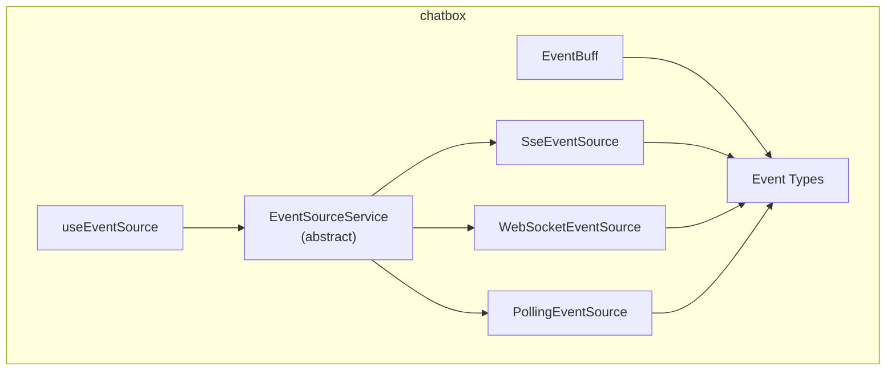
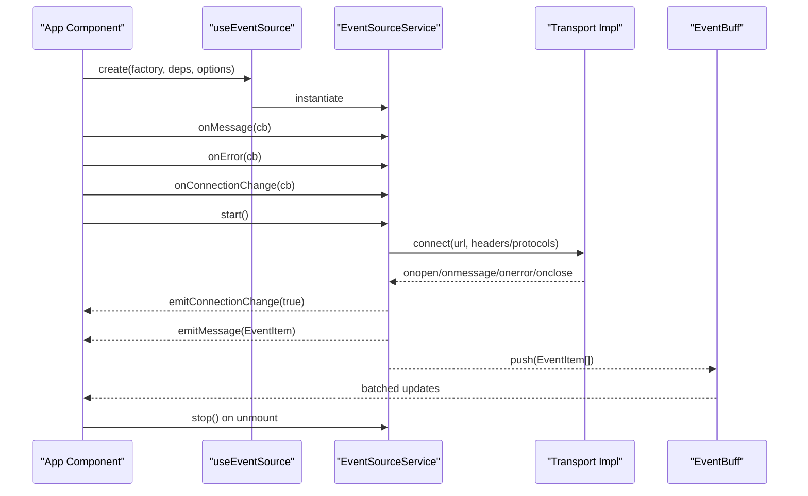
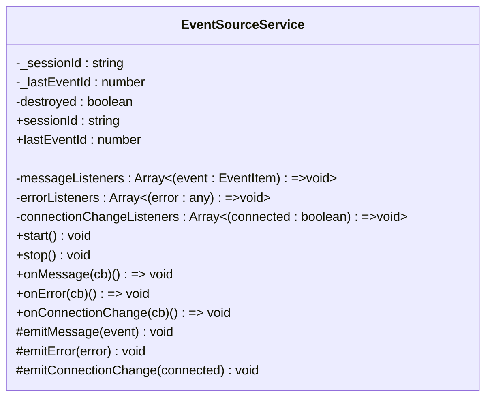
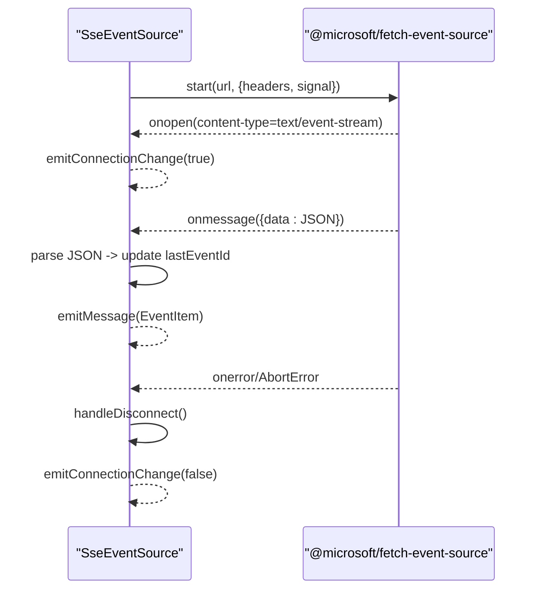
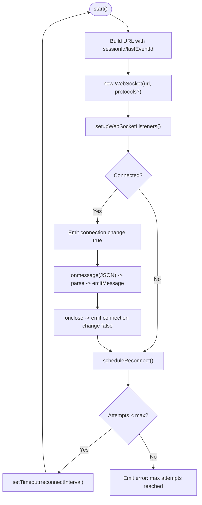
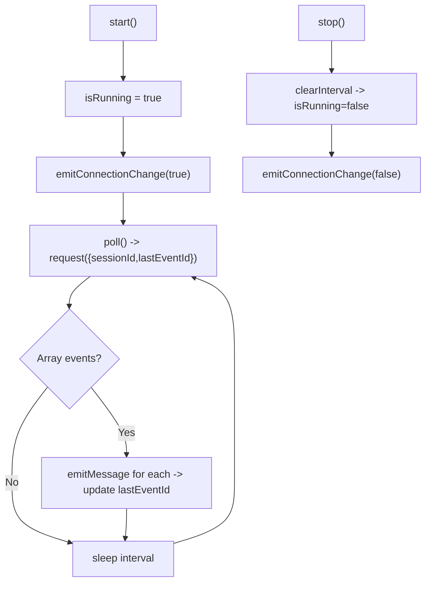
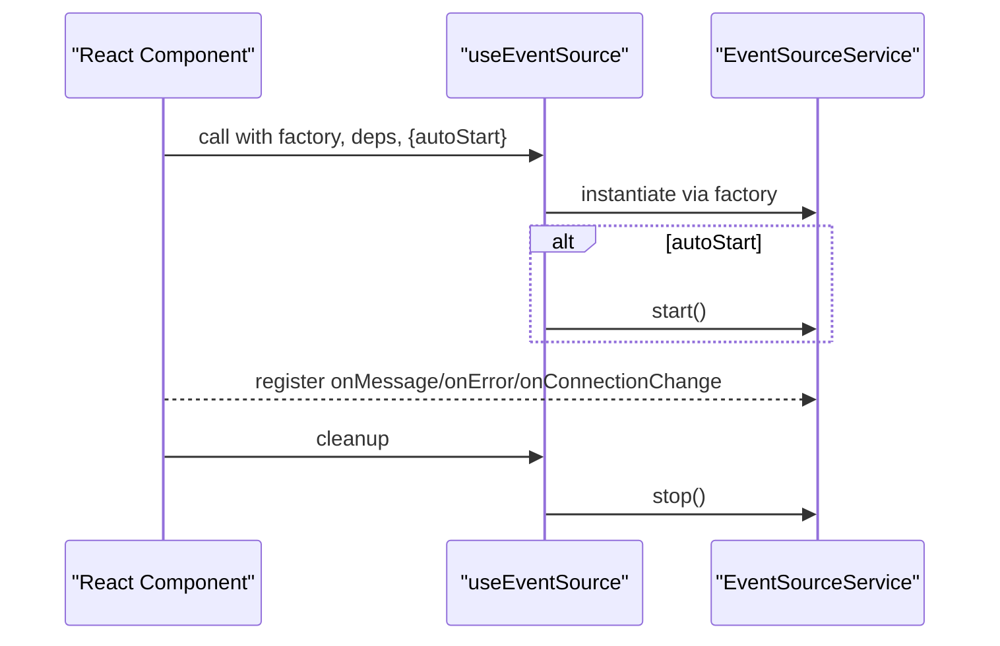
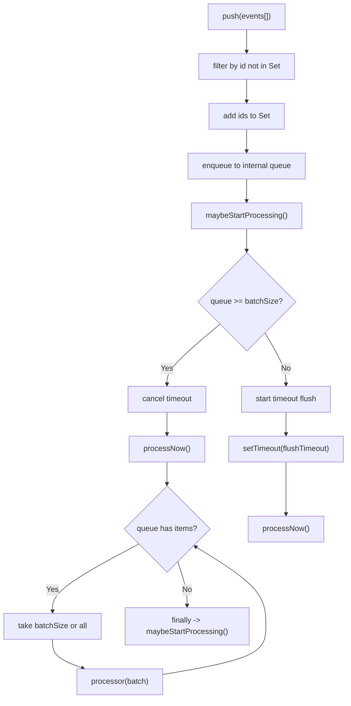
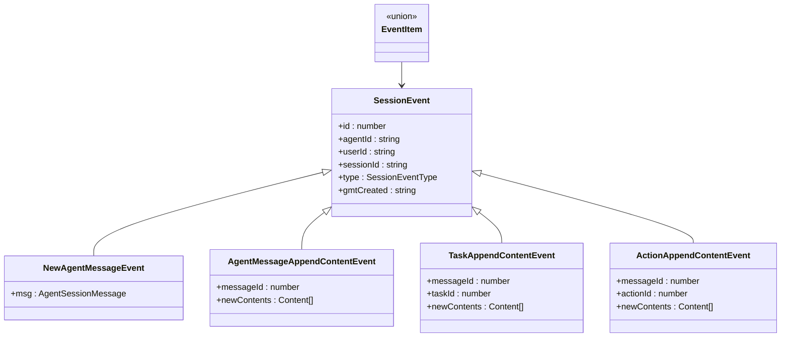
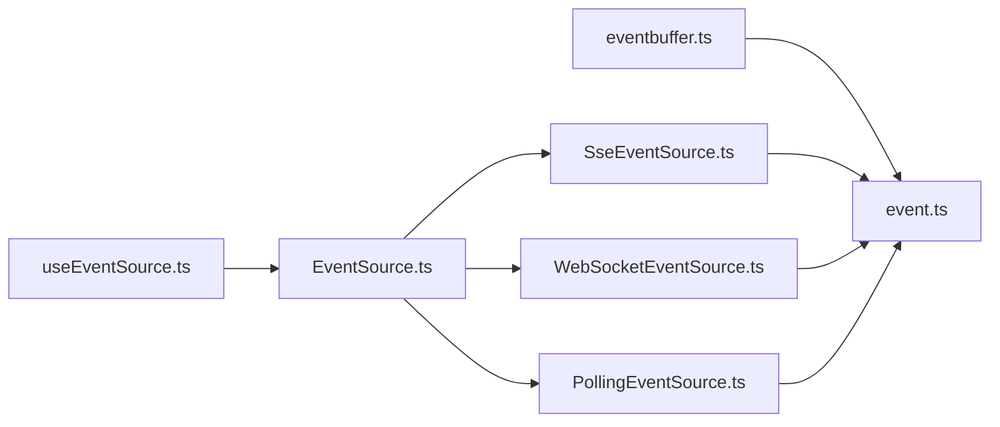

# Real-time Communication and Streaming

<cite>
**Referenced Files in This Document**
- [EventSource.ts](file://frontend/packages/chatbox/eventSource/EventSource.ts)
- [SseEventSource.ts](file://frontend/packages/chatbox/eventSource/SseEventSource.ts)
- [WebSocketEventSource.ts](file://frontend/packages/chatbox/eventSource/WebSocketEventSource.ts)
- [PollingEventSource.ts](file://frontend/packages/chatbox/eventSource/PollingEventSource.ts)
- [useEventSource.ts](file://frontend/packages/chatbox/hooks/useEventSource.ts)
- [eventbuffer.ts](file://frontend/packages/chatbox/eventBuffer/eventbuffer.ts)
- [event.ts](file://frontend/packages/chatbox/types/event.ts)
- [index.ts](file://frontend/packages/chatbox/index.ts)
</cite>

## Table of Contents
1. [Introduction](#introduction)
2. [Project Structure](#project-structure)
3. [Core Components](#core-components)
4. [Architecture Overview](#architecture-overview)
5. [Detailed Component Analysis](#detailed-component-analysis)
6. [Dependency Analysis](#dependency-analysis)
7. [Performance Considerations](#performance-considerations)
8. [Troubleshooting Guide](#troubleshooting-guide)
9. [Conclusion](#conclusion)
10. [Appendices](#appendices)

## Introduction
This document explains the real-time communication and streaming architecture in the Tron OneAgent frontend. It focuses on the event source abstraction and three concrete transports: Server-Sent Events (SSE), WebSocket, and HTTP polling. It covers connection lifecycle, automatic reconnection, streaming response processing, incremental message rendering, and robust error handling. Practical guidance is included for implementing custom event handlers, processing different message types, and managing connection states, along with performance and compatibility considerations.

## Project Structure
The real-time subsystem resides in the chatbox package and consists of:
- An abstract event source service that defines the contract for real-time transports
- Three transport implementations: SSE via @microsoft/fetch-event-source, WebSocket, and HTTP polling
- A React hook to manage the lifecycle of an event source instance
- An event buffer that batches and processes incoming events efficiently
- Strongly typed event models representing session and content updates

**Diagram sources**
- [EventSource.ts:23-89](file://frontend/packages/chatbox/eventSource/EventSource.ts#L23-L89)
- [SseEventSource.ts:28-117](file://frontend/packages/chatbox/eventSource/SseEventSource.ts#L28-L117)
- [WebSocketEventSource.ts:29-134](file://frontend/packages/chatbox/eventSource/WebSocketEventSource.ts#L29-L134)
- [PollingEventSource.ts:30-82](file://frontend/packages/chatbox/eventSource/PollingEventSource.ts#L30-L82)
- [useEventSource.ts:27-58](file://frontend/packages/chatbox/hooks/useEventSource.ts#L27-L58)
- [eventbuffer.ts:20-121](file://frontend/packages/chatbox/eventBuffer/eventbuffer.ts#L20-L121)
- [event.ts:106-115](file://frontend/packages/chatbox/types/event.ts#L106-L115)

**Section sources**
- [index.ts:18-36](file://frontend/packages/chatbox/index.ts#L18-L36)

## Core Components
- EventSourceService: Abstract base class defining the event source contract, listener registration, and connection state emission.
- SseEventSource: Implements SSE using @microsoft/fetch-event-source with automatic connection state reporting and error propagation.
- WebSocketEventSource: Provides WebSocket transport with configurable reconnection intervals and maximum attempts.
- PollingEventSource: Offers HTTP polling as a fallback mechanism with tunable intervals.
- useEventSource: React hook that creates and manages an event source instance with optional auto-start and cleanup.
- EventBuff: Batch and flush processor for streaming events with deduplication and controlled throughput.
- Event types: Strongly typed union of session and content-related events.

**Section sources**
- [EventSource.ts:23-89](file://frontend/packages/chatbox/eventSource/EventSource.ts#L23-L89)
- [SseEventSource.ts:28-117](file://frontend/packages/chatbox/eventSource/SseEventSource.ts#L28-L117)
- [WebSocketEventSource.ts:29-134](file://frontend/packages/chatbox/eventSource/WebSocketEventSource.ts#L29-L134)
- [PollingEventSource.ts:30-82](file://frontend/packages/chatbox/eventSource/PollingEventSource.ts#L30-L82)
- [useEventSource.ts:27-58](file://frontend/packages/chatbox/hooks/useEventSource.ts#L27-L58)
- [eventbuffer.ts:20-121](file://frontend/packages/chatbox/eventBuffer/eventbuffer.ts#L20-L121)
- [event.ts:106-115](file://frontend/packages/chatbox/types/event.ts#L106-L115)

## Architecture Overview
The system exposes a unified event source abstraction with pluggable transports. Applications integrate by creating an event source via the hook and registering listeners for messages, errors, and connection state changes. Incoming events are processed through a batching buffer to optimize UI updates and reduce overhead.

**Diagram sources**
- [useEventSource.ts:27-58](file://frontend/packages/chatbox/hooks/useEventSource.ts#L27-L58)
- [EventSource.ts:53-88](file://frontend/packages/chatbox/eventSource/EventSource.ts#L53-L88)
- [SseEventSource.ts:36-101](file://frontend/packages/chatbox/eventSource/SseEventSource.ts#L36-L101)
- [WebSocketEventSource.ts:39-111](file://frontend/packages/chatbox/eventSource/WebSocketEventSource.ts#L39-L111)
- [PollingEventSource.ts:38-81](file://frontend/packages/chatbox/eventSource/PollingEventSource.ts#L38-L81)
- [eventbuffer.ts:43-113](file://frontend/packages/chatbox/eventBuffer/eventbuffer.ts#L43-L113)

## Detailed Component Analysis

### EventSourceService (Abstract Base)
- Responsibilities:
  - Manage message, error, and connection-change listeners
  - Track session ID and last event ID for resuming streams
  - Provide start/stop lifecycle methods
  - Emit standardized events to registered listeners
- Design:
  - Listener arrays with removal capability
  - Protected emit helpers to notify subscribers
  - Abstract start/stop to be implemented by concrete transports

**Diagram sources**
- [EventSource.ts:23-89](file://frontend/packages/chatbox/eventSource/EventSource.ts#L23-L89)

**Section sources**
- [EventSource.ts:23-89](file://frontend/packages/chatbox/eventSource/EventSource.ts#L23-L89)

### SseEventSource (Server-Sent Events)
- Implementation highlights:
  - Uses @microsoft/fetch-event-source for robust SSE handling
  - Validates content-type and reports connection state on open
  - Parses JSON messages and updates lastEventId
  - Emits errors for parsing failures and aborts; disconnects gracefully
- Key behaviors:
  - AbortController support for clean shutdown
  - Automatic reconnection is not built-in; rely on higher-level orchestration or app-level restart

**Diagram sources**
- [SseEventSource.ts:36-101](file://frontend/packages/chatbox/eventSource/SseEventSource.ts#L36-L101)

**Section sources**
- [SseEventSource.ts:28-117](file://frontend/packages/chatbox/eventSource/SseEventSource.ts#L28-L117)

### WebSocketEventSource
- Implementation highlights:
  - Creates WebSocket with optional protocols
  - Listens to open/message/error/close events
  - Parses JSON messages and updates lastEventId
  - Implements exponential-friendly reconnection with configurable interval and max attempts
- Key behaviors:
  - Reconnection timer cleared on stop
  - Graceful disconnect reporting and error emission
  - Supports runtime session info updates by restarting the connection

**Diagram sources**
- [WebSocketEventSource.ts:39-134](file://frontend/packages/chatbox/eventSource/WebSocketEventSource.ts#L39-L134)

**Section sources**
- [WebSocketEventSource.ts:29-134](file://frontend/packages/chatbox/eventSource/WebSocketEventSource.ts#L29-L134)

### PollingEventSource (Fallback)
- Implementation highlights:
  - Periodic polling via a provided request function
  - Emits all returned events and advances lastEventId
  - Controlled by interval and safe running flag
- Key behaviors:
  - Emits connection change true on start and false on stop
  - Suitable for environments where SSE/WebSocket are unavailable

**Diagram sources**
- [PollingEventSource.ts:38-81](file://frontend/packages/chatbox/eventSource/PollingEventSource.ts#L38-L81)

**Section sources**
- [PollingEventSource.ts:30-82](file://frontend/packages/chatbox/eventSource/PollingEventSource.ts#L30-L82)

### useEventSource (React Integration)
- Responsibilities:
  - Creates an event source instance via a factory
  - Starts automatically if configured
  - Cleans up on component unmount by stopping the event source
  - Memoizes instances based on dependencies
- Usage pattern:
  - Pass a factory returning a concrete EventSourceService subclass
  - Register listeners for messages, errors, and connection changes
  - Optionally enable autoStart

**Diagram sources**
- [useEventSource.ts:27-58](file://frontend/packages/chatbox/hooks/useEventSource.ts#L27-L58)

**Section sources**
- [useEventSource.ts:19-58](file://frontend/packages/chatbox/hooks/useEventSource.ts#L19-L58)

### EventBuff (Streaming Buffer and Processor)
- Responsibilities:
  - Deduplicate events by ID
  - Batch events and process in chunks
  - Flush after a configurable timeout to avoid starvation
  - Retry on processing errors by restarting the flush timer
- Key behaviors:
  - Non-blocking processing loop
  - Safe handling of concurrent pushes during processing
  - Optional destruction to clear timers and buffers

**Diagram sources**
- [eventbuffer.ts:43-113](file://frontend/packages/chatbox/eventBuffer/eventbuffer.ts#L43-L113)

**Section sources**
- [eventbuffer.ts:20-121](file://frontend/packages/chatbox/eventBuffer/eventbuffer.ts#L20-L121)

### Event Types (Session and Content Updates)
- EventItem union covers:
  - Session-level: name changes
  - Message-level: new user/agent messages and append-content/status-changed
  - Task-level: append-content/status-change
  - Action-level: append-content/status-change
- Each event carries a numeric id, session identifiers, and typed payload fields

**Diagram sources**
- [event.ts:106-115](file://frontend/packages/chatbox/types/event.ts#L106-L115)

**Section sources**
- [event.ts:30-115](file://frontend/packages/chatbox/types/event.ts#L30-L115)

## Dependency Analysis
- EventSourceService is the central abstraction consumed by all transports.
- SseEventSource depends on @microsoft/fetch-event-source for transport details.
- WebSocketEventSource depends on the browser WebSocket API and implements reconnection logic internally.
- PollingEventSource depends on a user-provided request function.
- useEventSource orchestrates lifecycle and integrates with React.
- EventBuff depends on event types and a user-supplied processor function.

**Diagram sources**
- [useEventSource.ts:19-58](file://frontend/packages/chatbox/hooks/useEventSource.ts#L19-L58)
- [EventSource.ts:23-89](file://frontend/packages/chatbox/eventSource/EventSource.ts#L23-L89)
- [SseEventSource.ts:19-26](file://frontend/packages/chatbox/eventSource/SseEventSource.ts#L19-L26)
- [WebSocketEventSource.ts:19-27](file://frontend/packages/chatbox/eventSource/WebSocketEventSource.ts#L19-L27)
- [PollingEventSource.ts:19-28](file://frontend/packages/chatbox/eventSource/PollingEventSource.ts#L19-L28)
- [eventbuffer.ts:18-41](file://frontend/packages/chatbox/eventBuffer/eventbuffer.ts#L18-L41)
- [event.ts:18-28](file://frontend/packages/chatbox/types/event.ts#L18-L28)

**Section sources**
- [index.ts:18-36](file://frontend/packages/chatbox/index.ts#L18-L36)

## Performance Considerations
- Batch processing:
  - Use EventBuff to group frequent updates and reduce render churn.
  - Tune batchSize and flushTimeout for responsiveness vs. throughput.
- Memory management:
  - EventBuff maintains a Set of seen IDs to prevent duplicates; ensure IDs are unique and stable.
  - Call destroy on EventBuff when done to clear timers and arrays.
- Transport selection:
  - Prefer SSE for server-to-client streaming with low overhead.
  - Use WebSocket for bidirectional or high-reliability scenarios; configure reconnection parameters carefully.
  - Use polling as a fallback; tune interval to balance latency and server load.
- Rendering:
  - Apply incremental updates per event to minimize DOM work.
  - Debounce or throttle UI updates when processing high-frequency streams.

[No sources needed since this section provides general guidance]

## Troubleshooting Guide
- Connection fails to open (SSE):
  - Verify content-type is text/event-stream.
  - Confirm URL builder produces a valid endpoint with session and lastEventId.
  - Check network tab for CORS or authentication issues.
- Frequent disconnects (WebSocket):
  - Adjust reconnectInterval and maxReconnectAttempts.
  - Inspect server-side keepalive and idle timeouts.
- Parsing errors:
  - Ensure backend emits valid JSON for each event.
  - Handle partial or malformed frames gracefully in processors.
- UI not updating:
  - Confirm onMessage listeners are registered before start().
  - Verify EventBuff processor is invoked and events are being flushed.
- Graceful degradation:
  - Switch to PollingEventSource when SSE/WebSocket fail.
  - Monitor onConnectionChange to inform users of transport fallback.

**Section sources**
- [SseEventSource.ts:57-70](file://frontend/packages/chatbox/eventSource/SseEventSource.ts#L57-L70)
- [WebSocketEventSource.ts:113-127](file://frontend/packages/chatbox/eventSource/WebSocketEventSource.ts#L113-L127)
- [PollingEventSource.ts:38-81](file://frontend/packages/chatbox/eventSource/PollingEventSource.ts#L38-L81)
- [eventbuffer.ts:84-113](file://frontend/packages/chatbox/eventBuffer/eventbuffer.ts#L84-L113)

## Conclusion
The Tron OneAgent frontend provides a flexible, extensible real-time framework centered on an abstract event source service and three robust transport implementations. By combining efficient event buffering with clear lifecycle management and listener APIs, applications can deliver responsive, resilient real-time experiences across diverse environments. Proper configuration of transports, batching, and error handling ensures reliable operation under varying network conditions.

[No sources needed since this section summarizes without analyzing specific files]

## Appendices

### Practical Examples

- Implementing a custom event handler:
  - Register onMessage to receive EventItem and route to your processor.
  - Use onConnectionChange to toggle loading indicators or transport badges.
  - Use onError to surface user-facing errors and trigger retries.

- Processing different message types:
  - Match on EventItem.type to branch rendering or state updates.
  - For append-content events, incrementally update message content lists.
  - For status-change events, update metadata like finish timestamps or usage metrics.

- Managing connection states:
  - Start transport on mount; stop on unmount via useEventSource.
  - For SSE, consider app-level restart if disconnected.
  - For WebSocket, adjust reconnection parameters based on environment stability.

- Browser compatibility:
  - SSE requires @microsoft/fetch-event-source polyfills in older browsers.
  - WebSocket is broadly supported; ensure fallback to polling when necessary.
  - Polling works universally but increases server load; use judiciously.

[No sources needed since this section provides general guidance]