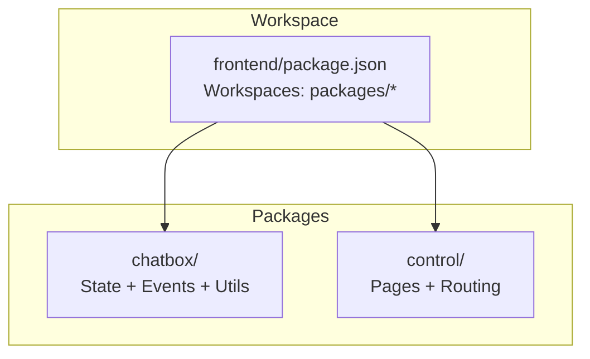
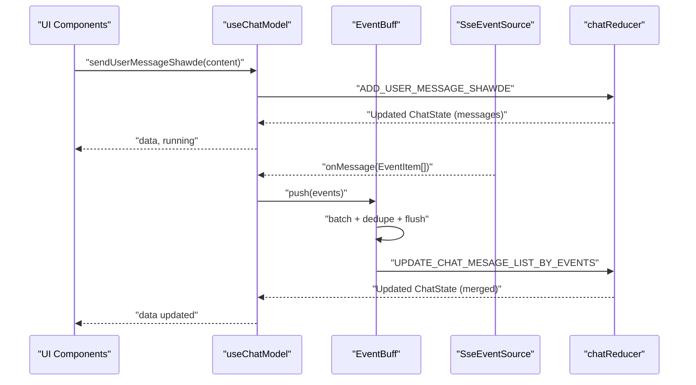
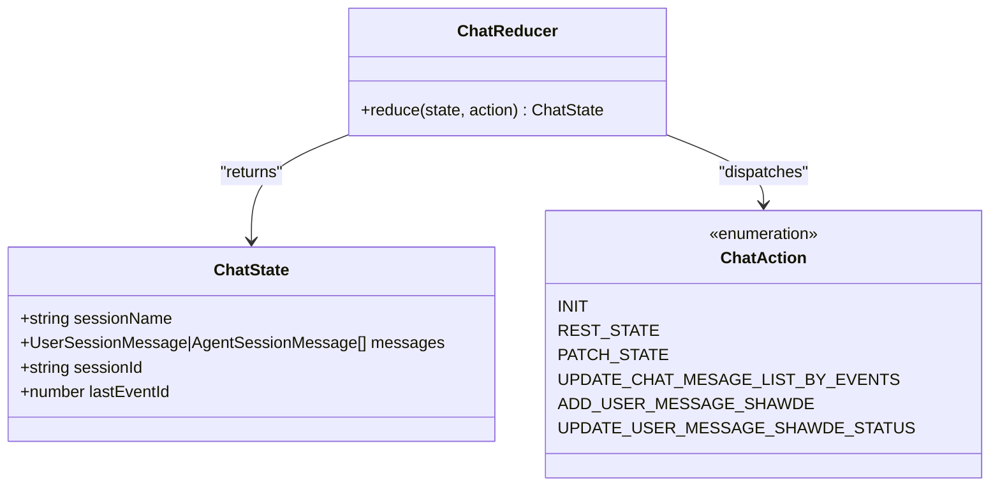
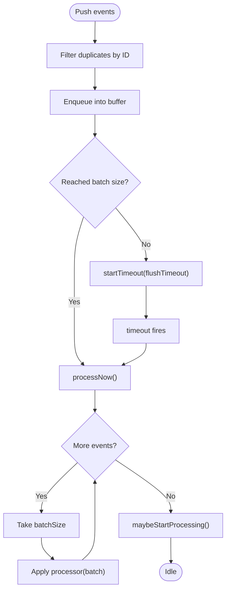
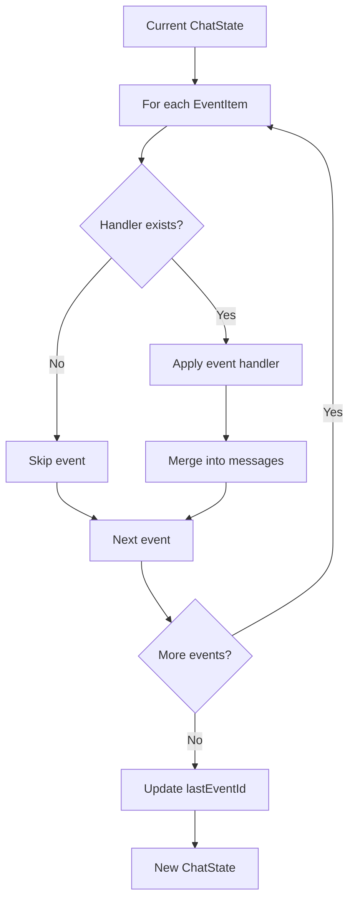
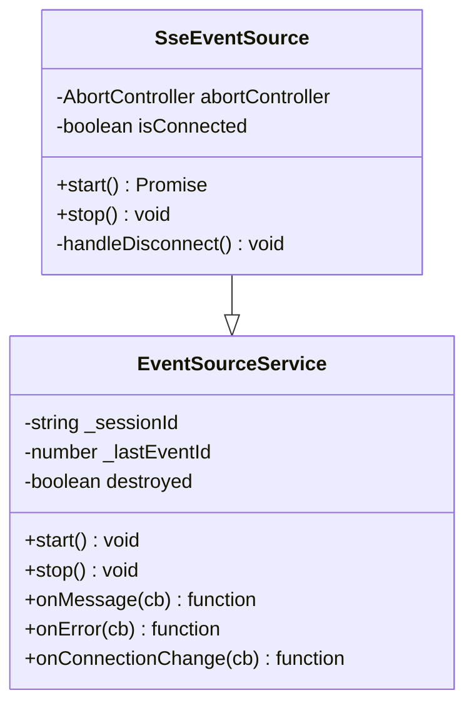
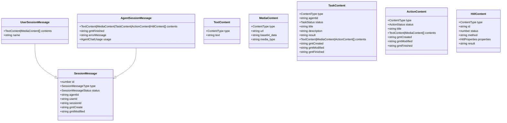
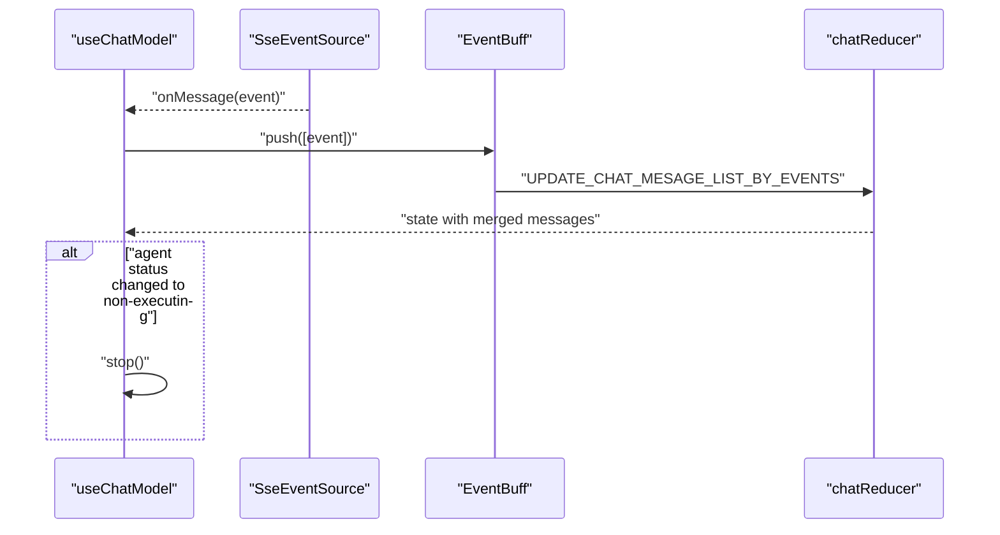
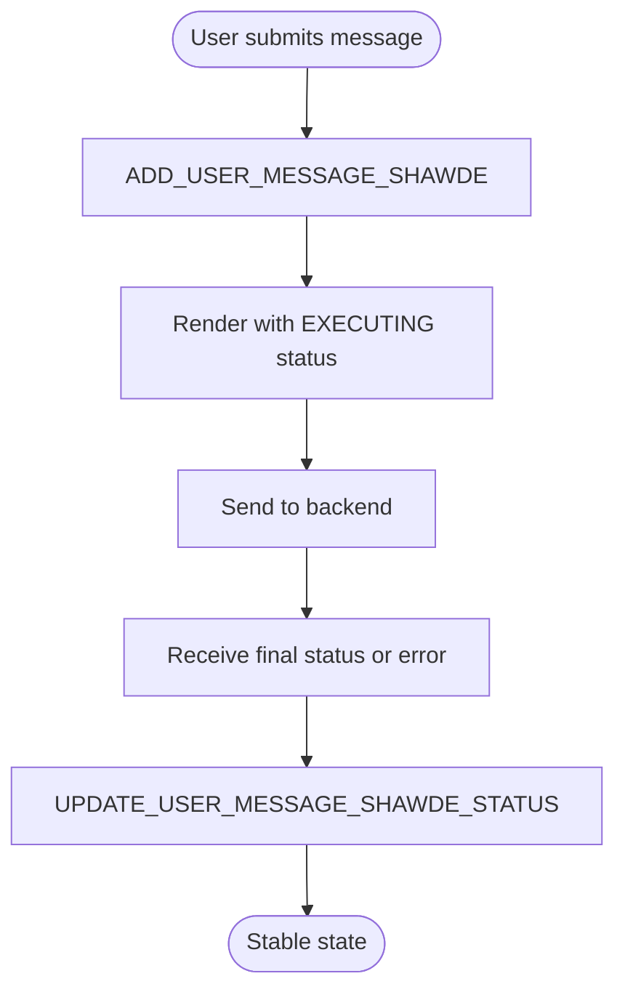
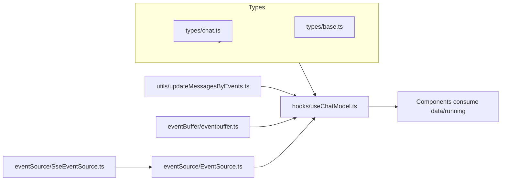

# State Management and Data Flow

<cite>
**Referenced Files in This Document**
- [useChatModel.ts](file://frontend/packages/chatbox/hooks/useChatModel.ts)
- [chat.ts](file://frontend/packages/chatbox/types/chat.ts)
- [base.ts](file://frontend/packages/chatbox/types/base.ts)
- [eventbuffer.ts](file://frontend/packages/chatbox/eventBuffer/eventbuffer.ts)
- [updateMessagesByEvents.ts](file://frontend/packages/chatbox/utils/updateMessagesByEvents.ts)
- [EventSource.ts](file://frontend/packages/chatbox/eventSource/EventSource.ts)
- [SseEventSource.ts](file://frontend/packages/chatbox/eventSource/SseEventSource.ts)
- [package.json](file://frontend/package.json)
</cite>

## Table of Contents
1. [Introduction](#introduction)
2. [Project Structure](#project-structure)
3. [Core Components](#core-components)
4. [Architecture Overview](#architecture-overview)
5. [Detailed Component Analysis](#detailed-component-analysis)
6. [Dependency Analysis](#dependency-analysis)
7. [Performance Considerations](#performance-considerations)
8. [Troubleshooting Guide](#troubleshooting-guide)
9. [Conclusion](#conclusion)

## Introduction
This document explains the state management and data flow architecture for the Tron OneAgent frontend chat experience. It focuses on the store-like pattern implemented via React hooks and reducers, the event-driven chat state updates, and the real-time streaming pipeline. It also documents TypeScript types for sessions, messages, and user input states, and provides guidance on optimistic updates, streaming handling, and performance optimization for large conversation histories.

## Project Structure
The frontend is organized as a monorepo workspace with multiple packages. The chat state management and real-time updates live primarily in the chatbox package, while the control package orchestrates routing and page composition.

**Diagram sources**
- [package.json:1-12](file://frontend/package.json#L1-L12)

**Section sources**
- [package.json:1-12](file://frontend/package.json#L1-L12)

## Core Components
- Chat state container and reducer: Implements a reducer-based store for conversation state, with actions to patch state, append user messages, and update message lists from events.
- Event buffering: Batch and deduplicate real-time events to reduce re-renders and stabilize UI updates.
- Event source abstractions: Pluggable event sources (SSE) that emit typed events consumed by the chat model.
- Utilities: Event-to-state transformer that merges incremental content and status changes into the message list.

Key responsibilities:
- Global state pattern: Centralized ChatState managed by useChatModel with useReducer.
- Local component state: UI flags (running) and transient inputs remain in component scope.
- Real-time updates: Events are buffered and applied in batches to maintain responsiveness.
- Type safety: Strongly typed session, message, content, and event models.

**Section sources**
- [useChatModel.ts:89-231](file://frontend/packages/chatbox/hooks/useChatModel.ts#L89-L231)
- [chat.ts:79-136](file://frontend/packages/chatbox/types/chat.ts#L79-L136)
- [base.ts:26-125](file://frontend/packages/chatbox/types/base.ts#L26-L125)

## Architecture Overview
The chat state lifecycle integrates user actions, event sources, buffering, and reducer-driven updates.

**Diagram sources**
- [useChatModel.ts:120-149](file://frontend/packages/chatbox/hooks/useChatModel.ts#L120-L149)
- [eventbuffer.ts:43-113](file://frontend/packages/chatbox/eventBuffer/eventbuffer.ts#L43-L113)
- [updateMessagesByEvents.ts:331-352](file://frontend/packages/chatbox/utils/updateMessagesByEvents.ts#L331-L352)
- [SseEventSource.ts:72-95](file://frontend/packages/chatbox/eventSource/SseEventSource.ts#L72-L95)

## Detailed Component Analysis

### Chat State and Actions
The chat state encapsulates session metadata and the message list. Actions define how the state evolves, including:
- Patching partial state
- Resetting to default
- Updating messages from events
- Adding a user message shadow (optimistic)
- Updating the status of a user message shadow

**Diagram sources**
- [chat.ts:79-136](file://frontend/packages/chatbox/types/chat.ts#L79-L136)

**Section sources**
- [chat.ts:79-136](file://frontend/packages/chatbox/types/chat.ts#L79-L136)
- [useChatModel.ts:44-87](file://frontend/packages/chatbox/hooks/useChatModel.ts#L44-L87)

### Event Buffering and Deduplication
The event buffer aggregates incoming events, deduplicates by ID, and flushes in batches or after a timeout. This stabilizes rendering and reduces churn during rapid updates.

**Diagram sources**
- [eventbuffer.ts:43-113](file://frontend/packages/chatbox/eventBuffer/eventbuffer.ts#L43-L113)

**Section sources**
- [eventbuffer.ts:20-122](file://frontend/packages/chatbox/eventBuffer/eventbuffer.ts#L20-L122)

### Event-to-State Transformer
This utility applies event handlers to transform the current state into a new state reflecting incremental content and status changes. It supports merging text fragments, appending task/action content, and updating statuses.

**Diagram sources**
- [updateMessagesByEvents.ts:331-352](file://frontend/packages/chatbox/utils/updateMessagesByEvents.ts#L331-L352)

**Section sources**
- [updateMessagesByEvents.ts:107-330](file://frontend/packages/chatbox/utils/updateMessagesByEvents.ts#L107-L330)

### Event Source Abstractions
The event source abstraction defines a contract for connecting to a server-sent stream, emitting messages, errors, and connection state changes. The SSE implementation wires into a fetch-based event source library and emits parsed events to subscribers.

**Diagram sources**
- [EventSource.ts:23-89](file://frontend/packages/chatbox/eventSource/EventSource.ts#L23-L89)
- [SseEventSource.ts:28-118](file://frontend/packages/chatbox/eventSource/SseEventSource.ts#L28-L118)

**Section sources**
- [EventSource.ts:23-89](file://frontend/packages/chatbox/eventSource/EventSource.ts#L23-L89)
- [SseEventSource.ts:36-101](file://frontend/packages/chatbox/eventSource/SseEventSource.ts#L36-L101)

### Message and Content Types
The message hierarchy supports user and agent messages, with content variants for text, media, tasks, actions, and HITL prompts. Agent messages can carry usage metrics and error messages.

**Diagram sources**
- [base.ts:26-125](file://frontend/packages/chatbox/types/base.ts#L26-L125)

**Section sources**
- [base.ts:26-125](file://frontend/packages/chatbox/types/base.ts#L26-L125)

### Streaming and Real-Time Updates
The chat model coordinates running state with the event source. On receiving a message event, it pushes to the buffer, updates lastEventId, and stops when the agent message status is no longer executing. Initialization respects persisted session and lastEventId to resume streaming.

**Diagram sources**
- [useChatModel.ts:120-149](file://frontend/packages/chatbox/hooks/useChatModel.ts#L120-L149)
- [updateMessagesByEvents.ts:331-352](file://frontend/packages/chatbox/utils/updateMessagesByEvents.ts#L331-L352)

**Section sources**
- [useChatModel.ts:112-178](file://frontend/packages/chatbox/hooks/useChatModel.ts#L112-L178)
- [useChatModel.ts:151-166](file://frontend/packages/chatbox/hooks/useChatModel.ts#L151-L166)

### Optimistic Updates and User Input Shadows
Optimistic updates improve perceived latency by immediately appending a user message shadow with EXECUTING status. The shadow’s status can be updated later when the backend confirms receipt or when the final status arrives.

**Diagram sources**
- [useChatModel.ts:204-219](file://frontend/packages/chatbox/hooks/useChatModel.ts#L204-L219)
- [chat.ts:113-127](file://frontend/packages/chatbox/types/chat.ts#L113-L127)

**Section sources**
- [useChatModel.ts:55-82](file://frontend/packages/chatbox/hooks/useChatModel.ts#L55-L82)
- [useChatModel.ts:204-219](file://frontend/packages/chatbox/hooks/useChatModel.ts#L204-L219)

## Dependency Analysis
The chatbox package composes several modules:
- Hooks depend on types and utilities.
- Event buffering depends on event processors.
- Event sources depend on the event service abstraction.
- The reducer consumes event transformers and message types.

**Diagram sources**
- [useChatModel.ts:18-34](file://frontend/packages/chatbox/hooks/useChatModel.ts#L18-L34)
- [chat.ts:18-21](file://frontend/packages/chatbox/types/chat.ts#L18-L21)
- [base.ts:18-24](file://frontend/packages/chatbox/types/base.ts#L18-L24)
- [updateMessagesByEvents.ts:18-38](file://frontend/packages/chatbox/utils/updateMessagesByEvents.ts#L18-L38)
- [eventbuffer.ts:18-26](file://frontend/packages/chatbox/eventBuffer/eventbuffer.ts#L18-L26)
- [EventSource.ts:18-26](file://frontend/packages/chatbox/eventSource/EventSource.ts#L18-L26)
- [SseEventSource.ts:19-26](file://frontend/packages/chatbox/eventSource/SseEventSource.ts#L19-L26)

**Section sources**
- [useChatModel.ts:18-34](file://frontend/packages/chatbox/hooks/useChatModel.ts#L18-L34)
- [chat.ts:18-21](file://frontend/packages/chatbox/types/chat.ts#L18-L21)
- [base.ts:18-24](file://frontend/packages/chatbox/types/base.ts#L18-L24)

## Performance Considerations
- Batch and debounce event processing: The buffer processes events in batches and flushes after a timeout to minimize re-renders.
- Deduplication by event ID: Prevents redundant updates and stabilizes message merging.
- Immutable updates: Reducer and utilities clone arrays/objects to preserve referential integrity and enable efficient React updates.
- Streaming control: The model stops the event source upon finalizing agent message status to conserve resources.
- Large histories: Prefer paginated retrieval of messages and avoid deep cloning of very large arrays; consider virtualization at the UI layer.

[No sources needed since this section provides general guidance]

## Troubleshooting Guide
Common issues and strategies:
- Connection drops: The SSE implementation emits connection change events and handles disconnects; ensure listeners are attached and that the model stops the event source on unmount.
- Parsing errors: SSE onmessage parsing failures are forwarded to onerror; verify backend event payload format and content-type.
- Stuck running state: Ensure the model stops when agent status transitions away from EXECUTING; check that lastEventId is updated and that the buffer flushes.
- Duplicate events: The buffer deduplicates by event ID; verify IDs are unique and that the buffer is not prematurely destroyed.

**Section sources**
- [SseEventSource.ts:84-100](file://frontend/packages/chatbox/eventSource/SseEventSource.ts#L84-L100)
- [useChatModel.ts:120-149](file://frontend/packages/chatbox/hooks/useChatModel.ts#L120-L149)
- [eventbuffer.ts:43-52](file://frontend/packages/chatbox/eventBuffer/eventbuffer.ts#L43-L52)

## Conclusion
The chat state management employs a reducer-based store integrated with an event-driven pipeline. The event buffer and transformer utilities ensure robust, efficient updates during streaming conversations. Strong TypeScript types provide clarity across message hierarchies and event semantics. Optimistic updates and controlled streaming enhance UX, while batching and deduplication mitigate performance overhead for large histories.