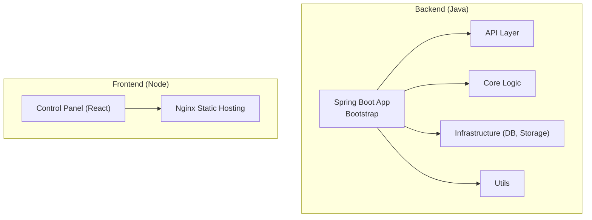
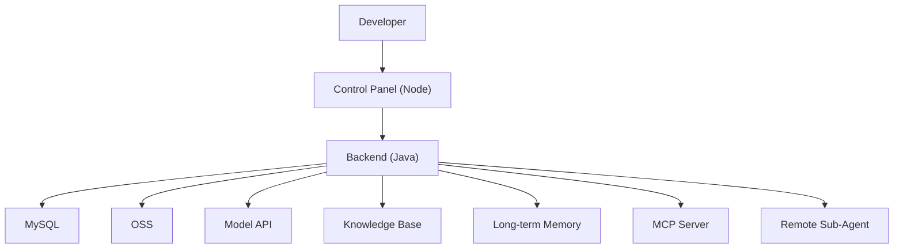
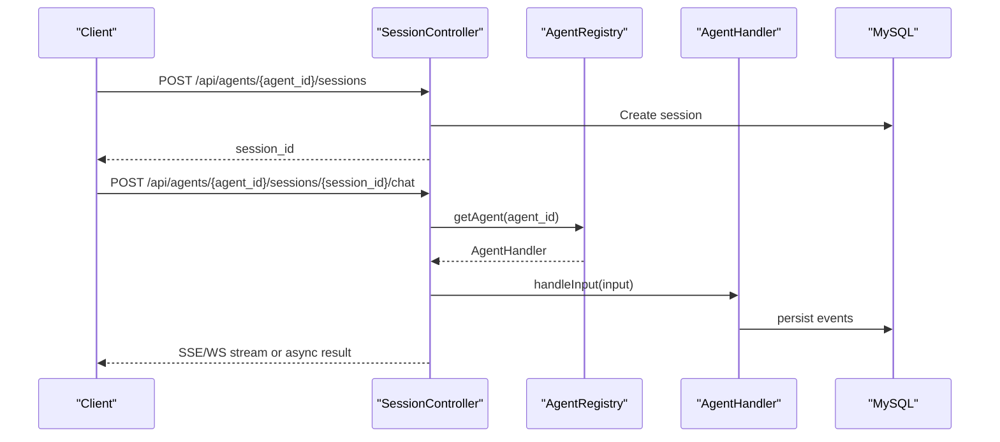
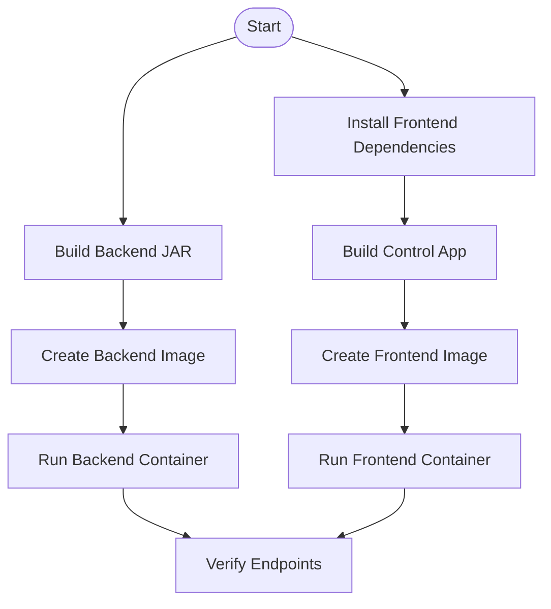
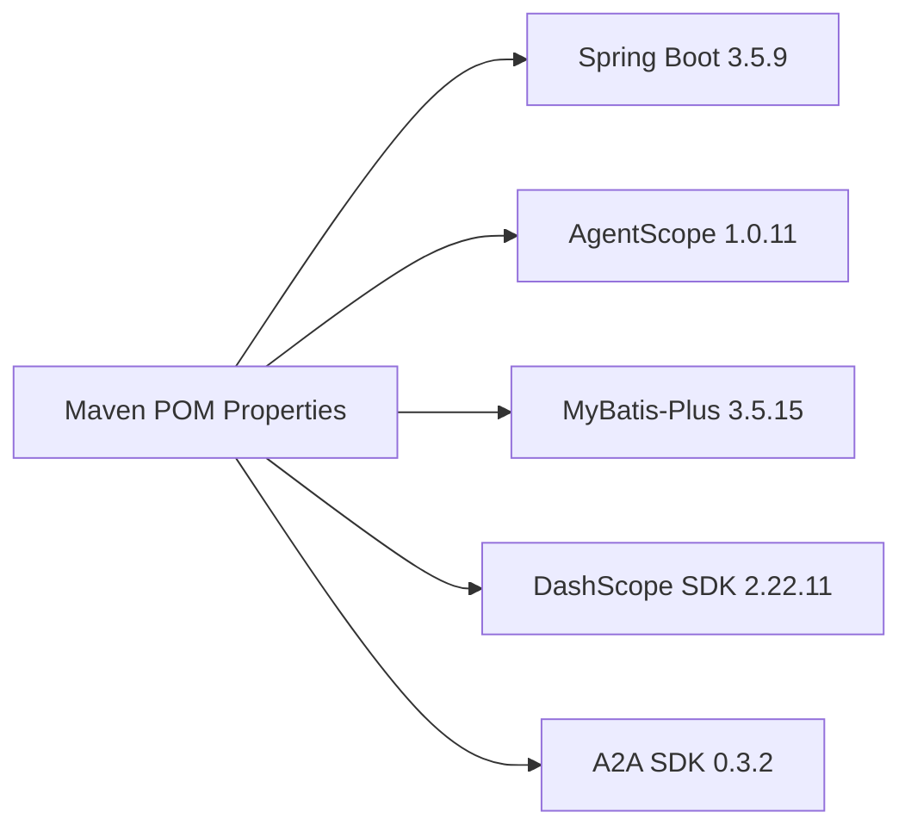

# Getting Started

<cite>
**Referenced Files in This Document**
- [README_en.md](file://README_en.md)
- [README.md](file://README.md)
- [backend_java/README.MD](file://backend_java/README.MD)
- [backend_java/pom.xml](file://backend_java/pom.xml)
- [backend_java/bootstrap/src/main/resources/application.yaml](file://backend_java/bootstrap/src/main/resources/application.yaml)
- [backend_java/bootstrap/src/main/resources/schema/init.sql](file://backend_java/bootstrap/src/main/resources/schema/init.sql)
- [backend_java/bootstrap/src/main/java/com/aliyun/tam/x/tron/Bootstrap.java](file://backend_java/bootstrap/src/main/java/com/aliyun/tam/x/tron/Bootstrap.java)
- [backend_java/Dockerfile](file://backend_java/Dockerfile)
- [frontend/README.md](file://frontend/README.md)
- [frontend/package.json](file://frontend/package.json)
- [frontend/Dockerfile](file://frontend/Dockerfile)
- [frontend/build.sh](file://frontend/build.sh)
- [docs/en/develop_guide.md](file://docs/en/develop_guide.md)
- [docs/en/depoly_guide.md](file://docs/en/depoly_guide.md)
- [backend_java/skills/weather/SKILL.md](file://backend_java/skills/weather/SKILL.md)
</cite>

## Table of Contents
1. [Introduction](#introduction)
2. [Project Structure](#project-structure)
3. [Core Components](#core-components)
4. [Architecture Overview](#architecture-overview)
5. [Detailed Component Analysis](#detailed-component-analysis)
6. [Dependency Analysis](#dependency-analysis)
7. [Performance Considerations](#performance-considerations)
8. [Troubleshooting Guide](#troubleshooting-guide)
9. [Conclusion](#conclusion)
10. [Appendices](#appendices)

## Introduction
This guide helps you set up Tron OneAgent locally and run both backend Java services and the frontend control panel. It covers prerequisites, environment setup, database initialization, environment variables, dependency installation, startup procedures, verification steps, and Docker-based deployment options. The content is designed for developers new to the platform while providing sufficient technical depth for successful onboarding.

## Project Structure
Tron OneAgent consists of:
- Backend (Java): Spring Boot application with modular modules (api, core, infra, utils, bootstrap), exposing REST APIs and WebSocket endpoints, and managing session lifecycle and event sourcing.
- Frontend (Node): React-based control panel packaged as a static site served by Nginx, with a Yarn workspace layout and Docker image for production.

**Diagram sources**
- [backend_java/bootstrap/src/main/java/com/aliyun/tam/x/tron/Bootstrap.java:25-32](file://backend_java/bootstrap/src/main/java/com/aliyun/tam/x/tron/Bootstrap.java#L25-L32)
- [frontend/README.md:1-279](file://frontend/README.md#L1-L279)

**Section sources**
- [README_en.md:57-94](file://README_en.md#L57-L94)
- [backend_java/README.MD:36-52](file://backend_java/README.MD#L36-L52)
- [frontend/README.md:19-44](file://frontend/README.md#L19-L44)

## Core Components
- Backend Java
  - Spring Boot application with embedded server port and servlet context path configured.
  - Database connectivity via JDBC with environment variable substitution.
  - Optional integrations for Alibaba Cloud services (DashScope, OSS) controlled by environment variables.
  - Exposes REST APIs and WebSocket endpoints for sessions, configuration, debugging, health checks, and streaming events.
- Frontend Control Panel
  - React application with a chatbox component library and a control console.
  - Built as a static site and served via Nginx.
  - Environment injection via Docker using envsubst.

**Section sources**
- [backend_java/bootstrap/src/main/resources/application.yaml:1-63](file://backend_java/bootstrap/src/main/resources/application.yaml#L1-L63)
- [frontend/README.md:148-201](file://frontend/README.md#L148-L201)

## Architecture Overview
The system integrates a Java backend with a Node-based control panel. The backend persists session and event data, streams conversation events, and exposes configuration and debugging APIs. The frontend consumes these APIs to render the control panel and chat experiences.

**Diagram sources**
- [README_en.md:57-94](file://README_en.md#L57-L94)
- [backend_java/bootstrap/src/main/resources/application.yaml:32-51](file://backend_java/bootstrap/src/main/resources/application.yaml#L32-L51)

## Detailed Component Analysis

### Prerequisites
- Backend
  - JDK 17+ and Maven 3.6+.
  - MySQL 5.7+ or 8.0+.
- Frontend
  - Node.js 16+ and Yarn 1.22+ or Yarn 2+.

**Section sources**
- [backend_java/README.MD:128-133](file://backend_java/README.MD#L128-L133)
- [frontend/README.md:47-51](file://frontend/README.md#L47-L51)

### Environment Setup and Database Initialization
- Create and initialize the database:
  - Create the database and run the schema initialization SQL.
- Configure environment variables for the backend:
  - Database connection (host, port, name, user, password).
  - Optional Alibaba Cloud credentials and OSS settings.
  - Optional DashScope API key for model access.

**Section sources**
- [README_en.md:114-139](file://README_en.md#L114-L139)
- [backend_java/bootstrap/src/main/resources/application.yaml:9-13](file://backend_java/bootstrap/src/main/resources/application.yaml#L9-L13)
- [backend_java/bootstrap/src/main/resources/application.yaml:32-51](file://backend_java/bootstrap/src/main/resources/application.yaml#L32-L51)
- [backend_java/bootstrap/src/main/resources/schema/init.sql:15-207](file://backend_java/bootstrap/src/main/resources/schema/init.sql#L15-L207)

### Backend Startup (Java)
- Build the backend:
  - Compile and package the project (skip tests during quick start).
- Run the backend:
  - Start the Spring Boot application JAR.

Verification:
- Access the backend at the configured host and port.
- Use the documented API endpoints to create sessions and chat.

**Section sources**
- [README_en.md:137-142](file://README_en.md#L137-L142)
- [backend_java/bootstrap/src/main/java/com/aliyun/tam/x/tron/Bootstrap.java:25-32](file://backend_java/bootstrap/src/main/java/com/aliyun/tam/x/tron/Bootstrap.java#L25-L32)

### Frontend Control Panel Startup (Node)
- Install dependencies:
  - Use Yarn to install workspace dependencies.
- Start the control panel:
  - Run the development server for the control application.

Verification:
- Access the control panel at the configured host and port.
- Use the control panel to manage agents, configurations, and debug features.

**Section sources**
- [README_en.md:144-156](file://README_en.md#L144-L156)
- [frontend/README.md:52-74](file://frontend/README.md#L52-L74)
- [frontend/package.json:7-10](file://frontend/package.json#L7-L10)

### API Workflows and Verification
- Create a session and send a chat message using the documented endpoints.
- Use SSE or WebSocket modes depending on your needs.
- Validate responses and event streams.

**Diagram sources**
- [docs/en/develop_guide.md:300-355](file://docs/en/develop_guide.md#L300-L355)
- [docs/en/develop_guide.md:551-640](file://docs/en/develop_guide.md#L551-L640)

**Section sources**
- [docs/en/develop_guide.md:357-640](file://docs/en/develop_guide.md#L357-L640)

### Practical Development Workflows
- Add a new ReAct Agent or One Agent by extending the provided builders.
- Register tools and enable them in agent configuration.
- Integrate knowledge bases, long-term memory, and MCP clients.
- Upload and manage skills via the control panel or APIs.

**Section sources**
- [backend_java/README.MD:196-441](file://backend_java/README.MD#L196-L441)
- [docs/en/develop_guide.md:31-77](file://docs/en/develop_guide.md#L31-L77)

### Docker-Based Deployment Options
- Backend Docker image:
  - Multi-stage build with Java 17 runtime and entrypoint launching the Spring Boot JAR.
- Frontend Docker image:
  - Nginx serving the built control application with envsubst for environment injection.
- Build scripts:
  - Frontend build script automates dependency installation, builds the control app, and packages the Docker image.

**Diagram sources**
- [backend_java/Dockerfile:1-18](file://backend_java/Dockerfile#L1-L18)
- [frontend/Dockerfile:1-15](file://frontend/Dockerfile#L1-L15)
- [frontend/build.sh:52-80](file://frontend/build.sh#L52-L80)

**Section sources**
- [backend_java/Dockerfile:1-18](file://backend_java/Dockerfile#L1-L18)
- [frontend/Dockerfile:1-15](file://frontend/Dockerfile#L1-L15)
- [frontend/build.sh:1-80](file://frontend/build.sh#L1-L80)

### Production Deployment Considerations
- Kubernetes deployment:
  - Prepare ConfigMap and Secret for non-sensitive and sensitive environment variables respectively.
  - Deploy backend and frontend with probes and resource limits.
  - Use Ingress to route /control to the frontend and /api to the backend.
- Upgrade and rollback:
  - Rolling updates and rollbacks supported via kubectl.
- Monitoring and logging:
  - Tail logs and check pod statuses for diagnostics.

**Section sources**
- [docs/en/depoly_guide.md:148-365](file://docs/en/depoly_guide.md#L148-L365)
- [docs/en/depoly_guide.md:398-465](file://docs/en/depoly_guide.md#L398-L465)

## Dependency Analysis
- Backend dependencies and versions are managed via Maven POM, including Spring Boot, MyBatis-Plus, AgentScope, DashScope, and others.
- Frontend dependencies include React, TypeScript, Ant Design, and the chatbox component library.

**Diagram sources**
- [backend_java/pom.xml:19-33](file://backend_java/pom.xml#L19-L33)

**Section sources**
- [backend_java/pom.xml:1-252](file://backend_java/pom.xml#L1-L252)
- [frontend/README.md:206-218](file://frontend/README.md#L206-L218)

## Performance Considerations
- SSE vs WebSocket:
  - SSE is simpler but lacks active cancel and follow-up suggestions; WebSocket offers lower latency and richer features.
- Concurrency and streaming:
  - Backend supports asynchronous event streaming and batching writes to the database.
- Resource sizing:
  - Provision adequate CPU and memory for backend and frontend deployments.

**Section sources**
- [docs/en/develop_guide.md:587-754](file://docs/en/develop_guide.md#L587-L754)
- [docs/en/develop_guide.md:300-355](file://docs/en/develop_guide.md#L300-L355)

## Troubleshooting Guide
Common issues and resolutions:
- Backend fails to start:
  - Check logs, confirm environment variables, and ensure the database is reachable and initialized.
- Database connection errors:
  - Verify host, port, name, user, and password; confirm the schema has been applied.
- Frontend cannot connect to backend:
  - Confirm the END_POINT environment variable and network policies; ensure backend service is healthy.
- SSE drops unexpectedly:
  - Adjust Nginx proxy buffering and timeouts; verify backend long connection support.

**Section sources**
- [docs/en/depoly_guide.md:398-423](file://docs/en/depoly_guide.md#L398-L423)

## Conclusion
You now have the essentials to set up Tron OneAgent locally, configure environment variables, initialize the database, start both backend and frontend, and verify the installation. Use the provided Docker images and Kubernetes guidance for production deployments, and refer to the development and deployment guides for advanced workflows.

## Appendices

### Appendix A: Environment Variables Reference
- Backend (Spring Boot)
  - DB_HOST, DB_PORT, DB_NAME, DB_USER, DB_PASS
  - DASHSCOPE_API_KEY
  - ALIBABA_CLOUD_ACCESS_KEY_ID, ALIBABA_CLOUD_ACCESS_KEY_SECRET
  - OSS_BUCKET, OSS_REGION, OSS_ENDPOINT
  - FILE_SERVER_BASE_URL
- Frontend (Nginx envsubst)
  - END_POINT

**Section sources**
- [backend_java/bootstrap/src/main/resources/application.yaml:9-51](file://backend_java/bootstrap/src/main/resources/application.yaml#L9-L51)
- [docs/en/depoly_guide.md:38-65](file://docs/en/depoly_guide.md#L38-L65)

### Appendix B: Example Skill Structure
- Skill ZIP structure with SKILL.md and scripts.
- Enable skills in agent configuration and use them for dynamic tasks.

**Section sources**
- [backend_java/skills/weather/SKILL.md:1-32](file://backend_java/skills/weather/SKILL.md#L1-L32)
- [backend_java/README.MD:363-441](file://backend_java/README.MD#L363-L441)