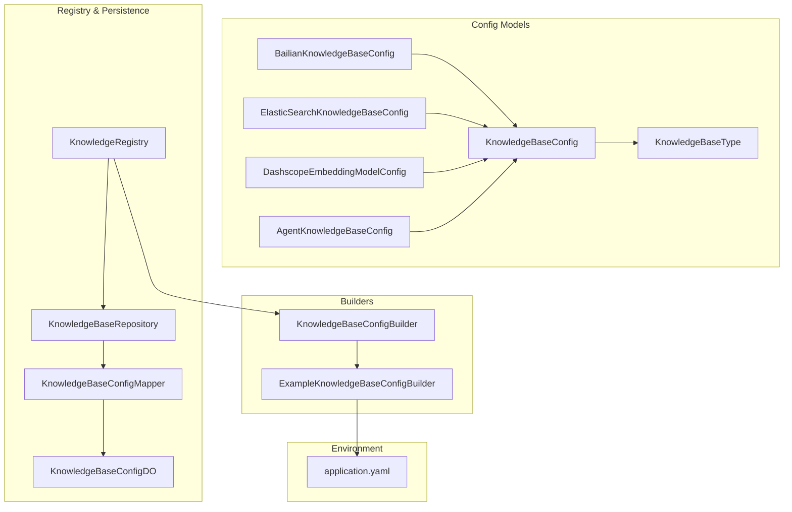
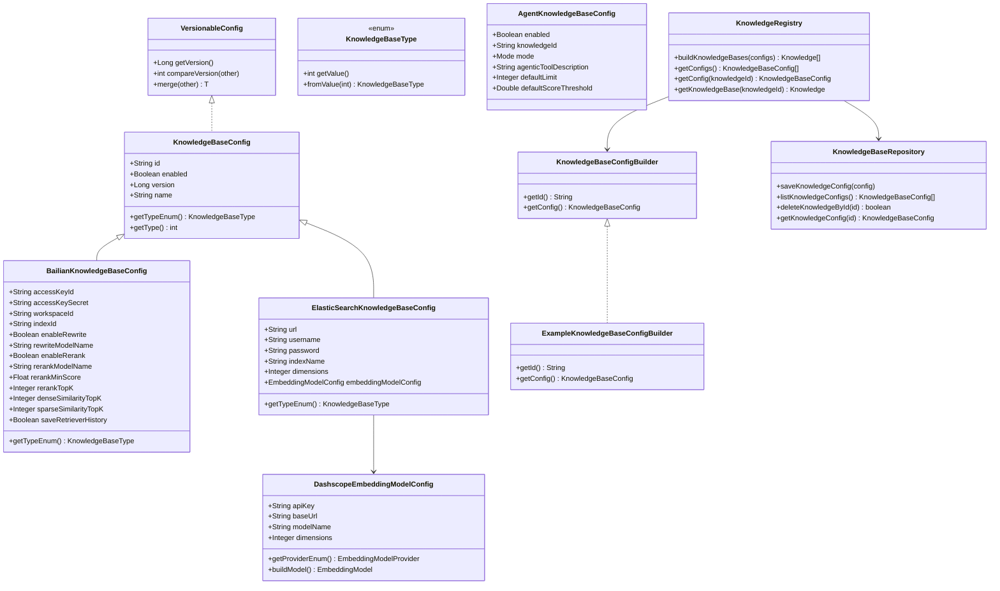
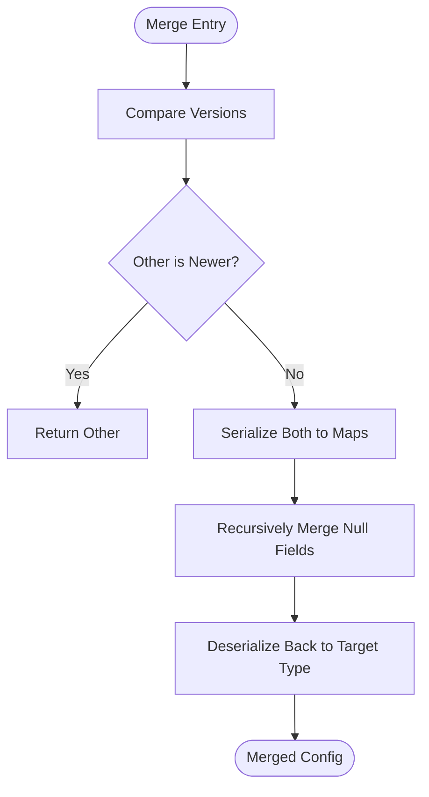
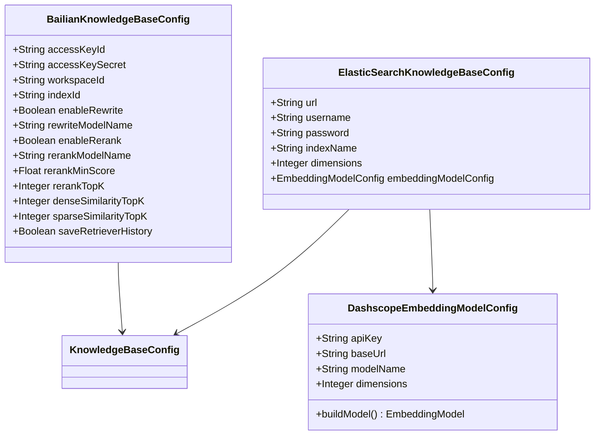
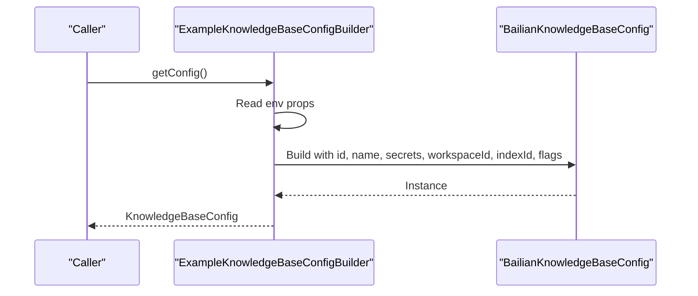
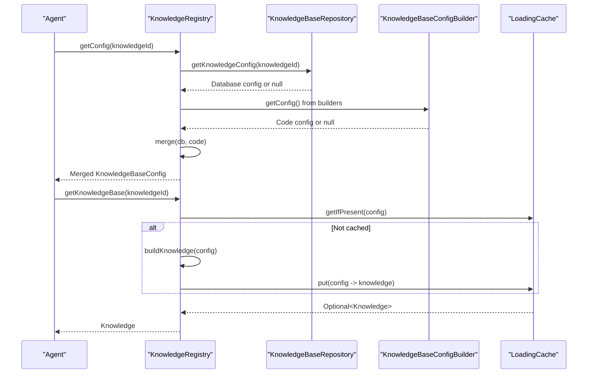
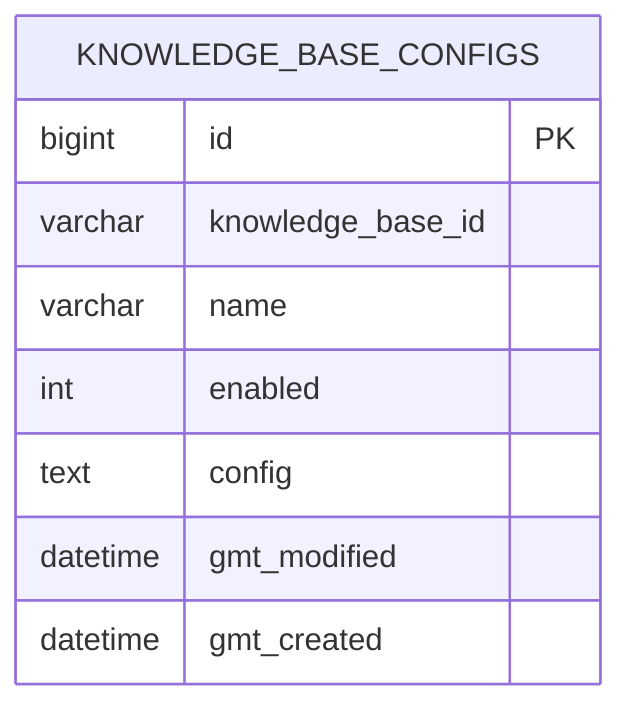
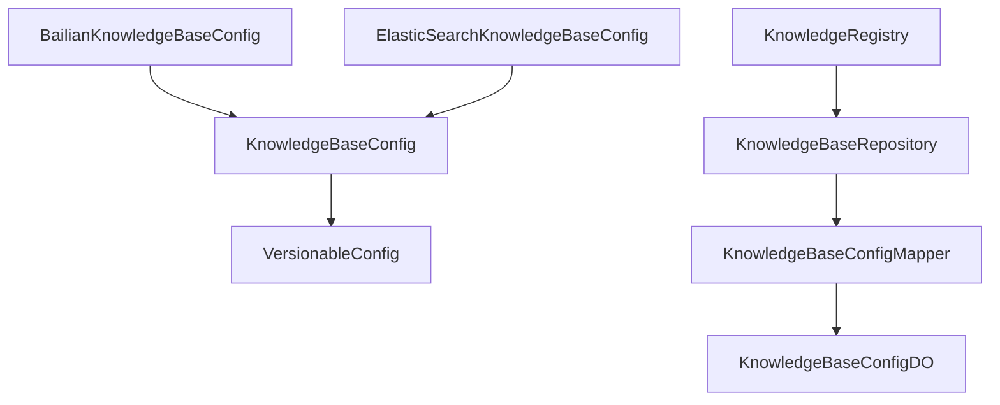

# Configuration Management

<cite>
**Referenced Files in This Document**
- [KnowledgeBaseConfig.java](file://backend_java/core/src/main/java/com/aliyun/tam/x/tron/core/config/KnowledgeBaseConfig.java)
- [VersionableConfig.java](file://backend_java/core/src/main/java/com/aliyun/tam/x/tron/core/config/VersionableConfig.java)
- [KnowledgeBaseType.java](file://backend_java/core/src/main/java/com/aliyun/tam/x/tron/core/config/KnowledgeBaseType.java)
- [BailianKnowledgeBaseConfig.java](file://backend_java/core/src/main/java/com/aliyun/tam/x/tron/core/config/BailianKnowledgeBaseConfig.java)
- [ElasticSearchKnowledgeBaseConfig.java](file://backend_java/core/src/main/java/com/aliyun/tam/x/tron/core/config/ElasticSearchKnowledgeBaseConfig.java)
- [DashscopeEmbeddingModelConfig.java](file://backend_java/core/src/main/java/com/aliyun/tam/x/tron/core/config/DashscopeEmbeddingModelConfig.java)
- [AgentKnowledgeBaseConfig.java](file://backend_java/core/src/main/java/com/aliyun/tam/x/tron/core/config/AgentKnowledgeBaseConfig.java)
- [KnowledgeBaseConfigBuilder.java](file://backend_java/core/src/main/java/com/aliyun/tam/x/tron/core/rag/KnowledgeBaseConfigBuilder.java)
- [ExampleKnowledgeBaseConfigBuilder.java](file://backend_java/core/src/main/java/com/aliyun/tam/x/tron/core/rag/ExampleKnowledgeBaseConfigBuilder.java)
- [KnowledgeRegistry.java](file://backend_java/core/src/main/java/com/aliyun/tam/x/tron/core/rag/KnowledgeRegistry.java)
- [KnowledgeBaseRepository.java](file://backend_java/core/src/main/java/com/aliyun/tam/x/tron/core/domain/repository/KnowledgeBaseRepository.java)
- [KnowledgeBaseConfigMapper.java](file://backend_java/infra/src/main/java/com/aliyun/tam/x/tron/infra/dal/mapper/KnowledgeBaseConfigMapper.java)
- [KnowledgeBaseConfigDO.java](file://backend_java/infra/src/main/java/com/aliyun/tam/x/tron/infra/dal/dataobject/KnowledgeBaseConfigDO.java)
- [application.yaml](file://backend_java/bootstrap/src/main/resources/application.yaml)
</cite>

## Table of Contents
1. [Introduction](#introduction)
2. [Project Structure](#project-structure)
3. [Core Components](#core-components)
4. [Architecture Overview](#architecture-overview)
5. [Detailed Component Analysis](#detailed-component-analysis)
6. [Dependency Analysis](#dependency-analysis)
7. [Performance Considerations](#performance-considerations)
8. [Troubleshooting Guide](#troubleshooting-guide)
9. [Conclusion](#conclusion)
10. [Appendices](#appendices)

## Introduction
This document explains knowledge base configuration management in Tron OneAgent. It focuses on the KnowledgeBaseConfig abstract class and its role in the configuration hierarchy, the versionable configuration system enabling updates and rollbacks, the ExampleKnowledgeBaseConfigBuilder pattern for programmatic configuration creation, and configuration validation, defaults, inheritance, security, environment-specific settings, lifecycle management, hot-swapping, and migration strategies.

## Project Structure
The knowledge base configuration system spans configuration models, builders, registries, repositories, and environment configuration:

- Configuration models define typed knowledge base configurations and versioning support.
- Builders construct configurations programmatically, often sourcing secrets from environment variables.
- Registry merges code-defined and database-backed configurations, builds runtime knowledge objects, and caches them.
- Repository persists and retrieves knowledge base configurations.
- Environment configuration supplies secret keys and feature toggles.

**Diagram sources**
- [KnowledgeBaseConfig.java:29-69](file://backend_java/core/src/main/java/com/aliyun/tam/x/tron/core/config/KnowledgeBaseConfig.java#L29-L69)
- [KnowledgeBaseType.java:26-53](file://backend_java/core/src/main/java/com/aliyun/tam/x/tron/core/config/KnowledgeBaseType.java#L26-L53)
- [BailianKnowledgeBaseConfig.java:25-75](file://backend_java/core/src/main/java/com/aliyun/tam/x/tron/core/config/BailianKnowledgeBaseConfig.java#L25-L75)
- [ElasticSearchKnowledgeBaseConfig.java:25-53](file://backend_java/core/src/main/java/com/aliyun/tam/x/tron/core/config/ElasticSearchKnowledgeBaseConfig.java#L25-L53)
- [DashscopeEmbeddingModelConfig.java:26-60](file://backend_java/core/src/main/java/com/aliyun/tam/x/tron/core/config/DashscopeEmbeddingModelConfig.java#L26-L60)
- [AgentKnowledgeBaseConfig.java:25-70](file://backend_java/core/src/main/java/com/aliyun/tam/x/tron/core/config/AgentKnowledgeBaseConfig.java#L25-L70)
- [KnowledgeBaseConfigBuilder.java:22-26](file://backend_java/core/src/main/java/com/aliyun/tam/x/tron/core/rag/KnowledgeBaseConfigBuilder.java#L22-L26)
- [ExampleKnowledgeBaseConfigBuilder.java:25-51](file://backend_java/core/src/main/java/com/aliyun/tam/x/tron/core/rag/ExampleKnowledgeBaseConfigBuilder.java#L25-L51)
- [KnowledgeRegistry.java:53-203](file://backend_java/core/src/main/java/com/aliyun/tam/x/tron/core/rag/KnowledgeRegistry.java#L53-L203)
- [KnowledgeBaseRepository.java:24-33](file://backend_java/core/src/main/java/com/aliyun/tam/x/tron/core/domain/repository/KnowledgeBaseRepository.java#L24-L33)
- [KnowledgeBaseConfigMapper.java:24-29](file://backend_java/infra/src/main/java/com/aliyun/tam/x/tron/infra/dal/mapper/KnowledgeBaseConfigMapper.java#L24-L29)
- [KnowledgeBaseConfigDO.java:25-73](file://backend_java/infra/src/main/java/com/aliyun/tam/x/tron/infra/dal/dataobject/KnowledgeBaseConfigDO.java#L25-L73)
- [application.yaml:32-51](file://backend_java/bootstrap/src/main/resources/application.yaml#L32-L51)

**Section sources**
- [KnowledgeBaseConfig.java:29-69](file://backend_java/core/src/main/java/com/aliyun/tam/x/tron/core/config/KnowledgeBaseConfig.java#L29-L69)
- [KnowledgeRegistry.java:53-203](file://backend_java/core/src/main/java/com/aliyun/tam/x/tron/core/rag/KnowledgeRegistry.java#L53-L203)
- [application.yaml:32-51](file://backend_java/bootstrap/src/main/resources/application.yaml#L32-L51)

## Core Components
- KnowledgeBaseConfig: Abstract base for knowledge base configurations with versioning via VersionableConfig, JSON polymorphism for Bailian and Elasticsearch variants, and default enabled flag.
- VersionableConfig: Defines version comparison and merge semantics for configurations, enabling controlled updates and rollbacks.
- KnowledgeBaseType: Enumerates supported knowledge base types and provides JSON conversion.
- BailianKnowledgeBaseConfig: Concrete configuration for Bailian RAG with optional rewrite and rerank features, encrypted credentials, and retrieval parameters.
- ElasticSearchKnowledgeBaseConfig: Concrete configuration for Elasticsearch-backed knowledge base with embedding model and vector store parameters.
- DashscopeEmbeddingModelConfig: Embedding model configuration for DashScope with environment-driven defaults.
- AgentKnowledgeBaseConfig: Agent-level binding of knowledge base ID, mode, and retrieval defaults.
- KnowledgeBaseConfigBuilder: Interface for programmatic configuration construction.
- ExampleKnowledgeBaseConfigBuilder: Example builder sourcing secrets from environment variables and building a Bailian configuration.
- KnowledgeRegistry: Central registry merging code and database configs, building runtime knowledge objects, and caching them.
- KnowledgeBaseRepository: Repository interface for persistence of knowledge base configurations.
- KnowledgeBaseConfigMapper and KnowledgeBaseConfigDO: MyBatis mapper and data object for persisted configurations.

**Section sources**
- [KnowledgeBaseConfig.java:29-69](file://backend_java/core/src/main/java/com/aliyun/tam/x/tron/core/config/KnowledgeBaseConfig.java#L29-L69)
- [VersionableConfig.java:23-75](file://backend_java/core/src/main/java/com/aliyun/tam/x/tron/core/config/VersionableConfig.java#L23-L75)
- [KnowledgeBaseType.java:26-53](file://backend_java/core/src/main/java/com/aliyun/tam/x/tron/core/config/KnowledgeBaseType.java#L26-L53)
- [BailianKnowledgeBaseConfig.java:25-75](file://backend_java/core/src/main/java/com/aliyun/tam/x/tron/core/config/BailianKnowledgeBaseConfig.java#L25-L75)
- [ElasticSearchKnowledgeBaseConfig.java:25-53](file://backend_java/core/src/main/java/com/aliyun/tam/x/tron/core/config/ElasticSearchKnowledgeBaseConfig.java#L25-L53)
- [DashscopeEmbeddingModelConfig.java:26-60](file://backend_java/core/src/main/java/com/aliyun/tam/x/tron/core/config/DashscopeEmbeddingModelConfig.java#L26-L60)
- [AgentKnowledgeBaseConfig.java:25-70](file://backend_java/core/src/main/java/com/aliyun/tam/x/tron/core/config/AgentKnowledgeBaseConfig.java#L25-L70)
- [KnowledgeBaseConfigBuilder.java:22-26](file://backend_java/core/src/main/java/com/aliyun/tam/x/tron/core/rag/KnowledgeBaseConfigBuilder.java#L22-L26)
- [ExampleKnowledgeBaseConfigBuilder.java:25-51](file://backend_java/core/src/main/java/com/aliyun/tam/x/tron/core/rag/ExampleKnowledgeBaseConfigBuilder.java#L25-L51)
- [KnowledgeRegistry.java:53-203](file://backend_java/core/src/main/java/com/aliyun/tam/x/tron/core/rag/KnowledgeRegistry.java#L53-L203)
- [KnowledgeBaseRepository.java:24-33](file://backend_java/core/src/main/java/com/aliyun/tam/x/tron/core/domain/repository/KnowledgeBaseRepository.java#L24-L33)
- [KnowledgeBaseConfigMapper.java:24-29](file://backend_java/infra/src/main/java/com/aliyun/tam/x/tron/infra/dal/mapper/KnowledgeBaseConfigMapper.java#L24-L29)
- [KnowledgeBaseConfigDO.java:25-73](file://backend_java/infra/src/main/java/com/aliyun/tam/x/tron/infra/dal/dataobject/KnowledgeBaseConfigDO.java#L25-L73)

## Architecture Overview
The configuration architecture centers around a versionable, polymorphic configuration hierarchy and a registry that merges code-defined and database-backed configurations. Builders supply environment-driven defaults, while the registry constructs runtime knowledge objects and caches them for reuse.

**Diagram sources**
- [VersionableConfig.java:23-75](file://backend_java/core/src/main/java/com/aliyun/tam/x/tron/core/config/VersionableConfig.java#L23-L75)
- [KnowledgeBaseConfig.java:29-69](file://backend_java/core/src/main/java/com/aliyun/tam/x/tron/core/config/KnowledgeBaseConfig.java#L29-L69)
- [KnowledgeBaseType.java:26-53](file://backend_java/core/src/main/java/com/aliyun/tam/x/tron/core/config/KnowledgeBaseType.java#L26-L53)
- [BailianKnowledgeBaseConfig.java:25-75](file://backend_java/core/src/main/java/com/aliyun/tam/x/tron/core/config/BailianKnowledgeBaseConfig.java#L25-L75)
- [ElasticSearchKnowledgeBaseConfig.java:25-53](file://backend_java/core/src/main/java/com/aliyun/tam/x/tron/core/config/ElasticSearchKnowledgeBaseConfig.java#L25-L53)
- [DashscopeEmbeddingModelConfig.java:26-60](file://backend_java/core/src/main/java/com/aliyun/tam/x/tron/core/config/DashscopeEmbeddingModelConfig.java#L26-L60)
- [AgentKnowledgeBaseConfig.java:25-70](file://backend_java/core/src/main/java/com/aliyun/tam/x/tron/core/config/AgentKnowledgeBaseConfig.java#L25-L70)
- [KnowledgeBaseConfigBuilder.java:22-26](file://backend_java/core/src/main/java/com/aliyun/tam/x/tron/core/rag/KnowledgeBaseConfigBuilder.java#L22-L26)
- [ExampleKnowledgeBaseConfigBuilder.java:25-51](file://backend_java/core/src/main/java/com/aliyun/tam/x/tron/core/rag/ExampleKnowledgeBaseConfigBuilder.java#L25-L51)
- [KnowledgeRegistry.java:53-203](file://backend_java/core/src/main/java/com/aliyun/tam/x/tron/core/rag/KnowledgeRegistry.java#L53-L203)
- [KnowledgeBaseRepository.java:24-33](file://backend_java/core/src/main/java/com/aliyun/tam/x/tron/core/domain/repository/KnowledgeBaseRepository.java#L24-L33)

## Detailed Component Analysis

### KnowledgeBaseConfig and VersionableConfig
- Role in hierarchy: KnowledgeBaseConfig is an abstract, versionable configuration with polymorphic JSON typing. It defines shared fields (id, enabled, version, name) and exposes a type enum. VersionableConfig adds version comparison and merge semantics.
- Versioning and rollback: compareVersion determines precedence; merge applies selective field replacement from newer to older when fields are null in the target, enabling controlled updates and safe rollbacks by preferring the stored configuration when it is newer or equal.
- Defaults: enabled defaults to true; other subclasses define their own defaults (e.g., rerank and rewrite toggles in Bailian).

**Diagram sources**
- [VersionableConfig.java:44-74](file://backend_java/core/src/main/java/com/aliyun/tam/x/tron/core/config/VersionableConfig.java#L44-L74)

**Section sources**
- [KnowledgeBaseConfig.java:29-69](file://backend_java/core/src/main/java/com/aliyun/tam/x/tron/core/config/KnowledgeBaseConfig.java#L29-L69)
- [VersionableConfig.java:23-75](file://backend_java/core/src/main/java/com/aliyun/tam/x/tron/core/config/VersionableConfig.java#L23-L75)

### Concrete Knowledge Base Configurations
- BailianKnowledgeBaseConfig: Includes encrypted credentials, workspace and index identifiers, optional rewrite and rerank features, model names, scoring thresholds, top-K parameters, and retrieval history toggle. Provides type mapping to KnowledgeBaseType.BAILIAN.
- ElasticSearchKnowledgeBaseConfig: Includes connection details, index name, dimensions, and an embedded embedding model configuration. Provides type mapping to KnowledgeBaseType.ELASTIC_SEARCH.
- DashscopeEmbeddingModelConfig: Supplies API key from environment, base URL, model name, and dimensions; builds a concrete embedding model instance.

**Diagram sources**
- [BailianKnowledgeBaseConfig.java:25-75](file://backend_java/core/src/main/java/com/aliyun/tam/x/tron/core/config/BailianKnowledgeBaseConfig.java#L25-L75)
- [ElasticSearchKnowledgeBaseConfig.java:25-53](file://backend_java/core/src/main/java/com/aliyun/tam/x/tron/core/config/ElasticSearchKnowledgeBaseConfig.java#L25-L53)
- [DashscopeEmbeddingModelConfig.java:26-60](file://backend_java/core/src/main/java/com/aliyun/tam/x/tron/core/config/DashscopeEmbeddingModelConfig.java#L26-L60)

**Section sources**
- [BailianKnowledgeBaseConfig.java:25-75](file://backend_java/core/src/main/java/com/aliyun/tam/x/tron/core/config/BailianKnowledgeBaseConfig.java#L25-L75)
- [ElasticSearchKnowledgeBaseConfig.java:25-53](file://backend_java/core/src/main/java/com/aliyun/tam/x/tron/core/config/ElasticSearchKnowledgeBaseConfig.java#L25-L53)
- [DashscopeEmbeddingModelConfig.java:26-60](file://backend_java/core/src/main/java/com/aliyun/tam/x/tron/core/config/DashscopeEmbeddingModelConfig.java#L26-L60)

### Builder Pattern: ExampleKnowledgeBaseConfigBuilder
- Purpose: Programmatic construction of a knowledge base configuration with environment-driven secrets.
- Behavior: Implements KnowledgeBaseConfigBuilder to supply an identifier and a built Bailian configuration populated from environment variables and fixed defaults.

**Diagram sources**
- [ExampleKnowledgeBaseConfigBuilder.java:25-51](file://backend_java/core/src/main/java/com/aliyun/tam/x/tron/core/rag/ExampleKnowledgeBaseConfigBuilder.java#L25-L51)
- [BailianKnowledgeBaseConfig.java:25-75](file://backend_java/core/src/main/java/com/aliyun/tam/x/tron/core/config/BailianKnowledgeBaseConfig.java#L25-L75)

**Section sources**
- [KnowledgeBaseConfigBuilder.java:22-26](file://backend_java/core/src/main/java/com/aliyun/tam/x/tron/core/rag/KnowledgeBaseConfigBuilder.java#L22-L26)
- [ExampleKnowledgeBaseConfigBuilder.java:25-51](file://backend_java/core/src/main/java/com/aliyun/tam/x/tron/core/rag/ExampleKnowledgeBaseConfigBuilder.java#L25-L51)

### KnowledgeRegistry: Merging, Building, and Caching
- Merging strategy: getConfig combines database-backed and code-defined configurations using merge semantics; getConfigs aggregates all configurations with deduplication by id and merging.
- Building runtime knowledge: buildKnowledge constructs concrete knowledge objects from configurations (Bailian or Elasticsearch), applying feature flags and model parameters.
- Caching: Uses a loading cache keyed by configuration instances with automatic eviction and resource cleanup for closable stores.

**Diagram sources**
- [KnowledgeRegistry.java:124-152](file://backend_java/core/src/main/java/com/aliyun/tam/x/tron/core/rag/KnowledgeRegistry.java#L124-L152)
- [KnowledgeRegistry.java:155-200](file://backend_java/core/src/main/java/com/aliyun/tam/x/tron/core/rag/KnowledgeRegistry.java#L155-L200)
- [KnowledgeBaseRepository.java:24-33](file://backend_java/core/src/main/java/com/aliyun/tam/x/tron/core/domain/repository/KnowledgeBaseRepository.java#L24-L33)

**Section sources**
- [KnowledgeRegistry.java:84-136](file://backend_java/core/src/main/java/com/aliyun/tam/x/tron/core/rag/KnowledgeRegistry.java#L84-L136)
- [KnowledgeRegistry.java:155-200](file://backend_java/core/src/main/java/com/aliyun/tam/x/tron/core/rag/KnowledgeRegistry.java#L155-L200)

### Persistence Layer: Repository, Mapper, and DO
- KnowledgeBaseRepository defines CRUD operations for knowledge base configurations.
- KnowledgeBaseConfigMapper maps to the knowledge_base_configs table.
- KnowledgeBaseConfigDO represents persisted fields including id, name, enabled flag, serialized config, and timestamps.

**Diagram sources**
- [KnowledgeBaseConfigDO.java:25-73](file://backend_java/infra/src/main/java/com/aliyun/tam/x/tron/infra/dal/dataobject/KnowledgeBaseConfigDO.java#L25-L73)

**Section sources**
- [KnowledgeBaseRepository.java:24-33](file://backend_java/core/src/main/java/com/aliyun/tam/x/tron/core/domain/repository/KnowledgeBaseRepository.java#L24-L33)
- [KnowledgeBaseConfigMapper.java:24-29](file://backend_java/infra/src/main/java/com/aliyun/tam/x/tron/infra/dal/mapper/KnowledgeBaseConfigMapper.java#L24-L29)
- [KnowledgeBaseConfigDO.java:25-73](file://backend_java/infra/src/main/java/com/aliyun/tam/x/tron/infra/dal/dataobject/KnowledgeBaseConfigDO.java#L25-L73)

### Agent-Level Binding: AgentKnowledgeBaseConfig
- Associates an agent with a knowledge base by id and mode (agentic or generic), and sets retrieval defaults such as default limit and optional score threshold.

**Section sources**
- [AgentKnowledgeBaseConfig.java:25-70](file://backend_java/core/src/main/java/com/aliyun/tam/x/tron/core/config/AgentKnowledgeBaseConfig.java#L25-L70)

## Dependency Analysis
- Polymorphic configuration: KnowledgeBaseConfig leverages Jackson polymorphism to deserialize into Bailian or Elasticsearch variants based on the type field.
- Versioning coupling: VersionableConfig is implemented by KnowledgeBaseConfig, ensuring consistent merge semantics across knowledge base types.
- Builder coupling: KnowledgeRegistry depends on KnowledgeBaseConfigBuilder implementations to supply code-defined configurations.
- Persistence coupling: KnowledgeRegistry uses KnowledgeBaseRepository to fetch database-backed configurations; KnowledgeBaseRepository relies on KnowledgeBaseConfigMapper and KnowledgeBaseConfigDO for persistence.

**Diagram sources**
- [KnowledgeBaseConfig.java:29-69](file://backend_java/core/src/main/java/com/aliyun/tam/x/tron/core/config/KnowledgeBaseConfig.java#L29-L69)
- [VersionableConfig.java:23-75](file://backend_java/core/src/main/java/com/aliyun/tam/x/tron/core/config/VersionableConfig.java#L23-L75)
- [BailianKnowledgeBaseConfig.java:25-75](file://backend_java/core/src/main/java/com/aliyun/tam/x/tron/core/config/BailianKnowledgeBaseConfig.java#L25-L75)
- [ElasticSearchKnowledgeBaseConfig.java:25-53](file://backend_java/core/src/main/java/com/aliyun/tam/x/tron/core/config/ElasticSearchKnowledgeBaseConfig.java#L25-L53)
- [KnowledgeRegistry.java:53-203](file://backend_java/core/src/main/java/com/aliyun/tam/x/tron/core/rag/KnowledgeRegistry.java#L53-L203)
- [KnowledgeBaseRepository.java:24-33](file://backend_java/core/src/main/java/com/aliyun/tam/x/tron/core/domain/repository/KnowledgeBaseRepository.java#L24-L33)
- [KnowledgeBaseConfigMapper.java:24-29](file://backend_java/infra/src/main/java/com/aliyun/tam/x/tron/infra/dal/mapper/KnowledgeBaseConfigMapper.java#L24-L29)
- [KnowledgeBaseConfigDO.java:25-73](file://backend_java/infra/src/main/java/com/aliyun/tam/x/tron/infra/dal/dataobject/KnowledgeBaseConfigDO.java#L25-L73)

**Section sources**
- [KnowledgeBaseConfig.java:29-69](file://backend_java/core/src/main/java/com/aliyun/tam/x/tron/core/config/KnowledgeBaseConfig.java#L29-L69)
- [KnowledgeRegistry.java:53-203](file://backend_java/core/src/main/java/com/aliyun/tam/x/tron/core/rag/KnowledgeRegistry.java#L53-L203)

## Performance Considerations
- Caching: KnowledgeRegistry caches knowledge objects keyed by configuration to avoid repeated construction and reduce latency for repeated lookups.
- Eviction policy: Cache entries expire after a period of inactivity, preventing memory leaks and stale configurations.
- Merge overhead: VersionableConfig.merge serializes to maps and recursively merges null fields; keep configuration trees shallow and avoid excessive nesting for frequent merges.
- Feature flags: Bailian and Elasticsearch feature toggles (rewrite, rerank) allow disabling expensive operations in low-resource environments.

[No sources needed since this section provides general guidance]

## Troubleshooting Guide
- Configuration not applied:
  - Verify enabled flags in both AgentKnowledgeBaseConfig and KnowledgeBaseConfig.
  - Confirm knowledgeId matches between agent binding and configuration id.
- Secrets missing:
  - Ensure environment variables for access keys and API keys are set; ExampleKnowledgeBaseConfigBuilder reads from Spring-managed properties.
- Version conflicts:
  - Use compareVersion to determine precedence; prefer database-stored configuration when it is newer or equal.
- Cache-related issues:
  - Clear cache entries if configuration changes are not reflected; cache is keyed by configuration instance equality.
- Persistence errors:
  - Check KnowledgeBaseConfigDO fields and mapper mapping; ensure the knowledge_base_configs table exists and is accessible.

**Section sources**
- [ExampleKnowledgeBaseConfigBuilder.java:25-51](file://backend_java/core/src/main/java/com/aliyun/tam/x/tron/core/rag/ExampleKnowledgeBaseConfigBuilder.java#L25-L51)
- [KnowledgeRegistry.java:124-152](file://backend_java/core/src/main/java/com/aliyun/tam/x/tron/core/rag/KnowledgeRegistry.java#L124-L152)
- [KnowledgeBaseConfigDO.java:25-73](file://backend_java/infra/src/main/java/com/aliyun/tam/x/tron/infra/dal/dataobject/KnowledgeBaseConfigDO.java#L25-L73)

## Conclusion
Tron OneAgent’s knowledge base configuration system provides a robust, versionable, and extensible framework. The abstract KnowledgeBaseConfig and VersionableConfig enable controlled updates and rollbacks, while builders and registries offer flexible, environment-aware configuration composition. The registry’s caching and merging strategies balance performance and correctness, and the persistence layer ensures durable configuration management.

[No sources needed since this section summarizes without analyzing specific files]

## Appendices

### Practical Examples

- Define a custom knowledge base configuration:
  - Extend the appropriate subclass (e.g., a new variant of KnowledgeBaseConfig) and implement getTypeEnum to register a new type.
  - Provide a builder implementing KnowledgeBaseConfigBuilder to supply environment-driven defaults.
  - Persist configuration via KnowledgeBaseRepository and reference it by id in AgentKnowledgeBaseConfig.

- Manage configuration lifecycles:
  - Use getConfigs to aggregate and merge all configurations; use getConfig to resolve a single configuration by id.
  - Apply compareVersion to decide whether to accept database or code-defined configuration.

- Implement configuration hot-swapping:
  - Trigger re-resolution by calling getConfig again; the registry will rebuild knowledge objects as needed.
  - Monitor cache expiration and adjust TTL if rapid changes are expected.

- Security considerations:
  - Annotate sensitive fields with encryption markers; rely on environment variables for API keys and secrets.
  - Restrict access to configuration endpoints and ensure secure transport.

- Environment-specific settings:
  - Use Spring profiles and environment variables to vary configuration per environment.
  - Externalize secrets and feature flags via application.yaml and environment variables.

- Migration strategies:
  - Introduce new fields with sensible defaults; use merge to propagate defaults into existing configurations.
  - Maintain backward compatibility by keeping old fields and mapping them appropriately during deserialization.

**Section sources**
- [KnowledgeBaseConfigBuilder.java:22-26](file://backend_java/core/src/main/java/com/aliyun/tam/x/tron/core/rag/KnowledgeBaseConfigBuilder.java#L22-L26)
- [ExampleKnowledgeBaseConfigBuilder.java:25-51](file://backend_java/core/src/main/java/com/aliyun/tam/x/tron/core/rag/ExampleKnowledgeBaseConfigBuilder.java#L25-L51)
- [application.yaml:32-51](file://backend_java/bootstrap/src/main/resources/application.yaml#L32-L51)
- [VersionableConfig.java:23-75](file://backend_java/core/src/main/java/com/aliyun/tam/x/tron/core/config/VersionableConfig.java#L23-L75)