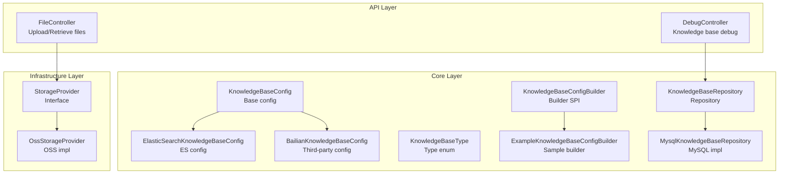
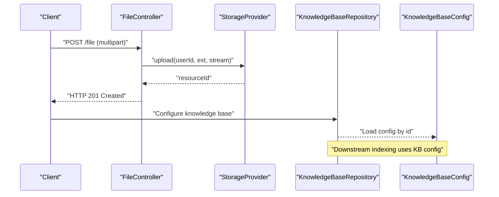
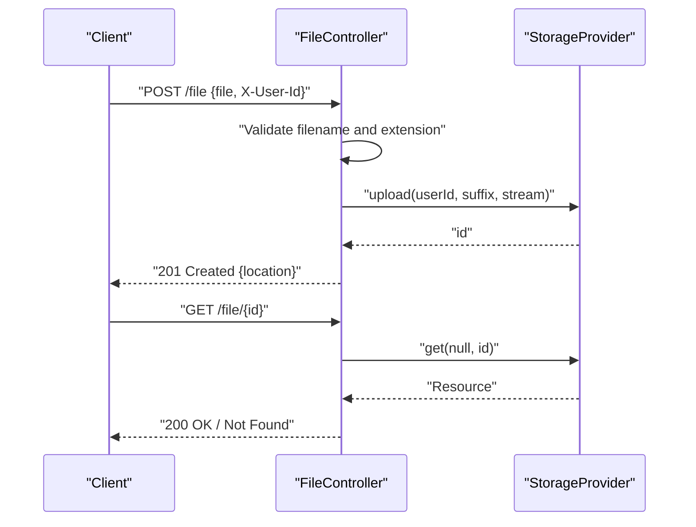
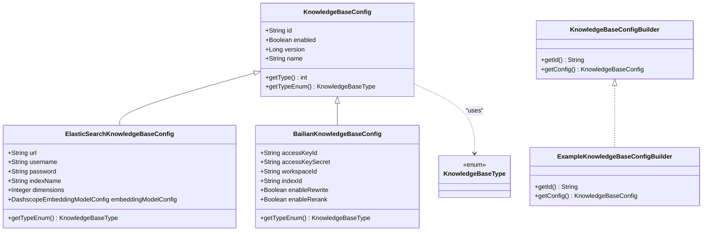
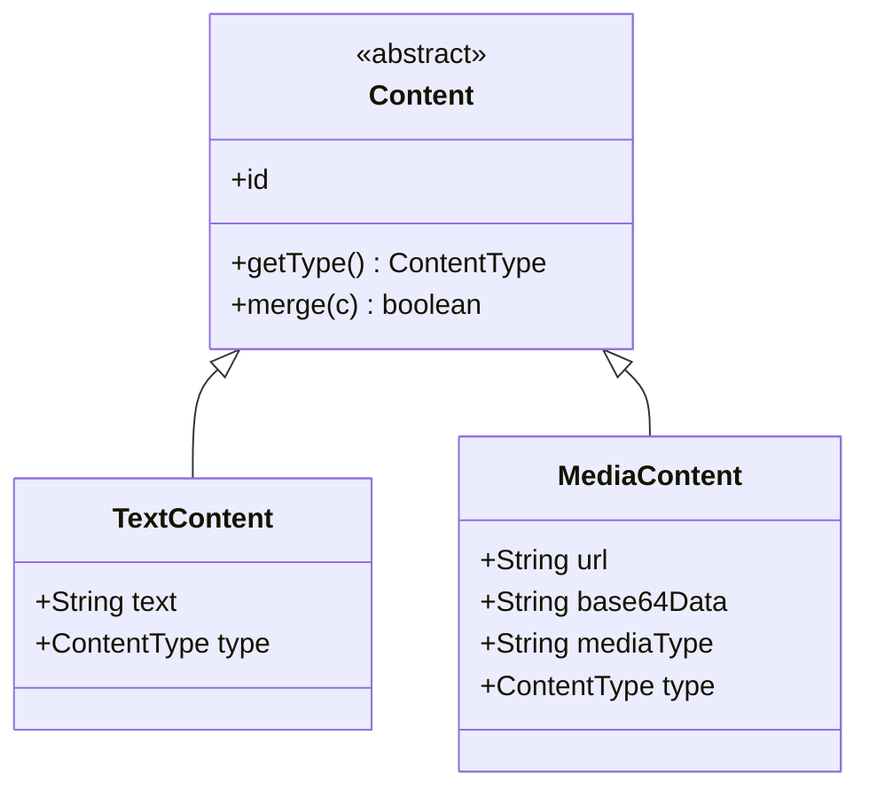
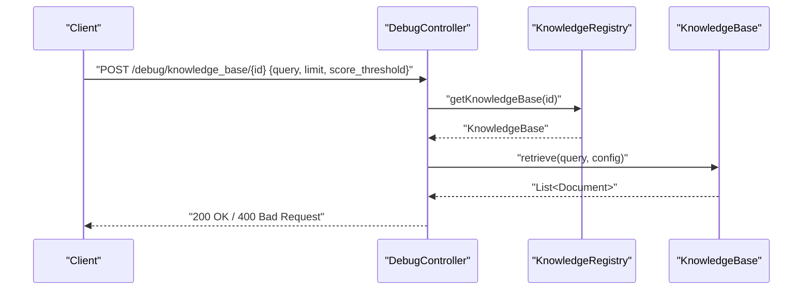
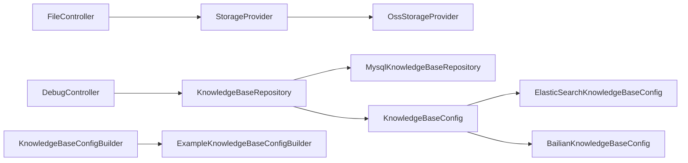

# Document Ingestion Pipeline

<cite>
**Referenced Files in This Document**
- [FileController.java](file://backend_java/api/src/main/java/com/aliyun/tam/x/tron/api/FileController.java)
- [DebugController.java](file://backend_java/api/src/main/java/com/aliyun/tam/x/tron/api/DebugController.java)
- [KnowledgeBaseConfig.java](file://backend_java/core/src/main/java/com/aliyun/tam/x/tron/core/config/KnowledgeBaseConfig.java)
- [ElasticSearchKnowledgeBaseConfig.java](file://backend_java/core/src/main/java/com/aliyun/tam/x/tron/core/config/ElasticSearchKnowledgeBaseConfig.java)
- [BailianKnowledgeBaseConfig.java](file://backend_java/core/src/main/java/com/aliyun/tam/x/tron/core/config/BailianKnowledgeBaseConfig.java)
- [KnowledgeBaseType.java](file://backend_java/core/src/main/java/com/aliyun/tam/x/tron/core/config/KnowledgeBaseType.java)
- [KnowledgeBaseConfigBuilder.java](file://backend_java/core/src/main/java/com/aliyun/tam/x/tron/core/rag/KnowledgeBaseConfigBuilder.java)
- [ExampleKnowledgeBaseConfigBuilder.java](file://backend_java/core/src/main/java/com/aliyun/tam/x/tron/core/rag/ExampleKnowledgeBaseConfigBuilder.java)
- [KnowledgeBaseRepository.java](file://backend_java/core/src/main/java/com/aliyun/tam/x/tron/core/domain/repository/KnowledgeBaseRepository.java)
- [MysqlKnowledgeBaseRepository.java](file://backend_java/core/src/main/java/com/aliyun/tam/x/tron/core/domain/repository/mysql/MysqlKnowledgeBaseRepository.java)
- [OssStorageProvider.java](file://backend_java/infra/src/main/java/com/aliyun/tam/x/tron/infra/storage/OssStorageProvider.java)
- [StorageProvider.java](file://backend_java/infra/src/main/java/com/aliyun/tam/x/tron/infra/storage/StorageProvider.java)
- [Content.java](file://backend_java/core/src/main/java/com/aliyun/tam/x/tron/core/domain/models/contents/Content.java)
- [TextContent.java](file://backend_java/core/src/main/java/com/aliyun/tam/x/tron/core/domain/models/contents/TextContent.java)
- [MediaContent.java](file://backend_java/core/src/main/java/com/aliyun/tam/x/tron/core/domain/models/contents/MediaContent.java)
- [application.yaml](file://backend_java/bootstrap/src/main/resources/application.yaml)
</cite>

## Table of Contents
1. [Introduction](#introduction)
2. [Project Structure](#project-structure)
3. [Core Components](#core-components)
4. [Architecture Overview](#architecture-overview)
5. [Detailed Component Analysis](#detailed-component-analysis)
6. [Dependency Analysis](#dependency-analysis)
7. [Performance Considerations](#performance-considerations)
8. [Troubleshooting Guide](#troubleshooting-guide)
9. [Conclusion](#conclusion)
10. [Appendices](#appendices)

## Introduction
This document explains the document ingestion pipeline in Tron OneAgent's knowledge base system. It covers the end-to-end workflow from file upload to indexing, including preprocessing (text extraction, chunking, metadata processing), ingestion API endpoints, batch processing considerations, validation and quality assurance, supported document formats, content transformation, performance optimization, error handling, and monitoring.

The ingestion system integrates:
- File upload and retrieval via a dedicated controller
- Storage abstraction for file persistence
- Knowledge base configuration for downstream indexing targets (e.g., Elasticsearch, third-party providers)
- Content models for unified representation of ingested material

Note: The current codebase exposes a file upload endpoint and knowledge base configuration abstractions. The actual document parsing, chunking, and indexing logic are not present in the provided files and would be implemented elsewhere in the system.

## Project Structure
The ingestion-related components are organized across three layers:
- API layer: HTTP endpoints for file operations and knowledge base debugging
- Core layer: configuration models and registries for knowledge base backends
- Infrastructure layer: storage provider abstraction and implementations

**Diagram sources**
- [FileController.java:37-112](file://backend_java/api/src/main/java/com/aliyun/tam/x/tron/api/FileController.java#L37-L112)
- [DebugController.java:140-164](file://backend_java/api/src/main/java/com/aliyun/tam/x/tron/api/DebugController.java#L140-L164)
- [KnowledgeBaseConfig.java:29-69](file://backend_java/core/src/main/java/com/aliyun/tam/x/tron/core/config/KnowledgeBaseConfig.java#L29-L69)
- [ElasticSearchKnowledgeBaseConfig.java:25-53](file://backend_java/core/src/main/java/com/aliyun/tam/x/tron/core/config/ElasticSearchKnowledgeBaseConfig.java#L25-L53)
- [BailianKnowledgeBaseConfig.java](file://backend_java/core/src/main/java/com/aliyun/tam/x/tron/core/config/BailianKnowledgeBaseConfig.java)
- [KnowledgeBaseType.java](file://backend_java/core/src/main/java/com/aliyun/tam/x/tron/core/config/KnowledgeBaseType.java)
- [KnowledgeBaseConfigBuilder.java:22-26](file://backend_java/core/src/main/java/com/aliyun/tam/x/tron/core/rag/KnowledgeBaseConfigBuilder.java#L22-L26)
- [ExampleKnowledgeBaseConfigBuilder.java:25-51](file://backend_java/core/src/main/java/com/aliyun/tam/x/tron/core/rag/ExampleKnowledgeBaseConfigBuilder.java#L25-L51)
- [KnowledgeBaseRepository.java](file://backend_java/core/src/main/java/com/aliyun/tam/x/tron/core/domain/repository/KnowledgeBaseRepository.java)
- [MysqlKnowledgeBaseRepository.java](file://backend_java/core/src/main/java/com/aliyun/tam/x/tron/core/domain/repository/mysql/MysqlKnowledgeBaseRepository.java)
- [StorageProvider.java](file://backend_java/infra/src/main/java/com/aliyun/tam/x/tron/infra/storage/StorageProvider.java)
- [OssStorageProvider.java](file://backend_java/infra/src/main/java/com/aliyun/tam/x/tron/infra/storage/OssStorageProvider.java)

**Section sources**
- [FileController.java:37-112](file://backend_java/api/src/main/java/com/aliyun/tam/x/tron/api/FileController.java#L37-L112)
- [application.yaml](file://backend_java/bootstrap/src/main/resources/application.yaml)

## Core Components
- FileController: Provides multipart upload and retrieval endpoints for binary content. Validates filename and extension, delegates upload to a configured StorageProvider, and returns resource locations.
- StorageProvider and OssStorageProvider: Abstraction and implementation for persistent storage of uploaded files.
- KnowledgeBaseConfig family: Configuration models for different knowledge base backends (e.g., Elasticsearch, third-party). Includes type identification and versioning support.
- KnowledgeBaseConfigBuilder and ExampleKnowledgeBaseConfigBuilder: SPI for constructing knowledge base configurations programmatically.
- KnowledgeBaseRepository and MysqlKnowledgeBaseRepository: Repository interfaces and MySQL implementation for managing knowledge base configurations.
- Content models: Unified representation of ingested content (TextContent, MediaContent) enabling downstream processing.

**Section sources**
- [FileController.java:37-112](file://backend_java/api/src/main/java/com/aliyun/tam/x/tron/api/FileController.java#L37-L112)
- [StorageProvider.java](file://backend_java/infra/src/main/java/com/aliyun/tam/x/tron/infra/storage/StorageProvider.java)
- [OssStorageProvider.java](file://backend_java/infra/src/main/java/com/aliyun/tam/x/tron/infra/storage/OssStorageProvider.java)
- [KnowledgeBaseConfig.java:29-69](file://backend_java/core/src/main/java/com/aliyun/tam/x/tron/core/config/KnowledgeBaseConfig.java#L29-L69)
- [ElasticSearchKnowledgeBaseConfig.java:25-53](file://backend_java/core/src/main/java/com/aliyun/tam/x/tron/core/config/ElasticSearchKnowledgeBaseConfig.java#L25-L53)
- [KnowledgeBaseConfigBuilder.java:22-26](file://backend_java/core/src/main/java/com/aliyun/tam/x/tron/core/rag/KnowledgeBaseConfigBuilder.java#L22-L26)
- [ExampleKnowledgeBaseConfigBuilder.java:25-51](file://backend_java/core/src/main/java/com/aliyun/tam/x/tron/core/rag/ExampleKnowledgeBaseConfigBuilder.java#L25-L51)
- [KnowledgeBaseRepository.java](file://backend_java/core/src/main/java/com/aliyun/tam/x/tron/core/domain/repository/KnowledgeBaseRepository.java)
- [MysqlKnowledgeBaseRepository.java](file://backend_java/core/src/main/java/com/aliyun/tam/x/tron/core/domain/repository/mysql/MysqlKnowledgeBaseRepository.java)
- [Content.java:38-73](file://backend_java/core/src/main/java/com/aliyun/tam/x/tron/core/domain/models/contents/Content.java#L38-L73)
- [TextContent.java](file://backend_java/core/src/main/java/com/aliyun/tam/x/tron/core/domain/models/contents/TextContent.java)
- [MediaContent.java](file://backend_java/core/src/main/java/com/aliyun/tam/x/tron/core/domain/models/contents/MediaContent.java)

## Architecture Overview
The ingestion pipeline begins with file upload, proceeds through storage, and ends with knowledge base indexing. The following diagram maps the actual components present in the codebase.

**Diagram sources**
- [FileController.java:51-100](file://backend_java/api/src/main/java/com/aliyun/tam/x/tron/api/FileController.java#L51-L100)
- [StorageProvider.java](file://backend_java/infra/src/main/java/com/aliyun/tam/x/tron/infra/storage/StorageProvider.java)
- [KnowledgeBaseRepository.java](file://backend_java/core/src/main/java/com/aliyun/tam/x/tron/core/domain/repository/KnowledgeBaseRepository.java)
- [KnowledgeBaseConfig.java:29-69](file://backend_java/core/src/main/java/com/aliyun/tam/x/tron/core/config/KnowledgeBaseConfig.java#L29-L69)

## Detailed Component Analysis

### File Upload and Retrieval
- Endpoint: POST /file accepts multipart/form-data with a "file" field and X-User-Id header.
- Validation: Rejects invalid filenames (e.g., containing path traversal or disallowed characters) and enforces allowed extensions.
- Storage: Delegates upload to StorageProvider and constructs a resource URI using either a configured base URL or request-derived host/port.
- Retrieval: GET /file/{id} fetches stored content via StorageProvider.

**Diagram sources**
- [FileController.java:51-111](file://backend_java/api/src/main/java/com/aliyun/tam/x/tron/api/FileController.java#L51-L111)
- [StorageProvider.java](file://backend_java/infra/src/main/java/com/aliyun/tam/x/tron/infra/storage/StorageProvider.java)

**Section sources**
- [FileController.java:51-111](file://backend_java/api/src/main/java/com/aliyun/tam/x/tron/api/FileController.java#L51-L111)

### Knowledge Base Configuration and Builders
- KnowledgeBaseConfig defines the base configuration with type identification and versioning.
- ElasticSearchKnowledgeBaseConfig and BailianKnowledgeBaseConfig represent concrete backends with credentials and index/model settings.
- KnowledgeBaseConfigBuilder and ExampleKnowledgeBaseConfigBuilder provide a programmatic way to construct configurations (e.g., from environment variables).

**Diagram sources**
- [KnowledgeBaseConfig.java:29-69](file://backend_java/core/src/main/java/com/aliyun/tam/x/tron/core/config/KnowledgeBaseConfig.java#L29-L69)
- [ElasticSearchKnowledgeBaseConfig.java:25-53](file://backend_java/core/src/main/java/com/aliyun/tam/x/tron/core/config/ElasticSearchKnowledgeBaseConfig.java#L25-L53)
- [BailianKnowledgeBaseConfig.java](file://backend_java/core/src/main/java/com/aliyun/tam/x/tron/core/config/BailianKnowledgeBaseConfig.java)
- [KnowledgeBaseType.java](file://backend_java/core/src/main/java/com/aliyun/tam/x/tron/core/config/KnowledgeBaseType.java)
- [KnowledgeBaseConfigBuilder.java:22-26](file://backend_java/core/src/main/java/com/aliyun/tam/x/tron/core/rag/KnowledgeBaseConfigBuilder.java#L22-L26)
- [ExampleKnowledgeBaseConfigBuilder.java:25-51](file://backend_java/core/src/main/java/com/aliyun/tam/x/tron/core/rag/ExampleKnowledgeBaseConfigBuilder.java#L25-L51)

**Section sources**
- [KnowledgeBaseConfig.java:29-69](file://backend_java/core/src/main/java/com/aliyun/tam/x/tron/core/config/KnowledgeBaseConfig.java#L29-L69)
- [ElasticSearchKnowledgeBaseConfig.java:25-53](file://backend_java/core/src/main/java/com/aliyun/tam/x/tron/core/config/ElasticSearchKnowledgeBaseConfig.java#L25-L53)
- [BailianKnowledgeBaseConfig.java](file://backend_java/core/src/main/java/com/aliyun/tam/x/tron/core/config/BailianKnowledgeBaseConfig.java)
- [KnowledgeBaseConfigBuilder.java:22-26](file://backend_java/core/src/main/java/com/aliyun/tam/x/tron/core/rag/KnowledgeBaseConfigBuilder.java#L22-L26)
- [ExampleKnowledgeBaseConfigBuilder.java:25-51](file://backend_java/core/src/main/java/com/aliyun/tam/x/tron/core/rag/ExampleKnowledgeBaseConfigBuilder.java#L25-L51)

### Content Models for Ingestion
Ingested documents are represented using unified content models:
- Content: Abstract base with polymorphic serialization
- TextContent: Plain text content
- MediaContent: Binary or URL-backed media (image/video/audio)

These models enable downstream processors to handle heterogeneous content consistently.

**Diagram sources**
- [Content.java:38-73](file://backend_java/core/src/main/java/com/aliyun/tam/x/tron/core/domain/models/contents/Content.java#L38-L73)
- [TextContent.java](file://backend_java/core/src/main/java/com/aliyun/tam/x/tron/core/domain/models/contents/TextContent.java)
- [MediaContent.java](file://backend_java/core/src/main/java/com/aliyun/tam/x/tron/core/domain/models/contents/MediaContent.java)

**Section sources**
- [Content.java:38-73](file://backend_java/core/src/main/java/com/aliyun/tam/x/tron/core/domain/models/contents/Content.java#L38-L73)
- [TextContent.java](file://backend_java/core/src/main/java/com/aliyun/tam/x/tron/core/domain/models/contents/TextContent.java)
- [MediaContent.java](file://backend_java/core/src/main/java/com/aliyun/tam/x/tron/core/domain/models/contents/MediaContent.java)

### Debugging Knowledge Base Retrieval
The debug endpoint allows testing retrieval against a knowledge base by issuing a query and returning matched documents with configurable limits and score thresholds.

**Diagram sources**
- [DebugController.java:140-164](file://backend_java/api/src/main/java/com/aliyun/tam/x/tron/api/DebugController.java#L140-L164)

**Section sources**
- [DebugController.java:140-164](file://backend_java/api/src/main/java/com/aliyun/tam/x/tron/api/DebugController.java#L140-L164)

## Dependency Analysis
The ingestion pipeline exhibits clear separation of concerns:
- API layer depends on storage abstraction
- Knowledge base configuration is decoupled from storage
- Repositories encapsulate persistence concerns
- Content models unify downstream processing

**Diagram sources**
- [FileController.java:37-112](file://backend_java/api/src/main/java/com/aliyun/tam/x/tron/api/FileController.java#L37-L112)
- [StorageProvider.java](file://backend_java/infra/src/main/java/com/aliyun/tam/x/tron/infra/storage/StorageProvider.java)
- [OssStorageProvider.java](file://backend_java/infra/src/main/java/com/aliyun/tam/x/tron/infra/storage/OssStorageProvider.java)
- [DebugController.java:140-164](file://backend_java/api/src/main/java/com/aliyun/tam/x/tron/api/DebugController.java#L140-L164)
- [KnowledgeBaseRepository.java](file://backend_java/core/src/main/java/com/aliyun/tam/x/tron/core/domain/repository/KnowledgeBaseRepository.java)
- [MysqlKnowledgeBaseRepository.java](file://backend_java/core/src/main/java/com/aliyun/tam/x/tron/core/domain/repository/mysql/MysqlKnowledgeBaseRepository.java)
- [KnowledgeBaseConfig.java:29-69](file://backend_java/core/src/main/java/com/aliyun/tam/x/tron/core/config/KnowledgeBaseConfig.java#L29-L69)
- [ElasticSearchKnowledgeBaseConfig.java:25-53](file://backend_java/core/src/main/java/com/aliyun/tam/x/tron/core/config/ElasticSearchKnowledgeBaseConfig.java#L25-L53)
- [BailianKnowledgeBaseConfig.java](file://backend_java/core/src/main/java/com/aliyun/tam/x/tron/core/config/BailianKnowledgeBaseConfig.java)
- [KnowledgeBaseConfigBuilder.java:22-26](file://backend_java/core/src/main/java/com/aliyun/tam/x/tron/core/rag/KnowledgeBaseConfigBuilder.java#L22-L26)
- [ExampleKnowledgeBaseConfigBuilder.java:25-51](file://backend_java/core/src/main/java/com/aliyun/tam/x/tron/core/rag/ExampleKnowledgeBaseConfigBuilder.java#L25-L51)

**Section sources**
- [FileController.java:37-112](file://backend_java/api/src/main/java/com/aliyun/tam/x/tron/api/FileController.java#L37-L112)
- [DebugController.java:140-164](file://backend_java/api/src/main/java/com/aliyun/tam/x/tron/api/DebugController.java#L140-L164)
- [KnowledgeBaseConfig.java:29-69](file://backend_java/core/src/main/java/com/aliyun/tam/x/tron/core/config/KnowledgeBaseConfig.java#L29-L69)
- [ElasticSearchKnowledgeBaseConfig.java:25-53](file://backend_java/core/src/main/java/com/aliyun/tam/x/tron/core/config/ElasticSearchKnowledgeBaseConfig.java#L25-L53)
- [BailianKnowledgeBaseConfig.java](file://backend_java/core/src/main/java/com/aliyun/tam/x/tron/core/config/BailianKnowledgeBaseConfig.java)
- [KnowledgeBaseConfigBuilder.java:22-26](file://backend_java/core/src/main/java/com/aliyun/tam/x/tron/core/rag/KnowledgeBaseConfigBuilder.java#L22-L26)
- [ExampleKnowledgeBaseConfigBuilder.java:25-51](file://backend_java/core/src/main/java/com/aliyun/tam/x/tron/core/rag/ExampleKnowledgeBaseConfigBuilder.java#L25-L51)
- [KnowledgeBaseRepository.java](file://backend_java/core/src/main/java/com/aliyun/tam/x/tron/core/domain/repository/KnowledgeBaseRepository.java)
- [MysqlKnowledgeBaseRepository.java](file://backend_java/core/src/main/java/com/aliyun/tam/x/tron/core/domain/repository/mysql/MysqlKnowledgeBaseRepository.java)
- [StorageProvider.java](file://backend_java/infra/src/main/java/com/aliyun/tam/x/tron/infra/storage/StorageProvider.java)
- [OssStorageProvider.java](file://backend_java/infra/src/main/java/com/aliyun/tam/x/tron/infra/storage/OssStorageProvider.java)

## Performance Considerations
- Upload throughput: Tune multipart upload limits and buffer sizes at the web server and Spring MVC level.
- Storage I/O: Use asynchronous or streaming uploads to avoid blocking threads; leverage object storage for large files.
- Indexing latency: Configure embedding dimensions and model settings appropriately; batch retrieval requests where possible.
- Memory footprint: Stream file content during upload and avoid loading entire files into memory.
- Concurrency: Scale horizontally and shard repositories and storage providers as needed.

[No sources needed since this section provides general guidance]

## Troubleshooting Guide
- Upload failures:
  - Invalid filename or extension: The upload endpoint rejects disallowed characters and unsupported extensions.
  - Storage provider missing: If no StorageProvider is configured, the endpoint returns a not found response.
- Retrieval issues:
  - Knowledge base not found: Debug endpoint returns not found if the knowledge base identifier is invalid.
  - Query errors: Malformed JSON payload or unsupported parameters cause bad request responses.
- Monitoring:
  - Expose health endpoints and metrics for storage and knowledge base repositories.
  - Log validation failures and exceptions during upload and retrieval.

**Section sources**
- [FileController.java:51-111](file://backend_java/api/src/main/java/com/aliyun/tam/x/tron/api/FileController.java#L51-L111)
- [DebugController.java:140-164](file://backend_java/api/src/main/java/com/aliyun/tam/x/tron/api/DebugController.java#L140-L164)

## Conclusion
The Tron OneAgent ingestion pipeline centers on a clean separation of concerns: file upload and retrieval handled by the API layer, storage abstraction managed by infrastructure components, and knowledge base configuration modeled in the core layer. While the current codebase provides the foundation (upload, storage, configuration, and retrieval debugging), the actual document parsing, chunking, and indexing steps are not included here and would be implemented in the broader system. Following the patterns outlined in this document enables scalable, maintainable ingestion workflows tailored to your document formats and indexing needs.

[No sources needed since this section summarizes without analyzing specific files]

## Appendices

### Supported Formats and Transformation Notes
- Current upload endpoint supports image formats (e.g., jpg, jpeg, png) based on allowed extensions.
- For PDF, DOC, TXT, HTML ingestion, implement a parser that extracts text and metadata, then produces Content instances (TextContent/MediaContent) for downstream indexing.

[No sources needed since this section provides general guidance]

### Practical Setup Examples
- Configure storage provider:
  - Provide a StorageProvider bean (e.g., OssStorageProvider) in the application context.
  - Set base URL for resource location generation if desired.
- Configure knowledge base:
  - Use KnowledgeBaseConfigBuilder to construct configurations for Elasticsearch or third-party providers.
  - Persist configurations via KnowledgeBaseRepository and load them by ID for retrieval.

**Section sources**
- [application.yaml](file://backend_java/bootstrap/src/main/resources/application.yaml)
- [StorageProvider.java](file://backend_java/infra/src/main/java/com/aliyun/tam/x/tron/infra/storage/StorageProvider.java)
- [OssStorageProvider.java](file://backend_java/infra/src/main/java/com/aliyun/tam/x/tron/infra/storage/OssStorageProvider.java)
- [KnowledgeBaseConfigBuilder.java:22-26](file://backend_java/core/src/main/java/com/aliyun/tam/x/tron/core/rag/KnowledgeBaseConfigBuilder.java#L22-L26)
- [ExampleKnowledgeBaseConfigBuilder.java:25-51](file://backend_java/core/src/main/java/com/aliyun/tam/x/tron/core/rag/ExampleKnowledgeBaseConfigBuilder.java#L25-L51)
- [KnowledgeBaseRepository.java](file://backend_java/core/src/main/java/com/aliyun/tam/x/tron/core/domain/repository/KnowledgeBaseRepository.java)
- [MysqlKnowledgeBaseRepository.java](file://backend_java/core/src/main/java/com/aliyun/tam/x/tron/core/domain/repository/mysql/MysqlKnowledgeBaseRepository.java)