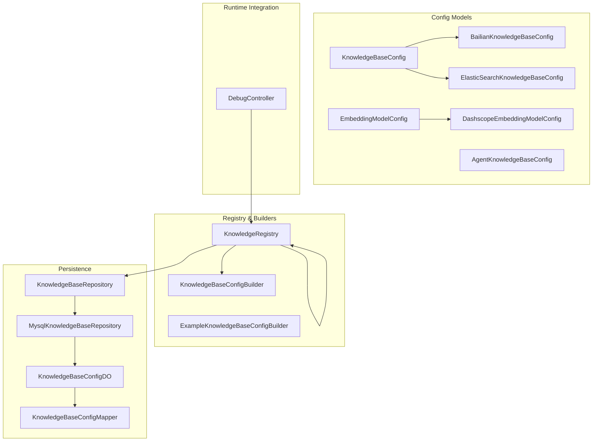
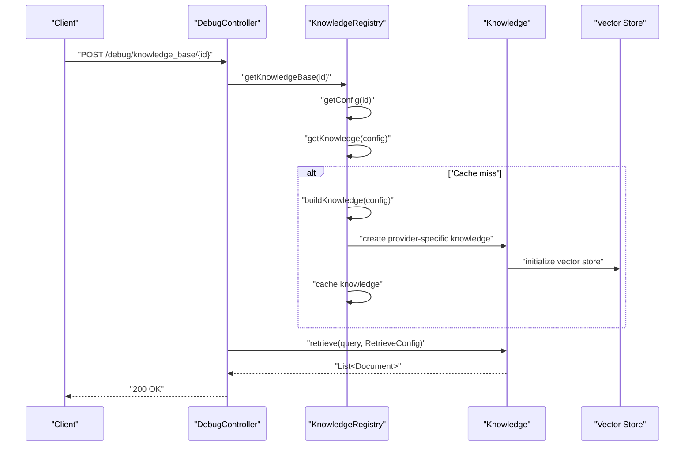
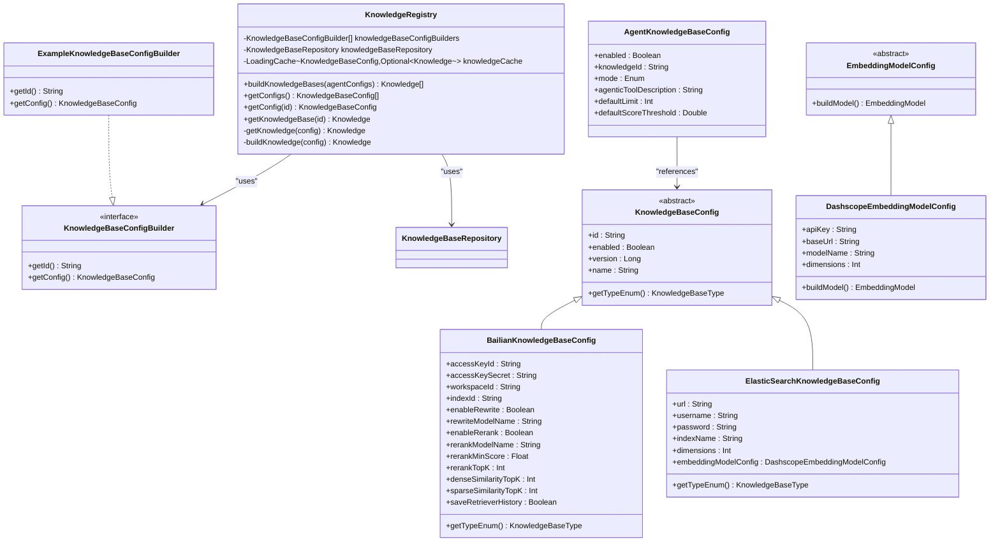
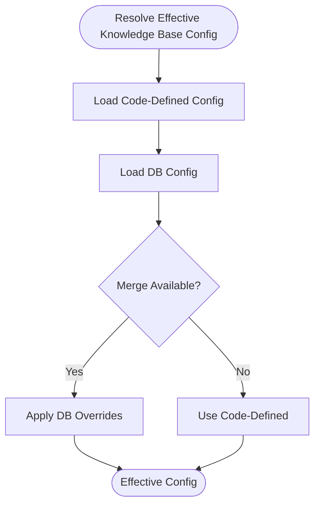
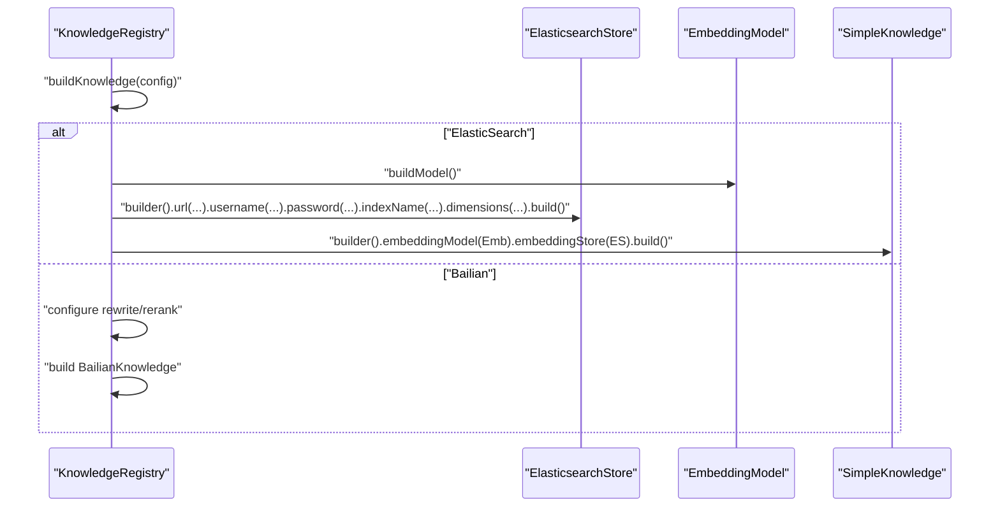
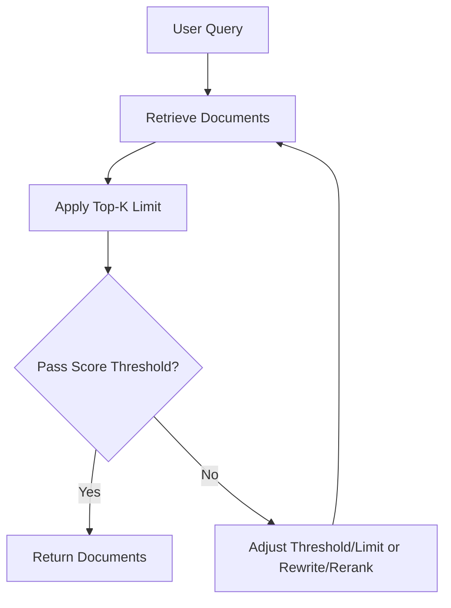
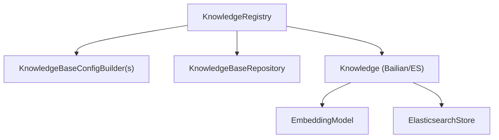

# Knowledge Base Integration

<cite>
**Referenced Files in This Document**
- [KnowledgeRegistry.java](file://backend_java/core/src/main/java/com/aliyun/tam/x/tron/core/rag/KnowledgeRegistry.java)
- [KnowledgeBaseConfigBuilder.java](file://backend_java/core/src/main/java/com/aliyun/tam/x/tron/core/rag/KnowledgeBaseConfigBuilder.java)
- [ExampleKnowledgeBaseConfigBuilder.java](file://backend_java/core/src/main/java/com/aliyun/tam/x/tron/core/rag/ExampleKnowledgeBaseConfigBuilder.java)
- [KnowledgeBaseConfig.java](file://backend_java/core/src/main/java/com/aliyun/tam/x/tron/core/config/KnowledgeBaseConfig.java)
- [BailianKnowledgeBaseConfig.java](file://backend_java/core/src/main/java/com/aliyun/tam/x/tron/core/config/BailianKnowledgeBaseConfig.java)
- [ElasticSearchKnowledgeBaseConfig.java](file://backend_java/core/src/main/java/com/aliyun/tam/x/tron/core/config/ElasticSearchKnowledgeBaseConfig.java)
- [KnowledgeBaseType.java](file://backend_java/core/src/main/java/com/aliyun/tam/x/tron/core/config/KnowledgeBaseType.java)
- [EmbeddingModelConfig.java](file://backend_java/core/src/main/java/com/aliyun/tam/x/tron/core/config/EmbeddingModelConfig.java)
- [DashscopeEmbeddingModelConfig.java](file://backend_java/core/src/main/java/com/aliyun/tam/x/tron/core/config/DashscopeEmbeddingModelConfig.java)
- [AgentKnowledgeBaseConfig.java](file://backend_java/core/src/main/java/com/aliyun/tam/x/tron/core/config/AgentKnowledgeBaseConfig.java)
- [KnowledgeBaseRepository.java](file://backend_java/core/src/main/java/com/aliyun/tam/x/tron/core/domain/repository/KnowledgeBaseRepository.java)
- [MysqlKnowledgeBaseRepository.java](file://backend_java/core/src/main/java/com/aliyun/tam/x/tron/core/domain/repository/mysql/MysqlKnowledgeBaseRepository.java)
- [KnowledgeBaseConfigDO.java](file://backend_java/infra/src/main/java/com/aliyun/tam/x/tron/infra/dal/dataobject/KnowledgeBaseConfigDO.java)
- [KnowledgeBaseConfigMapper.java](file://backend_java/infra/src/main/java/com/aliyun/tam/x/tron/infra/dal/mapper/KnowledgeBaseConfigMapper.java)
- [DebugController.java](file://backend_java/api/src/main/java/com/aliyun/tam/x/tron/api/DebugController.java)
</cite>

## Table of Contents
1. [Introduction](#introduction)
2. [Project Structure](#project-structure)
3. [Core Components](#core-components)
4. [Architecture Overview](#architecture-overview)
5. [Detailed Component Analysis](#detailed-component-analysis)
6. [Dependency Analysis](#dependency-analysis)
7. [Performance Considerations](#performance-considerations)
8. [Troubleshooting Guide](#troubleshooting-guide)
9. [Conclusion](#conclusion)
10. [Appendices](#appendices)

## Introduction
This document explains the knowledge base integration system in Tron OneAgent with a focus on Retrieval-Augmented Generation (RAG). It covers how the system builds and manages multiple knowledge base providers (Bailian and Elasticsearch), integrates embedding models, constructs vector stores, and retrieves relevant context to augment agent responses. It also documents configuration management, caching, retrieval strategies, and operational guidance for scaling and performance.

## Project Structure
The knowledge base integration spans configuration models, registry builders, repositories, and runtime integration points. The following diagram shows the primary modules involved in knowledge base lifecycle and retrieval.

**Diagram sources**
- [KnowledgeRegistry.java:56-203](file://backend_java/core/src/main/java/com/aliyun/tam/x/tron/core/rag/KnowledgeRegistry.java#L56-L203)
- [KnowledgeBaseConfigBuilder.java:22-26](file://backend_java/core/src/main/java/com/aliyun/tam/x/tron/core/rag/KnowledgeBaseConfigBuilder.java#L22-L26)
- [ExampleKnowledgeBaseConfigBuilder.java:26-51](file://backend_java/core/src/main/java/com/aliyun/tam/x/tron/core/rag/ExampleKnowledgeBaseConfigBuilder.java#L26-L51)
- [KnowledgeBaseConfig.java:29-69](file://backend_java/core/src/main/java/com/aliyun/tam/x/tron/core/config/KnowledgeBaseConfig.java#L29-L69)
- [BailianKnowledgeBaseConfig.java:25-75](file://backend_java/core/src/main/java/com/aliyun/tam/x/tron/core/config/BailianKnowledgeBaseConfig.java#L25-L75)
- [ElasticSearchKnowledgeBaseConfig.java:25-53](file://backend_java/core/src/main/java/com/aliyun/tam/x/tron/core/config/ElasticSearchKnowledgeBaseConfig.java#L25-L53)
- [EmbeddingModelConfig.java:28-47](file://backend_java/core/src/main/java/com/aliyun/tam/x/tron/core/config/EmbeddingModelConfig.java#L28-L47)
- [DashscopeEmbeddingModelConfig.java:26-60](file://backend_java/core/src/main/java/com/aliyun/tam/x/tron/core/config/DashscopeEmbeddingModelConfig.java#L26-L60)
- [AgentKnowledgeBaseConfig.java:25-70](file://backend_java/core/src/main/java/com/aliyun/tam/x/tron/core/config/AgentKnowledgeBaseConfig.java#L25-L70)
- [KnowledgeBaseRepository.java:24-33](file://backend_java/core/src/main/java/com/aliyun/tam/x/tron/core/domain/repository/KnowledgeBaseRepository.java#L24-L33)
- [MysqlKnowledgeBaseRepository.java](file://backend_java/core/src/main/java/com/aliyun/tam/x/tron/core/domain/repository/mysql/MysqlKnowledgeBaseRepository.java)
- [KnowledgeBaseConfigDO.java:25-73](file://backend_java/infra/src/main/java/com/aliyun/tam/x/tron/infra/dal/dataobject/KnowledgeBaseConfigDO.java#L25-L73)
- [KnowledgeBaseConfigMapper.java:24-29](file://backend_java/infra/src/main/java/com/aliyun/tam/x/tron/infra/dal/mapper/KnowledgeBaseConfigMapper.java#L24-L29)
- [DebugController.java:140-164](file://backend_java/api/src/main/java/com/aliyun/tam/x/tron/api/DebugController.java#L140-L164)

**Section sources**
- [KnowledgeRegistry.java:56-203](file://backend_java/core/src/main/java/com/aliyun/tam/x/tron/core/rag/KnowledgeRegistry.java#L56-L203)
- [KnowledgeBaseConfig.java:29-69](file://backend_java/core/src/main/java/com/aliyun/tam/x/tron/core/config/KnowledgeBaseConfig.java#L29-L69)

## Core Components
- KnowledgeRegistry: Central factory and cache for knowledge base instances. Builds provider-specific knowledge from configuration and caches them for reuse.
- KnowledgeBaseConfigBuilder and ExampleKnowledgeBaseConfigBuilder: Provide default configurations for knowledge bases (e.g., Bailian) via code-defined builders.
- KnowledgeBaseConfig hierarchy: Abstract base with typed subclasses for Bailian and Elasticsearch knowledge bases.
- EmbeddingModelConfig and DashscopeEmbeddingModelConfig: Define embedding model providers and construction logic.
- AgentKnowledgeBaseConfig: Per-agent binding of knowledge base IDs, modes, and retrieval defaults.
- KnowledgeBaseRepository and persistence: Load/save knowledge base configurations from database-backed storage.
- DebugController: Exposes a runtime endpoint to test retrieval against a configured knowledge base.

**Section sources**
- [KnowledgeRegistry.java:56-203](file://backend_java/core/src/main/java/com/aliyun/tam/x/tron/core/rag/KnowledgeRegistry.java#L56-L203)
- [KnowledgeBaseConfigBuilder.java:22-26](file://backend_java/core/src/main/java/com/aliyun/tam/x/tron/core/rag/KnowledgeBaseConfigBuilder.java#L22-L26)
- [ExampleKnowledgeBaseConfigBuilder.java:26-51](file://backend_java/core/src/main/java/com/aliyun/tam/x/tron/core/rag/ExampleKnowledgeBaseConfigBuilder.java#L26-L51)
- [KnowledgeBaseConfig.java:29-69](file://backend_java/core/src/main/java/com/aliyun/tam/x/tron/core/config/KnowledgeBaseConfig.java#L29-L69)
- [BailianKnowledgeBaseConfig.java:25-75](file://backend_java/core/src/main/java/com/aliyun/tam/x/tron/core/config/BailianKnowledgeBaseConfig.java#L25-L75)
- [ElasticSearchKnowledgeBaseConfig.java:25-53](file://backend_java/core/src/main/java/com/aliyun/tam/x/tron/core/config/ElasticSearchKnowledgeBaseConfig.java#L25-L53)
- [EmbeddingModelConfig.java:28-47](file://backend_java/core/src/main/java/com/aliyun/tam/x/tron/core/config/EmbeddingModelConfig.java#L28-L47)
- [DashscopeEmbeddingModelConfig.java:26-60](file://backend_java/core/src/main/java/com/aliyun/tam/x/tron/core/config/DashscopeEmbeddingModelConfig.java#L26-L60)
- [AgentKnowledgeBaseConfig.java:25-70](file://backend_java/core/src/main/java/com/aliyun/tam/x/tron/core/config/AgentKnowledgeBaseConfig.java#L25-L70)
- [KnowledgeBaseRepository.java:24-33](file://backend_java/core/src/main/java/com/aliyun/tam/x/tron/core/domain/repository/KnowledgeBaseRepository.java#L24-L33)
- [MysqlKnowledgeBaseRepository.java](file://backend_java/core/src/main/java/com/aliyun/tam/x/tron/core/domain/repository/mysql/MysqlKnowledgeBaseRepository.java)
- [KnowledgeBaseConfigDO.java:25-73](file://backend_java/infra/src/main/java/com/aliyun/tam/x/tron/infra/dal/dataobject/KnowledgeBaseConfigDO.java#L25-L73)
- [KnowledgeBaseConfigMapper.java:24-29](file://backend_java/infra/src/main/java/com/aliyun/tam/x/tron/infra/dal/mapper/KnowledgeBaseConfigMapper.java#L24-L29)
- [DebugController.java:140-164](file://backend_java/api/src/main/java/com/aliyun/tam/x/tron/api/DebugController.java#L140-L164)

## Architecture Overview
The knowledge base integration follows a layered design:
- Configuration layer: Typed configuration models define provider-specific settings.
- Builder layer: Provides default configurations for known knowledge base IDs.
- Registry layer: Resolves effective configuration (merge code and DB), builds provider-specific knowledge, and caches instances.
- Persistence layer: Stores and retrieves knowledge base configurations.
- Runtime layer: Exposes retrieval APIs for testing and integration.

**Diagram sources**
- [DebugController.java:140-164](file://backend_java/api/src/main/java/com/aliyun/tam/x/tron/api/DebugController.java#L140-L164)
- [KnowledgeRegistry.java:124-152](file://backend_java/core/src/main/java/com/aliyun/tam/x/tron/core/rag/KnowledgeRegistry.java#L124-L152)
- [KnowledgeRegistry.java:155-200](file://backend_java/core/src/main/java/com/aliyun/tam/x/tron/core/rag/KnowledgeRegistry.java#L155-L200)

## Detailed Component Analysis

### KnowledgeRegistry
Responsibilities:
- Merge code-defined and database-driven knowledge base configurations.
- Build provider-specific knowledge instances (Bailian or Elasticsearch).
- Cache knowledge instances with eviction and resource cleanup.
- Provide lists of enabled knowledge bases for agents.

Key behaviors:
- Configuration resolution: Prefers DB overrides over code-defined values.
- Caching: Uses a loading cache keyed by configuration with size and TTL limits; closes embedded stores when evicted.
- Provider instantiation:
  - Bailian: Builds a Bailian knowledge with optional rewrite and rerank features.
  - Elasticsearch: Builds a SimpleKnowledge with an embedding model and Elasticsearch vector store.

**Diagram sources**
- [KnowledgeRegistry.java:56-203](file://backend_java/core/src/main/java/com/aliyun/tam/x/tron/core/rag/KnowledgeRegistry.java#L56-L203)
- [KnowledgeBaseConfigBuilder.java:22-26](file://backend_java/core/src/main/java/com/aliyun/tam/x/tron/core/rag/KnowledgeBaseConfigBuilder.java#L22-L26)
- [ExampleKnowledgeBaseConfigBuilder.java:26-51](file://backend_java/core/src/main/java/com/aliyun/tam/x/tron/core/rag/ExampleKnowledgeBaseConfigBuilder.java#L26-L51)
- [KnowledgeBaseConfig.java:29-69](file://backend_java/core/src/main/java/com/aliyun/tam/x/tron/core/config/KnowledgeBaseConfig.java#L29-L69)
- [BailianKnowledgeBaseConfig.java:25-75](file://backend_java/core/src/main/java/com/aliyun/tam/x/tron/core/config/BailianKnowledgeBaseConfig.java#L25-L75)
- [ElasticSearchKnowledgeBaseConfig.java:25-53](file://backend_java/core/src/main/java/com/aliyun/tam/x/tron/core/config/ElasticSearchKnowledgeBaseConfig.java#L25-L53)
- [EmbeddingModelConfig.java:28-47](file://backend_java/core/src/main/java/com/aliyun/tam/x/tron/core/config/EmbeddingModelConfig.java#L28-L47)
- [DashscopeEmbeddingModelConfig.java:26-60](file://backend_java/core/src/main/java/com/aliyun/tam/x/tron/core/config/DashscopeEmbeddingModelConfig.java#L26-L60)
- [AgentKnowledgeBaseConfig.java:25-70](file://backend_java/core/src/main/java/com/aliyun/tam/x/tron/core/config/AgentKnowledgeBaseConfig.java#L25-L70)

**Section sources**
- [KnowledgeRegistry.java:61-82](file://backend_java/core/src/main/java/com/aliyun/tam/x/tron/core/rag/KnowledgeRegistry.java#L61-L82)
- [KnowledgeRegistry.java:124-152](file://backend_java/core/src/main/java/com/aliyun/tam/x/tron/core/rag/KnowledgeRegistry.java#L124-L152)
- [KnowledgeRegistry.java:155-200](file://backend_java/core/src/main/java/com/aliyun/tam/x/tron/core/rag/KnowledgeRegistry.java#L155-L200)

### Configuration Management
- KnowledgeBaseConfig: Abstract base with JSON polymorphism for provider selection.
- BailianKnowledgeBaseConfig: Provider-specific fields for Bailian (workspace, index, rewrite/rerank toggles).
- ElasticSearchKnowledgeBaseConfig: Provider-specific fields for Elasticsearch (endpoint, credentials, index, dimensions, embedding model).
- EmbeddingModelConfig and DashscopeEmbeddingModelConfig: Provider abstraction and DashScope embedding model construction.
- AgentKnowledgeBaseConfig: Per-agent binding with mode, tool description, and retrieval defaults.

**Diagram sources**
- [KnowledgeRegistry.java:105-136](file://backend_java/core/src/main/java/com/aliyun/tam/x/tron/core/rag/KnowledgeRegistry.java#L105-L136)
- [KnowledgeBaseRepository.java:24-33](file://backend_java/core/src/main/java/com/aliyun/tam/x/tron/core/domain/repository/KnowledgeBaseRepository.java#L24-L33)

**Section sources**
- [KnowledgeBaseConfig.java:29-69](file://backend_java/core/src/main/java/com/aliyun/tam/x/tron/core/config/KnowledgeBaseConfig.java#L29-L69)
- [BailianKnowledgeBaseConfig.java:25-75](file://backend_java/core/src/main/java/com/aliyun/tam/x/tron/core/config/BailianKnowledgeBaseConfig.java#L25-L75)
- [ElasticSearchKnowledgeBaseConfig.java:25-53](file://backend_java/core/src/main/java/com/aliyun/tam/x/tron/core/config/ElasticSearchKnowledgeBaseConfig.java#L25-L53)
- [EmbeddingModelConfig.java:28-47](file://backend_java/core/src/main/java/com/aliyun/tam/x/tron/core/config/EmbeddingModelConfig.java#L28-L47)
- [DashscopeEmbeddingModelConfig.java:26-60](file://backend_java/core/src/main/java/com/aliyun/tam/x/tron/core/config/DashscopeEmbeddingModelConfig.java#L26-L60)
- [AgentKnowledgeBaseConfig.java:25-70](file://backend_java/core/src/main/java/com/aliyun/tam/x/tron/core/config/AgentKnowledgeBaseConfig.java#L25-L70)

### Knowledge Base Building and Retrieval
- Bailian knowledge: Constructed with optional rewrite and rerank features controlled by configuration flags and parameters.
- Elasticsearch knowledge: Builds an embedding model from configuration and initializes an Elasticsearch vector store; returns a SimpleKnowledge instance.

**Diagram sources**
- [KnowledgeRegistry.java:155-200](file://backend_java/core/src/main/java/com/aliyun/tam/x/tron/core/rag/KnowledgeRegistry.java#L155-L200)
- [ElasticSearchKnowledgeBaseConfig.java:47-47](file://backend_java/core/src/main/java/com/aliyun/tam/x/tron/core/config/ElasticSearchKnowledgeBaseConfig.java#L47-L47)
- [DashscopeEmbeddingModelConfig.java:52-59](file://backend_java/core/src/main/java/com/aliyun/tam/x/tron/core/config/DashscopeEmbeddingModelConfig.java#L52-L59)

**Section sources**
- [KnowledgeRegistry.java:155-200](file://backend_java/core/src/main/java/com/aliyun/tam/x/tron/core/rag/KnowledgeRegistry.java#L155-L200)

### Retrieval Strategies and Hybrid Search
- Retrieval invocation: The debug endpoint demonstrates retrieving documents with configurable limit and score threshold.
- Hybrid search: Bailian supports optional rewrite and rerank features, enabling query rewriting and re-ranking to improve relevance.

**Diagram sources**
- [DebugController.java:155-158](file://backend_java/api/src/main/java/com/aliyun/tam/x/tron/api/DebugController.java#L155-L158)
- [BailianKnowledgeBaseConfig.java:46-70](file://backend_java/core/src/main/java/com/aliyun/tam/x/tron/core/config/BailianKnowledgeBaseConfig.java#L46-L70)

**Section sources**
- [DebugController.java:140-164](file://backend_java/api/src/main/java/com/aliyun/tam/x/tron/api/DebugController.java#L140-L164)
- [BailianKnowledgeBaseConfig.java:46-70](file://backend_java/core/src/main/java/com/aliyun/tam/x/tron/core/config/BailianKnowledgeBaseConfig.java#L46-L70)

### Practical Examples

- Setting up a custom knowledge base:
  - Define a code builder implementing the configuration builder interface and register it so the registry can resolve it.
  - Persist the effective configuration via the repository to override code defaults if needed.

- Configuring embedding models:
  - For Elasticsearch knowledge bases, set dimensions and configure the embedding model provider (e.g., DashScope) with API key, base URL, model name, and dimensions.

- Implementing hybrid search:
  - Enable rewrite and rerank in the Bailian knowledge base configuration to leverage query rewriting and re-ranking.

- Optimizing retrieval performance:
  - Tune top-K parameters, score thresholds, and embedding dimensions.
  - Use caching and appropriate vector store indexing for large-scale retrieval.

**Section sources**
- [ExampleKnowledgeBaseConfigBuilder.java:26-51](file://backend_java/core/src/main/java/com/aliyun/tam/x/tron/core/rag/ExampleKnowledgeBaseConfigBuilder.java#L26-L51)
- [KnowledgeBaseRepository.java:24-33](file://backend_java/core/src/main/java/com/aliyun/tam/x/tron/core/domain/repository/KnowledgeBaseRepository.java#L24-L33)
- [ElasticSearchKnowledgeBaseConfig.java:47-47](file://backend_java/core/src/main/java/com/aliyun/tam/x/tron/core/config/ElasticSearchKnowledgeBaseConfig.java#L47-L47)
- [DashscopeEmbeddingModelConfig.java:52-59](file://backend_java/core/src/main/java/com/aliyun/tam/x/tron/core/config/DashscopeEmbeddingModelConfig.java#L52-L59)
- [BailianKnowledgeBaseConfig.java:46-70](file://backend_java/core/src/main/java/com/aliyun/tam/x/tron/core/config/BailianKnowledgeBaseConfig.java#L46-L70)

## Dependency Analysis
- Coupling:
  - KnowledgeRegistry depends on builders and the repository to assemble effective configurations and build provider-specific knowledge.
  - Providers depend on embedding models and vector stores; Elasticsearch requires embedding model configuration and dimensions.
- Cohesion:
  - Configuration models encapsulate provider-specific settings; builders supply defaults; registry centralizes lifecycle and caching.
- External integrations:
  - Bailian integration uses provider-specific configuration objects and optional rewrite/rerank.
  - Elasticsearch integration uses an embedding model and an Elasticsearch vector store.

**Diagram sources**
- [KnowledgeRegistry.java:56-203](file://backend_java/core/src/main/java/com/aliyun/tam/x/tron/core/rag/KnowledgeRegistry.java#L56-L203)
- [ElasticSearchKnowledgeBaseConfig.java:47-47](file://backend_java/core/src/main/java/com/aliyun/tam/x/tron/core/config/ElasticSearchKnowledgeBaseConfig.java#L47-L47)
- [DashscopeEmbeddingModelConfig.java:52-59](file://backend_java/core/src/main/java/com/aliyun/tam/x/tron/core/config/DashscopeEmbeddingModelConfig.java#L52-L59)

**Section sources**
- [KnowledgeRegistry.java:56-203](file://backend_java/core/src/main/java/com/aliyun/tam/x/tron/core/rag/KnowledgeRegistry.java#L56-L203)

## Performance Considerations
- Caching:
  - Knowledge instances are cached with a maximum size and expiration to reduce repeated initialization overhead.
  - Cache removal listener ensures embedded stores are closed to free resources.
- Vector store optimization:
  - Configure dimensions aligned with the embedding model and tune top-K and score thresholds to balance recall and latency.
- Scalability:
  - Use provider-specific tuning (e.g., Bailian rewrite/rerank) and Elasticsearch index settings for large corpora.
  - Consider pagination and streaming for large result sets during retrieval.

**Section sources**
- [KnowledgeRegistry.java:61-82](file://backend_java/core/src/main/java/com/aliyun/tam/x/tron/core/rag/KnowledgeRegistry.java#L61-L82)
- [ElasticSearchKnowledgeBaseConfig.java:47-47](file://backend_java/core/src/main/java/com/aliyun/tam/x/tron/core/config/ElasticSearchKnowledgeBaseConfig.java#L47-L47)
- [DashscopeEmbeddingModelConfig.java:52-59](file://backend_java/core/src/main/java/com/aliyun/tam/x/tron/core/config/DashscopeEmbeddingModelConfig.java#L52-L59)

## Troubleshooting Guide
- Knowledge base not found:
  - Verify the knowledge base ID exists and is enabled in the effective configuration (merged from code and DB).
- Retrieval returns empty:
  - Adjust score threshold or top-K parameters; confirm embedding dimensions match the vector store.
- Resource cleanup:
  - If encountering resource leaks, check cache eviction behavior and ensure embedding stores are closed on removal.

**Section sources**
- [KnowledgeRegistry.java:124-152](file://backend_java/core/src/main/java/com/aliyun/tam/x/tron/core/rag/KnowledgeRegistry.java#L124-L152)
- [KnowledgeRegistry.java:64-76](file://backend_java/core/src/main/java/com/aliyun/tam/x/tron/core/rag/KnowledgeRegistry.java#L64-L76)
- [DebugController.java:140-164](file://backend_java/api/src/main/java/com/aliyun/tam/x/tron/api/DebugController.java#L140-L164)

## Conclusion
The knowledge base integration system in Tron OneAgent provides a flexible, extensible framework for RAG. It supports multiple providers (Bailian and Elasticsearch), integrates embedding models, and offers robust configuration merging, caching, and retrieval capabilities. By leveraging provider-specific features like rewrite and rerank, and optimizing vector store parameters, teams can achieve scalable and high-quality retrieval for agent responses.

## Appendices

### Appendix A: Configuration Reference
- KnowledgeBaseConfig: Base for provider-specific configs; includes ID, enabled flag, version, and name.
- BailianKnowledgeBaseConfig: Workspace and index identifiers, rewrite/rerank toggles and parameters, similarity top-K, and history saving.
- ElasticSearchKnowledgeBaseConfig: Endpoint, credentials, index name, dimensions, and embedding model configuration.
- EmbeddingModelConfig: Provider abstraction; Dashscope implementation includes API key, base URL, model name, and dimensions.
- AgentKnowledgeBaseConfig: Binding per agent with mode, tool description, and retrieval defaults.

**Section sources**
- [KnowledgeBaseConfig.java:29-69](file://backend_java/core/src/main/java/com/aliyun/tam/x/tron/core/config/KnowledgeBaseConfig.java#L29-L69)
- [BailianKnowledgeBaseConfig.java:25-75](file://backend_java/core/src/main/java/com/aliyun/tam/x/tron/core/config/BailianKnowledgeBaseConfig.java#L25-L75)
- [ElasticSearchKnowledgeBaseConfig.java:25-53](file://backend_java/core/src/main/java/com/aliyun/tam/x/tron/core/config/ElasticSearchKnowledgeBaseConfig.java#L25-L53)
- [EmbeddingModelConfig.java:28-47](file://backend_java/core/src/main/java/com/aliyun/tam/x/tron/core/config/EmbeddingModelConfig.java#L28-L47)
- [DashscopeEmbeddingModelConfig.java:26-60](file://backend_java/core/src/main/java/com/aliyun/tam/x/tron/core/config/DashscopeEmbeddingModelConfig.java#L26-L60)
- [AgentKnowledgeBaseConfig.java:25-70](file://backend_java/core/src/main/java/com/aliyun/tam/x/tron/core/config/AgentKnowledgeBaseConfig.java#L25-L70)