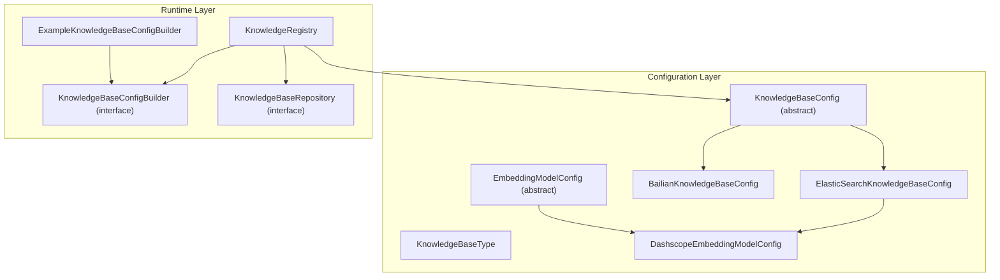
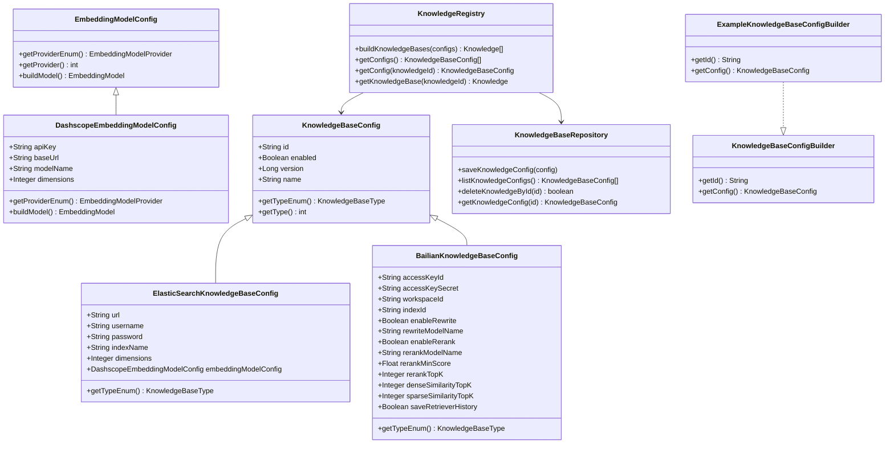
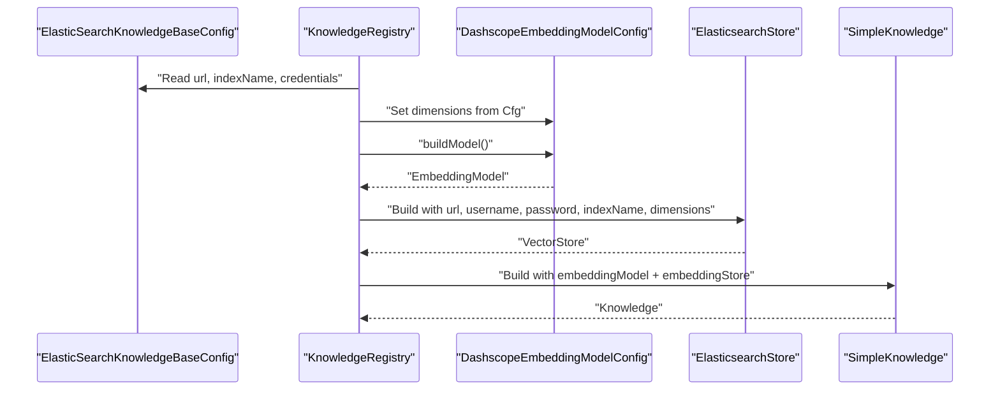
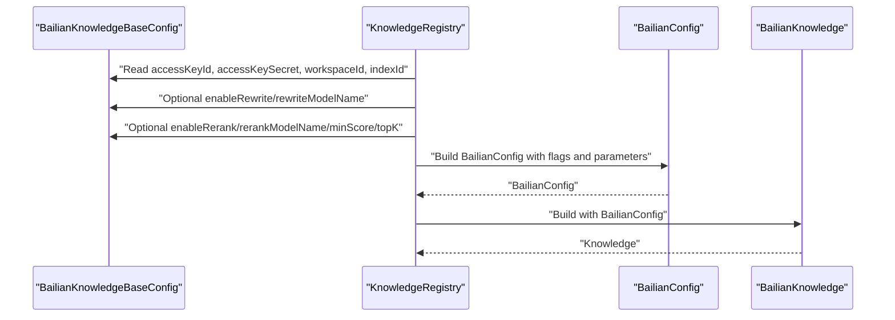
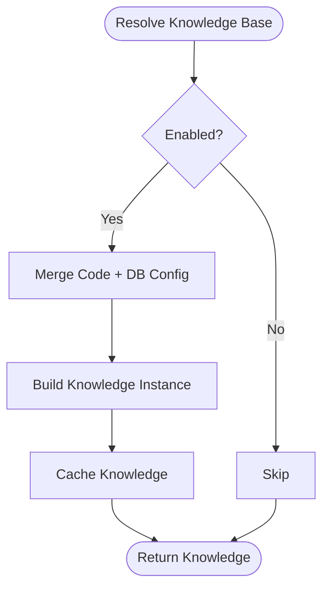
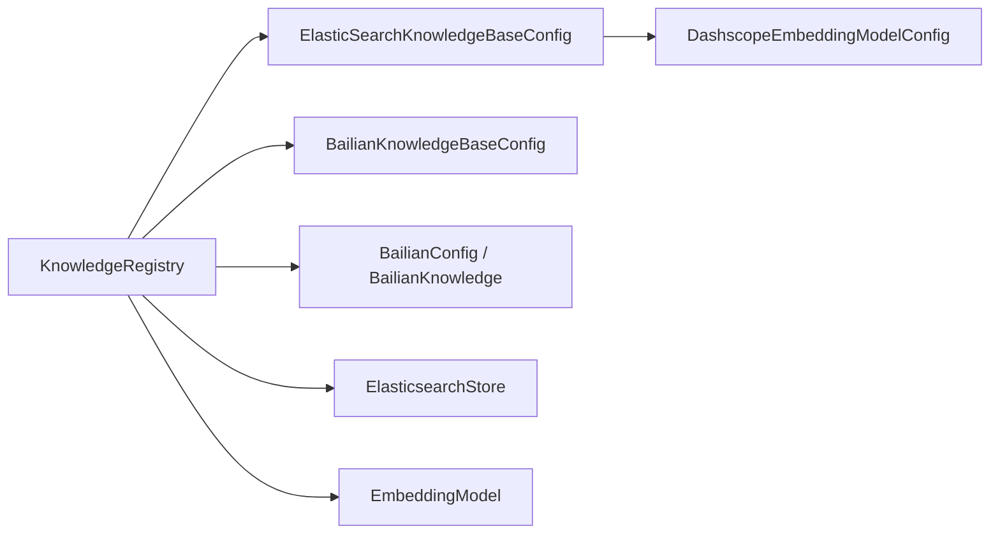

# Knowledge Base Providers

<cite>
**Referenced Files in This Document**
- [ElasticSearchKnowledgeBaseConfig.java](file://backend_java/core/src/main/java/com/aliyun/tam/x/tron/core/config/ElasticSearchKnowledgeBaseConfig.java)
- [BailianKnowledgeBaseConfig.java](file://backend_java/core/src/main/java/com/aliyun/tam/x/tron/core/config/BailianKnowledgeBaseConfig.java)
- [KnowledgeBaseConfig.java](file://backend_java/core/src/main/java/com/aliyun/tam/x/tron/core/config/KnowledgeBaseConfig.java)
- [KnowledgeBaseType.java](file://backend_java/core/src/main/java/com/aliyun/tam/x/tron/core/config/KnowledgeBaseType.java)
- [DashscopeEmbeddingModelConfig.java](file://backend_java/core/src/main/java/com/aliyun/tam/x/tron/core/config/DashscopeEmbeddingModelConfig.java)
- [EmbeddingModelConfig.java](file://backend_java/core/src/main/java/com/aliyun/tam/x/tron/core/config/EmbeddingModelConfig.java)
- [KnowledgeRegistry.java](file://backend_java/core/src/main/java/com/aliyun/tam/x/tron/core/rag/KnowledgeRegistry.java)
- [KnowledgeBaseConfigBuilder.java](file://backend_java/core/src/main/java/com/aliyun/tam/x/tron/core/rag/KnowledgeBaseConfigBuilder.java)
- [ExampleKnowledgeBaseConfigBuilder.java](file://backend_java/core/src/main/java/com/aliyun/tam/x/tron/core/rag/ExampleKnowledgeBaseConfigBuilder.java)
- [KnowledgeBaseRepository.java](file://backend_java/core/src/main/java/com/aliyun/tam/x/tron/core/domain/repository/KnowledgeBaseRepository.java)
</cite>

## Table of Contents
1. [Introduction](#introduction)
2. [Project Structure](#project-structure)
3. [Core Components](#core-components)
4. [Architecture Overview](#architecture-overview)
5. [Detailed Component Analysis](#detailed-component-analysis)
6. [Dependency Analysis](#dependency-analysis)
7. [Performance Considerations](#performance-considerations)
8. [Troubleshooting Guide](#troubleshooting-guide)
9. [Conclusion](#conclusion)
10. [Appendices](#appendices)

## Introduction
This document explains the knowledge base provider implementations in Tron OneAgent, focusing on:
- ElasticSearchKnowledgeBaseConfig for vector search and full-text indexing via Elasticsearch
- BailianKnowledgeBaseConfig for Alibaba Cloud Bailian integration and cloud-native knowledge management
- The provider abstraction layer enabling pluggable knowledge base backends
It covers configuration parameters, connection management, provider-specific optimization settings, setup instructions, performance characteristics, migration strategies, provider selection criteria, cost considerations, and scalability implications for enterprise deployments.

## Project Structure
The knowledge base provider stack is organized around a shared configuration abstraction and a registry that builds provider-specific knowledge instances at runtime. The key modules are:
- Configuration models for providers and embedding models
- Registry that resolves and constructs knowledge bases
- Builders and repositories for configuration provisioning

**Diagram sources**
- [KnowledgeBaseConfig.java:32-41](file://backend_java/core/src/main/java/com/aliyun/tam/x/tron/core/config/KnowledgeBaseConfig.java#L32-L41)
- [KnowledgeBaseType.java:26-32](file://backend_java/core/src/main/java/com/aliyun/tam/x/tron/core/config/KnowledgeBaseType.java#L26-L32)
- [ElasticSearchKnowledgeBaseConfig.java:34-52](file://backend_java/core/src/main/java/com/aliyun/tam/x/tron/core/config/ElasticSearchKnowledgeBaseConfig.java#L34-L52)
- [BailianKnowledgeBaseConfig.java:34-74](file://backend_java/core/src/main/java/com/aliyun/tam/x/tron/core/config/BailianKnowledgeBaseConfig.java#L34-L74)
- [EmbeddingModelConfig.java:34-37](file://backend_java/core/src/main/java/com/aliyun/tam/x/tron/core/config/EmbeddingModelConfig.java#L34-L37)
- [DashscopeEmbeddingModelConfig.java:35-59](file://backend_java/core/src/main/java/com/aliyun/tam/x/tron/core/config/DashscopeEmbeddingModelConfig.java#L35-L59)
- [KnowledgeRegistry.java:56-200](file://backend_java/core/src/main/java/com/aliyun/tam/x/tron/core/rag/KnowledgeRegistry.java#L56-L200)
- [KnowledgeBaseConfigBuilder.java:22-26](file://backend_java/core/src/main/java/com/aliyun/tam/x/tron/core/rag/KnowledgeBaseConfigBuilder.java#L22-L26)
- [ExampleKnowledgeBaseConfigBuilder.java:26-50](file://backend_java/core/src/main/java/com/aliyun/tam/x/tron/core/rag/ExampleKnowledgeBaseConfigBuilder.java#L26-L50)
- [KnowledgeBaseRepository.java:24-33](file://backend_java/core/src/main/java/com/aliyun/tam/x/tron/core/domain/repository/KnowledgeBaseRepository.java#L24-L33)

**Section sources**
- [KnowledgeBaseConfig.java:32-41](file://backend_java/core/src/main/java/com/aliyun/tam/x/tron/core/config/KnowledgeBaseConfig.java#L32-L41)
- [KnowledgeRegistry.java:56-200](file://backend_java/core/src/main/java/com/aliyun/tam/x/tron/core/rag/KnowledgeRegistry.java#L56-L200)

## Core Components
- KnowledgeBaseConfig: Abstract base for knowledge base configurations with JSON polymorphism support and a type discriminator. It defines common fields such as id, enabled flag, version, and name, and exposes a type conversion method.
- ElasticSearchKnowledgeBaseConfig: Provider-specific configuration for Elasticsearch-backed vector search and full-text indexing. Includes connection details, index metadata, embedding model configuration, and dimensionality.
- BailianKnowledgeBaseConfig: Provider-specific configuration for Alibaba Cloud Bailian. Includes credentials, workspace and index identifiers, optional query rewriting and re-ranking controls, similarity top-K settings, and retriever history persistence.
- EmbeddingModelConfig and DashscopeEmbeddingModelConfig: Abstraction and implementation for embedding model provisioning, including provider identification and model construction.
- KnowledgeRegistry: Central runtime component that resolves, merges, caches, and builds knowledge base instances from configured providers. It supports pluggable builders and database-backed overrides.

**Section sources**
- [KnowledgeBaseConfig.java:32-69](file://backend_java/core/src/main/java/com/aliyun/tam/x/tron/core/config/KnowledgeBaseConfig.java#L32-L69)
- [ElasticSearchKnowledgeBaseConfig.java:34-52](file://backend_java/core/src/main/java/com/aliyun/tam/x/tron/core/config/ElasticSearchKnowledgeBaseConfig.java#L34-L52)
- [BailianKnowledgeBaseConfig.java:34-74](file://backend_java/core/src/main/java/com/aliyun/tam/x/tron/core/config/BailianKnowledgeBaseConfig.java#L34-L74)
- [EmbeddingModelConfig.java:34-47](file://backend_java/core/src/main/java/com/aliyun/tam/x/tron/core/config/EmbeddingModelConfig.java#L34-L47)
- [DashscopeEmbeddingModelConfig.java:35-59](file://backend_java/core/src/main/java/com/aliyun/tam/x/tron/core/config/DashscopeEmbeddingModelConfig.java#L35-L59)
- [KnowledgeRegistry.java:56-200](file://backend_java/core/src/main/java/com/aliyun/tam/x/tron/core/rag/KnowledgeRegistry.java#L56-L200)

## Architecture Overview
The provider abstraction layer enables pluggable knowledge base backends through:
- A shared configuration hierarchy with JSON type discriminators
- A registry that constructs provider-specific knowledge instances
- Optional builders and repository overrides for dynamic configuration

**Diagram sources**
- [KnowledgeBaseConfig.java:32-69](file://backend_java/core/src/main/java/com/aliyun/tam/x/tron/core/config/KnowledgeBaseConfig.java#L32-L69)
- [ElasticSearchKnowledgeBaseConfig.java:34-52](file://backend_java/core/src/main/java/com/aliyun/tam/x/tron/core/config/ElasticSearchKnowledgeBaseConfig.java#L34-L52)
- [BailianKnowledgeBaseConfig.java:34-74](file://backend_java/core/src/main/java/com/aliyun/tam/x/tron/core/config/BailianKnowledgeBaseConfig.java#L34-L74)
- [EmbeddingModelConfig.java:34-47](file://backend_java/core/src/main/java/com/aliyun/tam/x/tron/core/config/EmbeddingModelConfig.java#L34-L47)
- [DashscopeEmbeddingModelConfig.java:35-59](file://backend_java/core/src/main/java/com/aliyun/tam/x/tron/core/config/DashscopeEmbeddingModelConfig.java#L35-L59)
- [KnowledgeRegistry.java:56-200](file://backend_java/core/src/main/java/com/aliyun/tam/x/tron/core/rag/KnowledgeRegistry.java#L56-L200)
- [KnowledgeBaseConfigBuilder.java:22-26](file://backend_java/core/src/main/java/com/aliyun/tam/x/tron/core/rag/KnowledgeBaseConfigBuilder.java#L22-L26)
- [ExampleKnowledgeBaseConfigBuilder.java:26-50](file://backend_java/core/src/main/java/com/aliyun/tam/x/tron/core/rag/ExampleKnowledgeBaseConfigBuilder.java#L26-L50)
- [KnowledgeBaseRepository.java:24-33](file://backend_java/core/src/main/java/com/aliyun/tam/x/tron/core/domain/repository/KnowledgeBaseRepository.java#L24-L33)

## Detailed Component Analysis

### ElasticSearchKnowledgeBaseConfig
- Purpose: Configure Elasticsearch as a vector search and full-text indexing backend for RAG.
- Key parameters:
  - Connection: url, username, password
  - Index: indexName
  - Embeddings: embeddingModelConfig, dimensions
- Construction flow:
  - The registry sets embedding dimensions from the knowledge base config into the embedding model config before building the embedding model.
  - An Elasticsearch vector store is built with connection and index parameters.
  - A SimpleKnowledge instance is returned with the embedding model and vector store injected.
- Security: Credentials are annotated for encryption at rest or in transit as per the framework’s encryption policy.

**Diagram sources**
- [KnowledgeRegistry.java:182-198](file://backend_java/core/src/main/java/com/aliyun/tam/x/tron/core/rag/KnowledgeRegistry.java#L182-L198)
- [DashscopeEmbeddingModelConfig.java:52-59](file://backend_java/core/src/main/java/com/aliyun/tam/x/tron/core/config/DashscopeEmbeddingModelConfig.java#L52-L59)
- [ElasticSearchKnowledgeBaseConfig.java:36-47](file://backend_java/core/src/main/java/com/aliyun/tam/x/tron/core/config/ElasticSearchKnowledgeBaseConfig.java#L36-L47)

**Section sources**
- [ElasticSearchKnowledgeBaseConfig.java:34-52](file://backend_java/core/src/main/java/com/aliyun/tam/x/tron/core/config/ElasticSearchKnowledgeBaseConfig.java#L34-L52)
- [KnowledgeRegistry.java:182-198](file://backend_java/core/src/main/java/com/aliyun/tam/x/tron/core/rag/KnowledgeRegistry.java#L182-L198)

### BailianKnowledgeBaseConfig
- Purpose: Configure Alibaba Cloud Bailian as a managed knowledge base with optional query rewriting and re-ranking.
- Key parameters:
  - Authentication: accessKeyId, accessKeySecret
  - Workspace/Index: workspaceId, indexId
  - Rewriting: enableRewrite, rewriteModelName
  - Re-ranking: enableRerank, rerankModelName, rerankMinScore, rerankTopK
  - Similarity: denseSimilarityTopK, sparseSimilarityTopK
  - Retriever history: saveRetrieverHistory
- Construction flow:
  - The registry translates provider flags and parameters into Bailian-specific configuration objects (including rewrite and rerank settings).
  - A BailianKnowledge instance is built and returned.

**Diagram sources**
- [KnowledgeRegistry.java:156-181](file://backend_java/core/src/main/java/com/aliyun/tam/x/tron/core/rag/KnowledgeRegistry.java#L156-L181)
- [BailianKnowledgeBaseConfig.java:34-74](file://backend_java/core/src/main/java/com/aliyun/tam/x/tron/core/config/BailianKnowledgeBaseConfig.java#L34-L74)

**Section sources**
- [BailianKnowledgeBaseConfig.java:34-74](file://backend_java/core/src/main/java/com/aliyun/tam/x/tron/core/config/BailianKnowledgeBaseConfig.java#L34-L74)
- [KnowledgeRegistry.java:156-181](file://backend_java/core/src/main/java/com/aliyun/tam/x/tron/core/rag/KnowledgeRegistry.java#L156-L181)

### Provider Abstraction and Pluggability
- Type system: KnowledgeBaseType enumerates supported providers and serializes/deserializes via numeric type codes.
- Polymorphic config: KnowledgeBaseConfig uses JSON type info to deserialize into specific provider implementations.
- Builder pattern: KnowledgeBaseConfigBuilder allows code-defined defaults and overrides; ExampleKnowledgeBaseConfigBuilder demonstrates a sample Bailian configuration.
- Runtime resolution: KnowledgeRegistry merges code-provided and repository-provided configs, caches knowledge instances, and constructs provider-specific knowledge.

**Diagram sources**
- [KnowledgeRegistry.java:84-136](file://backend_java/core/src/main/java/com/aliyun/tam/x/tron/core/rag/KnowledgeRegistry.java#L84-L136)
- [KnowledgeBaseConfigBuilder.java:22-26](file://backend_java/core/src/main/java/com/aliyun/tam/x/tron/core/rag/KnowledgeBaseConfigBuilder.java#L22-L26)
- [ExampleKnowledgeBaseConfigBuilder.java:26-50](file://backend_java/core/src/main/java/com/aliyun/tam/x/tron/core/rag/ExampleKnowledgeBaseConfigBuilder.java#L26-L50)

**Section sources**
- [KnowledgeBaseType.java:26-53](file://backend_java/core/src/main/java/com/aliyun/tam/x/tron/core/config/KnowledgeBaseType.java#L26-L53)
- [KnowledgeBaseConfig.java:36-40](file://backend_java/core/src/main/java/com/aliyun/tam/x/tron/core/config/KnowledgeBaseConfig.java#L36-L40)
- [KnowledgeRegistry.java:56-136](file://backend_java/core/src/main/java/com/aliyun/tam/x/tron/core/rag/KnowledgeRegistry.java#L56-L136)

## Dependency Analysis
- Coupling:
  - KnowledgeRegistry depends on provider-specific configuration classes and external integrations (Bailian and Elasticsearch).
  - ElasticSearchKnowledgeBaseConfig depends on DashscopeEmbeddingModelConfig for embeddings.
- Cohesion:
  - Each provider configuration encapsulates its own parameters and type identity.
- External dependencies:
  - Bailian integration components (BailianConfig, BailianKnowledge, RewriteConfig, RerankConfig)
  - Elasticsearch vector store (ElasticsearchStore)
  - Embedding model (DashScopeTextEmbedding)

**Diagram sources**
- [KnowledgeRegistry.java:155-200](file://backend_java/core/src/main/java/com/aliyun/tam/x/tron/core/rag/KnowledgeRegistry.java#L155-L200)
- [ElasticSearchKnowledgeBaseConfig.java:34-52](file://backend_java/core/src/main/java/com/aliyun/tam/x/tron/core/config/ElasticSearchKnowledgeBaseConfig.java#L34-L52)
- [BailianKnowledgeBaseConfig.java:34-74](file://backend_java/core/src/main/java/com/aliyun/tam/x/tron/core/config/BailianKnowledgeBaseConfig.java#L34-L74)
- [DashscopeEmbeddingModelConfig.java:52-59](file://backend_java/core/src/main/java/com/aliyun/tam/x/tron/core/config/DashscopeEmbeddingModelConfig.java#L52-L59)

**Section sources**
- [KnowledgeRegistry.java:155-200](file://backend_java/core/src/main/java/com/aliyun/tam/x/tron/core/rag/KnowledgeRegistry.java#L155-L200)

## Performance Considerations
- Vector search and retrieval:
  - Adjust denseSimilarityTopK and sparseSimilarityTopK to balance recall and latency.
  - Tune rerankTopK and rerankMinScore to reduce post-filtering overhead while maintaining quality.
- Embedding model:
  - Ensure embedding dimensions match the vector store index to avoid costly conversions.
  - Choose an appropriate embedding model name and dimensions for downstream similarity.
- Caching:
  - KnowledgeRegistry caches knowledge instances with an expiration policy; monitor cache hit rates and tune TTL/expiry for your workload.
- Elasticsearch:
  - Use appropriate index mappings and refresh intervals for production workloads.
  - Consider sharding and replicas for scale-out.

[No sources needed since this section provides general guidance]

## Troubleshooting Guide
- Authentication failures:
  - Verify accessKeyId/accessKeySecret for Bailian and username/password for Elasticsearch.
  - Confirm encrypted credential handling according to the framework’s encryption policy.
- Index misconfiguration:
  - Ensure indexName exists and is properly mapped for Elasticsearch.
  - Validate workspaceId/indexId correctness for Bailian.
- Retrieval quality:
  - Increase denseSimilarityTopK or sparseSimilarityTopK cautiously to improve recall.
  - Enable rewriting and reranking selectively to reduce hallucinations and improve relevance.
- Model mismatch:
  - Confirm embedding model dimensions align with the vector store index.
  - Rebuild knowledge after changing embedding model parameters.
- Registry errors:
  - Check KnowledgeRegistry logs for exceptions during knowledge construction or cache closure.
  - Validate that KnowledgeBaseConfigBuilder and KnowledgeBaseRepository return consistent configurations.

**Section sources**
- [BailianKnowledgeBaseConfig.java:34-74](file://backend_java/core/src/main/java/com/aliyun/tam/x/tron/core/config/BailianKnowledgeBaseConfig.java#L34-L74)
- [ElasticSearchKnowledgeBaseConfig.java:36-47](file://backend_java/core/src/main/java/com/aliyun/tam/x/tron/core/config/ElasticSearchKnowledgeBaseConfig.java#L36-L47)
- [DashscopeEmbeddingModelConfig.java:52-59](file://backend_java/core/src/main/java/com/aliyun/tam/x/tron/core/config/DashscopeEmbeddingModelConfig.java#L52-L59)
- [KnowledgeRegistry.java:61-82](file://backend_java/core/src/main/java/com/aliyun/tam/x/tron/core/rag/KnowledgeRegistry.java#L61-L82)

## Conclusion
Tron OneAgent’s knowledge base provider layer offers a flexible, pluggable architecture for integrating cloud-native and on-premises knowledge backends. ElasticSearchKnowledgeBaseConfig delivers robust vector and full-text search capabilities, while BailianKnowledgeBaseConfig provides managed cloud-native retrieval with optional rewriting and re-ranking. The registry and builder patterns enable dynamic configuration merging and caching, supporting scalable enterprise deployments. Careful tuning of provider-specific parameters and embedding dimensions is essential for performance and cost efficiency.

[No sources needed since this section summarizes without analyzing specific files]

## Appendices

### Setup Instructions

- ElasticSearchKnowledgeBaseConfig
  - Provide connection details (url, username, password), index name, embedding model configuration, and dimensions.
  - Ensure the embedding model’s dimensions match the vector index.
  - Build and validate the knowledge base through the registry.

  **Section sources**
  - [ElasticSearchKnowledgeBaseConfig.java:36-47](file://backend_java/core/src/main/java/com/aliyun/tam/x/tron/core/config/ElasticSearchKnowledgeBaseConfig.java#L36-L47)
  - [DashscopeEmbeddingModelConfig.java:52-59](file://backend_java/core/src/main/java/com/aliyun/tam/x/tron/core/config/DashscopeEmbeddingModelConfig.java#L52-L59)
  - [KnowledgeRegistry.java:182-198](file://backend_java/core/src/main/java/com/aliyun/tam/x/tron/core/rag/KnowledgeRegistry.java#L182-L198)

- BailianKnowledgeBaseConfig
  - Supply accessKeyId, accessKeySecret, workspaceId, and indexId.
  - Optionally enable rewriting and reranking with model names and thresholds.
  - Set dense and sparse similarity top-K values to control retrieval breadth.
  - Enable retriever history saving if needed for diagnostics.

  **Section sources**
  - [BailianKnowledgeBaseConfig.java:34-74](file://backend_java/core/src/main/java/com/aliyun/tam/x/tron/core/config/BailianKnowledgeBaseConfig.java#L34-L74)
  - [KnowledgeRegistry.java:156-181](file://backend_java/core/src/main/java/com/aliyun/tam/x/tron/core/rag/KnowledgeRegistry.java#L156-L181)

### Migration Strategies
- From Bailian to Elasticsearch:
  - Export indexed documents from Bailian and ingest into Elasticsearch.
  - Align embedding model parameters and dimensions.
  - Validate similarity scores and adjust top-K parameters post-migration.
- From Elasticsearch to Bailian:
  - Replicate indices and mappings into Bailian-managed workspace/index.
  - Switch provider configuration and enable/disable rewriting/re-ranking as desired.
  - Monitor latency and accuracy; iterate on rerank settings.

[No sources needed since this section provides general guidance]

### Provider Selection Criteria
- Cost considerations:
  - Elasticsearch: self-managed or hosted costs for compute, storage, and maintenance.
  - Bailian: managed service pricing with potential savings on operational overhead.
- Scalability:
  - Elasticsearch: horizontal scaling via shards and replicas; suitable for large-scale vector workloads.
  - Bailian: managed auto-scaling; simpler ops but less control over infrastructure.
- Feature parity:
  - Both support vector search; Bailian adds optional rewriting and re-ranking out-of-the-box.

[No sources needed since this section provides general guidance]