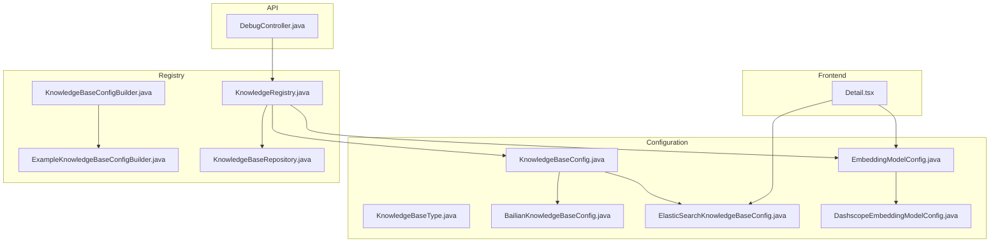
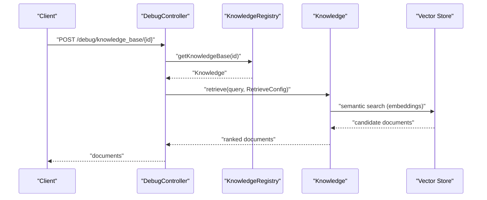
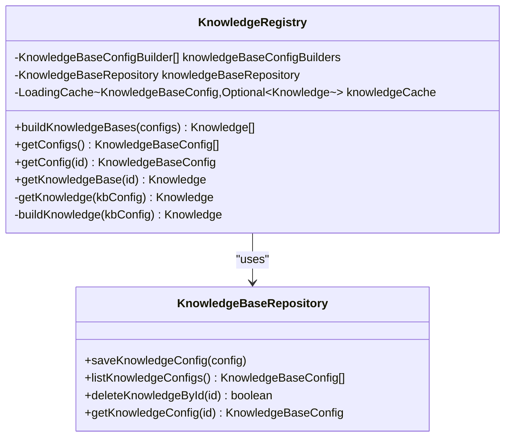
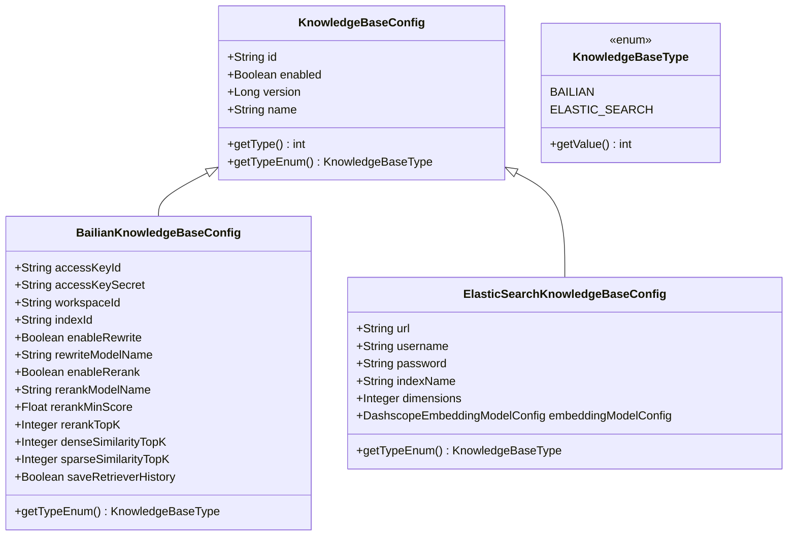
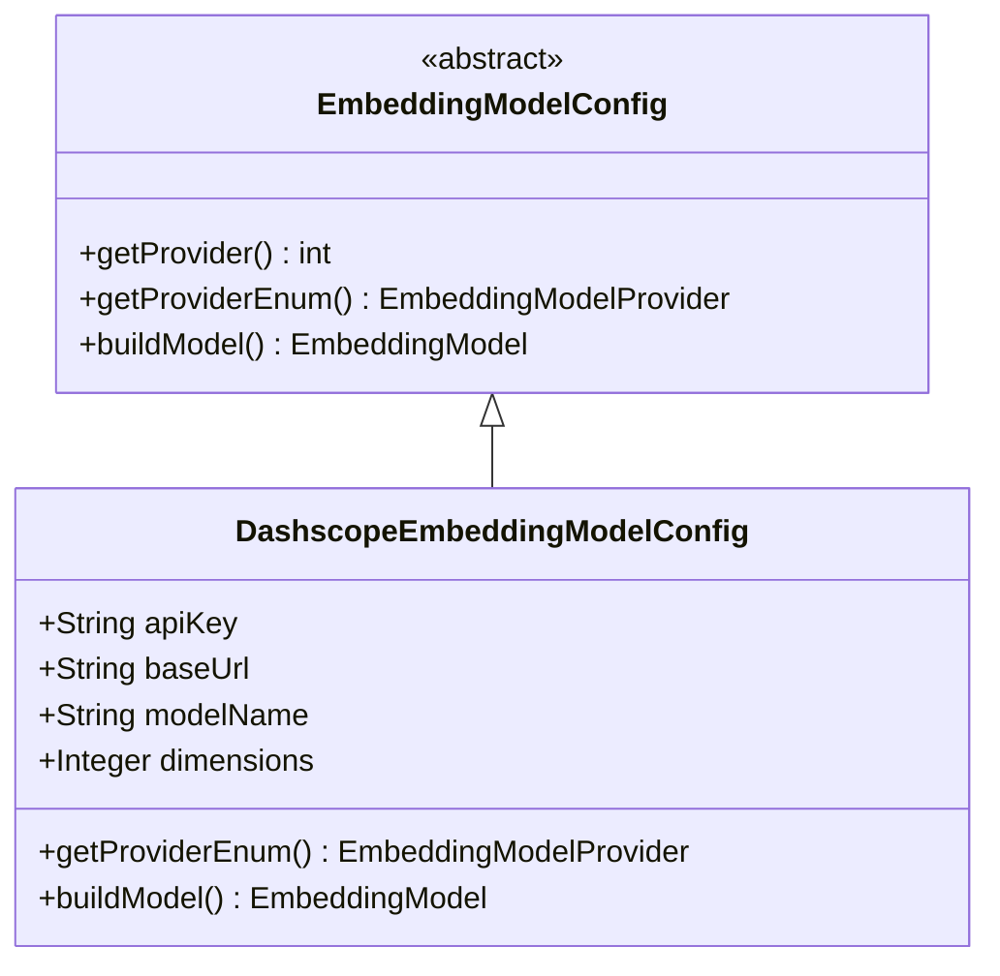
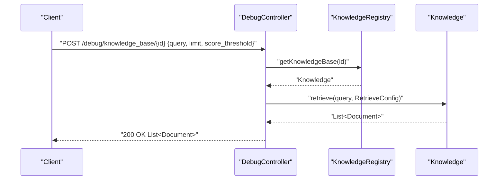
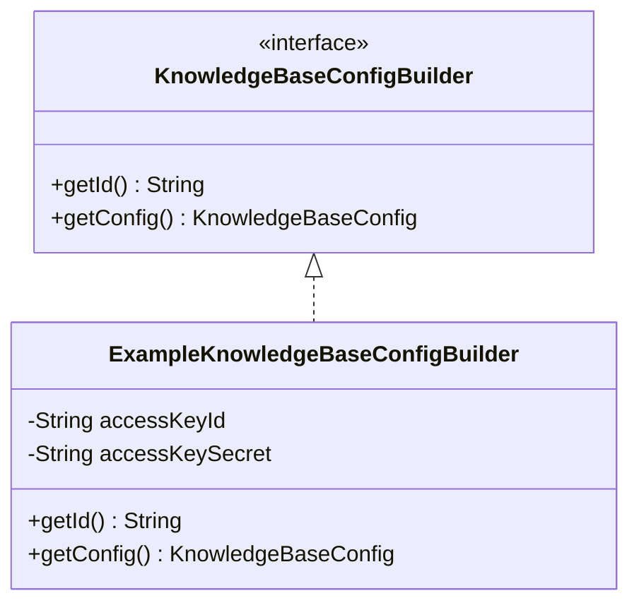
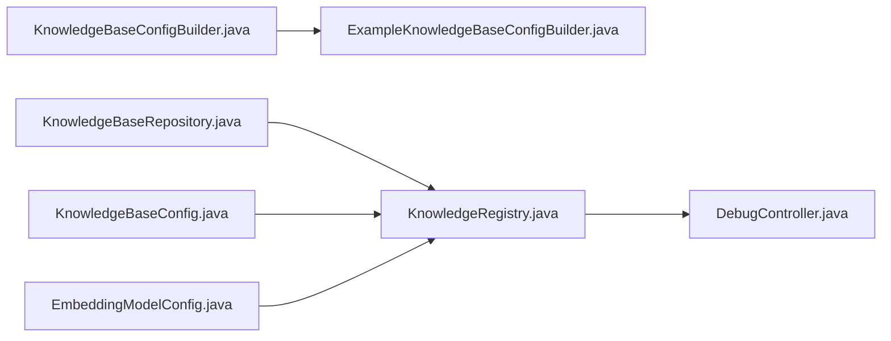

# RAG Implementation

<cite>
**Referenced Files in This Document**
- [KnowledgeRegistry.java](file://backend_java/core/src/main/java/com/aliyun/tam/x/tron/core/rag/KnowledgeRegistry.java)
- [KnowledgeBaseConfigBuilder.java](file://backend_java/core/src/main/java/com/aliyun/tam/x/tron/core/rag/KnowledgeBaseConfigBuilder.java)
- [ExampleKnowledgeBaseConfigBuilder.java](file://backend_java/core/src/main/java/com/aliyun/tam/x/tron/core/rag/ExampleKnowledgeBaseConfigBuilder.java)
- [DebugController.java](file://backend_java/api/src/main/java/com/aliyun/tam/x/tron/api/DebugController.java)
- [EmbeddingModelConfig.java](file://backend_java/core/src/main/java/com/aliyun/tam/x/tron/core/config/EmbeddingModelConfig.java)
- [DashscopeEmbeddingModelConfig.java](file://backend_java/core/src/main/java/com/aliyun/tam/x/tron/core/config/DashscopeEmbeddingModelConfig.java)
- [BailianKnowledgeBaseConfig.java](file://backend_java/core/src/main/java/com/aliyun/tam/x/tron/core/config/BailianKnowledgeBaseConfig.java)
- [ElasticSearchKnowledgeBaseConfig.java](file://backend_java/core/src/main/java/com/aliyun/tam/x/tron/core/config/ElasticSearchKnowledgeBaseConfig.java)
- [KnowledgeBaseConfig.java](file://backend_java/core/src/main/java/com/aliyun/tam/x/tron/core/config/KnowledgeBaseConfig.java)
- [KnowledgeBaseType.java](file://backend_java/core/src/main/java/com/aliyun/tam/x/tron/core/config/KnowledgeBaseType.java)
- [KnowledgeBaseRepository.java](file://backend_java/core/src/main/java/com/aliyun/tam/x/tron/core/domain/repository/KnowledgeBaseRepository.java)
- [Detail.tsx](file://frontend/packages/control/src/pages/KB/Detail.tsx)
</cite>

## Table of Contents
1. [Introduction](#introduction)
2. [Project Structure](#project-structure)
3. [Core Components](#core-components)
4. [Architecture Overview](#architecture-overview)
5. [Detailed Component Analysis](#detailed-component-analysis)
6. [Dependency Analysis](#dependency-analysis)
7. [Performance Considerations](#performance-considerations)
8. [Troubleshooting Guide](#troubleshooting-guide)
9. [Conclusion](#conclusion)
10. [Appendices](#appendices)

## Introduction
This document explains the Retrieval-Augmented Generation (RAG) implementation in Tron OneAgent. It covers the query processing pipeline, document retrieval, and response generation mechanisms. It documents the KnowledgeRegistry that manages knowledge base connections and retrieval operations, the embedding model integration for semantic search and vector similarity calculations, and the chunking, similarity scoring, and relevance ranking systems. Practical guidance is included for configuring RAG pipelines, optimizing retrieval performance, implementing custom embedding models, managing memory for large document collections, caching frequently accessed knowledge, and tuning performance for real-time retrieval scenarios.

## Project Structure
The RAG implementation spans configuration, registry, embedding model integration, and API endpoints:
- Configuration layer defines knowledge base types and embedding providers.
- Registry builds and caches knowledge instances for efficient retrieval.
- API layer exposes endpoints to debug and retrieve knowledge.
- Frontend displays knowledge base configuration and embedding model settings.

**Diagram sources**
- [KnowledgeRegistry.java:1-204](file://backend_java/core/src/main/java/com/aliyun/tam/x/tron/core/rag/KnowledgeRegistry.java#L1-L204)
- [KnowledgeBaseConfig.java:1-70](file://backend_java/core/src/main/java/com/aliyun/tam/x/tron/core/config/KnowledgeBaseConfig.java#L1-L70)
- [KnowledgeBaseType.java:1-55](file://backend_java/core/src/main/java/com/aliyun/tam/x/tron/core/config/KnowledgeBaseType.java#L1-L55)
- [BailianKnowledgeBaseConfig.java:1-76](file://backend_java/core/src/main/java/com/aliyun/tam/x/tron/core/config/BailianKnowledgeBaseConfig.java#L1-L76)
- [ElasticSearchKnowledgeBaseConfig.java:1-54](file://backend_java/core/src/main/java/com/aliyun/tam/x/tron/core/config/ElasticSearchKnowledgeBaseConfig.java#L1-L54)
- [EmbeddingModelConfig.java:1-48](file://backend_java/core/src/main/java/com/aliyun/tam/x/tron/core/config/EmbeddingModelConfig.java#L1-L48)
- [DashscopeEmbeddingModelConfig.java:1-61](file://backend_java/core/src/main/java/com/aliyun/tam/x/tron/core/config/DashscopeEmbeddingModelConfig.java#L1-L61)
- [KnowledgeBaseConfigBuilder.java:1-27](file://backend_java/core/src/main/java/com/aliyun/tam/x/tron/core/rag/KnowledgeBaseConfigBuilder.java#L1-L27)
- [ExampleKnowledgeBaseConfigBuilder.java:1-52](file://backend_java/core/src/main/java/com/aliyun/tam/x/tron/core/rag/ExampleKnowledgeBaseConfigBuilder.java#L1-L52)
- [KnowledgeBaseRepository.java:1-34](file://backend_java/core/src/main/java/com/aliyun/tam/x/tron/core/domain/repository/KnowledgeBaseRepository.java#L1-L34)
- [DebugController.java:140-164](file://backend_java/api/src/main/java/com/aliyun/tam/x/tron/api/DebugController.java#L140-L164)
- [Detail.tsx:142-168](file://frontend/packages/control/src/pages/KB/Detail.tsx#L142-L168)

**Section sources**
- [KnowledgeRegistry.java:1-204](file://backend_java/core/src/main/java/com/aliyun/tam/x/tron/core/rag/KnowledgeRegistry.java#L1-L204)
- [KnowledgeBaseConfig.java:1-70](file://backend_java/core/src/main/java/com/aliyun/tam/x/tron/core/config/KnowledgeBaseConfig.java#L1-L70)
- [DebugController.java:140-164](file://backend_java/api/src/main/java/com/aliyun/tam/x/tron/api/DebugController.java#L140-L164)

## Core Components
- KnowledgeRegistry: Central factory and cache for knowledge bases. Builds knowledge instances from configuration, merges runtime and database configs, and caches them with eviction and close hooks for embedded stores.
- KnowledgeBaseConfig and subclasses: Define Bailian and Elasticsearch-backed knowledge bases, including embedding model configuration and retrieval parameters.
- EmbeddingModelConfig and DashscopeEmbeddingModelConfig: Provide embedding model construction for semantic search.
- DebugController: Exposes a debug endpoint to retrieve documents from a knowledge base given a query and retrieval parameters.
- KnowledgeBaseConfigBuilder and ExampleKnowledgeBaseConfigBuilder: Supply example configurations and allow dynamic configuration building.
- KnowledgeBaseRepository: Supplies persisted knowledge base configurations.

Key responsibilities:
- Build and cache knowledge instances per configuration.
- Integrate embedding models and vector stores for retrieval.
- Provide retrieval APIs with configurable limits and score thresholds.
- Merge code-defined and database-defined configurations.

**Section sources**
- [KnowledgeRegistry.java:53-203](file://backend_java/core/src/main/java/com/aliyun/tam/x/tron/core/rag/KnowledgeRegistry.java#L53-L203)
- [KnowledgeBaseConfig.java:32-69](file://backend_java/core/src/main/java/com/aliyun/tam/x/tron/core/config/KnowledgeBaseConfig.java#L32-L69)
- [BailianKnowledgeBaseConfig.java:28-75](file://backend_java/core/src/main/java/com/aliyun/tam/x/tron/core/config/BailianKnowledgeBaseConfig.java#L28-L75)
- [ElasticSearchKnowledgeBaseConfig.java:28-53](file://backend_java/core/src/main/java/com/aliyun/tam/x/tron/core/config/ElasticSearchKnowledgeBaseConfig.java#L28-L53)
- [EmbeddingModelConfig.java:31-47](file://backend_java/core/src/main/java/com/aliyun/tam/x/tron/core/config/EmbeddingModelConfig.java#L31-L47)
- [DashscopeEmbeddingModelConfig.java:26-60](file://backend_java/core/src/main/java/com/aliyun/tam/x/tron/core/config/DashscopeEmbeddingModelConfig.java#L26-L60)
- [DebugController.java:140-164](file://backend_java/api/src/main/java/com/aliyun/tam/x/tron/api/DebugController.java#L140-L164)
- [KnowledgeBaseConfigBuilder.java:22-26](file://backend_java/core/src/main/java/com/aliyun/tam/x/tron/core/rag/KnowledgeBaseConfigBuilder.java#L22-L26)
- [ExampleKnowledgeBaseConfigBuilder.java:25-51](file://backend_java/core/src/main/java/com/aliyun/tam/x/tron/core/rag/ExampleKnowledgeBaseConfigBuilder.java#L25-L51)
- [KnowledgeBaseRepository.java:24-33](file://backend_java/core/src/main/java/com/aliyun/tam/x/tron/core/domain/repository/KnowledgeBaseRepository.java#L24-L33)

## Architecture Overview
The RAG architecture integrates configuration-driven knowledge base creation, embedding model provisioning, and retrieval with optional query rewriting and re-ranking.

**Diagram sources**
- [DebugController.java:140-164](file://backend_java/api/src/main/java/com/aliyun/tam/x/tron/api/DebugController.java#L140-L164)
- [KnowledgeRegistry.java:138-152](file://backend_java/core/src/main/java/com/aliyun/tam/x/tron/core/rag/KnowledgeRegistry.java#L138-L152)

## Detailed Component Analysis

### KnowledgeRegistry
Responsibilities:
- Merge code-defined and database-defined knowledge base configurations.
- Build knowledge instances for Bailian and Elasticsearch backends.
- Cache knowledge instances with size limits, TTL, and resource cleanup hooks.
- Provide lists of enabled knowledge bases for agent usage.

Key behaviors:
- Caching: Uses a loading cache with maximum size and access-based expiration. Removal listener closes embedded stores when evicted.
- Construction: For Bailian, constructs a configuration with optional query rewrite and re-ranking. For Elasticsearch, builds an embedding model and vector store, then wraps them in a simple knowledge instance.

**Diagram sources**
- [KnowledgeRegistry.java:53-203](file://backend_java/core/src/main/java/com/aliyun/tam/x/tron/core/rag/KnowledgeRegistry.java#L53-L203)
- [KnowledgeBaseRepository.java:24-33](file://backend_java/core/src/main/java/com/aliyun/tam/x/tron/core/domain/repository/KnowledgeBaseRepository.java#L24-L33)

**Section sources**
- [KnowledgeRegistry.java:61-82](file://backend_java/core/src/main/java/com/aliyun/tam/x/tron/core/rag/KnowledgeRegistry.java#L61-L82)
- [KnowledgeRegistry.java:146-152](file://backend_java/core/src/main/java/com/aliyun/tam/x/tron/core/rag/KnowledgeRegistry.java#L146-L152)
- [KnowledgeRegistry.java:155-200](file://backend_java/core/src/main/java/com/aliyun/tam/x/tron/core/rag/KnowledgeRegistry.java#L155-L200)

### Knowledge Base Configurations
- KnowledgeBaseConfig: Base class with JSON polymorphism for concrete knowledge base types.
- KnowledgeBaseType: Enumerates supported knowledge base types.
- BailianKnowledgeBaseConfig: Provides credentials, workspace/index identifiers, optional query rewrite and re-ranking toggles, top-K parameters, and history saving flag.
- ElasticSearchKnowledgeBaseConfig: Holds connection details, index name, dimension count, and an embedded embedding model configuration.

**Diagram sources**
- [KnowledgeBaseConfig.java:32-69](file://backend_java/core/src/main/java/com/aliyun/tam/x/tron/core/config/KnowledgeBaseConfig.java#L32-L69)
- [KnowledgeBaseType.java:26-54](file://backend_java/core/src/main/java/com/aliyun/tam/x/tron/core/config/KnowledgeBaseType.java#L26-L54)
- [BailianKnowledgeBaseConfig.java:28-75](file://backend_java/core/src/main/java/com/aliyun/tam/x/tron/core/config/BailianKnowledgeBaseConfig.java#L28-L75)
- [ElasticSearchKnowledgeBaseConfig.java:28-53](file://backend_java/core/src/main/java/com/aliyun/tam/x/tron/core/config/ElasticSearchKnowledgeBaseConfig.java#L28-L53)

**Section sources**
- [KnowledgeBaseConfig.java:32-69](file://backend_java/core/src/main/java/com/aliyun/tam/x/tron/core/config/KnowledgeBaseConfig.java#L32-L69)
- [KnowledgeBaseType.java:26-54](file://backend_java/core/src/main/java/com/aliyun/tam/x/tron/core/config/KnowledgeBaseType.java#L26-L54)
- [BailianKnowledgeBaseConfig.java:34-75](file://backend_java/core/src/main/java/com/aliyun/tam/x/tron/core/config/BailianKnowledgeBaseConfig.java#L34-L75)
- [ElasticSearchKnowledgeBaseConfig.java:34-53](file://backend_java/core/src/main/java/com/aliyun/tam/x/tron/core/config/ElasticSearchKnowledgeBaseConfig.java#L34-L53)

### Embedding Model Integration
- EmbeddingModelConfig: Abstract base for embedding providers with JSON polymorphism and provider enumeration.
- DashscopeEmbeddingModelConfig: Concrete provider configuration supporting API key, base URL, model name, and dimensions.

**Diagram sources**
- [EmbeddingModelConfig.java:31-47](file://backend_java/core/src/main/java/com/aliyun/tam/x/tron/core/config/EmbeddingModelConfig.java#L31-L47)
- [DashscopeEmbeddingModelConfig.java:26-60](file://backend_java/core/src/main/java/com/aliyun/tam/x/tron/core/config/DashscopeEmbeddingModelConfig.java#L26-L60)

**Section sources**
- [EmbeddingModelConfig.java:31-47](file://backend_java/core/src/main/java/com/aliyun/tam/x/tron/core/config/EmbeddingModelConfig.java#L31-L47)
- [DashscopeEmbeddingModelConfig.java:35-60](file://backend_java/core/src/main/java/com/aliyun/tam/x/tron/core/config/DashscopeEmbeddingModelConfig.java#L35-L60)

### Retrieval Pipeline and Debug Endpoint
- DebugController exposes a debug endpoint to retrieve documents from a knowledge base. It accepts query, limit, and score threshold parameters and returns retrieved documents.

**Diagram sources**
- [DebugController.java:140-164](file://backend_java/api/src/main/java/com/aliyun/tam/x/tron/api/DebugController.java#L140-L164)
- [KnowledgeRegistry.java:138-152](file://backend_java/core/src/main/java/com/aliyun/tam/x/tron/core/rag/KnowledgeRegistry.java#L138-L152)

**Section sources**
- [DebugController.java:140-164](file://backend_java/api/src/main/java/com/aliyun/tam/x/tron/api/DebugController.java#L140-L164)

### Knowledge Base Builders and Examples
- KnowledgeBaseConfigBuilder: Interface for supplying knowledge base configurations programmatically.
- ExampleKnowledgeBaseConfigBuilder: Provides a ready-to-use Bailian configuration example with environment-based credentials.

**Diagram sources**
- [KnowledgeBaseConfigBuilder.java:22-26](file://backend_java/core/src/main/java/com/aliyun/tam/x/tron/core/rag/KnowledgeBaseConfigBuilder.java#L22-L26)
- [ExampleKnowledgeBaseConfigBuilder.java:25-51](file://backend_java/core/src/main/java/com/aliyun/tam/x/tron/core/rag/ExampleKnowledgeBaseConfigBuilder.java#L25-L51)

**Section sources**
- [KnowledgeBaseConfigBuilder.java:22-26](file://backend_java/core/src/main/java/com/aliyun/tam/x/tron/core/rag/KnowledgeBaseConfigBuilder.java#L22-L26)
- [ExampleKnowledgeBaseConfigBuilder.java:25-51](file://backend_java/core/src/main/java/com/aliyun/tam/x/tron/core/rag/ExampleKnowledgeBaseConfigBuilder.java#L25-L51)

### Frontend Knowledge Base View
- The frontend displays embedding model configuration fields such as API key, base URL, model name, and dimensions for Elasticsearch-backed knowledge bases.

**Section sources**
- [Detail.tsx:142-168](file://frontend/packages/control/src/pages/KB/Detail.tsx#L142-L168)

## Dependency Analysis
The registry depends on configuration builders and repositories to assemble knowledge base configurations, then constructs knowledge instances. The debug controller depends on the registry to serve retrieval requests.

**Diagram sources**
- [KnowledgeRegistry.java:57-59](file://backend_java/core/src/main/java/com/aliyun/tam/x/tron/core/rag/KnowledgeRegistry.java#L57-L59)
- [KnowledgeBaseRepository.java:24-33](file://backend_java/core/src/main/java/com/aliyun/tam/x/tron/core/domain/repository/KnowledgeBaseRepository.java#L24-L33)
- [KnowledgeBaseConfigBuilder.java:22-26](file://backend_java/core/src/main/java/com/aliyun/tam/x/tron/core/rag/KnowledgeBaseConfigBuilder.java#L22-L26)
- [ExampleKnowledgeBaseConfigBuilder.java:25-51](file://backend_java/core/src/main/java/com/aliyun/tam/x/tron/core/rag/ExampleKnowledgeBaseConfigBuilder.java#L25-L51)
- [DebugController.java:140-164](file://backend_java/api/src/main/java/com/aliyun/tam/x/tron/api/DebugController.java#L140-L164)

**Section sources**
- [KnowledgeRegistry.java:84-136](file://backend_java/core/src/main/java/com/aliyun/tam/x/tron/core/rag/KnowledgeRegistry.java#L84-L136)
- [KnowledgeBaseRepository.java:24-33](file://backend_java/core/src/main/java/com/aliyun/tam/x/tron/core/domain/repository/KnowledgeBaseRepository.java#L24-L33)

## Performance Considerations
- Caching: KnowledgeRegistry uses a loading cache with a fixed maximum size and access-based expiration to reduce repeated construction costs. Removal listeners close embedded stores to prevent resource leaks.
- Retrieval parameters: The debug endpoint demonstrates configurable limit and score threshold parameters, enabling fine-grained control over recall and precision.
- Embedding dimensions: For Elasticsearch-backed knowledge bases, embedding dimensions are set via configuration to match the vector store index.
- Query rewriting and re-ranking: Bailian-backed knowledge bases support optional query rewrite and re-ranking to improve relevance quality.

Practical tuning tips:
- Adjust denseSimilarityTopK and sparseSimilarityTopK for Bailian to balance speed and recall.
- Tune rerankTopK and rerankMinScore to filter low-relevance candidates post-retrieval.
- Set appropriate limit and score_threshold in retrieval requests to cap downstream processing cost.
- Monitor cache hit rate and adjust cache size/expiry based on workload patterns.

**Section sources**
- [KnowledgeRegistry.java:61-82](file://backend_java/core/src/main/java/com/aliyun/tam/x/tron/core/rag/KnowledgeRegistry.java#L61-L82)
- [DebugController.java:150-158](file://backend_java/api/src/main/java/com/aliyun/tam/x/tron/api/DebugController.java#L150-L158)
- [BailianKnowledgeBaseConfig.java:46-70](file://backend_java/core/src/main/java/com/aliyun/tam/x/tron/core/config/BailianKnowledgeBaseConfig.java#L46-L70)
- [ElasticSearchKnowledgeBaseConfig.java:45-47](file://backend_java/core/src/main/java/com/aliyun/tam/x/tron/core/config/ElasticSearchKnowledgeBaseConfig.java#L45-L47)

## Troubleshooting Guide
Common issues and resolutions:
- Knowledge base not found: The debug endpoint returns a 404 when the requested knowledge base ID is unknown. Verify the ID and ensure the knowledge base is enabled.
- Retrieval errors: The debug endpoint catches exceptions and returns a 400 with the error message. Inspect query parameters and embedding model configuration.
- Resource cleanup: The registry's removal listener attempts to close embedded stores when evicted. Errors during close are logged to aid diagnosis.
- Configuration precedence: The registry merges code-defined and database-defined configurations. Ensure credentials and indices are correctly set in the active configuration source.

Operational checks:
- Confirm embedding model provider and credentials are valid for Elasticsearch-backed knowledge bases.
- Validate Elasticsearch index dimensions match the configured embedding dimensions.
- For Bailian, verify workspace and index IDs, and confirm rewrite/rerank model names if enabled.

**Section sources**
- [DebugController.java:145-163](file://backend_java/api/src/main/java/com/aliyun/tam/x/tron/api/DebugController.java#L145-L163)
- [KnowledgeRegistry.java:64-76](file://backend_java/core/src/main/java/com/aliyun/tam/x/tron/core/rag/KnowledgeRegistry.java#L64-L76)
- [KnowledgeRegistry.java:124-136](file://backend_java/core/src/main/java/com/aliyun/tam/x/tron/core/rag/KnowledgeRegistry.java#L124-L136)

## Conclusion
Tron OneAgent’s RAG implementation centers on a flexible configuration system, a registry that builds and caches knowledge instances, and a debug endpoint for retrieval testing. The architecture supports both Bailian and Elasticsearch backends, integrates embedding models for semantic search, and offers optional query rewriting and re-ranking. Performance is addressed through caching, configurable retrieval parameters, and dimension alignment. The provided components enable practical deployment, tuning, and extension for real-time retrieval scenarios.

## Appendices

### Practical Configuration Examples
- Bailian knowledge base:
  - Enable rewrite and rerank with model names and thresholds.
  - Set workspace and index IDs, and top-K parameters for dense/sparse similarity.
- Elasticsearch knowledge base:
  - Provide connection details, index name, and embedding model configuration with dimensions.

**Section sources**
- [BailianKnowledgeBaseConfig.java:34-75](file://backend_java/core/src/main/java/com/aliyun/tam/x/tron/core/config/BailianKnowledgeBaseConfig.java#L34-L75)
- [ElasticSearchKnowledgeBaseConfig.java:34-53](file://backend_java/core/src/main/java/com/aliyun/tam/x/tron/core/config/ElasticSearchKnowledgeBaseConfig.java#L34-L53)

### Retrieval Optimization Checklist
- Cache: Monitor cache metrics and adjust size/expiry.
- Parameters: Tune limit, score threshold, rerankTopK, and rerankMinScore.
- Backends: Align embedding dimensions with vector store indexes.
- Rewriting/Reranking: Enable and validate models for improved relevance.

**Section sources**
- [KnowledgeRegistry.java:61-82](file://backend_java/core/src/main/java/com/aliyun/tam/x/tron/core/rag/KnowledgeRegistry.java#L61-L82)
- [DebugController.java:150-158](file://backend_java/api/src/main/java/com/aliyun/tam/x/tron/api/DebugController.java#L150-L158)
- [BailianKnowledgeBaseConfig.java:46-70](file://backend_java/core/src/main/java/com/aliyun/tam/x/tron/core/config/BailianKnowledgeBaseConfig.java#L46-L70)
- [ElasticSearchKnowledgeBaseConfig.java:45-47](file://backend_java/core/src/main/java/com/aliyun/tam/x/tron/core/config/ElasticSearchKnowledgeBaseConfig.java#L45-L47)