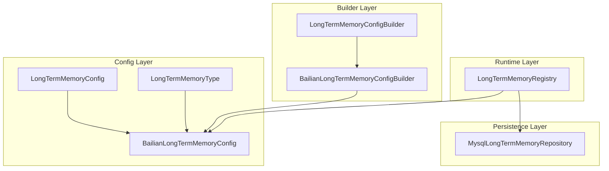
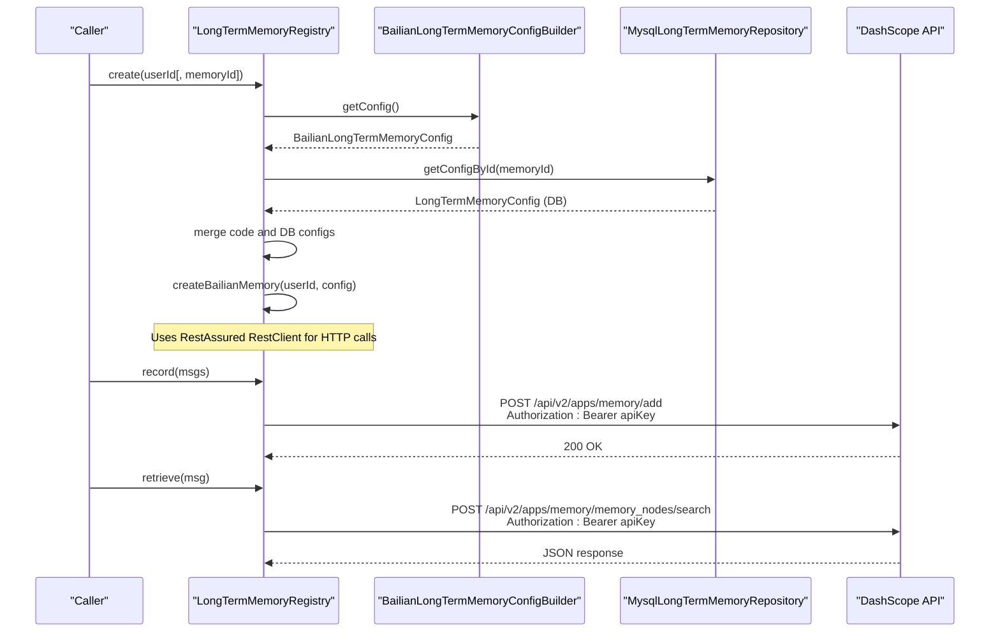
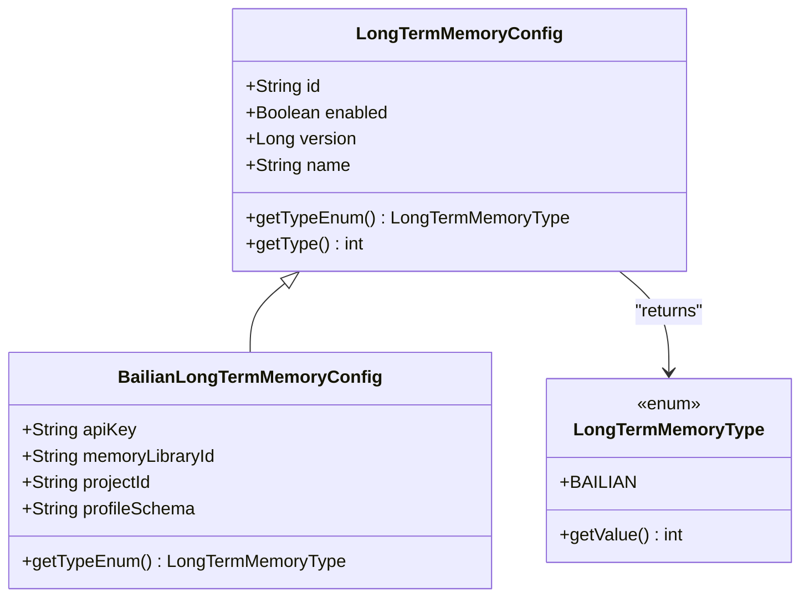
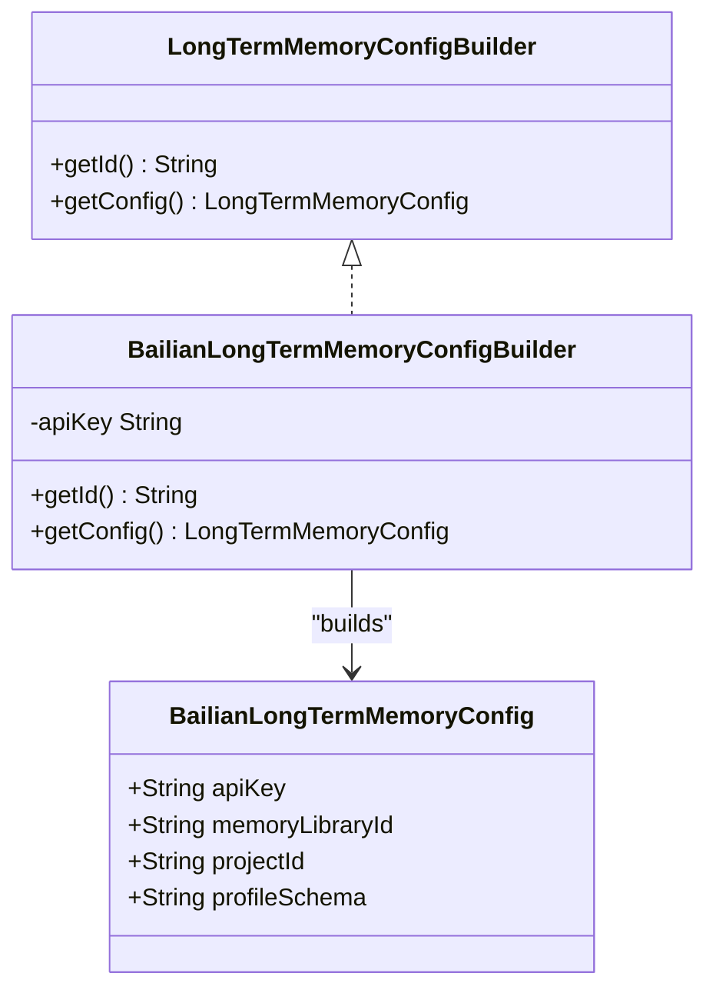
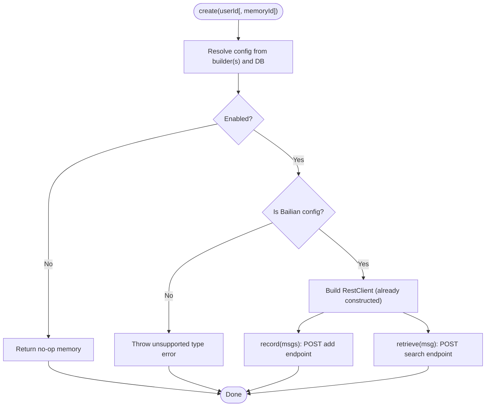
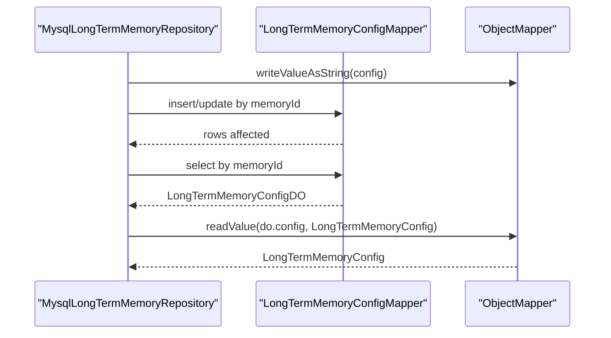
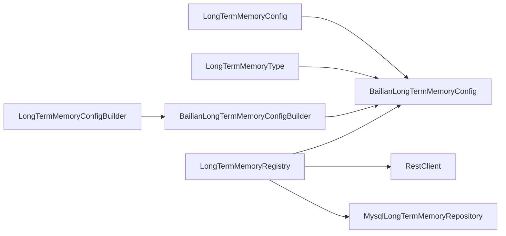

# Bailian Memory Provider

<cite>
**Referenced Files in This Document**
- [BailianLongTermMemoryConfig.java](file://backend_java/core/src/main/java/com/aliyun/tam/x/tron/core/config/BailianLongTermMemoryConfig.java)
- [LongTermMemoryConfig.java](file://backend_java/core/src/main/java/com/aliyun/tam/x/tron/core/config/LongTermMemoryConfig.java)
- [LongTermMemoryType.java](file://backend_java/core/src/main/java/com/aliyun/tam/x/tron/core/config/LongTermMemoryType.java)
- [BailianLongTermMemoryConfigBuilder.java](file://backend_java/core/src/main/java/com/aliyun/tam/x/tron/core/mem/BailianLongTermMemoryConfigBuilder.java)
- [LongTermMemoryConfigBuilder.java](file://backend_java/core/src/main/java/com/aliyun/tam/x/tron/core/mem/LongTermMemoryConfigBuilder.java)
- [LongTermMemoryRegistry.java](file://backend_java/core/src/main/java/com/aliyun/tam/x/tron/core/mem/LongTermMemoryRegistry.java)
- [MysqlLongTermMemoryRepository.java](file://backend_java/core/src/main/java/com/aliyun/tam/x/tron/core/domain/repository/mysql/MysqlLongTermMemoryRepository.java)
</cite>

## Table of Contents
1. [Introduction](#introduction)
2. [Project Structure](#project-structure)
3. [Core Components](#core-components)
4. [Architecture Overview](#architecture-overview)
5. [Detailed Component Analysis](#detailed-component-analysis)
6. [Dependency Analysis](#dependency-analysis)
7. [Performance Considerations](#performance-considerations)
8. [Troubleshooting Guide](#troubleshooting-guide)
9. [Conclusion](#conclusion)
10. [Appendices](#appendices)

## Introduction
This document explains the Bailian memory provider integration in Tron OneAgent. It focuses on the BailianLongTermMemoryConfig class and its configuration properties, the BailianLongTermMemoryConfigBuilder pattern for constructing and validating Bailian memory configurations, authentication mechanisms, API endpoints, and data serialization formats used for Bailian/DashScope communication. It also provides practical examples for configuration setup, credential management, error handling strategies, performance considerations, retry policies, fallback mechanisms, integration patterns with other Tron components, and best practices for production deployment.

## Project Structure
The Bailian memory provider spans configuration, builder, registry, and persistence layers:
- Configuration model: BailianLongTermMemoryConfig extends LongTermMemoryConfig
- Builder: BailianLongTermMemoryConfigBuilder implements LongTermMemoryConfigBuilder
- Registry: LongTermMemoryRegistry resolves and instantiates memory providers
- Persistence: MysqlLongTermMemoryRepository stores and retrieves configurations

**Diagram sources**
- [LongTermMemoryConfig.java:37-54](file://backend_java/core/src/main/java/com/aliyun/tam/x/tron/core/config/LongTermMemoryConfig.java#L37-L54)
- [LongTermMemoryType.java:23-47](file://backend_java/core/src/main/java/com/aliyun/tam/x/tron/core/config/LongTermMemoryType.java#L23-L47)
- [BailianLongTermMemoryConfig.java:31-46](file://backend_java/core/src/main/java/com/aliyun/tam/x/tron/core/config/BailianLongTermMemoryConfig.java#L31-L46)
- [LongTermMemoryConfigBuilder.java:22-26](file://backend_java/core/src/main/java/com/aliyun/tam/x/tron/core/mem/LongTermMemoryConfigBuilder.java#L22-L26)
- [BailianLongTermMemoryConfigBuilder.java:26-47](file://backend_java/core/src/main/java/com/aliyun/tam/x/tron/core/mem/BailianLongTermMemoryConfigBuilder.java#L26-L47)
- [LongTermMemoryRegistry.java:40-57](file://backend_java/core/src/main/java/com/aliyun/tam/x/tron/core/mem/LongTermMemoryRegistry.java#L40-L57)
- [MysqlLongTermMemoryRepository.java:34-116](file://backend_java/core/src/main/java/com/aliyun/tam/x/tron/core/domain/repository/mysql/MysqlLongTermMemoryRepository.java#L34-L116)

**Section sources**
- [BailianLongTermMemoryConfig.java:31-46](file://backend_java/core/src/main/java/com/aliyun/tam/x/tron/core/config/BailianLongTermMemoryConfig.java#L31-L46)
- [BailianLongTermMemoryConfigBuilder.java:26-47](file://backend_java/core/src/main/java/com/aliyun/tam/x/tron/core/mem/BailianLongTermMemoryConfigBuilder.java#L26-L47)
- [LongTermMemoryRegistry.java:40-57](file://backend_java/core/src/main/java/com/aliyun/tam/x/tron/core/mem/LongTermMemoryRegistry.java#L40-L57)
- [MysqlLongTermMemoryRepository.java:34-116](file://backend_java/core/src/main/java/com/aliyun/tam/x/tron/core/domain/repository/mysql/MysqlLongTermMemoryRepository.java#L34-L116)

## Core Components
- BailianLongTermMemoryConfig: Defines the Bailian/DashScope-backed long-term memory configuration, including encrypted API key and Bailian-specific identifiers.
- LongTermMemoryConfig: Abstract base for all memory configurations with polymorphic JSON typing and versioning support.
- LongTermMemoryType: Enumerates supported memory provider types, including BAILIAN.
- BailianLongTermMemoryConfigBuilder: Spring-managed builder that constructs a default Bailian configuration, sourcing credentials from environment/application properties.
- LongTermMemoryConfigBuilder: Interface for pluggable configuration builders.
- LongTermMemoryRegistry: Central factory that resolves, merges, and instantiates memory providers based on runtime configuration and database overrides.
- MysqlLongTermMemoryRepository: Persists and retrieves memory configurations to/from the database.

**Section sources**
- [BailianLongTermMemoryConfig.java:31-46](file://backend_java/core/src/main/java/com/aliyun/tam/x/tron/core/config/BailianLongTermMemoryConfig.java#L31-L46)
- [LongTermMemoryConfig.java:37-54](file://backend_java/core/src/main/java/com/aliyun/tam/x/tron/core/config/LongTermMemoryConfig.java#L37-L54)
- [LongTermMemoryType.java:23-47](file://backend_java/core/src/main/java/com/aliyun/tam/x/tron/core/config/LongTermMemoryType.java#L23-L47)
- [BailianLongTermMemoryConfigBuilder.java:26-47](file://backend_java/core/src/main/java/com/aliyun/tam/x/tron/core/mem/BailianLongTermMemoryConfigBuilder.java#L26-L47)
- [LongTermMemoryConfigBuilder.java:22-26](file://backend_java/core/src/main/java/com/aliyun/tam/x/tron/core/mem/LongTermMemoryConfigBuilder.java#L22-L26)
- [LongTermMemoryRegistry.java:40-57](file://backend_java/core/src/main/java/com/aliyun/tam/x/tron/core/mem/LongTermMemoryRegistry.java#L40-L57)
- [MysqlLongTermMemoryRepository.java:34-116](file://backend_java/core/src/main/java/com/aliyun/tam/x/tron/core/domain/repository/mysql/MysqlLongTermMemoryRepository.java#L34-L116)

## Architecture Overview
The Bailian memory provider integrates via a builder-to-registry pattern. Builders supply default configurations; the registry merges them with persisted configurations and creates provider instances. The registry performs outbound HTTP calls to DashScope APIs for memory recording and retrieval.

**Diagram sources**
- [LongTermMemoryRegistry.java:92-167](file://backend_java/core/src/main/java/com/aliyun/tam/x/tron/core/mem/LongTermMemoryRegistry.java#L92-L167)
- [BailianLongTermMemoryConfigBuilder.java:36-46](file://backend_java/core/src/main/java/com/aliyun/tam/x/tron/core/mem/BailianLongTermMemoryConfigBuilder.java#L36-L46)
- [MysqlLongTermMemoryRepository.java:88-107](file://backend_java/core/src/main/java/com/aliyun/tam/x/tron/core/domain/repository/mysql/MysqlLongTermMemoryRepository.java#L88-L107)

## Detailed Component Analysis

### BailianLongTermMemoryConfig
- Purpose: Encapsulates Bailian/DashScope long-term memory configuration.
- Key properties:
  - apiKey: Encrypted credential used for Authorization header.
  - memoryLibraryId: Identifier for the memory library.
  - projectId: Project identifier for scoping.
  - profileSchema: Schema definition for user profiles.
- Type binding: Returns BAILIAN type via LongTermMemoryType enumeration.
- Serialization: Inherits JSON type info from LongTermMemoryConfig; supports polymorphic deserialization.

**Diagram sources**
- [LongTermMemoryConfig.java:37-54](file://backend_java/core/src/main/java/com/aliyun/tam/x/tron/core/config/LongTermMemoryConfig.java#L37-L54)
- [LongTermMemoryType.java:23-47](file://backend_java/core/src/main/java/com/aliyun/tam/x/tron/core/config/LongTermMemoryType.java#L23-L47)
- [BailianLongTermMemoryConfig.java:31-46](file://backend_java/core/src/main/java/com/aliyun/tam/x/tron/core/config/BailianLongTermMemoryConfig.java#L31-L46)

**Section sources**
- [BailianLongTermMemoryConfig.java:31-46](file://backend_java/core/src/main/java/com/aliyun/tam/x/tron/core/config/BailianLongTermMemoryConfig.java#L31-L46)
- [LongTermMemoryType.java:23-47](file://backend_java/core/src/main/java/com/aliyun/tam/x/tron/core/config/LongTermMemoryType.java#L23-L47)

### BailianLongTermMemoryConfigBuilder
- Role: Provides a default Bailian configuration at runtime.
- Credential sourcing: Reads API key from a Spring property.
- Defaults: Supplies example identifiers for memory library, project, and profile schema.
- Registration: Implements LongTermMemoryConfigBuilder to integrate with the registry.

**Diagram sources**
- [LongTermMemoryConfigBuilder.java:22-26](file://backend_java/core/src/main/java/com/aliyun/tam/x/tron/core/mem/LongTermMemoryConfigBuilder.java#L22-L26)
- [BailianLongTermMemoryConfigBuilder.java:26-47](file://backend_java/core/src/main/java/com/aliyun/tam/x/tron/core/mem/BailianLongTermMemoryConfigBuilder.java#L26-L47)
- [BailianLongTermMemoryConfig.java:31-46](file://backend_java/core/src/main/java/com/aliyun/tam/x/tron/core/config/BailianLongTermMemoryConfig.java#L31-L46)

**Section sources**
- [BailianLongTermMemoryConfigBuilder.java:26-47](file://backend_java/core/src/main/java/com/aliyun/tam/x/tron/core/mem/BailianLongTermMemoryConfigBuilder.java#L26-L47)

### LongTermMemoryRegistry
- Responsibilities:
  - Collects all registered builders and persists merged configurations.
  - Creates a LongTermMemory instance for a given user and optional memoryId.
  - Implements Bailian provider creation and HTTP integration.
- Authentication: Adds Authorization: Bearer <apiKey> header for all requests.
- Endpoints:
  - Add memory: POST https://dashscope.aliyuncs.com/api/v2/apps/memory/add
  - Search memory nodes: POST https://dashscope.aliyuncs.com/api/v2/apps/memory/memory_nodes/search
- Data serialization:
  - Requests are JSON maps built from user ID, optional library/project/schema identifiers, and message arrays.
  - Responses are handled as JSON strings for search results.
- Fallback behavior: If no configuration is found or disabled, returns a no-op memory implementation.

**Diagram sources**
- [LongTermMemoryRegistry.java:92-167](file://backend_java/core/src/main/java/com/aliyun/tam/x/tron/core/mem/LongTermMemoryRegistry.java#L92-L167)

**Section sources**
- [LongTermMemoryRegistry.java:92-167](file://backend_java/core/src/main/java/com/aliyun/tam/x/tron/core/mem/LongTermMemoryRegistry.java#L92-L167)

### Persistence Layer
- MysqlLongTermMemoryRepository:
  - Saves configurations to the database with JSON serialization.
  - Lists and loads configurations with JSON deserialization.
  - Applies enabled flag and metadata during load/save.

**Diagram sources**
- [MysqlLongTermMemoryRepository.java:42-107](file://backend_java/core/src/main/java/com/aliyun/tam/x/tron/core/domain/repository/mysql/MysqlLongTermMemoryRepository.java#L42-L107)

**Section sources**
- [MysqlLongTermMemoryRepository.java:42-107](file://backend_java/core/src/main/java/com/aliyun/tam/x/tron/core/domain/repository/mysql/MysqlLongTermMemoryRepository.java#L42-L107)

## Dependency Analysis
- Polymorphic configuration: LongTermMemoryConfig declares JSON type info and registers Bailian as a subtype.
- Runtime instantiation: LongTermMemoryRegistry selects the appropriate provider based on type and configuration.
- Credential sourcing: BailianLongTermMemoryConfigBuilder reads apiKey from Spring property.
- HTTP client: LongTermMemoryRegistry composes a RestClient and uses it for API calls.

**Diagram sources**
- [LongTermMemoryConfig.java:34-36](file://backend_java/core/src/main/java/com/aliyun/tam/x/tron/core/config/LongTermMemoryConfig.java#L34-L36)
- [BailianLongTermMemoryConfig.java:31-46](file://backend_java/core/src/main/java/com/aliyun/tam/x/tron/core/config/BailianLongTermMemoryConfig.java#L31-L46)
- [LongTermMemoryType.java:23-47](file://backend_java/core/src/main/java/com/aliyun/tam/x/tron/core/config/LongTermMemoryType.java#L23-L47)
- [BailianLongTermMemoryConfigBuilder.java:26-47](file://backend_java/core/src/main/java/com/aliyun/tam/x/tron/core/mem/BailianLongTermMemoryConfigBuilder.java#L26-L47)
- [LongTermMemoryRegistry.java:40-57](file://backend_java/core/src/main/java/com/aliyun/tam/x/tron/core/mem/LongTermMemoryRegistry.java#L40-L57)
- [MysqlLongTermMemoryRepository.java:34-116](file://backend_java/core/src/main/java/com/aliyun/tam/x/tron/core/domain/repository/mysql/MysqlLongTermMemoryRepository.java#L34-L116)

**Section sources**
- [LongTermMemoryConfig.java:34-36](file://backend_java/core/src/main/java/com/aliyun/tam/x/tron/core/config/LongTermMemoryConfig.java#L34-L36)
- [LongTermMemoryRegistry.java:40-57](file://backend_java/core/src/main/java/com/aliyun/tam/x/tron/core/mem/LongTermMemoryRegistry.java#L40-L57)

## Performance Considerations
- Asynchronous execution: The registry returns reactive Mono-based methods for record/retrieve, enabling non-blocking I/O.
- Minimal payload construction: Request maps are built using immutable builders to reduce overhead.
- Network efficiency:
  - Use connection pooling via the underlying RestClient configuration.
  - Batch memory additions when possible to reduce round-trips.
- Retry and timeout:
  - Configure retry policies at the HTTP client level for transient failures.
  - Set sensible timeouts for both connect and read operations.
- Backpressure and concurrency:
  - Ensure callers handle backpressure appropriately when chaining multiple memory operations.
- Caching:
  - Consider caching frequently accessed user memory contexts at the application layer if search frequency is high.

## Troubleshooting Guide
- Authentication failures:
  - Verify apiKey is present and valid in the configuration.
  - Confirm Authorization header is set correctly in outbound requests.
- Endpoint errors:
  - Validate memoryLibraryId, projectId, and profileSchema values match configured Bailian resources.
  - Check network reachability to DashScope endpoints.
- Configuration conflicts:
  - When memoryId is specified, ensure the DB-stored configuration is enabled and compatible with the builder defaults.
- Error handling:
  - The registry logs warnings when no configuration is found or when a type is unsupported.
  - Persistence layer wraps exceptions during JSON serialization/deserialization; inspect stack traces for malformed configurations.

**Section sources**
- [LongTermMemoryRegistry.java:100-133](file://backend_java/core/src/main/java/com/aliyun/tam/x/tron/core/mem/LongTermMemoryRegistry.java#L100-L133)
- [MysqlLongTermMemoryRepository.java:67-84](file://backend_java/core/src/main/java/com/aliyun/tam/x/tron/core/domain/repository/mysql/MysqlLongTermMemoryRepository.java#L67-L84)

## Conclusion
The Bailian memory provider in Tron OneAgent is implemented as a typed configuration with a builder-driven initialization and a registry-based runtime factory. It integrates with DashScope APIs for memory recording and retrieval, using JSON payloads and bearer token authentication. The design supports persistence, merging of code and DB configurations, and reactive operation patterns suitable for production environments.

## Appendices

### Practical Configuration Setup
- Define the API key in application properties or environment variables so the builder can source it.
- Provide memoryLibraryId, projectId, and profileSchema according to your Bailian setup.
- Persist configurations via the persistence layer to override or complement builder defaults.

**Section sources**
- [BailianLongTermMemoryConfigBuilder.java:28-45](file://backend_java/core/src/main/java/com/aliyun/tam/x/tron/core/mem/BailianLongTermMemoryConfigBuilder.java#L28-L45)
- [MysqlLongTermMemoryRepository.java:42-107](file://backend_java/core/src/main/java/com/aliyun/tam/x/tron/core/domain/repository/mysql/MysqlLongTermMemoryRepository.java#L42-L107)

### Credential Management
- Store apiKey securely using encrypted fields and environment variables.
- Rotate credentials regularly and update configurations through the persistence layer.

**Section sources**
- [BailianLongTermMemoryConfig.java:33-34](file://backend_java/core/src/main/java/com/aliyun/tam/x/tron/core/config/BailianLongTermMemoryConfig.java#L33-L34)
- [MysqlLongTermMemoryRepository.java:42-107](file://backend_java/core/src/main/java/com/aliyun/tam/x/tron/core/domain/repository/mysql/MysqlLongTermMemoryRepository.java#L42-L107)

### API Endpoints and Payloads
- Add memory endpoint: POST https://dashscope.aliyuncs.com/api/v2/apps/memory/add
- Search memory nodes endpoint: POST https://dashscope.aliyuncs.com/api/v2/apps/memory/memory_nodes/search
- Payload fields:
  - user_id: normalized user identifier
  - memory_library_id: optional
  - project_id: optional
  - profile_schema: optional
  - messages: array of role/content pairs

**Section sources**
- [LongTermMemoryRegistry.java:144-167](file://backend_java/core/src/main/java/com/aliyun/tam/x/tron/core/mem/LongTermMemoryRegistry.java#L144-L167)
- [LongTermMemoryRegistry.java:169-214](file://backend_java/core/src/main/java/com/aliyun/tam/x/tron/core/mem/LongTermMemoryRegistry.java#L169-L214)

### Error Handling Strategies
- Validate configuration presence and enabled state before creating providers.
- Wrap HTTP calls with retry and timeout policies at the client level.
- Log and propagate exceptions from persistence and registry layers for observability.

**Section sources**
- [LongTermMemoryRegistry.java:92-133](file://backend_java/core/src/main/java/com/aliyun/tam/x/tron/core/mem/LongTermMemoryRegistry.java#L92-L133)
- [MysqlLongTermMemoryRepository.java:67-84](file://backend_java/core/src/main/java/com/aliyun/tam/x/tron/core/domain/repository/mysql/MysqlLongTermMemoryRepository.java#L67-L84)

### Integration Patterns and Best Practices
- Integrate with Tron’s agent handlers by selecting the desired memoryId when creating memory instances.
- Use the registry’s getConfigs/getConfigById to merge code-defined and DB-defined configurations.
- For production:
  - Enable encryption for sensitive fields.
  - Configure robust retry/backoff and circuit breaker patterns at the HTTP client.
  - Monitor latency and error rates for memory operations.
  - Keep Bailian resource identifiers aligned with environment-specific configurations.

**Section sources**
- [LongTermMemoryRegistry.java:59-90](file://backend_java/core/src/main/java/com/aliyun/tam/x/tron/core/mem/LongTermMemoryRegistry.java#L59-L90)
- [BailianLongTermMemoryConfigBuilder.java:36-46](file://backend_java/core/src/main/java/com/aliyun/tam/x/tron/core/mem/BailianLongTermMemoryConfigBuilder.java#L36-L46)