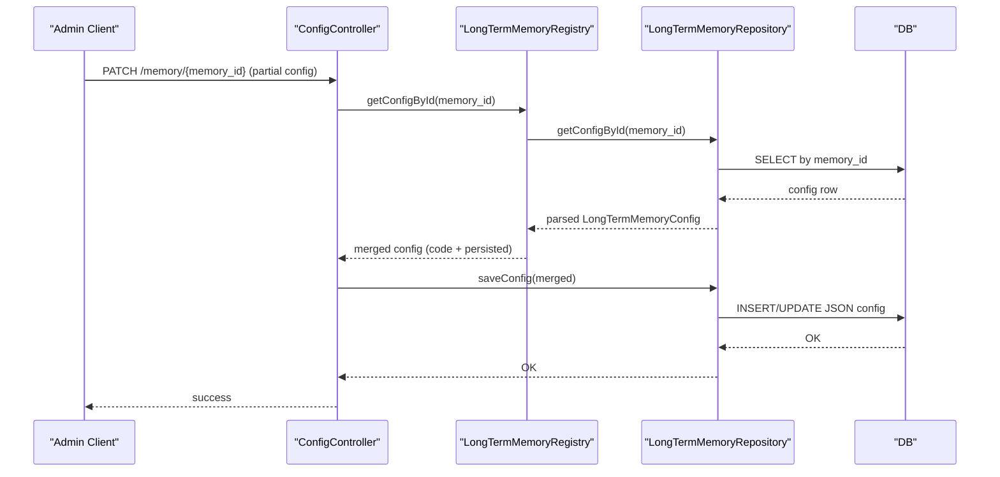
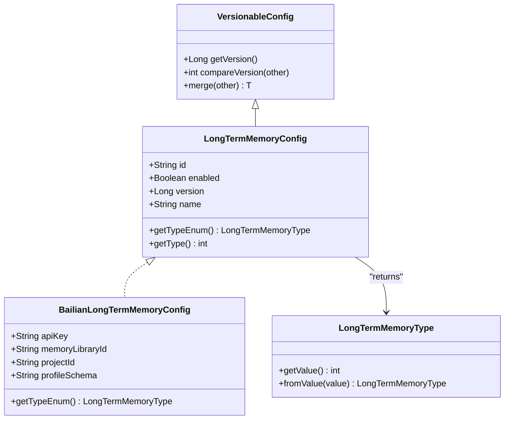
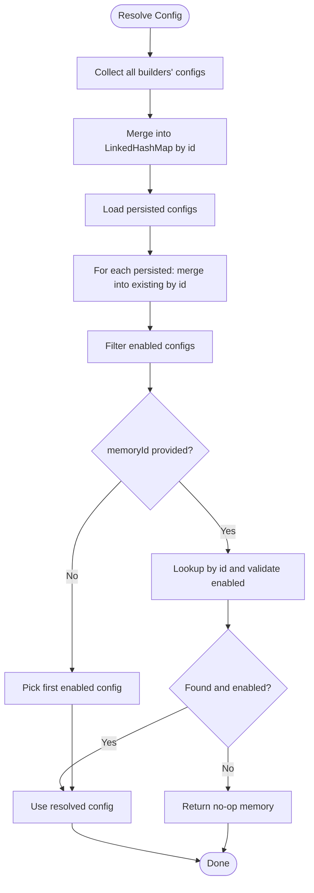
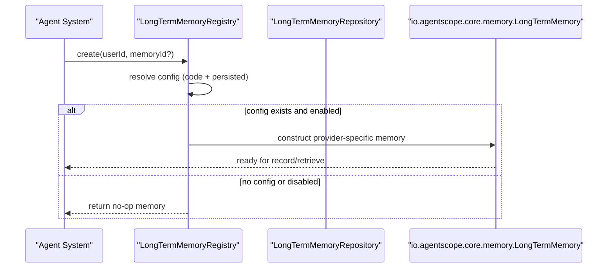
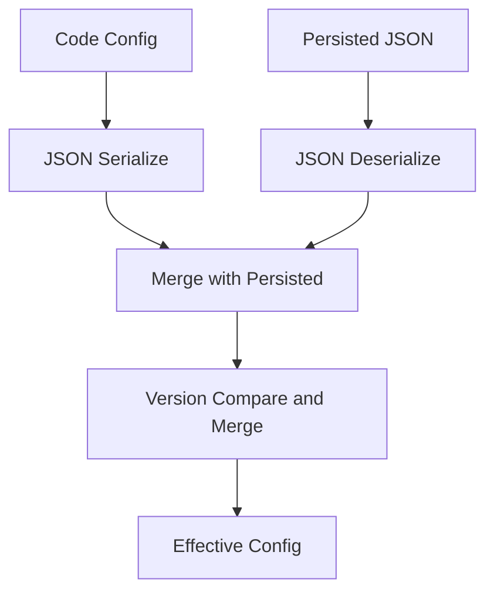
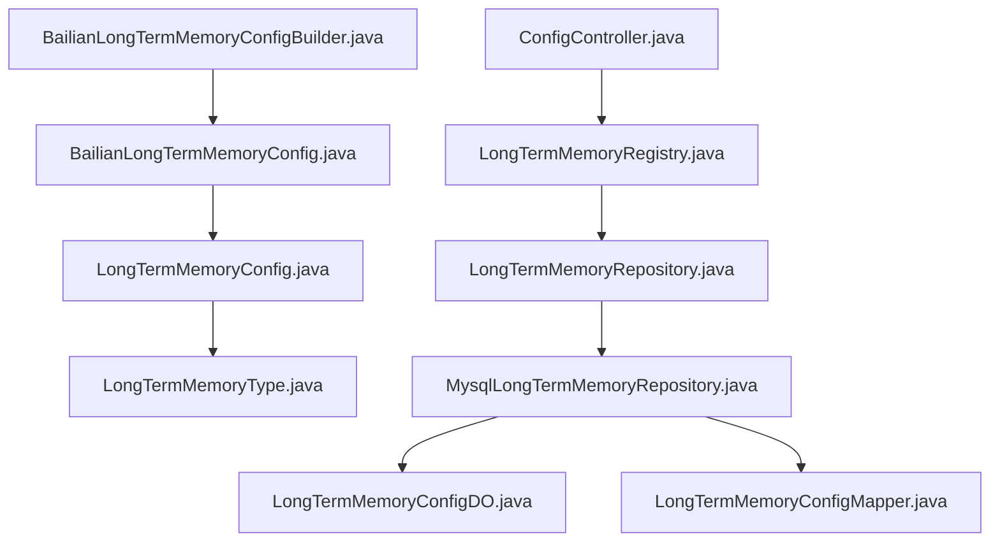

# Custom Memory Provider Development

<cite>
**Referenced Files in This Document**
- [LongTermMemoryConfig.java](file://backend_java/core/src/main/java/com/aliyun/tam/x/tron/core/config/LongTermMemoryConfig.java)
- [LongTermMemoryType.java](file://backend_java/core/src/main/java/com/aliyun/tam/x/tron/core/config/LongTermMemoryType.java)
- [VersionableConfig.java](file://backend_java/core/src/main/java/com/aliyun/tam/x/tron/core/config/VersionableConfig.java)
- [LongTermMemoryConfigBuilder.java](file://backend_java/core/src/main/java/com/aliyun/tam/x/tron/core/mem/LongTermMemoryConfigBuilder.java)
- [LongTermMemoryRegistry.java](file://backend_java/core/src/main/java/com/aliyun/tam/x/tron/core/mem/LongTermMemoryRegistry.java)
- [BailianLongTermMemoryConfig.java](file://backend_java/core/src/main/java/com/aliyun/tam/x/tron/core/config/BailianLongTermMemoryConfig.java)
- [BailianLongTermMemoryConfigBuilder.java](file://backend_java/core/src/main/java/com/aliyun/tam/x/tron/core/mem/BailianLongTermMemoryConfigBuilder.java)
- [LongTermMemoryRepository.java](file://backend_java/core/src/main/java/com/aliyun/tam/x/tron/core/domain/repository/LongTermMemoryRepository.java)
- [MysqlLongTermMemoryRepository.java](file://backend_java/core/src/main/java/com/aliyun/tam/x/tron/core/domain/repository/mysql/MysqlLongTermMemoryRepository.java)
- [LongTermMemoryConfigDO.java](file://backend_java/infra/src/main/java/com/aliyun/tam/x/tron/infra/dal/dataobject/LongTermMemoryConfigDO.java)
- [LongTermMemoryConfigMapper.java](file://backend_java/infra/src/main/java/com/aliyun/tam/x/tron/infra/dal/mapper/LongTermMemoryConfigMapper.java)
- [ConfigController.java](file://backend_java/api/src/main/java/com/aliyun/tam/x/tron/api/ConfigController.java)
- [OssStorageProvider.java](file://backend_java/infra/src/main/java/com/aliyun/tam/x/tron/infra/storage/OssStorageProvider.java)
- [develop_guide.md](file://docs/en/develop_guide.md)
</cite>

## Table of Contents
1. [Introduction](#introduction)
2. [Project Structure](#project-structure)
3. [Core Components](#core-components)
4. [Architecture Overview](#architecture-overview)
5. [Detailed Component Analysis](#detailed-component-analysis)
6. [Dependency Analysis](#dependency-analysis)
7. [Performance Considerations](#performance-considerations)
8. [Troubleshooting Guide](#troubleshooting-guide)
9. [Conclusion](#conclusion)
10. [Appendices](#appendices)

## Introduction
This document explains how to develop custom memory providers for Tron OneAgent. It focuses on the LongTermMemoryConfig abstraction, the LongTermMemoryConfigBuilder pattern, configuration validation and merging via VersionableConfig, and the registry-driven creation and lifecycle of memory instances. It also covers configuration persistence, serialization/deserialization, version compatibility, testing strategies, performance benchmarking, and production deployment considerations. Step-by-step examples show how to implement custom memory providers backed by databases, cloud storage, and other systems.

## Project Structure
The memory subsystem spans configuration models, builders, registry orchestration, persistence, and controller APIs:
- Configuration models define the contract and JSON polymorphism for memory types.
- Builders supply default configurations and bind to externalized settings.
- Registry aggregates configurations from code and persistence, validates and merges them, and creates runtime memory instances.
- Persistence stores and retrieves configurations with JSON serialization and version-aware merging.
- Controllers expose admin APIs to patch and manage memory configurations.

```mermaid
graph TB
subgraph "Config Layer"
LTC["LongTermMemoryConfig.java"]
LTT["LongTermMemoryType.java"]
VCFG["VersionableConfig.java"]
BAILIAN_CFG["BailianLongTermMemoryConfig.java"]
end
subgraph "Builder Layer"
BUILDER_IF["LongTermMemoryConfigBuilder.java"]
BAILIAN_BLD["BailianLongTermMemoryConfigBuilder.java"]
end
subgraph "Registry Layer"
REG["LongTermMemoryRegistry.java"]
end
subgraph "Persistence Layer"
REPO_IF["LongTermMemoryRepository.java"]
MYSQL_REPO["MysqlLongTermMemoryRepository.java"]
DO["LongTermMemoryConfigDO.java"]
MAPPER["LongTermMemoryConfigMapper.java"]
end
subgraph "API Layer"
CTRL["ConfigController.java"]
end
subgraph "Other Providers"
OSS["OssStorageProvider.java"]
end
LTC --> BAILIAN_CFG
LTT --> LTC
VCFG --> LTC
BUILDER_IF --> BAILIAN_BLD
REG --> REPO_IF
REPO_IF --> MYSQL_REPO
MYSQL_REPO --> DO
MYSQL_REPO --> MAPPER
CTRL --> REG
REG --> |"creates"||"io.agentscope.core.memory.LongTermMemory"
REG --> |"supports"| BAILIAN_CFG
OSS -. "storage provider example" .- CTRL
```

**Diagram sources**
- [LongTermMemoryConfig.java:37-54](file://backend_java/core/src/main/java/com/aliyun/tam/x/tron/core/config/LongTermMemoryConfig.java#L37-L54)
- [LongTermMemoryType.java:23-46](file://backend_java/core/src/main/java/com/aliyun/tam/x/tron/core/config/LongTermMemoryType.java#L23-L46)
- [VersionableConfig.java:23-75](file://backend_java/core/src/main/java/com/aliyun/tam/x/tron/core/config/VersionableConfig.java#L23-L75)
- [BailianLongTermMemoryConfig.java:31-45](file://backend_java/core/src/main/java/com/aliyun/tam/x/tron/core/config/BailianLongTermMemoryConfig.java#L31-L45)
- [LongTermMemoryConfigBuilder.java:22-26](file://backend_java/core/src/main/java/com/aliyun/tam/x/tron/core/mem/LongTermMemoryConfigBuilder.java#L22-L26)
- [BailianLongTermMemoryConfigBuilder.java:26-46](file://backend_java/core/src/main/java/com/aliyun/tam/x/tron/core/mem/BailianLongTermMemoryConfigBuilder.java#L26-L46)
- [LongTermMemoryRegistry.java:42-133](file://backend_java/core/src/main/java/com/aliyun/tam/x/tron/core/mem/LongTermMemoryRegistry.java#L42-L133)
- [LongTermMemoryRepository.java:24-33](file://backend_java/core/src/main/java/com/aliyun/tam/x/tron/core/domain/repository/LongTermMemoryRepository.java#L24-L33)
- [MysqlLongTermMemoryRepository.java:34-116](file://backend_java/core/src/main/java/com/aliyun/tam/x/tron/core/domain/repository/mysql/MysqlLongTermMemoryRepository.java#L34-L116)
- [LongTermMemoryConfigDO.java:27-49](file://backend_java/infra/src/main/java/com/aliyun/tam/x/tron/infra/dal/dataobject/LongTermMemoryConfigDO.java#L27-L49)
- [LongTermMemoryConfigMapper.java:25-26](file://backend_java/infra/src/main/java/com/aliyun/tam/x/tron/infra/dal/mapper/LongTermMemoryConfigMapper.java#L25-L26)
- [ConfigController.java:439-472](file://backend_java/api/src/main/java/com/aliyun/tam/x/tron/api/ConfigController.java#L439-L472)
- [OssStorageProvider.java:58-198](file://backend_java/infra/src/main/java/com/aliyun/tam/x/tron/infra/storage/OssStorageProvider.java#L58-L198)

**Section sources**
- [LongTermMemoryConfig.java:37-54](file://backend_java/core/src/main/java/com/aliyun/tam/x/tron/core/config/LongTermMemoryConfig.java#L37-L54)
- [LongTermMemoryRegistry.java:42-133](file://backend_java/core/src/main/java/com/aliyun/tam/x/tron/core/mem/LongTermMemoryRegistry.java#L42-L133)
- [MysqlLongTermMemoryRepository.java:34-116](file://backend_java/core/src/main/java/com/aliyun/tam/x/tron/core/domain/repository/mysql/MysqlLongTermMemoryRepository.java#L34-L116)

## Core Components
- LongTermMemoryConfig: Abstract base for memory configurations with JSON polymorphism, versioning support, and a type accessor.
- LongTermMemoryType: Enumerates supported memory types and supports JSON serialization/deserialization.
- VersionableConfig: Provides version comparison and merge semantics for configurations, including recursive null-field propagation.
- LongTermMemoryConfigBuilder: Interface for building default configurations per provider.
- LongTermMemoryRegistry: Central factory that aggregates, validates, merges, and instantiates memory implementations.
- BailianLongTermMemoryConfig and BailianLongTermMemoryConfigBuilder: Concrete example of a cloud-backed memory provider.
- LongTermMemoryRepository and MysqlLongTermMemoryRepository: Persistence layer for memory configurations.
- ConfigController: Admin API to patch memory configurations at runtime.

Implementation highlights:
- Polymorphic JSON: Uses Jackson annotations to serialize/deserialize by type discriminator.
- Version-aware merge: Ensures newer persisted configs override code defaults when appropriate.
- Runtime selection: Chooses a single enabled configuration per user or by ID.

**Section sources**
- [LongTermMemoryConfig.java:37-54](file://backend_java/core/src/main/java/com/aliyun/tam/x/tron/core/config/LongTermMemoryConfig.java#L37-L54)
- [LongTermMemoryType.java:23-46](file://backend_java/core/src/main/java/com/aliyun/tam/x/tron/core/config/LongTermMemoryType.java#L23-L46)
- [VersionableConfig.java:27-57](file://backend_java/core/src/main/java/com/aliyun/tam/x/tron/core/config/VersionableConfig.java#L27-L57)
- [LongTermMemoryConfigBuilder.java:22-26](file://backend_java/core/src/main/java/com/aliyun/tam/x/tron/core/mem/LongTermMemoryConfigBuilder.java#L22-L26)
- [LongTermMemoryRegistry.java:59-126](file://backend_java/core/src/main/java/com/aliyun/tam/x/tron/core/mem/LongTermMemoryRegistry.java#L59-L126)
- [BailianLongTermMemoryConfig.java:31-45](file://backend_java/core/src/main/java/com/aliyun/tam/x/tron/core/config/BailianLongTermMemoryConfig.java#L31-L45)
- [BailianLongTermMemoryConfigBuilder.java:26-46](file://backend_java/core/src/main/java/com/aliyun/tam/x/tron/core/mem/BailianLongTermMemoryConfigBuilder.java#L26-L46)
- [LongTermMemoryRepository.java:24-33](file://backend_java/core/src/main/java/com/aliyun/tam/x/tron/core/domain/repository/LongTermMemoryRepository.java#L24-L33)
- [MysqlLongTermMemoryRepository.java:42-107](file://backend_java/core/src/main/java/com/aliyun/tam/x/tron/core/domain/repository/mysql/MysqlLongTermMemoryRepository.java#L42-L107)
- [ConfigController.java:439-472](file://backend_java/api/src/main/java/com/aliyun/tam/x/tron/api/ConfigController.java#L439-L472)

## Architecture Overview
The memory provider architecture follows a layered design:
- Configuration layer defines the contract and polymorphic serialization.
- Builder layer supplies default configurations from environment properties.
- Registry layer resolves the effective configuration (code + persisted), validates enablement, and constructs the runtime memory.
- Persistence layer stores configurations as JSON with version metadata.
- API layer exposes admin operations to update configurations.



**Diagram sources**
- [ConfigController.java:439-472](file://backend_java/api/src/main/java/com/aliyun/tam/x/tron/api/ConfigController.java#L439-L472)
- [LongTermMemoryRegistry.java:78-90](file://backend_java/core/src/main/java/com/aliyun/tam/x/tron/core/mem/LongTermMemoryRegistry.java#L78-L90)
- [LongTermMemoryRepository.java:30-31](file://backend_java/core/src/main/java/com/aliyun/tam/x/tron/core/domain/repository/LongTermMemoryRepository.java#L30-L31)
- [MysqlLongTermMemoryRepository.java:88-107](file://backend_java/core/src/main/java/com/aliyun/tam/x/tron/core/domain/repository/mysql/MysqlLongTermMemoryRepository.java#L88-L107)

## Detailed Component Analysis

### LongTermMemoryConfig Abstraction and Implementation Requirements
- Extends VersionableConfig to support version comparisons and merge semantics.
- Declares a type discriminator for JSON polymorphism and binds to a type enum via getTypeEnum().
- Provides shared fields: id, enabled, version, name.
- Implementations must:
  - Define a unique JsonTypeName or JsonSubTypes mapping.
  - Implement getTypeEnum() returning a LongTermMemoryType value.
  - Optionally annotate sensitive fields for encryption if needed by your provider.



**Diagram sources**
- [LongTermMemoryConfig.java:37-54](file://backend_java/core/src/main/java/com/aliyun/tam/x/tron/core/config/LongTermMemoryConfig.java#L37-L54)
- [VersionableConfig.java:23-75](file://backend_java/core/src/main/java/com/aliyun/tam/x/tron/core/config/VersionableConfig.java#L23-L75)
- [BailianLongTermMemoryConfig.java:31-45](file://backend_java/core/src/main/java/com/aliyun/tam/x/tron/core/config/BailianLongTermMemoryConfig.java#L31-L45)
- [LongTermMemoryType.java:23-46](file://backend_java/core/src/main/java/com/aliyun/tam/x/tron/core/config/LongTermMemoryType.java#L23-L46)

**Section sources**
- [LongTermMemoryConfig.java:37-54](file://backend_java/core/src/main/java/com/aliyun/tam/x/tron/core/config/LongTermMemoryConfig.java#L37-L54)
- [VersionableConfig.java:27-57](file://backend_java/core/src/main/java/com/aliyun/tam/x/tron/core/config/VersionableConfig.java#L27-L57)
- [BailianLongTermMemoryConfig.java:31-45](file://backend_java/core/src/main/java/com/aliyun/tam/x/tron/core/config/BailianLongTermMemoryConfig.java#L31-L45)
- [LongTermMemoryType.java:23-46](file://backend_java/core/src/main/java/com/aliyun/tam/x/tron/core/config/LongTermMemoryType.java#L23-L46)

### LongTermMemoryConfigBuilder Pattern and Validation
- Builder interface:
  - getId(): Unique identifier for the memory provider.
  - getConfig(): Returns a fully-formed LongTermMemoryConfig instance.
- Validation and precedence:
  - Registry getConfigs() merges code-provided configs with persisted ones, preferring later entries to override earlier ones.
  - getConfigById(memoryId) merges persisted and code configs, prioritizing persisted overrides.
  - create(userId, memoryId?) selects the first enabled config if memoryId is omitted; otherwise validates enablement and existence.



**Diagram sources**
- [LongTermMemoryRegistry.java:59-126](file://backend_java/core/src/main/java/com/aliyun/tam/x/tron/core/mem/LongTermMemoryRegistry.java#L59-L126)

**Section sources**
- [LongTermMemoryConfigBuilder.java:22-26](file://backend_java/core/src/main/java/com/aliyun/tam/x/tron/core/mem/LongTermMemoryConfigBuilder.java#L22-L26)
- [BailianLongTermMemoryConfigBuilder.java:26-46](file://backend_java/core/src/main/java/com/aliyun/tam/x/tron/core/mem/BailianLongTermMemoryConfigBuilder.java#L26-L46)
- [LongTermMemoryRegistry.java:59-126](file://backend_java/core/src/main/java/com/aliyun/tam/x/tron/core/mem/LongTermMemoryRegistry.java#L59-L126)

### Registration and Integration with the Agent System
- LongTermMemoryRegistry is a Spring component that:
  - Accepts a list of LongTermMemoryConfigBuilder instances.
  - Integrates with LongTermMemoryRepository for persistence.
  - Creates runtime memory instances based on resolved configurations.
- Current supported type: Bailian (cloud) memory; unsupported types throw an argument error during creation.



**Diagram sources**
- [LongTermMemoryRegistry.java:92-133](file://backend_java/core/src/main/java/com/aliyun/tam/x/tron/core/mem/LongTermMemoryRegistry.java#L92-L133)

**Section sources**
- [LongTermMemoryRegistry.java:40-133](file://backend_java/core/src/main/java/com/aliyun/tam/x/tron/core/mem/LongTermMemoryRegistry.java#L40-L133)

### Configuration Serialization, Deserialization, and Version Compatibility
- Serialization:
  - LongTermMemoryConfig uses @JsonTypeInfo and @JsonSubTypes/@JsonTypeName to encode the type discriminator.
  - Persisted JSON is stored as a string in LongTermMemoryConfigDO.config.
- Deserialization:
  - MysqlLongTermMemoryRepository reads JSON and maps it back to LongTermMemoryConfig using an ObjectMapper.
- Version compatibility:
  - VersionableConfig.merge compares versions and merges fields, preserving non-null values from the higher-version config.
  - ConfigController updates version timestamps on patches to ensure proper ordering.



**Diagram sources**
- [LongTermMemoryConfig.java:33-36](file://backend_java/core/src/main/java/com/aliyun/tam/x/tron/core/config/LongTermMemoryConfig.java#L33-L36)
- [BailianLongTermMemoryConfig.java:30-31](file://backend_java/core/src/main/java/com/aliyun/tam/x/tron/core/config/BailianLongTermMemoryConfig.java#L30-L31)
- [MysqlLongTermMemoryRepository.java:73-107](file://backend_java/core/src/main/java/com/aliyun/tam/x/tron/core/domain/repository/mysql/MysqlLongTermMemoryRepository.java#L73-L107)
- [VersionableConfig.java:44-57](file://backend_java/core/src/main/java/com/aliyun/tam/x/tron/core/config/VersionableConfig.java#L44-L57)
- [ConfigController.java:469-470](file://backend_java/api/src/main/java/com/aliyun/tam/x/tron/api/ConfigController.java#L469-L470)

**Section sources**
- [LongTermMemoryConfig.java:33-36](file://backend_java/core/src/main/java/com/aliyun/tam/x/tron/core/config/LongTermMemoryConfig.java#L33-L36)
- [BailianLongTermMemoryConfig.java:30-31](file://backend_java/core/src/main/java/com/aliyun/tam/x/tron/core/config/BailianLongTermMemoryConfig.java#L30-L31)
- [MysqlLongTermMemoryRepository.java:73-107](file://backend_java/core/src/main/java/com/aliyun/tam/x/tron/core/domain/repository/mysql/MysqlLongTermMemoryRepository.java#L73-L107)
- [VersionableConfig.java:44-57](file://backend_java/core/src/main/java/com/aliyun/tam/x/tron/core/config/VersionableConfig.java#L44-L57)
- [ConfigController.java:469-470](file://backend_java/api/src/main/java/com/aliyun/tam/x/tron/api/ConfigController.java#L469-L470)

### Step-by-Step: Implementing a Custom Memory Provider

#### Step 1: Define the Configuration Model
- Create a subclass of LongTermMemoryConfig.
- Annotate with @JsonTypeName or register in @JsonSubTypes of the base class.
- Implement getTypeEnum() to return a LongTermMemoryType value.
- Add provider-specific fields (e.g., connection strings, credentials, indices).

Example references:
- [BailianLongTermMemoryConfig.java:31-45](file://backend_java/core/src/main/java/com/aliyun/tam/x/tron/core/config/BailianLongTermMemoryConfig.java#L31-L45)

#### Step 2: Implement the Builder
- Implement LongTermMemoryConfigBuilder.
- Provide getId() and getConfig() to return a fully-initialized configuration.
- Bind sensitive values from environment properties using @Value.

Example references:
- [BailianLongTermMemoryConfigBuilder.java:26-46](file://backend_java/core/src/main/java/com/aliyun/tam/x/tron/core/mem/BailianLongTermMemoryConfigBuilder.java#L26-L46)

#### Step 3: Integrate with the Registry
- Ensure your builder is a Spring component so it is discovered by LongTermMemoryRegistry.
- The registry will automatically include your builder’s config in getConfigs() and getConfigById().

References:
- [LongTermMemoryRegistry.java:59-90](file://backend_java/core/src/main/java/com/aliyun/tam/x/tron/core/mem/LongTermMemoryRegistry.java#L59-L90)

#### Step 4: Support Runtime Creation
- Extend LongTermMemoryRegistry.createMemory(...) to handle your configuration type.
- Return a LongTermMemory implementation that performs record and retrieve operations.

Note: The current registry only supports Bailian. To add support for your provider, modify the registry to detect your config type and construct the appropriate memory.

References:
- [LongTermMemoryRegistry.java:128-133](file://backend_java/core/src/main/java/com/aliyun/tam/x/tron/core/mem/LongTermMemoryRegistry.java#L128-L133)

#### Step 5: Persist and Patch Configurations
- Use LongTermMemoryRepository to save, list, and delete configurations.
- Use ConfigController to patch configurations at runtime.

References:
- [LongTermMemoryRepository.java:26-32](file://backend_java/core/src/main/java/com/aliyun/tam/x/tron/core/domain/repository/LongTermMemoryRepository.java#L26-L32)
- [MysqlLongTermMemoryRepository.java:42-107](file://backend_java/core/src/main/java/com/aliyun/tam/x/tron/core/domain/repository/mysql/MysqlLongTermMemoryRepository.java#L42-L107)
- [ConfigController.java:439-472](file://backend_java/api/src/main/java/com/aliyun/tam/x/tron/api/ConfigController.java#L439-L472)

#### Step 6: Backend Examples

- Database-backed memory:
  - Store conversation history in a relational table.
  - Use MysqlLongTermMemoryRepository as a template for JSON persistence.
  - Implement record/retrieve using SQL queries and message parsing.

- Cloud storage-backed memory:
  - Use a cloud SDK to persist and retrieve memory artifacts.
  - Example pattern: [OssStorageProvider.java:91-134](file://backend_java/infra/src/main/java/com/aliyun/tam/x/tron/infra/storage/OssStorageProvider.java#L91-L134)

- In-memory or cache-backed memory:
  - Use local caches or lightweight stores for ephemeral memory.
  - Ensure thread-safety and eviction policies.

Reference for a Redis-style memory factory (pattern):
- [develop_guide.md:1707-1755](file://docs/en/develop_guide.md#L1707-L1755)

### Testing Strategies
- Unit tests for builders and repositories:
  - Verify getId() and getConfig() correctness.
  - Verify JSON serialization/deserialization and merge behavior.
- Integration tests:
  - Use ConfigController to patch configurations and confirm persistence.
  - Validate LongTermMemoryRegistry resolution and enablement logic.
- Functional tests:
  - End-to-end tests that exercise record/retrieve flows with real providers.
- Benchmark tests:
  - Measure latency and throughput for record/retrieve operations.
  - Compare different backends (database vs. cloud storage).

References:
- [OneAgentTest.java:51-135](file://backend_java/bootstrap/src/test/java/com/aliyun/tam/x/tron/core/OneAgentTest.java#L51-L135)

**Section sources**
- [MysqlLongTermMemoryRepository.java:42-107](file://backend_java/core/src/main/java/com/aliyun/tam/x/tron/core/domain/repository/mysql/MysqlLongTermMemoryRepository.java#L42-L107)
- [ConfigController.java:439-472](file://backend_java/api/src/main/java/com/aliyun/tam/x/tron/api/ConfigController.java#L439-L472)
- [OneAgentTest.java:51-135](file://backend_java/bootstrap/src/test/java/com/aliyun/tam/x/tron/core/OneAgentTest.java#L51-L135)

### Performance Considerations
- Minimize network calls in record/retrieve:
  - Batch writes when possible.
  - Use caching for frequent retrievals.
- Optimize JSON serialization/deserialization:
  - Reuse ObjectMapper instances.
  - Avoid unnecessary conversions.
- Database tuning:
  - Index memory_id and timestamps.
  - Use connection pooling and timeouts.
- Cloud provider tuning:
  - Configure retry/backoff and timeouts.
  - Use pre-signed URLs for downloads where applicable.

[No sources needed since this section provides general guidance]

### Troubleshooting Guide
- No memory returned:
  - Ensure at least one enabled configuration exists.
  - Check LongTermMemoryRegistry logs for warnings about missing/disabled configs.
- Unsupported type error:
  - Confirm your configuration subtype is registered in the base class polymorphism.
- Serialization errors:
  - Validate JSON shape and required fields.
  - Ensure ObjectMapper is configured consistently.
- Permission or credential issues:
  - Verify environment properties and encryption handling.
- Monitoring:
  - Enable SLF4J logging in registry and repository layers.
  - Track latency metrics for record/retrieve operations.

**Section sources**
- [LongTermMemoryRegistry.java:101-124](file://backend_java/core/src/main/java/com/aliyun/tam/x/tron/core/mem/LongTermMemoryRegistry.java#L101-L124)
- [MysqlLongTermMemoryRepository.java:67-84](file://backend_java/core/src/main/java/com/aliyun/tam/x/tron/core/domain/repository/mysql/MysqlLongTermMemoryRepository.java#L67-L84)

### Conclusion
To implement a custom memory provider in Tron OneAgent:
- Define a configuration model extending LongTermMemoryConfig with proper JSON polymorphism.
- Implement a builder to supply defaults and bind to environment properties.
- Integrate with LongTermMemoryRegistry by registering your builder as a Spring component.
- Persist configurations via LongTermMemoryRepository and patch them through ConfigController.
- Extend the registry to support your provider type and implement record/retrieve operations.
- Apply robust testing, performance tuning, and monitoring practices for production readiness.

[No sources needed since this section summarizes without analyzing specific files]

## Dependency Analysis
The following diagram shows key dependencies among memory-related components:



**Diagram sources**
- [BailianLongTermMemoryConfigBuilder.java:26-46](file://backend_java/core/src/main/java/com/aliyun/tam/x/tron/core/mem/BailianLongTermMemoryConfigBuilder.java#L26-L46)
- [BailianLongTermMemoryConfig.java:31-45](file://backend_java/core/src/main/java/com/aliyun/tam/x/tron/core/config/BailianLongTermMemoryConfig.java#L31-L45)
- [LongTermMemoryConfig.java:37-54](file://backend_java/core/src/main/java/com/aliyun/tam/x/tron/core/config/LongTermMemoryConfig.java#L37-L54)
- [LongTermMemoryType.java:23-46](file://backend_java/core/src/main/java/com/aliyun/tam/x/tron/core/config/LongTermMemoryType.java#L23-L46)
- [LongTermMemoryRegistry.java:42-57](file://backend_java/core/src/main/java/com/aliyun/tam/x/tron/core/mem/LongTermMemoryRegistry.java#L42-L57)
- [LongTermMemoryRepository.java:24-33](file://backend_java/core/src/main/java/com/aliyun/tam/x/tron/core/domain/repository/LongTermMemoryRepository.java#L24-L33)
- [MysqlLongTermMemoryRepository.java:34-116](file://backend_java/core/src/main/java/com/aliyun/tam/x/tron/core/domain/repository/mysql/MysqlLongTermMemoryRepository.java#L34-L116)
- [LongTermMemoryConfigDO.java:27-49](file://backend_java/infra/src/main/java/com/aliyun/tam/x/tron/infra/dal/dataobject/LongTermMemoryConfigDO.java#L27-L49)
- [LongTermMemoryConfigMapper.java:25-26](file://backend_java/infra/src/main/java/com/aliyun/tam/x/tron/infra/dal/mapper/LongTermMemoryConfigMapper.java#L25-L26)
- [ConfigController.java:439-472](file://backend_java/api/src/main/java/com/aliyun/tam/x/tron/api/ConfigController.java#L439-L472)

**Section sources**
- [LongTermMemoryRegistry.java:42-133](file://backend_java/core/src/main/java/com/aliyun/tam/x/tron/core/mem/LongTermMemoryRegistry.java#L42-L133)
- [MysqlLongTermMemoryRepository.java:34-116](file://backend_java/core/src/main/java/com/aliyun/tam/x/tron/core/domain/repository/mysql/MysqlLongTermMemoryRepository.java#L34-L116)

## Performance Considerations
- Minimize round-trips to external systems in record/retrieve.
- Use batching and asynchronous operations where possible.
- Cache frequently accessed data and invalidate on write.
- Tune database and cloud provider timeouts and retry policies.
- Monitor latency and throughput; instrument record/retrieve paths.

[No sources needed since this section provides general guidance]

## Troubleshooting Guide
- Missing or disabled configuration:
  - Verify enabled flag and presence in getConfigs()/getConfigById().
- Unsupported type:
  - Ensure subtype is registered in JSON polymorphism.
- Serialization failures:
  - Validate JSON schema and ObjectMapper configuration.
- Credential and permission issues:
  - Confirm environment properties and encryption handling.

**Section sources**
- [LongTermMemoryRegistry.java:101-124](file://backend_java/core/src/main/java/com/aliyun/tam/x/tron/core/mem/LongTermMemoryRegistry.java#L101-L124)
- [MysqlLongTermMemoryRepository.java:67-84](file://backend_java/core/src/main/java/com/aliyun/tam/x/tron/core/domain/repository/mysql/MysqlLongTermMemoryRepository.java#L67-L84)

## Conclusion
By following the patterns established in the codebase—configuration abstraction, builder pattern, registry orchestration, persistence, and admin APIs—you can implement robust, production-ready custom memory providers for Tron OneAgent. Ensure strong testing, performance tuning, and monitoring to maintain reliability and scalability.

[No sources needed since this section summarizes without analyzing specific files]

## Appendices

### Appendix A: Example References
- Redis-style memory factory (pattern):
  - [develop_guide.md:1707-1755](file://docs/en/develop_guide.md#L1707-L1755)
- Cloud storage provider (pattern):
  - [OssStorageProvider.java:91-134](file://backend_java/infra/src/main/java/com/aliyun/tam/x/tron/infra/storage/OssStorageProvider.java#L91-L134)

**Section sources**
- [develop_guide.md:1707-1755](file://docs/en/develop_guide.md#L1707-L1755)
- [OssStorageProvider.java:91-134](file://backend_java/infra/src/main/java/com/aliyun/tam/x/tron/infra/storage/OssStorageProvider.java#L91-L134)