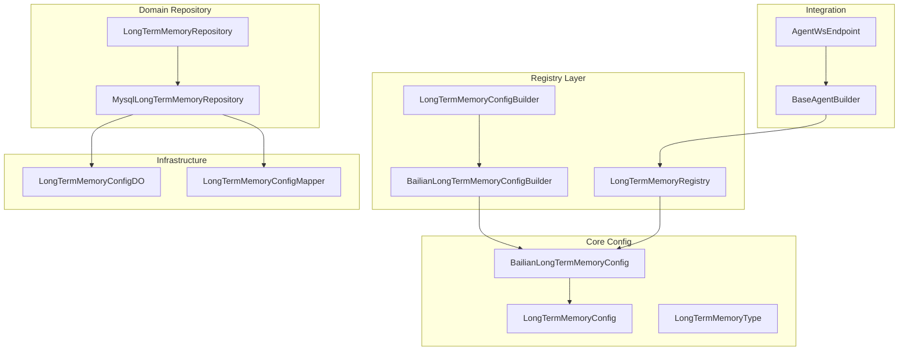
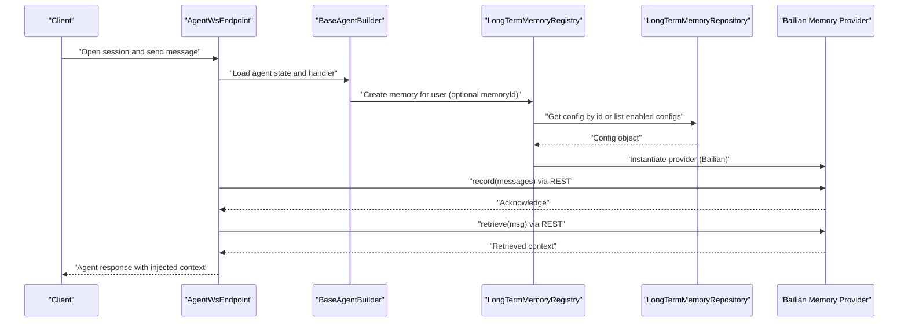
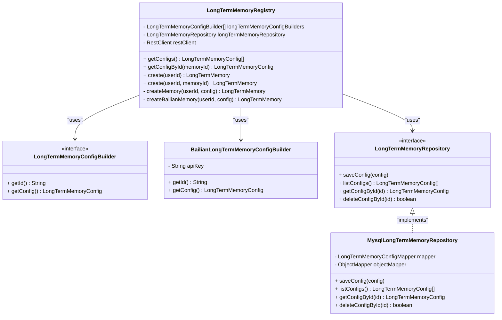
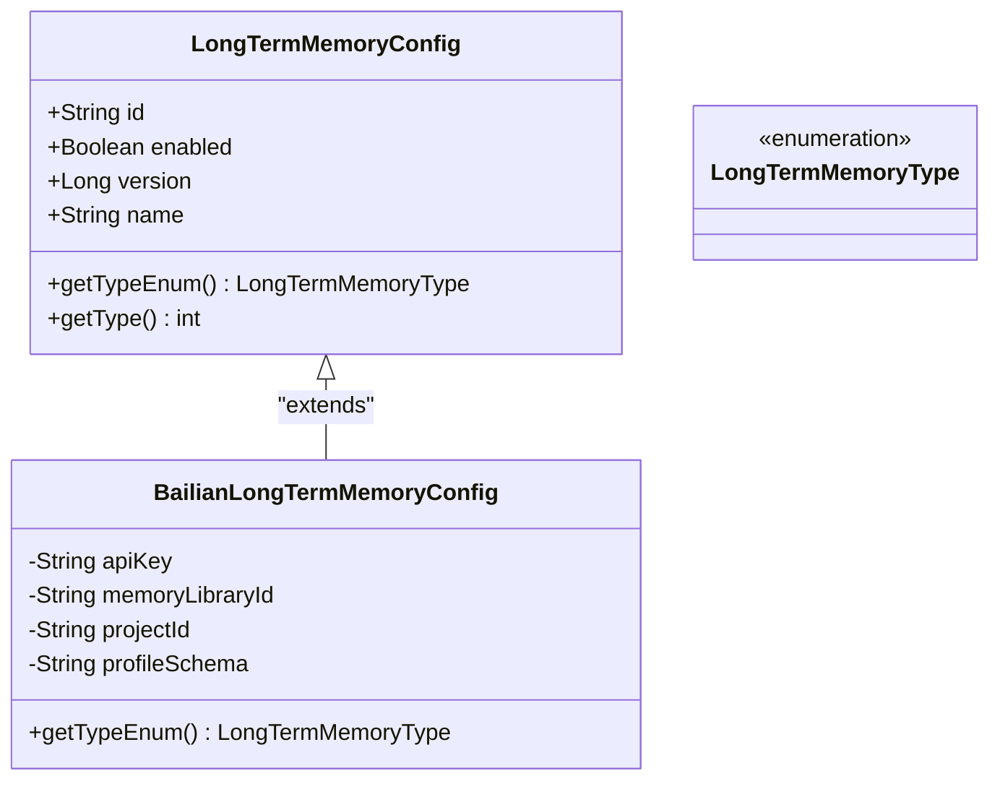
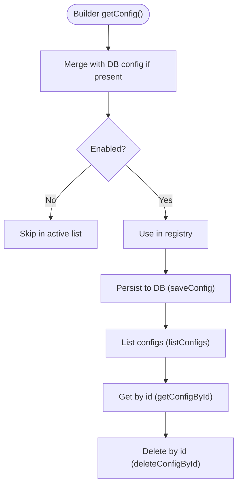
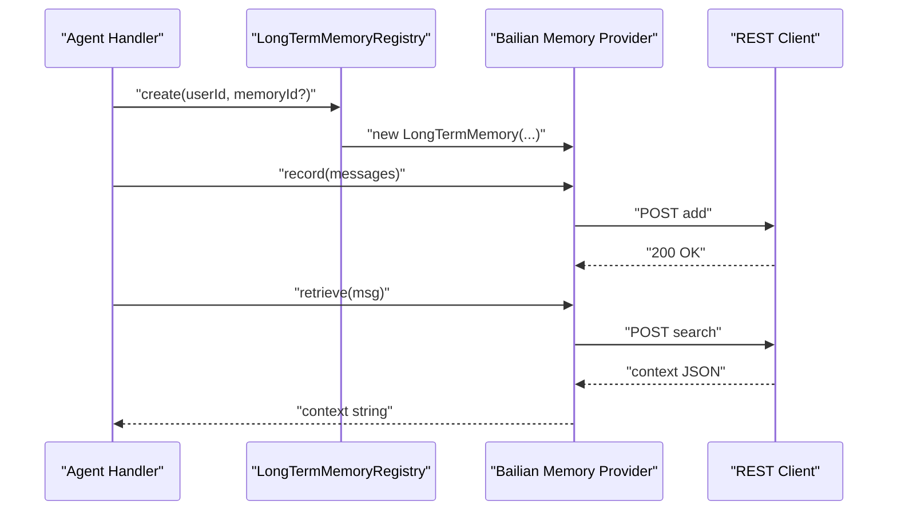
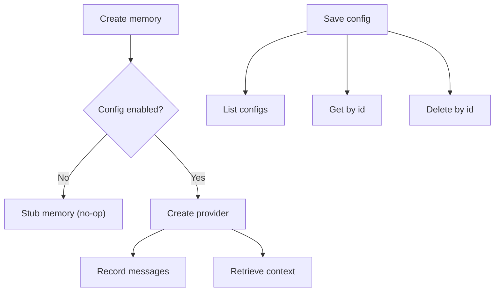
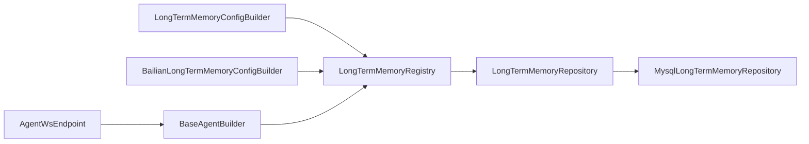

# Long-term Memory System

<cite>
**Referenced Files in This Document**
- [LongTermMemoryRegistry.java](file://backend_java/core/src/main/java/com/aliyun/tam/x/tron/core/mem/LongTermMemoryRegistry.java)
- [LongTermMemoryConfigBuilder.java](file://backend_java/core/src/main/java/com/aliyun/tam/x/tron/core/mem/LongTermMemoryConfigBuilder.java)
- [BailianLongTermMemoryConfigBuilder.java](file://backend_java/core/src/main/java/com/aliyun/tam/x/tron/core/mem/BailianLongTermMemoryConfigBuilder.java)
- [LongTermMemoryConfig.java](file://backend_java/core/src/main/java/com/aliyun/tam/x/tron/core/config/LongTermMemoryConfig.java)
- [BailianLongTermMemoryConfig.java](file://backend_java/core/src/main/java/com/aliyun/tam/x/tron/core/config/BailianLongTermMemoryConfig.java)
- [LongTermMemoryType.java](file://backend_java/core/src/main/java/com/aliyun/tam/x/tron/core/config/LongTermMemoryType.java)
- [LongTermMemoryRepository.java](file://backend_java/core/src/main/java/com/aliyun/tam/x/tron/core/domain/repository/LongTermMemoryRepository.java)
- [MysqlLongTermMemoryRepository.java](file://backend_java/core/src/main/java/com/aliyun/tam/x/tron/core/domain/repository/mysql/MysqlLongTermMemoryRepository.java)
- [LongTermMemoryConfigDO.java](file://backend_java/infra/src/main/java/com/aliyun/tam/x/tron/infra/dal/dataobject/LongTermMemoryConfigDO.java)
- [LongTermMemoryConfigMapper.java](file://backend_java/infra/src/main/java/com/aliyun/tam/x/tron/infra/dal/mapper/LongTermMemoryConfigMapper.java)
- [BaseAgentBuilder.java](file://backend_java/core/src/main/java/com/aliyun/tam/x/tron/core/agents/BaseAgentBuilder.java)
- [AgentWsEndpoint.java](file://backend_java/api/src/main/java/com/aliyun/tam/x/tron/ws/AgentWsEndpoint.java)
- [EncryptUtils.java](file://backend_java/utils/src/main/java/com/aliyun/tam/x/tron/utils/encrypt/EncryptUtils.java)
- [Encrypted.java](file://backend_java/utils/src/main/java/com/aliyun/tam/x/tron/utils/encrypt/Encrypted.java)
- [EncryptedSerializer.java](file://backend_java/utils/src/main/java/com/aliyun/tam/x/tron/utils/encrypt/EncryptedSerializer.java)
- [EncryptedDeserializer.java](file://backend_java/utils/src/main/java/com/aliyun/tam/x/tron/utils/encrypt/EncryptedDeserializer.java)
</cite>

## Table of Contents
1. [Introduction](#introduction)
2. [Project Structure](#project-structure)
3. [Core Components](#core-components)
4. [Architecture Overview](#architecture-overview)
5. [Detailed Component Analysis](#detailed-component-analysis)
6. [Dependency Analysis](#dependency-analysis)
7. [Performance Considerations](#performance-considerations)
8. [Troubleshooting Guide](#troubleshooting-guide)
9. [Conclusion](#conclusion)
10. [Appendices](#appendices)

## Introduction
This document explains the long-term memory system in Tron OneAgent, focusing on how conversational context is maintained across sessions and how personalization is enabled through persistent memory. It covers the LongTermMemoryRegistry, configuration builders, Bailian integration, memory types, storage strategies, retrieval mechanisms, context injection patterns, lifecycle management, privacy considerations, performance optimization, and integration with session management and agent reasoning loops.

## Project Structure
The long-term memory system spans configuration, registry, repository, and infrastructure layers:
- Configuration models define memory provider types and their properties.
- Registry resolves and instantiates memory providers based on configuration.
- Repository persists and retrieves memory configurations.
- Infrastructure provides MySQL-backed persistence for configuration objects.
- Encryption utilities protect sensitive fields like API keys.

**Diagram sources**
- [LongTermMemoryConfig.java:37-54](file://backend_java/core/src/main/java/com/aliyun/tam/x/tron/core/config/LongTermMemoryConfig.java#L37-L54)
- [BailianLongTermMemoryConfig.java:31-45](file://backend_java/core/src/main/java/com/aliyun/tam/x/tron/core/config/BailianLongTermMemoryConfig.java#L31-L45)
- [LongTermMemoryType.java:23-46](file://backend_java/core/src/main/java/com/aliyun/tam/x/tron/core/config/LongTermMemoryType.java#L23-L46)
- [LongTermMemoryConfigBuilder.java:22-26](file://backend_java/core/src/main/java/com/aliyun/tam/x/tron/core/mem/LongTermMemoryConfigBuilder.java#L22-L26)
- [BailianLongTermMemoryConfigBuilder.java:26-46](file://backend_java/core/src/main/java/com/aliyun/tam/x/tron/core/mem/BailianLongTermMemoryConfigBuilder.java#L26-L46)
- [LongTermMemoryRegistry.java:42-133](file://backend_java/core/src/main/java/com/aliyun/tam/x/tron/core/mem/LongTermMemoryRegistry.java#L42-L133)
- [LongTermMemoryRepository.java:24-33](file://backend_java/core/src/main/java/com/aliyun/tam/x/tron/core/domain/repository/LongTermMemoryRepository.java#L24-L33)
- [MysqlLongTermMemoryRepository.java:34-116](file://backend_java/core/src/main/java/com/aliyun/tam/x/tron/core/domain/repository/mysql/MysqlLongTermMemoryRepository.java#L34-L116)
- [LongTermMemoryConfigDO.java:27-49](file://backend_java/infra/src/main/java/com/aliyun/tam/x/tron/infra/dal/dataobject/LongTermMemoryConfigDO.java#L27-L49)
- [LongTermMemoryConfigMapper.java:24-26](file://backend_java/infra/src/main/java/com/aliyun/tam/x/tron/infra/dal/mapper/LongTermMemoryConfigMapper.java#L24-L26)
- [BaseAgentBuilder.java:170-180](file://backend_java/core/src/main/java/com/aliyun/tam/x/tron/core/agents/BaseAgentBuilder.java#L170-L180)
- [AgentWsEndpoint.java:130-136](file://backend_java/api/src/main/java/com/aliyun/tam/x/tron/ws/AgentWsEndpoint.java#L130-L136)

**Section sources**
- [LongTermMemoryRegistry.java:42-133](file://backend_java/core/src/main/java/com/aliyun/tam/x/tron/core/mem/LongTermMemoryRegistry.java#L42-L133)
- [LongTermMemoryConfig.java:37-54](file://backend_java/core/src/main/java/com/aliyun/tam/x/tron/core/config/LongTermMemoryConfig.java#L37-L54)
- [BailianLongTermMemoryConfig.java:31-45](file://backend_java/core/src/main/java/com/aliyun/tam/x/tron/core/config/BailianLongTermMemoryConfig.java#L31-L45)
- [LongTermMemoryRepository.java:24-33](file://backend_java/core/src/main/java/com/aliyun/tam/x/tron/core/domain/repository/LongTermMemoryRepository.java#L24-L33)
- [MysqlLongTermMemoryRepository.java:34-116](file://backend_java/core/src/main/java/com/aliyun/tam/x/tron/core/domain/repository/mysql/MysqlLongTermMemoryRepository.java#L34-L116)
- [LongTermMemoryConfigDO.java:27-49](file://backend_java/infra/src/main/java/com/aliyun/tam/x/tron/infra/dal/dataobject/LongTermMemoryConfigDO.java#L27-L49)
- [LongTermMemoryConfigMapper.java:24-26](file://backend_java/infra/src/main/java/com/aliyun/tam/x/tron/infra/dal/mapper/LongTermMemoryConfigMapper.java#L24-L26)
- [BaseAgentBuilder.java:170-180](file://backend_java/core/src/main/java/com/aliyun/tam/x/tron/core/agents/BaseAgentBuilder.java#L170-L180)
- [AgentWsEndpoint.java:130-136](file://backend_java/api/src/main/java/com/aliyun/tam/x/tron/ws/AgentWsEndpoint.java#L130-L136)

## Core Components
- Long-term memory configuration model: Defines identity, enablement, versioning, and type discriminator for memory providers.
- Bailian memory configuration: Extends base configuration with provider-specific fields such as API key, memory library ID, project ID, and profile schema.
- Memory registry: Resolves active memory configuration and creates provider instances, currently supporting Bailian.
- Memory repository: Persists and retrieves memory configurations to/from MySQL.
- Configuration builders: Provide programmatic configuration for memory providers, including default values and environment-driven overrides.
- Encryption utilities: Protect sensitive fields like API keys during serialization/deserialization.

Key responsibilities:
- Configuration discovery and merging from code and database.
- Provider instantiation and lifecycle management.
- Secure handling of credentials.
- Persistence and retrieval of configuration metadata.

**Section sources**
- [LongTermMemoryConfig.java:37-54](file://backend_java/core/src/main/java/com/aliyun/tam/x/tron/core/config/LongTermMemoryConfig.java#L37-L54)
- [BailianLongTermMemoryConfig.java:31-45](file://backend_java/core/src/main/java/com/aliyun/tam/x/tron/core/config/BailianLongTermMemoryConfig.java#L31-L45)
- [LongTermMemoryRegistry.java:59-90](file://backend_java/core/src/main/java/com/aliyun/tam/x/tron/core/mem/LongTermMemoryRegistry.java#L59-L90)
- [LongTermMemoryRepository.java:24-33](file://backend_java/core/src/main/java/com/aliyun/tam/x/tron/core/domain/repository/LongTermMemoryRepository.java#L24-L33)
- [MysqlLongTermMemoryRepository.java:42-115](file://backend_java/core/src/main/java/com/aliyun/tam/x/tron/core/domain/repository/mysql/MysqlLongTermMemoryRepository.java#L42-L115)
- [LongTermMemoryConfigBuilder.java:22-26](file://backend_java/core/src/main/java/com/aliyun/tam/x/tron/core/mem/LongTermMemoryConfigBuilder.java#L22-L26)
- [BailianLongTermMemoryConfigBuilder.java:26-46](file://backend_java/core/src/main/java/com/aliyun/tam/x/tron/core/mem/BailianLongTermMemoryConfigBuilder.java#L26-L46)
- [EncryptUtils.java](file://backend_java/utils/src/main/java/com/aliyun/tam/x/tron/utils/encrypt/EncryptUtils.java)
- [Encrypted.java](file://backend_java/utils/src/main/java/com/aliyun/tam/x/tron/utils/encrypt/Encrypted.java)
- [EncryptedSerializer.java](file://backend_java/utils/src/main/java/com/aliyun/tam/x/tron/utils/encrypt/EncryptedSerializer.java)
- [EncryptedDeserializer.java](file://backend_java/utils/src/main/java/com/aliyun/tam/x/tron/utils/encrypt/EncryptedDeserializer.java)

## Architecture Overview
The system integrates configuration, registry, and provider layers with session management and agent processing.

**Diagram sources**
- [AgentWsEndpoint.java:130-136](file://backend_java/api/src/main/java/com/aliyun/tam/x/tron/ws/AgentWsEndpoint.java#L130-L136)
- [BaseAgentBuilder.java:170-180](file://backend_java/core/src/main/java/com/aliyun/tam/x/tron/core/agents/BaseAgentBuilder.java#L170-L180)
- [LongTermMemoryRegistry.java:96-126](file://backend_java/core/src/main/java/com/aliyun/tam/x/tron/core/mem/LongTermMemoryRegistry.java#L96-L126)
- [LongTermMemoryRepository.java:24-33](file://backend_java/core/src/main/java/com/aliyun/tam/x/tron/core/domain/repository/LongTermMemoryRepository.java#L24-L33)
- [MysqlLongTermMemoryRepository.java:88-107](file://backend_java/core/src/main/java/com/aliyun/tam/x/tron/core/domain/repository/mysql/MysqlLongTermMemoryRepository.java#L88-L107)

## Detailed Component Analysis

### Long-term Memory Registry
The registry orchestrates configuration resolution and provider creation:
- Collects configurations from builders and merges with persisted configs.
- Supports explicit memory selection by ID or automatic selection of the first enabled configuration.
- Creates provider instances based on configuration type (currently Bailian).
- Provides stub implementations when no configuration is available.

**Diagram sources**
- [LongTermMemoryRegistry.java:42-133](file://backend_java/core/src/main/java/com/aliyun/tam/x/tron/core/mem/LongTermMemoryRegistry.java#L42-L133)
- [LongTermMemoryConfigBuilder.java:22-26](file://backend_java/core/src/main/java/com/aliyun/tam/x/tron/core/mem/LongTermMemoryConfigBuilder.java#L22-L26)
- [BailianLongTermMemoryConfigBuilder.java:26-46](file://backend_java/core/src/main/java/com/aliyun/tam/x/tron/core/mem/BailianLongTermMemoryConfigBuilder.java#L26-L46)
- [LongTermMemoryRepository.java:24-33](file://backend_java/core/src/main/java/com/aliyun/tam/x/tron/core/domain/repository/LongTermMemoryRepository.java#L24-L33)
- [MysqlLongTermMemoryRepository.java:34-116](file://backend_java/core/src/main/java/com/aliyun/tam/x/tron/core/domain/repository/mysql/MysqlLongTermMemoryRepository.java#L34-L116)

**Section sources**
- [LongTermMemoryRegistry.java:59-126](file://backend_java/core/src/main/java/com/aliyun/tam/x/tron/core/mem/LongTermMemoryRegistry.java#L59-L126)

### Memory Types and Providers
- Base configuration supports a type discriminator and JSON polymorphism for provider-specific subclasses.
- Bailian provider configuration includes API key, memory library ID, project ID, and profile schema.
- Type enumeration defines supported provider types.

**Diagram sources**
- [LongTermMemoryConfig.java:37-54](file://backend_java/core/src/main/java/com/aliyun/tam/x/tron/core/config/LongTermMemoryConfig.java#L37-L54)
- [BailianLongTermMemoryConfig.java:31-45](file://backend_java/core/src/main/java/com/aliyun/tam/x/tron/core/config/BailianLongTermMemoryConfig.java#L31-L45)
- [LongTermMemoryType.java:23-46](file://backend_java/core/src/main/java/com/aliyun/tam/x/tron/core/config/LongTermMemoryType.java#L23-L46)

**Section sources**
- [LongTermMemoryConfig.java:37-54](file://backend_java/core/src/main/java/com/aliyun/tam/x/tron/core/config/LongTermMemoryConfig.java#L37-L54)
- [BailianLongTermMemoryConfig.java:31-45](file://backend_java/core/src/main/java/com/aliyun/tam/x/tron/core/config/BailianLongTermMemoryConfig.java#L31-L45)
- [LongTermMemoryType.java:23-46](file://backend_java/core/src/main/java/com/aliyun/tam/x/tron/core/config/LongTermMemoryType.java#L23-L46)

### Configuration Builders and Persistence
- Programmatic builders supply default values and environment-driven overrides.
- Database-backed repository persists configuration JSON with enablement flag and metadata.
- Mapper and DO define the schema for storing memory configurations.

**Diagram sources**
- [BailianLongTermMemoryConfigBuilder.java:36-46](file://backend_java/core/src/main/java/com/aliyun/tam/x/tron/core/mem/BailianLongTermMemoryConfigBuilder.java#L36-L46)
- [LongTermMemoryRepository.java:24-33](file://backend_java/core/src/main/java/com/aliyun/tam/x/tron/core/domain/repository/LongTermMemoryRepository.java#L24-L33)
- [MysqlLongTermMemoryRepository.java:42-115](file://backend_java/core/src/main/java/com/aliyun/tam/x/tron/core/domain/repository/mysql/MysqlLongTermMemoryRepository.java#L42-L115)
- [LongTermMemoryConfigDO.java:27-49](file://backend_java/infra/src/main/java/com/aliyun/tam/x/tron/infra/dal/dataobject/LongTermMemoryConfigDO.java#L27-L49)
- [LongTermMemoryConfigMapper.java:24-26](file://backend_java/infra/src/main/java/com/aliyun/tam/x/tron/infra/dal/mapper/LongTermMemoryConfigMapper.java#L24-L26)

**Section sources**
- [BailianLongTermMemoryConfigBuilder.java:26-46](file://backend_java/core/src/main/java/com/aliyun/tam/x/tron/core/mem/BailianLongTermMemoryConfigBuilder.java#L26-L46)
- [LongTermMemoryRepository.java:24-33](file://backend_java/core/src/main/java/com/aliyun/tam/x/tron/core/domain/repository/LongTermMemoryRepository.java#L24-L33)
- [MysqlLongTermMemoryRepository.java:42-115](file://backend_java/core/src/main/java/com/aliyun/tam/x/tron/core/domain/repository/mysql/MysqlLongTermMemoryRepository.java#L42-L115)
- [LongTermMemoryConfigDO.java:27-49](file://backend_java/infra/src/main/java/com/aliyun/tam/x/tron/infra/dal/dataobject/LongTermMemoryConfigDO.java#L27-L49)
- [LongTermMemoryConfigMapper.java:24-26](file://backend_java/infra/src/main/java/com/aliyun/tam/x/tron/infra/dal/mapper/LongTermMemoryConfigMapper.java#L24-L26)

### Retrieval and Record Flows
- Record: Sends conversation messages to the provider’s ingestion endpoint.
- Retrieve: Queries the provider for relevant memory nodes based on the current message.

**Diagram sources**
- [LongTermMemoryRegistry.java:128-167](file://backend_java/core/src/main/java/com/aliyun/tam/x/tron/core/mem/LongTermMemoryRegistry.java#L128-L167)

**Section sources**
- [LongTermMemoryRegistry.java:128-167](file://backend_java/core/src/main/java/com/aliyun/tam/x/tron/core/mem/LongTermMemoryRegistry.java#L128-L167)

### Memory Lifecycle Management
- Creation: Resolved by registry based on configuration enablement and optional ID.
- Persistence: Saved to database via repository; merged with code-defined defaults.
- Cleanup: Deletion supported by repository; no automatic aging policy is implemented in the referenced code.

**Diagram sources**
- [LongTermMemoryRegistry.java:96-126](file://backend_java/core/src/main/java/com/aliyun/tam/x/tron/core/mem/LongTermMemoryRegistry.java#L96-L126)
- [LongTermMemoryRepository.java:24-33](file://backend_java/core/src/main/java/com/aliyun/tam/x/tron/core/domain/repository/LongTermMemoryRepository.java#L24-L33)
- [MysqlLongTermMemoryRepository.java:42-115](file://backend_java/core/src/main/java/com/aliyun/tam/x/tron/core/domain/repository/mysql/MysqlLongTermMemoryRepository.java#L42-L115)

**Section sources**
- [LongTermMemoryRegistry.java:96-126](file://backend_java/core/src/main/java/com/aliyun/tam/x/tron/core/mem/LongTermMemoryRegistry.java#L96-L126)
- [LongTermMemoryRepository.java:24-33](file://backend_java/core/src/main/java/com/aliyun/tam/x/tron/core/domain/repository/LongTermMemoryRepository.java#L24-L33)
- [MysqlLongTermMemoryRepository.java:42-115](file://backend_java/core/src/main/java/com/aliyun/tam/x/tron/core/domain/repository/mysql/MysqlLongTermMemoryRepository.java#L42-L115)

### Privacy and Security Considerations
- Sensitive fields (e.g., API key) are annotated for encryption and serialized/deserialized securely.
- Encryption utilities ensure secrets are not exposed in logs or configuration stores.

**Section sources**
- [BailianLongTermMemoryConfig.java:33-34](file://backend_java/core/src/main/java/com/aliyun/tam/x/tron/core/config/BailianLongTermMemoryConfig.java#L33-L34)
- [EncryptUtils.java](file://backend_java/utils/src/main/java/com/aliyun/tam/x/tron/utils/encrypt/EncryptUtils.java)
- [Encrypted.java](file://backend_java/utils/src/main/java/com/aliyun/tam/x/tron/utils/encrypt/Encrypted.java)
- [EncryptedSerializer.java](file://backend_java/utils/src/main/java/com/aliyun/tam/x/tron/utils/encrypt/EncryptedSerializer.java)
- [EncryptedDeserializer.java](file://backend_java/utils/src/main/java/com/aliyun/tam/x/tron/utils/encrypt/EncryptedDeserializer.java)

## Dependency Analysis
The registry depends on builders and repository, while the agent builder integrates the registry into the runtime. The web socket endpoint coordinates session lifecycle and agent execution.

**Diagram sources**
- [LongTermMemoryRegistry.java:42-57](file://backend_java/core/src/main/java/com/aliyun/tam/x/tron/core/mem/LongTermMemoryRegistry.java#L42-L57)
- [LongTermMemoryConfigBuilder.java:22-26](file://backend_java/core/src/main/java/com/aliyun/tam/x/tron/core/mem/LongTermMemoryConfigBuilder.java#L22-L26)
- [BailianLongTermMemoryConfigBuilder.java:26-46](file://backend_java/core/src/main/java/com/aliyun/tam/x/tron/core/mem/BailianLongTermMemoryConfigBuilder.java#L26-L46)
- [LongTermMemoryRepository.java:24-33](file://backend_java/core/src/main/java/com/aliyun/tam/x/tron/core/domain/repository/LongTermMemoryRepository.java#L24-L33)
- [MysqlLongTermMemoryRepository.java:34-116](file://backend_java/core/src/main/java/com/aliyun/tam/x/tron/core/domain/repository/mysql/MysqlLongTermMemoryRepository.java#L34-L116)
- [BaseAgentBuilder.java:170-180](file://backend_java/core/src/main/java/com/aliyun/tam/x/tron/core/agents/BaseAgentBuilder.java#L170-L180)
- [AgentWsEndpoint.java:130-136](file://backend_java/api/src/main/java/com/aliyun/tam/x/tron/ws/AgentWsEndpoint.java#L130-L136)

**Section sources**
- [LongTermMemoryRegistry.java:42-57](file://backend_java/core/src/main/java/com/aliyun/tam/x/tron/core/mem/LongTermMemoryRegistry.java#L42-L57)
- [BaseAgentBuilder.java:170-180](file://backend_java/core/src/main/java/com/aliyun/tam/x/tron/core/agents/BaseAgentBuilder.java#L170-L180)
- [AgentWsEndpoint.java:130-136](file://backend_java/api/src/main/java/com/aliyun/tam/x/tron/ws/AgentWsEndpoint.java#L130-L136)

## Performance Considerations
- Asynchronous provider operations: The registry uses reactive-style methods for record/retrieve, enabling non-blocking I/O to the provider.
- Minimal payload construction: Requests include only essential fields (user_id, role, content) to reduce overhead.
- Efficient configuration merging: Registry prioritizes enabled configs and avoids unnecessary parsing.
- Database efficiency: Repository uses MyBatis-Plus queries and JSON serialization/deserialization optimized for small configuration documents.

[No sources needed since this section provides general guidance]

## Troubleshooting Guide
Common issues and resolutions:
- No memory configuration found: The registry falls back to a no-op memory when no enabled configuration exists. Verify configuration enablement and IDs.
- Disabled memory provider: Explicitly disabled configurations are ignored; check repository state and builder defaults.
- Authentication failures: Ensure API key is correctly configured and encrypted; confirm provider endpoints and headers.
- Network errors: Validate REST client connectivity and endpoint URLs; inspect provider service availability.
- Configuration persistence errors: Confirm database connectivity and JSON schema compatibility.

**Section sources**
- [LongTermMemoryRegistry.java:111-124](file://backend_java/core/src/main/java/com/aliyun/tam/x/tron/core/mem/LongTermMemoryRegistry.java#L111-L124)
- [MysqlLongTermMemoryRepository.java:67-69](file://backend_java/core/src/main/java/com/aliyun/tam/x/tron/core/domain/repository/mysql/MysqlLongTermMemoryRepository.java#L67-L69)

## Conclusion
The long-term memory system in Tron OneAgent provides a modular, extensible framework for maintaining persistent conversational context across sessions. It supports pluggable providers (currently Bailian), secure credential handling, and seamless integration with session management and agent processing. While the current implementation focuses on configuration persistence and provider orchestration, future enhancements could include aging policies, batch operations, and advanced retrieval strategies.

[No sources needed since this section summarizes without analyzing specific files]

## Appendices

### Practical Examples

- Implementing a custom memory provider
  - Define a new subclass of the base configuration with a unique type discriminator.
  - Implement a new configuration builder to supply defaults and environment overrides.
  - Extend the registry to instantiate and wire the new provider.
  - Reference paths:
    - [LongTermMemoryConfig.java:37-54](file://backend_java/core/src/main/java/com/aliyun/tam/x/tron/core/config/LongTermMemoryConfig.java#L37-L54)
    - [LongTermMemoryConfigBuilder.java:22-26](file://backend_java/core/src/main/java/com/aliyun/tam/x/tron/core/mem/LongTermMemoryConfigBuilder.java#L22-L26)
    - [LongTermMemoryRegistry.java:128-133](file://backend_java/core/src/main/java/com/aliyun/tam/x/tron/core/mem/LongTermMemoryRegistry.java#L128-L133)

- Configuring memory retention policies
  - Adjust provider-side retention settings via provider-specific fields (e.g., profile schema).
  - Manage configuration enablement and updates through the repository APIs.
  - Reference paths:
    - [BailianLongTermMemoryConfig.java:36-40](file://backend_java/core/src/main/java/com/aliyun/tam/x/tron/core/config/BailianLongTermMemoryConfig.java#L36-L40)
    - [LongTermMemoryRepository.java:24-33](file://backend_java/core/src/main/java/com/aliyun/tam/x/tron/core/domain/repository/LongTermMemoryRepository.java#L24-L33)
    - [MysqlLongTermMemoryRepository.java:42-70](file://backend_java/core/src/main/java/com/aliyun/tam/x/tron/core/domain/repository/mysql/MysqlLongTermMemoryRepository.java#L42-L70)

- Optimizing memory access patterns
  - Batch record operations to minimize network calls.
  - Cache recent retrieval results per user/session when appropriate.
  - Use asynchronous flows to avoid blocking agent reasoning loops.
  - Reference paths:
    - [LongTermMemoryRegistry.java:142-165](file://backend_java/core/src/main/java/com/aliyun/tam/x/tron/core/mem/LongTermMemoryRegistry.java#L142-L165)

- Integrating with session management and agent reasoning
  - Instantiate memory in the agent builder and pass to handlers.
  - Inject retrieved context into prompts before reasoning steps.
  - Reference paths:
    - [BaseAgentBuilder.java:170-180](file://backend_java/core/src/main/java/com/aliyun/tam/x/tron/core/agents/BaseAgentBuilder.java#L170-L180)
    - [AgentWsEndpoint.java:130-136](file://backend_java/api/src/main/java/com/aliyun/tam/x/tron/ws/AgentWsEndpoint.java#L130-L136)