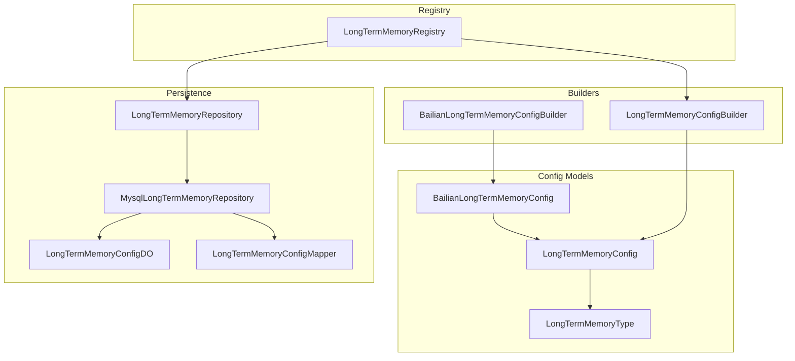
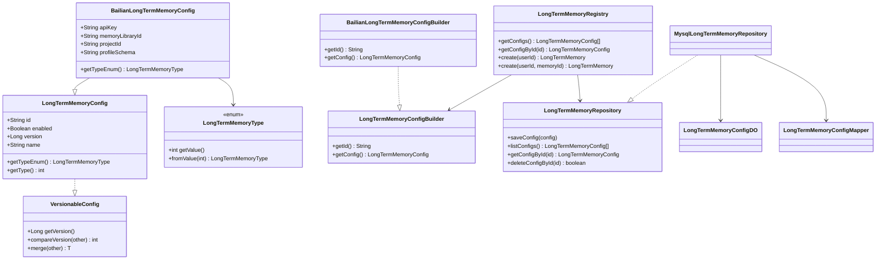
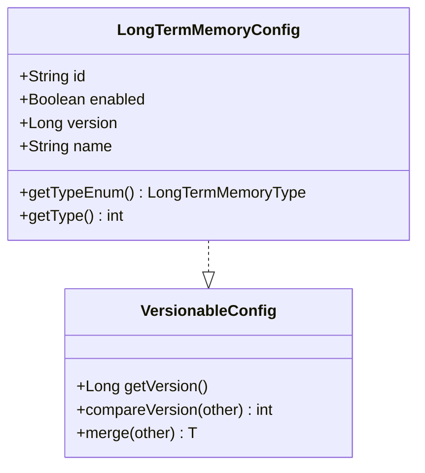
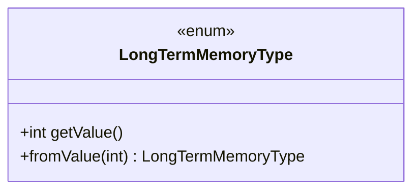
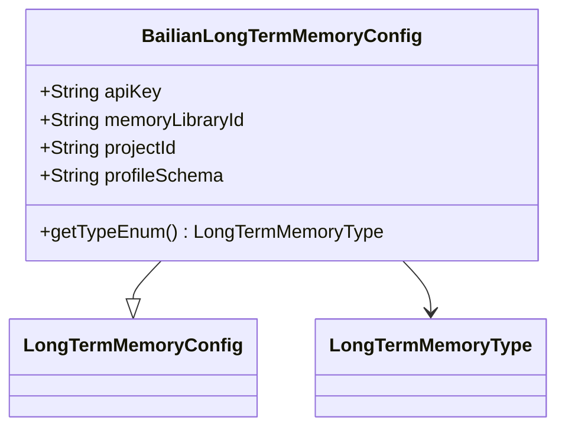
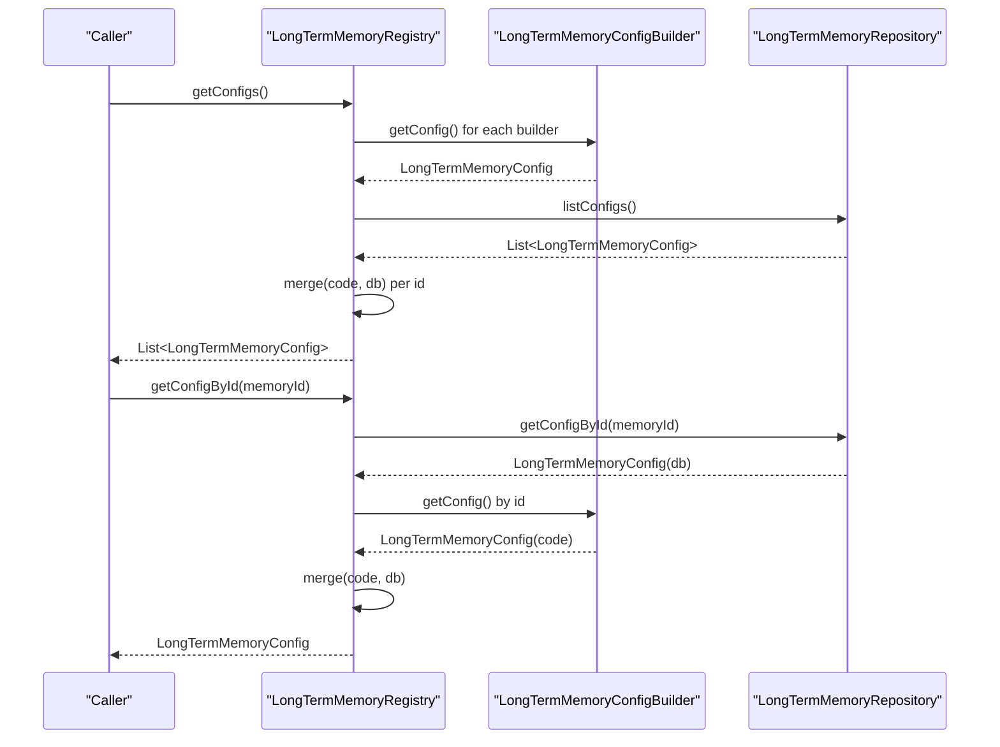
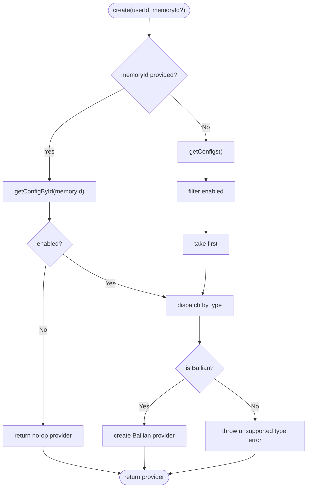
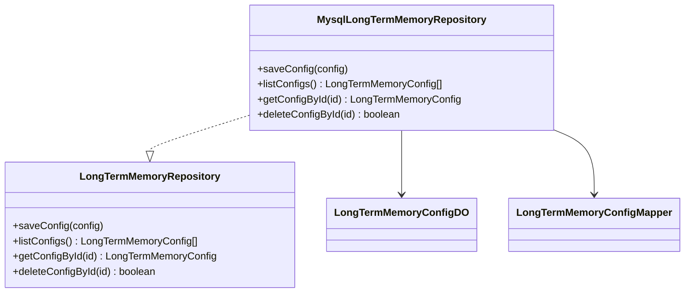
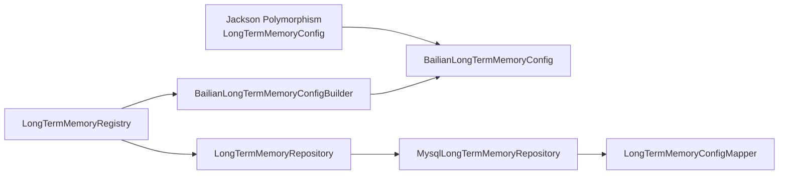

# Memory Architecture and Types

<cite>
**Referenced Files in This Document**
- [LongTermMemoryConfig.java](file://backend_java/core/src/main/java/com/aliyun/tam/x/tron/core/config/LongTermMemoryConfig.java)
- [LongTermMemoryType.java](file://backend_java/core/src/main/java/com/aliyun/tam/x/tron/core/config/LongTermMemoryType.java)
- [BailianLongTermMemoryConfig.java](file://backend_java/core/src/main/java/com/aliyun/tam/x/tron/core/config/BailianLongTermMemoryConfig.java)
- [VersionableConfig.java](file://backend_java/core/src/main/java/com/aliyun/tam/x/tron/core/config/VersionableConfig.java)
- [LongTermMemoryConfigBuilder.java](file://backend_java/core/src/main/java/com/aliyun/tam/x/tron/core/mem/LongTermMemoryConfigBuilder.java)
- [BailianLongTermMemoryConfigBuilder.java](file://backend_java/core/src/main/java/com/aliyun/tam/x/tron/core/mem/BailianLongTermMemoryConfigBuilder.java)
- [LongTermMemoryRegistry.java](file://backend_java/core/src/main/java/com/aliyun/tam/x/tron/core/mem/LongTermMemoryRegistry.java)
- [LongTermMemoryRepository.java](file://backend_java/core/src/main/java/com/aliyun/tam/x/tron/core/domain/repository/LongTermMemoryRepository.java)
- [MysqlLongTermMemoryRepository.java](file://backend_java/core/src/main/java/com/aliyun/tam/x/tron/core/domain/repository/mysql/MysqlLongTermMemoryRepository.java)
- [LongTermMemoryConfigDO.java](file://backend_java/infra/src/main/java/com/aliyun/tam/x/tron/infra/dal/dataobject/LongTermMemoryConfigDO.java)
- [LongTermMemoryConfigMapper.java](file://backend_java/infra/src/main/java/com/aliyun/tam/x/tron/infra/dal/mapper/LongTermMemoryConfigMapper.java)
</cite>

## Table of Contents
1. [Introduction](#introduction)
2. [Project Structure](#project-structure)
3. [Core Components](#core-components)
4. [Architecture Overview](#architecture-overview)
5. [Detailed Component Analysis](#detailed-component-analysis)
6. [Dependency Analysis](#dependency-analysis)
7. [Performance Considerations](#performance-considerations)
8. [Troubleshooting Guide](#troubleshooting-guide)
9. [Conclusion](#conclusion)

## Introduction
This document explains the long-term memory architecture and types in Tron OneAgent. It covers the abstract configuration contract, the memory type enumeration, supported implementations, the registry-driven provider discovery and lifecycle, configuration inheritance and merging, type safety, and extensibility for custom providers. Practical examples illustrate memory type selection, provider registration, and configuration validation.

## Project Structure
The long-term memory subsystem spans configuration models, builders, a registry, and persistence:

- Configuration models define the contract and supported implementations.
- Builders supply default configurations and inject externalized settings.
- The registry discovers, merges, validates, and instantiates memory providers.
- Persistence stores and retrieves configurations from the database.

**Diagram sources**
- [LongTermMemoryConfig.java:37-54](file://backend_java/core/src/main/java/com/aliyun/tam/x/tron/core/config/LongTermMemoryConfig.java#L37-L54)
- [LongTermMemoryType.java:23-46](file://backend_java/core/src/main/java/com/aliyun/tam/x/tron/core/config/LongTermMemoryType.java#L23-L46)
- [BailianLongTermMemoryConfig.java:31-45](file://backend_java/core/src/main/java/com/aliyun/tam/x/tron/core/config/BailianLongTermMemoryConfig.java#L31-L45)
- [LongTermMemoryConfigBuilder.java:22-26](file://backend_java/core/src/main/java/com/aliyun/tam/x/tron/core/mem/LongTermMemoryConfigBuilder.java#L22-L26)
- [BailianLongTermMemoryConfigBuilder.java:26-46](file://backend_java/core/src/main/java/com/aliyun/tam/x/tron/core/mem/BailianLongTermMemoryConfigBuilder.java#L26-L46)
- [LongTermMemoryRegistry.java:42-57](file://backend_java/core/src/main/java/com/aliyun/tam/x/tron/core/mem/LongTermMemoryRegistry.java#L42-L57)
- [LongTermMemoryRepository.java:24-33](file://backend_java/core/src/main/java/com/aliyun/tam/x/tron/core/domain/repository/LongTermMemoryRepository.java#L24-L33)
- [MysqlLongTermMemoryRepository.java:34-116](file://backend_java/core/src/main/java/com/aliyun/tam/x/tron/core/domain/repository/mysql/MysqlLongTermMemoryRepository.java#L34-L116)
- [LongTermMemoryConfigDO.java:27-49](file://backend_java/infra/src/main/java/com/aliyun/tam/x/tron/infra/dal/dataobject/LongTermMemoryConfigDO.java#L27-L49)
- [LongTermMemoryConfigMapper.java:25-26](file://backend_java/infra/src/main/java/com/aliyun/tam/x/tron/infra/dal/mapper/LongTermMemoryConfigMapper.java#L25-L26)

**Section sources**
- [LongTermMemoryConfig.java:37-54](file://backend_java/core/src/main/java/com/aliyun/tam/x/tron/core/config/LongTermMemoryConfig.java#L37-L54)
- [LongTermMemoryRegistry.java:42-57](file://backend_java/core/src/main/java/com/aliyun/tam/x/tron/core/mem/LongTermMemoryRegistry.java#L42-L57)

## Core Components
- LongTermMemoryConfig: Abstract base configuration with a type discriminator and versioning support via VersionableConfig. It exposes a type enum and a convenience numeric type accessor.
- LongTermMemoryType: Enumeration of supported memory types with JSON serialization support.
- BailianLongTermMemoryConfig: Concrete implementation for a provider, annotated for JSON polymorphism and secured fields.
- VersionableConfig: Contract for version comparison and deep-merge of configurations.
- LongTermMemoryConfigBuilder: SPI for constructing default configurations programmatically.
- BailianLongTermMemoryConfigBuilder: Default builder for Bailian provider, injecting externalized API keys.
- LongTermMemoryRegistry: Central registry that discovers, merges, validates, and creates memory instances.
- LongTermMemoryRepository and MysqlLongTermMemoryRepository: Persistence interface and MySQL-backed implementation for storing and retrieving configurations.
- LongTermMemoryConfigDO and LongTermMemoryConfigMapper: Data model and MyBatis mapper for persistence.

**Section sources**
- [LongTermMemoryConfig.java:37-54](file://backend_java/core/src/main/java/com/aliyun/tam/x/tron/core/config/LongTermMemoryConfig.java#L37-L54)
- [LongTermMemoryType.java:23-46](file://backend_java/core/src/main/java/com/aliyun/tam/x/tron/core/config/LongTermMemoryType.java#L23-L46)
- [BailianLongTermMemoryConfig.java:31-45](file://backend_java/core/src/main/java/com/aliyun/tam/x/tron/core/config/BailianLongTermMemoryConfig.java#L31-L45)
- [VersionableConfig.java:23-75](file://backend_java/core/src/main/java/com/aliyun/tam/x/tron/core/config/VersionableConfig.java#L23-L75)
- [LongTermMemoryConfigBuilder.java:22-26](file://backend_java/core/src/main/java/com/aliyun/tam/x/tron/core/mem/LongTermMemoryConfigBuilder.java#L22-L26)
- [BailianLongTermMemoryConfigBuilder.java:26-46](file://backend_java/core/src/main/java/com/aliyun/tam/x/tron/core/mem/BailianLongTermMemoryConfigBuilder.java#L26-L46)
- [LongTermMemoryRegistry.java:42-133](file://backend_java/core/src/main/java/com/aliyun/tam/x/tron/core/mem/LongTermMemoryRegistry.java#L42-L133)
- [LongTermMemoryRepository.java:24-33](file://backend_java/core/src/main/java/com/aliyun/tam/x/tron/core/domain/repository/LongTermMemoryRepository.java#L24-L33)
- [MysqlLongTermMemoryRepository.java:34-116](file://backend_java/core/src/main/java/com/aliyun/tam/x/tron/core/domain/repository/mysql/MysqlLongTermMemoryRepository.java#L34-L116)
- [LongTermMemoryConfigDO.java:27-49](file://backend_java/infra/src/main/java/com/aliyun/tam/x/tron/infra/dal/dataobject/LongTermMemoryConfigDO.java#L27-L49)
- [LongTermMemoryConfigMapper.java:25-26](file://backend_java/infra/src/main/java/com/aliyun/tam/x/tron/infra/dal/mapper/LongTermMemoryConfigMapper.java#L25-L26)

## Architecture Overview
The system uses Jackson polymorphism to bind serialized configurations to concrete types, a builder SPI for default configuration construction, and a registry that merges code-defined and database-backed configurations. The registry validates enablement and delegates instantiation to provider-specific constructors.

**Diagram sources**
- [LongTermMemoryConfig.java:37-54](file://backend_java/core/src/main/java/com/aliyun/tam/x/tron/core/config/LongTermMemoryConfig.java#L37-L54)
- [LongTermMemoryType.java:23-46](file://backend_java/core/src/main/java/com/aliyun/tam/x/tron/core/config/LongTermMemoryType.java#L23-L46)
- [BailianLongTermMemoryConfig.java:31-45](file://backend_java/core/src/main/java/com/aliyun/tam/x/tron/core/config/BailianLongTermMemoryConfig.java#L31-L45)
- [VersionableConfig.java:23-75](file://backend_java/core/src/main/java/com/aliyun/tam/x/tron/core/config/VersionableConfig.java#L23-L75)
- [LongTermMemoryConfigBuilder.java:22-26](file://backend_java/core/src/main/java/com/aliyun/tam/x/tron/core/mem/LongTermMemoryConfigBuilder.java#L22-L26)
- [BailianLongTermMemoryConfigBuilder.java:26-46](file://backend_java/core/src/main/java/com/aliyun/tam/x/tron/core/mem/BailianLongTermMemoryConfigBuilder.java#L26-L46)
- [LongTermMemoryRegistry.java:42-133](file://backend_java/core/src/main/java/com/aliyun/tam/x/tron/core/mem/LongTermMemoryRegistry.java#L42-L133)
- [LongTermMemoryRepository.java:24-33](file://backend_java/core/src/main/java/com/aliyun/tam/x/tron/core/domain/repository/LongTermMemoryRepository.java#L24-L33)
- [MysqlLongTermMemoryRepository.java:34-116](file://backend_java/core/src/main/java/com/aliyun/tam/x/tron/core/domain/repository/mysql/MysqlLongTermMemoryRepository.java#L34-L116)
- [LongTermMemoryConfigDO.java:27-49](file://backend_java/infra/src/main/java/com/aliyun/tam/x/tron/infra/dal/dataobject/LongTermMemoryConfigDO.java#L27-L49)
- [LongTermMemoryConfigMapper.java:25-26](file://backend_java/infra/src/main/java/com/aliyun/tam/x/tron/infra/dal/mapper/LongTermMemoryConfigMapper.java#L25-L26)

## Detailed Component Analysis

### Abstract Configuration Contract: LongTermMemoryConfig
- Purpose: Defines the common shape for all long-term memory configurations, including identity, enablement, versioning, and name. Provides a type accessor and a type enum accessor.
- Polymorphism: Uses Jackson annotations to bind serialized JSON to concrete subclasses.
- Versioning: Implements VersionableConfig to support version comparisons and deep merges with null-field propagation.

**Diagram sources**
- [LongTermMemoryConfig.java:37-54](file://backend_java/core/src/main/java/com/aliyun/tam/x/tron/core/config/LongTermMemoryConfig.java#L37-L54)
- [VersionableConfig.java:23-75](file://backend_java/core/src/main/java/com/aliyun/tam/x/tron/core/config/VersionableConfig.java#L23-L75)

**Section sources**
- [LongTermMemoryConfig.java:37-54](file://backend_java/core/src/main/java/com/aliyun/tam/x/tron/core/config/LongTermMemoryConfig.java#L37-L54)
- [VersionableConfig.java:23-75](file://backend_java/core/src/main/java/com/aliyun/tam/x/tron/core/config/VersionableConfig.java#L23-L75)

### Memory Type Enumeration: LongTermMemoryType
- Purpose: Enumerates supported memory types with a numeric value and JSON serialization support.
- Safety: Includes a creator method to deserialize from numeric values and throws on unknown values.

**Diagram sources**
- [LongTermMemoryType.java:23-46](file://backend_java/core/src/main/java/com/aliyun/tam/x/tron/core/config/LongTermMemoryType.java#L23-L46)

**Section sources**
- [LongTermMemoryType.java:23-46](file://backend_java/core/src/main/java/com/aliyun/tam/x/tron/core/config/LongTermMemoryType.java#L23-L46)

### Supported Implementation: BailianLongTermMemoryConfig
- Purpose: Concrete configuration for the Bailian provider, annotated for JSON polymorphism and secured field handling.
- Fields: Provider credentials and identifiers required for API calls.
- Type binding: Returns the associated enum value.

**Diagram sources**
- [BailianLongTermMemoryConfig.java:31-45](file://backend_java/core/src/main/java/com/aliyun/tam/x/tron/core/config/BailianLongTermMemoryConfig.java#L31-L45)
- [LongTermMemoryConfig.java:37-54](file://backend_java/core/src/main/java/com/aliyun/tam/x/tron/core/config/LongTermMemoryConfig.java#L37-L54)
- [LongTermMemoryType.java:23-46](file://backend_java/core/src/main/java/com/aliyun/tam/x/tron/core/config/LongTermMemoryType.java#L23-L46)

**Section sources**
- [BailianLongTermMemoryConfig.java:31-45](file://backend_java/core/src/main/java/com/aliyun/tam/x/tron/core/config/BailianLongTermMemoryConfig.java#L31-L45)

### Registry Pattern: LongTermMemoryRegistry
- Discovery: Collects all LongTermMemoryConfigBuilder beans and database-stored configurations.
- Merging: Merges code-defined and database configurations using VersionableConfig semantics.
- Validation: Filters by enabled flag and selects the first enabled configuration when no ID is specified.
- Lifecycle: Creates a provider instance based on the resolved configuration; falls back to a no-op provider if none is available.

**Diagram sources**
- [LongTermMemoryRegistry.java:59-90](file://backend_java/core/src/main/java/com/aliyun/tam/x/tron/core/mem/LongTermMemoryRegistry.java#L59-L90)
- [LongTermMemoryConfigBuilder.java:22-26](file://backend_java/core/src/main/java/com/aliyun/tam/x/tron/core/mem/LongTermMemoryConfigBuilder.java#L22-L26)
- [LongTermMemoryRepository.java:24-33](file://backend_java/core/src/main/java/com/aliyun/tam/x/tron/core/domain/repository/LongTermMemoryRepository.java#L24-L33)

**Section sources**
- [LongTermMemoryRegistry.java:59-90](file://backend_java/core/src/main/java/com/aliyun/tam/x/tron/core/mem/LongTermMemoryRegistry.java#L59-L90)

### Provider Creation Flow
- Selection: If a memoryId is provided, fetch merged config by ID; otherwise, pick the first enabled configuration.
- Instantiation: Dispatch to provider-specific creation logic; unsupported types raise an exception.
- Bailian provider: Builds a LongTermMemory with record/retrieve implementations backed by REST calls.

**Diagram sources**
- [LongTermMemoryRegistry.java:92-133](file://backend_java/core/src/main/java/com/aliyun/tam/x/tron/core/mem/LongTermMemoryRegistry.java#L92-L133)
- [BailianLongTermMemoryConfig.java:31-45](file://backend_java/core/src/main/java/com/aliyun/tam/x/tron/core/config/BailianLongTermMemoryConfig.java#L31-L45)

**Section sources**
- [LongTermMemoryRegistry.java:92-133](file://backend_java/core/src/main/java/com/aliyun/tam/x/tron/core/mem/LongTermMemoryRegistry.java#L92-L133)

### Persistence Layer: LongTermMemoryRepository and MySQL Implementation
- Interface: Defines CRUD operations for memory configurations.
- MySQL implementation: Serializes/deserializes configurations to/from JSON stored in the database, maps enabled flags, and applies timestamps.

**Diagram sources**
- [LongTermMemoryRepository.java:24-33](file://backend_java/core/src/main/java/com/aliyun/tam/x/tron/core/domain/repository/LongTermMemoryRepository.java#L24-L33)
- [MysqlLongTermMemoryRepository.java:34-116](file://backend_java/core/src/main/java/com/aliyun/tam/x/tron/core/domain/repository/mysql/MysqlLongTermMemoryRepository.java#L34-L116)
- [LongTermMemoryConfigDO.java:27-49](file://backend_java/infra/src/main/java/com/aliyun/tam/x/tron/infra/dal/dataobject/LongTermMemoryConfigDO.java#L27-L49)
- [LongTermMemoryConfigMapper.java:25-26](file://backend_java/infra/src/main/java/com/aliyun/tam/x/tron/infra/dal/mapper/LongTermMemoryConfigMapper.java#L25-L26)

**Section sources**
- [LongTermMemoryRepository.java:24-33](file://backend_java/core/src/main/java/com/aliyun/tam/x/tron/core/domain/repository/LongTermMemoryRepository.java#L24-L33)
- [MysqlLongTermMemoryRepository.java:34-116](file://backend_java/core/src/main/java/com/aliyun/tam/x/tron/core/domain/repository/mysql/MysqlLongTermMemoryRepository.java#L34-L116)
- [LongTermMemoryConfigDO.java:27-49](file://backend_java/infra/src/main/java/com/aliyun/tam/x/tron/infra/dal/dataobject/LongTermMemoryConfigDO.java#L27-L49)
- [LongTermMemoryConfigMapper.java:25-26](file://backend_java/infra/src/main/java/com/aliyun/tam/x/tron/infra/dal/mapper/LongTermMemoryConfigMapper.java#L25-L26)

## Dependency Analysis
- Polymorphic binding: LongTermMemoryConfig declares JSON type info and registers Bailian as a subtype. Concrete subclasses must annotate their JSON type names.
- Builder SPI: Spring collects all LongTermMemoryConfigBuilder beans; each supplies a unique id and a default configuration.
- Registry composition: LongTermMemoryRegistry depends on the builder list, a repository, and a REST client to construct providers.
- Persistence coupling: MySQL repository depends on the ObjectMapper and the mapper interface to serialize/deserialize configurations.

**Diagram sources**
- [LongTermMemoryConfig.java:33-36](file://backend_java/core/src/main/java/com/aliyun/tam/x/tron/core/config/LongTermMemoryConfig.java#L33-L36)
- [BailianLongTermMemoryConfig.java](file://backend_java/core/src/main/java/com/aliyun/tam/x/tron/core/config/BailianLongTermMemoryConfig.java#L30)
- [BailianLongTermMemoryConfigBuilder.java:26-46](file://backend_java/core/src/main/java/com/aliyun/tam/x/tron/core/mem/BailianLongTermMemoryConfigBuilder.java#L26-L46)
- [LongTermMemoryRegistry.java:42-57](file://backend_java/core/src/main/java/com/aliyun/tam/x/tron/core/mem/LongTermMemoryRegistry.java#L42-L57)
- [LongTermMemoryRepository.java:24-33](file://backend_java/core/src/main/java/com/aliyun/tam/x/tron/core/domain/repository/LongTermMemoryRepository.java#L24-L33)
- [MysqlLongTermMemoryRepository.java:34-116](file://backend_java/core/src/main/java/com/aliyun/tam/x/tron/core/domain/repository/mysql/MysqlLongTermMemoryRepository.java#L34-L116)
- [LongTermMemoryConfigMapper.java:25-26](file://backend_java/infra/src/main/java/com/aliyun/tam/x/tron/infra/dal/mapper/LongTermMemoryConfigMapper.java#L25-L26)

**Section sources**
- [LongTermMemoryConfig.java:33-36](file://backend_java/core/src/main/java/com/aliyun/tam/x/tron/core/config/LongTermMemoryConfig.java#L33-L36)
- [BailianLongTermMemoryConfig.java](file://backend_java/core/src/main/java/com/aliyun/tam/x/tron/core/config/BailianLongTermMemoryConfig.java#L30)
- [LongTermMemoryRegistry.java:42-57](file://backend_java/core/src/main/java/com/aliyun/tam/x/tron/core/mem/LongTermMemoryRegistry.java#L42-L57)
- [MysqlLongTermMemoryRepository.java:34-116](file://backend_java/core/src/main/java/com/aliyun/tam/x/tron/core/domain/repository/mysql/MysqlLongTermMemoryRepository.java#L34-L116)

## Performance Considerations
- Builder discovery: The registry collects all builder beans; keep the number of builders reasonable to avoid excessive startup overhead.
- Merge cost: VersionableConfig.merge performs deep map merges; prefer minimal differences between code and database configurations to reduce merge work.
- Network latency: Bailian provider operations are network-bound; consider batching records and caching frequent retrievals where appropriate.
- Serialization: JSON serialization/deserialization occurs on persistence operations; ensure ObjectMapper configuration aligns with production needs.

[No sources needed since this section provides general guidance]

## Troubleshooting Guide
- Unknown type value: Deserialization fails if LongTermMemoryType.fromValue receives an unrecognized integer; verify configuration values and supported types.
- Unsupported memory type: Creating a provider for an unhandled type raises an exception; ensure the configuration type matches a registered builder/provider.
- Disabled or missing configuration: If no enabled configuration is found, the registry returns a no-op provider; confirm enablement flags and IDs.
- Persistence errors: Save/list/get/delete operations throw runtime exceptions on parse or write failures; inspect logs and database state.

**Section sources**
- [LongTermMemoryType.java:38-46](file://backend_java/core/src/main/java/com/aliyun/tam/x/tron/core/config/LongTermMemoryType.java#L38-L46)
- [LongTermMemoryRegistry.java:132-133](file://backend_java/core/src/main/java/com/aliyun/tam/x/tron/core/mem/LongTermMemoryRegistry.java#L132-L133)
- [MysqlLongTermMemoryRepository.java:67-69](file://backend_java/core/src/main/java/com/aliyun/tam/x/tron/core/domain/repository/mysql/MysqlLongTermMemoryRepository.java#L67-L69)
- [MysqlLongTermMemoryRepository.java:82-84](file://backend_java/core/src/main/java/com/aliyun/tam/x/tron/core/domain/repository/mysql/MysqlLongTermMemoryRepository.java#L82-L84)

## Conclusion
Tron OneAgent’s long-term memory architecture centers on a robust configuration contract, a type-safe enumeration, and a registry-driven provider system. Jackson polymorphism binds serialized configurations to concrete types, while builders supply defaults and externalized settings. The registry merges code and database configurations, validates enablement, and instantiates providers. The persistence layer stores configurations as JSON, enabling flexible updates without code changes. Extensibility is achieved by adding new builders and implementing new concrete configuration classes that adhere to the base contract and type system.