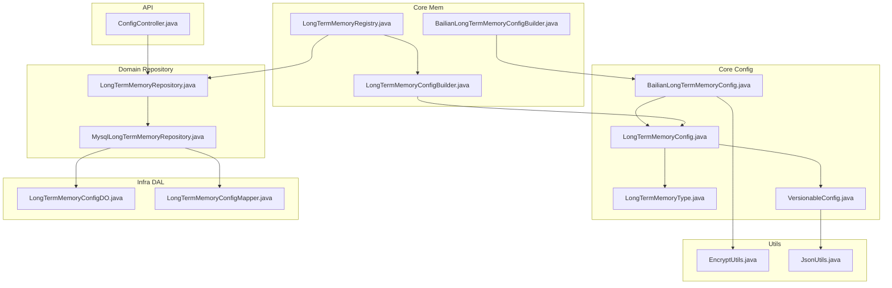
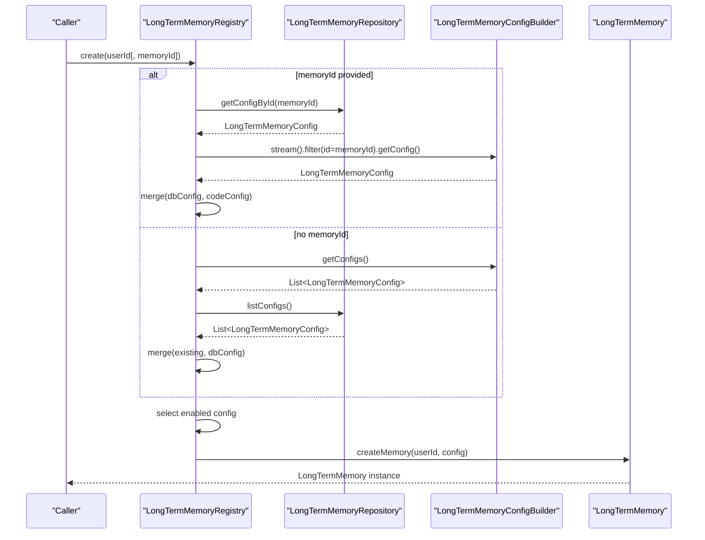
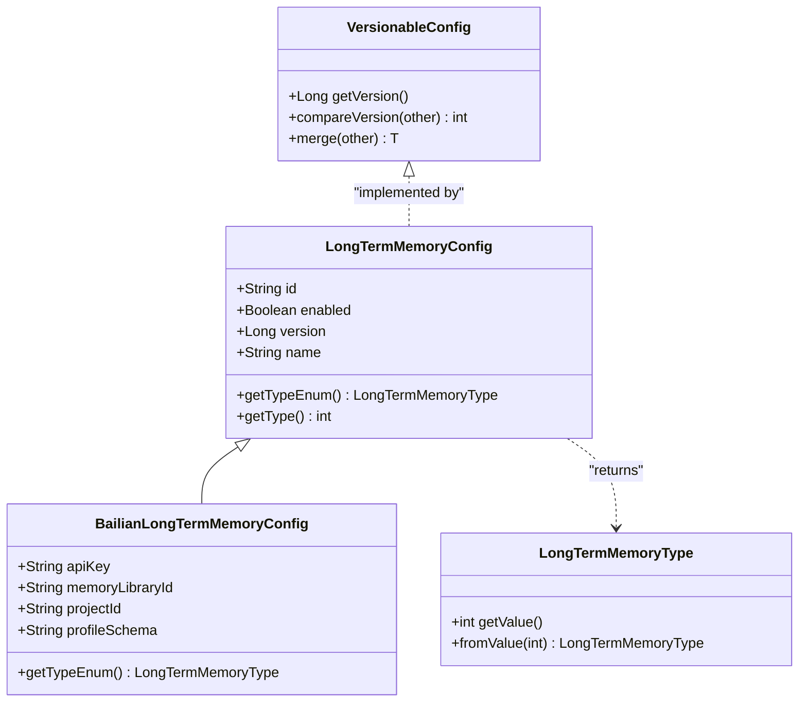
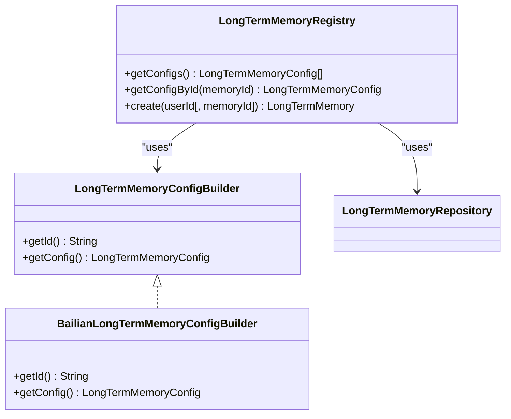
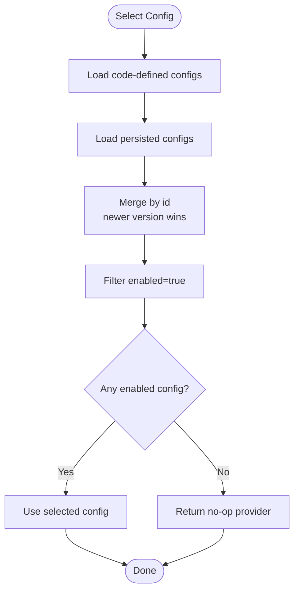
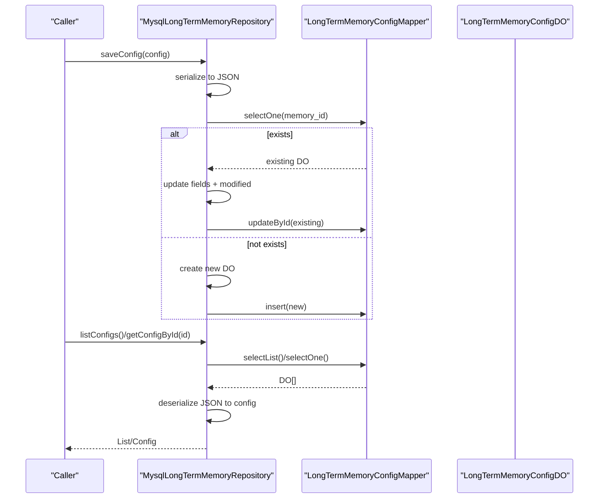
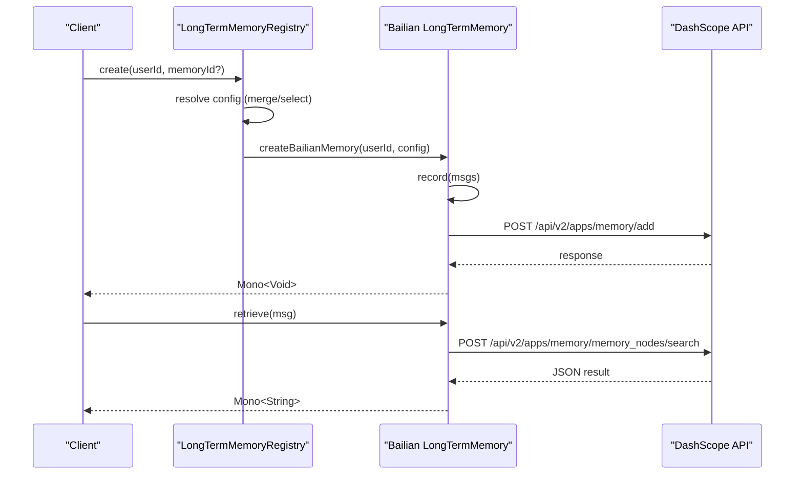
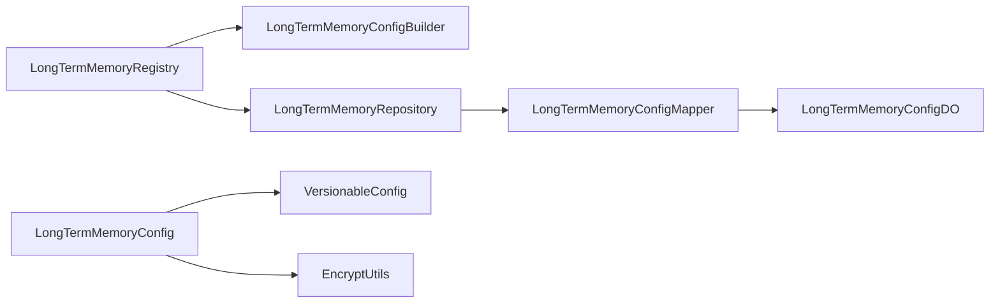

# Memory Lifecycle and Management

<cite>
**Referenced Files in This Document**
- [LongTermMemoryRegistry.java](file://backend_java/core/src/main/java/com/aliyun/tam/x/tron/core/mem/LongTermMemoryRegistry.java)
- [LongTermMemoryConfigBuilder.java](file://backend_java/core/src/main/java/com/aliyun/tam/x/tron/core/mem/LongTermMemoryConfigBuilder.java)
- [BailianLongTermMemoryConfigBuilder.java](file://backend_java/core/src/main/java/com/aliyun/tam/x/tron/core/mem/BailianLongTermMemoryConfigBuilder.java)
- [LongTermMemoryConfig.java](file://backend_java/core/src/main/java/com/aliyun/tam/x/tron/core/config/LongTermMemoryConfig.java)
- [BailianLongTermMemoryConfig.java](file://backend_java/core/src/main/java/com/aliyun/tam/x/tron/core/config/BailianLongTermMemoryConfig.java)
- [LongTermMemoryType.java](file://backend_java/core/src/main/java/com/aliyun/tam/x/tron/core/config/LongTermMemoryType.java)
- [VersionableConfig.java](file://backend_java/core/src/main/java/com/aliyun/tam/x/tron/core/config/VersionableConfig.java)
- [LongTermMemoryRepository.java](file://backend_java/core/src/main/java/com/aliyun/tam/x/tron/core/domain/repository/LongTermMemoryRepository.java)
- [MysqlLongTermMemoryRepository.java](file://backend_java/core/src/main/java/com/aliyun/tam/x/tron/core/domain/repository/mysql/MysqlLongTermMemoryRepository.java)
- [LongTermMemoryConfigDO.java](file://backend_java/infra/src/main/java/com/aliyun/tam/x/tron/infra/dal/dataobject/LongTermMemoryConfigDO.java)
- [LongTermMemoryConfigMapper.java](file://backend_java/infra/src/main/java/com/aliyun/tam/x/tron/infra/dal/mapper/LongTermMemoryConfigMapper.java)
- [EncryptUtils.java](file://backend_java/utils/src/main/java/com/aliyun/tam/x/tron/utils/encrypt/EncryptUtils.java)
- [JsonUtils.java](file://backend_java/utils/src/main/java/com/aliyun/tam/x/tron/utils/JsonUtils.java)
- [ConfigController.java](file://backend_java/api/src/main/java/com/aliyun/tam/x/tron/api/ConfigController.java)
</cite>

## Table of Contents
1. [Introduction](#introduction)
2. [Project Structure](#project-structure)
3. [Core Components](#core-components)
4. [Architecture Overview](#architecture-overview)
5. [Detailed Component Analysis](#detailed-component-analysis)
6. [Dependency Analysis](#dependency-analysis)
7. [Performance Considerations](#performance-considerations)
8. [Troubleshooting Guide](#troubleshooting-guide)
9. [Conclusion](#conclusion)
10. [Appendices](#appendices)

## Introduction
This document explains the long-term memory lifecycle and management in Tron OneAgent. It covers provider registration and selection via the registry, configuration validation and versioning, persistence and retrieval of memory configurations, and the creation of runtime memory providers. It also documents repository operations, change management, and practical examples for lifecycle management, configuration updates, and error recovery. Monitoring and logging strategies for memory operations are included.

## Project Structure
The long-term memory subsystem is organized around:
- Configuration model and builders for memory providers
- Registry that selects and instantiates memory providers
- Repository layer for persistent configuration management
- Data access objects and mappers for MySQL persistence
- Utilities for encryption and JSON conversion
- API controller for configuration CRUD operations

**Diagram sources**
- [LongTermMemoryConfig.java:1-55](file://backend_java/core/src/main/java/com/aliyun/tam/x/tron/core/config/LongTermMemoryConfig.java#L1-L55)
- [BailianLongTermMemoryConfig.java:1-47](file://backend_java/core/src/main/java/com/aliyun/tam/x/tron/core/config/BailianLongTermMemoryConfig.java#L1-L47)
- [LongTermMemoryType.java:1-48](file://backend_java/core/src/main/java/com/aliyun/tam/x/tron/core/config/LongTermMemoryType.java#L1-L48)
- [VersionableConfig.java:1-76](file://backend_java/core/src/main/java/com/aliyun/tam/x/tron/core/config/VersionableConfig.java#L1-L76)
- [LongTermMemoryConfigBuilder.java:1-27](file://backend_java/core/src/main/java/com/aliyun/tam/x/tron/core/mem/LongTermMemoryConfigBuilder.java#L1-L27)
- [BailianLongTermMemoryConfigBuilder.java:1-48](file://backend_java/core/src/main/java/com/aliyun/tam/x/tron/core/mem/BailianLongTermMemoryConfigBuilder.java#L1-L48)
- [LongTermMemoryRegistry.java:1-227](file://backend_java/core/src/main/java/com/aliyun/tam/x/tron/core/mem/LongTermMemoryRegistry.java#L1-L227)
- [LongTermMemoryRepository.java:1-34](file://backend_java/core/src/main/java/com/aliyun/tam/x/tron/core/domain/repository/LongTermMemoryRepository.java#L1-L34)
- [MysqlLongTermMemoryRepository.java:1-117](file://backend_java/core/src/main/java/com/aliyun/tam/x/tron/core/domain/repository/mysql/MysqlLongTermMemoryRepository.java#L1-L117)
- [LongTermMemoryConfigDO.java:1-50](file://backend_java/infra/src/main/java/com/aliyun/tam/x/tron/infra/dal/dataobject/LongTermMemoryConfigDO.java#L1-L50)
- [LongTermMemoryConfigMapper.java:1-27](file://backend_java/infra/src/main/java/com/aliyun/tam/x/tron/infra/dal/mapper/LongTermMemoryConfigMapper.java#L1-L27)
- [EncryptUtils.java:1-91](file://backend_java/utils/src/main/java/com/aliyun/tam/x/tron/utils/encrypt/EncryptUtils.java#L1-L91)
- [JsonUtils.java:1-46](file://backend_java/utils/src/main/java/com/aliyun/tam/x/tron/utils/JsonUtils.java#L1-L46)
- [ConfigController.java:474-482](file://backend_java/api/src/main/java/com/aliyun/tam/x/tron/api/ConfigController.java#L474-L482)

**Section sources**
- [LongTermMemoryRegistry.java:1-227](file://backend_java/core/src/main/java/com/aliyun/tam/x/tron/core/mem/LongTermMemoryRegistry.java#L1-L227)
- [LongTermMemoryConfig.java:1-55](file://backend_java/core/src/main/java/com/aliyun/tam/x/tron/core/config/LongTermMemoryConfig.java#L1-L55)
- [MysqlLongTermMemoryRepository.java:1-117](file://backend_java/core/src/main/java/com/aliyun/tam/x/tron/core/domain/repository/mysql/MysqlLongTermMemoryRepository.java#L1-L117)

## Core Components
- Long-term memory configuration model and type system define provider metadata and versioning contract.
- Builders supply default configurations and bind externalized values.
- Registry aggregates, merges, validates, and instantiates memory providers.
- Repository persists and retrieves configurations, enabling dynamic updates.
- Encryption utilities protect sensitive fields; JSON utilities support merge and serialization.

Key responsibilities:
- Provider registration and selection through builders and registry
- Configuration validation and merging via VersionableConfig
- Persistence and retrieval of configurations via repository and MySQL
- Runtime provider creation and HTTP-backed memory operations

**Section sources**
- [LongTermMemoryConfig.java:1-55](file://backend_java/core/src/main/java/com/aliyun/tam/x/tron/core/config/LongTermMemoryConfig.java#L1-L55)
- [LongTermMemoryType.java:1-48](file://backend_java/core/src/main/java/com/aliyun/tam/x/tron/core/config/LongTermMemoryType.java#L1-L48)
- [VersionableConfig.java:1-76](file://backend_java/core/src/main/java/com/aliyun/tam/x/tron/core/config/VersionableConfig.java#L1-L76)
- [LongTermMemoryConfigBuilder.java:1-27](file://backend_java/core/src/main/java/com/aliyun/tam/x/tron/core/mem/LongTermMemoryConfigBuilder.java#L1-L27)
- [BailianLongTermMemoryConfigBuilder.java:1-48](file://backend_java/core/src/main/java/com/aliyun/tam/x/tron/core/mem/BailianLongTermMemoryConfigBuilder.java#L1-L48)
- [LongTermMemoryRegistry.java:1-227](file://backend_java/core/src/main/java/com/aliyun/tam/x/tron/core/mem/LongTermMemoryRegistry.java#L1-L227)
- [LongTermMemoryRepository.java:1-34](file://backend_java/core/src/main/java/com/aliyun/tam/x/tron/core/domain/repository/LongTermMemoryRepository.java#L1-L34)
- [MysqlLongTermMemoryRepository.java:1-117](file://backend_java/core/src/main/java/com/aliyun/tam/x/tron/core/domain/repository/mysql/MysqlLongTermMemoryRepository.java#L1-L117)
- [EncryptUtils.java:1-91](file://backend_java/utils/src/main/java/com/aliyun/tam/x/tron/utils/encrypt/EncryptUtils.java#L1-L91)
- [JsonUtils.java:1-46](file://backend_java/utils/src/main/java/com/aliyun/tam/x/tron/utils/JsonUtils.java#L1-L46)

## Architecture Overview
The memory lifecycle spans configuration definition, persistence, selection, and runtime operations.

**Diagram sources**
- [LongTermMemoryRegistry.java:59-126](file://backend_java/core/src/main/java/com/aliyun/tam/x/tron/core/mem/LongTermMemoryRegistry.java#L59-L126)
- [LongTermMemoryRepository.java:24-33](file://backend_java/core/src/main/java/com/aliyun/tam/x/tron/core/domain/repository/LongTermMemoryRepository.java#L24-L33)
- [LongTermMemoryConfigBuilder.java:22-26](file://backend_java/core/src/main/java/com/aliyun/tam/x/tron/core/mem/LongTermMemoryConfigBuilder.java#L22-L26)

## Detailed Component Analysis

### Long-term Memory Configuration Model
- LongTermMemoryConfig defines the base configuration with id, name, enabled flag, version, and type accessor.
- BailianLongTermMemoryConfig extends the base with provider-specific fields and marks the provider type.
- LongTermMemoryType enumerates supported provider types.
- VersionableConfig provides version comparison and merge semantics using JSON maps.

**Diagram sources**
- [LongTermMemoryConfig.java:1-55](file://backend_java/core/src/main/java/com/aliyun/tam/x/tron/core/config/LongTermMemoryConfig.java#L1-L55)
- [BailianLongTermMemoryConfig.java:1-47](file://backend_java/core/src/main/java/com/aliyun/tam/x/tron/core/config/BailianLongTermMemoryConfig.java#L1-L47)
- [LongTermMemoryType.java:1-48](file://backend_java/core/src/main/java/com/aliyun/tam/x/tron/core/config/LongTermMemoryType.java#L1-L48)
- [VersionableConfig.java:1-76](file://backend_java/core/src/main/java/com/aliyun/tam/x/tron/core/config/VersionableConfig.java#L1-L76)

**Section sources**
- [LongTermMemoryConfig.java:1-55](file://backend_java/core/src/main/java/com/aliyun/tam/x/tron/core/config/LongTermMemoryConfig.java#L1-L55)
- [BailianLongTermMemoryConfig.java:1-47](file://backend_java/core/src/main/java/com/aliyun/tam/x/tron/core/config/BailianLongTermMemoryConfig.java#L1-L47)
- [LongTermMemoryType.java:1-48](file://backend_java/core/src/main/java/com/aliyun/tam/x/tron/core/config/LongTermMemoryType.java#L1-L48)
- [VersionableConfig.java:1-76](file://backend_java/core/src/main/java/com/aliyun/tam/x/tron/core/config/VersionableConfig.java#L1-L76)

### Memory Provider Registration and Selection
- LongTermMemoryConfigBuilder supplies default configurations and identifiers.
- BailianLongTermMemoryConfigBuilder binds API key from environment and builds a default Bailian configuration.
- LongTermMemoryRegistry aggregates builders and repository configs, merges them, and selects an enabled configuration for a user.

**Diagram sources**
- [LongTermMemoryConfigBuilder.java:1-27](file://backend_java/core/src/main/java/com/aliyun/tam/x/tron/core/mem/LongTermMemoryConfigBuilder.java#L1-L27)
- [BailianLongTermMemoryConfigBuilder.java:1-48](file://backend_java/core/src/main/java/com/aliyun/tam/x/tron/core/mem/BailianLongTermMemoryConfigBuilder.java#L1-L48)
- [LongTermMemoryRegistry.java:1-227](file://backend_java/core/src/main/java/com/aliyun/tam/x/tron/core/mem/LongTermMemoryRegistry.java#L1-L227)

**Section sources**
- [LongTermMemoryConfigBuilder.java:1-27](file://backend_java/core/src/main/java/com/aliyun/tam/x/tron/core/mem/LongTermMemoryConfigBuilder.java#L1-L27)
- [BailianLongTermMemoryConfigBuilder.java:1-48](file://backend_java/core/src/main/java/com/aliyun/tam/x/tron/core/mem/BailianLongTermMemoryConfigBuilder.java#L1-L48)
- [LongTermMemoryRegistry.java:59-126](file://backend_java/core/src/main/java/com/aliyun/tam/x/tron/core/mem/LongTermMemoryRegistry.java#L59-L126)

### Memory Configuration Validation, Versioning, and Change Management
- Validation: Enabled flag determines whether a configuration is considered active during selection.
- Versioning: VersionableConfig.compareVersion compares versions; merge preserves newer values and fills nulls from the other configuration.
- Change management: getConfigs and getConfigById merge repository-provided overrides with code-defined defaults, ensuring runtime reflects persisted changes.

**Diagram sources**
- [LongTermMemoryRegistry.java:59-90](file://backend_java/core/src/main/java/com/aliyun/tam/x/tron/core/mem/LongTermMemoryRegistry.java#L59-L90)
- [VersionableConfig.java:27-57](file://backend_java/core/src/main/java/com/aliyun/tam/x/tron/core/config/VersionableConfig.java#L27-L57)

**Section sources**
- [LongTermMemoryRegistry.java:59-90](file://backend_java/core/src/main/java/com/aliyun/tam/x/tron/core/mem/LongTermMemoryRegistry.java#L59-L90)
- [VersionableConfig.java:27-57](file://backend_java/core/src/main/java/com/aliyun/tam/x/tron/core/config/VersionableConfig.java#L27-L57)

### Memory Repository Operations: Persistence, Retrieval, and Cleanup
- Save: Serializes configuration to JSON and persists to long_term_memory_configs, updating timestamps and enabled flag.
- List: Loads all persisted configurations and deserializes to typed objects.
- Get by id: Retrieves a single configuration by id and deserializes it.
- Delete: Removes a configuration by id and returns whether deletion occurred.

**Diagram sources**
- [MysqlLongTermMemoryRepository.java:42-115](file://backend_java/core/src/main/java/com/aliyun/tam/x/tron/core/domain/repository/mysql/MysqlLongTermMemoryRepository.java#L42-L115)
- [LongTermMemoryConfigMapper.java:1-27](file://backend_java/infra/src/main/java/com/aliyun/tam/x/tron/infra/dal/mapper/LongTermMemoryConfigMapper.java#L1-L27)
- [LongTermMemoryConfigDO.java:1-50](file://backend_java/infra/src/main/java/com/aliyun/tam/x/tron/infra/dal/dataobject/LongTermMemoryConfigDO.java#L1-L50)

**Section sources**
- [LongTermMemoryRepository.java:24-33](file://backend_java/core/src/main/java/com/aliyun/tam/x/tron/core/domain/repository/LongTermMemoryRepository.java#L24-L33)
- [MysqlLongTermMemoryRepository.java:42-115](file://backend_java/core/src/main/java/com/aliyun/tam/x/tron/core/domain/repository/mysql/MysqlLongTermMemoryRepository.java#L42-L115)
- [LongTermMemoryConfigDO.java:27-49](file://backend_java/infra/src/main/java/com/aliyun/tam/x/tron/infra/dal/dataobject/LongTermMemoryConfigDO.java#L27-L49)

### Runtime Memory Provider Creation and Operations
- Registry creates a provider based on the resolved configuration type.
- Bailian provider exposes record and retrieve operations backed by HTTP requests to the provider’s APIs.
- Request payloads are constructed from message lists and user ids, with optional library/project/profile fields.

**Diagram sources**
- [LongTermMemoryRegistry.java:92-167](file://backend_java/core/src/main/java/com/aliyun/tam/x/tron/core/mem/LongTermMemoryRegistry.java#L92-L167)

**Section sources**
- [LongTermMemoryRegistry.java:92-167](file://backend_java/core/src/main/java/com/aliyun/tam/x/tron/core/mem/LongTermMemoryRegistry.java#L92-L167)

### Memory Aging Policies, Retention Strategies, and Automatic Cleanup
- The current implementation does not expose explicit aging or retention policies in the repository or provider code.
- Providers rely on upstream service behavior; no local TTL or pruning logic is implemented in the codebase.
- Recommendation: Introduce retention windows and periodic cleanup jobs at the provider level or via scheduled tasks.

[No sources needed since this section provides general guidance]

### Practical Examples

#### Lifecycle Management Example
- Register a provider: Implement a LongTermMemoryConfigBuilder and export it as a Spring component so it participates in registry discovery.
- Select a provider: Call LongTermMemoryRegistry.create(userId[, memoryId]) to obtain a provider instance based on merged configuration.
- Unregister/cleanup: Remove the provider configuration via the API controller endpoint to disable it for future selections.

**Section sources**
- [LongTermMemoryConfigBuilder.java:22-26](file://backend_java/core/src/main/java/com/aliyun/tam/x/tron/core/mem/LongTermMemoryConfigBuilder.java#L22-L26)
- [LongTermMemoryRegistry.java:92-126](file://backend_java/core/src/main/java/com/aliyun/tam/x/tron/core/mem/LongTermMemoryRegistry.java#L92-L126)
- [ConfigController.java:474-482](file://backend_java/api/src/main/java/com/aliyun/tam/x/tron/api/ConfigController.java#L474-L482)

#### Configuration Updates Example
- Persist a new configuration: Use the repository saveConfig method to store a LongTermMemoryConfig with desired fields.
- Merge and override: On next selection, getConfigs/getConfigById merges repository-provided values with code-defined defaults, honoring version and enabled flags.

**Section sources**
- [MysqlLongTermMemoryRepository.java:42-70](file://backend_java/core/src/main/java/com/aliyun/tam/x/tron/core/domain/repository/mysql/MysqlLongTermMemoryRepository.java#L42-L70)
- [LongTermMemoryRegistry.java:59-90](file://backend_java/core/src/main/java/com/aliyun/tam/x/tron/core/mem/LongTermMemoryRegistry.java#L59-L90)

#### Error Recovery Example
- Disabled or missing configuration: Registry falls back to a no-op provider that returns empty results and performs no operations.
- Repository parsing errors: Exceptions during JSON parsing are wrapped and rethrown to surface failures early.
- Network failures: Provider operations are asynchronous; callers should handle Mono errors appropriately.

**Section sources**
- [LongTermMemoryRegistry.java:111-126](file://backend_java/core/src/main/java/com/aliyun/tam/x/tron/core/mem/LongTermMemoryRegistry.java#L111-L126)
- [MysqlLongTermMemoryRepository.java:72-85](file://backend_java/core/src/main/java/com/aliyun/tam/x/tron/core/domain/repository/mysql/MysqlLongTermMemoryRepository.java#L72-L85)

### Monitoring and Logging Strategies
- Registry logs warnings when configurations are missing or disabled during provider selection.
- Repository logs exceptions during save/list/get/delete operations to aid diagnostics.
- Provider operations are asynchronous; ensure upstream API responses are logged and monitored externally.

**Section sources**
- [LongTermMemoryRegistry.java:100-103](file://backend_java/core/src/main/java/com/aliyun/tam/x/tron/core/mem/LongTermMemoryRegistry.java#L100-L103)
- [MysqlLongTermMemoryRepository.java:67-69](file://backend_java/core/src/main/java/com/aliyun/tam/x/tron/core/domain/repository/mysql/MysqlLongTermMemoryRepository.java#L67-L69)

## Dependency Analysis
- Registry depends on builders and repository to assemble runtime configurations.
- Repository depends on mapper and DO for persistence.
- Configuration model depends on versioning utilities for merge operations.
- Provider configuration fields may be encrypted; encryption utilities are leveraged by the configuration model.

**Diagram sources**
- [LongTermMemoryRegistry.java:44-56](file://backend_java/core/src/main/java/com/aliyun/tam/x/tron/core/mem/LongTermMemoryRegistry.java#L44-L56)
- [LongTermMemoryRepository.java:24-33](file://backend_java/core/src/main/java/com/aliyun/tam/x/tron/core/domain/repository/LongTermMemoryRepository.java#L24-L33)
- [MysqlLongTermMemoryRepository.java:34-41](file://backend_java/core/src/main/java/com/aliyun/tam/x/tron/core/domain/repository/mysql/MysqlLongTermMemoryRepository.java#L34-L41)
- [LongTermMemoryConfigDO.java:27-49](file://backend_java/infra/src/main/java/com/aliyun/tam/x/tron/infra/dal/dataobject/LongTermMemoryConfigDO.java#L27-L49)
- [LongTermMemoryConfig.java:37-49](file://backend_java/core/src/main/java/com/aliyun/tam/x/tron/core/config/LongTermMemoryConfig.java#L37-L49)
- [VersionableConfig.java:23-57](file://backend_java/core/src/main/java/com/aliyun/tam/x/tron/core/config/VersionableConfig.java#L23-L57)
- [EncryptUtils.java:30-51](file://backend_java/utils/src/main/java/com/aliyun/tam/x/tron/utils/encrypt/EncryptUtils.java#L30-L51)

**Section sources**
- [LongTermMemoryRegistry.java:44-56](file://backend_java/core/src/main/java/com/aliyun/tam/x/tron/core/mem/LongTermMemoryRegistry.java#L44-L56)
- [MysqlLongTermMemoryRepository.java:34-41](file://backend_java/core/src/main/java/com/aliyun/tam/x/tron/core/domain/repository/mysql/MysqlLongTermMemoryRepository.java#L34-L41)
- [LongTermMemoryConfig.java:37-49](file://backend_java/core/src/main/java/com/aliyun/tam/x/tron/core/config/LongTermMemoryConfig.java#L37-L49)

## Performance Considerations
- Asynchronous operations: Provider record/retrieve return reactive types; leverage non-blocking execution to avoid thread blocking.
- JSON serialization/deserialization: Minimize repeated conversions; reuse ObjectMapper instances where appropriate.
- Repository queries: Use targeted queries by id to reduce overhead; batch updates when multiple configurations change.
- Network I/O: External provider calls are network-bound; consider timeouts, retries, and circuit breaker patterns at the caller level.

[No sources needed since this section provides general guidance]

## Troubleshooting Guide
Common issues and resolutions:
- Missing or disabled configuration: Verify enabled flag and id match expectations; check repository entries and builder availability.
- JSON parse errors: Inspect persisted configuration JSON for validity; ensure version compatibility.
- Encryption issues: Confirm encryption key configuration and that sensitive fields are properly encrypted/decrypted.
- Repository failures: Review transaction boundaries and mapper mappings; ensure table schema matches DO fields.

**Section sources**
- [LongTermMemoryRegistry.java:100-103](file://backend_java/core/src/main/java/com/aliyun/tam/x/tron/core/mem/LongTermMemoryRegistry.java#L100-L103)
- [MysqlLongTermMemoryRepository.java:67-69](file://backend_java/core/src/main/java/com/aliyun/tam/x/tron/core/domain/repository/mysql/MysqlLongTermMemoryRepository.java#L67-L69)
- [EncryptUtils.java:38-51](file://backend_java/utils/src/main/java/com/aliyun/tam/x/tron/utils/encrypt/EncryptUtils.java#L38-L51)

## Conclusion
The Tron OneAgent long-term memory subsystem provides a modular, version-aware configuration model with a registry-driven provider selection mechanism. Configurations are persisted and can be dynamically updated, while runtime providers encapsulate external service interactions. Extending the system involves implementing new builders and repositories, and integrating provider-specific logic. Future enhancements could include explicit retention policies, aging, and cleanup routines.

## Appendices

### API Endpoints for Memory Configuration Management
- Delete a memory configuration by id:
  - Method: DELETE
  - Path: /api/control/memory/{memory_id}
  - Response: success acknowledgment

**Section sources**
- [ConfigController.java:474-482](file://backend_java/api/src/main/java/com/aliyun/tam/x/tron/api/ConfigController.java#L474-L482)