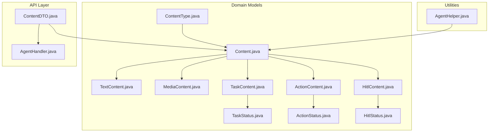
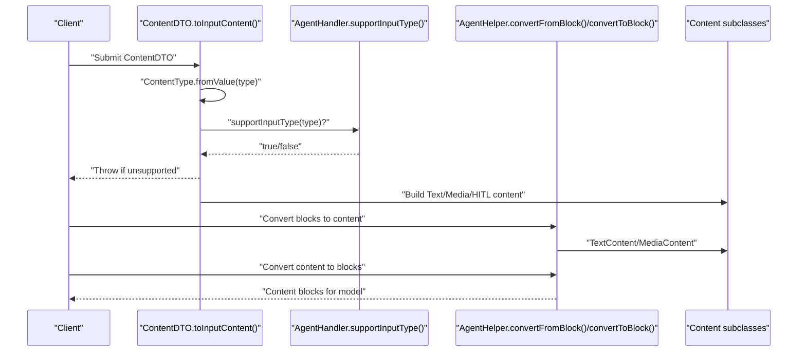
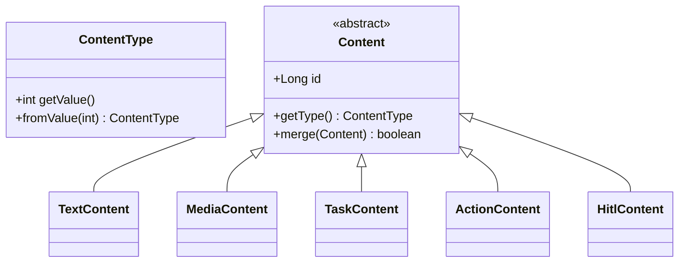
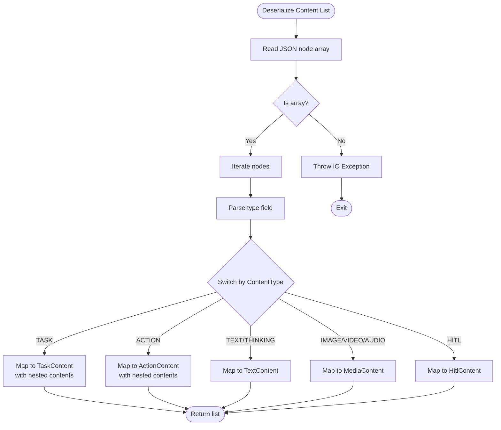
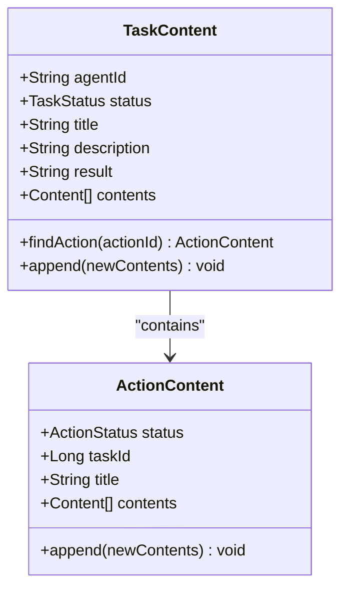
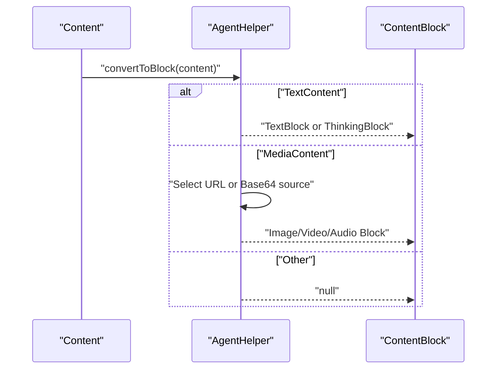
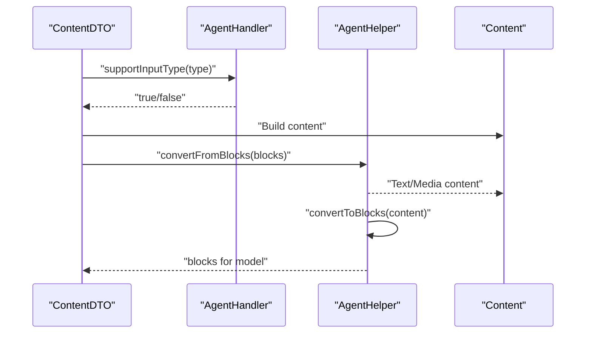
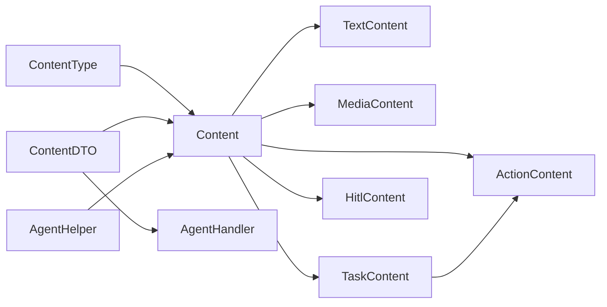

# Content Types and Processing Pipeline

<cite>
**Referenced Files in This Document**
- [ContentType.java](file://backend_java/core/src/main/java/com/aliyun/tam/x/tron/core/domain/models/contents/ContentType.java)
- [Content.java](file://backend_java/core/src/main/java/com/aliyun/tam/x/tron/core/domain/models/contents/Content.java)
- [TextContent.java](file://backend_java/core/src/main/java/com/aliyun/tam/x/tron/core/domain/models/contents/TextContent.java)
- [MediaContent.java](file://backend_java/core/src/main/java/com/aliyun/tam/x/tron/core/domain/models/contents/MediaContent.java)
- [TaskContent.java](file://backend_java/core/src/main/java/com/aliyun/tam/x/tron/core/domain/models/contents/TaskContent.java)
- [ActionContent.java](file://backend_java/core/src/main/java/com/aliyun/tam/x/tron/core/domain/models/contents/ActionContent.java)
- [HitlContent.java](file://backend_java/core/src/main/java/com/aliyun/tam/x/tron/core/domain/models/contents/HitlContent.java)
- [TaskStatus.java](file://backend_java/core/src/main/java/com/aliyun/tam/x/tron/core/domain/models/contents/TaskStatus.java)
- [ActionStatus.java](file://backend_java/core/src/main/java/com/aliyun/tam/x/tron/core/domain/models/contents/ActionStatus.java)
- [HitlStatus.java](file://backend_java/core/src/main/java/com/aliyun/tam/x/tron/core/domain/models/contents/HitlStatus.java)
- [AgentHelper.java](file://backend_java/core/src/main/java/com/aliyun/tam/x/tron/core/utils/AgentHelper.java)
- [ContentDTO.java](file://backend_java/api/src/main/java/com/aliyun/tam/x/tron/api/dto/ContentDTO.java)
- [AgentHandler.java](file://backend_java/core/src/main/java/com/aliyun/tam/x/tron/core/agents/AgentHandler.java)
- [develop_guide.md](file://docs/en/develop_guide.md)
</cite>

## Table of Contents
1. [Introduction](#introduction)
2. [Project Structure](#project-structure)
3. [Core Components](#core-components)
4. [Architecture Overview](#architecture-overview)
5. [Detailed Component Analysis](#detailed-component-analysis)
6. [Dependency Analysis](#dependency-analysis)
7. [Performance Considerations](#performance-considerations)
8. [Troubleshooting Guide](#troubleshooting-guide)
9. [Conclusion](#conclusion)
10. [Appendices](#appendices)

## Introduction
This document explains the content type system and processing pipeline used by Tron OneAgent. It covers the ContentType enumeration, the content model hierarchy, serialization/deserialization, validation and error handling, and the integration with the agent’s reasoning loop. Practical examples illustrate content processing, format conversion, and extension patterns for custom content types. Guidance is also provided for handling large media files, memory management, and best practices for validation and sanitization.

## Project Structure
The content system resides primarily in the core domain models and supporting utilities:
- Domain models define content types, statuses, and hierarchical content structures.
- Utilities convert between internal content models and external message blocks.
- DTOs bridge content models to API requests/responses and validate inputs.
- Agent handlers enforce content-type support and orchestrate processing.

**Diagram sources**
- [ContentType.java:26-34](file://backend_java/core/src/main/java/com/aliyun/tam/x/tron/core/domain/models/contents/ContentType.java#L26-L34)
- [Content.java:56-55](file://backend_java/core/src/main/java/com/aliyun/tam/x/tron/core/domain/models/contents/Content.java#L56-L55)
- [TextContent.java:31-35](file://backend_java/core/src/main/java/com/aliyun/tam/x/tron/core/domain/models/contents/TextContent.java#L31-L35)
- [MediaContent.java:34-39](file://backend_java/core/src/main/java/com/aliyun/tam/x/tron/core/domain/models/contents/MediaContent.java#L34-L39)
- [TaskContent.java:39-47](file://backend_java/core/src/main/java/com/aliyun/tam/x/tron/core/domain/models/contents/TaskContent.java#L39-L47)
- [ActionContent.java:39-48](file://backend_java/core/src/main/java/com/aliyun/tam/x/tron/core/domain/models/contents/ActionContent.java#L39-L48)
- [HitlContent.java:21-29](file://backend_java/core/src/main/java/com/aliyun/tam/x/tron/core/domain/models/contents/HitlContent.java#L21-L29)
- [TaskStatus.java:26-30](file://backend_java/core/src/main/java/com/aliyun/tam/x/tron/core/domain/models/contents/TaskStatus.java#L26-L30)
- [ActionStatus.java:26-29](file://backend_java/core/src/main/java/com/aliyun/tam/x/tron/core/domain/models/contents/ActionStatus.java#L26-L29)
- [HitlStatus.java:6-10](file://backend_java/core/src/main/java/com/aliyun/tam/x/tron/core/domain/models/contents/HitlStatus.java#L6-L10)
- [AgentHelper.java:46-78](file://backend_java/core/src/main/java/com/aliyun/tam/x/tron/core/utils/AgentHelper.java#L46-L78)
- [ContentDTO.java:133-165](file://backend_java/api/src/main/java/com/aliyun/tam/x/tron/api/dto/ContentDTO.java#L133-L165)
- [AgentHandler.java:41-43](file://backend_java/core/src/main/java/com/aliyun/tam/x/tron/core/agents/AgentHandler.java#L41-L43)

**Section sources**
- [ContentType.java:26-34](file://backend_java/core/src/main/java/com/aliyun/tam/x/tron/core/domain/models/contents/ContentType.java#L26-L34)
- [Content.java:56-55](file://backend_java/core/src/main/java/com/aliyun/tam/x/tron/core/domain/models/contents/Content.java#L56-L55)
- [AgentHelper.java:40-88](file://backend_java/core/src/main/java/com/aliyun/tam/x/tron/core/utils/AgentHelper.java#L40-L88)
- [ContentDTO.java:34-93](file://backend_java/api/src/main/java/com/aliyun/tam/x/tron/api/dto/ContentDTO.java#L34-L93)
- [AgentHandler.java:35-46](file://backend_java/core/src/main/java/com/aliyun/tam/x/tron/core/agents/AgentHandler.java#L35-L46)

## Core Components
- ContentType: Enumerates supported content categories and provides JSON serialization/deserialization via Jackson annotations.
- Content: Abstract base for all content types with polymorphic deserialization and merging capabilities.
- TextContent: Plain text or “thinking” text with merge semantics.
- MediaContent: Binary or URL-backed media with optional media type metadata.
- TaskContent: Hierarchical container for actions and nested content with timestamps and status.
- ActionContent: Action-level container with status and nested content.
- HitlContent: Human-in-the-loop content with status and optional properties/method/result.
- Status enums: TaskStatus, ActionStatus, HitlStatus define numeric codes for serialization.
- AgentHelper: Converts between internal content models and external message blocks.
- ContentDTO: Serializes content to/from API DTOs and validates input against agent handler support.

**Section sources**
- [ContentType.java:26-55](file://backend_java/core/src/main/java/com/aliyun/tam/x/tron/core/domain/models/contents/ContentType.java#L26-L55)
- [Content.java:56-146](file://backend_java/core/src/main/java/com/aliyun/tam/x/tron/core/domain/models/contents/Content.java#L56-L146)
- [TextContent.java:31-44](file://backend_java/core/src/main/java/com/aliyun/tam/x/tron/core/domain/models/contents/TextContent.java#L31-L44)
- [MediaContent.java:34-39](file://backend_java/core/src/main/java/com/aliyun/tam/x/tron/core/domain/models/contents/MediaContent.java#L34-L39)
- [TaskContent.java:39-89](file://backend_java/core/src/main/java/com/aliyun/tam/x/tron/core/domain/models/contents/TaskContent.java#L39-L89)
- [ActionContent.java:39-76](file://backend_java/core/src/main/java/com/aliyun/tam/x/tron/core/domain/models/contents/ActionContent.java#L39-L76)
- [HitlContent.java:21-36](file://backend_java/core/src/main/java/com/aliyun/tam/x/tron/core/domain/models/contents/HitlContent.java#L21-L36)
- [TaskStatus.java:26-50](file://backend_java/core/src/main/java/com/aliyun/tam/x/tron/core/domain/models/contents/TaskStatus.java#L26-L50)
- [ActionStatus.java:26-49](file://backend_java/core/src/main/java/com/aliyun/tam/x/tron/core/domain/models/contents/ActionStatus.java#L26-L49)
- [HitlStatus.java:6-29](file://backend_java/core/src/main/java/com/aliyun/tam/x/tron/core/domain/models/contents/HitlStatus.java#L6-L29)
- [AgentHelper.java:46-141](file://backend_java/core/src/main/java/com/aliyun/tam/x/tron/core/utils/AgentHelper.java#L46-L141)
- [ContentDTO.java:133-165](file://backend_java/api/src/main/java/com/aliyun/tam/x/tron/api/dto/ContentDTO.java#L133-L165)

## Architecture Overview
The content pipeline integrates serialization, polymorphic deserialization, and conversion utilities to feed the agent’s reasoning loop.

**Diagram sources**
- [ContentDTO.java:133-165](file://backend_java/api/src/main/java/com/aliyun/tam/x/tron/api/dto/ContentDTO.java#L133-L165)
- [AgentHandler.java:41-43](file://backend_java/core/src/main/java/com/aliyun/tam/x/tron/core/agents/AgentHandler.java#L41-L43)
- [AgentHelper.java:46-78](file://backend_java/core/src/main/java/com/aliyun/tam/x/tron/core/utils/AgentHelper.java#L46-L78)
- [TextContent.java:31-35](file://backend_java/core/src/main/java/com/aliyun/tam/x/tron/core/domain/models/contents/TextContent.java#L31-L35)
- [MediaContent.java:34-39](file://backend_java/core/src/main/java/com/aliyun/tam/x/tron/core/domain/models/contents/MediaContent.java#L34-L39)

## Detailed Component Analysis

### ContentType Enumeration and Mapping
- ContentType defines canonical integer codes for each content type and supports round-trip JSON serialization/deserialization.
- Polymorphic mapping in Content.java associates numeric codes with concrete content classes for Jackson deserialization.

**Diagram sources**
- [ContentType.java:26-55](file://backend_java/core/src/main/java/com/aliyun/tam/x/tron/core/domain/models/contents/ContentType.java#L26-L55)
- [Content.java:56-55](file://backend_java/core/src/main/java/com/aliyun/tam/x/tron/core/domain/models/contents/Content.java#L56-L55)
- [TextContent.java:31-35](file://backend_java/core/src/main/java/com/aliyun/tam/x/tron/core/domain/models/contents/TextContent.java#L31-L35)
- [MediaContent.java:34-39](file://backend_java/core/src/main/java/com/aliyun/tam/x/tron/core/domain/models/contents/MediaContent.java#L34-L39)
- [TaskContent.java:39-47](file://backend_java/core/src/main/java/com/aliyun/tam/x/tron/core/domain/models/contents/TaskContent.java#L39-L47)
- [ActionContent.java:39-48](file://backend_java/core/src/main/java/com/aliyun/tam/x/tron/core/domain/models/contents/ActionContent.java#L39-L48)
- [HitlContent.java:21-29](file://backend_java/core/src/main/java/com/aliyun/tam/x/tron/core/domain/models/contents/HitlContent.java#L21-L29)

**Section sources**
- [ContentType.java:26-55](file://backend_java/core/src/main/java/com/aliyun/tam/x/tron/core/domain/models/contents/ContentType.java#L26-L55)
- [Content.java:46-55](file://backend_java/core/src/main/java/com/aliyun/tam/x/tron/core/domain/models/contents/Content.java#L46-L55)

### Content Validation and Serialization
- ContentDTO serializes content to DTO fields and validates unknown types.
- ContentDTO.toInputContent enforces agent handler support for incoming content types.
- Content.ContentDeserializer handles polymorphic arrays of content with nested contents parsing.

**Diagram sources**
- [Content.java:71-146](file://backend_java/core/src/main/java/com/aliyun/tam/x/tron/core/domain/models/contents/Content.java#L71-L146)
- [ContentDTO.java:39-93](file://backend_java/api/src/main/java/com/aliyun/tam/x/tron/api/dto/ContentDTO.java#L39-L93)

**Section sources**
- [ContentDTO.java:133-165](file://backend_java/api/src/main/java/com/aliyun/tam/x/tron/api/dto/ContentDTO.java#L133-L165)
- [Content.java:71-146](file://backend_java/core/src/main/java/com/aliyun/tam/x/tron/core/domain/models/contents/Content.java#L71-L146)

### Processing Rules by Content Type
- TEXT: Plain text content; merges with adjacent text content of the same type.
- THINKING: Specialized text content for reasoning traces; mapped to a dedicated block type.
- IMAGE/VIDEO/AUDIO: Media content backed by URL or base64; includes media type metadata.
- TASK: Container with status, timestamps, and nested content; supports finding actions and appending content with merging.
- ACTION: Action-level container with status, timestamps, and nested content; supports appending content with merging.
- HITL: Human-in-the-loop content with status and optional properties/method/result.

**Diagram sources**
- [TaskContent.java:55-84](file://backend_java/core/src/main/java/com/aliyun/tam/x/tron/core/domain/models/contents/TaskContent.java#L55-L84)
- [ActionContent.java:57-71](file://backend_java/core/src/main/java/com/aliyun/tam/x/tron/core/domain/models/contents/ActionContent.java#L57-L71)

**Section sources**
- [TextContent.java:37-44](file://backend_java/core/src/main/java/com/aliyun/tam/x/tron/core/domain/models/contents/TextContent.java#L37-L44)
- [MediaContent.java:34-39](file://backend_java/core/src/main/java/com/aliyun/tam/x/tron/core/domain/models/contents/MediaContent.java#L34-L39)
- [TaskContent.java:55-84](file://backend_java/core/src/main/java/com/aliyun/tam/x/tron/core/domain/models/contents/TaskContent.java#L55-L84)
- [ActionContent.java:57-71](file://backend_java/core/src/main/java/com/aliyun/tam/x/tron/core/domain/models/contents/ActionContent.java#L57-L71)
- [HitlContent.java:21-36](file://backend_java/core/src/main/java/com/aliyun/tam/x/tron/core/domain/models/contents/HitlContent.java#L21-L36)

### Format Conversion Workflows
- AgentHelper converts between internal content models and external message blocks:
  - TextContent to TextBlock/ThinkingBlock
  - MediaContent to ImageBlock/VideoBlock/AudioBlock
  - MediaContent source selection based on URL/base64 presence

**Diagram sources**
- [AgentHelper.java:97-141](file://backend_java/core/src/main/java/com/aliyun/tam/x/tron/core/utils/AgentHelper.java#L97-L141)
- [TextContent.java:31-35](file://backend_java/core/src/main/java/com/aliyun/tam/x/tron/core/domain/models/contents/TextContent.java#L31-L35)
- [MediaContent.java:34-39](file://backend_java/core/src/main/java/com/aliyun/tam/x/tron/core/domain/models/contents/MediaContent.java#L34-L39)

**Section sources**
- [AgentHelper.java:46-141](file://backend_java/core/src/main/java/com/aliyun/tam/x/tron/core/utils/AgentHelper.java#L46-L141)

### Integration with the Agent’s Reasoning Loop
- AgentHandler.supportInputType controls whether a given ContentType is accepted.
- ContentDTO.toInputContent validates and constructs content instances, throwing on unsupported types.
- AgentHelper bridges content to model blocks for generation and streaming.

**Diagram sources**
- [AgentHandler.java:41-43](file://backend_java/core/src/main/java/com/aliyun/tam/x/tron/core/agents/AgentHandler.java#L41-L43)
- [ContentDTO.java:133-165](file://backend_java/api/src/main/java/com/aliyun/tam/x/tron/api/dto/ContentDTO.java#L133-L165)
- [AgentHelper.java:46-78](file://backend_java/core/src/main/java/com/aliyun/tam/x/tron/core/utils/AgentHelper.java#L46-L78)

**Section sources**
- [AgentHandler.java:35-46](file://backend_java/core/src/main/java/com/aliyun/tam/x/tron/core/agents/AgentHandler.java#L35-L46)
- [ContentDTO.java:133-165](file://backend_java/api/src/main/java/com/aliyun/tam/x/tron/api/dto/ContentDTO.java#L133-L165)
- [AgentHelper.java:46-78](file://backend_java/core/src/main/java/com/aliyun/tam/x/tron/core/utils/AgentHelper.java#L46-L78)

### Practical Examples
- Converting content to blocks for model consumption:
  - TextContent to TextBlock or ThinkingBlock based on type.
  - MediaContent to Image/Video/Audio block depending on type and source availability.
- Building content from blocks:
  - Mapping external blocks back to TextContent or MediaContent.
- Constructing input content from DTO:
  - Validating type support via AgentHandler and building appropriate content instances.

**Section sources**
- [AgentHelper.java:46-141](file://backend_java/core/src/main/java/com/aliyun/tam/x/tron/core/utils/AgentHelper.java#L46-L141)
- [ContentDTO.java:133-165](file://backend_java/api/src/main/java/com/aliyun/tam/x/tron/api/dto/ContentDTO.java#L133-L165)

### Custom Content Type Extensions
- Extend the system by adding a new ContentType value and a corresponding content class extending Content.
- Register the new type in Content.java with a JsonSubTypes entry and ensure ContentDeserializer handles nested contents if applicable.
- Add mapping in AgentHelper.convertFromBlock/convertToBlock to support model block conversions.
- Ensure ContentDTO supports serialization/deserialization and ContentDTO.toInputContent validates support via AgentHandler.

**Section sources**
- [ContentType.java:26-55](file://backend_java/core/src/main/java/com/aliyun/tam/x/tron/core/domain/models/contents/ContentType.java#L26-L55)
- [Content.java:46-55](file://backend_java/core/src/main/java/com/aliyun/tam/x/tron/core/domain/models/contents/Content.java#L46-L55)
- [AgentHelper.java:46-78](file://backend_java/core/src/main/java/com/aliyun/tam/x/tron/core/utils/AgentHelper.java#L46-L78)
- [ContentDTO.java:39-93](file://backend_java/api/src/main/java/com/aliyun/tam/x/tron/api/dto/ContentDTO.java#L39-L93)

## Dependency Analysis
- Content is the root abstraction with Jackson annotations enabling polymorphic deserialization.
- TaskContent and ActionContent embed lists of Content with recursive parsing via ContentDeserializer.
- AgentHelper depends on external message block types to bridge content models.
- ContentDTO depends on AgentHandler to validate supported input types.

**Diagram sources**
- [Content.java:56-55](file://backend_java/core/src/main/java/com/aliyun/tam/x/tron/core/domain/models/contents/Content.java#L56-L55)
- [TaskContent.java:55-65](file://backend_java/core/src/main/java/com/aliyun/tam/x/tron/core/domain/models/contents/TaskContent.java#L55-L65)
- [ActionContent.java:57-71](file://backend_java/core/src/main/java/com/aliyun/tam/x/tron/core/domain/models/contents/ActionContent.java#L57-L71)
- [ContentDTO.java:133-165](file://backend_java/api/src/main/java/com/aliyun/tam/x/tron/api/dto/ContentDTO.java#L133-L165)
- [AgentHandler.java:41-43](file://backend_java/core/src/main/java/com/aliyun/tam/x/tron/core/agents/AgentHandler.java#L41-L43)
- [AgentHelper.java:46-78](file://backend_java/core/src/main/java/com/aliyun/tam/x/tron/core/utils/AgentHelper.java#L46-L78)

**Section sources**
- [develop_guide.md:174-298](file://docs/en/develop_guide.md#L174-L298)

## Performance Considerations
- Large media files:
  - Prefer URL-backed MediaContent to avoid large base64 payloads in DTOs.
  - Use streaming or chunked processing when integrating with external media services.
- Memory management:
  - Avoid deep-copying large JSON nodes unnecessarily; ContentDeserializer minimizes copies by removing nested contents prior to mapping.
  - Limit nested content depth to reduce recursion overhead.
- Serialization overhead:
  - Reuse ObjectMapper instances where possible and configure date/time modules centrally.
- Network efficiency:
  - For media, transmit URLs when feasible; encode only when required.

[No sources needed since this section provides general guidance]

## Troubleshooting Guide
- Unsupported content type:
  - ContentDTO.toInputContent throws if AgentHandler.supportInputType returns false for the given type.
- Unknown content type during deserialization:
  - Content.ContentDeserializer throws if the type value is not recognized.
- Malformed content arrays:
  - Content.ContentDeserializer throws if the payload is not an array during list deserialization.
- Status enum deserialization errors:
  - TaskStatus, ActionStatus, HitlStatus throw on unknown numeric values.

**Section sources**
- [ContentDTO.java:133-165](file://backend_java/api/src/main/java/com/aliyun/tam/x/tron/api/dto/ContentDTO.java#L133-L165)
- [Content.java:86-96](file://backend_java/core/src/main/java/com/aliyun/tam/x/tron/core/domain/models/contents/Content.java#L86-L96)
- [TaskStatus.java:43-50](file://backend_java/core/src/main/java/com/aliyun/tam/x/tron/core/domain/models/contents/TaskStatus.java#L43-L50)
- [ActionStatus.java:42-49](file://backend_java/core/src/main/java/com/aliyun/tam/x/tron/core/domain/models/contents/ActionStatus.java#L42-L49)
- [HitlStatus.java:22-29](file://backend_java/core/src/main/java/com/aliyun/tam/x/tron/core/domain/models/contents/HitlStatus.java#L22-L29)

## Conclusion
The content type system in Tron OneAgent provides a robust, extensible foundation for handling diverse content forms. Through ContentType, Content, and specialized subclasses, it supports polymorphic serialization/deserialization, nested content composition, and seamless integration with the agent’s reasoning loop. By following the validation and conversion patterns outlined here, developers can implement custom content types, optimize for large media, and maintain safe, efficient processing.

[No sources needed since this section summarizes without analyzing specific files]

## Appendices
- Conceptual model hierarchy and event-driven updates are illustrated in the development guide.

**Section sources**
- [develop_guide.md:174-298](file://docs/en/develop_guide.md#L174-L298)