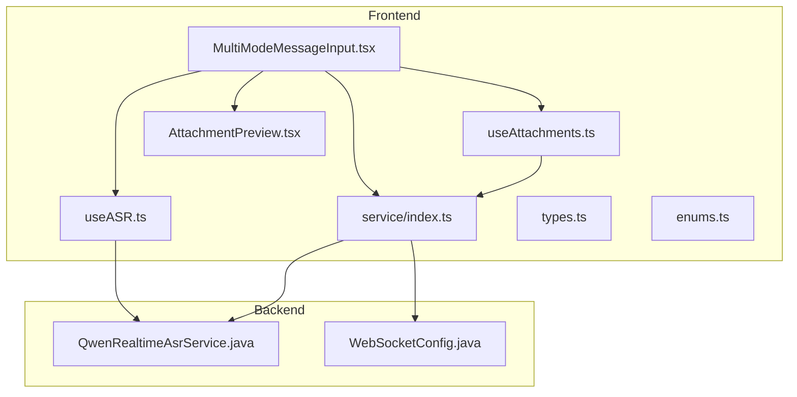
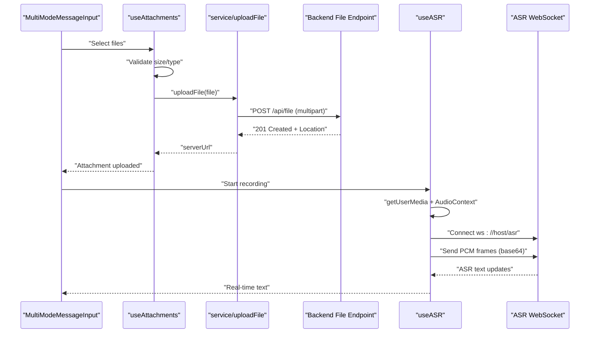
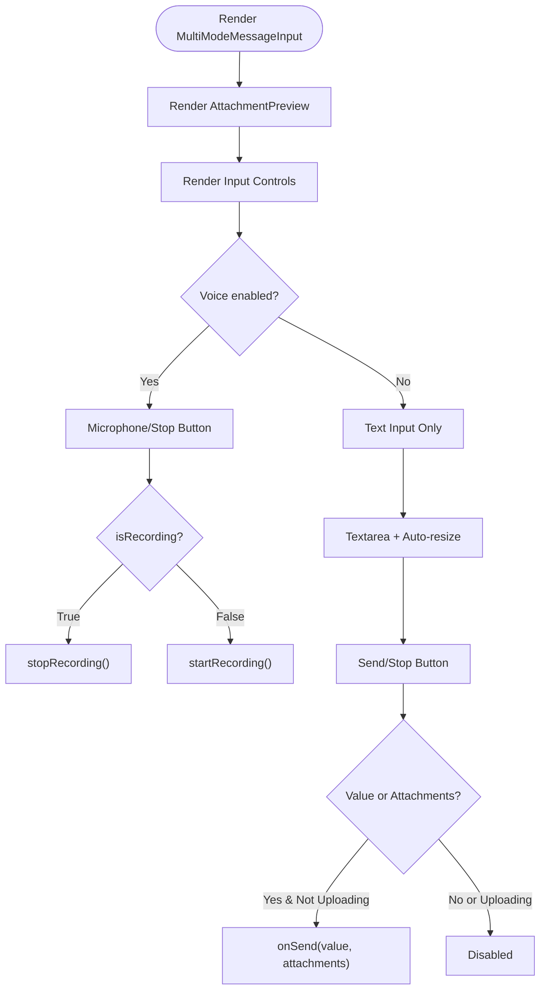
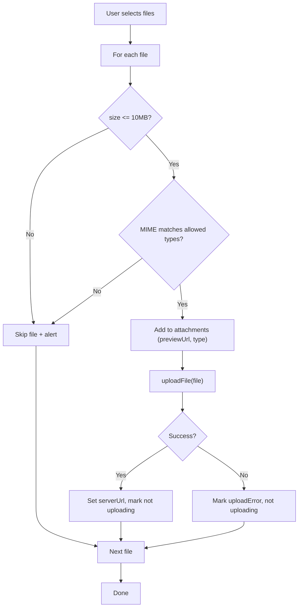
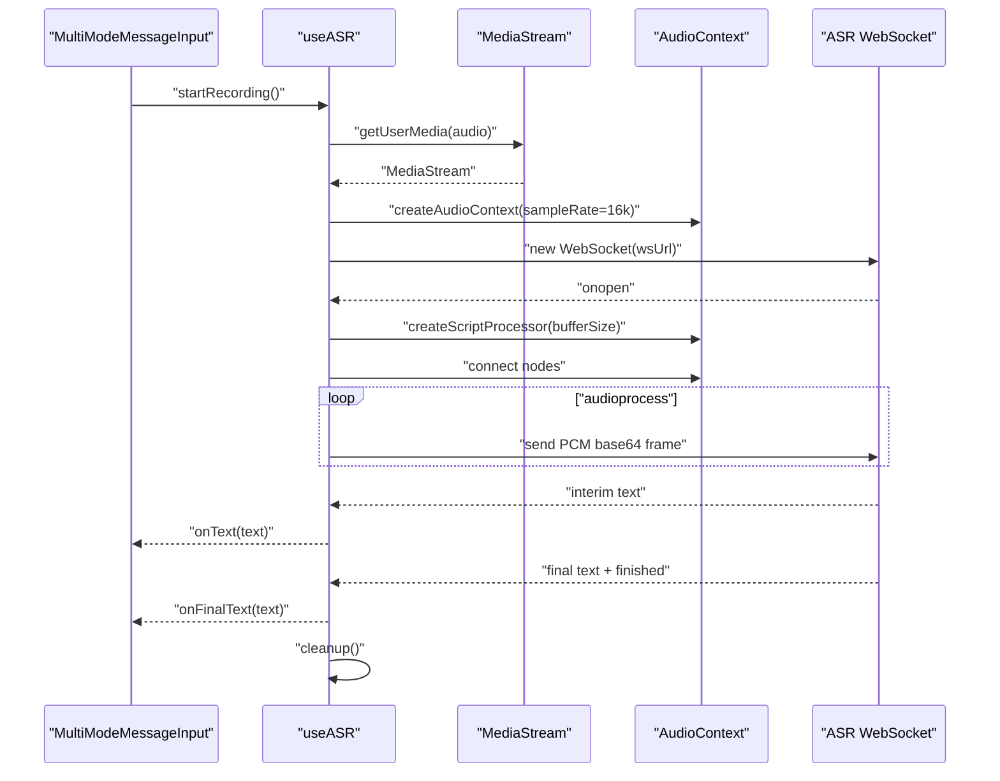
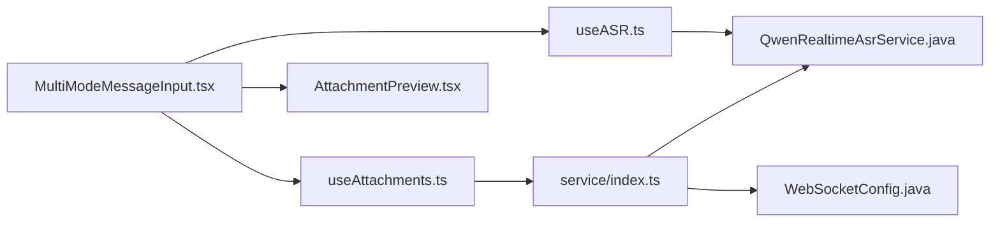

# Frontend Multimodal Input Integration

<cite>
**Referenced Files in This Document**
- [MultiModeMessageInput.tsx](file://frontend/packages/chatbox/extends/ChatBox/MessageInput/MultiModeMessageInput.tsx)
- [useAttachments.ts](file://frontend/packages/chatbox/extends/ChatBox/MessageInput/hooks/useAttachments.ts)
- [useASR.ts](file://frontend/packages/chatbox/extends/ChatBox/MessageInput/hooks/useASR.ts)
- [AttachmentPreview.tsx](file://frontend/packages/chatbox/extends/ChatBox/MessageInput/components/AttachmentPreview.tsx)
- [types.ts](file://frontend/packages/chatbox/extends/ChatBox/MessageInput/types.ts)
- [enums.ts](file://frontend/packages/chatbox/types/enums.ts)
- [index.ts](file://frontend/packages/chatbox/extends/ChatBox/MessageInput/index.tsx)
- [service/index.ts](file://frontend/packages/chatbox/extends/service/index.ts)
- [QwenRealtimeAsrService.java](file://backend_java/core/src/main/java/com/aliyun/tam/x/tron/core/asr/QwenRealtimeAsrService.java)
- [WebSocketConfig.java](file://backend_java/bootstrap/src/main/java/com/aliyun/tam/x/tron/config/WebSocketConfig.java)
</cite>

## Table of Contents
1. [Introduction](#introduction)
2. [Project Structure](#project-structure)
3. [Core Components](#core-components)
4. [Architecture Overview](#architecture-overview)
5. [Detailed Component Analysis](#detailed-component-analysis)
6. [Dependency Analysis](#dependency-analysis)
7. [Performance Considerations](#performance-considerations)
8. [Troubleshooting Guide](#troubleshooting-guide)
9. [Conclusion](#conclusion)
10. [Appendices](#appendices)

## Introduction
This document explains the frontend multimodal input integration for a React-based chat interface. It focuses on the MultiModeMessageInput component, media upload handling, and real-time audio recording via WebRTC and WebSocket streaming. It also documents how frontend input components integrate with backend services, including WebSocket communication for streaming audio/video, media capture workflows, file format validation, upload progress tracking, and error handling for failed uploads. Practical guidance is included for building custom input components, handling different media types, optimizing user experience across devices, and integrating with the agent’s conversation state. Browser compatibility, performance optimization for large media files, and accessibility features are addressed.

## Project Structure
The multimodal input feature resides in the frontend chatbox package and integrates with backend WebSocket endpoints and file upload APIs. The key areas are:
- Message input components and hooks for attachments, ASR, and composition
- Service layer for file upload and streaming chat
- Backend ASR service and WebSocket configuration

**Diagram sources**
- [MultiModeMessageInput.tsx:30-201](file://frontend/packages/chatbox/extends/ChatBox/MessageInput/MultiModeMessageInput.tsx#L30-L201)
- [useAttachments.ts:25-131](file://frontend/packages/chatbox/extends/ChatBox/MessageInput/hooks/useAttachments.ts#L25-L131)
- [useASR.ts:44-280](file://frontend/packages/chatbox/extends/ChatBox/MessageInput/hooks/useASR.ts#L44-L280)
- [AttachmentPreview.tsx:27-68](file://frontend/packages/chatbox/extends/ChatBox/MessageInput/components/AttachmentPreview.tsx#L27-L68)
- [service/index.ts:158-191](file://frontend/packages/chatbox/extends/service/index.ts#L158-L191)
- [QwenRealtimeAsrService.java:36-149](file://backend_java/core/src/main/java/com/aliyun/tam/x/tron/core/asr/QwenRealtimeAsrService.java#L36-L149)
- [WebSocketConfig.java:24-37](file://backend_java/bootstrap/src/main/java/com/aliyun/tam/x/tron/config/WebSocketConfig.java#L24-L37)

**Section sources**
- [MultiModeMessageInput.tsx:30-201](file://frontend/packages/chatbox/extends/ChatBox/MessageInput/MultiModeMessageInput.tsx#L30-L201)
- [index.ts:18-31](file://frontend/packages/chatbox/extends/ChatBox/MessageInput/index.tsx#L18-L31)

## Core Components
- MultiModeMessageInput: Orchestrates text input, attachment previews, voice button, and send/stop actions. Integrates hooks for auto-resize, composition handling, attachments, and ASR.
- useAttachments: Manages file selection, validation, preview generation, upload, and removal with progress/error states.
- useASR: Handles microphone access, MediaRecorder/AudioContext pipeline, WebSocket streaming of PCM frames, and real-time text updates.
- AttachmentPreview: Renders image/video previews with overlay indicators for upload progress and errors.
- Service layer: Provides uploadFile, createChatStream, createWsChatConnection, and configuration helpers.
- Types and enums: Define AttachmentItem, VoiceInputMode, VoiceInputConfig, and ContentType.

**Section sources**
- [MultiModeMessageInput.tsx:28-201](file://frontend/packages/chatbox/extends/ChatBox/MessageInput/MultiModeMessageInput.tsx#L28-L201)
- [useAttachments.ts:25-131](file://frontend/packages/chatbox/extends/ChatBox/MessageInput/hooks/useAttachments.ts#L25-L131)
- [useASR.ts:44-280](file://frontend/packages/chatbox/extends/ChatBox/MessageInput/hooks/useASR.ts#L44-L280)
- [AttachmentPreview.tsx:27-68](file://frontend/packages/chatbox/extends/ChatBox/MessageInput/components/AttachmentPreview.tsx#L27-L68)
- [types.ts:20-68](file://frontend/packages/chatbox/extends/ChatBox/MessageInput/types.ts#L20-L68)
- [enums.ts:60-70](file://frontend/packages/chatbox/types/enums.ts#L60-L70)
- [service/index.ts:158-191](file://frontend/packages/chatbox/extends/service/index.ts#L158-L191)

## Architecture Overview
The multimodal input architecture connects the user interface to backend services through:
- File uploads via multipart/form-data to a dedicated file endpoint
- Real-time audio streaming via WebSocket to an ASR service
- Conversation streaming via SSE or WebSocket JSON-RPC for agent responses

**Diagram sources**
- [MultiModeMessageInput.tsx:65-136](file://frontend/packages/chatbox/extends/ChatBox/MessageInput/MultiModeMessageInput.tsx#L65-L136)
- [useAttachments.ts:33-107](file://frontend/packages/chatbox/extends/ChatBox/MessageInput/hooks/useAttachments.ts#L33-L107)
- [service/index.ts:158-191](file://frontend/packages/chatbox/extends/service/index.ts#L158-L191)
- [useASR.ts:136-249](file://frontend/packages/chatbox/extends/ChatBox/MessageInput/hooks/useASR.ts#L136-L249)

## Detailed Component Analysis

### MultiModeMessageInput Component
Responsibilities:
- Render textarea with auto-resize and composition handling
- Manage voice input toggle and status
- Control attachment selection and preview
- Send combined text and attachments or trigger stop action
- Disable controls during uploads or while recording

Key behaviors:
- Accept attribute computed from supported content types
- Upload progress tracked via attachment state
- Real-time ASR text updates applied to textarea when in text mode
- Send button disabled when uploading or recording

**Diagram sources**
- [MultiModeMessageInput.tsx:30-136](file://frontend/packages/chatbox/extends/ChatBox/MessageInput/MultiModeMessageInput.tsx#L30-L136)

**Section sources**
- [MultiModeMessageInput.tsx:30-201](file://frontend/packages/chatbox/extends/ChatBox/MessageInput/MultiModeMessageInput.tsx#L30-L201)

### Attachment Management Hook (useAttachments)
Responsibilities:
- Trigger native file picker
- Validate file size and MIME type against allowed types
- Create object URLs for previews
- Upload immediately after selection
- Track upload progress and errors per attachment
- Clean up object URLs on removal/clear

Validation and limits:
- Max file size enforced
- Allowed types mapped to content types
- Oversized files reported and skipped

Upload flow:
- For each valid file, upload via service.uploadFile
- Update attachment state with serverUrl or error flag
- Clear input value after processing

**Diagram sources**
- [useAttachments.ts:33-107](file://frontend/packages/chatbox/extends/ChatBox/MessageInput/hooks/useAttachments.ts#L33-L107)
- [service/index.ts:158-191](file://frontend/packages/chatbox/extends/service/index.ts#L158-L191)

**Section sources**
- [useAttachments.ts:25-131](file://frontend/packages/chatbox/extends/ChatBox/MessageInput/hooks/useAttachments.ts#L25-L131)
- [enums.ts:60-70](file://frontend/packages/chatbox/types/enums.ts#L60-L70)

### Real-Time Speech Recognition Hook (useASR)
Responsibilities:
- Acquire microphone permission
- Build audio pipeline using AudioContext and ScriptProcessorNode
- Stream PCM frames over WebSocket to backend ASR
- Parse ASR responses for interim and final text
- Manage lifecycle: connecting, recording, processing, idle, error

WebSocket integration:
- Connect to wsUrl or default ws://host/asr
- On open, switch to recording and start capturing audio
- On message, update interim text and finalize on completion
- On error/close, clean up resources and report status

**Diagram sources**
- [useASR.ts:136-249](file://frontend/packages/chatbox/extends/ChatBox/MessageInput/hooks/useASR.ts#L136-L249)
- [MultiModeMessageInput.tsx:50-74](file://frontend/packages/chatbox/extends/ChatBox/MessageInput/MultiModeMessageInput.tsx#L50-L74)

**Section sources**
- [useASR.ts:44-280](file://frontend/packages/chatbox/extends/ChatBox/MessageInput/hooks/useASR.ts#L44-L280)

### Attachment Preview Component
Responsibilities:
- Render image/video thumbnails
- Show overlays for upload progress and errors
- Provide remove action per attachment

**Section sources**
- [AttachmentPreview.tsx:27-68](file://frontend/packages/chatbox/extends/ChatBox/MessageInput/components/AttachmentPreview.tsx#L27-L68)

### Service Layer Integration
- uploadFile: Posts FormData to /api/file and reads Location header for the server URL
- createChatStream: SSE-based streaming for agent responses
- createWsChatConnection: JSON-RPC over WebSocket for session events and cancellation

**Section sources**
- [service/index.ts:158-191](file://frontend/packages/chatbox/extends/service/index.ts#L158-L191)
- [service/index.ts:338-401](file://frontend/packages/chatbox/extends/service/index.ts#L338-L401)
- [service/index.ts:458-586](file://frontend/packages/chatbox/extends/service/index.ts#L458-L586)

### Backend ASR Integration
- QwenRealtimeAsrService: Manages a realtime conversation with the provider, emitting interim and final text, and handling errors
- WebSocketConfig: Exposes WebSocket endpoints for the application

**Section sources**
- [QwenRealtimeAsrService.java:36-149](file://backend_java/core/src/main/java/com/aliyun/tam/x/tron/core/asr/QwenRealtimeAsrService.java#L36-L149)
- [WebSocketConfig.java:24-37](file://backend_java/bootstrap/src/main/java/com/aliyun/tam/x/tron/config/WebSocketConfig.java#L24-L37)

## Dependency Analysis
- MultiModeMessageInput depends on:
  - useAttachments for file handling
  - useASR for voice input
  - AttachmentPreview for rendering
  - service.uploadFile for uploads
- useASR depends on:
  - browser MediaDevices and AudioContext
  - WebSocket endpoint for ASR
- Backend depends on:
  - WebSocketConfig exposing endpoints
  - QwenRealtimeAsrService processing audio streams

**Diagram sources**
- [MultiModeMessageInput.tsx:30-201](file://frontend/packages/chatbox/extends/ChatBox/MessageInput/MultiModeMessageInput.tsx#L30-L201)
- [useAttachments.ts:25-131](file://frontend/packages/chatbox/extends/ChatBox/MessageInput/hooks/useAttachments.ts#L25-L131)
- [useASR.ts:44-280](file://frontend/packages/chatbox/extends/ChatBox/MessageInput/hooks/useASR.ts#L44-L280)
- [AttachmentPreview.tsx:27-68](file://frontend/packages/chatbox/extends/ChatBox/MessageInput/components/AttachmentPreview.tsx#L27-L68)
- [service/index.ts:158-191](file://frontend/packages/chatbox/extends/service/index.ts#L158-L191)
- [QwenRealtimeAsrService.java:36-149](file://backend_java/core/src/main/java/com/aliyun/tam/x/tron/core/asr/QwenRealtimeAsrService.java#L36-L149)
- [WebSocketConfig.java:24-37](file://backend_java/bootstrap/src/main/java/com/aliyun/tam/x/tron/config/WebSocketConfig.java#L24-L37)

**Section sources**
- [index.ts:18-31](file://frontend/packages/chatbox/extends/ChatBox/MessageInput/index.tsx#L18-L31)

## Performance Considerations
- Audio streaming:
  - Buffer size tuned to balance latency and payload size
  - 16 kHz mono audio with 16-bit PCM conversion
  - Base64 encoding increases size by ~33%; consider binary framing if supported by backend
- File uploads:
  - 10 MB limit prevents excessive memory usage
  - Immediate upload per file reduces UI state complexity
  - Consider chunked uploads for very large files if needed
- Rendering:
  - Object URLs for previews avoid holding large blobs in state
  - Cleanup on removal prevents memory leaks
- Network:
  - WebSocket connection reused for ASR; ensure keep-alive and reconnection strategies
  - SSE streaming for agent responses avoids polling overhead

[No sources needed since this section provides general guidance]

## Troubleshooting Guide
Common issues and resolutions:
- Microphone permission denied:
  - Ensure HTTPS context and proper prompt handling
  - Fallback to text input mode
- WebSocket connection failures:
  - Verify wsUrl and CORS/proxy configuration
  - Check backend WebSocketConfig availability
- Upload failures:
  - Confirm /api/file endpoint availability and authentication headers
  - Inspect Location header presence in response
- Large files:
  - Enforce client-side size checks and inform users
  - Consider server-side quotas and timeouts
- Real-time text not updating:
  - Validate ASR service configuration and API key
  - Confirm interim text events are being emitted

**Section sources**
- [useASR.ts:230-248](file://frontend/packages/chatbox/extends/ChatBox/MessageInput/hooks/useASR.ts#L230-L248)
- [service/index.ts:172-191](file://frontend/packages/chatbox/extends/service/index.ts#L172-L191)
- [QwenRealtimeAsrService.java:85-96](file://backend_java/core/src/main/java/com/aliyun/tam/x/tron/core/asr/QwenRealtimeAsrService.java#L85-L96)

## Conclusion
The frontend multimodal input integrates text, media, and real-time speech through modular React components and hooks. It leverages browser APIs for media capture and WebSocket streaming, with a robust service layer for uploads and agent interactions. The design balances usability, performance, and reliability, with clear separation of concerns and extensibility for future enhancements.

[No sources needed since this section summarizes without analyzing specific files]

## Appendices

### Practical Examples and Best Practices
- Implementing custom input components:
  - Extend BaseMessageInputProps and reuse hooks for attachments and ASR
  - Respect disabled and running states to prevent conflicting operations
- Handling different media types:
  - Use supportInputTypes to restrict accepted files
  - Render appropriate previews (image/video/audio)
- Device optimization:
  - Detect low-end devices and reduce buffer sizes or disable features
  - Provide fallbacks for unsupported browsers
- Accessibility:
  - Ensure focus management and keyboard navigation for textarea and buttons
  - Announce upload progress and errors to assistive technologies
  - Provide clear labels for microphone and attachment actions

[No sources needed since this section provides general guidance]