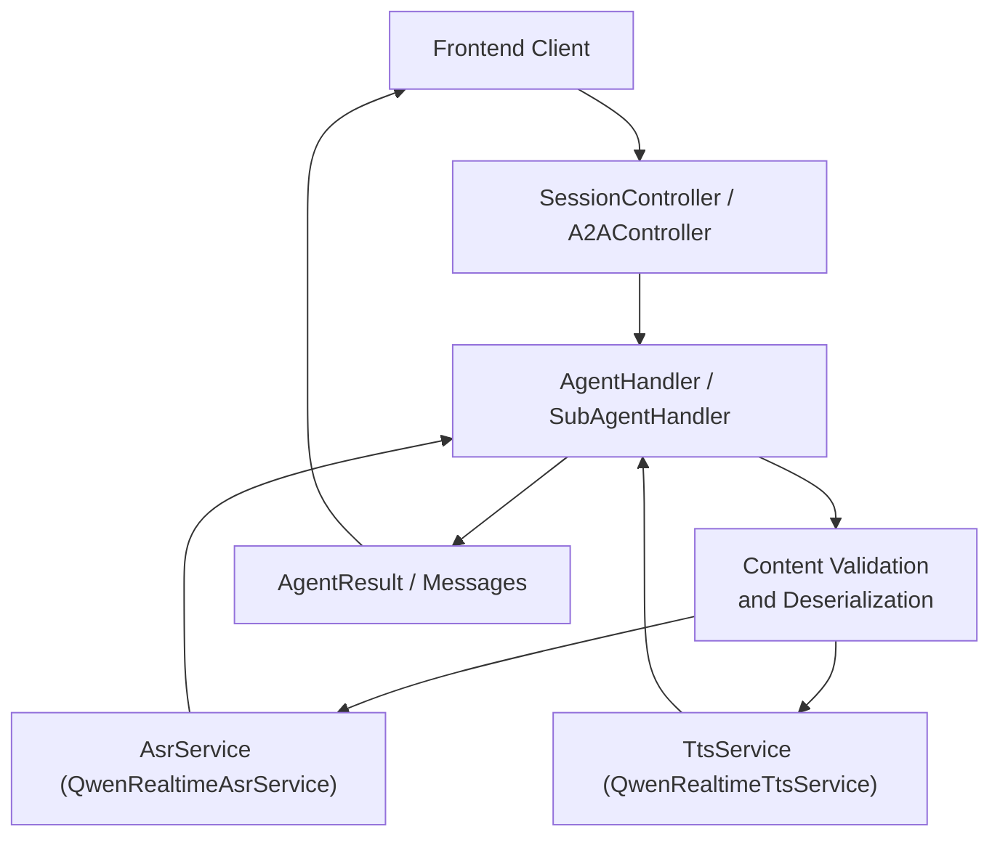
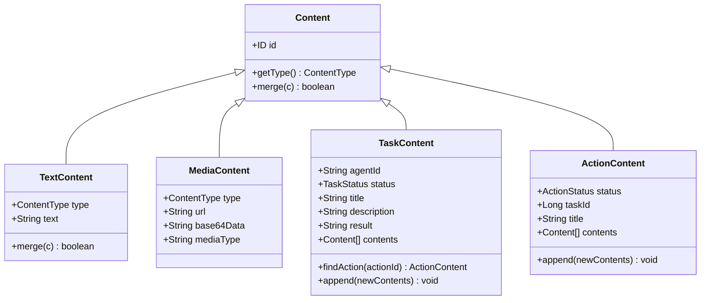
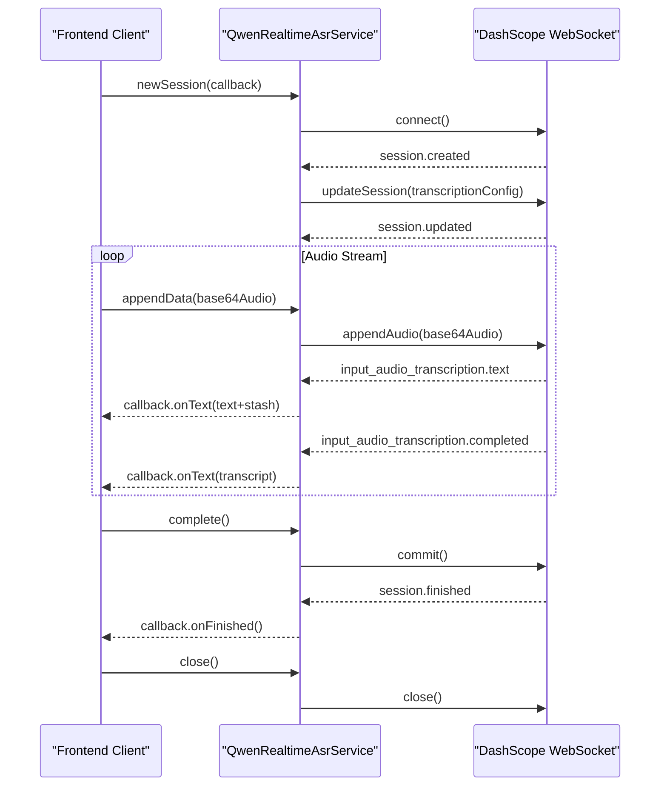
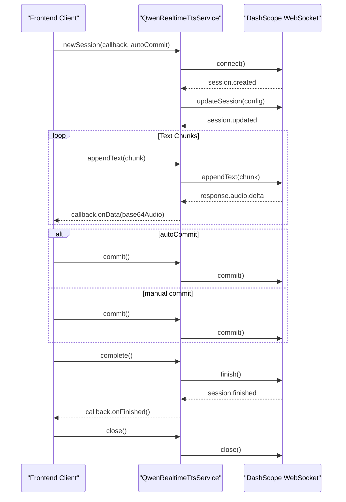
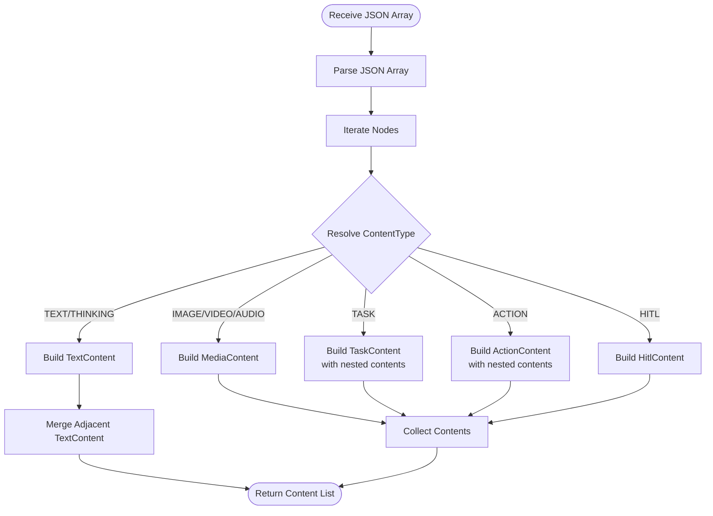
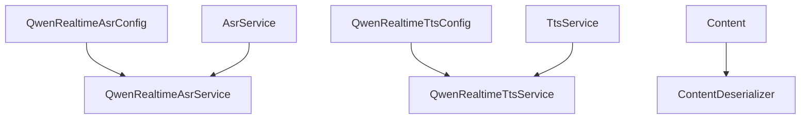

# Multimodal Conversation System

<cite>
**Referenced Files in This Document**
- [application.yaml](file://backend_java/bootstrap/src/main/resources/application.yaml)
- [QwenRealtimeAsrConfig.java](file://backend_java/core/src/main/java/com/aliyun/tam/x/tron/core/asr/QwenRealtimeAsrConfig.java)
- [QwenRealtimeAsrService.java](file://backend_java/core/src/main/java/com/aliyun/tam/x/tron/core/asr/QwenRealtimeAsrService.java)
- [AsrService.java](file://backend_java/core/src/main/java/com/aliyun/tam/x/tron/core/asr/AsrService.java)
- [QwenRealtimeTtsConfig.java](file://backend_java/core/src/main/java/com/aliyun/tam/x/tron/core/tts/QwenRealtimeTtsConfig.java)
- [QwenRealtimeTtsService.java](file://backend_java/core/src/main/java/com/aliyun/tam/x/tron/core/tts/QwenRealtimeTtsService.java)
- [TtsService.java](file://backend_java/core/src/main/java/com/aliyun/tam/x/tron/core/tts/TtsService.java)
- [Content.java](file://backend_java/core/src/main/java/com/aliyun/tam/x/tron/core/domain/models/contents/Content.java)
- [ContentType.java](file://backend_java/core/src/main/java/com/aliyun/tam/x/tron/core/domain/models/contents/ContentType.java)
- [MediaContent.java](file://backend_java/core/src/main/java/com/aliyun/tam/x/tron/core/domain/models/contents/MediaContent.java)
- [TextContent.java](file://backend_java/core/src/main/java/com/aliyun/tam/x/tron/core/domain/models/contents/TextContent.java)
- [ActionContent.java](file://backend_java/core/src/main/java/com/aliyun/tam/x/tron/core/domain/models/contents/ActionContent.java)
- [TaskContent.java](file://backend_java/core/src/main/java/com/aliyun/tam/x/tron/core/domain/models/contents/TaskContent.java)
</cite>

## Table of Contents
1. [Introduction](#introduction)
2. [Project Structure](#project-structure)
3. [Core Components](#core-components)
4. [Architecture Overview](#architecture-overview)
5. [Detailed Component Analysis](#detailed-component-analysis)
6. [Dependency Analysis](#dependency-analysis)
7. [Performance Considerations](#performance-considerations)
8. [Troubleshooting Guide](#troubleshooting-guide)
9. [Conclusion](#conclusion)
10. [Appendices](#appendices)

## Introduction
This document describes the multimodal conversation system in Tron OneAgent, focusing on content type support (text, image, video, audio), real-time speech recognition (ASR) and text-to-speech (TTS) powered by Alibaba Cloud DashScope services, input processing pipelines, content validation and format conversion, and the integration between frontend multimodal input components and backend processing services. It also provides practical guidance for handling different media types, configuring ASR/TTS parameters, implementing custom content processors, optimizing performance, handling errors, and ensuring a smooth user experience.

## Project Structure
The multimodal capabilities are primarily implemented in the Java backend module under the core domain and services packages. Configuration for ASR/TTS is provided via Spring Boot configuration properties. The application YAML defines environment-driven settings such as API keys and storage providers.

```mermaid
graph TB
subgraph "Bootstrap"
APP["application.yaml"]
end
subgraph "Core Domain"
CT["ContentType.java"]
CNT["Content.java"]
TXT["TextContent.java"]
MED["MediaContent.java"]
ACT["ActionContent.java"]
TSK["TaskContent.java"]
end
subgraph "ASR"
ASRCFG["QwenRealtimeAsrConfig.java"]
ASR["QwenRealtimeAsrService.java"]
ASRI["AsrService.java"]
end
subgraph "TTS"
TTSCFG["QwenRealtimeTtsConfig.java"]
TTS["QwenRealtimeTtsService.java"]
TTSS["TtsService.java"]
end
APP --> ASRCFG
APP --> TTSCFG
ASRCFG --> ASR
TTSCFG --> TTS
CNT --> TXT
CNT --> MED
CNT --> ACT
CNT --> TSK
ASRI --> ASR
TTSS --> TTS
```

**Diagram sources**
- [application.yaml:1-63](file://backend_java/bootstrap/src/main/resources/application.yaml#L1-L63)
- [QwenRealtimeAsrConfig.java:1-55](file://backend_java/core/src/main/java/com/aliyun/tam/x/tron/core/asr/QwenRealtimeAsrConfig.java#L1-L55)
- [QwenRealtimeAsrService.java:1-149](file://backend_java/core/src/main/java/com/aliyun/tam/x/tron/core/asr/QwenRealtimeAsrService.java#L1-L149)
- [AsrService.java:1-32](file://backend_java/core/src/main/java/com/aliyun/tam/x/tron/core/asr/AsrService.java#L1-L32)
- [QwenRealtimeTtsConfig.java:1-63](file://backend_java/core/src/main/java/com/aliyun/tam/x/tron/core/tts/QwenRealtimeTtsConfig.java#L1-L63)
- [QwenRealtimeTtsService.java:1-165](file://backend_java/core/src/main/java/com/aliyun/tam/x/tron/core/tts/QwenRealtimeTtsService.java#L1-L165)
- [TtsService.java:1-32](file://backend_java/core/src/main/java/com/aliyun/tam/x/tron/core/tts/TtsService.java#L1-L32)
- [Content.java:1-148](file://backend_java/core/src/main/java/com/aliyun/tam/x/tron/core/domain/models/contents/Content.java#L1-L148)
- [ContentType.java:1-57](file://backend_java/core/src/main/java/com/aliyun/tam/x/tron/core/domain/models/contents/ContentType.java#L1-L57)
- [TextContent.java:1-46](file://backend_java/core/src/main/java/com/aliyun/tam/x/tron/core/domain/models/contents/TextContent.java#L1-L46)
- [MediaContent.java:1-40](file://backend_java/core/src/main/java/com/aliyun/tam/x/tron/core/domain/models/contents/MediaContent.java#L1-L40)
- [ActionContent.java:1-78](file://backend_java/core/src/main/java/com/aliyun/tam/x/tron/core/domain/models/contents/ActionContent.java#L1-L78)
- [TaskContent.java:1-91](file://backend_java/core/src/main/java/com/aliyun/tam/x/tron/core/domain/models/contents/TaskContent.java#L1-L91)

**Section sources**
- [application.yaml:1-63](file://backend_java/bootstrap/src/main/resources/application.yaml#L1-L63)

## Core Components
- Content model hierarchy supporting structured multimodal messages:
  - Base content abstraction with polymorphic deserialization.
  - Concrete content types: text, media (image/video/audio), task, action, and HITL.
- ASR subsystem for real-time speech-to-text via Alibaba Cloud DashScope.
- TTS subsystem for real-time text-to-speech with configurable audio output.
- Configuration-driven wiring of ASR/TTS services via Spring Boot properties.

Key responsibilities:
- ContentType defines supported modalities and numeric identifiers.
- Content provides polymorphic JSON binding and merging semantics.
- MediaContent encapsulates media metadata and payload representation.
- TextContent supports concatenative merging for streaming text.
- ActionContent and TaskContent support nested content aggregation and lifecycle timestamps.
- ASR/TTS services expose session-based APIs for streaming audio/text and callbacks.

**Section sources**
- [ContentType.java:26-56](file://backend_java/core/src/main/java/com/aliyun/tam/x/tron/core/domain/models/contents/ContentType.java#L26-L56)
- [Content.java:41-147](file://backend_java/core/src/main/java/com/aliyun/tam/x/tron/core/domain/models/contents/Content.java#L41-L147)
- [MediaContent.java:29-39](file://backend_java/core/src/main/java/com/aliyun/tam/x/tron/core/domain/models/contents/MediaContent.java#L29-L39)
- [TextContent.java:26-45](file://backend_java/core/src/main/java/com/aliyun/tam/x/tron/core/domain/models/contents/TextContent.java#L26-L45)
- [ActionContent.java:34-77](file://backend_java/core/src/main/java/com/aliyun/tam/x/tron/core/domain/models/contents/ActionContent.java#L34-L77)
- [TaskContent.java:34-90](file://backend_java/core/src/main/java/com/aliyun/tam/x/tron/core/domain/models/contents/TaskContent.java#L34-L90)
- [AsrService.java:20-31](file://backend_java/core/src/main/java/com/aliyun/tam/x/tron/core/asr/AsrService.java#L20-L31)
- [TtsService.java:20-31](file://backend_java/core/src/main/java/com/aliyun/tam/x/tron/core/tts/TtsService.java#L20-L31)

## Architecture Overview
The system integrates frontend multimodal inputs with backend services through:
- Frontend sends mixed-content messages (text, media) to backend endpoints.
- Backend validates and deserializes content using the Content polymorphic model.
- ASR converts incoming audio streams into text segments.
- TTS synthesizes agent responses into audio streams.
- Sessions manage streaming lifecycles and callbacks for real-time processing.



[No sources needed since this diagram shows conceptual workflow, not actual code structure]

## Detailed Component Analysis

### Content Model and Polymorphic Processing
The content model supports:
- Polymorphic JSON binding keyed by a type discriminator.
- Automatic deserialization into TextContent, MediaContent, TaskContent, ActionContent, and HITL content.
- Optional nested content aggregation for tasks and actions.
- Merge semantics for streaming text content.



**Diagram sources**
- [Content.java:41-147](file://backend_java/core/src/main/java/com/aliyun/tam/x/tron/core/domain/models/contents/Content.java#L41-L147)
- [TextContent.java:26-45](file://backend_java/core/src/main/java/com/aliyun/tam/x/tron/core/domain/models/contents/TextContent.java#L26-L45)
- [MediaContent.java:29-39](file://backend_java/core/src/main/java/com/aliyun/tam/x/tron/core/domain/models/contents/MediaContent.java#L29-L39)
- [TaskContent.java:34-90](file://backend_java/core/src/main/java/com/aliyun/tam/x/tron/core/domain/models/contents/TaskContent.java#L34-L90)
- [ActionContent.java:34-77](file://backend_java/core/src/main/java/com/aliyun/tam/x/tron/core/domain/models/contents/ActionContent.java#L34-L77)

**Section sources**
- [Content.java:41-147](file://backend_java/core/src/main/java/com/aliyun/tam/x/tron/core/domain/models/contents/Content.java#L41-L147)
- [ContentType.java:26-56](file://backend_java/core/src/main/java/com/aliyun/tam/x/tron/core/domain/models/contents/ContentType.java#L26-L56)
- [TextContent.java:37-44](file://backend_java/core/src/main/java/com/aliyun/tam/x/tron/core/domain/models/contents/TextContent.java#L37-L44)
- [MediaContent.java:34-39](file://backend_java/core/src/main/java/com/aliyun/tam/x/tron/core/domain/models/contents/MediaContent.java#L34-L39)
- [TaskContent.java:54-84](file://backend_java/core/src/main/java/com/aliyun/tam/x/tron/core/domain/models/contents/TaskContent.java#L54-L84)
- [ActionContent.java:57-71](file://backend_java/core/src/main/java/com/aliyun/tam/x/tron/core/domain/models/contents/ActionContent.java#L57-L71)

### Real-Time Speech Recognition (ASR)
The ASR subsystem connects to Alibaba Cloud DashScope’s real-time audio service via WebSocket, manages sessions, and emits interim and final text results.



**Diagram sources**
- [QwenRealtimeAsrService.java:39-147](file://backend_java/core/src/main/java/com/aliyun/tam/x/tron/core/asr/QwenRealtimeAsrService.java#L39-L147)
- [AsrService.java:20-31](file://backend_java/core/src/main/java/com/aliyun/tam/x/tron/core/asr/AsrService.java#L20-L31)

**Section sources**
- [QwenRealtimeAsrService.java:39-147](file://backend_java/core/src/main/java/com/aliyun/tam/x/tron/core/asr/QwenRealtimeAsrService.java#L39-L147)
- [AsrService.java:20-31](file://backend_java/core/src/main/java/com/aliyun/tam/x/tron/core/asr/AsrService.java#L20-L31)
- [QwenRealtimeAsrConfig.java:30-54](file://backend_java/core/src/main/java/com/aliyun/tam/x/tron/core/asr/QwenRealtimeAsrConfig.java#L30-L54)

### Real-Time Text-to-Speech (TTS)
The TTS subsystem converts text into audio chunks streamed via WebSocket, with configurable voice, audio format, and chunking behavior.



**Diagram sources**
- [QwenRealtimeTtsService.java:40-164](file://backend_java/core/src/main/java/com/aliyun/tam/x/tron/core/tts/QwenRealtimeTtsService.java#L40-L164)
- [TtsService.java:20-31](file://backend_java/core/src/main/java/com/aliyun/tam/x/tron/core/tts/TtsService.java#L20-L31)

**Section sources**
- [QwenRealtimeTtsService.java:40-164](file://backend_java/core/src/main/java/com/aliyun/tam/x/tron/core/tts/QwenRealtimeTtsService.java#L40-L164)
- [TtsService.java:20-31](file://backend_java/core/src/main/java/com/aliyun/tam/x/tron/core/tts/TtsService.java#L20-L31)
- [QwenRealtimeTtsConfig.java:31-62](file://backend_java/core/src/main/java/com/aliyun/tam/x/tron/core/tts/QwenRealtimeTtsConfig.java#L31-L62)

### Input Processing Pipeline and Validation
The pipeline validates and normalizes incoming content:
- Deserialize JSON arrays into Content instances using the ContentDeserializer.
- Map type discriminators to concrete content classes.
- Support nested contents for TaskContent and ActionContent.
- Merge adjacent TextContent entries to reduce fragmentation.



**Diagram sources**
- [Content.java:71-146](file://backend_java/core/src/main/java/com/aliyun/tam/x/tron/core/domain/models/contents/Content.java#L71-L146)

**Section sources**
- [Content.java:71-146](file://backend_java/core/src/main/java/com/aliyun/tam/x/tron/core/domain/models/contents/Content.java#L71-L146)

### Format Conversion Workflows
- MediaContent supports both URL and base64-encoded payloads. Frontends can choose the most efficient representation for their transport.
- TTS audio is returned as base64-encoded PCM frames; clients can decode and play immediately.
- ASR expects base64-encoded audio frames; clients should encode raw PCM or appropriate format before sending.

Practical guidance:
- Prefer base64 for small, frequent audio chunks to avoid latency from separate fetches.
- For large media assets, prefer URL-based references with signed URLs and CDN caching.

**Section sources**
- [MediaContent.java:34-39](file://backend_java/core/src/main/java/com/aliyun/tam/x/tron/core/domain/models/contents/MediaContent.java#L34-L39)
- [QwenRealtimeTtsService.java:68-72](file://backend_java/core/src/main/java/com/aliyun/tam/x/tron/core/tts/QwenRealtimeTtsService.java#L68-L72)
- [QwenRealtimeAsrService.java:130-132](file://backend_java/core/src/main/java/com/aliyun/tam/x/tron/core/asr/QwenRealtimeAsrService.java#L130-L132)

### Integration Between Frontend and Backend
- Frontend composes Content lists containing text and media entries.
- Backend validates and routes content to ASR/TTS as needed.
- WebSocket endpoints (AsrWsEndpoint, TtsWsEndpoint) handle real-time audio/text streams.
- SessionController and A2AController orchestrate conversation lifecycle and message routing.

Note: WebSocket endpoint classes were identified in the project structure but could not be loaded in this workspace snapshot. The integration relies on the established service interfaces and configuration beans described above.

**Section sources**
- [QwenRealtimeAsrConfig.java:30-54](file://backend_java/core/src/main/java/com/aliyun/tam/x/tron/core/asr/QwenRealtimeAsrConfig.java#L30-L54)
- [QwenRealtimeTtsConfig.java:31-62](file://backend_java/core/src/main/java/com/aliyun/tam/x/tron/core/tts/QwenRealtimeTtsConfig.java#L31-L62)

## Dependency Analysis
- ASR/TTS services depend on configuration beans for model, URL, API key, and runtime parameters.
- ContentDeserializer depends on ContentType enumeration and Jackson annotations to map polymorphic types.
- Services use Alibaba Cloud SDKs for WebSocket-based real-time audio processing.



**Diagram sources**
- [QwenRealtimeAsrConfig.java:30-54](file://backend_java/core/src/main/java/com/aliyun/tam/x/tron/core/asr/QwenRealtimeAsrConfig.java#L30-L54)
- [QwenRealtimeAsrService.java:36-147](file://backend_java/core/src/main/java/com/aliyun/tam/x/tron/core/asr/QwenRealtimeAsrService.java#L36-L147)
- [AsrService.java:20-31](file://backend_java/core/src/main/java/com/aliyun/tam/x/tron/core/asr/AsrService.java#L20-L31)
- [QwenRealtimeTtsConfig.java:31-62](file://backend_java/core/src/main/java/com/aliyun/tam/x/tron/core/tts/QwenRealtimeTtsConfig.java#L31-L62)
- [QwenRealtimeTtsService.java:36-164](file://backend_java/core/src/main/java/com/aliyun/tam/x/tron/core/tts/QwenRealtimeTtsService.java#L36-L164)
- [TtsService.java:20-31](file://backend_java/core/src/main/java/com/aliyun/tam/x/tron/core/tts/TtsService.java#L20-L31)
- [Content.java:41-147](file://backend_java/core/src/main/java/com/aliyun/tam/x/tron/core/domain/models/contents/Content.java#L41-L147)

**Section sources**
- [QwenRealtimeAsrConfig.java:30-54](file://backend_java/core/src/main/java/com/aliyun/tam/x/tron/core/asr/QwenRealtimeAsrConfig.java#L30-L54)
- [QwenRealtimeTtsConfig.java:31-62](file://backend_java/core/src/main/java/com/aliyun/tam/x/tron/core/tts/QwenRealtimeTtsConfig.java#L31-L62)
- [Content.java:41-147](file://backend_java/core/src/main/java/com/aliyun/tam/x/tron/core/domain/models/contents/Content.java#L41-L147)

## Performance Considerations
- Chunking and pacing:
  - TTS chunk size and inter-chunk interval are configurable to balance latency and throughput.
  - ASR appends audio in base64 chunks; tune sample rate and format to minimize overhead.
- Timeouts:
  - Session creation/update timeouts prevent indefinite blocking during WebSocket handshake.
- Payload sizing:
  - Limit media payload sizes and prefer streaming for large assets.
- Concurrency:
  - Use separate sessions per concurrent stream to avoid cross-interference.
- Network:
  - Prefer regional DashScope endpoints and stable connections to reduce reconnection overhead.

[No sources needed since this section provides general guidance]

## Troubleshooting Guide
Common issues and resolutions:
- Missing API key:
  - Ensure DASHSCOPE_API_KEY is set in environment or application YAML.
- Session timeouts:
  - Increase sessionCreateTimeoutInMills if network latency is high.
- Unsupported audio format:
  - Verify inputAudioFormat and inputSampleRate match the client’s encoding.
- Empty or malformed audio chunks:
  - Validate base64 encoding and non-blank payloads before appending.
- Audio playback artifacts:
  - Confirm TTS audio format matches client decoder expectations.

Operational checks:
- Verify WebSocket connectivity to DashScope endpoints.
- Monitor callback error events and propagate user-facing messages.
- Log session IDs for correlation across events.

**Section sources**
- [QwenRealtimeAsrConfig.java:34-48](file://backend_java/core/src/main/java/com/aliyun/tam/x/tron/core/asr/QwenRealtimeAsrConfig.java#L34-L48)
- [QwenRealtimeTtsConfig.java:34-56](file://backend_java/core/src/main/java/com/aliyun/tam/x/tron/core/tts/QwenRealtimeTtsConfig.java#L34-L56)
- [QwenRealtimeAsrService.java:70-96](file://backend_java/core/src/main/java/com/aliyun/tam/x/tron/core/asr/QwenRealtimeAsrService.java#L70-L96)
- [QwenRealtimeTtsService.java:77-83](file://backend_java/core/src/main/java/com/aliyun/tam/x/tron/core/tts/QwenRealtimeTtsService.java#L77-L83)

## Conclusion
Tron OneAgent’s multimodal conversation system provides a robust foundation for text, image, video, and audio interactions. The content model enables flexible, extensible message composition, while ASR and TTS services deliver real-time audio processing via Alibaba Cloud. Proper configuration, chunking, and error handling ensure responsive and reliable user experiences across diverse media types.

[No sources needed since this section summarizes without analyzing specific files]

## Appendices

### Practical Examples and Best Practices
- Handling different media types:
  - Use MediaContent with url for large assets and base64Data for small, frequent uploads.
  - For images/videos, include mediaType to aid downstream processing.
- Configuring ASR/TTS parameters:
  - Adjust model, language, and audio format in QwenRealtimeAsrConfig and QwenRealtimeTtsConfig.
  - Tune chunkIntervalInMills and maxChunkSize for TTS to balance quality and latency.
- Implementing custom content processors:
  - Extend Content and register subtype mappings in ContentDeserializer for new modalities.
  - Implement merge logic for streaming content to reduce fragmentation.
- User experience tips:
  - Provide immediate feedback for interim ASR results.
  - Buffer small TTS chunks to avoid choppy playback.
  - Offer retry and fallback strategies for transient network failures.

[No sources needed since this section provides general guidance]