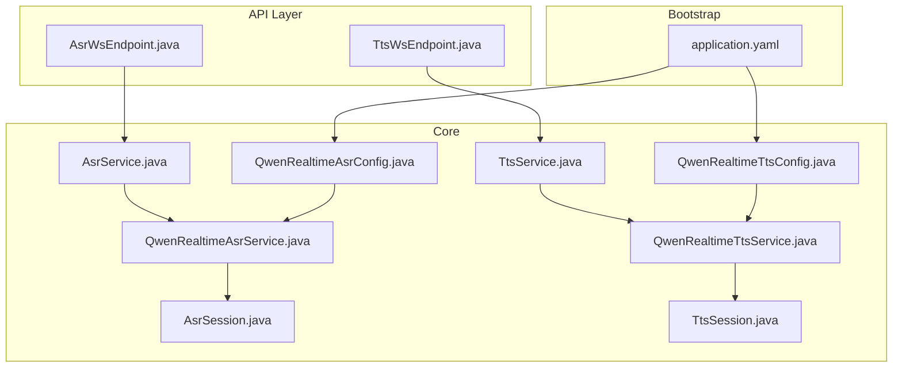
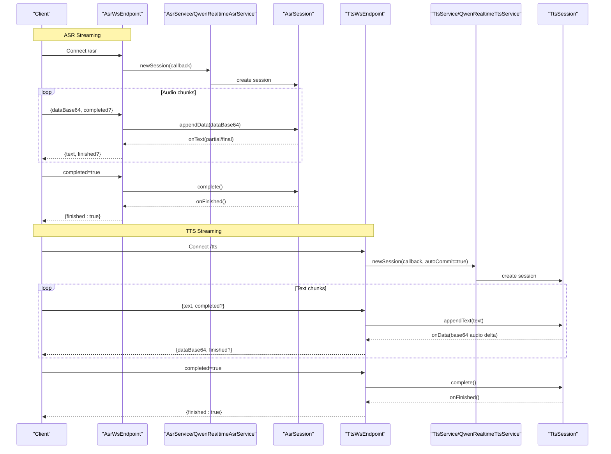
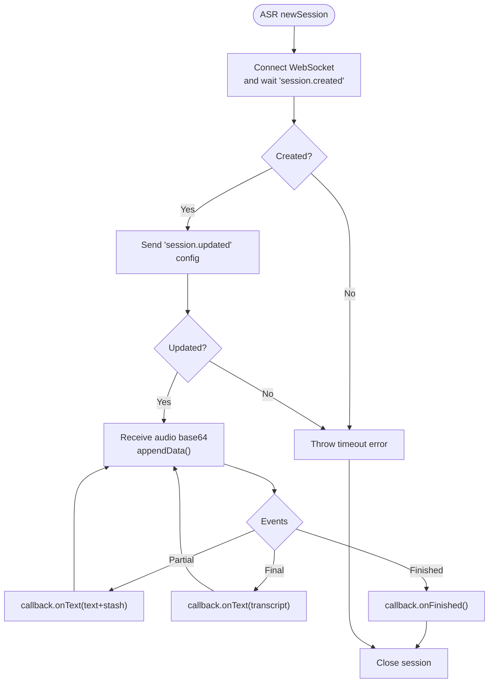
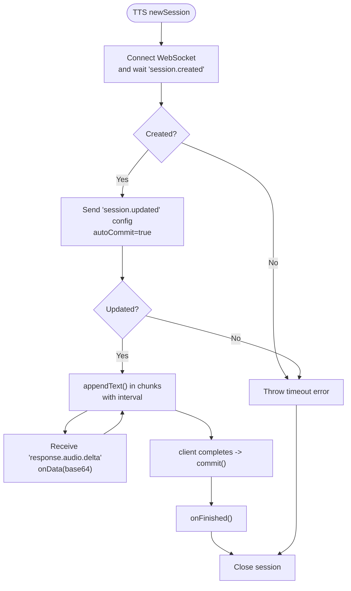
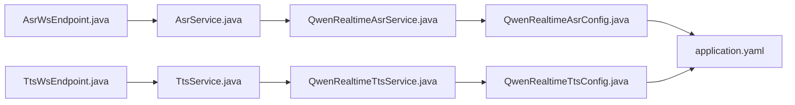

# Real-time Speech Recognition and Synthesis

<cite>
**Referenced Files in This Document**
- [AsrService.java](file://backend_java/core/src/main/java/com/aliyun/tam/x/tron/core/asr/AsrService.java)
- [AsrSession.java](file://backend_java/core/src/main/java/com/aliyun/tam/x/tron/core/asr/AsrSession.java)
- [QwenRealtimeAsrConfig.java](file://backend_java/core/src/main/java/com/aliyun/tam/x/tron/core/asr/QwenRealtimeAsrConfig.java)
- [QwenRealtimeAsrService.java](file://backend_java/core/src/main/java/com/aliyun/tam/x/tron/core/asr/QwenRealtimeAsrService.java)
- [TtsService.java](file://backend_java/core/src/main/java/com/aliyun/tam/x/tron/core/tts/TtsService.java)
- [TtsSession.java](file://backend_java/core/src/main/java/com/aliyun/tam/x/tron/core/tts/TtsSession.java)
- [QwenRealtimeTtsConfig.java](file://backend_java/core/src/main/java/com/aliyun/tam/x/tron/core/tts/QwenRealtimeTtsConfig.java)
- [QwenRealtimeTtsService.java](file://backend_java/core/src/main/java/com/aliyun/tam/x/tron/core/tts/QwenRealtimeTtsService.java)
- [AsrWsEndpoint.java](file://backend_java/api/src/main/java/com/aliyun/tam/x/tron/ws/AsrWsEndpoint.java)
- [TtsWsEndpoint.java](file://backend_java/api/src/main/java/com/aliyun/tam/x/tron/ws/TtsWsEndpoint.java)
- [application.yaml](file://backend_java/bootstrap/src/main/resources/application.yaml)
</cite>

## Table of Contents
1. [Introduction](#introduction)
2. [Project Structure](#project-structure)
3. [Core Components](#core-components)
4. [Architecture Overview](#architecture-overview)
5. [Detailed Component Analysis](#detailed-component-analysis)
6. [Dependency Analysis](#dependency-analysis)
7. [Performance Considerations](#performance-considerations)
8. [Troubleshooting Guide](#troubleshooting-guide)
9. [Conclusion](#conclusion)
10. [Appendices](#appendices)

## Introduction
This document explains the real-time speech processing system built on Alibaba Cloud’s DashScope Qwen services. It covers Automatic Speech Recognition (ASR) and Text-to-Speech (TTS) implementations, including session lifecycle management, configuration options, streaming capabilities, and integration with the agent’s conversation flow. Practical guidance is provided for audio quality tuning, latency optimization, bandwidth considerations, error handling, and fallback strategies.

## Project Structure
The real-time speech stack is organized into modular components:
- Core ASR and TTS interfaces and implementations
- Spring Boot configuration classes for Qwen real-time services
- WebSocket endpoints exposing streaming APIs for clients
- Application configuration for credentials and environment

**Diagram sources**
- [AsrService.java:20-31](file://backend_java/core/src/main/java/com/aliyun/tam/x/tron/core/asr/AsrService.java#L20-L31)
- [AsrSession.java:20-27](file://backend_java/core/src/main/java/com/aliyun/tam/x/tron/core/asr/AsrSession.java#L20-L27)
- [QwenRealtimeAsrConfig.java:30-54](file://backend_java/core/src/main/java/com/aliyun/tam/x/tron/core/asr/QwenRealtimeAsrConfig.java#L30-L54)
- [QwenRealtimeAsrService.java:36-149](file://backend_java/core/src/main/java/com/aliyun/tam/x/tron/core/asr/QwenRealtimeAsrService.java#L36-L149)
- [TtsService.java:20-31](file://backend_java/core/src/main/java/com/aliyun/tam/x/tron/core/tts/TtsService.java#L20-L31)
- [TtsSession.java:19-28](file://backend_java/core/src/main/java/com/aliyun/tam/x/tron/core/tts/TtsSession.java#L19-L28)
- [QwenRealtimeTtsConfig.java:31-62](file://backend_java/core/src/main/java/com/aliyun/tam/x/tron/core/tts/QwenRealtimeTtsConfig.java#L31-L62)
- [QwenRealtimeTtsService.java:34-165](file://backend_java/core/src/main/java/com/aliyun/tam/x/tron/core/tts/QwenRealtimeTtsService.java#L34-L165)
- [AsrWsEndpoint.java:35-173](file://backend_java/api/src/main/java/com/aliyun/tam/x/tron/ws/AsrWsEndpoint.java#L35-L173)
- [TtsWsEndpoint.java:35-159](file://backend_java/api/src/main/java/com/aliyun/tam/x/tron/ws/TtsWsEndpoint.java#L35-L159)
- [application.yaml:1-63](file://backend_java/bootstrap/src/main/resources/application.yaml#L1-L63)

**Section sources**
- [AsrService.java:18-31](file://backend_java/core/src/main/java/com/aliyun/tam/x/tron/core/asr/AsrService.java#L18-L31)
- [TtsService.java:18-31](file://backend_java/core/src/main/java/com/aliyun/tam/x/tron/core/tts/TtsService.java#L18-L31)
- [QwenRealtimeAsrConfig.java:27-54](file://backend_java/core/src/main/java/com/aliyun/tam/x/tron/core/asr/QwenRealtimeAsrConfig.java#L27-L54)
- [QwenRealtimeTtsConfig.java:28-62](file://backend_java/core/src/main/java/com/aliyun/tam/x/tron/core/tts/QwenRealtimeTtsConfig.java#L28-L62)
- [AsrWsEndpoint.java:35-173](file://backend_java/api/src/main/java/com/aliyun/tam/x/tron/ws/AsrWsEndpoint.java#L35-L173)
- [TtsWsEndpoint.java:35-159](file://backend_java/api/src/main/java/com/aliyun/tam/x/tron/ws/TtsWsEndpoint.java#L35-L159)
- [application.yaml:1-63](file://backend_java/bootstrap/src/main/resources/application.yaml#L1-L63)

## Core Components
- ASR interfaces and session:
  - AsrService defines a factory for AsrSession and an AsrCallback for receiving partial and final recognition results.
  - AsrSession exposes methods to append audio data, signal completion, and close the session.
- TTS interfaces and session:
  - TtsService defines a factory for TtsSession with a TtsCallback for receiving audio deltas and completion notifications.
  - TtsSession supports appending text, committing, finishing, and closing the session.
- Qwen real-time configurations:
  - QwenRealtimeAsrConfig and QwenRealtimeTtsConfig provide Spring Boot configuration properties for model selection, WebSocket URLs, API keys, audio formats, and timeouts.
- Qwen real-time services:
  - QwenRealtimeAsrService and QwenRealtimeTtsService implement session lifecycle, connect to DashScope WebSocket endpoints, configure sessions, stream audio/text, and propagate callbacks.

Key configuration highlights:
- ASR defaults: model, WebSocket URL, API key from environment, language, input sample rate, input audio format, and session creation timeout.
- TTS defaults: model, WebSocket URL, API key from environment, voice, language type, PCM format, instructions, chunking behavior, and session creation timeout.

**Section sources**
- [AsrService.java:20-31](file://backend_java/core/src/main/java/com/aliyun/tam/x/tron/core/asr/AsrService.java#L20-L31)
- [AsrSession.java:20-27](file://backend_java/core/src/main/java/com/aliyun/tam/x/tron/core/asr/AsrSession.java#L20-L27)
- [QwenRealtimeAsrConfig.java:32-48](file://backend_java/core/src/main/java/com/aliyun/tam/x/tron/core/asr/QwenRealtimeAsrConfig.java#L32-L48)
- [TtsService.java:20-31](file://backend_java/core/src/main/java/com/aliyun/tam/x/tron/core/tts/TtsService.java#L20-L31)
- [TtsSession.java:19-28](file://backend_java/core/src/main/java/com/aliyun/tam/x/tron/core/tts/TtsSession.java#L19-L28)
- [QwenRealtimeTtsConfig.java:32-56](file://backend_java/core/src/main/java/com/aliyun/tam/x/tron/core/tts/QwenRealtimeTtsConfig.java#L32-L56)

## Architecture Overview
The system exposes two WebSocket endpoints:
- /asr for real-time speech recognition
- /tts for real-time speech synthesis

Clients send JSON messages containing base64-encoded audio for ASR or text for TTS. The WebSocket endpoints create sessions via AsrService and TtsService respectively, forward streaming data, and emit structured responses.

**Diagram sources**
- [AsrWsEndpoint.java:70-107](file://backend_java/api/src/main/java/com/aliyun/tam/x/tron/ws/AsrWsEndpoint.java#L70-L107)
- [QwenRealtimeAsrService.java:39-147](file://backend_java/core/src/main/java/com/aliyun/tam/x/tron/core/asr/QwenRealtimeAsrService.java#L39-L147)
- [AsrSession.java:20-27](file://backend_java/core/src/main/java/com/aliyun/tam/x/tron/core/asr/AsrSession.java#L20-L27)
- [TtsWsEndpoint.java:56-93](file://backend_java/api/src/main/java/com/aliyun/tam/x/tron/ws/TtsWsEndpoint.java#L56-L93)
- [QwenRealtimeTtsService.java:40-145](file://backend_java/core/src/main/java/com/aliyun/tam/x/tron/core/tts/QwenRealtimeTtsService.java#L40-L145)
- [TtsSession.java:19-28](file://backend_java/core/src/main/java/com/aliyun/tam/x/tron/core/tts/TtsSession.java#L19-L28)

## Detailed Component Analysis

### ASR Session Lifecycle and Streaming
- Session creation:
  - The service constructs a real-time conversation with model, URL, and API key from configuration.
  - It waits for “session.created” and “session.updated” events with a configurable timeout.
- Streaming:
  - Clients send base64-encoded audio chunks; each chunk triggers an append operation.
  - Partial and final transcriptions are emitted via callbacks.
- Completion and closure:
  - On client request, the session is committed; on completion, the session finishes and closes.

**Diagram sources**
- [QwenRealtimeAsrService.java:39-147](file://backend_java/core/src/main/java/com/aliyun/tam/x/tron/core/asr/QwenRealtimeAsrService.java#L39-L147)
- [AsrWsEndpoint.java:79-105](file://backend_java/api/src/main/java/com/aliyun/tam/x/tron/ws/AsrWsEndpoint.java#L79-L105)

**Section sources**
- [QwenRealtimeAsrService.java:39-147](file://backend_java/core/src/main/java/com/aliyun/tam/x/tron/core/asr/QwenRealtimeAsrService.java#L39-L147)
- [AsrWsEndpoint.java:70-141](file://backend_java/api/src/main/java/com/aliyun/tam/x/tron/ws/AsrWsEndpoint.java#L70-L141)

### TTS Session Lifecycle and Streaming
- Session creation:
  - The service connects to the WebSocket and waits for “session.created” and “session.updated”.
- Streaming:
  - Clients send text fragments; the service splits text into chunks and emits audio deltas as they arrive.
  - Auto-commit mode is enabled by default to stream audio progressively.
- Completion and closure:
  - On client completion, the session is finalized and closed.

**Diagram sources**
- [QwenRealtimeTtsService.java:40-145](file://backend_java/core/src/main/java/com/aliyun/tam/x/tron/core/tts/QwenRealtimeTtsService.java#L40-L145)
- [TtsWsEndpoint.java:65-91](file://backend_java/api/src/main/java/com/aliyun/tam/x/tron/ws/TtsWsEndpoint.java#L65-L91)

**Section sources**
- [QwenRealtimeTtsService.java:40-145](file://backend_java/core/src/main/java/com/aliyun/tam/x/tron/core/tts/QwenRealtimeTtsService.java#L40-L145)
- [TtsWsEndpoint.java:56-127](file://backend_java/api/src/main/java/com/aliyun/tam/x/tron/ws/TtsWsEndpoint.java#L56-L127)

### Configuration Options and Tuning
- ASR configuration properties:
  - Model, WebSocket URL, API key, language, input sample rate, input audio format, session creation timeout.
- TTS configuration properties:
  - Model, WebSocket URL, API key, voice, language type, audio format, instructions, instruction optimization, max chunk size, inter-chunk interval, session creation timeout.
- Environment integration:
  - API key is loaded from environment variables via configuration classes.
  - Application YAML centralizes environment variables for database, file storage, and DashScope API key.

Practical tuning tips:
- Latency vs. accuracy trade-offs:
  - Reduce chunk interval and adjust max chunk size for TTS to lower perceived latency.
  - For ASR, ensure continuous audio input to minimize gaps and improve word finalization timing.
- Audio quality:
  - Match input sample rate and format to client capture settings.
  - Prefer higher-quality audio formats when supported by the client pipeline.
- Bandwidth:
  - Control chunk sizes and intervals to balance throughput and network overhead.
  - Disable instruction optimization if custom instructions are already optimized.

**Section sources**
- [QwenRealtimeAsrConfig.java:32-48](file://backend_java/core/src/main/java/com/aliyun/tam/x/tron/core/asr/QwenRealtimeAsrConfig.java#L32-L48)
- [QwenRealtimeTtsConfig.java:32-56](file://backend_java/core/src/main/java/com/aliyun/tam/x/tron/core/tts/QwenRealtimeTtsConfig.java#L32-L56)
- [application.yaml:34-34](file://backend_java/bootstrap/src/main/resources/application.yaml#L34-L34)

### WebSocket Endpoint Behavior
- ASR endpoint (/asr):
  - Accepts base64 audio and optional completion flag.
  - Emits partial and final transcripts and signals completion.
- TTS endpoint (/tts):
  - Accepts text and optional completion flag.
  - Emits audio deltas and signals completion.

Error handling:
- Both endpoints gracefully handle parsing errors, missing services, and WebSocket exceptions, sending structured error responses and closing sessions.

**Section sources**
- [AsrWsEndpoint.java:35-173](file://backend_java/api/src/main/java/com/aliyun/tam/x/tron/ws/AsrWsEndpoint.java#L35-L173)
- [TtsWsEndpoint.java:35-159](file://backend_java/api/src/main/java/com/aliyun/tam/x/tron/ws/TtsWsEndpoint.java#L35-L159)

## Dependency Analysis
The system exhibits clean separation of concerns:
- API layer depends on core services via interfaces.
- Core services depend on DashScope SDK and configuration classes.
- Configuration classes are conditionally loaded based on property flags.

**Diagram sources**
- [AsrWsEndpoint.java:20-30](file://backend_java/api/src/main/java/com/aliyun/tam/x/tron/ws/AsrWsEndpoint.java#L20-L30)
- [TtsWsEndpoint.java:20-31](file://backend_java/api/src/main/java/com/aliyun/tam/x/tron/ws/TtsWsEndpoint.java#L20-L31)
- [AsrService.java:20-31](file://backend_java/core/src/main/java/com/aliyun/tam/x/tron/core/asr/AsrService.java#L20-L31)
- [TtsService.java:20-31](file://backend_java/core/src/main/java/com/aliyun/tam/x/tron/core/tts/TtsService.java#L20-L31)
- [QwenRealtimeAsrConfig.java:30-54](file://backend_java/core/src/main/java/com/aliyun/tam/x/tron/core/asr/QwenRealtimeAsrConfig.java#L30-L54)
- [QwenRealtimeTtsConfig.java:31-62](file://backend_java/core/src/main/java/com/aliyun/tam/x/tron/core/tts/QwenRealtimeTtsConfig.java#L31-L62)
- [application.yaml:34-34](file://backend_java/bootstrap/src/main/resources/application.yaml#L34-L34)

**Section sources**
- [AsrService.java:20-31](file://backend_java/core/src/main/java/com/aliyun/tam/x/tron/core/asr/AsrService.java#L20-L31)
- [TtsService.java:20-31](file://backend_java/core/src/main/java/com/aliyun/tam/x/tron/core/tts/TtsService.java#L20-L31)
- [QwenRealtimeAsrConfig.java:27-54](file://backend_java/core/src/main/java/com/aliyun/tam/x/tron/core/asr/QwenRealtimeAsrConfig.java#L27-L54)
- [QwenRealtimeTtsConfig.java:28-62](file://backend_java/core/src/main/java/com/aliyun/tam/x/tron/core/tts/QwenRealtimeTtsConfig.java#L28-L62)

## Performance Considerations
- Latency reduction:
  - Tune TTS chunk size and inter-chunk interval to reduce perceived delay.
  - Keep ASR audio continuous to avoid session gaps and improve finalization timing.
- Throughput and bandwidth:
  - Adjust audio format and sample rate to match client capabilities and network conditions.
  - Monitor WebSocket message sizes; large base64 payloads increase overhead.
- Resource management:
  - Ensure timely completion and closure of sessions to free resources.
  - Use timeouts to prevent indefinite waits during connection or session updates.
- Quality control:
  - Calibrate input sample rate and format to match microphone or recording device.
  - For TTS, choose appropriate voice and language settings for the target audience.

[No sources needed since this section provides general guidance]

## Troubleshooting Guide
Common issues and resolutions:
- API key errors:
  - Verify the API key environment variable is set; configuration loads the key from the environment.
- Connection timeouts:
  - Increase session creation timeout if the initial handshake is slow.
- Missing services:
  - Ensure AsrService or TtsService beans are available; endpoints send explicit error responses when services are unavailable.
- Network interruptions:
  - WebSocket endpoints close sessions on errors and send error notifications; re-establish connections as needed.
- Audio quality problems:
  - Confirm input sample rate and format match client settings; mismatch leads to degraded recognition or playback quality.

**Section sources**
- [QwenRealtimeAsrConfig.java:39-39](file://backend_java/core/src/main/java/com/aliyun/tam/x/tron/core/asr/QwenRealtimeAsrConfig.java#L39-L39)
- [QwenRealtimeTtsConfig.java:39-39](file://backend_java/core/src/main/java/com/aliyun/tam/x/tron/core/tts/QwenRealtimeTtsConfig.java#L39-L39)
- [application.yaml:34-34](file://backend_java/bootstrap/src/main/resources/application.yaml#L34-L34)
- [AsrWsEndpoint.java:74-77](file://backend_java/api/src/main/java/com/aliyun/tam/x/tron/ws/AsrWsEndpoint.java#L74-L77)
- [TtsWsEndpoint.java:60-62](file://backend_java/api/src/main/java/com/aliyun/tam/x/tron/ws/TtsWsEndpoint.java#L60-L62)

## Conclusion
The real-time speech system integrates cleanly with the agent’s conversation flow through WebSocket endpoints and Qwen DashScope services. By tuning configuration parameters, managing session lifecycles carefully, and implementing robust error handling, developers can achieve responsive, high-quality ASR and TTS experiences suitable for interactive applications.

[No sources needed since this section summarizes without analyzing specific files]

## Appendices

### Practical Configuration Examples
- Set API key via environment variable for both ASR and TTS.
- Adjust ASR language and input sample rate to match the audio source.
- Configure TTS voice, language type, and audio format to match the desired output characteristics.
- Tune TTS max chunk size and chunk interval to balance latency and throughput.

**Section sources**
- [QwenRealtimeAsrConfig.java:32-48](file://backend_java/core/src/main/java/com/aliyun/tam/x/tron/core/asr/QwenRealtimeAsrConfig.java#L32-L48)
- [QwenRealtimeTtsConfig.java:32-56](file://backend_java/core/src/main/java/com/aliyun/tam/x/tron/core/tts/QwenRealtimeTtsConfig.java#L32-L56)
- [application.yaml:34-34](file://backend_java/bootstrap/src/main/resources/application.yaml#L34-L34)