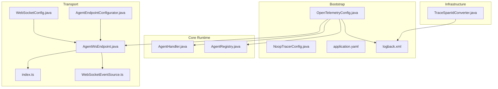
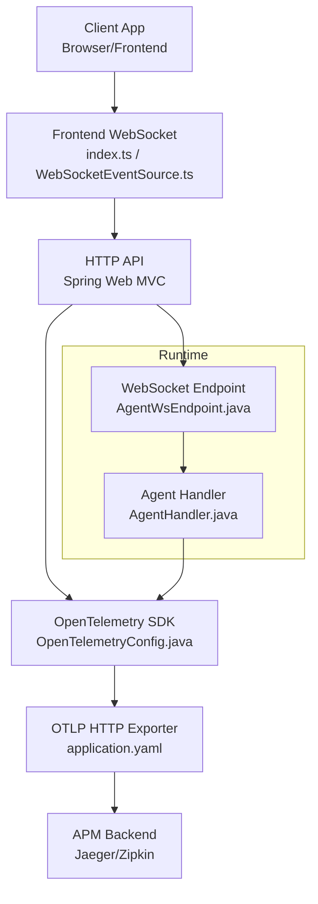
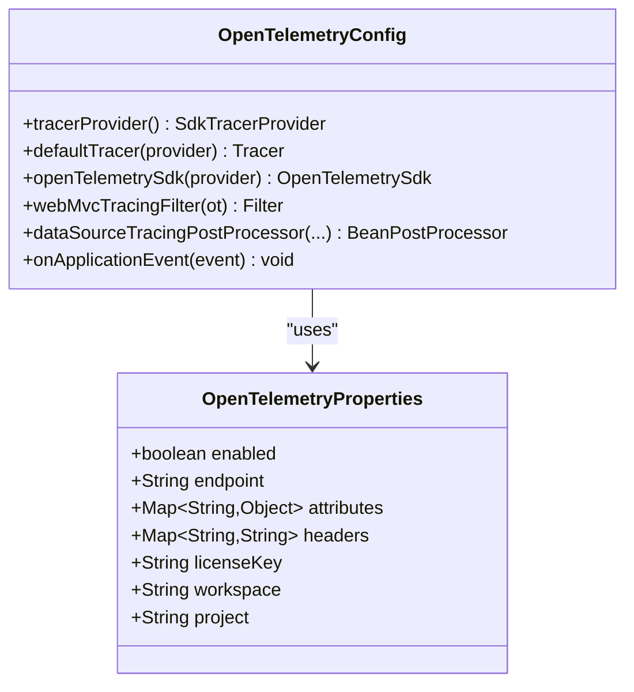
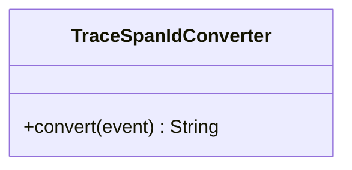
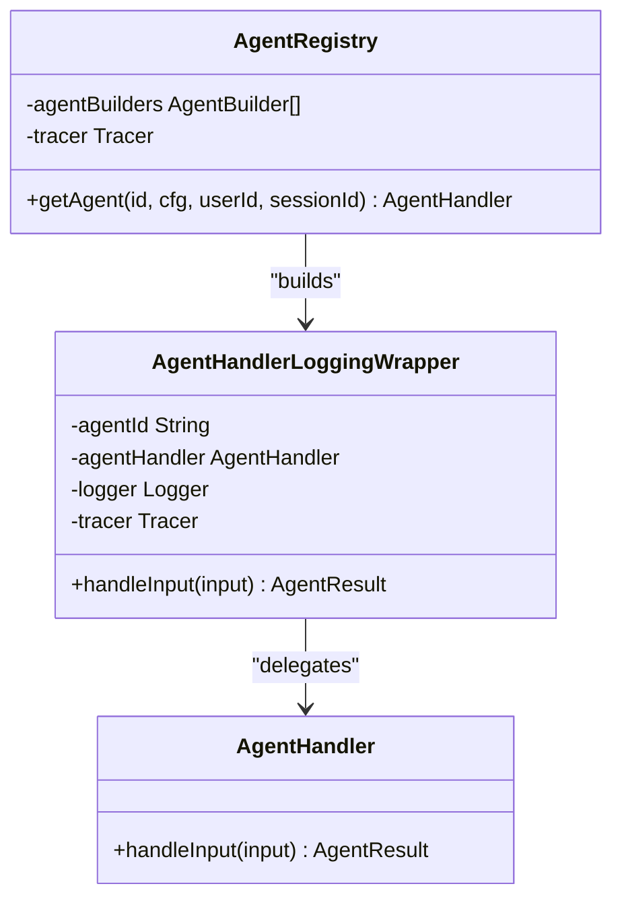
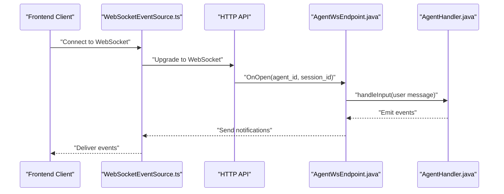
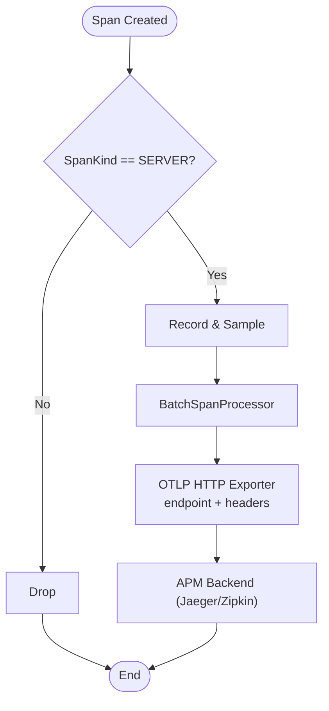
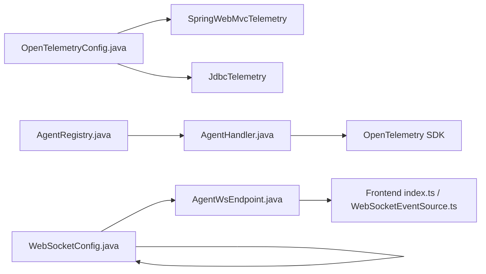

# Distributed Tracing

<cite>
**Referenced Files in This Document**
- [OpenTelemetryConfig.java](file://backend_java/bootstrap/src/main/java/com/aliyun/tam/x/tron/config/OpenTelemetryConfig.java)
- [NoopTracerConfig.java](file://backend_java/bootstrap/src/main/java/com/aliyun/tam/x/tron/config/NoopTracerConfig.java)
- [application.yaml](file://backend_java/bootstrap/src/main/resources/application.yaml)
- [logback.xml](file://backend_java/bootstrap/src/main/resources/logback.xml)
- [TraceSpanIdConverter.java](file://backend_java/infra/src/main/java/com/aliyun/tam/x/tron/infra/trace/TraceSpanIdConverter.java)
- [AgentHandler.java](file://backend_java/core/src/main/java/com/aliyun/tam/x/tron/core/agents/AgentHandler.java)
- [AgentRegistry.java](file://backend_java/core/src/main/java/com/aliyun/tam/x/tron/core/agents/AgentRegistry.java)
- [AgentWsEndpoint.java](file://backend_java/api/src/main/java/com/aliyun/tam/x/tron/ws/AgentWsEndpoint.java)
- [WebSocketConfig.java](file://backend_java/bootstrap/src/main/java/com/aliyun/tam/x/tron/config/WebSocketConfig.java)
- [AgentEndpointConfigurator.java](file://backend_java/api/src/main/java/com/aliyun/tam/x/tron/ws/AgentEndpointConfigurator.java)
- [index.ts](file://frontend/packages/chatbox/extends/service/index.ts)
- [WebSocketEventSource.ts](file://frontend/packages/chatbox/eventSource/WebSocketEventSource.ts)
</cite>

## Table of Contents
1. [Introduction](#introduction)
2. [Project Structure](#project-structure)
3. [Core Components](#core-components)
4. [Architecture Overview](#architecture-overview)
5. [Detailed Component Analysis](#detailed-component-analysis)
6. [Dependency Analysis](#dependency-analysis)
7. [Performance Considerations](#performance-considerations)
8. [Troubleshooting Guide](#troubleshooting-guide)
9. [Conclusion](#conclusion)
10. [Appendices](#appendices)

## Introduction
This document explains the distributed tracing implementation in Tron OneAgent with a focus on OpenTelemetry integration, cross-service trace correlation, span propagation, and distributed request tracking. It documents the TraceSpanIdConverter for trace ID extraction, tracing configuration and sampling strategies, and the trace export mechanism. Practical guidance is provided for instrumenting agent workflows, correlating traces across microservices, analyzing trace data for performance optimization, propagating trace context through API calls, WebSocket connections, and asynchronous operations, and integrating with APM tools such as Jaeger or Zipkin.

## Project Structure
The tracing implementation spans three primary areas:
- Bootstrapping and configuration: OpenTelemetry SDK initialization, exporters, samplers, and filters
- Infrastructure: Logback converter for trace/span IDs in logs
- Core runtime: Agent spans and Micrometer metrics hooks
- Transport: WebSocket endpoints and frontend WebSocket clients

**Diagram sources**
- [OpenTelemetryConfig.java:66-228](file://backend_java/bootstrap/src/main/java/com/aliyun/tam/x/tron/config/OpenTelemetryConfig.java#L66-L228)
- [NoopTracerConfig.java:65-74](file://backend_java/bootstrap/src/main/java/com/aliyun/tam/x/tron/config/NoopTracerConfig.java#L65-L74)
- [application.yaml:1-63](file://backend_java/bootstrap/src/main/resources/application.yaml#L1-L63)
- [logback.xml:1-38](file://backend_java/bootstrap/src/main/resources/logback.xml#L1-L38)
- [TraceSpanIdConverter.java:1-40](file://backend_java/infra/src/main/java/com/aliyun/tam/x/tron/infra/trace/TraceSpanIdConverter.java#L1-L40)
- [AgentHandler.java:1-106](file://backend_java/core/src/main/java/com/aliyun/tam/x/tron/core/agents/AgentHandler.java#L1-L106)
- [AgentRegistry.java:37-98](file://backend_java/core/src/main/java/com/aliyun/tam/x/tron/core/agents/AgentRegistry.java#L37-L98)
- [AgentWsEndpoint.java:1-529](file://backend_java/api/src/main/java/com/aliyun/tam/x/tron/ws/AgentWsEndpoint.java#L1-L529)
- [WebSocketConfig.java:1-37](file://backend_java/bootstrap/src/main/java/com/aliyun/tam/x/tron/config/WebSocketConfig.java#L1-L37)
- [AgentEndpointConfigurator.java:1-33](file://backend_java/api/src/main/java/com/aliyun/tam/x/tron/ws/AgentEndpointConfigurator.java#L1-L33)
- [index.ts:485-526](file://frontend/packages/chatbox/extends/service/index.ts#L485-L526)
- [WebSocketEventSource.ts:1-100](file://frontend/packages/chatbox/eventSource/WebSocketEventSource.ts#L1-L100)

**Section sources**
- [OpenTelemetryConfig.java:66-228](file://backend_java/bootstrap/src/main/java/com/aliyun/tam/x/tron/config/OpenTelemetryConfig.java#L66-L228)
- [application.yaml:1-63](file://backend_java/bootstrap/src/main/resources/application.yaml#L1-L63)
- [logback.xml:1-38](file://backend_java/bootstrap/src/main/resources/logback.xml#L1-L38)

## Core Components
- OpenTelemetry SDK and exporter: Initializes the TracerProvider, sets resource attributes, configures OTLP HTTP exporter, and registers a batch span processor. A custom sampler samples only SERVER spans and defers to parent sampling for CLIENT spans.
- Tracer registry hook: On application startup, the default tracer is registered with the AgentScope tracer registry and tracing hooks are enabled.
- Logback trace ID converter: Adds current traceId,spanId to log entries when a span is active.
- Agent spans and metrics: AgentHandler wraps agent execution in a span and records Micrometer timers and counters for latency and throughput.
- WebSocket transport: Server-side WebSocket endpoint handles chat requests and emits events; client-side WebSocket connects to the server endpoint.

**Section sources**
- [OpenTelemetryConfig.java:105-140](file://backend_java/bootstrap/src/main/java/com/aliyun/tam/x/tron/config/OpenTelemetryConfig.java#L105-L140)
- [OpenTelemetryConfig.java:142-163](file://backend_java/bootstrap/src/main/java/com/aliyun/tam/x/tron/config/OpenTelemetryConfig.java#L142-L163)
- [OpenTelemetryConfig.java:219-226](file://backend_java/bootstrap/src/main/java/com/aliyun/tam/x/tron/config/OpenTelemetryConfig.java#L219-L226)
- [TraceSpanIdConverter.java:25-39](file://backend_java/infra/src/main/java/com/aliyun/tam/x/tron/infra/trace/TraceSpanIdConverter.java#L25-L39)
- [AgentHandler.java:80-106](file://backend_java/core/src/main/java/com/aliyun/tam/x/tron/core/agents/AgentHandler.java#L80-L106)
- [AgentWsEndpoint.java:277-332](file://backend_java/api/src/main/java/com/aliyun/tam/x/tron/ws/AgentWsEndpoint.java#L277-L332)

## Architecture Overview
The tracing pipeline integrates OpenTelemetry with Spring Web MVC and JDBC, exports spans via OTLP HTTP, and correlates traces across services using the configured sampler and context propagation.

**Diagram sources**
- [OpenTelemetryConfig.java:190-193](file://backend_java/bootstrap/src/main/java/com/aliyun/tam/x/tron/config/OpenTelemetryConfig.java#L190-L193)
- [application.yaml:53-63](file://backend_java/bootstrap/src/main/resources/application.yaml#L53-L63)
- [AgentWsEndpoint.java:116-136](file://backend_java/api/src/main/java/com/aliyun/tam/x/tron/ws/AgentWsEndpoint.java#L116-L136)
- [AgentHandler.java:80-106](file://backend_java/core/src/main/java/com/aliyun/tam/x/tron/core/agents/AgentHandler.java#L80-L106)
- [index.ts:485-526](file://frontend/packages/chatbox/extends/service/index.ts#L485-L526)

## Detailed Component Analysis

### OpenTelemetry Configuration and Sampling
- TracerProvider: Builds a Resource with service.name, service.version, service.environment, host.name, and optional attributes from configuration. Creates an OTLP HTTP exporter with endpoint and headers from configuration. Registers a BatchSpanProcessor.
- Sampler: ApiOnlyRootSampler samples only SERVER spans and defers to parent sampling for CLIENT spans. Parent-based configuration ensures local and remote parent sampling behavior.
- Tracer registration: Exposes a primary Tracer bean and an OpenTelemetrySdk bean. On application startup, registers TelemetryTracer with the AgentScope TracerRegistry and enables tracing hooks.

**Diagram sources**
- [OpenTelemetryConfig.java:74-90](file://backend_java/bootstrap/src/main/java/com/aliyun/tam/x/tron/config/OpenTelemetryConfig.java#L74-L90)
- [OpenTelemetryConfig.java:105-140](file://backend_java/bootstrap/src/main/java/com/aliyun/tam/x/tron/config/OpenTelemetryConfig.java#L105-L140)
- [OpenTelemetryConfig.java:142-163](file://backend_java/bootstrap/src/main/java/com/aliyun/tam/x/tron/config/OpenTelemetryConfig.java#L142-L163)
- [OpenTelemetryConfig.java:177-188](file://backend_java/bootstrap/src/main/java/com/aliyun/tam/x/tron/config/OpenTelemetryConfig.java#L177-L188)
- [OpenTelemetryConfig.java:190-216](file://backend_java/bootstrap/src/main/java/com/aliyun/tam/x/tron/config/OpenTelemetryConfig.java#L190-L216)
- [OpenTelemetryConfig.java:219-226](file://backend_java/bootstrap/src/main/java/com/aliyun/tam/x/tron/config/OpenTelemetryConfig.java#L219-L226)

**Section sources**
- [OpenTelemetryConfig.java:105-140](file://backend_java/bootstrap/src/main/java/com/aliyun/tam/x/tron/config/OpenTelemetryConfig.java#L105-L140)
- [OpenTelemetryConfig.java:142-163](file://backend_java/bootstrap/src/main/java/com/aliyun/tam/x/tron/config/OpenTelemetryConfig.java#L142-L163)
- [OpenTelemetryConfig.java:177-188](file://backend_java/bootstrap/src/main/java/com/aliyun/tam/x/tron/config/OpenTelemetryConfig.java#L177-L188)
- [OpenTelemetryConfig.java:190-216](file://backend_java/bootstrap/src/main/java/com/aliyun/tam/x/tron/config/OpenTelemetryConfig.java#L190-L216)
- [OpenTelemetryConfig.java:219-226](file://backend_java/bootstrap/src/main/java/com/aliyun/tam/x/tron/config/OpenTelemetryConfig.java#L219-L226)

### TraceSpanIdConverter and Logback Integration
- Converter: Extracts the current SpanContext and returns a comma-separated traceId,spanId when valid; otherwise returns an empty string.
- Log pattern: Uses a conversion rule to embed trace/span IDs into log entries for easy correlation.

**Diagram sources**
- [TraceSpanIdConverter.java:25-39](file://backend_java/infra/src/main/java/com/aliyun/tam/x/tron/infra/trace/TraceSpanIdConverter.java#L25-L39)

**Section sources**
- [TraceSpanIdConverter.java:25-39](file://backend_java/infra/src/main/java/com/aliyun/tam/x/tron/infra/trace/TraceSpanIdConverter.java#L25-L39)
- [logback.xml:4-6](file://backend_java/bootstrap/src/main/resources/logback.xml#L4-L6)

### Agent Spans and Metrics Hooks
- AgentHandler: Wraps user input handling in a span with attributes for agent, user, session, and message IDs. Records Micrometer timers and counters for reasoning, acting, summarization, and errors.
- AgentRegistry: Builds AgentHandler instances wrapped with logging/tracing instrumentation using the shared Tracer.

**Diagram sources**
- [AgentHandler.java:48-106](file://backend_java/core/src/main/java/com/aliyun/tam/x/tron/core/agents/AgentHandler.java#L48-L106)
- [AgentRegistry.java:85-93](file://backend_java/core/src/main/java/com/aliyun/tam/x/tron/core/agents/AgentRegistry.java#L85-L93)

**Section sources**
- [AgentHandler.java:80-106](file://backend_java/core/src/main/java/com/aliyun/tam/x/tron/core/agents/AgentHandler.java#L80-L106)
- [AgentRegistry.java:74-93](file://backend_java/core/src/main/java/com/aliyun/tam/x/tron/core/agents/AgentRegistry.java#L74-L93)

### WebSocket Transport and Trace Correlation
- Server endpoint: Handles WebSocket handshake, session snapshot, and real-time event streaming. Methods extract required headers for user identity and propagate them into the session lifecycle.
- Client endpoints: Frontend WebSocket clients connect to the server endpoint and process notifications and responses.

**Diagram sources**
- [AgentWsEndpoint.java:116-136](file://backend_java/api/src/main/java/com/aliyun/tam/x/tron/ws/AgentWsEndpoint.java#L116-L136)
- [AgentWsEndpoint.java:222-261](file://backend_java/api/src/main/java/com/aliyun/tam/x/tron/ws/AgentWsEndpoint.java#L222-L261)
- [AgentWsEndpoint.java:334-442](file://backend_java/api/src/main/java/com/aliyun/tam/x/tron/ws/AgentWsEndpoint.java#L334-L442)
- [WebSocketEventSource.ts:39-100](file://frontend/packages/chatbox/eventSource/WebSocketEventSource.ts#L39-L100)
- [index.ts:485-526](file://frontend/packages/chatbox/extends/service/index.ts#L485-L526)

**Section sources**
- [AgentWsEndpoint.java:116-136](file://backend_java/api/src/main/java/com/aliyun/tam/x/tron/ws/AgentWsEndpoint.java#L116-L136)
- [AgentWsEndpoint.java:222-261](file://backend_java/api/src/main/java/com/aliyun/tam/x/tron/ws/AgentWsEndpoint.java#L222-L261)
- [AgentWsEndpoint.java:334-442](file://backend_java/api/src/main/java/com/aliyun/tam/x/tron/ws/AgentWsEndpoint.java#L334-L442)
- [WebSocketEventSource.ts:39-100](file://frontend/packages/chatbox/eventSource/WebSocketEventSource.ts#L39-L100)
- [index.ts:485-526](file://frontend/packages/chatbox/extends/service/index.ts#L485-L526)

### Trace Export Mechanism
- Exporter: OTLP HTTP exporter configured with endpoint and headers from application properties. BatchSpanProcessor batches and exports spans asynchronously.
- APM integration: Configure the endpoint to point to your APM backend (e.g., Jaeger/Zipkin OTLP HTTP endpoint) and set required headers.

**Diagram sources**
- [OpenTelemetryConfig.java:120-132](file://backend_java/bootstrap/src/main/java/com/aliyun/tam/x/tron/config/OpenTelemetryConfig.java#L120-L132)
- [OpenTelemetryConfig.java:142-163](file://backend_java/bootstrap/src/main/java/com/aliyun/tam/x/tron/config/OpenTelemetryConfig.java#L142-L163)
- [application.yaml:53-63](file://backend_java/bootstrap/src/main/resources/application.yaml#L53-L63)

**Section sources**
- [OpenTelemetryConfig.java:120-132](file://backend_java/bootstrap/src/main/java/com/aliyun/tam/x/tron/config/OpenTelemetryConfig.java#L120-L132)
- [application.yaml:53-63](file://backend_java/bootstrap/src/main/resources/application.yaml#L53-L63)

## Dependency Analysis
- OpenTelemetryConfig depends on Spring Web MVC telemetry and JDBC instrumentation to auto-trace HTTP and database operations.
- AgentRegistry injects Tracer into AgentHandler wrappers to ensure all agent workloads are traced.
- WebSocketConfig and AgentEndpointConfigurator enable WebSocket endpoint discovery and dependency injection for the server endpoint.

**Diagram sources**
- [OpenTelemetryConfig.java:190-216](file://backend_java/bootstrap/src/main/java/com/aliyun/tam/x/tron/config/OpenTelemetryConfig.java#L190-L216)
- [AgentRegistry.java:85-93](file://backend_java/core/src/main/java/com/aliyun/tam/x/tron/core/agents/AgentRegistry.java#L85-L93)
- [AgentWsEndpoint.java:116-136](file://backend_java/api/src/main/java/com/aliyun/tam/x/tron/ws/AgentWsEndpoint.java#L116-L136)
- [WebSocketConfig.java:24-36](file://backend_java/bootstrap/src/main/java/com/aliyun/tam/x/tron/config/WebSocketConfig.java#L24-L36)
- [index.ts:485-526](file://frontend/packages/chatbox/extends/service/index.ts#L485-L526)

**Section sources**
- [OpenTelemetryConfig.java:190-216](file://backend_java/bootstrap/src/main/java/com/aliyun/tam/x/tron/config/OpenTelemetryConfig.java#L190-L216)
- [AgentRegistry.java:85-93](file://backend_java/core/src/main/java/com/aliyun/tam/x/tron/core/agents/AgentRegistry.java#L85-L93)
- [AgentWsEndpoint.java:116-136](file://backend_java/api/src/main/java/com/aliyun/tam/x/tron/ws/AgentWsEndpoint.java#L116-L136)
- [WebSocketConfig.java:24-36](file://backend_java/bootstrap/src/main/java/com/aliyun/tam/x/tron/config/WebSocketConfig.java#L24-L36)

## Performance Considerations
- Sampling strategy: The ApiOnlyRootSampler reduces overhead by sampling only SERVER spans and deferring to parent sampling for CLIENT spans. This minimizes data volume while preserving end-to-end trace visibility at service boundaries.
- Batch export: BatchSpanProcessor aggregates spans before exporting, reducing network overhead.
- Logging overhead: Ensure logback conversion rule is enabled only when needed; excessive trace/span ID logging can increase I/O overhead.

[No sources needed since this section provides general guidance]

## Troubleshooting Guide
- Tracer availability: If no Tracer bean is present, a No-op tracer is provided to avoid runtime failures.
- WebSocket headers: Server-side endpoint requires X-User-Id and optionally X-User-Name; missing or duplicated headers cause handshake failure.
- Exporter connectivity: Verify opentelemetry.endpoint and headers in application properties match your APM backend configuration.

**Section sources**
- [NoopTracerConfig.java:65-74](file://backend_java/bootstrap/src/main/java/com/aliyun/tam/x/tron/config/NoopTracerConfig.java#L65-L74)
- [AgentWsEndpoint.java:458-505](file://backend_java/api/src/main/java/com/aliyun/tam/x/tron/ws/AgentWsEndpoint.java#L458-L505)
- [application.yaml:53-63](file://backend_java/bootstrap/src/main/resources/application.yaml#L53-L63)

## Conclusion
Tron OneAgent integrates OpenTelemetry to provide robust distributed tracing across HTTP APIs, WebSocket sessions, and agent workflows. The configuration focuses on efficient sampling, reliable export via OTLP HTTP, and seamless correlation through log enrichment and span attributes. By leveraging the provided components and following the guidance below, teams can instrument workflows, correlate traces across services, and analyze performance effectively.

[No sources needed since this section summarizes without analyzing specific files]

## Appendices

### Practical Instrumentation Examples
- Instrument agent workflows: Wrap agent input handling in spans with attributes for agent, user, session, and message IDs. Use the existing wrapper pattern in AgentHandler as a reference.
- Correlate traces across microservices: Ensure HTTP and WebSocket requests carry trace context; rely on OpenTelemetry’s automatic propagation and the ApiOnlyRootSampler to maintain end-to-end visibility.
- Analyze trace data for performance: Use Micrometer timers and counters emitted during agent operations to identify hotspots and optimize latency.

[No sources needed since this section provides general guidance]

### Trace Context Propagation
- HTTP: Automatic via Spring Web MVC telemetry and parent-based sampling.
- WebSocket: Establish session with required headers; emit events and notifications within the same trace context.
- Asynchronous operations: Use the Tracer context propagation to ensure spans continue across threads and tasks.

[No sources needed since this section provides general guidance]

### Integrating with APM Tools (Jaeger/Zipkin)
- Configure opentelemetry.endpoint to point to your APM backend’s OTLP HTTP endpoint.
- Set opentelemetry.headers as needed for authentication or tenant routing.
- Validate exporter connectivity and verify spans appear in the APM dashboard.

**Section sources**
- [application.yaml:53-63](file://backend_java/bootstrap/src/main/resources/application.yaml#L53-L63)
- [OpenTelemetryConfig.java:120-128](file://backend_java/bootstrap/src/main/java/com/aliyun/tam/x/tron/config/OpenTelemetryConfig.java#L120-L128)