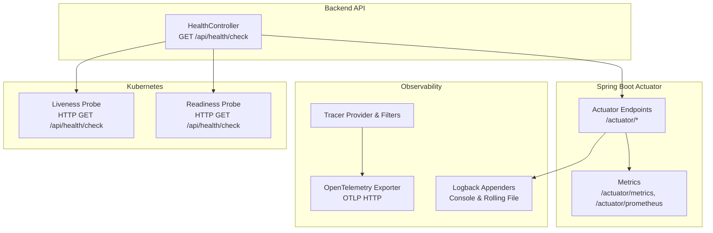
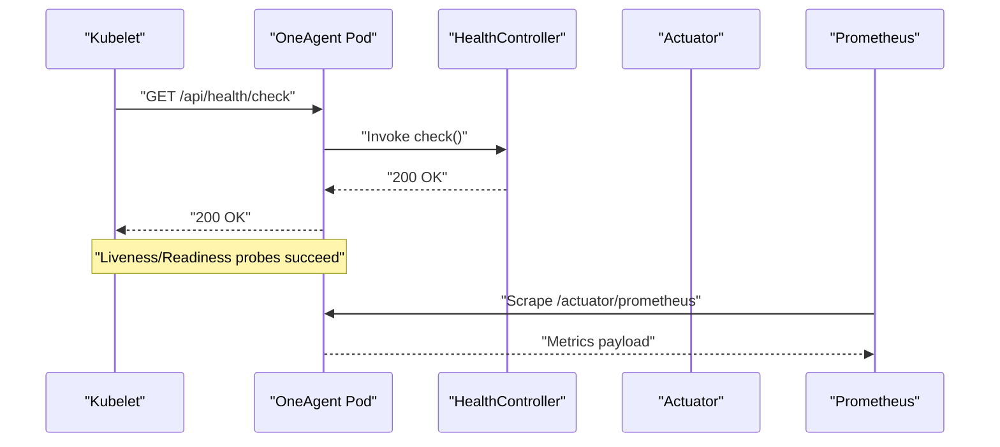
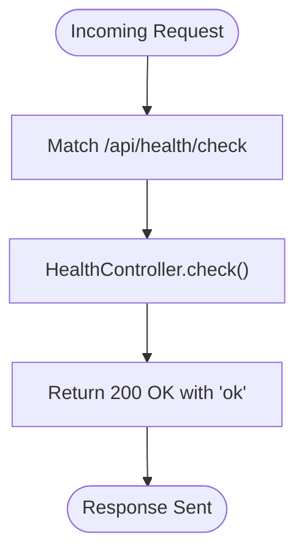
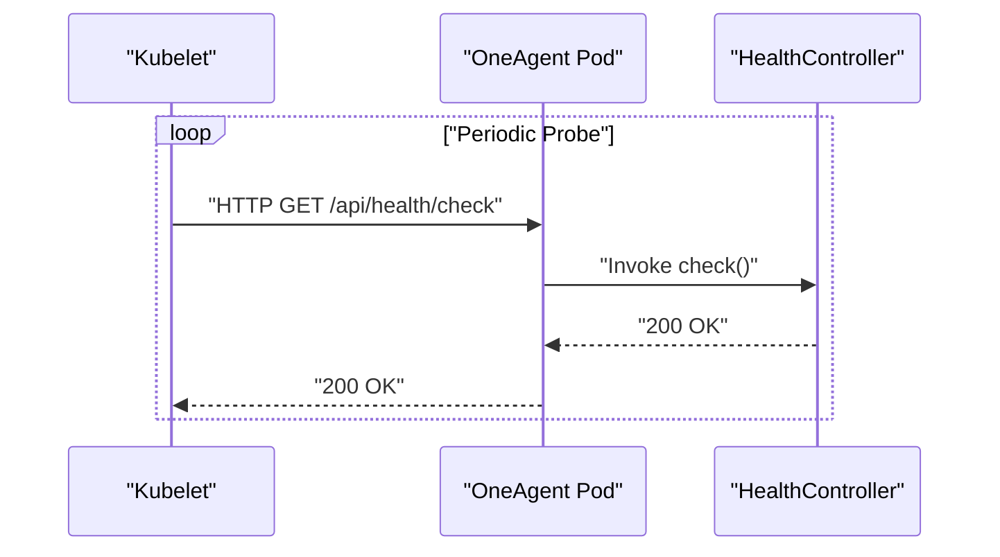
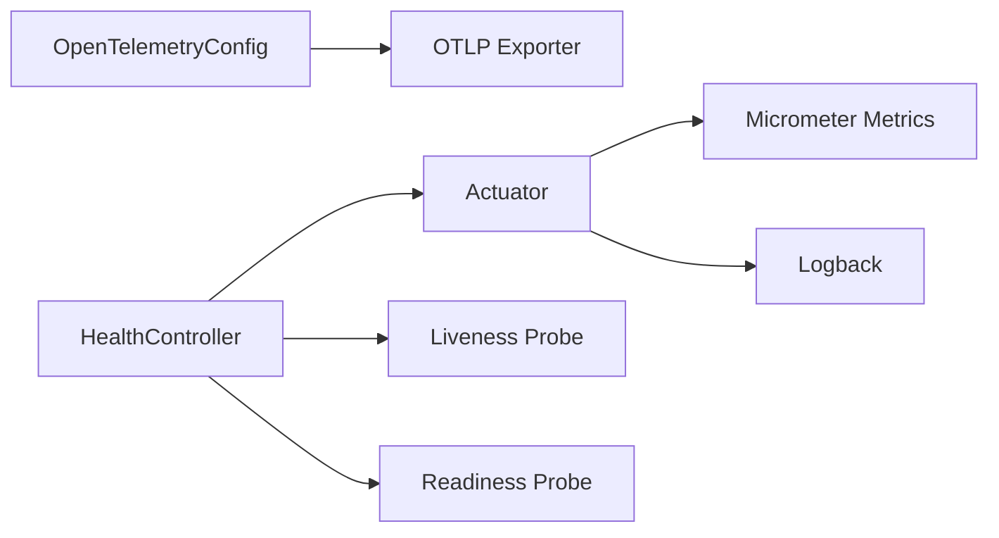

# Health Monitoring and Alerts

<cite>
**Referenced Files in This Document**
- [HealthController.java](file://backend_java/api/src/main/java/com/aliyun/tam/x/tron/api/HealthController.java)
- [application.yaml](file://backend_java/bootstrap/src/main/resources/application.yaml)
- [AgentMetricsHook.java](file://backend_java/core/src/main/java/com/aliyun/tam/x/tron/core/utils/AgentMetricsHook.java)
- [McpClientConfig.java](file://backend_java/core/src/main/java/com/aliyun/tam/x/tron/core/config/McpClientConfig.java)
- [ConfigController.java](file://backend_java/api/src/main/java/com/aliyun/tam/x/tron/api/ConfigController.java)
- [OpenTelemetryConfig.java](file://backend_java/bootstrap/src/main/java/com/aliyun/tam/x/tron/config/OpenTelemetryConfig.java)
- [logback.xml](file://backend_java/bootstrap/src/main/resources/logback.xml)
- [init.sql](file://backend_java/bootstrap/src/main/resources/schema/init.sql)
- [depoly_guide.md (EN)](file://docs/en/depoly_guide.md)
- [develop_guide.md (EN)](file://docs/en/develop_guide.md)
</cite>

## Table of Contents
1. [Introduction](#introduction)
2. [Project Structure](#project-structure)
3. [Core Components](#core-components)
4. [Architecture Overview](#architecture-overview)
5. [Detailed Component Analysis](#detailed-component-analysis)
6. [Dependency Analysis](#dependency-analysis)
7. [Performance Considerations](#performance-considerations)
8. [Troubleshooting Guide](#troubleshooting-guide)
9. [Conclusion](#conclusion)
10. [Appendices](#appendices)

## Introduction
This document explains the health monitoring and alerting capabilities in Tron OneAgent. It covers health check endpoints, system status evaluation, dependency health verification, metrics and tracing for observability, and integration with Kubernetes readiness/liveness probes. It also provides guidance on configuring thresholds, notifications, custom health checks for external services, and building monitoring dashboards. The goal is to help operators proactively monitor agent availability, detect resource and performance degradations, and maintain reliability through continuous monitoring and incident response.

## Project Structure
The health monitoring stack spans the backend API, configuration, metrics hooks, tracing, logging, and Kubernetes deployment manifests. The backend exposes a lightweight health endpoint and integrates with Spring Boot Actuator for metrics and Prometheus scraping. OpenTelemetry is optionally enabled for distributed tracing. Kubernetes deployments define liveness and readiness probes that rely on the health endpoint.

**Diagram sources**
- [HealthController.java:28-31](file://backend_java/api/src/main/java/com/aliyun/tam/x/tron/api/HealthController.java#L28-L31)
- [application.yaml:53-63](file://backend_java/bootstrap/src/main/resources/application.yaml#L53-L63)
- [OpenTelemetryConfig.java:105-140](file://backend_java/bootstrap/src/main/java/com/aliyun/tam/x/tron/config/OpenTelemetryConfig.java#L105-L140)
- [logback.xml:9-34](file://backend_java/bootstrap/src/main/resources/logback.xml#L9-L34)
- [depoly_guide.md (EN):251-264](file://docs/en/depoly_guide.md#L251-L264)

**Section sources**
- [HealthController.java:28-31](file://backend_java/api/src/main/java/com/aliyun/tam/x/tron/api/HealthController.java#L28-L31)
- [application.yaml:53-63](file://backend_java/bootstrap/src/main/resources/application.yaml#L53-L63)
- [OpenTelemetryConfig.java:105-140](file://backend_java/bootstrap/src/main/java/com/aliyun/tam/x/tron/config/OpenTelemetryConfig.java#L105-L140)
- [logback.xml:9-34](file://backend_java/bootstrap/src/main/resources/logback.xml#L9-L34)
- [depoly_guide.md (EN):251-264](file://docs/en/depoly_guide.md#L251-L264)

## Core Components
- Health endpoint: Lightweight HTTP endpoint returning a positive status to indicate the service is alive and responding.
- Actuator and metrics: Exposes health, metrics, and Prometheus scrape endpoint for system and application metrics.
- Tracing: Optional OpenTelemetry integration for distributed tracing with OTLP export.
- Logging: Structured logs via Logback with rolling file policy.
- Kubernetes probes: Liveness and readiness probes configured against the health endpoint.

Key implementation references:
- Health endpoint controller method
- Actuator exposure configuration
- Metrics hook publishing counters and summaries
- OpenTelemetry tracer provider and exporters
- Logback rolling policy
- Kubernetes probe definitions

**Section sources**
- [HealthController.java:28-31](file://backend_java/api/src/main/java/com/aliyun/tam/x/tron/api/HealthController.java#L28-L31)
- [application.yaml:53-63](file://backend_java/bootstrap/src/main/resources/application.yaml#L53-L63)
- [AgentMetricsHook.java:47-87](file://backend_java/core/src/main/java/com/aliyun/tam/x/tron/core/utils/AgentMetricsHook.java#L47-L87)
- [OpenTelemetryConfig.java:105-140](file://backend_java/bootstrap/src/main/java/com/aliyun/tam/x/tron/config/OpenTelemetryConfig.java#L105-L140)
- [logback.xml:16-29](file://backend_java/bootstrap/src/main/resources/logback.xml#L16-L29)
- [depoly_guide.md (EN):251-264](file://docs/en/deploy_guide.md#L251-L264)

## Architecture Overview
The health monitoring architecture centers on the health endpoint and Actuator integration. Kubernetes probes rely on the health endpoint to gate traffic until the service is ready. Metrics are published via Micrometer and scraped by Prometheus. Tracing is optional and exported via OTLP when enabled.

**Diagram sources**
- [HealthController.java:28-31](file://backend_java/api/src/main/java/com/aliyun/tam/x/tron/api/HealthController.java#L28-L31)
- [application.yaml:53-63](file://backend_java/bootstrap/src/main/resources/application.yaml#L53-L63)
- [depoly_guide.md (EN):251-264](file://docs/en/depoly_guide.md#L251-L264)

## Detailed Component Analysis

### Health Endpoint Implementation
The health endpoint is a simple GET handler that returns a positive status, enabling Kubernetes probes and basic system health checks.

**Diagram sources**
- [HealthController.java:28-31](file://backend_java/api/src/main/java/com/aliyun/tam/x/tron/api/HealthController.java#L28-L31)

**Section sources**
- [HealthController.java:28-31](file://backend_java/api/src/main/java/com/aliyun/tam/x/tron/api/HealthController.java#L28-L31)

### System Status Evaluation
System status evaluation is primarily based on:
- Health endpoint responsiveness (liveness/readiness).
- Database connectivity verified by successful schema initialization and queries.
- External service health via MCP client configuration and timeouts.

Operational checks:
- Verify health endpoint returns 200 OK.
- Confirm database tables exist and are accessible.
- Validate MCP client URLs and timeouts.

**Section sources**
- [init.sql:112-125](file://backend_java/bootstrap/src/main/resources/schema/init.sql#L112-L125)
- [McpClientConfig.java:74-86](file://backend_java/core/src/main/java/com/aliyun/tam/x/tron/core/config/McpClientConfig.java#L74-L86)

### Dependency Health Verification
External dependency verification is configured via MCP clients:
- Transport protocols and URLs.
- Initialization and request timeouts.
- Optional encrypted headers.

Operators can manage MCP configurations through the configuration API and adjust timeouts to reflect dependency health.

**Section sources**
- [McpClientConfig.java:35-93](file://backend_java/core/src/main/java/com/aliyun/tam/x/tron/core/config/McpClientConfig.java#L35-L93)
- [ConfigController.java:217-255](file://backend_java/api/src/main/java/com/aliyun/tam/x/tron/api/ConfigController.java#L217-L255)

### Health Indicator Configuration
Health indicators are exposed via Spring Boot Actuator. The management server exposes health, metrics, and Prometheus endpoints. Operators can customize the management port and endpoint exposure.

**Section sources**
- [application.yaml:53-63](file://backend_java/bootstrap/src/main/resources/application.yaml#L53-L63)

### Custom Health Checks for External Services
To implement custom health checks for external services:
- Define service-specific endpoints or circuit breaker checks.
- Integrate with the existing health endpoint pattern by adding new endpoints under the API context.
- Surface health outcomes via metrics and logs for correlation.

Guidance:
- Use the health endpoint as a template for new checks.
- Publish metrics for external service latency and error rates.
- Emit structured logs for failed checks.

[No sources needed since this section provides general guidance]

### Kubernetes Readiness/Liveness Probes Integration
Kubernetes probes are configured to use the health endpoint with tuned intervals and timeouts. These ensure traffic is only sent to ready pods and restart unhealthy containers automatically.

**Diagram sources**
- [depoly_guide.md (EN):251-264](file://docs/en/depoly_guide.md#L251-L264)

**Section sources**
- [depoly_guide.md (EN):251-264](file://docs/en/depoly_guide.md#L251-L264)

### Alerting Mechanisms, Thresholds, and Notifications
Alerting is built on top of the observability stack:
- Metrics: Use Prometheus to scrape Micrometer metrics and define alerts on thresholds (e.g., error counters, latency histograms).
- Tracing: Enable OpenTelemetry to export traces and configure alerting on error rates and latency.
- Logging: Centralize logs via SLS or ELK and set up log-based alerts.

Threshold configuration examples:
- Error counter thresholds per agent.
- Latency thresholds (TTFT, model time).
- External service timeouts and connection failures.

Notifications:
- Prometheus Alertmanager for alert routing.
- Integrations with SLO/SLA dashboards and on-call systems.

**Section sources**
- [develop_guide.md (EN):2600-2621](file://docs/en/develop_guide.md#L2600-L2621)
- [OpenTelemetryConfig.java:105-140](file://backend_java/bootstrap/src/main/java/com/aliyun/tam/x/tron/config/OpenTelemetryConfig.java#L105-L140)

### Practical Examples

- Implementing a custom health indicator:
  - Add a new endpoint similar to the health check pattern.
  - Return structured JSON with status and details.
  - Expose metrics for upstream dependencies.

- Configuring health check intervals:
  - Adjust Kubernetes probe periods and timeouts.
  - Tune MCP client timeouts to reflect dependency health.

- Setting up monitoring dashboards:
  - Grafana/Prometheus: Create panels for error counters, latency histograms, and external service metrics.
  - Tracing dashboards: Use OpenTelemetry UI or vendor consoles to visualize traces.

[No sources needed since this section provides general guidance]

### Proactive Monitoring for Availability, Resources, and Performance
- Availability: Monitor liveness and readiness probe success rates.
- Resource utilization: Track JVM/GC metrics, CPU/memory via OS/container metrics.
- Performance: Observe TTFT, model latency, tool invocation times, and error counts.

[No sources needed since this section provides general guidance]

### Incident Response Procedures and Automated Remediation
- Immediate actions: Scale replicas, drain nodes, roll back deployments.
- Automated remediation: Use HPA, PodDisruptionBudgets, and blue/green deployments.
- Postmortem: Review traces, logs, and metrics to identify root causes.

[No sources needed since this section provides general guidance]

## Dependency Analysis
The health monitoring stack depends on:
- HealthController for the primary health signal.
- Actuator for metrics and health endpoints.
- Micrometer for metrics publishing.
- Optional OpenTelemetry for tracing.
- Logback for structured logging.
- Kubernetes probes for runtime gating.

**Diagram sources**
- [HealthController.java:28-31](file://backend_java/api/src/main/java/com/aliyun/tam/x/tron/api/HealthController.java#L28-L31)
- [application.yaml:53-63](file://backend_java/bootstrap/src/main/resources/application.yaml#L53-L63)
- [OpenTelemetryConfig.java:105-140](file://backend_java/bootstrap/src/main/java/com/aliyun/tam/x/tron/config/OpenTelemetryConfig.java#L105-L140)
- [logback.xml:9-34](file://backend_java/bootstrap/src/main/resources/logback.xml#L9-L34)
- [depoly_guide.md (EN):251-264](file://docs/en/depoly_guide.md#L251-L264)

**Section sources**
- [HealthController.java:28-31](file://backend_java/api/src/main/java/com/aliyun/tam/x/tron/api/HealthController.java#L28-L31)
- [application.yaml:53-63](file://backend_java/bootstrap/src/main/resources/application.yaml#L53-L63)
- [OpenTelemetryConfig.java:105-140](file://backend_java/bootstrap/src/main/java/com/aliyun/tam/x/tron/config/OpenTelemetryConfig.java#L105-L140)
- [logback.xml:9-34](file://backend_java/bootstrap/src/main/resources/logback.xml#L9-L34)
- [depoly_guide.md (EN):251-264](file://docs/en/depoly_guide.md#L251-L264)

## Performance Considerations
- Keep health endpoint lightweight to avoid impacting latency.
- Tune probe intervals to balance responsiveness and overhead.
- Use histogram metrics for latency distributions to capture tail behavior.
- Limit log volume and retention to reduce I/O overhead.

[No sources needed since this section provides general guidance]

## Troubleshooting Guide
Common issues and resolutions:
- Health endpoint failing:
  - Verify the endpoint path and context path configuration.
  - Check application logs for startup errors.
- Metrics not appearing:
  - Confirm Actuator exposure and management port configuration.
  - Validate Prometheus scrape targets and firewall rules.
- Tracing not exported:
  - Ensure OpenTelemetry is enabled and endpoint/headers are correct.
  - Check exporter connectivity and credentials.
- Logs missing:
  - Confirm Logback appenders and rolling policy settings.
  - Verify log directory permissions and disk space.

**Section sources**
- [application.yaml:53-63](file://backend_java/bootstrap/src/main/resources/application.yaml#L53-L63)
- [OpenTelemetryConfig.java:105-140](file://backend_java/bootstrap/src/main/java/com/aliyun/tam/x/tron/config/OpenTelemetryConfig.java#L105-L140)
- [logback.xml:16-29](file://backend_java/bootstrap/src/main/resources/logback.xml#L16-L29)

## Conclusion
Tron OneAgent’s health monitoring relies on a simple yet effective combination of a health endpoint, Actuator-based metrics, optional OpenTelemetry tracing, and robust Kubernetes probes. By leveraging these components, operators can implement proactive monitoring, set meaningful thresholds, and build resilient alerting and remediation workflows. Extending the system with custom health checks and integrating with external services through MCP configurations enables comprehensive dependency health verification.

## Appendices

### Health Endpoint and Probe Configuration Reference
- Health endpoint path: /api/health/check
- Actuator endpoints: health, metrics, prometheus
- Management server port: 8091
- Kubernetes probes: HTTP GET /api/health/check with tuned intervals

**Section sources**
- [HealthController.java:28-31](file://backend_java/api/src/main/java/com/aliyun/tam/x/tron/api/HealthController.java#L28-L31)
- [application.yaml:53-63](file://backend_java/bootstrap/src/main/resources/application.yaml#L53-L63)
- [depoly_guide.md (EN):251-264](file://docs/en/depoly_guide.md#L251-L264)