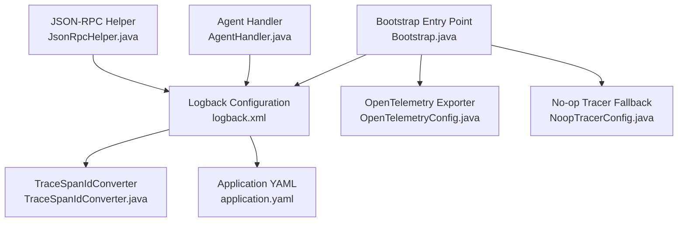
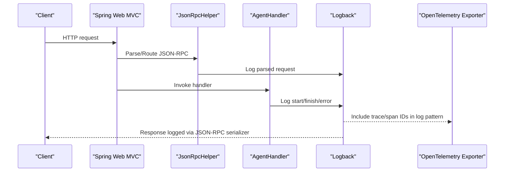
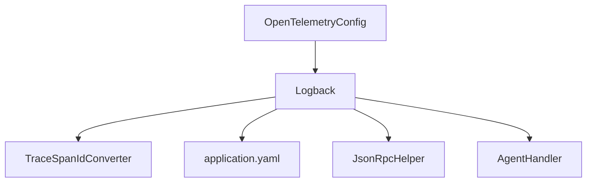
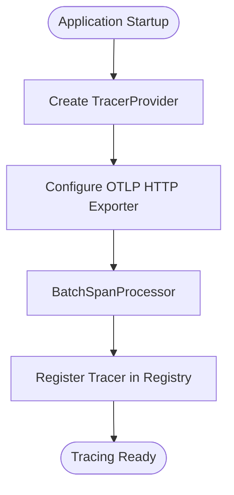

# Logging Configuration

<cite>
**Referenced Files in This Document**
- [logback.xml](file://backend_java/bootstrap/src/main/resources/logback.xml)
- [application.yaml](file://backend_java/bootstrap/src/main/resources/application.yaml)
- [Bootstrap.java](file://backend_java/bootstrap/src/main/java/com/aliyun/tam/x/tron/Bootstrap.java)
- [TraceSpanIdConverter.java](file://backend_java/infra/src/main/java/com/aliyun/tam/x/tron/infra/trace/TraceSpanIdConverter.java)
- [OpenTelemetryConfig.java](file://backend_java/bootstrap/src/main/java/com/aliyun/tam/x/tron/config/OpenTelemetryConfig.java)
- [NoopTracerConfig.java](file://backend_java/bootstrap/src/main/java/com/aliyun/tam/x/tron/config/NoopTracerConfig.java)
- [JsonRpcHelper.java](file://backend_java/api/src/main/java/com/aliyun/tam/x/tron/ws/jsonrpc/JsonRpcHelper.java)
- [AgentHandler.java](file://backend_java/core/src/main/java/com/aliyun/tam/x/tron/core/agents/AgentHandler.java)
</cite>

## Table of Contents
1. [Introduction](#introduction)
2. [Project Structure](#project-structure)
3. [Core Components](#core-components)
4. [Architecture Overview](#architecture-overview)
5. [Detailed Component Analysis](#detailed-component-analysis)
6. [Dependency Analysis](#dependency-analysis)
7. [Performance Considerations](#performance-considerations)
8. [Troubleshooting Guide](#troubleshooting-guide)
9. [Conclusion](#conclusion)
10. [Appendices](#appendices)

## Introduction
This document explains the logging configuration and management in Tron OneAgent. It covers the Logback configuration for structured logging, log levels, and output formatting; the logging patterns used across the system (including request/response logging, error tracking, and audit trails); log aggregation strategies, file rotation policies, and centralized logging integration via OpenTelemetry; practical guidance for custom log appenders, environment-specific log levels, and machine-parseable log structures; and security and compliance considerations for sensitive data filtering. It also provides log analysis techniques, troubleshooting tips, and integration guidance for platforms such as ELK Stack or Splunk.

## Project Structure
The logging subsystem is primarily configured in the bootstrap module and leverages shared infrastructure for tracing and OpenTelemetry export. The key files are:
- Logback configuration for console and rolling file appenders, pattern customization, and root logger level
- Application YAML for environment variables and optional OpenTelemetry configuration
- Trace ID/SPAN ID converter for correlation across logs and traces
- OpenTelemetry configuration for exporting spans to a central collector
- JSON-RPC and agent components that emit structured logs for request/response and lifecycle events

**Diagram sources**
- [logback.xml:1-38](file://backend_java/bootstrap/src/main/resources/logback.xml#L1-L38)
- [application.yaml:1-63](file://backend_java/bootstrap/src/main/resources/application.yaml#L1-L63)
- [Bootstrap.java:25-32](file://backend_java/bootstrap/src/main/java/com/aliyun/tam/x/tron/Bootstrap.java#L25-L32)
- [TraceSpanIdConverter.java:29-38](file://backend_java/infra/src/main/java/com/aliyun/tam/x/tron/infra/trace/TraceSpanIdConverter.java#L29-L38)
- [OpenTelemetryConfig.java:66-140](file://backend_java/bootstrap/src/main/java/com/aliyun/tam/x/tron/config/OpenTelemetryConfig.java#L66-L140)
- [NoopTracerConfig.java:65-74](file://backend_java/bootstrap/src/main/java/com/aliyun/tam/x/tron/config/NoopTracerConfig.java#L65-L74)
- [JsonRpcHelper.java:37-101](file://backend_java/api/src/main/java/com/aliyun/tam/x/tron/ws/jsonrpc/JsonRpcHelper.java#L37-L101)
- [AgentHandler.java:93-133](file://backend_java/core/src/main/java/com/aliyun/tam/x/tron/core/agents/AgentHandler.java#L93-L133)

**Section sources**
- [logback.xml:1-38](file://backend_java/bootstrap/src/main/resources/logback.xml#L1-L38)
- [application.yaml:1-63](file://backend_java/bootstrap/src/main/resources/application.yaml#L1-L63)
- [Bootstrap.java:25-32](file://backend_java/bootstrap/src/main/java/com/aliyun/tam/x/tron/Bootstrap.java#L25-L32)

## Core Components
- Logback configuration defines:
  - A custom conversion word for trace/span correlation
  - A console appender and a rolling file appender
  - A root logger set to INFO with both appenders attached
  - A package-level logger for the application package set to INFO
- Pattern includes timestamp, thread, level, logger name, trace/span IDs, and message
- Rolling policy rotates by date and size, with configurable history and total size cap
- OpenTelemetry integration exports traces to a remote collector when enabled via configuration

Key implementation references:
- Logback configuration and rolling policy
- Trace ID/SPAN ID conversion
- OpenTelemetry exporter and sampler configuration
- JSON-RPC and agent logging patterns

**Section sources**
- [logback.xml:4-37](file://backend_java/bootstrap/src/main/resources/logback.xml#L4-L37)
- [TraceSpanIdConverter.java:29-38](file://backend_java/infra/src/main/java/com/aliyun/tam/x/tron/infra/trace/TraceSpanIdConverter.java#L29-L38)
- [OpenTelemetryConfig.java:106-140](file://backend_java/bootstrap/src/main/java/com/aliyun/tam/x/tron/config/OpenTelemetryConfig.java#L106-L140)
- [JsonRpcHelper.java:76-99](file://backend_java/api/src/main/java/com/aliyun/tam/x/tron/ws/jsonrpc/JsonRpcHelper.java#L76-L99)
- [AgentHandler.java:93-133](file://backend_java/core/src/main/java/com/aliyun/tam/x/tron/core/agents/AgentHandler.java#L93-L133)

## Architecture Overview
The logging architecture integrates structured, machine-readable logs with distributed tracing. Logback emits logs enriched with trace and span identifiers, while OpenTelemetry exports spans to a central collector. JSON-RPC and agent components emit structured logs for request/response and lifecycle events.

**Diagram sources**
- [logback.xml:6-6](file://backend_java/bootstrap/src/main/resources/logback.xml#L6-L6)
- [TraceSpanIdConverter.java:32-37](file://backend_java/infra/src/main/java/com/aliyun/tam/x/tron/infra/trace/TraceSpanIdConverter.java#L32-L37)
- [JsonRpcHelper.java:45-80](file://backend_java/api/src/main/java/com/aliyun/tam/x/tron/ws/jsonrpc/JsonRpcHelper.java#L45-L80)
- [AgentHandler.java:93-133](file://backend_java/core/src/main/java/com/aliyun/tam/x/tron/core/agents/AgentHandler.java#L93-L133)
- [OpenTelemetryConfig.java:120-132](file://backend_java/bootstrap/src/main/java/com/aliyun/tam/x/tron/config/OpenTelemetryConfig.java#L120-L132)

## Detailed Component Analysis

### Logback Configuration and Pattern
- Conversion rule registers a custom converter to embed trace and span IDs into log messages
- Pattern includes timestamp, thread, level, logger name, trace/span IDs, and message
- Console appender uses the same pattern for local development
- Rolling file appender writes to a single file with date/time and index-based rotation
- Root logger level is INFO; application package logger is INFO
- Rolling policy supports:
  - Size-based rotation with configurable max file size
  - Time-based retention with configurable history count
  - Total size cap to limit disk usage
  - Cleanup on startup to prune old archives

Practical implications:
- Logs are structured and include correlation IDs for trace-driven debugging
- File rotation prevents unbounded growth and supports long-term retention
- Environment variables can tune rotation thresholds externally

**Section sources**
- [logback.xml:4-37](file://backend_java/bootstrap/src/main/resources/logback.xml#L4-L37)

### Trace/SPAN ID Injection
- The custom converter reads the current OpenTelemetry span context and emits traceId,spanId when available
- When no active span exists, the converter returns an empty string, ensuring logs remain valid but without correlation

Operational impact:
- Enables cross-referencing logs with traces in centralized observability systems
- Avoids breaking log parsing when tracing is disabled or unavailable

**Section sources**
- [TraceSpanIdConverter.java:29-38](file://backend_java/infra/src/main/java/com/aliyun/tam/x/tron/infra/trace/TraceSpanIdConverter.java#L29-L38)

### OpenTelemetry Export and Sampling
- When enabled, the configuration creates a TracerProvider with a custom sampler that samples only server-side spans
- The exporter sends spans to a configured endpoint with optional headers
- A servlet filter integrates web request tracing
- A bean post-processor wraps the DataSource for database operation tracing
- On application startup, the tracer registry is initialized and tracing hooks enabled

Integration note:
- The exporter uses OTLP over HTTP; configure endpoint and headers via properties
- Sampling reduces overhead by focusing on inbound requests

**Section sources**
- [OpenTelemetryConfig.java:106-140](file://backend_java/bootstrap/src/main/java/com/aliyun/tam/x/tron/config/OpenTelemetryConfig.java#L106-L140)
- [OpenTelemetryConfig.java:190-216](file://backend_java/bootstrap/src/main/java/com/aliyun/tam/x/tron/config/OpenTelemetryConfig.java#L190-L216)
- [OpenTelemetryConfig.java:219-225](file://backend_java/bootstrap/src/main/java/com/aliyun/tam/x/tron/config/OpenTelemetryConfig.java#L219-L225)

### JSON-RPC Logging Patterns
- Parsing errors are logged at warn level with stack traces
- Serialization failures are logged at error level; on response serialization errors, a standardized error response is attempted
- These patterns support request/response auditing and incident triage

Operational guidance:
- Use warn for malformed requests and error for internal serialization failures
- Centralized logging can filter by level and correlate with trace IDs

**Section sources**
- [JsonRpcHelper.java:76-101](file://backend_java/api/src/main/java/com/aliyun/tam/x/tron/ws/jsonrpc/JsonRpcHelper.java#L76-L101)

### Agent Lifecycle Logging
- Structured logs record the start and completion of user input handling, including identifiers for agent, user, session, and message
- Exceptions are logged with timing and identifiers for rapid diagnosis
- These logs form the basis of audit trails for agent interactions

Operational guidance:
- Use INFO for lifecycle events and ERROR for exceptions
- Include identifiers consistently to enable cross-system correlation

**Section sources**
- [AgentHandler.java:93-133](file://backend_java/core/src/main/java/com/aliyun/tam/x/tron/core/agents/AgentHandler.java#L93-L133)

### Log Levels and Environments
- Root logger is set to INFO in the Logback configuration
- Package-level logger for the application package is INFO
- Environment-specific overrides can be achieved via:
  - System properties or environment variables for Logback variables (e.g., max file size, history)
  - Spring profile-specific YAML overlays
  - OpenTelemetry enablement toggled by property

Best practices:
- Development: Consider lowering log level to DEBUG selectively for targeted packages
- Staging/Production: Keep INFO or WARN globally; increase verbosity only for specific packages during incidents

**Section sources**
- [logback.xml:31-36](file://backend_java/bootstrap/src/main/resources/logback.xml#L31-L36)
- [application.yaml:53-63](file://backend_java/bootstrap/src/main/resources/application.yaml#L53-L63)

### Structured Logging for Machine Parsing
- Pattern includes timestamp, thread, level, logger name, trace/span IDs, and message
- JSON-RPC and agent components use parameterized logging with placeholders for identifiers
- This structure enables:
  - Regex-based parsing
  - Structured field extraction in log processors
  - Cross-correlation with trace IDs

Recommendations:
- Normalize field names (e.g., traceId, spanId) for downstream parsers
- Avoid embedding free-form text in structured fields; keep them small and typed

**Section sources**
- [logback.xml:6-6](file://backend_java/bootstrap/src/main/resources/logback.xml#L6-L6)
- [JsonRpcHelper.java:76-101](file://backend_java/api/src/main/java/com/aliyun/tam/x/tron/ws/jsonrpc/JsonRpcHelper.java#L76-L101)
- [AgentHandler.java:93-133](file://backend_java/core/src/main/java/com/aliyun/tam/x/tron/core/agents/AgentHandler.java#L93-L133)

### Log Aggregation and Centralized Logging
- OpenTelemetry exporter sends spans to a remote collector; configure endpoint and headers via properties
- Combine exported spans with Logback logs enriched with trace/span IDs
- Centralized systems (e.g., ELK, Splunk) can correlate logs and traces using the IDs

Implementation steps:
- Enable OpenTelemetry with appropriate endpoint and headers
- Ensure the log pattern includes trace/span IDs
- Configure collectors and dashboards to visualize both logs and traces

**Section sources**
- [OpenTelemetryConfig.java:120-132](file://backend_java/bootstrap/src/main/java/com/aliyun/tam/x/tron/config/OpenTelemetryConfig.java#L120-L132)
- [logback.xml:6-6](file://backend_java/bootstrap/src/main/resources/logback.xml#L6-L6)

### File Rotation Policies
- Rolling by size and time with configurable max file size and retention count
- Total size cap limits cumulative disk usage
- Cleanup on startup prunes old archives

Guidance:
- Adjust max file size and history based on throughput and retention needs
- Monitor total size cap to avoid unexpected truncation

**Section sources**
- [logback.xml:22-28](file://backend_java/bootstrap/src/main/resources/logback.xml#L22-L28)

### Security and Compliance Considerations
- Sensitive data filtering:
  - Avoid logging credentials, tokens, or personally identifiable information (PII)
  - Use masking or redaction in logs; consider custom converters to sanitize fields
  - Restrict log levels for components handling sensitive data
- Compliance:
  - Retain audit logs per policy; align retention with regulatory requirements
  - Ensure logs are immutable or tamper-evident in transit and storage
  - Control access to log systems and dashboards

[No sources needed since this section provides general guidance]

### Practical Examples

- Implementing a custom Logback appender:
  - Add a new appender definition in Logback configuration and attach it to the root logger
  - Reference: [logback.xml:9-29](file://backend_java/bootstrap/src/main/resources/logback.xml#L9-L29)
- Configuring log levels per environment:
  - Override Logback variables via environment variables or system properties
  - Reference: [logback.xml:24-26](file://backend_java/bootstrap/src/main/resources/logback.xml#L24-L26)
- Structuring logs for machine parsing:
  - Use consistent patterns and parameterized logging with identifiers
  - Reference: [AgentHandler.java:93-133](file://backend_java/core/src/main/java/com/aliyun/tam/x/tron/core/agents/AgentHandler.java#L93-L133)

**Section sources**
- [logback.xml:9-29](file://backend_java/bootstrap/src/main/resources/logback.xml#L9-L29)
- [AgentHandler.java:93-133](file://backend_java/core/src/main/java/com/aliyun/tam/x/tron/core/agents/AgentHandler.java#L93-L133)

## Dependency Analysis
The logging system depends on:
- Logback for formatting and output
- OpenTelemetry for distributed tracing and exporter integration
- JSON-RPC and agent components for emitting structured logs
- Application YAML for environment configuration

**Diagram sources**
- [logback.xml:4-37](file://backend_java/bootstrap/src/main/resources/logback.xml#L4-L37)
- [application.yaml:1-63](file://backend_java/bootstrap/src/main/resources/application.yaml#L1-L63)
- [OpenTelemetryConfig.java:106-140](file://backend_java/bootstrap/src/main/java/com/aliyun/tam/x/tron/config/OpenTelemetryConfig.java#L106-L140)
- [JsonRpcHelper.java:76-101](file://backend_java/api/src/main/java/com/aliyun/tam/x/tron/ws/jsonrpc/JsonRpcHelper.java#L76-L101)
- [AgentHandler.java:93-133](file://backend_java/core/src/main/java/com/aliyun/tam/x/tron/core/agents/AgentHandler.java#L93-L133)

**Section sources**
- [logback.xml:1-38](file://backend_java/bootstrap/src/main/resources/logback.xml#L1-L38)
- [application.yaml:1-63](file://backend_java/bootstrap/src/main/resources/application.yaml#L1-L63)
- [OpenTelemetryConfig.java:66-140](file://backend_java/bootstrap/src/main/java/com/aliyun/tam/x/tron/config/OpenTelemetryConfig.java#L66-L140)
- [JsonRpcHelper.java:37-101](file://backend_java/api/src/main/java/com/aliyun/tam/x/tron/ws/jsonrpc/JsonRpcHelper.java#L37-L101)
- [AgentHandler.java:93-133](file://backend_java/core/src/main/java/com/aliyun/tam/x/tron/core/agents/AgentHandler.java#L93-L133)

## Performance Considerations
- Sampling reduces trace overhead by recording only server spans
- Rolling policy prevents excessive disk usage and I/O contention
- Parameterized logging minimizes string concatenation overhead
- Avoid DEBUG level in production unless necessary; use targeted package-level overrides

[No sources needed since this section provides general guidance]

## Troubleshooting Guide
- Correlate logs with traces:
  - Verify the trace/span IDs appear in the log pattern
  - Confirm OpenTelemetry exporter is enabled and reachable
- Inspect JSON-RPC errors:
  - Parse warnings indicate malformed requests; serialization errors indicate internal issues
- Audit agent interactions:
  - Use INFO logs for lifecycle events and ERROR logs for exceptions
- Adjust verbosity:
  - Temporarily raise log level for specific packages during investigations

**Section sources**
- [logback.xml:6-6](file://backend_java/bootstrap/src/main/resources/logback.xml#L6-L6)
- [OpenTelemetryConfig.java:120-132](file://backend_java/bootstrap/src/main/java/com/aliyun/tam/x/tron/config/OpenTelemetryConfig.java#L120-L132)
- [JsonRpcHelper.java:76-101](file://backend_java/api/src/main/java/com/aliyun/tam/x/tron/ws/jsonrpc/JsonRpcHelper.java#L76-L101)
- [AgentHandler.java:93-133](file://backend_java/core/src/main/java/com/aliyun/tam/x/tron/core/agents/AgentHandler.java#L93-L133)

## Conclusion
Tron OneAgent employs a robust logging architecture combining Logback with OpenTelemetry. The configuration provides structured, machine-parseable logs enriched with trace/span IDs, supports safe file rotation, and integrates with centralized observability systems. By leveraging the documented patterns and configurations, teams can implement effective monitoring, auditing, and troubleshooting while maintaining security and compliance.

[No sources needed since this section summarizes without analyzing specific files]

## Appendices

### Appendix A: Logback Pattern Breakdown
- Timestamp: consistent, sortable format
- Thread: identifies execution context
- Level: severity for filtering
- Logger: package/class for scoping
- Trace/SPAN IDs: correlation to distributed traces
- Message: structured payload with placeholders

**Section sources**
- [logback.xml:6-6](file://backend_java/bootstrap/src/main/resources/logback.xml#L6-L6)

### Appendix B: OpenTelemetry Export Flow

**Diagram sources**
- [OpenTelemetryConfig.java:106-140](file://backend_java/bootstrap/src/main/java/com/aliyun/tam/x/tron/config/OpenTelemetryConfig.java#L106-L140)
- [OpenTelemetryConfig.java:183-188](file://backend_java/bootstrap/src/main/java/com/aliyun/tam/x/tron/config/OpenTelemetryConfig.java#L183-L188)
- [OpenTelemetryConfig.java:219-225](file://backend_java/bootstrap/src/main/java/com/aliyun/tam/x/tron/config/OpenTelemetryConfig.java#L219-L225)