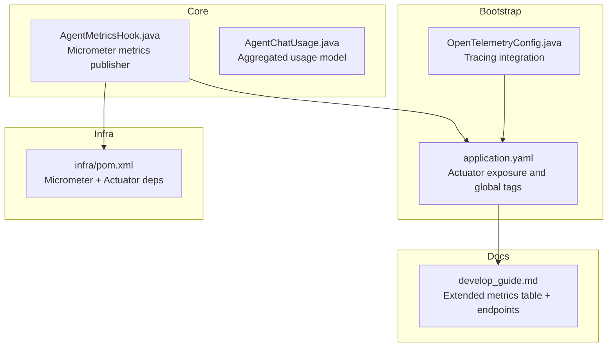
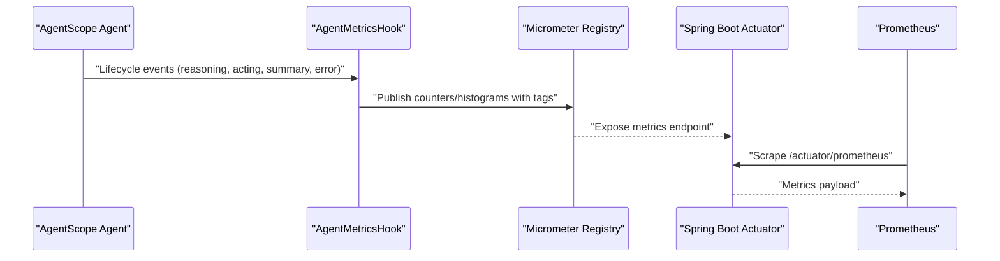
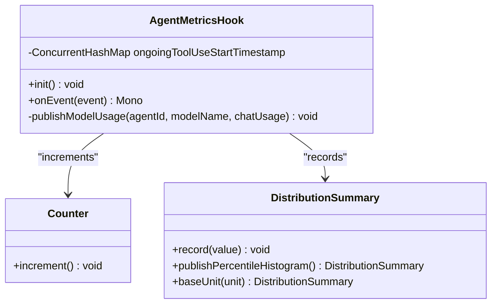
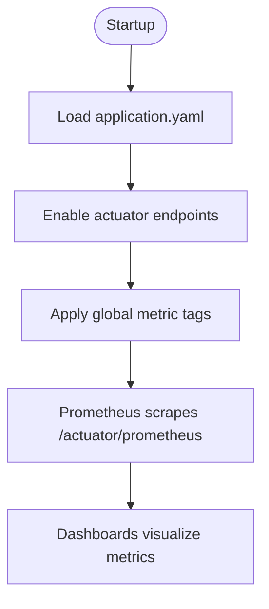
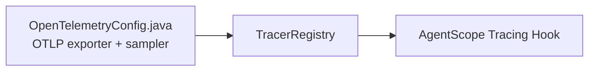
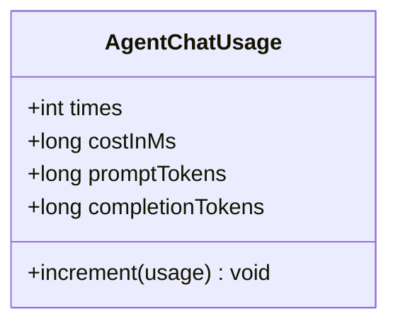
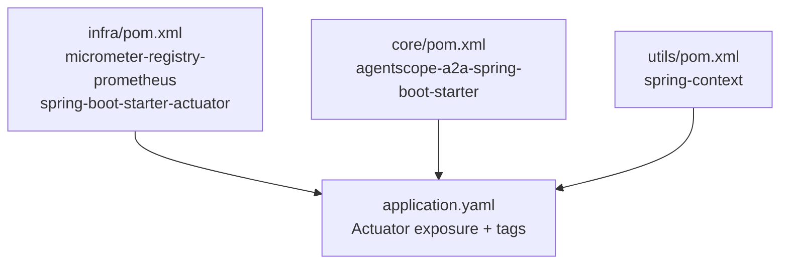

# Metrics Collection

<cite>
**Referenced Files in This Document**
- [AgentMetricsHook.java](file://backend_java/core/src/main/java/com/aliyun/tam/x/tron/core/utils/AgentMetricsHook.java)
- [application.yaml](file://backend_java/bootstrap/src/main/resources/application.yaml)
- [OpenTelemetryConfig.java](file://backend_java/bootstrap/src/main/java/com/aliyun/tam/x/tron/config/OpenTelemetryConfig.java)
- [develop_guide.md](file://docs/en/develop_guide.md)
- [infra pom.xml](file://backend_java/infra/pom.xml)
- [core pom.xml](file://backend_java/core/pom.xml)
- [utils pom.xml](file://backend_java/utils/pom.xml)
- [AgentChatUsage.java](file://backend_java/core/src/main/java/com/aliyun/tam/x/tron/core/agents/AgentChatUsage.java)
</cite>

## Table of Contents
1. [Introduction](#introduction)
2. [Project Structure](#project-structure)
3. [Core Components](#core-components)
4. [Architecture Overview](#architecture-overview)
5. [Detailed Component Analysis](#detailed-component-analysis)
6. [Dependency Analysis](#dependency-analysis)
7. [Performance Considerations](#performance-considerations)
8. [Troubleshooting Guide](#troubleshooting-guide)
9. [Conclusion](#conclusion)
10. [Appendices](#appendices)

## Introduction
This document explains the metrics collection system in Tron OneAgent, focusing on the AgentMetricsHook that tracks agent performance, usage statistics, and system health indicators. It documents the Prometheus metrics exposure via Spring Boot Actuator, the built-in metrics exposed by the system, and recommended tagging strategies. Practical guidance is included for implementing custom metrics, configuring metric filters, integrating with monitoring dashboards, and interpreting metrics for optimization and capacity planning.

## Project Structure
The metrics system spans several modules:
- Core module defines the AgentMetricsHook that subscribes to AgentScope lifecycle events and publishes Micrometer metrics.
- Infrastructure module enables Micrometer registry and Actuator endpoints.
- Bootstrap module configures Actuator exposure and global metric tags.
- Documentation describes the extended metrics and endpoints.

**Diagram sources**
- [AgentMetricsHook.java:36-89](file://backend_java/core/src/main/java/com/aliyun/tam/x/tron/core/utils/AgentMetricsHook.java#L36-L89)
- [application.yaml:53-63](file://backend_java/bootstrap/src/main/resources/application.yaml#L53-L63)
- [OpenTelemetryConfig.java:66-90](file://backend_java/bootstrap/src/main/java/com/aliyun/tam/x/tron/config/OpenTelemetryConfig.java#L66-L90)
- [develop_guide.md:2600-2621](file://docs/en/develop_guide.md#L2600-L2621)
- [infra pom.xml:30-38](file://backend_java/infra/pom.xml#L30-L38)

**Section sources**
- [AgentMetricsHook.java:36-89](file://backend_java/core/src/main/java/com/aliyun/tam/x/tron/core/utils/AgentMetricsHook.java#L36-L89)
- [application.yaml:53-63](file://backend_java/bootstrap/src/main/resources/application.yaml#L53-L63)
- [develop_guide.md:2600-2621](file://docs/en/develop_guide.md#L2600-L2621)
- [infra pom.xml:30-38](file://backend_java/infra/pom.xml#L30-L38)

## Core Components
- AgentMetricsHook: A system-wide hook that listens to AgentScope lifecycle events and emits counters and distribution summaries for reasoning, acting, summarization, tool usage, and model usage.
- Micrometer + Prometheus: Exposed via Spring Boot Actuator endpoints for scraping.
- Global tags: Applied at the application level to enrich metrics with application metadata.

Key responsibilities:
- Track reasoning, acting, and summarization counts per agent and model.
- Record tool invocation durations with agent and tool name tags.
- Publish model input tokens, output tokens, and model time histograms.
- Increment error counters on AgentScope error events.

**Section sources**
- [AgentMetricsHook.java:36-115](file://backend_java/core/src/main/java/com/aliyun/tam/x/tron/core/utils/AgentMetricsHook.java#L36-L115)
- [application.yaml:53-63](file://backend_java/bootstrap/src/main/resources/application.yaml#L53-L63)
- [develop_guide.md:2600-2621](file://docs/en/develop_guide.md#L2600-L2621)

## Architecture Overview
The metrics pipeline integrates AgentScope hooks with Micrometer and exposes Prometheus-formatted metrics through Actuator.

**Diagram sources**
- [AgentMetricsHook.java:46-89](file://backend_java/core/src/main/java/com/aliyun/tam/x/tron/core/utils/AgentMetricsHook.java#L46-L89)
- [application.yaml:56-59](file://backend_java/bootstrap/src/main/resources/application.yaml#L56-L59)
- [develop_guide.md:2618-2621](file://docs/en/develop_guide.md#L2618-L2621)

## Detailed Component Analysis

### AgentMetricsHook Implementation
AgentMetricsHook subscribes to AgentScope system hooks and publishes metrics to Micrometer. It maintains a per-tool-use timestamp map to compute tool invocation durations.

**Diagram sources**
- [AgentMetricsHook.java:36-115](file://backend_java/core/src/main/java/com/aliyun/tam/x/tron/core/utils/AgentMetricsHook.java#L36-L115)

Behavior highlights:
- Reasoning and summary events trigger counter increments and model usage histograms.
- Acting pre/post events track tool invocation start/end timestamps and compute durations.
- Error events increment error counters.

Tagging strategy:
- agent.id: derived from agent description.
- model.name: model identifier for reasoning/summary and model usage.
- tool.name: tool name for tool invocation time histogram.

Built-in metrics produced:
- Counters: reasoning, acting, summary, error.
- Histograms: tool time, model input/output tokens, model time.

**Section sources**
- [AgentMetricsHook.java:46-115](file://backend_java/core/src/main/java/com/aliyun/tam/x/tron/core/utils/AgentMetricsHook.java#L46-L115)

### Prometheus Exposure and Configuration
- Actuator endpoints are enabled for health, metrics, and prometheus.
- Global tags include application name for consistent labeling across instances.
- Prometheus scrape endpoint is available for dashboards.

**Diagram sources**
- [application.yaml:53-63](file://backend_java/bootstrap/src/main/resources/application.yaml#L53-L63)
- [develop_guide.md:2618-2621](file://docs/en/develop_guide.md#L2618-L2621)

**Section sources**
- [application.yaml:53-63](file://backend_java/bootstrap/src/main/resources/application.yaml#L53-L63)
- [develop_guide.md:2618-2621](file://docs/en/develop_guide.md#L2618-L2621)

### Built-in Metrics Catalog
The system exposes the following metrics with their labels and types:

- one.agent.e2el (histogram): End-to-end latency per agent.
- one.agent.ttft (histogram): Time to first token (thinking + reasoning).
- one.agent.response.ttft (histogram): Final response TTFT (excluding thinking/summarizing).
- one.agent.times.reasoning (counter): Reasoning count per agent and model.
- one.agent.times.acting (counter): Action invocation count per agent.
- one.agent.times.summary (counter): Summary output count per agent and model.
- one.agent.times.error (counter): Error count per agent.
- one.agent.tool.time (histogram): Tool invocation time per agent and tool.
- one.agent.model.input (histogram): Model input tokens per agent and model.
- one.agent.model.output (histogram): Model output tokens per agent and model.
- one.agent.model.time (histogram): Model invocation time per agent and model.

These metrics are documented in the development guide and exposed via Actuator.

**Section sources**
- [develop_guide.md:2600-2617](file://docs/en/develop_guide.md#L2600-L2617)

### Tracing Integration (Observability Context)
While not part of the metrics hook itself, the OpenTelemetry configuration demonstrates how distributed tracing is integrated alongside metrics. This helps correlate traces with metrics for deeper diagnostics.

**Diagram sources**
- [OpenTelemetryConfig.java:105-140](file://backend_java/bootstrap/src/main/java/com/aliyun/tam/x/tron/config/OpenTelemetryConfig.java#L105-L140)
- [OpenTelemetryConfig.java:219-225](file://backend_java/bootstrap/src/main/java/com/aliyun/tam/x/tron/config/OpenTelemetryConfig.java#L219-L225)

**Section sources**
- [OpenTelemetryConfig.java:66-90](file://backend_java/bootstrap/src/main/java/com/aliyun/tam/x/tron/config/OpenTelemetryConfig.java#L66-L90)

### Aggregated Usage Model
AgentChatUsage aggregates counts, costs, and token usage for reporting and potential downstream metrics.

**Diagram sources**
- [AgentChatUsage.java:13-32](file://backend_java/core/src/main/java/com/aliyun/tam/x/tron/core/agents/AgentChatUsage.java#L13-L32)

**Section sources**
- [AgentChatUsage.java:13-32](file://backend_java/core/src/main/java/com/aliyun/tam/x/tron/core/agents/AgentChatUsage.java#L13-L32)

## Dependency Analysis
The metrics stack relies on Micrometer and Actuator dependencies declared in the infrastructure module and enabled in the bootstrap configuration.

**Diagram sources**
- [infra pom.xml:30-38](file://backend_java/infra/pom.xml#L30-L38)
- [core pom.xml:47-55](file://backend_java/core/pom.xml#L47-L55)
- [utils pom.xml:14-23](file://backend_java/utils/pom.xml#L14-L23)
- [application.yaml:53-63](file://backend_java/bootstrap/src/main/resources/application.yaml#L53-L63)

**Section sources**
- [infra pom.xml:30-38](file://backend_java/infra/pom.xml#L30-L38)
- [core pom.xml:47-55](file://backend_java/core/pom.xml#L47-L55)
- [utils pom.xml:14-23](file://backend_java/utils/pom.xml#L14-L23)
- [application.yaml:53-63](file://backend_java/bootstrap/src/main/resources/application.yaml#L53-L63)

## Performance Considerations
- Metric cardinality: Tagging by agent.id and tool.name can increase series count. Limit agent/tool variety or use sampling where appropriate.
- Percentile histograms: Publishing percentile histograms adds overhead; consider disabling or reducing samples in high-throughput environments.
- Frequency of emissions: Tool timing is emitted per invocation; ensure tool usage volume aligns with scrape interval.
- Global tags: Applying application-level tags is lightweight but ensures consistent grouping across deployments.

[No sources needed since this section provides general guidance]

## Troubleshooting Guide
- Metrics not appearing:
  - Verify Actuator endpoints are exposed and reachable.
  - Confirm Micrometer Prometheus registry is present in dependencies.
- Missing labels:
  - Ensure agent descriptions and tool names are populated; missing values can lead to sparse label sets.
- Unexpected spikes:
  - Check for increased acting or reasoning counts; investigate tool invocation outliers via tool.time histograms.
- Tracing vs metrics:
  - Use tracing to drill into slow requests and correlate with metrics for root cause analysis.

**Section sources**
- [application.yaml:53-63](file://backend_java/bootstrap/src/main/resources/application.yaml#L53-L63)
- [develop_guide.md:2618-2621](file://docs/en/develop_guide.md#L2618-L2621)

## Conclusion
The AgentMetricsHook provides a robust foundation for measuring agent performance and usage. Combined with Micrometer and Actuator, it exposes Prometheus-ready metrics that support dashboards and alerting. Proper tagging, careful cardinality management, and periodic tuning ensure accurate insights with minimal operational overhead.

[No sources needed since this section summarizes without analyzing specific files]

## Appendices

### A. Implementing Custom Metrics
- Define a new counter or histogram with relevant labels (e.g., agent.id, model.name, tool.name).
- Emit during relevant lifecycle events or after specific actions.
- Keep label sets concise to avoid excessive series growth.

[No sources needed since this section provides general guidance]

### B. Metric Filters and Scraping
- Configure scrape intervals aligned with traffic patterns.
- Use recording rules to pre-aggregate heavy series if needed.
- Apply relabel_configs to normalize labels and reduce cardinality.

[No sources needed since this section provides general guidance]

### C. Interpreting Metrics for Optimization and Capacity Planning
- Use reasoning and acting counters to estimate average workloads per agent.
- Monitor tool.time percentiles to identify bottlenecks.
- Track model.input/output and model.time to assess token efficiency and latency budgets.
- Correlate with tracing spans for end-to-end visibility.

[No sources needed since this section provides general guidance]