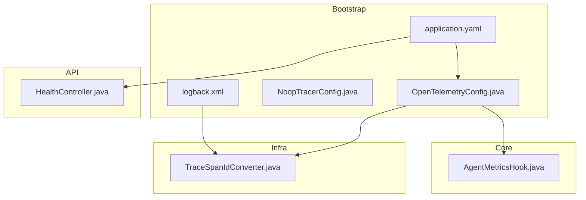
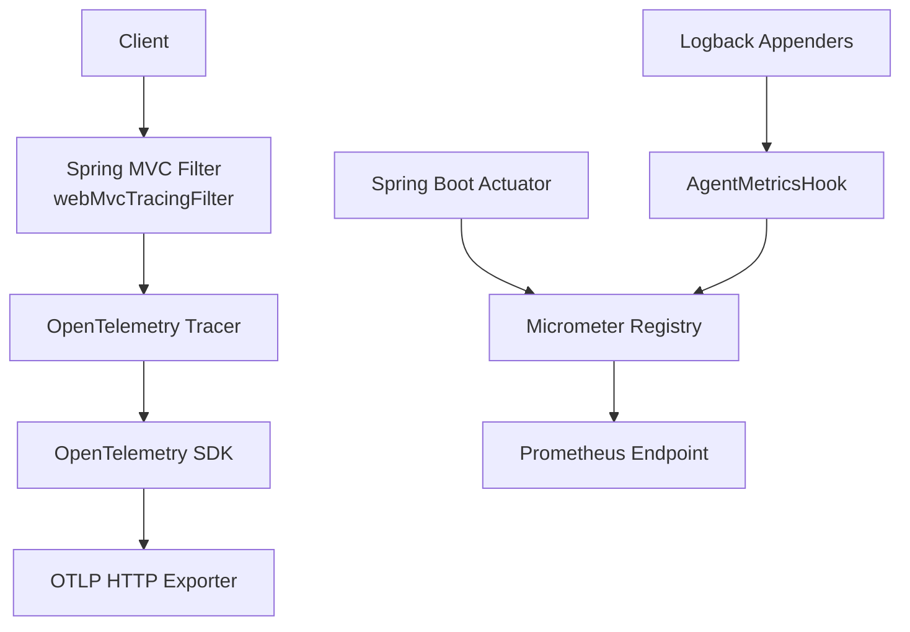
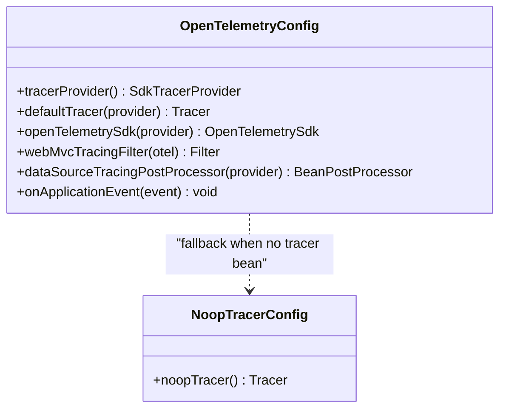
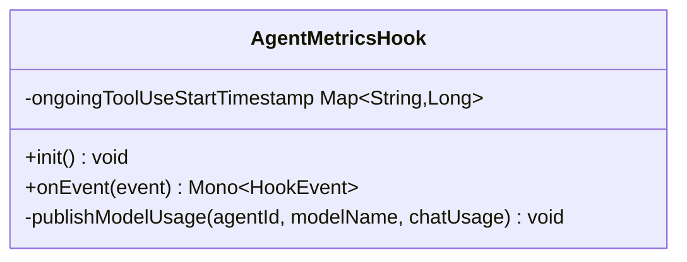
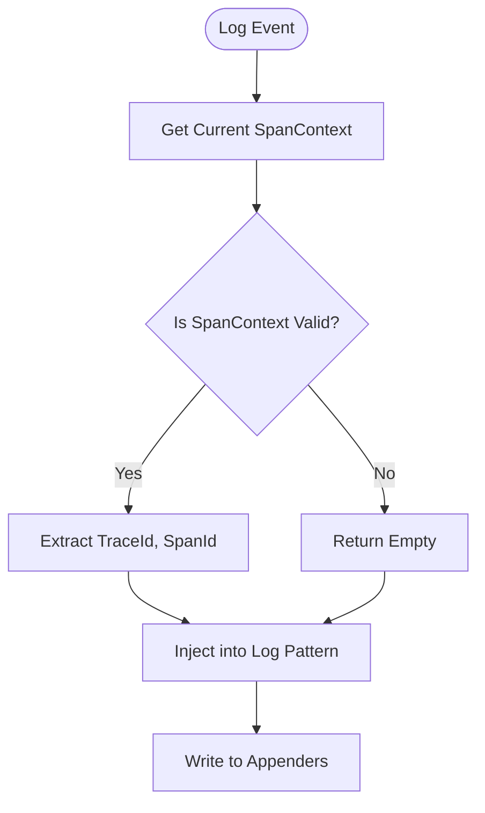
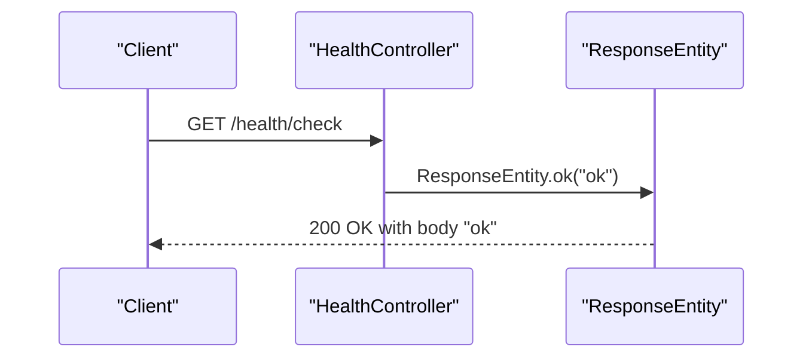
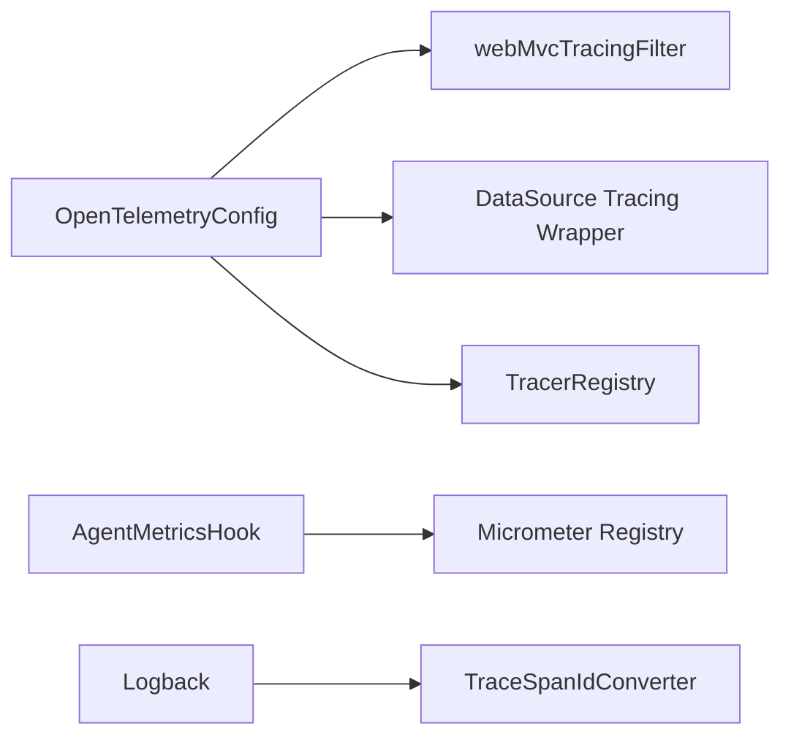

# Observability and Monitoring

<cite>
**Referenced Files in This Document**
- [logback.xml](file://backend_java/bootstrap/src/main/resources/logback.xml)
- [application.yaml](file://backend_java/bootstrap/src/main/resources/application.yaml)
- [OpenTelemetryConfig.java](file://backend_java/bootstrap/src/main/java/com/aliyun/tam/x/tron/config/OpenTelemetryConfig.java)
- [NoopTracerConfig.java](file://backend_java/bootstrap/src/main/java/com/aliyun/tam/x/tron/config/NoopTracerConfig.java)
- [TraceSpanIdConverter.java](file://backend_java/infra/src/main/java/com/aliyun/tam/x/tron/infra/trace/TraceSpanIdConverter.java)
- [AgentMetricsHook.java](file://backend_java/core/src/main/java/com/aliyun/tam/x/tron/core/utils/AgentMetricsHook.java)
- [HealthController.java](file://backend_java/api/src/main/java/com/aliyun/tam/x/tron/api/HealthController.java)
- [WebMvcConfig.java](file://backend_java/bootstrap/src/main/java/com/aliyun/tam/x/tron/config/WebMvcConfig.java)
- [WebSocketConfig.java](file://backend_java/bootstrap/src/main/java/com/aliyun/tam/x/tron/config/WebSocketConfig.java)
</cite>

## Table of Contents
1. [Introduction](#introduction)
2. [Project Structure](#project-structure)
3. [Core Components](#core-components)
4. [Architecture Overview](#architecture-overview)
5. [Detailed Component Analysis](#detailed-component-analysis)
6. [Dependency Analysis](#dependency-analysis)
7. [Performance Considerations](#performance-considerations)
8. [Troubleshooting Guide](#troubleshooting-guide)
9. [Conclusion](#conclusion)
10. [Appendices](#appendices)

## Introduction
This document explains the observability and monitoring capabilities in Tron OneAgent. It covers distributed tracing via OpenTelemetry, metrics collection with Micrometer and Prometheus, logging configuration with Logback and structured patterns, health checks, and hooks for agent performance tracking. It also provides guidance on integrating with cloud monitoring platforms, building custom metrics and tracing spans, and operational best practices for production environments.

## Project Structure
The observability stack is primarily implemented in the backend Java module:
- OpenTelemetry tracing and exporters are configured via a dedicated configuration class.
- Metrics are exposed through Spring Boot Actuator and Micrometer with Prometheus integration.
- Logging is configured with Logback, including a custom converter to embed trace identifiers.
- A dedicated hook tracks agent lifecycle events and publishes metrics.
- Health endpoints expose readiness/liveness checks.

**Diagram sources**
- [OpenTelemetryConfig.java:66-227](file://backend_java/bootstrap/src/main/java/com/aliyun/tam/x/tron/config/OpenTelemetryConfig.java#L66-L227)
- [NoopTracerConfig.java:65-74](file://backend_java/bootstrap/src/main/java/com/aliyun/tam/x/tron/config/NoopTracerConfig.java#L65-L74)
- [logback.xml:1-38](file://backend_java/bootstrap/src/main/resources/logback.xml#L1-L38)
- [application.yaml:53-63](file://backend_java/bootstrap/src/main/resources/application.yaml#L53-L63)
- [AgentMetricsHook.java:34-116](file://backend_java/core/src/main/java/com/aliyun/tam/x/tron/core/utils/AgentMetricsHook.java#L34-L116)
- [TraceSpanIdConverter.java:25-39](file://backend_java/infra/src/main/java/com/aliyun/tam/x/tron/infra/trace/TraceSpanIdConverter.java#L25-L39)
- [HealthController.java:25-32](file://backend_java/api/src/main/java/com/aliyun/tam/x/tron/api/HealthController.java#L25-L32)

**Section sources**
- [OpenTelemetryConfig.java:66-227](file://backend_java/bootstrap/src/main/java/com/aliyun/tam/x/tron/config/OpenTelemetryConfig.java#L66-L227)
- [application.yaml:53-63](file://backend_java/bootstrap/src/main/resources/application.yaml#L53-L63)
- [logback.xml:1-38](file://backend_java/bootstrap/src/main/resources/logback.xml#L1-L38)
- [AgentMetricsHook.java:34-116](file://backend_java/core/src/main/java/com/aliyun/tam/x/tron/core/utils/AgentMetricsHook.java#L34-L116)
- [HealthController.java:25-32](file://backend_java/api/src/main/java/com/aliyun/tam/x/tron/api/HealthController.java#L25-L32)

## Core Components
- OpenTelemetry tracing: Configured to export OTLP over HTTP, with a sampler that samples only server spans, and a filter to instrument Spring MVC requests. A DataSource wrapper adds database call tracing.
- Metrics and monitoring: Spring Boot Actuator exposes health, metrics, and Prometheus endpoints. Micrometer-backed counters and summaries track agent reasoning, acting, tool usage, model input/output tokens, and latency.
- Logging: Logback with rolling file appender and console output. A custom converter injects trace/span IDs into log lines for correlation.
- Health checks: A simple GET endpoint returns a ready status.
- Optional fallback: A no-op tracer is registered when no tracer bean exists.

**Section sources**
- [OpenTelemetryConfig.java:105-140](file://backend_java/bootstrap/src/main/java/com/aliyun/tam/x/tron/config/OpenTelemetryConfig.java#L105-L140)
- [OpenTelemetryConfig.java:190-216](file://backend_java/bootstrap/src/main/java/com/aliyun/tam/x/tron/config/OpenTelemetryConfig.java#L190-L216)
- [application.yaml:53-63](file://backend_java/bootstrap/src/main/resources/application.yaml#L53-L63)
- [AgentMetricsHook.java:44-89](file://backend_java/core/src/main/java/com/aliyun/tam/x/tron/core/utils/AgentMetricsHook.java#L44-L89)
- [logback.xml:1-38](file://backend_java/bootstrap/src/main/resources/logback.xml#L1-L38)
- [TraceSpanIdConverter.java:25-39](file://backend_java/infra/src/main/java/com/aliyun/tam/x/tron/infra/trace/TraceSpanIdConverter.java#L25-L39)
- [HealthController.java:25-32](file://backend_java/api/src/main/java/com/aliyun/tam/x/tron/api/HealthController.java#L25-L32)
- [NoopTracerConfig.java:65-74](file://backend_java/bootstrap/src/main/java/com/aliyun/tam/x/tron/config/NoopTracerConfig.java#L65-L74)

## Architecture Overview
The observability pipeline integrates tracing, metrics, and logs across the application boundary.

**Diagram sources**
- [OpenTelemetryConfig.java:190-193](file://backend_java/bootstrap/src/main/java/com/aliyun/tam/x/tron/config/OpenTelemetryConfig.java#L190-L193)
- [OpenTelemetryConfig.java:184-188](file://backend_java/bootstrap/src/main/java/com/aliyun/tam/x/tron/config/OpenTelemetryConfig.java#L184-L188)
- [application.yaml:53-63](file://backend_java/bootstrap/src/main/resources/application.yaml#L53-L63)
- [AgentMetricsHook.java:44-89](file://backend_java/core/src/main/java/com/aliyun/tam/x/tron/core/utils/AgentMetricsHook.java#L44-L89)
- [logback.xml:1-38](file://backend_java/bootstrap/src/main/resources/logback.xml#L1-L38)

## Detailed Component Analysis

### OpenTelemetry Integration
- TracerProvider: Builds a resource with service metadata and sets a sampler that records only server spans. Spans are exported via OTLP HTTP with optional headers.
- Tracer registration: Registers a TelemetryTracer into the AgentScope tracer registry and enables tracing hooks after application startup.
- Web instrumentation: A servlet filter instruments Spring MVC requests.
- Data source tracing: A BeanPostProcessor wraps DataSource beans with JDBC telemetry.
- Conditional activation: Enabled via a property flag; a no-op tracer is provided when none is present.

**Diagram sources**
- [OpenTelemetryConfig.java:66-227](file://backend_java/bootstrap/src/main/java/com/aliyun/tam/x/tron/config/OpenTelemetryConfig.java#L66-L227)
- [NoopTracerConfig.java:65-74](file://backend_java/bootstrap/src/main/java/com/aliyun/tam/x/tron/config/NoopTracerConfig.java#L65-L74)

**Section sources**
- [OpenTelemetryConfig.java:105-140](file://backend_java/bootstrap/src/main/java/com/aliyun/tam/x/tron/config/OpenTelemetryConfig.java#L105-L140)
- [OpenTelemetryConfig.java:177-188](file://backend_java/bootstrap/src/main/java/com/aliyun/tam/x/tron/config/OpenTelemetryConfig.java#L177-L188)
- [OpenTelemetryConfig.java:190-216](file://backend_java/bootstrap/src/main/java/com/aliyun/tam/x/tron/config/OpenTelemetryConfig.java#L190-L216)
- [OpenTelemetryConfig.java:219-225](file://backend_java/bootstrap/src/main/java/com/aliyun/tam/x/tron/config/OpenTelemetryConfig.java#L219-L225)
- [NoopTracerConfig.java:65-74](file://backend_java/bootstrap/src/main/java/com/aliyun/tam/x/tron/config/NoopTracerConfig.java#L65-L74)

### AgentMetricsHook Implementation
- Purpose: Subscribe to AgentScope lifecycle events and publish metrics for reasoning, acting, tool usage duration, and model token/time consumption.
- Metrics:
  - Counters for reasoning, acting, summary, and error occurrences.
  - DistributionSummaries for tool durations (seconds), model input/output tokens, and model latency (seconds).
- Tags: agent.id and model.name are attached to metrics for grouping and drill-down.

**Diagram sources**
- [AgentMetricsHook.java:34-116](file://backend_java/core/src/main/java/com/aliyun/tam/x/tron/core/utils/AgentMetricsHook.java#L34-L116)

**Section sources**
- [AgentMetricsHook.java:34-116](file://backend_java/core/src/main/java/com/aliyun/tam/x/tron/core/utils/AgentMetricsHook.java#L34-L116)

### Logging Configuration with Logback and Structured Patterns
- Pattern: Includes a custom conversion word to embed traceId and spanId when available.
- Appenders: Console and rolling file appenders with size-and-time-based rotation and retention limits.
- Root level: INFO with both appenders enabled; a package-level logger for the application package set to INFO.

**Diagram sources**
- [TraceSpanIdConverter.java:25-39](file://backend_java/infra/src/main/java/com/aliyun/tam/x/tron/infra/trace/TraceSpanIdConverter.java#L25-L39)
- [logback.xml:1-38](file://backend_java/bootstrap/src/main/resources/logback.xml#L1-L38)

**Section sources**
- [logback.xml:1-38](file://backend_java/bootstrap/src/main/resources/logback.xml#L1-L38)
- [TraceSpanIdConverter.java:25-39](file://backend_java/infra/src/main/java/com/aliyun/tam/x/tron/infra/trace/TraceSpanIdConverter.java#L25-L39)

### Health Check Endpoints
- Endpoint: GET /health/check returns a simple ready status.
- Integration: Exposed via Spring Boot Actuator’s health endpoint configuration.

**Diagram sources**
- [HealthController.java:25-32](file://backend_java/api/src/main/java/com/aliyun/tam/x/tron/api/HealthController.java#L25-L32)

**Section sources**
- [HealthController.java:25-32](file://backend_java/api/src/main/java/com/aliyun/tam/x/tron/api/HealthController.java#L25-L32)
- [application.yaml:53-63](file://backend_java/bootstrap/src/main/resources/application.yaml#L53-L63)

### Monitoring Dashboard Integration and Alerting
- Prometheus: Exposed via Actuator; scrape the metrics endpoint to feed dashboards.
- Tagging: Application tag is set via configuration for multi-tenant or multi-service filtering.
- Alerting: Define thresholds on counters (error rate, acting frequency) and distribution percentiles (tool latency, model time) in your platform.

**Section sources**
- [application.yaml:53-63](file://backend_java/bootstrap/src/main/resources/application.yaml#L53-L63)
- [AgentMetricsHook.java:44-89](file://backend_java/core/src/main/java/com/aliyun/tam/x/tron/core/utils/AgentMetricsHook.java#L44-L89)

### Practical Examples

#### Implementing Custom Metrics
- Add counters or distribution summaries to the Micrometer registry with appropriate tags (e.g., component, operation, outcome).
- Use percentile histograms for latency and throughput distributions.
- Reference the existing hook for patterns on incrementing counters and recording distribution summaries.

**Section sources**
- [AgentMetricsHook.java:44-89](file://backend_java/core/src/main/java/com/aliyun/tam/x/tron/core/utils/AgentMetricsHook.java#L44-L89)

#### Configuring Tracing Spans
- Enable OpenTelemetry with the property flag and configure endpoint and headers.
- Use the servlet filter to capture HTTP server spans automatically.
- Wrap DataSource to capture SQL spans.

**Section sources**
- [OpenTelemetryConfig.java:66-90](file://backend_java/bootstrap/src/main/java/com/aliyun/tam/x/tron/config/OpenTelemetryConfig.java#L66-L90)
- [OpenTelemetryConfig.java:190-216](file://backend_java/bootstrap/src/main/java/com/aliyun/tam/x/tron/config/OpenTelemetryConfig.java#L190-L216)

#### Setting Up Monitoring Alerts
- Define alert conditions on:
  - Error counter rate per agent.
  - Tool duration p95/p99.
  - Model latency and token usage anomalies.
- Correlate alerts with logs using traceId/spanId extracted by the Logback converter.

**Section sources**
- [AgentMetricsHook.java:44-89](file://backend_java/core/src/main/java/com/aliyun/tam/x/tron/core/utils/AgentMetricsHook.java#L44-L89)
- [logback.xml:1-38](file://backend_java/bootstrap/src/main/resources/logback.xml#L1-L38)

## Dependency Analysis
- OpenTelemetryConfig depends on:
  - OpenTelemetry SDK and exporters.
  - Spring Web MVC telemetry and JDBC telemetry wrappers.
  - AgentScope tracer registry for integration.
- AgentMetricsHook depends on:
  - AgentScope event types and Micrometer metrics registry.
- Logback depends on:
  - TraceSpanIdConverter for contextual correlation.

**Diagram sources**
- [OpenTelemetryConfig.java:190-216](file://backend_java/bootstrap/src/main/java/com/aliyun/tam/x/tron/config/OpenTelemetryConfig.java#L190-L216)
- [AgentMetricsHook.java:44-89](file://backend_java/core/src/main/java/com/aliyun/tam/x/tron/core/utils/AgentMetricsHook.java#L44-L89)
- [TraceSpanIdConverter.java:25-39](file://backend_java/infra/src/main/java/com/aliyun/tam/x/tron/infra/trace/TraceSpanIdConverter.java#L25-L39)

**Section sources**
- [OpenTelemetryConfig.java:190-216](file://backend_java/bootstrap/src/main/java/com/aliyun/tam/x/tron/config/OpenTelemetryConfig.java#L190-L216)
- [AgentMetricsHook.java:44-89](file://backend_java/core/src/main/java/com/aliyun/tam/x/tron/core/utils/AgentMetricsHook.java#L44-L89)
- [TraceSpanIdConverter.java:25-39](file://backend_java/infra/src/main/java/com/aliyun/tam/x/tron/infra/trace/TraceSpanIdConverter.java#L25-L39)

## Performance Considerations
- Tracing sampling: The server-only sampler reduces overhead while preserving API traces.
- Export batching: BatchSpanProcessor buffers and exports spans efficiently.
- Metrics cardinality: Limit tag values (agent.id, tool.name, model.name) to prevent unbounded series growth.
- Log volume: Configure rolling policies and retention to balance observability and disk usage.
- Database tracing: Wrap DataSource to capture SQL timings; monitor slow queries via spans and logs.

[No sources needed since this section provides general guidance]

## Troubleshooting Guide
- No tracing data:
  - Verify the property enabling OpenTelemetry is set and the endpoint is reachable.
  - Confirm the servlet filter is registered and the TracerRegistry is initialized.
- No metrics visible:
  - Ensure Actuator endpoints are exposed and Prometheus is scraping the metrics endpoint.
  - Check metric names and tags match your dashboard queries.
- Logs missing trace IDs:
  - Confirm the custom conversion rule is registered and the pattern includes the trace conversion word.
- Health check failing:
  - Validate the endpoint path and confirm the controller is mapped under the configured context path.

**Section sources**
- [OpenTelemetryConfig.java:66-90](file://backend_java/bootstrap/src/main/java/com/aliyun/tam/x/tron/config/OpenTelemetryConfig.java#L66-L90)
- [OpenTelemetryConfig.java:219-225](file://backend_java/bootstrap/src/main/java/com/aliyun/tam/x/tron/config/OpenTelemetryConfig.java#L219-L225)
- [application.yaml:53-63](file://backend_java/bootstrap/src/main/resources/application.yaml#L53-L63)
- [logback.xml:1-38](file://backend_java/bootstrap/src/main/resources/logback.xml#L1-L38)
- [HealthController.java:25-32](file://backend_java/api/src/main/java/com/aliyun/tam/x/tron/api/HealthController.java#L25-L32)

## Conclusion
Tron OneAgent integrates OpenTelemetry for focused HTTP tracing, Micrometer for rich metrics with Prometheus exposure, and Logback for structured, trace-correlated logging. The AgentMetricsHook provides deep insights into agent behavior and performance. Together, these components enable robust monitoring, alerting, and troubleshooting in production environments.

[No sources needed since this section summarizes without analyzing specific files]

## Appendices

### Configuration Options
- OpenTelemetry:
  - Property flag to enable/disable.
  - Endpoint and headers for OTLP export.
  - Additional resource attributes.
- Actuator/Prometheus:
  - Management server port.
  - Exposed endpoints: health, metrics, prometheus.
  - Application tag for metrics.

**Section sources**
- [OpenTelemetryConfig.java:66-90](file://backend_java/bootstrap/src/main/java/com/aliyun/tam/x/tron/config/OpenTelemetryConfig.java#L66-L90)
- [application.yaml:53-63](file://backend_java/bootstrap/src/main/resources/application.yaml#L53-L63)

### Additional Spring Web/WebSocket Configuration
- ObjectMapper customization for JSON serialization/deserialization.
- CORS configuration for cross-origin requests.
- WebSocket endpoint exporter for servlet containers.

**Section sources**
- [WebMvcConfig.java:44-89](file://backend_java/bootstrap/src/main/java/com/aliyun/tam/x/tron/config/WebMvcConfig.java#L44-L89)
- [WebSocketConfig.java:24-36](file://backend_java/bootstrap/src/main/java/com/aliyun/tam/x/tron/config/WebSocketConfig.java#L24-L36)