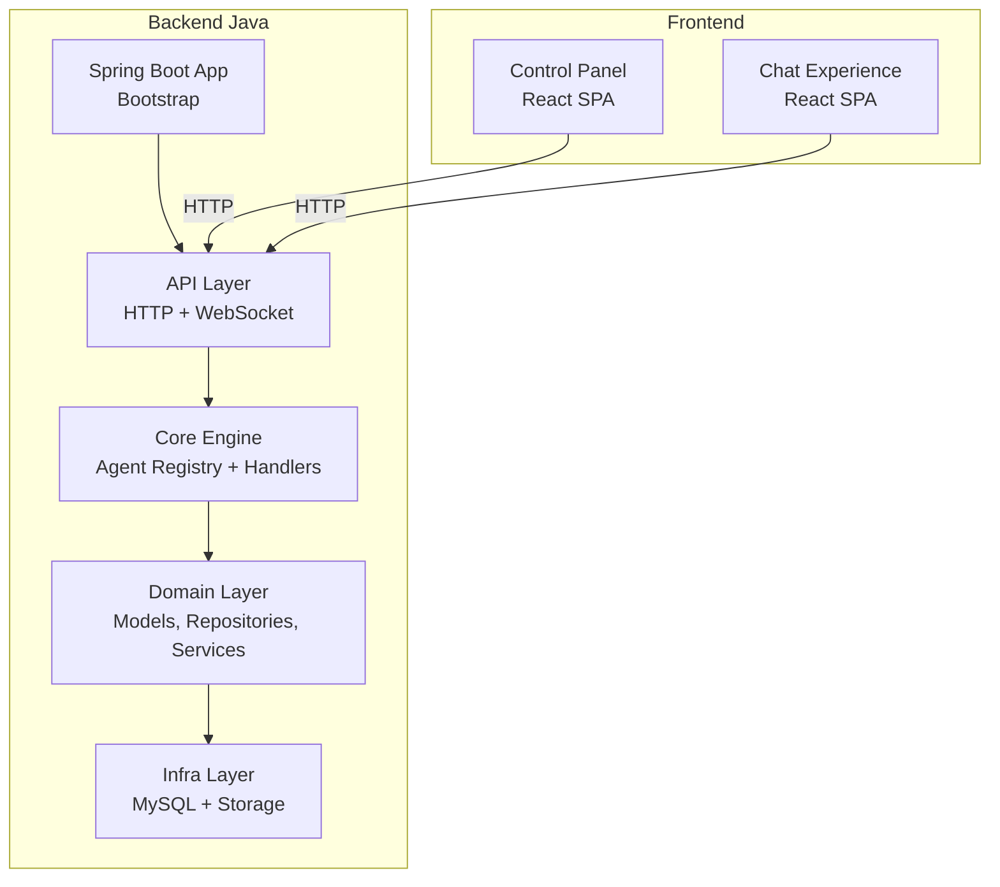
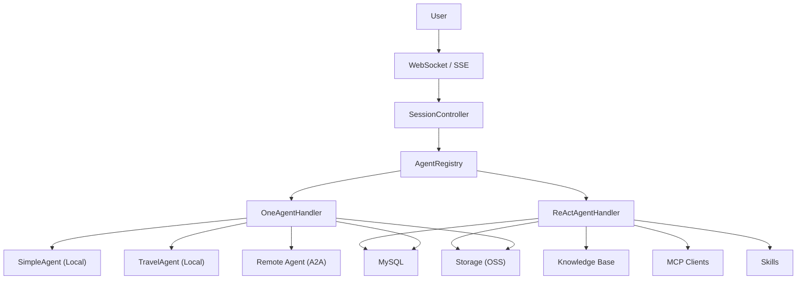
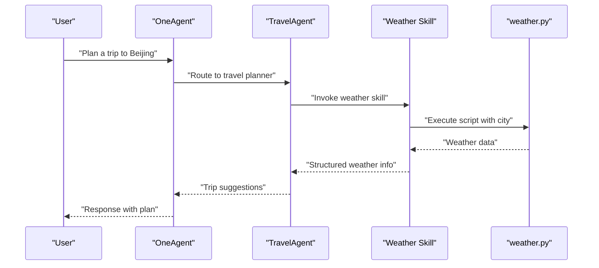
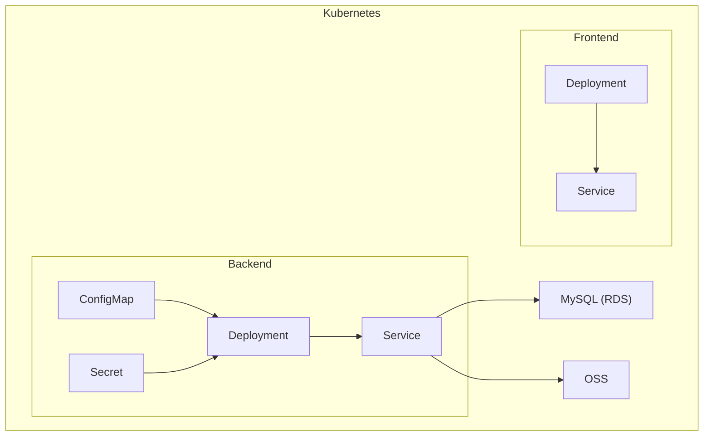
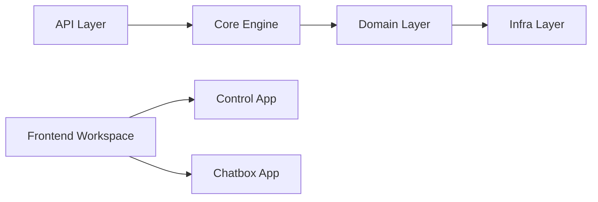

# Application Scenarios and Use Cases

<cite>
**Referenced Files in This Document**
- [README.MD](file://backend_java/README.MD)
- [develop_guide.md](file://docs/en/develop_guide.md)
- [depoly_guide.md](file://docs/en/depoly_guide.md)
- [application.yaml](file://backend_java/bootstrap/src/main/resources/application.yaml)
- [Dockerfile](file://backend_java/Dockerfile)
- [SimpleAgentBuilder.java](file://backend_java/core/src/main/java/com/aliyun/tam/x/tron/core/agents/examples/SimpleAgentBuilder.java)
- [OneAgentBuilder.java](file://backend_java/core/src/main/java/com/aliyun/tam/x/tron/core/agents/examples/OneAgentBuilder.java)
- [TravelAgentBuilder.java](file://backend_java/core/src/main/java/com/aliyun/tam/x/tron/core/agents/examples/TravelAgentBuilder.java)
- [SKILL.md](file://backend_java/skills/weather/SKILL.md)
- [weather.py](file://backend_java/skills/weather/scripts/weather.py)
- [frontend Dockerfile](file://frontend/Dockerfile)
- [frontend package.json](file://frontend/package.json)
- [control package.json](file://frontend/packages/control/package.json)
</cite>

## Table of Contents
1. [Introduction](#introduction)
2. [Project Structure](#project-structure)
3. [Core Components](#core-components)
4. [Architecture Overview](#architecture-overview)
5. [Detailed Component Analysis](#detailed-component-analysis)
6. [Dependency Analysis](#dependency-analysis)
7. [Performance Considerations](#performance-considerations)
8. [Troubleshooting Guide](#troubleshooting-guide)
9. [Conclusion](#conclusion)
10. [Appendices](#appendices)

## Introduction
This document presents comprehensive application scenarios and use cases for the Tron OneAgent platform. It focuses on how the multi-agent architecture enables enterprise-grade conversational AI solutions, including intelligent assistants, smart customer service systems, automated support agents, and conversational AI platforms. It explains how complex workflows are orchestrated (e.g., travel assistance, weather information services, and dynamic skill-based responses), and it covers deployment scenarios such as cloud-native Kubernetes environments, hybrid setups, and edge computing applications. Guidance is provided on selecting appropriate configurations for different use cases, along with scalability, performance characteristics, and integration patterns with existing enterprise systems.

## Project Structure
The Tron OneAgent project is organized into backend Java services and a frontend control panel. The backend exposes REST and WebSocket APIs, supports event-sourced sessions, and integrates skills, tools, knowledge bases, and MCP clients. The frontend provides a control console and chat experience, packaged as a separate container.

**Diagram sources**
- [develop_guide.md](file://docs/en/develop_guide.md)
- [application.yaml](file://backend_java/bootstrap/src/main/resources/application.yaml)

**Section sources**
- [README.MD](file://backend_java/README.MD)
- [develop_guide.md](file://docs/en/develop_guide.md)

## Core Components
- Multi-agent orchestration: OneAgent compiles local and remote agents (A2A) to execute complex tasks collaboratively.
- ReAct agent loops: Single-agent reasoning, acting, observing cycles with configurable iteration limits.
- Event-sourced sessions: Full traceability of conversations with structured content, tasks, and actions.
- Skills and tools: Structured skill packages and tool registries enable autonomous task execution.
- Dynamic configuration: Runtime updates to agent behavior, tools, MCP clients, and knowledge bases.
- Streaming and real-time: SSE and WebSocket transports for responsive user experiences.

**Section sources**
- [README.MD](file://backend_java/README.MD)
- [develop_guide.md](file://docs/en/develop_guide.md)

## Architecture Overview
The system supports both single-agent and multi-agent workflows. OneAgent orchestrates sub-agents (local and A2A) to compose capabilities dynamically. Sessions are persisted and streamed via event sourcing, enabling auditability and real-time interaction.

**Diagram sources**
- [develop_guide.md](file://docs/en/develop_guide.md)
- [OneAgentBuilder.java](file://backend_java/core/src/main/java/com/aliyun/tam/x/tron/core/agents/examples/OneAgentBuilder.java)
- [SimpleAgentBuilder.java](file://backend_java/core/src/main/java/com/aliyun/tam/x/tron/core/agents/examples/SimpleAgentBuilder.java)
- [TravelAgentBuilder.java](file://backend_java/core/src/main/java/com/aliyun/tam/x/tron/core/agents/examples/TravelAgentBuilder.java)

## Detailed Component Analysis

### Enterprise Intelligent Assistants
- Use cases: Internal knowledge management, FAQ automation, document summarization, and guided workflows.
- Implementation pattern: Combine a ReAct agent with a knowledge base and tools. Enable streaming responses and follow-up suggestions via WebSocket.
- Configuration tips:
  - Prefer fast chat models for low-latency interactions.
  - Enable tools (e.g., calculator) and MCP clients for external data retrieval.
  - Persist sessions with event sourcing for auditability.

**Section sources**
- [README.MD](file://backend_java/README.MD)
- [develop_guide.md](file://docs/en/develop_guide.md)

### Smart Customer Service Systems
- Use cases: Tiered support routing, dynamic skill-based responses, and escalations.
- Implementation pattern: OneAgent routes user intents to specialized sub-agents (e.g., billing, technical support, FAQs). A2A agents can integrate cross-service capabilities.
- Configuration tips:
  - Define capacities for each sub-agent to guide intent routing.
  - Use WebSocket for real-time escalation and agent handoff notifications.
  - Store conversation histories for quality assurance and training.

**Section sources**
- [OneAgentBuilder.java](file://backend_java/core/src/main/java/com/aliyun/tam/x/tron/core/agents/examples/OneAgentBuilder.java)
- [SimpleAgentBuilder.java](file://backend_java/core/src/main/java/com/aliyun/tam/x/tron/core/agents/examples/SimpleAgentBuilder.java)

### Automated Support Agents
- Use cases: Incident triage, automated ticket creation, and remediation suggestions.
- Implementation pattern: ReAct agent with tools for ticketing systems and knowledge base retrieval. Skills can encapsulate domain-specific automations.
- Configuration tips:
  - Limit max iterations to prevent runaway loops.
  - Use event sourcing to reconstruct agent reasoning and decisions.
  - Integrate with external systems via MCP clients or tools.

**Section sources**
- [README.MD](file://backend_java/README.MD)
- [develop_guide.md](file://docs/en/develop_guide.md)

### Conversational AI Platforms
- Use cases: Multi-turn dialog, persona-driven interactions, and multimodal experiences (text, image).
- Implementation pattern: OneAgent orchestrates multiple sub-agents for specialized roles (planner, fact-checker, summarizer). Skills and tools enrich responses.
- Configuration tips:
  - Enable image input types for vision-enabled workflows.
  - Use WebSocket for richer interactivity (cancel, suggestions, TTS).
  - Tune model parameters for reasoning vs. speed trade-offs.

**Section sources**
- [OneAgentBuilder.java](file://backend_java/core/src/main/java/com/aliyun/tam/x/tron/core/agents/examples/OneAgentBuilder.java)
- [develop_guide.md](file://docs/en/develop_guide.md)

### Multi-Agent Workflows: Travel Assistance
- Scenario: A OneAgent composes a planner (local) and a weather assistant (local) to help users plan trips.
- Orchestration:
  - OneAgent receives user intent (e.g., “plan a trip to Beijing”).
  - Routes to TravelAgent (local) to fetch weather and suggest activities.
  - Uses skills to execute Python scripts for weather queries.
- Benefits: Seamless collaboration between agents, reusable skills, and persistent session traces.

**Diagram sources**
- [OneAgentBuilder.java](file://backend_java/core/src/main/java/com/aliyun/tam/x/tron/core/agents/examples/OneAgentBuilder.java)
- [TravelAgentBuilder.java](file://backend_java/core/src/main/java/com/aliyun/tam/x/tron/core/agents/examples/TravelAgentBuilder.java)
- [SKILL.md](file://backend_java/skills/weather/SKILL.md)
- [weather.py](file://backend_java/skills/weather/scripts/weather.py)

**Section sources**
- [TravelAgentBuilder.java](file://backend_java/core/src/main/java/com/aliyun/tam/x/tron/core/agents/examples/TravelAgentBuilder.java)
- [SKILL.md](file://backend_java/skills/weather/SKILL.md)
- [weather.py](file://backend_java/skills/weather/scripts/weather.py)

### Weather Information Services
- Scenario: A ReAct agent equipped with a weather skill returns current conditions for a given city.
- Execution:
  - Skill defines a Python script invocation with a city parameter.
  - Agent executes the skill and returns natural-language results.
- Benefits: Reproducible automation, easy updates via skill re-upload, and decoupled logic.

**Section sources**
- [SKILL.md](file://backend_java/skills/weather/SKILL.md)
- [weather.py](file://backend_java/skills/weather/scripts/weather.py)

### Dynamic Skill-Based Responses
- Scenario: Agents adapt capabilities by enabling/disabling skills at runtime.
- Mechanism:
  - Skills are uploaded as ZIP packages with a specification file and scripts.
  - Agents can enable/disable skills dynamically without restarts.
- Benefits: Rapid experimentation, A/B testing of capabilities, and centralized governance.

**Section sources**
- [README.MD](file://backend_java/README.MD)

### Deployment Scenarios

#### Cloud-Native Kubernetes
- Backend:
  - Containerized with Java 17 and packaged with skills.
  - Environment variables configure database, API keys, and cloud storage.
  - Deployments with probes, resource requests/limits, and rolling updates.
- Frontend:
  - Nginx-based image with templated configuration injected at startup.
  - Exposed via ClusterIP service and routed by Ingress.
- Observability:
  - Health checks, metrics, and logging endpoints exposed for monitoring.

**Diagram sources**
- [depoly_guide.md](file://docs/en/depoly_guide.md)
- [application.yaml](file://backend_java/bootstrap/src/main/resources/application.yaml)
- [Dockerfile](file://backend_java/Dockerfile)
- [frontend Dockerfile](file://frontend/Dockerfile)

**Section sources**
- [depoly_guide.md](file://docs/en/depoly_guide.md)
- [application.yaml](file://backend_java/bootstrap/src/main/resources/application.yaml)
- [Dockerfile](file://backend_java/Dockerfile)
- [frontend Dockerfile](file://frontend/Dockerfile)

#### Hybrid Environments
- Mix on-premises databases and cloud LLM providers.
- Use A2A agents to integrate legacy systems or on-prem services.
- Maintain separation of concerns: frontend in cloud, backend on-prem, or vice versa.

**Section sources**
- [SimpleAgentBuilder.java](file://backend_java/core/src/main/java/com/aliyun/tam/x/tron/core/agents/examples/SimpleAgentBuilder.java)

#### Edge Computing Applications
- Lightweight containers deployed close to users.
- Minimize model latency with smaller, optimized models and cached skills.
- Use WebSocket for real-time feedback and cancelation.

**Section sources**
- [README.MD](file://backend_java/README.MD)

### Real-World Implementation Examples
- Customer Support Automation:
  - Route tickets to sub-agents (billing, technical, HR).
  - Use WebSocket for live agent handoff and escalation.
- Internal Knowledge Management:
  - ReAct agent with knowledge base and calculators for quick answers.
- Intelligent Workflow Orchestration:
  - OneAgent composes planner, fact-checker, and scheduler agents.

**Section sources**
- [OneAgentBuilder.java](file://backend_java/core/src/main/java/com/aliyun/tam/x/tron/core/agents/examples/OneAgentBuilder.java)
- [SimpleAgentBuilder.java](file://backend_java/core/src/main/java/com/aliyun/tam/x/tron/core/agents/examples/SimpleAgentBuilder.java)

### Scalability and Performance
- Horizontal scaling:
  - Backend replicas behind a load balancer; ensure session affinity if needed.
  - Frontend replicas for static assets and proxying.
- Resource sizing:
  - Backend JVM heap and CPU tuned for concurrent sessions and streaming.
  - Frontend minimal footprint for static delivery.
- Streaming:
  - SSE for server-pushed updates; WebSocket for low-latency, bidirectional control.
- Observability:
  - Health endpoints, metrics, and tracing integrated for production monitoring.

**Section sources**
- [depoly_guide.md](file://docs/en/depoly_guide.md)
- [application.yaml](file://backend_java/bootstrap/src/main/resources/application.yaml)

### Integration Patterns with Existing Enterprise Systems
- Database: MySQL for sessions, messages, and agent configs.
- Cloud services: Alibaba Cloud OSS for file storage, DashScope for models.
- External systems: MCP clients for web search and other services; A2A for cross-service agent collaboration.
- Frontend integration: Control panel and chat experience embedded in intranet portals.

**Section sources**
- [application.yaml](file://backend_java/bootstrap/src/main/resources/application.yaml)
- [SimpleAgentBuilder.java](file://backend_java/core/src/main/java/com/aliyun/tam/x/tron/core/agents/examples/SimpleAgentBuilder.java)

### Configuration Selection Guide
- For fast responses: Use fast chat models and disable deep reasoning.
- For complex tasks: Increase max iterations and enable knowledge base + tools.
- For multimodal: Enable image input types and integrate TTS/ASR endpoints.
- For production: Enable WebSocket for cancel/suggestions; use SSE for lightweight clients.

**Section sources**
- [develop_guide.md](file://docs/en/develop_guide.md)
- [OneAgentBuilder.java](file://backend_java/core/src/main/java/com/aliyun/tam/x/tron/core/agents/examples/OneAgentBuilder.java)

## Dependency Analysis
The backend is modular and layered, with clear boundaries between API, core engine, domain, and infrastructure. The frontend is a React workspace with a control application and chatbox package.

**Diagram sources**
- [develop_guide.md](file://docs/en/develop_guide.md)
- [frontend package.json](file://frontend/package.json)
- [control package.json](file://frontend/packages/control/package.json)

**Section sources**
- [develop_guide.md](file://docs/en/develop_guide.md)
- [frontend package.json](file://frontend/package.json)
- [control package.json](file://frontend/packages/control/package.json)

## Performance Considerations
- Model selection: Choose models aligned with latency and accuracy needs.
- Streaming transport: Prefer WebSocket for interactive scenarios; SSE for simpler integrations.
- Concurrency: Scale backend pods and tune JVM settings for throughput.
- Storage: Use cloud storage for media and keep database normalized for event sourcing.

[No sources needed since this section provides general guidance]

## Troubleshooting Guide
- Backend pod fails to start:
  - Check image tag, ConfigMap/Secret injection, and database connectivity.
- Database connection errors:
  - Verify host/port/name/user/password and initialization script.
- Frontend cannot connect to backend:
  - Confirm END_POINT environment variable and service networking.
- SSE drops:
  - Ensure proxy buffering is disabled and timeouts are configured for long connections.

**Section sources**
- [depoly_guide.md](file://docs/en/depoly_guide.md)

## Conclusion
Tron OneAgent delivers a robust foundation for enterprise conversational AI. Its multi-agent orchestration, event-sourced sessions, dynamic configuration, and flexible deployment options enable scalable, auditable, and extensible solutions across customer service, internal knowledge management, and intelligent workflow automation. By aligning agent types, transport protocols, and cloud integrations with use-case requirements, organizations can rapidly build production-ready AI assistants.

[No sources needed since this section summarizes without analyzing specific files]

## Appendices

### API and Transport Options
- REST APIs for session management and chat.
- SSE for server-pushed updates; WebSocket for real-time control and suggestions.

**Section sources**
- [develop_guide.md](file://docs/en/develop_guide.md)