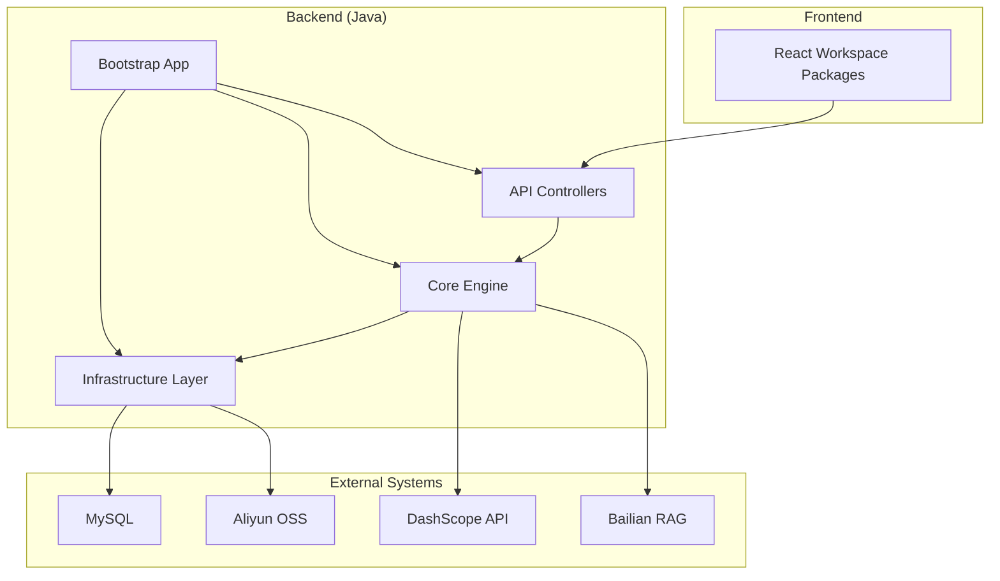
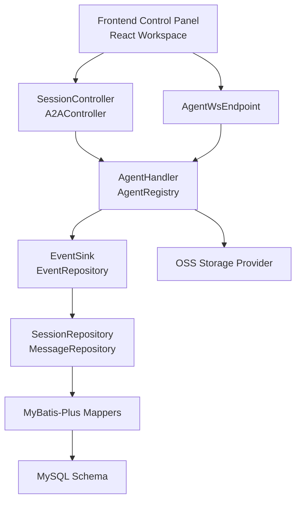
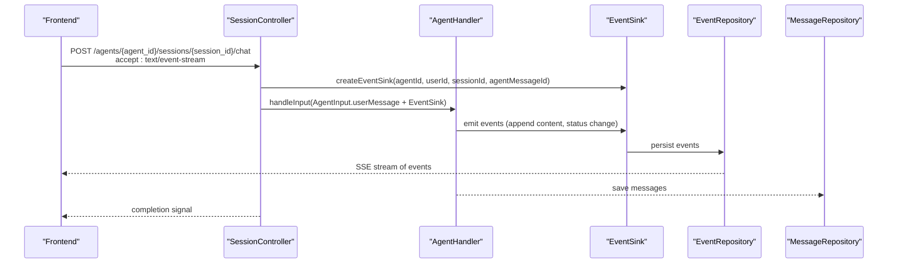
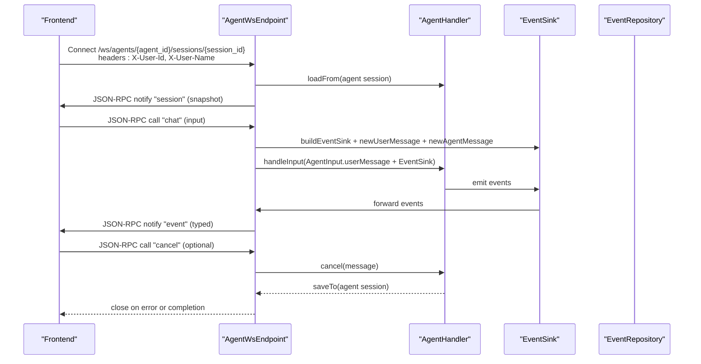
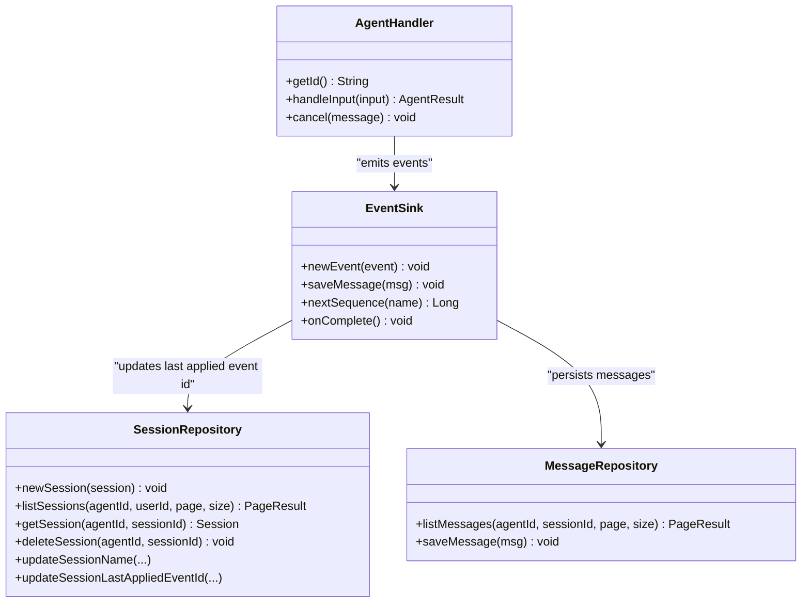
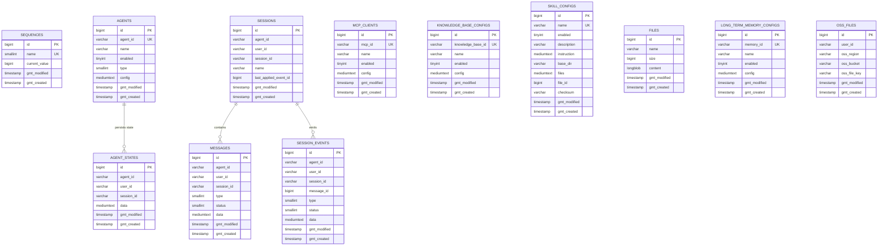
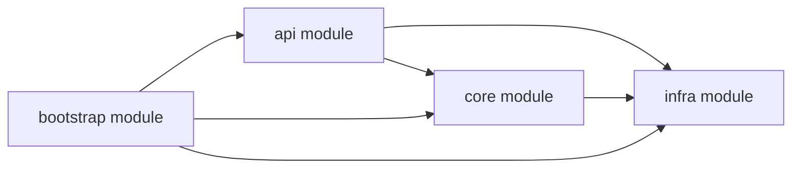

# Architecture Overview

<cite>
**Referenced Files in This Document**
- [pom.xml](file://backend_java/pom.xml)
- [README.md](file://README.md)
- [README_en.md](file://README_en.md)
- [Bootstrap.java](file://backend_java/bootstrap/src/main/java/com/aliyun/tam/x/tron/Bootstrap.java)
- [application.yaml](file://backend_java/bootstrap/src/main/resources/application.yaml)
- [init.sql](file://backend_java/bootstrap/src/main/resources/schema/init.sql)
- [WebSocketConfig.java](file://backend_java/bootstrap/src/main/java/com/aliyun/tam/x/tron/config/WebSocketConfig.java)
- [A2AController.java](file://backend_java/api/src/main/java/com/aliyun/tam/x/tron/api/A2AController.java)
- [SessionController.java](file://backend_java/api/src/main/java/com/aliyun/tam/x/tron/api/SessionController.java)
- [HealthController.java](file://backend_java/api/src/main/java/com/aliyun/tam/x/tron/api/HealthController.java)
- [AgentWsEndpoint.java](file://backend_java/api/src/main/java/com/aliyun/tam/x/tron/ws/AgentWsEndpoint.java)
- [AgentHandler.java](file://backend_java/core/src/main/java/com/aliyun/tam/x/tron/core/agents/AgentHandler.java)
- [SessionRepository.java](file://backend_java/core/src/main/java/com/aliyun/tam/x/tron/core/domain/repository/SessionRepository.java)
- [SessionMapper.java](file://backend_java/infra/src/main/java/com/aliyun/tam/x/tron/infra/dal/mapper/SessionMapper.java)
- [package.json](file://frontend/package.json)
</cite>

## Table of Contents
1. [Introduction](#introduction)
2. [Project Structure](#project-structure)
3. [Core Components](#core-components)
4. [Architecture Overview](#architecture-overview)
5. [Detailed Component Analysis](#detailed-component-analysis)
6. [Dependency Analysis](#dependency-analysis)
7. [Performance Considerations](#performance-considerations)
8. [Troubleshooting Guide](#troubleshooting-guide)
9. [Conclusion](#conclusion)

## Introduction
This document describes the Tron OneAgent system architecture, focusing on the integration between the frontend React-based control panel and the backend Spring Boot services. It explains the layered architecture separating presentation, business logic, data access, and infrastructure, and documents the microservices-style modules including the agent engine, API controllers, event system, and storage layer. It also covers communication patterns (REST APIs, WebSocket connections, and event streaming), the dual-protocol design supporting both SSE and WebSocket for real-time interaction, and the integration with the Alibaba AgentScope Java ecosystem and cloud services.

## Project Structure
The repository is organized into a multi-module Maven project with a clear separation of concerns:
- backend_java: Java backend modules
  - api: REST and WebSocket endpoints
  - core: agent engine, domain models, repositories, and services
  - infra: persistence layer (MyBatis-Plus), storage providers, and DAL
  - utils: shared utilities
  - bootstrap: Spring Boot application entrypoint and configuration
- frontend: React-based control panel workspace
- docs: documentation assets

**Diagram sources**
- [pom.xml:11-16](file://backend_java/pom.xml#L11-L16)
- [Bootstrap.java:25-32](file://backend_java/bootstrap/src/main/java/com/aliyun/tam/x/tron/Bootstrap.java#L25-L32)
- [application.yaml:27-51](file://backend_java/bootstrap/src/main/resources/application.yaml#L27-L51)

**Section sources**
- [pom.xml:11-16](file://backend_java/pom.xml#L11-L16)
- [README.md:56-94](file://README.md#L56-L94)
- [README_en.md:57-94](file://README_en.md#L57-L94)

## Core Components
- Presentation Layer
  - REST endpoints for sessions, chats, health checks, and A2A agent discovery and RPC
  - WebSocket endpoint for real-time JSON-RPC chat and event streaming
- Business Logic Layer
  - AgentHandler interface and logging wrapper for input handling, cancellation, and telemetry
  - Agent registry and builders for local and remote (A2A) sub-agents
  - Event-driven messaging pipeline with EventSink and session events
- Data Access Layer
  - Repositories for sessions, messages, events, and configuration entities
  - MyBatis-Plus mappers for persistence
  - Sequence service for deterministic IDs
- Infrastructure Layer
  - MySQL schema initialization
  - File storage provider (OSS) and file repositories
  - OpenTelemetry and Micrometer integration for observability

**Section sources**
- [SessionController.java:80-84](file://backend_java/api/src/main/java/com/aliyun/tam/x/tron/api/SessionController.java#L80-L84)
- [AgentWsEndpoint.java:62-64](file://backend_java/api/src/main/java/com/aliyun/tam/x/tron/ws/AgentWsEndpoint.java#L62-L64)
- [AgentHandler.java:35-46](file://backend_java/core/src/main/java/com/aliyun/tam/x/tron/core/agents/AgentHandler.java#L35-L46)
- [SessionRepository.java:23-36](file://backend_java/core/src/main/java/com/aliyun/tam/x/tron/core/domain/repository/SessionRepository.java#L23-L36)
- [SessionMapper.java:27-29](file://backend_java/infra/src/main/java/com/aliyun/tam/x/tron/infra/dal/mapper/SessionMapper.java#L27-L29)
- [init.sql:17-207](file://backend_java/bootstrap/src/main/resources/schema/init.sql#L17-L207)

## Architecture Overview
The system follows a layered architecture with clear boundaries:
- Presentation: REST and WebSocket endpoints expose chat, session management, and A2A agent RPC
- Business Logic: AgentHandler orchestrates input processing, integrates tools and skills, emits events, and manages cancellation
- Data Access: Repositories abstract persistence; MyBatis-Plus mappers map to relational tables
- Infrastructure: MySQL stores structured data; OSS stores binary files; cloud SDKs integrate with DashScope and Bailian

Communication patterns:
- REST: Sessions, chat requests, health checks, A2A agent card discovery and JSON-RPC
- SSE: Streaming events for asynchronous, server-pushed updates
- WebSocket: Real-time JSON-RPC chat with bidirectional event notifications
- Event Streaming: EventSink publishes typed events consumed by SSE and WebSocket clients

**Diagram sources**
- [SessionController.java:80-84](file://backend_java/api/src/main/java/com/aliyun/tam/x/tron/api/SessionController.java#L80-L84)
- [AgentWsEndpoint.java:62-64](file://backend_java/api/src/main/java/com/aliyun/tam/x/tron/ws/AgentWsEndpoint.java#L62-L64)
- [AgentHandler.java:35-46](file://backend_java/core/src/main/java/com/aliyun/tam/x/tron/core/agents/AgentHandler.java#L35-L46)
- [SessionRepository.java:23-36](file://backend_java/core/src/main/java/com/aliyun/tam/x/tron/core/domain/repository/SessionRepository.java#L23-L36)
- [SessionMapper.java:27-29](file://backend_java/infra/src/main/java/com/aliyun/tam/x/tron/infra/dal/mapper/SessionMapper.java#L27-L29)
- [init.sql:17-207](file://backend_java/bootstrap/src/main/resources/schema/init.sql#L17-L207)

## Detailed Component Analysis

### REST API Layer
- SessionController
  - Manages session lifecycle (create, list, get, delete, list messages)
  - Supports chat with SSE streaming and optional TTS callback events
  - Uses EventSink to publish typed events consumed by clients
- A2AController
  - Exposes agent card discovery and JSON-RPC endpoint for remote agent orchestration
  - Bridges AgentScope A2A transport to internal agent handlers and repositories

**Diagram sources**
- [SessionController.java:308-346](file://backend_java/api/src/main/java/com/aliyun/tam/x/tron/api/SessionController.java#L308-L346)
- [SessionController.java:348-409](file://backend_java/api/src/main/java/com/aliyun/tam/x/tron/api/SessionController.java#L348-L409)
- [SessionController.java:411-535](file://backend_java/api/src/main/java/com/aliyun/tam/x/tron/api/SessionController.java#L411-L535)

**Section sources**
- [SessionController.java:132-247](file://backend_java/api/src/main/java/com/aliyun/tam/x/tron/api/SessionController.java#L132-L247)
- [SessionController.java:280-306](file://backend_java/api/src/main/java/com/aliyun/tam/x/tron/api/SessionController.java#L280-L306)
- [SessionController.java:308-346](file://backend_java/api/src/main/java/com/aliyun/tam/x/tron/api/SessionController.java#L308-L346)
- [SessionController.java:348-409](file://backend_java/api/src/main/java/com/aliyun/tam/x/tron/api/SessionController.java#L348-L409)
- [SessionController.java:411-535](file://backend_java/api/src/main/java/com/aliyun/tam/x/tron/api/SessionController.java#L411-L535)

### WebSocket Endpoint
- AgentWsEndpoint
  - JSON-RPC over WebSocket for chat and cancellation
  - Streams session snapshot and subsequent events to the client
  - Integrates TTS callbacks via EventSink wrapper

**Diagram sources**
- [AgentWsEndpoint.java:116-136](file://backend_java/api/src/main/java/com/aliyun/tam/x/tron/ws/AgentWsEndpoint.java#L116-L136)
- [AgentWsEndpoint.java:138-176](file://backend_java/api/src/main/java/com/aliyun/tam/x/tron/ws/AgentWsEndpoint.java#L138-L176)
- [AgentWsEndpoint.java:222-261](file://backend_java/api/src/main/java/com/aliyun/tam/x/tron/ws/AgentWsEndpoint.java#L222-L261)
- [AgentWsEndpoint.java:277-332](file://backend_java/api/src/main/java/com/aliyun/tam/x/tron/ws/AgentWsEndpoint.java#L277-L332)
- [AgentWsEndpoint.java:334-442](file://backend_java/api/src/main/java/com/aliyun/tam/x/tron/ws/AgentWsEndpoint.java#L334-L442)

**Section sources**
- [AgentWsEndpoint.java:62-64](file://backend_java/api/src/main/java/com/aliyun/tam/x/tron/ws/AgentWsEndpoint.java#L62-L64)
- [AgentWsEndpoint.java:116-136](file://backend_java/api/src/main/java/com/aliyun/tam/x/tron/ws/AgentWsEndpoint.java#L116-L136)
- [AgentWsEndpoint.java:222-261](file://backend_java/api/src/main/java/com/aliyun/tam/x/tron/ws/AgentWsEndpoint.java#L222-L261)
- [AgentWsEndpoint.java:334-442](file://backend_java/api/src/main/java/com/aliyun/tam/x/tron/ws/AgentWsEndpoint.java#L334-L442)

### Agent Engine and Event System
- AgentHandler
  - Defines the contract for handling user input, emitting events, and cancellation
  - Logging wrapper adds tracing, metrics, and timing around input handling
- EventSink and EventRepository
  - Typed events propagate through the system and are persisted for replay and consumption
- SessionRepository and MessageRepository
  - Manage session lifecycle and message history

**Diagram sources**
- [AgentHandler.java:35-46](file://backend_java/core/src/main/java/com/aliyun/tam/x/tron/core/agents/AgentHandler.java#L35-L46)
- [AgentHandler.java:48-149](file://backend_java/core/src/main/java/com/aliyun/tam/x/tron/core/agents/AgentHandler.java#L48-L149)
- [SessionRepository.java:23-36](file://backend_java/core/src/main/java/com/aliyun/tam/x/tron/core/domain/repository/SessionRepository.java#L23-L36)

**Section sources**
- [AgentHandler.java:35-46](file://backend_java/core/src/main/java/com/aliyun/tam/x/tron/core/agents/AgentHandler.java#L35-L46)
- [AgentHandler.java:48-149](file://backend_java/core/src/main/java/com/aliyun/tam/x/tron/core/agents/AgentHandler.java#L48-L149)
- [SessionRepository.java:23-36](file://backend_java/core/src/main/java/com/aliyun/tam/x/tron/core/domain/repository/SessionRepository.java#L23-L36)

### Storage and Persistence
- MySQL schema initializes sequences, agents, agent states, sessions, messages, session events, MCP clients, knowledge base configs, skill configs, files, long-term memory configs, and OSS files
- MyBatis-Plus mappers provide CRUD operations for entities
- File storage provider integrates with Aliyun OSS for binary content

**Diagram sources**
- [init.sql:17-207](file://backend_java/bootstrap/src/main/resources/schema/init.sql#L17-L207)

**Section sources**
- [init.sql:17-207](file://backend_java/bootstrap/src/main/resources/schema/init.sql#L17-L207)
- [SessionMapper.java:27-29](file://backend_java/infra/src/main/java/com/aliyun/tam/x/tron/infra/dal/mapper/SessionMapper.java#L27-L29)

### Technology Stack Integration
- Backend
  - Spring Boot 3.5.9, Java 17
  - AgentScope Java 1.0.11, A2A SDK 0.3.2
  - MyBatis-Plus 3.5.15, Jackson BOM, OpenTelemetry BOM
  - DashScope SDK 2.22.11, Alibaba Bailian SDK 2.6.2
  - Aliyun OSS SDK 3.18.4
- Frontend
  - Yarn workspaces with React packages for the control panel

**Section sources**
- [pom.xml:19-33](file://backend_java/pom.xml#L19-L33)
- [pom.xml:94-190](file://backend_java/pom.xml#L94-L190)
- [README_en.md:96-109](file://README_en.md#L96-L109)
- [package.json:4-10](file://frontend/package.json#L4-L10)

## Dependency Analysis
The backend modules depend on each other in a layered fashion:
- api depends on core and infra for agent orchestration and persistence
- core depends on infra for repositories and storage
- bootstrap wires up the application, profiles, and external integrations

**Diagram sources**
- [pom.xml:11-16](file://backend_java/pom.xml#L11-L16)

**Section sources**
- [pom.xml:11-16](file://backend_java/pom.xml#L11-L16)

## Performance Considerations
- Concurrency and threading
  - Dedicated thread pools for chat, A2A, and WebSocket operations to isolate workloads and prevent resource contention
- Streaming and real-time delivery
  - SSE for long-lived connections with timeouts and graceful completion
  - WebSocket JSON-RPC for low-latency, bidirectional interactions
- Observability
  - OpenTelemetry and Micrometer are configured for tracing and metrics
- Database and storage
  - MyBatis-Plus mappers and sequence service ensure efficient persistence
  - OSS integration for scalable file storage

[No sources needed since this section provides general guidance]

## Troubleshooting Guide
- Health checks
  - Use the health endpoint to verify service availability
- WebSocket connectivity
  - Ensure required headers (X-User-Id, X-User-Name) are provided during connection
  - Monitor for JSON-RPC errors and session snapshots upon connect
- SSE streaming
  - Verify accept header for SSE and handle timeouts appropriately
- Configuration
  - Confirm database credentials, API keys, and OSS settings in application configuration

**Section sources**
- [HealthController.java:28-32](file://backend_java/api/src/main/java/com/aliyun/tam/x/tron/api/HealthController.java#L28-L32)
- [AgentWsEndpoint.java:116-136](file://backend_java/api/src/main/java/com/aliyun/tam/x/tron/ws/AgentWsEndpoint.java#L116-L136)
- [application.yaml:9-51](file://backend_java/bootstrap/src/main/resources/application.yaml#L9-L51)

## Conclusion
Tron OneAgent combines a modern frontend control panel with a robust backend built on Spring Boot and AgentScope Java. The architecture cleanly separates concerns across presentation, business logic, data access, and infrastructure layers, enabling flexible deployment and extensibility. Dual-protocol support for SSE and WebSocket ensures real-time responsiveness, while the event-driven model and typed events provide a scalable foundation for complex agent workflows and integrations with cloud services.