# Core Features and Capabilities

<cite>
**Referenced Files in This Document**
- [ReActAgentHandler.java](file://backend_java/core/src/main/java/com/aliyun/tam/x/tron/core/agents/ReActAgentHandler.java)
- [OneAgentHandler.java](file://backend_java/core/src/main/java/com/aliyun/tam/x/tron/core/agents/one/OneAgentHandler.java)
- [AgentConfig.java](file://backend_java/core/src/main/java/com/aliyun/tam/x/tron/core/config/AgentConfig.java)
- [QwenRealtimeAsrService.java](file://backend_java/core/src/main/java/com/aliyun/tam/x/tron/core/asr/QwenRealtimeAsrService.java)
- [QwenRealtimeTtsService.java](file://backend_java/core/src/main/java/com/aliyun/tam/x/tron/core/tts/QwenRealtimeTtsService.java)
- [CalculatorTool.java](file://backend_java/core/src/main/java/com/aliyun/tam/x/tron/core/tools/CalculatorTool.java)
- [KnowledgeRegistry.java](file://backend_java/core/src/main/java/com/aliyun/tam/x/tron/core/rag/KnowledgeRegistry.java)
- [LongTermMemoryRegistry.java](file://backend_java/core/src/main/java/com/aliyun/tam/x/tron/core/mem/LongTermMemoryRegistry.java)
- [EventSink.java](file://backend_java/core/src/main/java/com/aliyun/tam/x/tron/core/domain/models/events/EventSink.java)
- [TextContent.java](file://backend_java/core/src/main/java/com/aliyun/tam/x/tron/core/domain/models/contents/TextContent.java)
- [MediaContent.java](file://backend_java/core/src/main/java/com/aliyun/tam/x/tron/core/domain/models/contents/MediaContent.java)
- [ActionContent.java](file://backend_java/core/src/main/java/com/aliyun/tam/x/tron/core/domain/models/contents/ActionContent.java)
- [one_agent_system_prompt.md](file://backend_java/core/src/main/resources/prompts/one_agent_system_prompt.md)
</cite>

## Table of Contents
1. [Introduction](#introduction)
2. [Project Structure](#project-structure)
3. [Core Components](#core-components)
4. [Architecture Overview](#architecture-overview)
5. [Detailed Component Analysis](#detailed-component-analysis)
6. [Dependency Analysis](#dependency-analysis)
7. [Performance Considerations](#performance-considerations)
8. [Troubleshooting Guide](#troubleshooting-guide)
9. [Conclusion](#conclusion)
10. [Appendices](#appendices)

## Introduction
This document presents the Tron OneAgent core features and capabilities. It explains how the system implements a ReAct agent architecture with reasoning-action loops, multi-agent collaboration, dual-protocol streaming (SSE/WebSocket), asynchronous event-driven design, and session-level persistence. It also covers dynamic agent configuration, human-in-the-loop (HITL) support, multimodal conversation handling (text, image, audio, video), real-time speech recognition and synthesis, tool and skill integration, knowledge base retrieval-augmented generation (RAG), and long-term memory. Practical examples demonstrate how these features integrate to deliver enterprise-grade AI assistants, and extensibility mechanisms are highlighted for developer customization.

## Project Structure
The backend Java module organizes features by domain:
- Agents: ReAct and OneAgent handlers orchestrate reasoning, tool use, and multi-agent collaboration.
- Streaming and I/O: ASR/TTS services implement real-time audio streaming.
- Knowledge and Memory: RAG registry and long-term memory registry manage external knowledge and persistent recall.
- Events and Persistence: EventSink defines asynchronous event emission and content append/change APIs.
- Configuration: AgentConfig aggregates model, tools, skills, knowledge bases, sub-agents, and runtime flags.

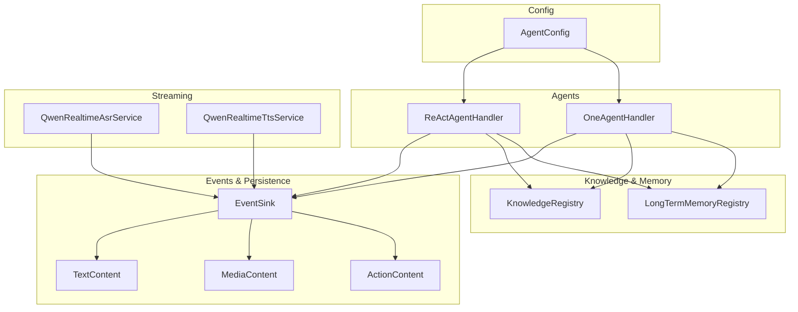

**Diagram sources**
- [ReActAgentHandler.java:41-256](file://backend_java/core/src/main/java/com/aliyun/tam/x/tron/core/agents/ReActAgentHandler.java#L41-L256)
- [OneAgentHandler.java:47-289](file://backend_java/core/src/main/java/com/aliyun/tam/x/tron/core/agents/one/OneAgentHandler.java#L47-L289)
- [QwenRealtimeAsrService.java:36-149](file://backend_java/core/src/main/java/com/aliyun/tam/x/tron/core/asr/QwenRealtimeAsrService.java#L36-L149)
- [QwenRealtimeTtsService.java:36-165](file://backend_java/core/src/main/java/com/aliyun/tam/x/tron/core/tts/QwenRealtimeTtsService.java#L36-L165)
- [KnowledgeRegistry.java:56-204](file://backend_java/core/src/main/java/com/aliyun/tam/x/tron/core/rag/KnowledgeRegistry.java#L56-L204)
- [LongTermMemoryRegistry.java:42-227](file://backend_java/core/src/main/java/com/aliyun/tam/x/tron/core/mem/LongTermMemoryRegistry.java#L42-L227)
- [EventSink.java:42-266](file://backend_java/core/src/main/java/com/aliyun/tam/x/tron/core/domain/models/events/EventSink.java#L42-L266)
- [TextContent.java:31-46](file://backend_java/core/src/main/java/com/aliyun/tam/x/tron/core/domain/models/contents/TextContent.java#L31-L46)
- [MediaContent.java:29-40](file://backend_java/core/src/main/java/com/aliyun/tam/x/tron/core/domain/models/contents/MediaContent.java#L29-L40)
- [ActionContent.java:34-78](file://backend_java/core/src/main/java/com/aliyun/tam/x/tron/core/domain/models/contents/ActionContent.java#L34-L78)
- [AgentConfig.java:35-133](file://backend_java/core/src/main/java/com/aliyun/tam/x/tron/core/config/AgentConfig.java#L35-L133)

**Section sources**
- [ReActAgentHandler.java:41-256](file://backend_java/core/src/main/java/com/aliyun/tam/x/tron/core/agents/ReActAgentHandler.java#L41-L256)
- [OneAgentHandler.java:47-289](file://backend_java/core/src/main/java/com/aliyun/tam/x/tron/core/agents/one/OneAgentHandler.java#L47-L289)
- [AgentConfig.java:35-133](file://backend_java/core/src/main/java/com/aliyun/tam/x/tron/core/config/AgentConfig.java#L35-L133)

## Core Components
- ReAct Agent Handler: Implements the ReAct loop, streams reasoning and tool-use events, supports HITL prompts, and emits structured content updates via EventSink.
- OneAgent Multi-Agent Handler: Coordinates a main ReAct agent with sub-agents, aggregates tool registries, and manages cross-agent tasks and actions.
- Configuration: Centralized AgentConfig controls model selection, tools, skills, knowledge bases, sub-agents, multimodal input support, RAG mode, long-term memory mode, and toggles for suggestions and HITL.
- Streaming Services: Real-time ASR and TTS services connect to provider endpoints, stream partial results, and expose sessions for audio input and output.
- Knowledge and Memory: KnowledgeRegistry builds retrievers from configured knowledge bases; LongTermMemoryRegistry creates persistent memory integrations.
- Event Sink: Provides asynchronous event emission for messages, tasks, actions, and content append/change operations with session-scoped persistence hooks.

**Section sources**
- [ReActAgentHandler.java:41-256](file://backend_java/core/src/main/java/com/aliyun/tam/x/tron/core/agents/ReActAgentHandler.java#L41-L256)
- [OneAgentHandler.java:47-289](file://backend_java/core/src/main/java/com/aliyun/tam/x/tron/core/agents/one/OneAgentHandler.java#L47-L289)
- [AgentConfig.java:35-133](file://backend_java/core/src/main/java/com/aliyun/tam/x/tron/core/config/AgentConfig.java#L35-L133)
- [QwenRealtimeAsrService.java:36-149](file://backend_java/core/src/main/java/com/aliyun/tam/x/tron/core/asr/QwenRealtimeAsrService.java#L36-L149)
- [QwenRealtimeTtsService.java:36-165](file://backend_java/core/src/main/java/com/aliyun/tam/x/tron/core/tts/QwenRealtimeTtsService.java#L36-L165)
- [KnowledgeRegistry.java:56-204](file://backend_java/core/src/main/java/com/aliyun/tam/x/tron/core/rag/KnowledgeRegistry.java#L56-L204)
- [LongTermMemoryRegistry.java:42-227](file://backend_java/core/src/main/java/com/aliyun/tam/x/tron/core/mem/LongTermMemoryRegistry.java#L42-L227)
- [EventSink.java:42-266](file://backend_java/core/src/main/java/com/aliyun/tam/x/tron/core/domain/models/events/EventSink.java#L42-L266)

## Architecture Overview
The system uses an event-driven pipeline:
- Input enters via ReAct or OneAgent handlers.
- Handlers stream agent events (reasoning, tool use, summary) and forward content to EventSink.
- EventSink persists and propagates message/task/action updates.
- Knowledge and long-term memory are integrated during reasoning and retrieval phases.
- ASR/TTS services provide real-time audio streaming for speech-enabled experiences.

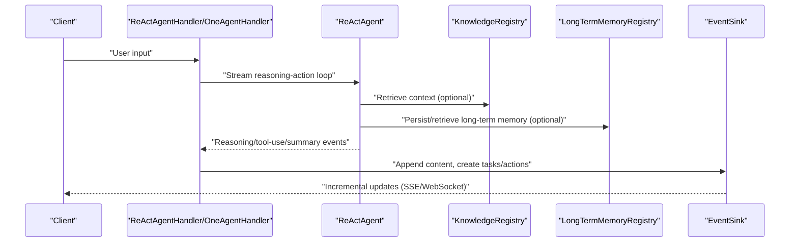

**Diagram sources**
- [ReActAgentHandler.java:64-239](file://backend_java/core/src/main/java/com/aliyun/tam/x/tron/core/agents/ReActAgentHandler.java#L64-L239)
- [OneAgentHandler.java:74-272](file://backend_java/core/src/main/java/com/aliyun/tam/x/tron/core/agents/one/OneAgentHandler.java#L74-L272)
- [KnowledgeRegistry.java:84-136](file://backend_java/core/src/main/java/com/aliyun/tam/x/tron/core/rag/KnowledgeRegistry.java#L84-L136)
- [LongTermMemoryRegistry.java:92-126](file://backend_java/core/src/main/java/com/aliyun/tam/x/tron/core/mem/LongTermMemoryRegistry.java#L92-L126)
- [EventSink.java:101-130](file://backend_java/core/src/main/java/com/aliyun/tam/x/tron/core/domain/models/events/EventSink.java#L101-L130)

## Detailed Component Analysis

### ReAct Agent Handler
Implements the ReAct loop with streaming:
- Streams agent events and extracts reasoning/thinking blocks and tool-use blocks.
- Emits incremental text content and reasoning to EventSink.
- Manages tool invocation lifecycle, action creation, and status transitions.
- Supports HITL prompts via question-tool detection and emits pending HITL content.
- Handles cancellation and usage metrics aggregation.

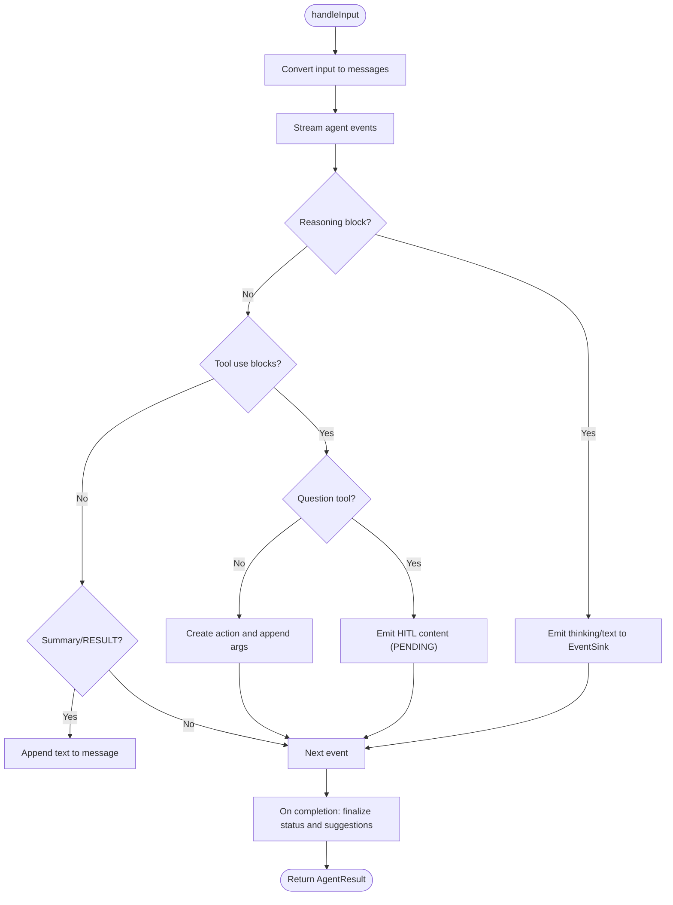

**Diagram sources**
- [ReActAgentHandler.java:64-239](file://backend_java/core/src/main/java/com/aliyun/tam/x/tron/core/agents/ReActAgentHandler.java#L64-L239)

**Section sources**
- [ReActAgentHandler.java:41-256](file://backend_java/core/src/main/java/com/aliyun/tam/x/tron/core/agents/ReActAgentHandler.java#L41-L256)

### OneAgent Multi-Agent Handler
Coordinates a main ReAct agent and sub-agents:
- Registers sub-agent tools into the main toolkit and resets executed tasks per turn.
- Filters sub-agent-owned tools from main-agent tool-use decisions.
- Aggregates executed tasks and action costs from sub-agents into the final result.
- Mirrors ReAct-style streaming and event emission.

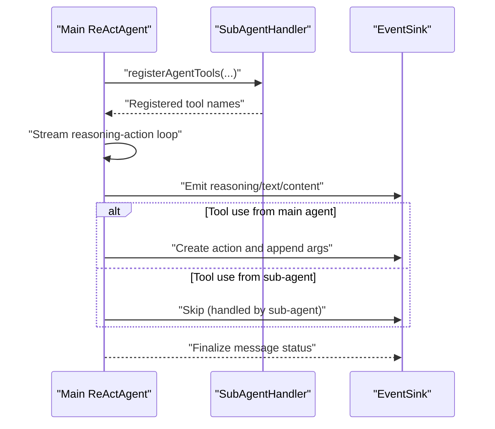

**Diagram sources**
- [OneAgentHandler.java:82-88](file://backend_java/core/src/main/java/com/aliyun/tam/x/tron/core/agents/one/OneAgentHandler.java#L82-L88)
- [OneAgentHandler.java:160-207](file://backend_java/core/src/main/java/com/aliyun/tam/x/tron/core/agents/one/OneAgentHandler.java#L160-L207)
- [OneAgentHandler.java:267-271](file://backend_java/core/src/main/java/com/aliyun/tam/x/tron/core/agents/one/OneAgentHandler.java#L267-L271)

**Section sources**
- [OneAgentHandler.java:47-289](file://backend_java/core/src/main/java/com/aliyun/tam/x/tron/core/agents/one/OneAgentHandler.java#L47-L289)

### Dynamic Agent Configuration
Centralized configuration supports:
- Model selection (chat and optional fast model).
- Tools, skills, MCP clients, and knowledge bases.
- Sub-agents and RAG mode.
- Multimodal input types (e.g., text, image, audio, video).
- Long-term memory mode and identifiers.
- Runtime toggles for session renaming, suggestions, and question/HITL prompts.

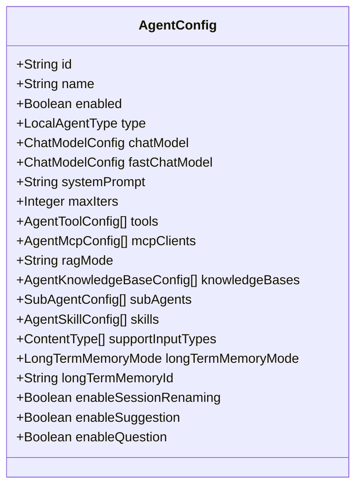

**Diagram sources**
- [AgentConfig.java:35-133](file://backend_java/core/src/main/java/com/aliyun/tam/x/tron/core/config/AgentConfig.java#L35-L133)

**Section sources**
- [AgentConfig.java:35-133](file://backend_java/core/src/main/java/com/aliyun/tam/x/tron/core/config/AgentConfig.java#L35-L133)

### Human-in-the-Loop (HITL) Support
- Question tools trigger HITL prompts embedded as content blocks.
- EventSink emits pending HITL content with metadata for downstream approval/adjustment.
- Handlers detect question-tool usage and surface HITL UI signals.

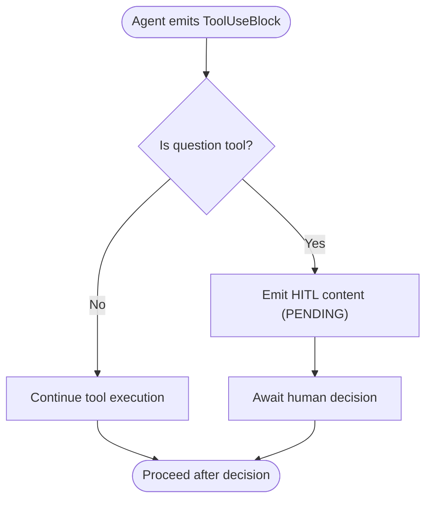

**Diagram sources**
- [ReActAgentHandler.java:142-156](file://backend_java/core/src/main/java/com/aliyun/tam/x/tron/core/agents/ReActAgentHandler.java#L142-L156)
- [OneAgentHandler.java:164-178](file://backend_java/core/src/main/java/com/aliyun/tam/x/tron/core/agents/one/OneAgentHandler.java#L164-L178)

**Section sources**
- [ReActAgentHandler.java:142-156](file://backend_java/core/src/main/java/com/aliyun/tam/x/tron/core/agents/ReActAgentHandler.java#L142-L156)
- [OneAgentHandler.java:164-178](file://backend_java/core/src/main/java/com/aliyun/tam/x/tron/core/agents/one/OneAgentHandler.java#L164-L178)

### Multimodal Conversation Handling
- Content types include text and media (image/audio/video).
- EventSink appends content to messages and actions; content models support merging and typed payloads.
- Configuration enables specific input types per agent.

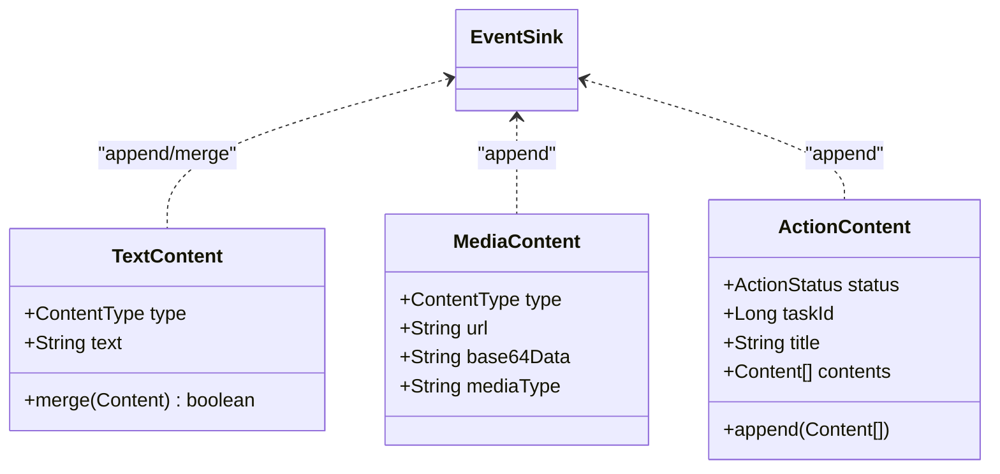

**Diagram sources**
- [TextContent.java:31-46](file://backend_java/core/src/main/java/com/aliyun/tam/x/tron/core/domain/models/contents/TextContent.java#L31-L46)
- [MediaContent.java:29-40](file://backend_java/core/src/main/java/com/aliyun/tam/x/tron/core/domain/models/contents/MediaContent.java#L29-L40)
- [ActionContent.java:34-78](file://backend_java/core/src/main/java/com/aliyun/tam/x/tron/core/domain/models/contents/ActionContent.java#L34-L78)
- [EventSink.java:101-130](file://backend_java/core/src/main/java/com/aliyun/tam/x/tron/core/domain/models/events/EventSink.java#L101-L130)

**Section sources**
- [TextContent.java:31-46](file://backend_java/core/src/main/java/com/aliyun/tam/x/tron/core/domain/models/contents/TextContent.java#L31-L46)
- [MediaContent.java:29-40](file://backend_java/core/src/main/java/com/aliyun/tam/x/tron/core/domain/models/contents/MediaContent.java#L29-L40)
- [ActionContent.java:34-78](file://backend_java/core/src/main/java/com/aliyun/tam/x/tron/core/domain/models/contents/ActionContent.java#L34-L78)
- [EventSink.java:101-130](file://backend_java/core/src/main/java/com/aliyun/tam/x/tron/core/domain/models/events/EventSink.java#L101-L130)

### Real-Time Speech Recognition and Synthesis
- ASR service connects to provider endpoints, streams interim and final transcriptions, and exposes a session interface for audio input.
- TTS service connects to provider endpoints, streams audio deltas, chunks text, and exposes a session interface for audio output.

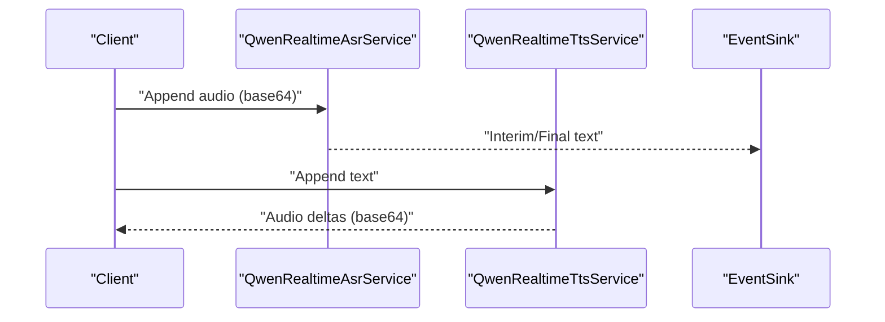

**Diagram sources**
- [QwenRealtimeAsrService.java:40-147](file://backend_java/core/src/main/java/com/aliyun/tam/x/tron/core/asr/QwenRealtimeAsrService.java#L40-L147)
- [QwenRealtimeTtsService.java:41-164](file://backend_java/core/src/main/java/com/aliyun/tam/x/tron/core/tts/QwenRealtimeTtsService.java#L41-L164)

**Section sources**
- [QwenRealtimeAsrService.java:36-149](file://backend_java/core/src/main/java/com/aliyun/tam/x/tron/core/asr/QwenRealtimeAsrService.java#L36-L149)
- [QwenRealtimeTtsService.java:36-165](file://backend_java/core/src/main/java/com/aliyun/tam/x/tron/core/tts/QwenRealtimeTtsService.java#L36-L165)

### Tool and Skill Integration
- Tools are registered via toolkits and invoked during reasoning loops; results are emitted back to EventSink.
- Skills can be configured and managed through dedicated repositories/services.
- Example calculator tool demonstrates expression evaluation via Spring Expression Language.

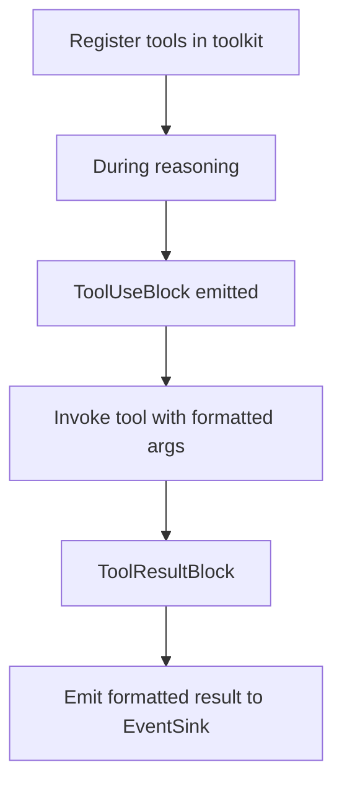

**Diagram sources**
- [OneAgentHandler.java:82-88](file://backend_java/core/src/main/java/com/aliyun/tam/x/tron/core/agents/one/OneAgentHandler.java#L82-L88)
- [ReActAgentHandler.java:186-204](file://backend_java/core/src/main/java/com/aliyun/tam/x/tron/core/agents/ReActAgentHandler.java#L186-L204)
- [CalculatorTool.java:29-50](file://backend_java/core/src/main/java/com/aliyun/tam/x/tron/core/tools/CalculatorTool.java#L29-L50)

**Section sources**
- [OneAgentHandler.java:82-88](file://backend_java/core/src/main/java/com/aliyun/tam/x/tron/core/agents/one/OneAgentHandler.java#L82-L88)
- [ReActAgentHandler.java:186-204](file://backend_java/core/src/main/java/com/aliyun/tam/x/tron/core/agents/ReActAgentHandler.java#L186-L204)
- [CalculatorTool.java:29-50](file://backend_java/core/src/main/java/com/aliyun/tam/x/tron/core/tools/CalculatorTool.java#L29-L50)

### Knowledge Base RAG Implementation
- KnowledgeRegistry builds knowledge bases from code-configured builders and database-backed configs, merges them, and caches knowledge instances.
- Supports Bailian and Elasticsearch configurations, with optional rewrite and rerank features.

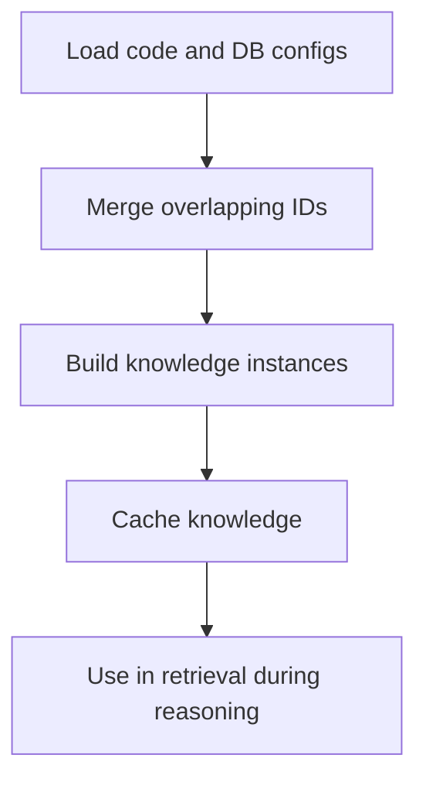

**Diagram sources**
- [KnowledgeRegistry.java:105-136](file://backend_java/core/src/main/java/com/aliyun/tam/x/tron/core/rag/KnowledgeRegistry.java#L105-L136)
- [KnowledgeRegistry.java:155-200](file://backend_java/core/src/main/java/com/aliyun/tam/x/tron/core/rag/KnowledgeRegistry.java#L155-L200)

**Section sources**
- [KnowledgeRegistry.java:56-204](file://backend_java/core/src/main/java/com/aliyun/tam/x/tron/core/rag/KnowledgeRegistry.java#L56-L204)

### Long-Term Memory Capabilities
- LongTermMemoryRegistry selects a memory configuration and creates a memory adapter backed by a remote API.
- Supports recording message sequences and retrieving relevant nodes for context.

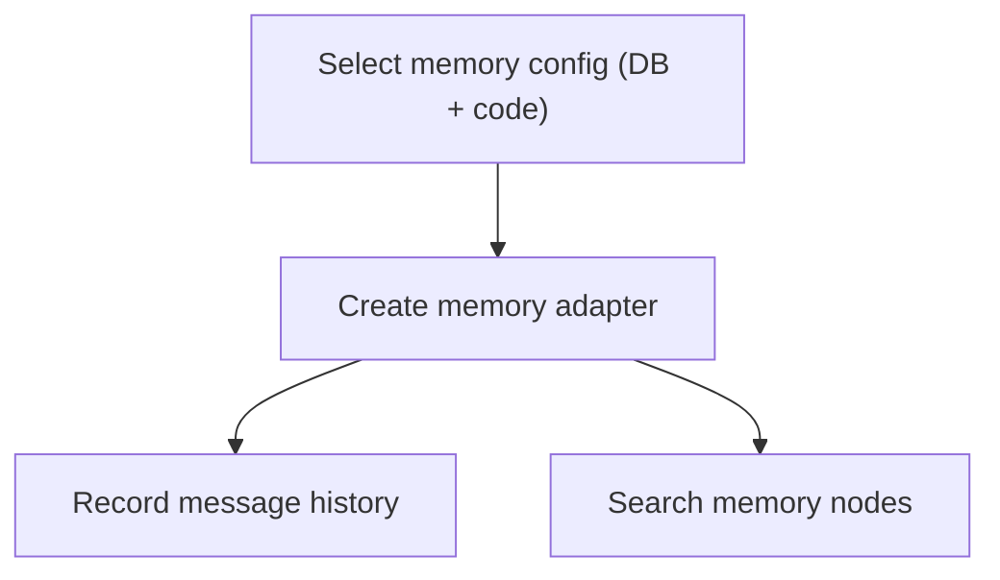

**Diagram sources**
- [LongTermMemoryRegistry.java:92-126](file://backend_java/core/src/main/java/com/aliyun/tam/x/tron/core/mem/LongTermMemoryRegistry.java#L92-L126)
- [LongTermMemoryRegistry.java:140-166](file://backend_java/core/src/main/java/com/aliyun/tam/x/tron/core/mem/LongTermMemoryRegistry.java#L140-L166)

**Section sources**
- [LongTermMemoryRegistry.java:42-227](file://backend_java/core/src/main/java/com/aliyun/tam/x/tron/core/mem/LongTermMemoryRegistry.java#L42-L227)

### Session-Level Persistence and Event-Driven Design
- EventSink encapsulates session-scoped operations: creating messages, appending content, creating/updating tasks/actions, and changing statuses.
- Handlers persist agent message status transitions and usage metrics.
- System prompt ensures raw text output suitable for TTS.

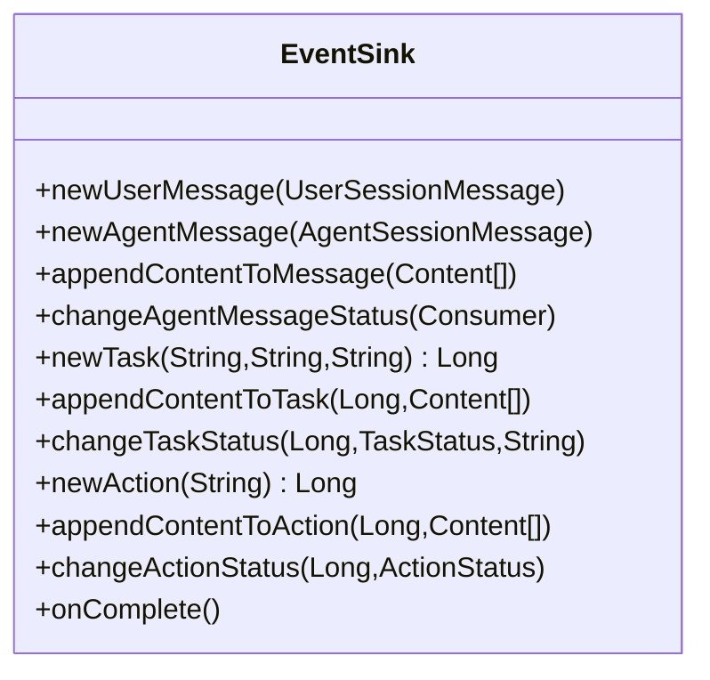

**Diagram sources**
- [EventSink.java:42-266](file://backend_java/core/src/main/java/com/aliyun/tam/x/tron/core/domain/models/events/EventSink.java#L42-L266)

**Section sources**
- [EventSink.java:42-266](file://backend_java/core/src/main/java/com/aliyun/tam/x/tron/core/domain/models/events/EventSink.java#L42-L266)
- [one_agent_system_prompt.md:1-3](file://backend_java/core/src/main/resources/prompts/one_agent_system_prompt.md#L1-L3)

## Dependency Analysis
- ReActAgentHandler and OneAgentHandler depend on AgentConfig for runtime settings and on EventSink for asynchronous updates.
- KnowledgeRegistry and LongTermMemoryRegistry are independent providers consumed by agents.
- ASR/TTS services are external integrations with session lifecycles managed by callers.
- Content models (TextContent, MediaContent, ActionContent) are consumed by EventSink.

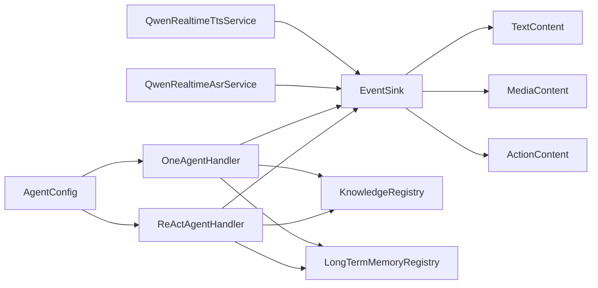

**Diagram sources**
- [AgentConfig.java:35-133](file://backend_java/core/src/main/java/com/aliyun/tam/x/tron/core/config/AgentConfig.java#L35-L133)
- [ReActAgentHandler.java:41-256](file://backend_java/core/src/main/java/com/aliyun/tam/x/tron/core/agents/ReActAgentHandler.java#L41-L256)
- [OneAgentHandler.java:47-289](file://backend_java/core/src/main/java/com/aliyun/tam/x/tron/core/agents/one/OneAgentHandler.java#L47-L289)
- [KnowledgeRegistry.java:56-204](file://backend_java/core/src/main/java/com/aliyun/tam/x/tron/core/rag/KnowledgeRegistry.java#L56-L204)
- [LongTermMemoryRegistry.java:42-227](file://backend_java/core/src/main/java/com/aliyun/tam/x/tron/core/mem/LongTermMemoryRegistry.java#L42-L227)
- [QwenRealtimeAsrService.java:36-149](file://backend_java/core/src/main/java/com/aliyun/tam/x/tron/core/asr/QwenRealtimeAsrService.java#L36-L149)
- [QwenRealtimeTtsService.java:36-165](file://backend_java/core/src/main/java/com/aliyun/tam/x/tron/core/tts/QwenRealtimeTtsService.java#L36-L165)
- [EventSink.java:42-266](file://backend_java/core/src/main/java/com/aliyun/tam/x/tron/core/domain/models/events/EventSink.java#L42-L266)
- [TextContent.java:31-46](file://backend_java/core/src/main/java/com/aliyun/tam/x/tron/core/domain/models/contents/TextContent.java#L31-L46)
- [MediaContent.java:29-40](file://backend_java/core/src/main/java/com/aliyun/tam/x/tron/core/domain/models/contents/MediaContent.java#L29-L40)
- [ActionContent.java:34-78](file://backend_java/core/src/main/java/com/aliyun/tam/x/tron/core/domain/models/contents/ActionContent.java#L34-L78)

**Section sources**
- [AgentConfig.java:35-133](file://backend_java/core/src/main/java/com/aliyun/tam/x/tron/core/config/AgentConfig.java#L35-L133)
- [ReActAgentHandler.java:41-256](file://backend_java/core/src/main/java/com/aliyun/tam/x/tron/core/agents/ReActAgentHandler.java#L41-L256)
- [OneAgentHandler.java:47-289](file://backend_java/core/src/main/java/com/aliyun/tam/x/tron/core/agents/one/OneAgentHandler.java#L47-L289)
- [KnowledgeRegistry.java:56-204](file://backend_java/core/src/main/java/com/aliyun/tam/x/tron/core/rag/KnowledgeRegistry.java#L56-L204)
- [LongTermMemoryRegistry.java:42-227](file://backend_java/core/src/main/java/com/aliyun/tam/x/tron/core/mem/LongTermMemoryRegistry.java#L42-L227)
- [QwenRealtimeAsrService.java:36-149](file://backend_java/core/src/main/java/com/aliyun/tam/x/tron/core/asr/QwenRealtimeAsrService.java#L36-L149)
- [QwenRealtimeTtsService.java:36-165](file://backend_java/core/src/main/java/com/aliyun/tam/x/tron/core/tts/QwenRealtimeTtsService.java#L36-L165)
- [EventSink.java:42-266](file://backend_java/core/src/main/java/com/aliyun/tam/x/tron/core/domain/models/events/EventSink.java#L42-L266)
- [TextContent.java:31-46](file://backend_java/core/src/main/java/com/aliyun/tam/x/tron/core/domain/models/contents/TextContent.java#L31-L46)
- [MediaContent.java:29-40](file://backend_java/core/src/main/java/com/aliyun/tam/x/tron/core/domain/models/contents/MediaContent.java#L29-L40)
- [ActionContent.java:34-78](file://backend_java/core/src/main/java/com/aliyun/tam/x/tron/core/domain/models/contents/ActionContent.java#L34-L78)

## Performance Considerations
- Streaming-first design minimizes latency: first-token and first-response-token timing is captured to measure responsiveness.
- Cancellation support interrupts long-running tool use and cleans up assistant messages.
- Knowledge and memory caches reduce repeated initialization overhead.
- Chunked TTS output balances throughput and latency; adjust chunk sizes and intervals according to network conditions.
- EventSink’s asynchronous emissions decouple UI updates from computation.

[No sources needed since this section provides general guidance]

## Troubleshooting Guide
- ASR/TTS timeouts: Verify provider credentials and endpoint URLs; check session creation/update latches and timeouts.
- Knowledge base retrieval failures: Confirm knowledge base configuration merging and cache loading; inspect provider-specific settings.
- Long-term memory errors: Validate API keys, library/project IDs, and payload shapes; ensure user ID normalization.
- EventSink anomalies: Ensure message/task/action IDs are generated via sequence services and that status transitions are applied consistently.

**Section sources**
- [QwenRealtimeAsrService.java:104-126](file://backend_java/core/src/main/java/com/aliyun/tam/x/tron/core/asr/QwenRealtimeAsrService.java#L104-L126)
- [QwenRealtimeTtsService.java:93-104](file://backend_java/core/src/main/java/com/aliyun/tam/x/tron/core/tts/QwenRealtimeTtsService.java#L93-L104)
- [KnowledgeRegistry.java:77-82](file://backend_java/core/src/main/java/com/aliyun/tam/x/tron/core/rag/KnowledgeRegistry.java#L77-L82)
- [LongTermMemoryRegistry.java:140-166](file://backend_java/core/src/main/java/com/aliyun/tam/x/tron/core/mem/LongTermMemoryRegistry.java#L140-L166)
- [EventSink.java:116-130](file://backend_java/core/src/main/java/com/aliyun/tam/x/tron/core/domain/models/events/EventSink.java#L116-L130)

## Conclusion
Tron OneAgent delivers a robust, extensible foundation for enterprise AI assistants. Its ReAct reasoning loops, multi-agent collaboration, real-time streaming, and session-aware persistence combine with dynamic configuration, HITL support, multimodal input/output, RAG, and long-term memory to enable responsive, intelligent, and customizable conversational experiences.

[No sources needed since this section summarizes without analyzing specific files]

## Appendices
- Extensibility highlights:
  - Add new tools by implementing tool interfaces and registering them in agent toolkits.
  - Extend knowledge bases by adding new KnowledgeBaseConfigBuilder implementations.
  - Integrate new long-term memory providers by extending LongTermMemoryRegistry logic.
  - Customize prompts and system behavior via configuration and prompt resources.
  - Extend EventSink implementations to emit richer domain events or integrate with external observability systems.

[No sources needed since this section provides general guidance]