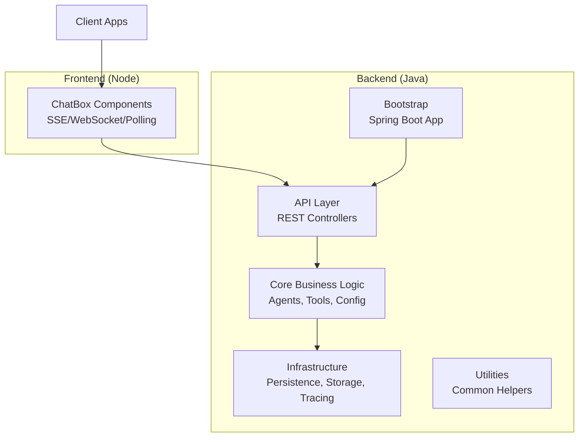
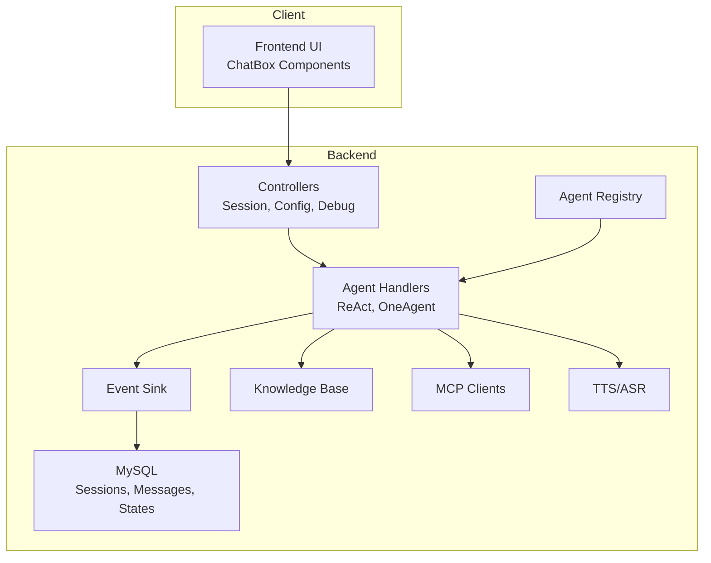
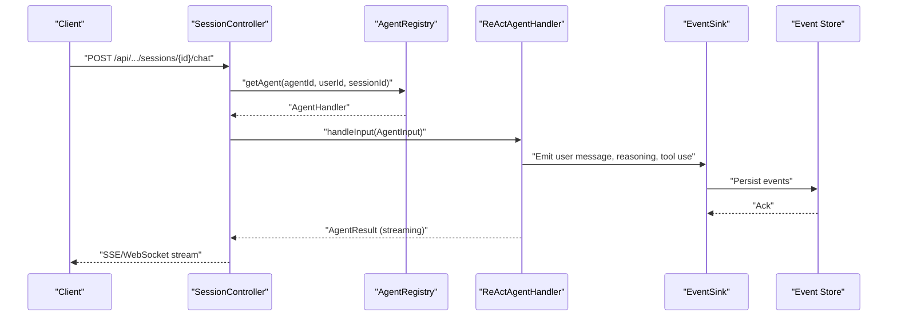
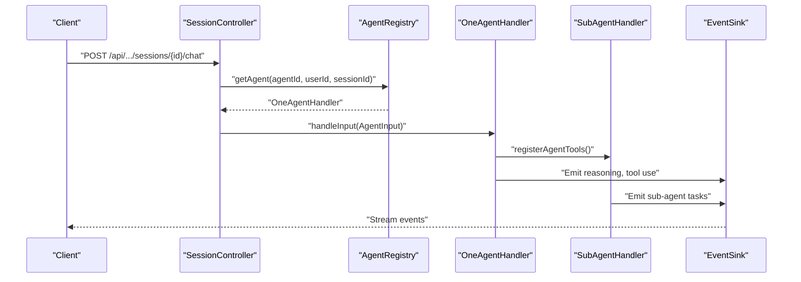
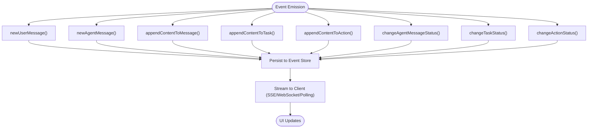
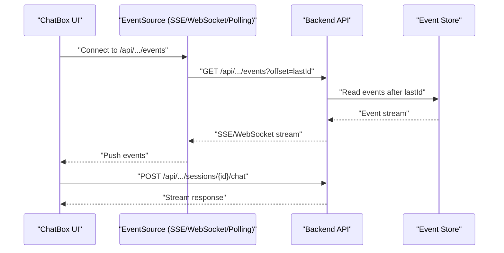
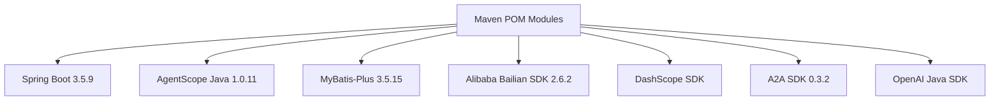

# Introduction and Purpose

<cite>
**Referenced Files in This Document**
- [README_en.md](file://README_en.md)
- [README.md](file://README.md)
- [backend_java/README.MD](file://backend_java/README.MD)
- [backend_java/pom.xml](file://backend_java/pom.xml)
- [backend_java/bootstrap/src/main/resources/application.yaml](file://backend_java/bootstrap/src/main/resources/application.yaml)
- [backend_java/core/src/main/java/com/aliyun/tam/x/tron/core/agents/ReActAgentHandler.java](file://backend_java/core/src/main/java/com/aliyun/tam/x/tron/core/agents/ReActAgentHandler.java)
- [backend_java/core/src/main/java/com/aliyun/tam/x/tron/core/agents/one/OneAgentHandler.java](file://backend_java/core/src/main/java/com/aliyun/tam/x/tron/core/agents/one/OneAgentHandler.java)
- [backend_java/core/src/main/java/com/aliyun/tam/x/tron/core/agents/AgentRegistry.java](file://backend_java/core/src/main/java/com/aliyun/tam/x/tron/core/agents/AgentRegistry.java)
- [backend_java/core/src/main/java/com/aliyun/tam/x/tron/core/domain/models/events/EventSink.java](file://backend_java/core/src/main/java/com/aliyun/tam/x/tron/core/domain/models/events/EventSink.java)
- [frontend/packages/chatbox/README.md](file://frontend/packages/chatbox/README.md)
</cite>

## Table of Contents
1. [Introduction](#introduction)
2. [Project Structure](#project-structure)
3. [Core Components](#core-components)
4. [Architecture Overview](#architecture-overview)
5. [Detailed Component Analysis](#detailed-component-analysis)
6. [Dependency Analysis](#dependency-analysis)
7. [Performance Considerations](#performance-considerations)
8. [Troubleshooting Guide](#troubleshooting-guide)
9. [Conclusion](#conclusion)

## Introduction
Tron OneAgent is an enterprise-grade AI Agent high-code development framework designed to accelerate the creation of intelligent assistants and smart customer service systems. It provides a production-ready foundation that enables rapid development of multi-agent AI systems with ReAct architecture, real-time streaming capabilities, and extensive extensibility. The framework’s mission is to democratize AI agent development by offering a robust, scalable, and operationally sound platform that reduces friction for teams building conversational AI solutions at scale.

Key value propositions:
- Rapid multi-agent development with ReAct single-agent and OneAgent multi-agent orchestration
- Real-time streaming via dual protocol support (SSE and WebSocket) for low-latency user experiences
- Dynamic configuration and runtime adjustments without service restarts
- Comprehensive session lifecycle management with event-sourced persistence
- Human-in-the-loop (HITL) workflows and intelligent follow-up suggestions
- Modern frontend chat components and flexible integrations for tools, knowledge bases, and MCP services

Target audiences:
- Enterprise developers building production-grade conversational AI applications
- AI platform architects designing scalable multi-agent systems
- Intelligent assistant creators who need fast iteration and operational control

## Project Structure
The repository is organized into a modular backend (Java) and a modern frontend (Node/React) workspace, with clear separation of concerns across API, core business logic, infrastructure, and utilities. The backend is built on Spring Boot and integrates with AgentScope Java to deliver ReAct and OneAgent patterns, while the frontend provides a rich chat experience with SSE/WebSocket/HTTP polling support.

**Diagram sources**
- [backend_java/pom.xml:11-17](file://backend_java/pom.xml#L11-L17)
- [frontend/packages/chatbox/README.md:3](file://frontend/packages/chatbox/README.md#L3)

**Section sources**
- [backend_java/README.MD:40-52](file://backend_java/README.MD#L40-L52)
- [backend_java/pom.xml:11-17](file://backend_java/pom.xml#L11-L17)
- [frontend/packages/chatbox/README.md:3](file://frontend/packages/chatbox/README.md#L3)

## Core Components
- ReAct Agent Handler: Implements ReAct reasoning loops with streaming output, tool invocation, and HITL integration. It emits structured events for text, thinking, tool use, and results, enabling real-time UI updates and session replay.
- OneAgent Handler: Orchestrates multi-agent workflows by registering sub-agent tools and coordinating cross-agent tasks, while preserving the same streaming and event-sourcing model.
- Agent Registry: Manages agent builders and caches per-user/per-session agent handlers, ensuring efficient reuse and lifecycle alignment.
- Event Sink: Centralized event emission for user input, agent messages, content append, task and action updates, and status transitions, enabling full auditability and real-time synchronization.
- Frontend ChatBox: Provides a component library with SSE/WebSocket/polling event sources, message rendering, and state management tailored to the backend’s event-sourced session model.

These components collectively enable:
- Streaming-first conversations with immediate feedback
- Rich, nested content (text, tasks, actions) with granular status tracking
- Operational controls such as cancellation and follow-up suggestions
- Seamless frontend-backend integration through standardized event streams

**Section sources**
- [backend_java/core/src/main/java/com/aliyun/tam/x/tron/core/agents/ReActAgentHandler.java:41-256](file://backend_java/core/src/main/java/com/aliyun/tam/x/tron/core/agents/ReActAgentHandler.java#L41-L256)
- [backend_java/core/src/main/java/com/aliyun/tam/x/tron/core/agents/one/OneAgentHandler.java:47-289](file://backend_java/core/src/main/java/com/aliyun/tam/x/tron/core/agents/one/OneAgentHandler.java#L47-L289)
- [backend_java/core/src/main/java/com/aliyun/tam/x/tron/core/agents/AgentRegistry.java:37-99](file://backend_java/core/src/main/java/com/aliyun/tam/x/tron/core/agents/AgentRegistry.java#L37-L99)
- [backend_java/core/src/main/java/com/aliyun/tam/x/tron/core/domain/models/events/EventSink.java:36-266](file://backend_java/core/src/main/java/com/aliyun/tam/x/tron/core/domain/models/events/EventSink.java#L36-L266)
- [frontend/packages/chatbox/README.md:33-61](file://frontend/packages/chatbox/README.md#L33-L61)

## Architecture Overview
Tron OneAgent’s architecture combines a Spring Boot backend with AgentScope Java for agent orchestration, and a modern React-based frontend chat experience. The backend exposes REST APIs for sessions, configuration, and debugging, and streams events to clients via SSE or WebSocket. The frontend integrates seamlessly with these event streams and supports fallback polling for compatibility.

**Diagram sources**
- [backend_java/README.MD:54-87](file://backend_java/README.MD#L54-L87)
- [backend_java/bootstrap/src/main/resources/application.yaml:1-63](file://backend_java/bootstrap/src/main/resources/application.yaml#L1-L63)
- [frontend/packages/chatbox/README.md:199-222](file://frontend/packages/chatbox/README.md#L199-L222)

**Section sources**
- [README_en.md:57-94](file://README_en.md#L57-L94)
- [backend_java/README.MD:54-87](file://backend_java/README.MD#L54-L87)
- [backend_java/bootstrap/src/main/resources/application.yaml:1-63](file://backend_java/bootstrap/src/main/resources/application.yaml#L1-L63)
- [frontend/packages/chatbox/README.md:199-222](file://frontend/packages/chatbox/README.md#L199-L222)

## Detailed Component Analysis

### ReAct Agent Handler
The ReAct Agent Handler orchestrates reasoning, tool use, and streaming output. It converts user input into agent messages, streams intermediate events (thinking, tool use, tool results), and appends content to messages and actions. It supports cancellation, usage accounting, and follow-up suggestions.

**Diagram sources**
- [backend_java/core/src/main/java/com/aliyun/tam/x/tron/core/agents/ReActAgentHandler.java:64-239](file://backend_java/core/src/main/java/com/aliyun/tam/x/tron/core/agents/ReActAgentHandler.java#L64-L239)
- [backend_java/core/src/main/java/com/aliyun/tam/x/tron/core/agents/AgentRegistry.java:74-93](file://backend_java/core/src/main/java/com/aliyun/tam/x/tron/core/agents/AgentRegistry.java#L74-L93)

**Section sources**
- [backend_java/core/src/main/java/com/aliyun/tam/x/tron/core/agents/ReActAgentHandler.java:41-256](file://backend_java/core/src/main/java/com/aliyun/tam/x/tron/core/agents/ReActAgentHandler.java#L41-L256)

### OneAgent Handler
The OneAgent Handler coordinates a main ReAct agent with sub-agents (local and remote via A2A), registering sub-agent tools and aggregating executed tasks. It mirrors the ReAct streaming pattern while managing cross-agent orchestration.

**Diagram sources**
- [backend_java/core/src/main/java/com/aliyun/tam/x/tron/core/agents/one/OneAgentHandler.java:74-272](file://backend_java/core/src/main/java/com/aliyun/tam/x/tron/core/agents/one/OneAgentHandler.java#L74-L272)

**Section sources**
- [backend_java/core/src/main/java/com/aliyun/tam/x/tron/core/agents/one/OneAgentHandler.java:47-289](file://backend_java/core/src/main/java/com/aliyun/tam/x/tron/core/agents/one/OneAgentHandler.java#L47-L289)

### Event Sink and Streaming
Event Sink encapsulates all session events (user input, agent messages, content append, task/action updates, status changes) and provides a unified API for emitting and persisting events. This enables real-time streaming and full session replay.

**Diagram sources**
- [backend_java/core/src/main/java/com/aliyun/tam/x/tron/core/domain/models/events/EventSink.java:67-266](file://backend_java/core/src/main/java/com/aliyun/tam/x/tron/core/domain/models/events/EventSink.java#L67-L266)

**Section sources**
- [backend_java/core/src/main/java/com/aliyun/tam/x/tron/core/domain/models/events/EventSink.java:36-266](file://backend_java/core/src/main/java/com/aliyun/tam/x/tron/core/domain/models/events/EventSink.java#L36-L266)

### Frontend Chat Integration
The frontend ChatBox supports multiple event sources (WebSocket, SSE, HTTP polling) and renders nested content (text, tasks, actions) with state synchronization. It integrates with backend APIs for session creation, chat submission, and event streaming.

**Diagram sources**
- [frontend/packages/chatbox/README.md:118-137](file://frontend/packages/chatbox/README.md#L118-L137)
- [frontend/packages/chatbox/README.md:208-222](file://frontend/packages/chatbox/README.md#L208-L222)

**Section sources**
- [frontend/packages/chatbox/README.md:33-61](file://frontend/packages/chatbox/README.md#L33-L61)
- [frontend/packages/chatbox/README.md:118-137](file://frontend/packages/chatbox/README.md#L118-L137)
- [frontend/packages/chatbox/README.md:208-222](file://frontend/packages/chatbox/README.md#L208-L222)

## Dependency Analysis
The backend leverages Spring Boot 3.5.9, AgentScope Java 1.0.11, MyBatis-Plus 3.5.15, and integrates with Alibaba Bailian SDK, DashScope, and A2A SDK for multi-agent communication. The frontend provides a cohesive chat experience with modular components and flexible event-source adapters.

**Diagram sources**
- [backend_java/pom.xml:19-33](file://backend_java/pom.xml#L19-L33)
- [backend_java/pom.xml:35-191](file://backend_java/pom.xml#L35-L191)

**Section sources**
- [backend_java/pom.xml:19-33](file://backend_java/pom.xml#L19-L33)
- [backend_java/pom.xml:35-191](file://backend_java/pom.xml#L35-L191)

## Performance Considerations
- Streaming-first design: Use SSE/WebSocket for real-time, low-latency user experiences; fall back to polling for environments with limited transport support.
- Event batching and buffering: Frontend event buffers reduce render overhead and improve responsiveness during high-frequency updates.
- Caching and reuse: AgentRegistry caches per-user/per-session handlers to minimize initialization overhead.
- Incremental state updates: Event-sourced persistence avoids full snapshots and supports efficient incremental UI updates.

## Troubleshooting Guide
- Streaming delays or disconnections:
  - Verify backend configuration for SSE/WebSocket and network connectivity.
  - Confirm frontend event source selection and retry policies.
- Session replay inconsistencies:
  - Ensure the client resumes from the correct last applied event ID and handles event ordering.
- Agent cancellation behavior:
  - Use the cancellation API to interrupt long-running tool use or reasoning loops; confirm the handler reflects the updated status.
- Configuration hot updates:
  - Validate dynamic configuration endpoints and ensure services are restarted only when required by the underlying components.

**Section sources**
- [backend_java/core/src/main/java/com/aliyun/tam/x/tron/core/agents/ReActAgentHandler.java:242-254](file://backend_java/core/src/main/java/com/aliyun/tam/x/tron/core/agents/ReActAgentHandler.java#L242-L254)
- [backend_java/core/src/main/java/com/aliyun/tam/x/tron/core/agents/one/OneAgentHandler.java:274-287](file://backend_java/core/src/main/java/com/aliyun/tam/x/tron/core/agents/one/OneAgentHandler.java#L274-L287)

## Conclusion
Tron OneAgent delivers a comprehensive, production-ready foundation for building intelligent assistants and smart customer service systems. By combining ReAct and OneAgent architectures with real-time streaming, dynamic configuration, and event-sourced persistence, it empowers enterprise developers and AI platform architects to iterate quickly and operate reliably at scale. Its modern frontend integration and extensive extensibility further streamline the journey from prototype to production.