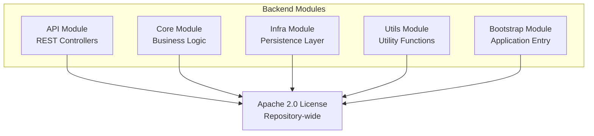

# Licensing Policy

<cite>
**Referenced Files in This Document**
- [LICENSE.txt](file://LICENSE.txt)
- [README.md](file://README.md)
- [README_en.md](file://README_en.md)
- [AGENTS.md](file://AGENTS.md)
- [backend_java/pom.xml](file://backend_java/pom.xml)
- [backend_java/api/pom.xml](file://backend_java/api/pom.xml)
- [backend_java/core/pom.xml](file://backend_java/core/pom.xml)
- [backend_java/infra/pom.xml](file://backend_java/infra/pom.xml)
- [backend_java/utils/pom.xml](file://backend_java/utils/pom.xml)
- [backend_java/bootstrap/pom.xml](file://backend_java/bootstrap/pom.xml)
- [frontend/package.json](file://frontend/package.json)
</cite>

## Table of Contents
1. [Introduction](#introduction)
2. [License Overview](#license-overview)
3. [Repository-wide Licensing](#repository-wide-licensing)
4. [Module-specific Licensing](#module-specific-licensing)
5. [Third-party Dependencies Licensing](#third-party-dependencies-licensing)
6. [Frontend Licensing](#frontend-licensing)
7. [Legal Compliance Guidelines](#legal-compliance-guidelines)
8. [License Header Requirements](#license-header-requirements)
9. [Contributor License Agreement](#contributor-license-agreement)
10. [Commercial Use Permissions](#commercial-use-permissions)
11. [Patent Grant](#patent-grant)
12. [Limitations and Disclaimer](#limitations-and-disclaimer)
13. [Compliance Checklist](#compliance-checklist)

## Introduction

This document provides a comprehensive overview of the licensing policy for the Tron OneAgent project. The project follows the Apache License 2.0, which is one of the most permissive open-source licenses available. Understanding the licensing structure is crucial for developers, contributors, and organizations considering using or contributing to this enterprise-grade AI Agent platform.

## License Overview

The Tron OneAgent project is licensed under the Apache License, Version 2.0 (the "License"). This is a permissive open-source license that allows for broad usage, modification, and distribution while providing important protections for contributors and users.

Key characteristics of the Apache 2.0 License:
- Permits commercial use
- Allows modification and distribution
- Provides patent protection
- Requires preservation of notices
- Includes warranty disclaimer
- Provides liability limitation

**Section sources**
- [LICENSE.txt:1-14](file://LICENSE.txt#L1-L14)
- [README.md:164-167](file://README.md#L164-L167)
- [README_en.md:165-167](file://README_en.md#L165-L167)

## Repository-wide Licensing

The entire Tron OneAgent repository operates under the Apache License 2.0. This unified licensing approach ensures consistency across all components, modules, and contributions to the project.

### License Text and Terms

The license grants users the right to:
- Use the software for any purpose
- Copy and distribute the software
- Modify the software
- Propagate the software
- Private use and internal development
- Commercial use and distribution

**Section sources**
- [LICENSE.txt:3-13](file://LICENSE.txt#L3-L13)

## Module-specific Licensing

Each module within the backend Java application maintains the Apache 2.0 licensing while being part of the larger project structure. The modules include:

### Backend Modules Structure

**Diagram sources**
- [backend_java/pom.xml:11-16](file://backend_java/pom.xml#L11-L16)

### Module Dependencies and Licensing

Each module maintains its own POM configuration while adhering to the repository-wide Apache 2.0 license:

- **API Module**: Contains REST controllers and WebSocket endpoints
- **Core Module**: Houses business logic and domain models
- **Infra Module**: Manages database persistence and storage
- **Utils Module**: Provides utility functions and helpers
- **Bootstrap Module**: Serves as the application entry point

**Section sources**
- [backend_java/api/pom.xml:11](file://backend_java/api/pom.xml#L11)
- [backend_java/core/pom.xml:11](file://backend_java/core/pom.xml#L11)
- [backend_java/infra/pom.xml:11](file://backend_java/infra/pom.xml#L11)
- [backend_java/utils/pom.xml:11](file://backend_java/utils/pom.xml#L11)
- [backend_java/bootstrap/pom.xml:11](file://backend_java/bootstrap/pom.xml#L11)

## Third-party Dependencies Licensing

The Tron OneAgent project incorporates numerous third-party dependencies, each maintaining their respective licenses. Understanding these dependencies is crucial for compliance.

### Major Dependencies and Their Licenses

| Dependency | Version | License Type | Purpose |
|------------|---------|--------------|---------|
| Spring Boot | 3.5.9 | Apache 2.0 | Web Framework |
| AgentScope | 1.0.11 | Apache 2.0 | AI Agent Framework |
| MyBatis-Plus | 3.5.15 | Apache 2.0 | ORM Framework |
| OpenAI Java | 4.13.0 | MIT | AI Model Integration |
| Alibaba DashScope | 2.22.11 | Proprietary | Cloud AI Services |
| Jackson | 2.21.1 | Apache 2.0 | JSON Processing |

### Dependency Management Approach

The project uses Maven's dependency management to track and manage licenses across all modules. Each dependency maintains its original license terms while being integrated into the Apache 2.0 licensed project.

**Section sources**
- [backend_java/pom.xml:21-32](file://backend_java/pom.xml#L21-L32)
- [backend_java/pom.xml:63-191](file://backend_java/pom.xml#L63-L191)

## Frontend Licensing

The frontend components follow the same Apache 2.0 licensing model as the backend, ensuring consistency across the entire monorepo structure.

### Frontend Package Structure

The frontend uses Yarn workspaces with the following structure:
- **packages/control**: Admin console application
- **packages/chatbox**: Chat UI library

### Frontend Dependencies Licensing

The frontend components incorporate various open-source libraries while maintaining Apache 2.0 compatibility:

- **React 18**: MIT License
- **Ant Design 5**: MIT License  
- **Less**: MIT License
- **TypeScript**: Apache 2.0

**Section sources**
- [frontend/package.json:1-16](file://frontend/package.json#L1-L16)

## Legal Compliance Guidelines

To ensure legal compliance when using or contributing to Tron OneAgent, follow these guidelines:

### Required Actions

1. **Preserve Copyright Notices**: Maintain all copyright, patent, trademark, and attribution notices
2. **Include License Text**: Distribute the Apache 2.0 license text with your copies
3. **State Changes**: Document any modifications made to the original software
4. **Notice Requirement**: Provide notice of modifications when distributing

### Prohibited Actions

- Cannot remove or alter copyright and license notices
- Cannot claim endorsement by the original authors
- Cannot use trademark names without permission
- Cannot distribute under incompatible licenses

**Section sources**
- [LICENSE.txt:9-13](file://LICENSE.txt#L9-L13)

## License Header Requirements

The project enforces strict license header requirements for all source files to ensure proper attribution and compliance.

### Header Requirements

Every newly created source file must include the Apache 2.0 license header in a `/* ... */` block comment. The header text is standardized and maintained in the repository root.

### Supported File Types

The license header requirement applies to:
- Java source files (`.java`)
- TypeScript source files (`.ts`, `.tsx`)
- JavaScript source files (`.js`, `.jsx`)
- CSS/Less files (`.css`, `.less`)
- Configuration files

### Enforcement Mechanism

A PostToolUse hook validates the presence of license headers on every write operation, ensuring compliance across the entire codebase.

**Section sources**
- [AGENTS.md:80-83](file://AGENTS.md#L80-L83)

## Contributor License Agreement

While the project uses Apache 2.0 licensing, contributors should be aware of the standard CLA requirements for major corporate contributions:

### Individual Contributions

Individual contributors retain their rights while granting necessary rights to the project under Apache 2.0 terms.

### Corporate Contributions

Organizations making substantial contributions may need to establish formal CLAs with appropriate legal review.

### Patent Protection

Contributions under Apache 2.0 include implicit patent licensing for the contributor's patent claims essential to use the contribution.

## Commercial Use Permissions

The Apache 2.0 license provides extensive commercial use permissions:

### Allowed Commercial Activities

- **Internal Use**: Companies can use Tron OneAgent internally without payment
- **Distribution**: Can distribute modified or unmodified versions
- **SaaS**: Can offer Tron OneAgent as a service
- **Integration**: Can integrate with proprietary systems
- **Modification**: Can modify and use modified versions commercially

### Commercial Limitations

- Cannot claim endorsement by original authors
- Must maintain license notices
- Cannot use trademarks without permission
- Must include required notices with distributions

## Patent Grant

The Apache 2.0 license includes an explicit patent grant:

### Grant Scope

Contributors grant a perpetual, worldwide, non-exclusive, no-charge, royalty-free patent license to make, have made, use, offer to sell, sell, import, transfer, and otherwise run, modify, reproduce, prepare derivative works of, distribute, perform, display, and disclose the work.

### Patent Provision

If you institute patent litigation against the licensor or any entity (including a cross-claim or counterclaim in a lawsuit) alleging that the work constitutes direct or contributory patent infringement, then any patent rights granted to you under this license for the work shall terminate as of the date such litigation is filed.

## Limitations and Disclaimer

The Apache 2.0 license includes important limitations and disclaimers:

### Warranty Disclaimer

The software is provided "as is" without warranty of any kind, either expressed or implied, including but not limited to the implied warranties of merchantability and fitness for a particular purpose.

### Liability Limitation

Except in cases of willful misconduct, the licensor shall have no liability for any direct, indirect, special, incidental, or consequential damages arising out of the use of the work or inability to use the work.

### Trademark Protection

The license does not grant rights to use trade names, trademarks, service marks, or product names of the licensor, except as required for reasonable and customary use in describing the origin of the work.

**Section sources**
- [LICENSE.txt:10-13](file://LICENSE.txt#L10-L13)

## Compliance Checklist

Before using Tron OneAgent in your projects, verify compliance with the following:

### Pre-implementation Checklist

- [ ] Verify Apache 2.0 license compliance
- [ ] Confirm all third-party dependencies are properly licensed
- [ ] Ensure license headers are present in all source files
- [ ] Review patent implications for your use case
- [ ] Understand trademark usage restrictions

### Distribution Checklist

- [ ] Include complete license text
- [ ] Preserve all copyright notices
- [ ] Document all modifications
- [ ] Provide required notices to recipients
- [ ] Comply with patent grant requirements

### Ongoing Compliance

- [ ] Monitor license changes in dependencies
- [ ] Update license headers for new files
- [ ] Track patent implications
- [ ] Maintain compliance records

This comprehensive licensing policy ensures that Tron OneAgent remains fully compliant with open-source standards while providing clear guidelines for commercial and non-commercial use. The Apache 2.0 license strikes an excellent balance between permissiveness and protection for both users and contributors.