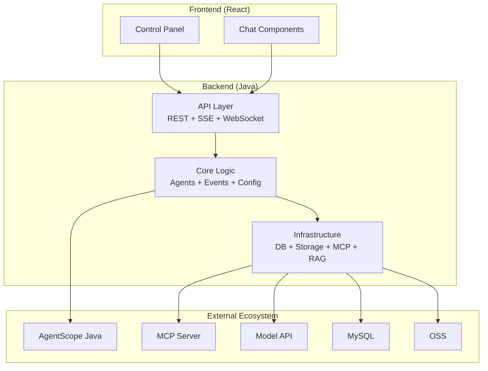
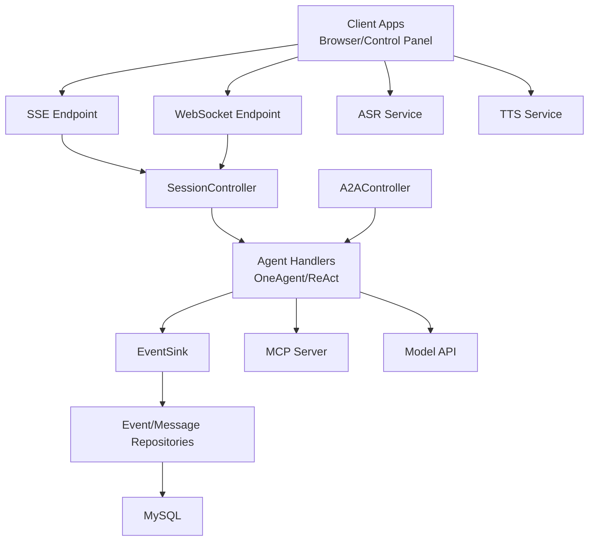
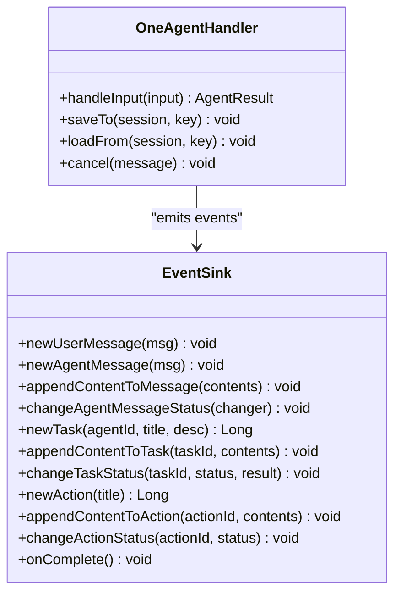
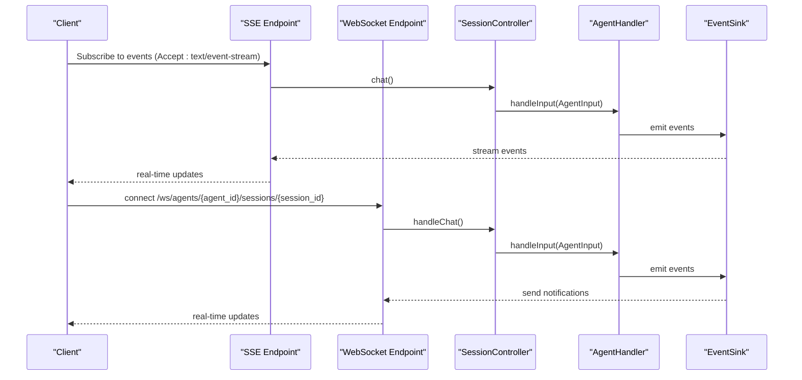
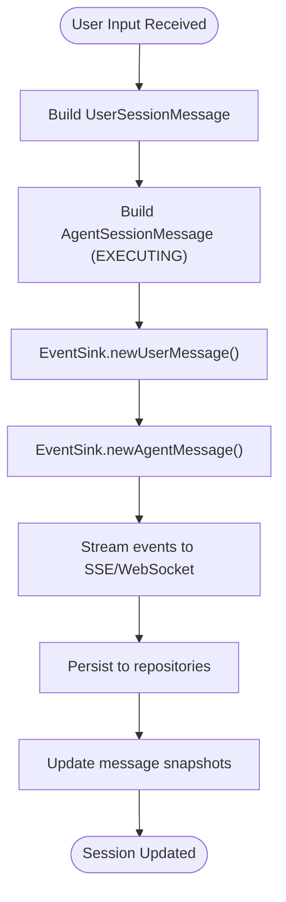
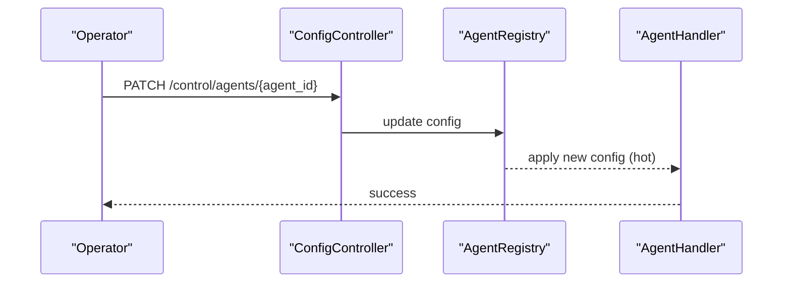
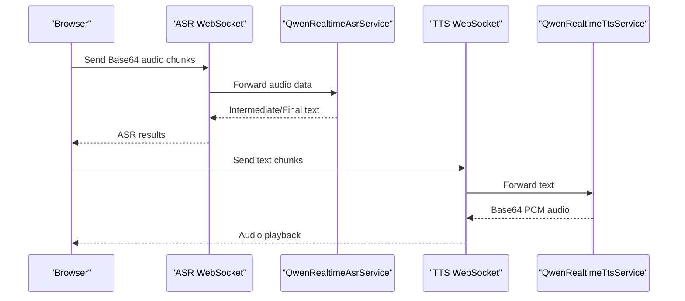
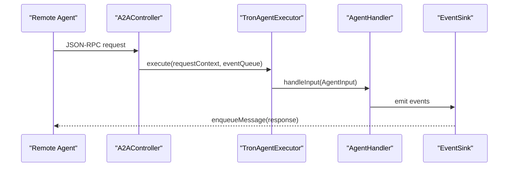
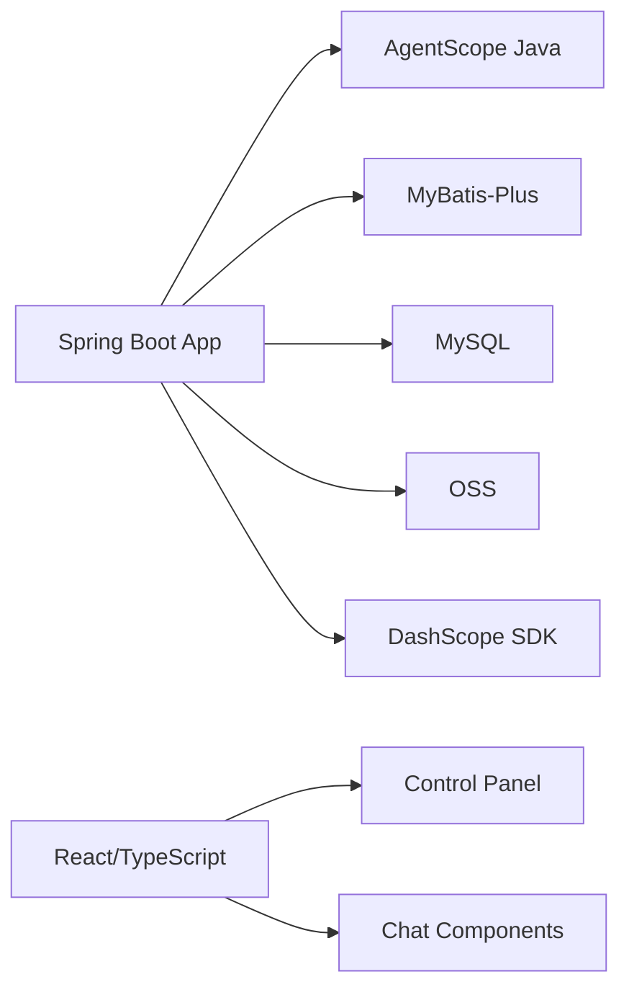

# Project Overview

<cite>
**Referenced Files in This Document**
- [README_en.md](file://README_en.md)
- [backend_java/README.MD](file://backend_java/README.MD)
- [frontend/README.md](file://frontend/README.md)
- [backend_java/bootstrap/src/main/resources/application.yaml](file://backend_java/bootstrap/src/main/resources/application.yaml)
- [backend_java/api/src/main/java/com/aliyun/tam/x/tron/api/SessionController.java](file://backend_java/api/src/main/java/com/aliyun/tam/x/tron/api/SessionController.java)
- [backend_java/api/src/main/java/com/aliyun/tam/x/tron/api/A2AController.java](file://backend_java/api/src/main/java/com/aliyun/tam/x/tron/api/A2AController.java)
- [backend_java/api/src/main/java/com/aliyun/tam/x/tron/ws/AgentWsEndpoint.java](file://backend_java/api/src/main/java/com/aliyun/tam/x/tron/ws/AgentWsEndpoint.java)
- [backend_java/core/src/main/java/com/aliyun/tam/x/tron/core/agents/one/OneAgentHandler.java](file://backend_java/core/src/main/java/com/aliyun/tam/x/tron/core/agents/one/OneAgentHandler.java)
- [backend_java/core/src/main/java/com/aliyun/tam/x/tron/core/domain/models/contents/Content.java](file://backend_java/core/src/main/java/com/aliyun/tam/x/tron/core/domain/models/contents/Content.java)
- [backend_java/core/src/main/java/com/aliyun/tam/x/tron/core/domain/models/events/EventSink.java](file://backend_java/core/src/main/java/com/aliyun/tam/x/tron/core/domain/models/events/EventSink.java)
- [backend_java/core/src/main/java/com/aliyun/tam/x/tron/core/config/AgentConfig.java](file://backend_java/core/src/main/java/com/aliyun/tam/x/tron/core/config/AgentConfig.java)
- [backend_java/core/src/main/java/com/aliyun/tam/x/tron/core/asr/QwenRealtimeAsrService.java](file://backend_java/core/src/main/java/com/aliyun/tam/x/tron/core/asr/QwenRealtimeAsrService.java)
- [backend_java/core/src/main/java/com/aliyun/tam/x/tron/core/tts/QwenRealtimeTtsService.java](file://backend_java/core/src/main/java/com/aliyun/tam/x/tron/core/tts/QwenRealtimeTtsService.java)
- [docs/en/develop_guide.md](file://docs/en/develop_guide.md)
</cite>

## Table of Contents
1. [Introduction](#introduction)
2. [Project Structure](#project-structure)
3. [Core Components](#core-components)
4. [Architecture Overview](#architecture-overview)
5. [Detailed Component Analysis](#detailed-component-analysis)
6. [Dependency Analysis](#dependency-analysis)
7. [Performance Considerations](#performance-considerations)
8. [Troubleshooting Guide](#troubleshooting-guide)
9. [Conclusion](#conclusion)

## Introduction
Tron OneAgent is an enterprise-grade AI Agent high-code development framework designed to accelerate building production-ready AI assistants. It provides:
- Out-of-the-box backend services and frontend interaction capabilities
- Multi-agent orchestration (single-agent ReAct and multi-agent OneAgent)
- Dual-protocol streaming (SSE and WebSocket)
- Asynchronous event-driven architecture with session-level persistence
- Dynamic configuration, HITL human-in-the-loop, multimodal TTS/ASR, and modern frontend components
- Full compatibility with the Alibaba AgentScope Java ecosystem

Use cases include enterprise AI assistants and intelligent customer service systems that require multi-agent collaboration, long-term memory, and real-time interaction.

**Section sources**
- [README_en.md:19-55](file://README_en.md#L19-L55)
- [backend_java/README.MD:1-35](file://backend_java/README.MD#L1-L35)

## Project Structure
The repository is organized into three primary areas:
- backend_java: Spring Boot-based Java backend with API, core business logic, infrastructure, and utilities
- frontend: React/TypeScript-based UI with reusable chat components and a control panel
- docs: English and Chinese documentation for development and deployment

**Diagram sources**
- [backend_java/README.MD:38-52](file://backend_java/README.MD#L38-L52)
- [frontend/README.md:19-29](file://frontend/README.md#L19-L29)
- [README_en.md:57-94](file://README_en.md#L57-L94)

**Section sources**
- [backend_java/README.MD:38-52](file://backend_java/README.MD#L38-L52)
- [frontend/README.md:19-29](file://frontend/README.md#L19-L29)
- [README_en.md:57-94](file://README_en.md#L57-L94)

## Core Components
- Multi-Agent Orchestration
  - ReAct single-agent mode for autonomous tool use and retrieval
  - OneAgent multi-agent mode with local and remote (A2A) sub-agent coordination
- Dual-Protocol Streaming
  - SSE for server-sent events and polling
  - WebSocket for low-latency, real-time bidirectional communication
- Asynchronous Event-Driven Engine
  - Event sourcing for all session interactions (user input, agent messages, tool use, tasks, actions)
  - EventSink aggregates and streams events to clients
- Session-Level Persistence
  - Agent → User → Session isolation with full lifecycle management
  - Event streams persisted and replayable for audit and recovery
- Dynamic Configuration and Debugging
  - Hot-update of Agent configs, tools, MCP clients, knowledge bases, long-term memory, and skills
  - Dedicated control plane for configuration and debugging
- Human-in-the-Loop (HITL)
  - Insert manual approvals and information collection into agent workflows
- Multimodal Support
  - Real-time ASR and TTS via Alibaba Bailian (Qwen) integrations
- Modern Frontend
  - Reusable chat components and a control panel for configuration and monitoring

Practical examples:
- Enterprise AI Assistant: multi-agent collaboration, tool invocation, and knowledge-base retrieval
- Intelligent Customer Service: session isolation, long-term memory, and business API integration

**Section sources**
- [README_en.md:23-37](file://README_en.md#L23-L37)
- [backend_java/README.MD:54-87](file://backend_java/README.MD#L54-L87)
- [backend_java/core/src/main/java/com/aliyun/tam/x/tron/core/agents/one/OneAgentHandler.java:74-272](file://backend_java/core/src/main/java/com/aliyun/tam/x/tron/core/agents/one/OneAgentHandler.java#L74-L272)
- [backend_java/core/src/main/java/com/aliyun/tam/x/tron/core/domain/models/events/EventSink.java:36-266](file://backend_java/core/src/main/java/com/aliyun/tam/x/tron/core/domain/models/events/EventSink.java#L36-L266)
- [backend_java/api/src/main/java/com/aliyun/tam/x/tron/api/SessionController.java:308-346](file://backend_java/api/src/main/java/com/aliyun/tam/x/tron/api/SessionController.java#L308-L346)
- [backend_java/api/src/main/java/com/aliyun/tam/x/tron/ws/AgentWsEndpoint.java:62-136](file://backend_java/api/src/main/java/com/aliyun/tam/x/tron/ws/AgentWsEndpoint.java#L62-L136)
- [backend_java/core/src/main/java/com/aliyun/tam/x/tron/core/config/AgentConfig.java:32-133](file://backend_java/core/src/main/java/com/aliyun/tam/x/tron/core/config/AgentConfig.java#L32-L133)
- [docs/en/develop_guide.md:1990-2402](file://docs/en/develop_guide.md#L1990-L2402)

## Architecture Overview
Tron OneAgent integrates tightly with Alibaba AgentScope Java and exposes a control plane for dynamic configuration and debugging. The backend persists events and messages, while the frontend provides modern UI components and real-time streaming.

**Diagram sources**
- [README_en.md:57-94](file://README_en.md#L57-L94)
- [backend_java/api/src/main/java/com/aliyun/tam/x/tron/api/SessionController.java:84-131](file://backend_java/api/src/main/java/com/aliyun/tam/x/tron/api/SessionController.java#L84-L131)
- [backend_java/api/src/main/java/com/aliyun/tam/x/tron/api/A2AController.java:67-105](file://backend_java/api/src/main/java/com/aliyun/tam/x/tron/api/A2AController.java#L67-L105)
- [backend_java/core/src/main/java/com/aliyun/tam/x/tron/core/domain/models/events/EventSink.java:36-266](file://backend_java/core/src/main/java/com/aliyun/tam/x/tron/core/domain/models/events/EventSink.java#L36-L266)
- [backend_java/bootstrap/src/main/resources/application.yaml:27-51](file://backend_java/bootstrap/src/main/resources/application.yaml#L27-L51)

**Section sources**
- [README_en.md:57-94](file://README_en.md#L57-L94)
- [backend_java/bootstrap/src/main/resources/application.yaml:27-51](file://backend_java/bootstrap/src/main/resources/application.yaml#L27-L51)

## Detailed Component Analysis

### Multi-Agent Orchestration
- OneAgentHandler coordinates reasoning, tool use, and sub-agent tasks, emitting structured events for content, actions, and tasks.
- Supports cancellation and HITL insertion points for manual interventions.
- Integrates with local and remote (A2A) sub-agents for cross-service orchestration.

**Diagram sources**
- [backend_java/core/src/main/java/com/aliyun/tam/x/tron/core/agents/one/OneAgentHandler.java:47-289](file://backend_java/core/src/main/java/com/aliyun/tam/x/tron/core/agents/one/OneAgentHandler.java#L47-L289)
- [backend_java/core/src/main/java/com/aliyun/tam/x/tron/core/domain/models/events/EventSink.java:42-266](file://backend_java/core/src/main/java/com/aliyun/tam/x/tron/core/domain/models/events/EventSink.java#L42-L266)

**Section sources**
- [backend_java/core/src/main/java/com/aliyun/tam/x/tron/core/agents/one/OneAgentHandler.java:74-272](file://backend_java/core/src/main/java/com/aliyun/tam/x/tron/core/agents/one/OneAgentHandler.java#L74-L272)
- [backend_java/core/src/main/java/com/aliyun/tam/x/tron/core/domain/models/events/EventSink.java:67-256](file://backend_java/core/src/main/java/com/aliyun/tam/x/tron/core/domain/models/events/EventSink.java#L67-L256)

### Dual-Protocol Streaming (SSE/WebSocket)
- SessionController supports SSE streaming for real-time event delivery and JSON polling for compatibility.
- AgentWsEndpoint provides WebSocket transport with JSON-RPC over WebSocket for chat and cancellation.

**Diagram sources**
- [backend_java/api/src/main/java/com/aliyun/tam/x/tron/api/SessionController.java:308-346](file://backend_java/api/src/main/java/com/aliyun/tam/x/tron/api/SessionController.java#L308-L346)
- [backend_java/api/src/main/java/com/aliyun/tam/x/tron/ws/AgentWsEndpoint.java:116-136](file://backend_java/api/src/main/java/com/aliyun/tam/x/tron/ws/AgentWsEndpoint.java#L116-L136)

**Section sources**
- [backend_java/api/src/main/java/com/aliyun/tam/x/tron/api/SessionController.java:308-346](file://backend_java/api/src/main/java/com/aliyun/tam/x/tron/api/SessionController.java#L308-L346)
- [backend_java/api/src/main/java/com/aliyun/tam/x/tron/ws/AgentWsEndpoint.java:222-332](file://backend_java/api/src/main/java/com/aliyun/tam/x/tron/ws/AgentWsEndpoint.java#L222-L332)

### Asynchronous Event-Driven Design and Session Persistence
- EventSink encapsulates all session events and ensures persistence and real-time delivery.
- Content hierarchy supports nested content blocks (text, media, tasks, actions, HITL) enabling rich, structured conversations.

**Diagram sources**
- [backend_java/core/src/main/java/com/aliyun/tam/x/tron/core/domain/models/events/EventSink.java:67-130](file://backend_java/core/src/main/java/com/aliyun/tam/x/tron/core/domain/models/events/EventSink.java#L67-L130)
- [backend_java/core/src/main/java/com/aliyun/tam/x/tron/core/domain/models/contents/Content.java:38-56](file://backend_java/core/src/main/java/com/aliyun/tam/x/tron/core/domain/models/contents/Content.java#L38-L56)

**Section sources**
- [backend_java/core/src/main/java/com/aliyun/tam/x/tron/core/domain/models/events/EventSink.java:67-256](file://backend_java/core/src/main/java/com/aliyun/tam/x/tron/core/domain/models/events/EventSink.java#L67-L256)
- [backend_java/core/src/main/java/com/aliyun/tam/x/tron/core/domain/models/contents/Content.java:38-148](file://backend_java/core/src/main/java/com/aliyun/tam/x/tron/core/domain/models/contents/Content.java#L38-L148)

### Dynamic Configuration and HITL Human-in-the-Loop
- ConfigController exposes endpoints to manage agents, tools, MCP clients, knowledge bases, long-term memory, and skills.
- HITL content blocks allow inserting manual approvals or information collection points during agent execution.

**Diagram sources**
- [backend_java/api/src/main/java/com/aliyun/tam/x/tron/api/ConfigController.java:53-437](file://backend_java/api/src/main/java/com/aliyun/tam/x/tron/api/ConfigController.java#L53-L437)
- [backend_java/core/src/main/java/com/aliyun/tam/x/tron/core/config/AgentConfig.java:32-133](file://backend_java/core/src/main/java/com/aliyun/tam/x/tron/core/config/AgentConfig.java#L32-L133)

**Section sources**
- [backend_java/api/src/main/java/com/aliyun/tam/x/tron/api/ConfigController.java:371-412](file://backend_java/api/src/main/java/com/aliyun/tam/x/tron/api/ConfigController.java#L371-L412)
- [backend_java/core/src/main/java/com/aliyun/tam/x/tron/core/domain/models/contents/HitlContent.java:13-38](file://backend_java/core/src/main/java/com/aliyun/tam/x/tron/core/domain/models/contents/HitlContent.java#L13-L38)

### Multimodal Support (ASR/TTS)
- QwenRealtimeAsrService and QwenRealtimeTtsService integrate Alibaba Bailian real-time ASR/TTS for voice-enabled experiences.
- Frontend components consume WebSocket endpoints for streaming audio data.

**Diagram sources**
- [backend_java/core/src/main/java/com/aliyun/tam/x/tron/core/asr/QwenRealtimeAsrService.java:36-149](file://backend_java/core/src/main/java/com/aliyun/tam/x/tron/core/asr/QwenRealtimeAsrService.java#L36-L149)
- [backend_java/core/src/main/java/com/aliyun/tam/x/tron/core/tts/QwenRealtimeTtsService.java:36-165](file://backend_java/core/src/main/java/com/aliyun/tam/x/tron/core/tts/QwenRealtimeTtsService.java#L36-L165)
- [docs/en/develop_guide.md:2167-2378](file://docs/en/develop_guide.md#L2167-L2378)

**Section sources**
- [backend_java/core/src/main/java/com/aliyun/tam/x/tron/core/asr/QwenRealtimeAsrService.java:36-149](file://backend_java/core/src/main/java/com/aliyun/tam/x/tron/core/asr/QwenRealtimeAsrService.java#L36-L149)
- [backend_java/core/src/main/java/com/aliyun/tam/x/tron/core/tts/QwenRealtimeTtsService.java:36-165](file://backend_java/core/src/main/java/com/aliyun/tam/x/tron/core/tts/QwenRealtimeTtsService.java#L36-L165)
- [docs/en/develop_guide.md:2167-2378](file://docs/en/develop_guide.md#L2167-L2378)

### A2A Protocol Integration
- A2AController publishes agent cards and handles JSON-RPC requests to execute remote sub-agents.
- Enables cross-language and cross-service multi-agent orchestration aligned with AgentScope Java.

**Diagram sources**
- [backend_java/api/src/main/java/com/aliyun/tam/x/tron/api/A2AController.java:67-128](file://backend_java/api/src/main/java/com/aliyun/tam/x/tron/api/A2AController.java#L67-L128)
- [backend_java/api/src/main/java/com/aliyun/tam/x/tron/api/A2AController.java:130-222](file://backend_java/api/src/main/java/com/aliyun/tam/x/tron/api/A2AController.java#L130-L222)

**Section sources**
- [backend_java/api/src/main/java/com/aliyun/tam/x/tron/api/A2AController.java:91-128](file://backend_java/api/src/main/java/com/aliyun/tam/x/tron/api/A2AController.java#L91-L128)
- [backend_java/api/src/main/java/com/aliyun/tam/x/tron/api/A2AController.java:130-222](file://backend_java/api/src/main/java/com/aliyun/tam/x/tron/api/A2AController.java#L130-L222)

## Dependency Analysis
- Backend depends on Spring Boot, AgentScope Java, MyBatis-Plus, and Alibaba Bailian SDKs.
- Frontend uses React, TypeScript, and a modular workspace for chat components and control panel.
- Configuration is centralized in application.yaml with environment variables for database and cloud credentials.

**Diagram sources**
- [backend_java/bootstrap/src/main/resources/application.yaml:1-63](file://backend_java/bootstrap/src/main/resources/application.yaml#L1-L63)
- [README_en.md:96-109](file://README_en.md#L96-L109)
- [frontend/README.md:19-29](file://frontend/README.md#L19-L29)

**Section sources**
- [backend_java/bootstrap/src/main/resources/application.yaml:1-63](file://backend_java/bootstrap/src/main/resources/application.yaml#L1-L63)
- [README_en.md:96-109](file://README_en.md#L96-L109)
- [frontend/README.md:19-29](file://frontend/README.md#L19-L29)

## Performance Considerations
- SSE vs WebSocket: Choose WebSocket for ultra-low latency and bidirectional control; use SSE for simpler client integration and polling fallback.
- Event batching and buffering: EventSink and repositories aggregate and persist events efficiently; tune batch sizes and timeouts per workload.
- Concurrency: Thread pools in controllers and WebSocket endpoints prevent resource exhaustion under load.
- Cancellation: OneAgentHandler supports interruption to reduce wasted compute on stale requests.
- Multimodal streaming: ASR/TTS sessions are optimized for real-time audio streaming; configure chunk sizes and intervals appropriately.

[No sources needed since this section provides general guidance]

## Troubleshooting Guide
Common issues and remedies:
- SSE timeout errors: Adjust timeouts and reconnect strategies in clients; verify backend thread pool sizing.
- WebSocket connection failures: Validate headers (X-User-Id, X-User-Name) and endpoint paths; check server logs for JSON-RPC parsing errors.
- Missing agent or session: Ensure agent is enabled and session belongs to the requesting user; verify session existence before chat.
- ASR/TTS errors: Confirm API keys and model endpoints; verify audio format and chunk sizes; check session creation/update timeouts.

**Section sources**
- [backend_java/api/src/main/java/com/aliyun/tam/x/tron/api/SessionController.java:116-130](file://backend_java/api/src/main/java/com/aliyun/tam/x/tron/api/SessionController.java#L116-L130)
- [backend_java/api/src/main/java/com/aliyun/tam/x/tron/ws/AgentWsEndpoint.java:271-275](file://backend_java/api/src/main/java/com/aliyun/tam/x/tron/ws/AgentWsEndpoint.java#L271-L275)
- [backend_java/core/src/main/java/com/aliyun/tam/x/tron/core/asr/QwenRealtimeAsrService.java:104-147](file://backend_java/core/src/main/java/com/aliyun/tam/x/tron/core/asr/QwenRealtimeAsrService.java#L104-L147)
- [backend_java/core/src/main/java/com/aliyun/tam/x/tron/core/tts/QwenRealtimeTtsService.java:93-144](file://backend_java/core/src/main/java/com/aliyun/tam/x/tron/core/tts/QwenRealtimeTtsService.java#L93-L144)

## Conclusion
Tron OneAgent delivers a robust, enterprise-grade foundation for building intelligent assistants and customer service systems. Its multi-agent orchestration, dual-protocol streaming, event-driven architecture, and dynamic configuration capabilities enable rapid iteration and production reliability. By integrating with Alibaba AgentScope Java and offering modern frontend components, it accelerates time-to-market while maintaining flexibility and scalability.

[No sources needed since this section summarizes without analyzing specific files]