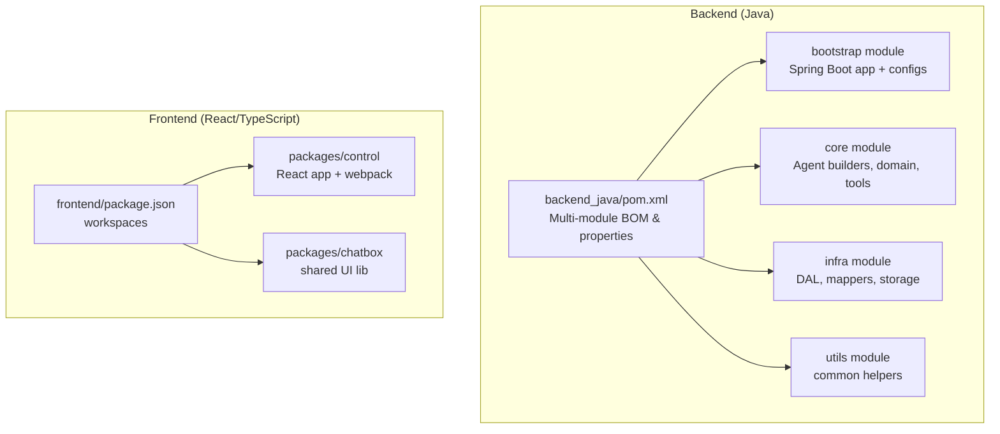
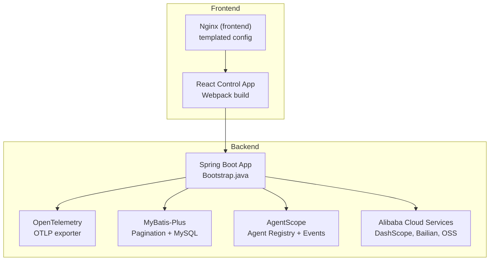
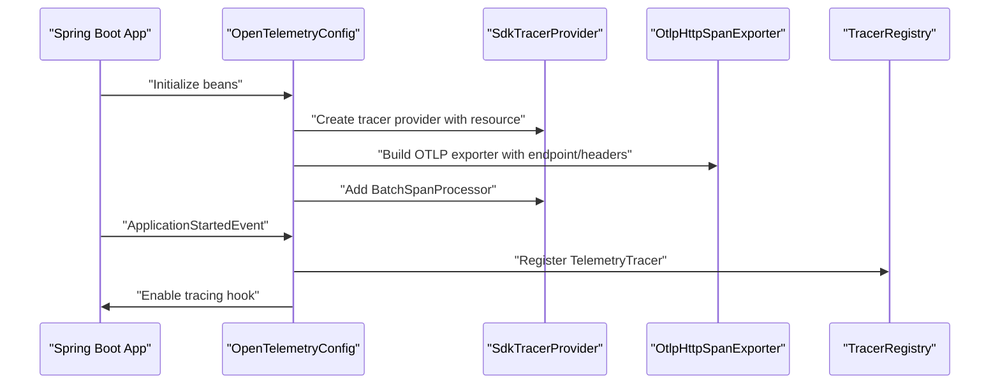
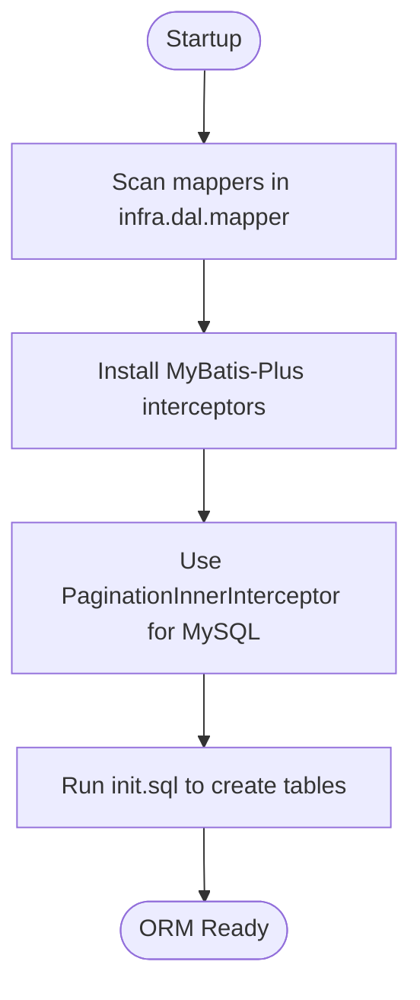
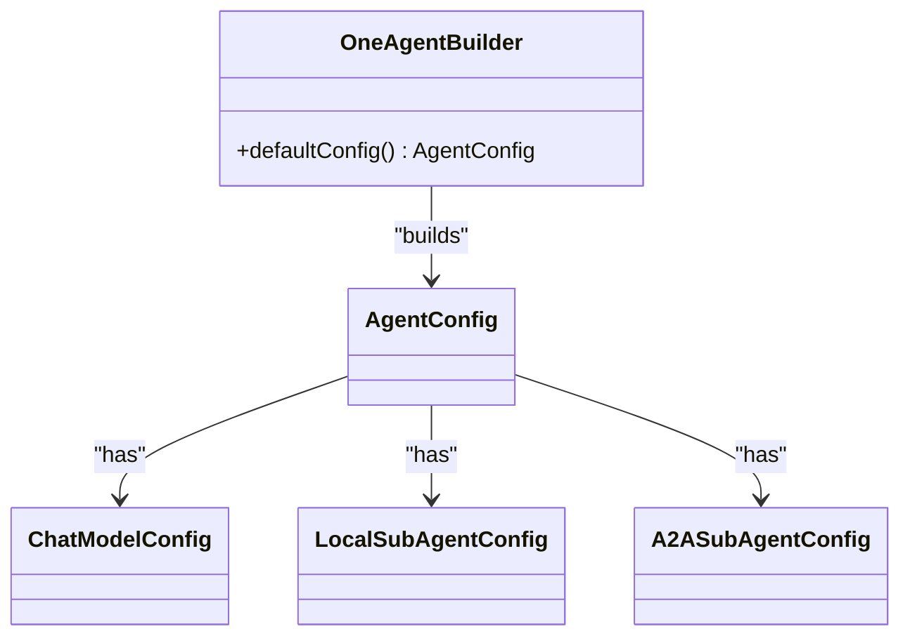
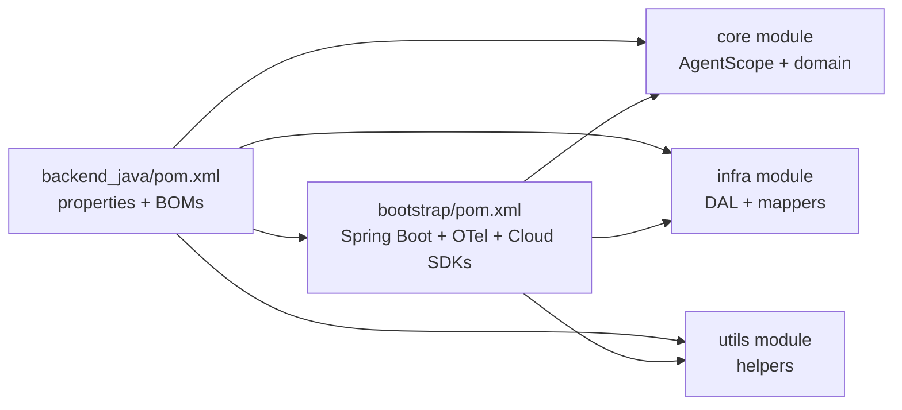

# Technology Stack

<cite>
**Referenced Files in This Document**
- [pom.xml](file://backend_java/pom.xml)
- [bootstrap/pom.xml](file://backend_java/bootstrap/pom.xml)
- [application.yaml](file://backend_java/bootstrap/src/main/resources/application.yaml)
- [OpenTelemetryConfig.java](file://backend_java/bootstrap/src/main/java/com/aliyun/tam/x/tron/config/OpenTelemetryConfig.java)
- [MybatisPlusConfig.java](file://backend_java/bootstrap/src/main/java/com/aliyun/tam/x/tron/config/MybatisPlusConfig.java)
- [Bootstrap.java](file://backend_java/bootstrap/src/main/java/com/aliyun/tam/x/tron/Bootstrap.java)
- [init.sql](file://backend_java/bootstrap/src/main/resources/schema/init.sql)
- [OneAgentBuilder.java](file://backend_java/core/src/main/java/com/aliyun/tam/x/tron/core/agents/examples/OneAgentBuilder.java)
- [Dockerfile (backend)](file://backend_java/Dockerfile)
- [package.json (frontend root)](file://frontend/package.json)
- [package.json (control app)](file://frontend/packages/control/package.json)
- [Dockerfile (frontend)](file://frontend/Dockerfile)
- [README.md (project)](file://README.md)
- [README.md (backend)](file://backend_java/README.MD)
</cite>

## Table of Contents
1. [Introduction](#introduction)
2. [Project Structure](#project-structure)
3. [Core Components](#core-components)
4. [Architecture Overview](#architecture-overview)
5. [Detailed Component Analysis](#detailed-component-analysis)
6. [Dependency Analysis](#dependency-analysis)
7. [Performance Considerations](#performance-considerations)
8. [Troubleshooting Guide](#troubleshooting-guide)
9. [Conclusion](#conclusion)
10. [Appendices](#appendices)

## Introduction
This document describes the Tron OneAgent technology stack and ecosystem. It covers backend services built on Java 17+ with Spring Boot 3.5.9, the AI agent architecture powered by AgentScope 1.0.11, data persistence via MyBatis-Plus 3.5.15 and MySQL, observability with OpenTelemetry, and integration with Alibaba Cloud services including DashScope and Bailian. It also documents the frontend React/TypeScript stack, modern build tooling, and component libraries, along with infrastructure and deployment options using Docker and cloud environments.

## Project Structure
The repository is organized into:
- backend_java: Multi-module Maven project with api, core, infra, utils, and bootstrap modules
- frontend: Yarn workspaces with packages/control (React/TypeScript) and packages/chatbox
- docs: Developer and deployment guides
- Root README and top-level Dockerfiles for backend and frontend

**Diagram sources**
- [pom.xml:1-17](file://backend_java/pom.xml#L1-L17)
- [package.json (frontend root):1-12](file://frontend/package.json#L1-L12)
- [package.json (control app):1-60](file://frontend/packages/control/package.json#L1-L60)

**Section sources**
- [pom.xml:1-17](file://backend_java/pom.xml#L1-L17)
- [package.json (frontend root):1-12](file://frontend/package.json#L1-L12)

## Core Components
- Backend runtime and framework
  - Java 17+, Spring Boot 3.5.9, Maven multi-module build
  - OpenTelemetry for observability (OTLP exporter, sampling, JDBC tracing)
  - MyBatis-Plus 3.5.15 for ORM and pagination
  - MySQL 5.7+/8.0+ with schema initialization
- AI agent architecture
  - AgentScope 1.0.11 for agent lifecycle, events, and tracing integration
  - OneAgent multi-agent orchestration with local and remote sub-agents
  - Tools registry, MCP clients, knowledge bases, and skills
- Cloud integrations
  - Alibaba Cloud DashScope SDK for model inference
  - Alibaba Cloud Bailian for retrieval/augmentation
  - OSS for file storage and CDN-backed asset serving
- Frontend stack
  - React 18, TypeScript, Ant Design 5, Webpack, ESLint, Axios, Pub/Sub, and form rendering with React JSON Schema Form
- Infrastructure and deployment
  - Docker images for backend and frontend
  - Nginx-based frontend image with templated config

**Section sources**
- [pom.xml:19-33](file://backend_java/pom.xml#L19-L33)
- [bootstrap/pom.xml:48-109](file://backend_java/bootstrap/pom.xml#L48-L109)
- [application.yaml:1-63](file://backend_java/bootstrap/src/main/resources/application.yaml#L1-L63)
- [OpenTelemetryConfig.java:105-140](file://backend_java/bootstrap/src/main/java/com/aliyun/tam/x/tron/config/OpenTelemetryConfig.java#L105-L140)
- [MybatisPlusConfig.java:27-37](file://backend_java/bootstrap/src/main/java/com/aliyun/tam/x/tron/config/MybatisPlusConfig.java#L27-L37)
- [OneAgentBuilder.java:38-76](file://backend_java/core/src/main/java/com/aliyun/tam/x/tron/core/agents/examples/OneAgentBuilder.java#L38-L76)
- [Dockerfile (backend):1-18](file://backend_java/Dockerfile#L1-L18)
- [package.json (control app):10-33](file://frontend/packages/control/package.json#L10-L33)
- [Dockerfile (frontend):1-15](file://frontend/Dockerfile#L1-L15)

## Architecture Overview
The system integrates a Spring Boot backend with AgentScope-based AI agents, persistent storage, and Alibaba Cloud services. The frontend is a React application served via Nginx. Observability is provided by OpenTelemetry exporting spans to OTLP.

**Diagram sources**
- [Bootstrap.java:25-32](file://backend_java/bootstrap/src/main/java/com/aliyun/tam/x/tron/Bootstrap.java#L25-L32)
- [OpenTelemetryConfig.java:184-188](file://backend_java/bootstrap/src/main/java/com/aliyun/tam/x/tron/config/OpenTelemetryConfig.java#L184-L188)
- [MybatisPlusConfig.java:27-37](file://backend_java/bootstrap/src/main/java/com/aliyun/tam/x/tron/config/MybatisPlusConfig.java#L27-L37)
- [application.yaml:32-51](file://backend_java/bootstrap/src/main/resources/application.yaml#L32-L51)
- [Dockerfile (frontend):1-15](file://frontend/Dockerfile#L1-L15)

## Detailed Component Analysis

### Backend Framework and Build
- Java and Spring Boot
  - Java 17 target and Maven compiler configured consistently across modules
  - Spring Boot starter web with exclusions for JSON and commons-logging alignment
- Dependency management
  - Centralized property versions for Spring Boot, AgentScope, MyBatis-Plus, Jackson BOM, OpenTelemetry, DashScope, Bailian, A2A SDK
  - BOM imports for Jackson and OpenTelemetry families
- Packaging and bootstrapping
  - Spring Boot Maven plugin repackages the bootstrap module into an executable JAR

**Section sources**
- [pom.xml:19-33](file://backend_java/pom.xml#L19-L33)
- [pom.xml:35-192](file://backend_java/pom.xml#L35-L192)
- [bootstrap/pom.xml:134-157](file://backend_java/bootstrap/pom.xml#L134-L157)
- [Bootstrap.java:25-32](file://backend_java/bootstrap/src/main/java/com/aliyun/tam/x/tron/Bootstrap.java#L25-L32)

### Observability with OpenTelemetry
- Tracer provider and exporter
  - OTLP HTTP exporter configured with endpoint and optional headers
  - Batch span processor for efficient export
- Sampling strategy
  - API-only sampler records server spans while dropping internal links
- Tracing integration
  - Servlet filter for Spring MVC tracing
  - JDBC tracing via instrumentation wrapper around DataSource
  - AgentScope tracer registration and hook enabling during application startup

**Diagram sources**
- [OpenTelemetryConfig.java:105-140](file://backend_java/bootstrap/src/main/java/com/aliyun/tam/x/tron/config/OpenTelemetryConfig.java#L105-L140)
- [OpenTelemetryConfig.java:190-225](file://backend_java/bootstrap/src/main/java/com/aliyun/tam/x/tron/config/OpenTelemetryConfig.java#L190-L225)

**Section sources**
- [OpenTelemetryConfig.java:70-90](file://backend_java/bootstrap/src/main/java/com/aliyun/tam/x/tron/config/OpenTelemetryConfig.java#L70-L90)
- [OpenTelemetryConfig.java:142-163](file://backend_java/bootstrap/src/main/java/com/aliyun/tam/x/tron/config/OpenTelemetryConfig.java#L142-L163)
- [OpenTelemetryConfig.java:195-216](file://backend_java/bootstrap/src/main/java/com/aliyun/tam/x/tron/config/OpenTelemetryConfig.java#L195-L216)

### ORM and Persistence with MyBatis-Plus
- Configuration
  - Mapper scanning for infra DAL mappers
  - Pagination interceptor configured for MySQL
- Database schema
  - Initialization script defines sequences, agents, agent_states, sessions, messages, session_events, mcp_clients, knowledge_base_configs, skill_configs, files, long_term_memory_configs, and oss_files tables

**Diagram sources**
- [MybatisPlusConfig.java:27-37](file://backend_java/bootstrap/src/main/java/com/aliyun/tam/x/tron/config/MybatisPlusConfig.java#L27-L37)
- [init.sql:15-207](file://backend_java/bootstrap/src/main/resources/schema/init.sql#L15-L207)

**Section sources**
- [MybatisPlusConfig.java:27-37](file://backend_java/bootstrap/src/main/java/com/aliyun/tam/x/tron/config/MybatisPlusConfig.java#L27-L37)
- [init.sql:15-207](file://backend_java/bootstrap/src/main/resources/schema/init.sql#L15-L207)

### AI Agent Architecture with AgentScope
- Agent builders
  - OneAgentBuilder demonstrates multi-agent orchestration with local and remote sub-agents, DashScope model configuration, and supported input types
- Agent runtime
  - AgentRegistry resolves agents, AgentHandler processes inputs, EventSink emits events, repositories persist events/messages/sessions
- Configuration
  - YAML properties for DashScope API key, Bailian credentials, OSS bucket/region/endpoint, file provider base URL, encryption key

**Diagram sources**
- [OneAgentBuilder.java:38-76](file://backend_java/core/src/main/java/com/aliyun/tam/x/tron/core/agents/examples/OneAgentBuilder.java#L38-L76)

**Section sources**
- [OneAgentBuilder.java:38-76](file://backend_java/core/src/main/java/com/aliyun/tam/x/tron/core/agents/examples/OneAgentBuilder.java#L38-L76)
- [application.yaml:32-51](file://backend_java/bootstrap/src/main/resources/application.yaml#L32-L51)

### Cloud Integrations: Alibaba Cloud DashScope and Bailian
- DashScope
  - OpenAI-compatible base URL and model selection for Qwen variants
  - API key configured via environment variable
- Bailian
  - Access key ID and secret for RAG features
- SDKs and exclusions
  - DashScope SDK Java with exclusion of a transitive dependency
  - Bailian artifact included per module dependency

**Section sources**
- [OneAgentBuilder.java:44-61](file://backend_java/core/src/main/java/com/aliyun/tam/x/tron/core/agents/examples/OneAgentBuilder.java#L44-L61)
- [pom.xml:174-184](file://backend_java/pom.xml#L174-L184)
- [bootstrap/pom.xml:105-117](file://backend_java/bootstrap/pom.xml#L105-L117)

### Frontend Technologies and Build Tools
- Workspace and apps
  - Root package.json defines workspaces for packages/*
  - Control app is the primary React/TypeScript application
- Dependencies
  - React 18, React DOM, React Router, Ant Design 5, Axios, Pub/Sub, React Markdown, KaTeX, Remark/GFM, and JSON Schema Form ecosystem
- Build and dev
  - Webpack for dev/prod builds, ESLint for linting, TypeScript, Babel presets for TS/React
- Nginx deployment
  - Frontend Docker image copies control/dist assets and uses envsubst to render nginx.conf template at runtime

**Section sources**
- [package.json (frontend root):1-12](file://frontend/package.json#L1-L12)
- [package.json (control app):10-33](file://frontend/packages/control/package.json#L10-L33)
- [package.json (control app):34-58](file://frontend/packages/control/package.json#L34-L58)
- [Dockerfile (frontend):1-15](file://frontend/Dockerfile#L1-L15)

### Infrastructure and Deployment
- Backend
  - Container base image installs Java 17, exposes 8080, copies bootstrap JAR and skills, sets timezone and environment
- Frontend
  - Nginx image with templated config; assets copied from control/dist; envsubst replaces placeholders at startup
- Environment variables
  - Database connection, DashScope API key, Alibaba Cloud credentials, OSS settings, encryption key, and file server base URL

**Section sources**
- [Dockerfile (backend):1-18](file://backend_java/Dockerfile#L1-L18)
- [Dockerfile (frontend):1-15](file://frontend/Dockerfile#L1-L15)
- [application.yaml:9-51](file://backend_java/bootstrap/src/main/resources/application.yaml#L9-L51)

## Dependency Analysis
The backend uses Maven BOMs and property-driven versions to manage major dependencies. The bootstrap module aggregates Spring Boot starters, AgentScope extensions, OpenTelemetry instrumentation, and Alibaba Cloud SDKs. The core module depends on AgentScope and related extensions, while infra and utils provide DAL and shared utilities.

**Diagram sources**
- [pom.xml:35-192](file://backend_java/pom.xml#L35-L192)
- [bootstrap/pom.xml:47-131](file://backend_java/bootstrap/pom.xml#L47-L131)

**Section sources**
- [pom.xml:35-192](file://backend_java/pom.xml#L35-L192)
- [bootstrap/pom.xml:47-131](file://backend_java/bootstrap/pom.xml#L47-L131)

## Performance Considerations
- Observability
  - OpenTelemetry batch processor reduces overhead; API-only sampler minimizes trace volume for server spans
- Database
  - Pagination interceptor improves query performance for lists; MySQL charset and connection parameters optimized for UTF-8 and multi-queries
- Frontend
  - Webpack builds optimize assets; Nginx serves static content efficiently with templated config

[No sources needed since this section provides general guidance]

## Troubleshooting Guide
- OpenTelemetry
  - Verify endpoint and headers; confirm exporter initialization and sampler behavior
  - Ensure DataSource wrapping and servlet filter are registered
- Database
  - Confirm DB host/port/name/user/password; check init.sql ran successfully
  - Validate MyBatis-Plus mapper scanning and pagination interceptor
- Cloud credentials
  - Ensure DashScope API key and Alibaba Cloud keys are set; verify OSS endpoint/region/bucket
- Frontend
  - Confirm Nginx envsubst substitution for END_POINT; verify control/dist availability

**Section sources**
- [OpenTelemetryConfig.java:120-133](file://backend_java/bootstrap/src/main/java/com/aliyun/tam/x/tron/config/OpenTelemetryConfig.java#L120-L133)
- [application.yaml:9-51](file://backend_java/bootstrap/src/main/resources/application.yaml#L9-L51)
- [init.sql:15-207](file://backend_java/bootstrap/src/main/resources/schema/init.sql#L15-L207)
- [Dockerfile (frontend):9-15](file://frontend/Dockerfile#L9-L15)

## Conclusion
Tron OneAgent combines Java 17/Spring Boot 3.5.9 with AgentScope 1.0.11 to deliver a production-ready AI agent platform. MyBatis-Plus and MySQL provide robust persistence, while OpenTelemetry ensures observability. Alibaba Cloud services integrate seamlessly for model inference, retrieval augmentation, and file storage. The React/TypeScript frontend, built with modern tooling and Ant Design, offers a rich user experience. Docker images streamline local and cloud deployments.

[No sources needed since this section summarizes without analyzing specific files]

## Appendices

### Version Compatibility and Requirements
- Java 17+ and Spring Boot 3.5.9
- AgentScope 1.0.11
- MyBatis-Plus 3.5.15
- Jackson BOM 2.21.1
- OpenTelemetry 1.60.1 with instrumentation alpha 2.26.0-alpha
- Alibaba Cloud DashScope SDK 2.22.11, Bailian 2.6.2, A2A SDK 0.3.2.Final
- MySQL 5.7+/8.0+
- Node 18+ (frontend)

**Section sources**
- [pom.xml:19-33](file://backend_java/pom.xml#L19-L33)
- [README.md (project):95-108](file://README.md#L95-L108)

### Integration Patterns with External Services
- DashScope
  - OpenAI-compatible base URL and model selection for Qwen series
- Bailian
  - Access key-based configuration for RAG features
- OSS
  - Bucket/region/endpoint plus credentials for file storage and CDN access
- OpenTelemetry
  - OTLP HTTP exporter with configurable endpoint and headers

**Section sources**
- [OneAgentBuilder.java:44-61](file://backend_java/core/src/main/java/com/aliyun/tam/x/tron/core/agents/examples/OneAgentBuilder.java#L44-L61)
- [application.yaml:32-51](file://backend_java/bootstrap/src/main/resources/application.yaml#L32-L51)
- [OpenTelemetryConfig.java:120-128](file://backend_java/bootstrap/src/main/java/com/aliyun/tam/x/tron/config/OpenTelemetryConfig.java#L120-L128)