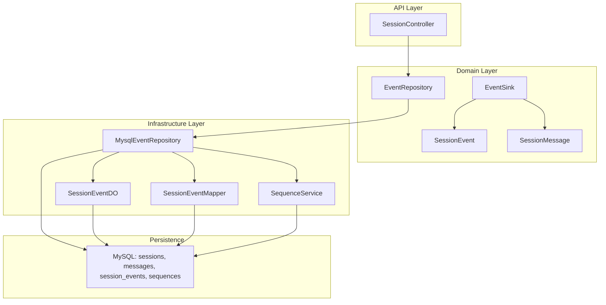
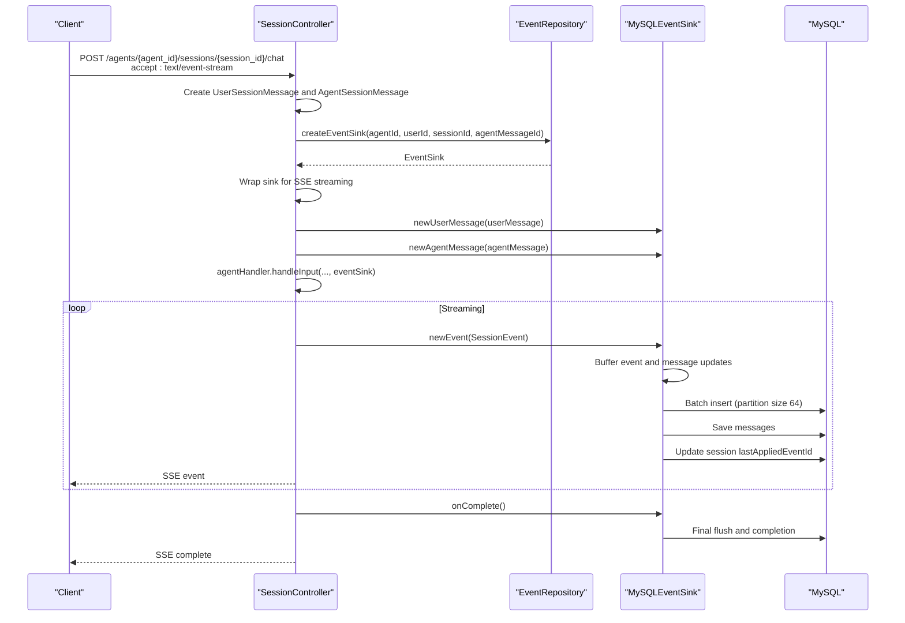
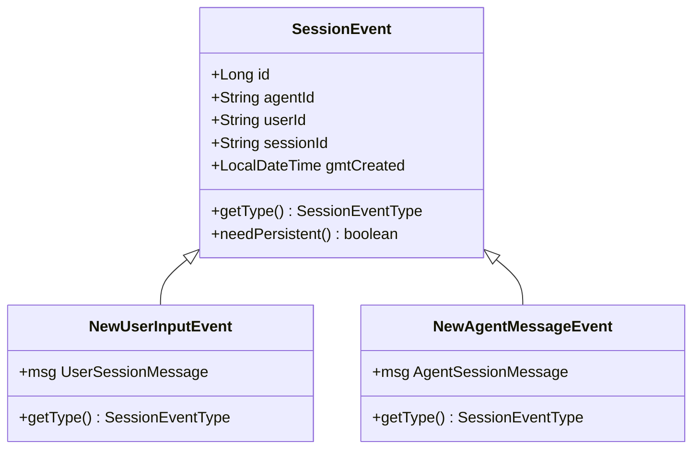
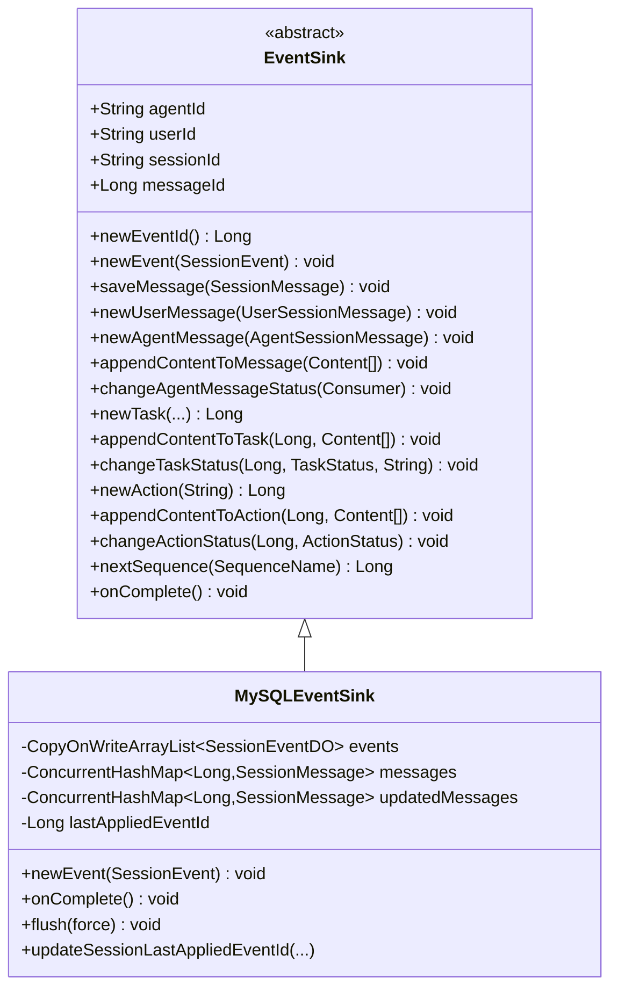
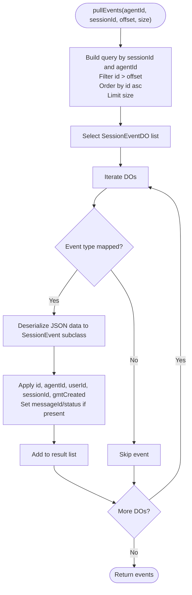
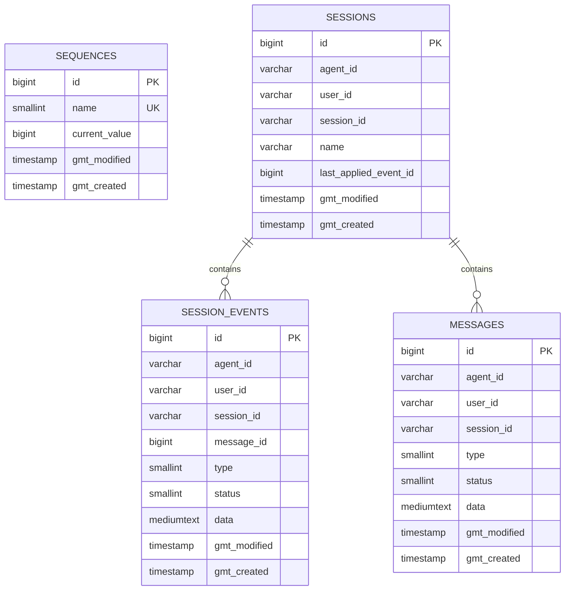
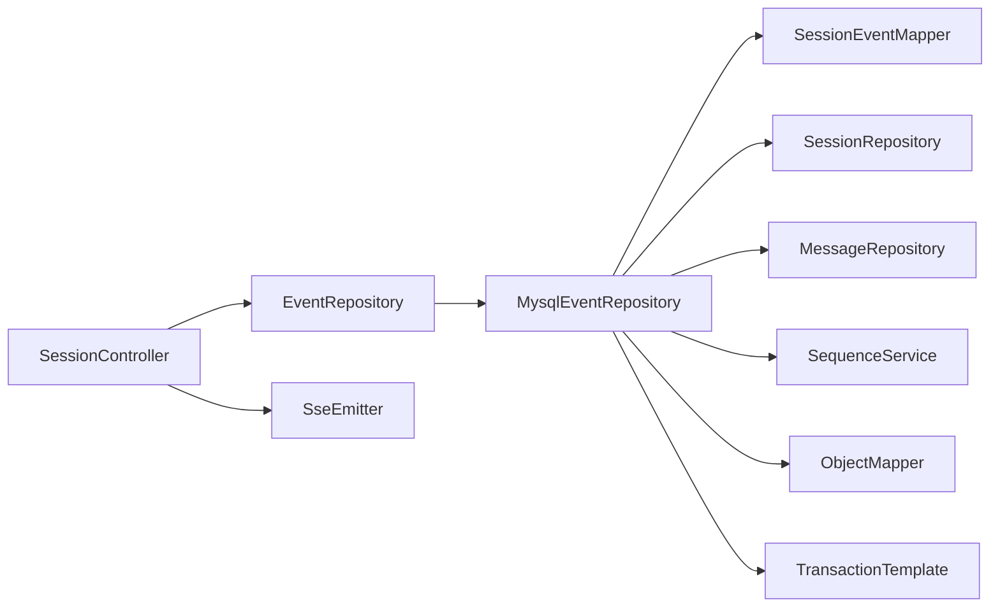

# Event Sourcing and Streaming Integration

<cite>
**Referenced Files in This Document**
- [SessionEvent.java](file://backend_java/core/src/main/java/com/aliyun/tam/x/tron/core/domain/models/events/SessionEvent.java)
- [EventSink.java](file://backend_java/core/src/main/java/com/aliyun/tam/x/tron/core/domain/models/events/EventSink.java)
- [SessionEventType.java](file://backend_java/core/src/main/java/com/aliyun/tam/x/tron/core/domain/models/events/SessionEventType.java)
- [NewUserInputEvent.java](file://backend_java/core/src/main/java/com/aliyun/tam/x/tron/core/domain/models/events/NewUserInputEvent.java)
- [NewAgentMessageEvent.java](file://backend_java/core/src/main/java/com/aliyun/tam/x/tron/core/domain/models/events/NewAgentMessageEvent.java)
- [EventRepository.java](file://backend_java/core/src/main/java/com/aliyun/tam/x/tron/core/domain/repository/EventRepository.java)
- [MysqlEventRepository.java](file://backend_java/core/src/main/java/com/aliyun/tam/x/tron/core/domain/repository/mysql/MysqlEventRepository.java)
- [SessionEventDO.java](file://backend_java/infra/src/main/java/com/aliyun/tam/x/tron/infra/dal/dataobject/SessionEventDO.java)
- [SessionEventMapper.java](file://backend_java/infra/src/main/java/com/aliyun/tam/x/tron/infra/dal/mapper/SessionEventMapper.java)
- [SequenceService.java](file://backend_java/infra/src/main/java/com/aliyun/tam/x/tron/infra/sequence/SequenceService.java)
- [SequenceDO.java](file://backend_java/infra/src/main/java/com/aliyun/tam/x/tron/infra/dal/dataobject/SequenceDO.java)
- [init.sql](file://backend_java/bootstrap/src/main/resources/schema/init.sql)
- [SessionController.java](file://backend_java/api/src/main/java/com/aliyun/tam/x/tron/api/SessionController.java)
- [SessionMessage.java](file://backend_java/core/src/main/java/com/aliyun/tam/x/tron/core/domain/models/messages/SessionMessage.java)
</cite>

## Table of Contents
1. [Introduction](#introduction)
2. [Project Structure](#project-structure)
3. [Core Components](#core-components)
4. [Architecture Overview](#architecture-overview)
5. [Detailed Component Analysis](#detailed-component-analysis)
6. [Dependency Analysis](#dependency-analysis)
7. [Performance Considerations](#performance-considerations)
8. [Troubleshooting Guide](#troubleshooting-guide)
9. [Conclusion](#conclusion)
10. [Appendices](#appendices)

## Introduction
This document explains how Tron OneAgent integrates event sourcing with streaming communication. It covers how streaming events are captured, stored, and replayed through the event sourcing architecture. It documents the SessionEvent model, EventSink interface, and EventRepository implementation, and details the integration between real-time streaming and persistent event storage, including event ID management, ordering guarantees, and state reconstruction. It also describes the database schema for event persistence, query patterns, and performance considerations, and provides practical examples of event streaming workflows, audit trails, and replay mechanisms.

## Project Structure
The event sourcing and streaming integration spans several layers:
- API layer: HTTP endpoints orchestrate sessions, messages, and streaming.
- Domain layer: Event models, sinks, and repositories define the event sourcing contract.
- Infrastructure layer: Data access objects, mappers, and sequence services implement persistence and ID allocation.
- Database: Schema supporting sessions, messages, and session events.

**Diagram sources**
- [SessionController.java:308-346](file://backend_java/api/src/main/java/com/aliyun/tam/x/tron/api/SessionController.java#L308-L346)
- [EventRepository.java:25-30](file://backend_java/core/src/main/java/com/aliyun/tam/x/tron/core/domain/repository/EventRepository.java#L25-L30)
- [MysqlEventRepository.java:55-141](file://backend_java/core/src/main/java/com/aliyun/tam/x/tron/core/domain/repository/mysql/MysqlEventRepository.java#L55-L141)
- [SessionEventDO.java:28-91](file://backend_java/infra/src/main/java/com/aliyun/tam/x/tron/infra/dal/dataobject/SessionEventDO.java#L28-L91)
- [SessionEventMapper.java:28-41](file://backend_java/infra/src/main/java/com/aliyun/tam/x/tron/infra/dal/mapper/SessionEventMapper.java#L28-L41)
- [SequenceService.java:40-177](file://backend_java/infra/src/main/java/com/aliyun/tam/x/tron/infra/sequence/SequenceService.java#L40-L177)
- [init.sql:61-110](file://backend_java/bootstrap/src/main/resources/schema/init.sql#L61-L110)

**Section sources**
- [SessionController.java:308-346](file://backend_java/api/src/main/java/com/aliyun/tam/x/tron/api/SessionController.java#L308-L346)
- [EventRepository.java:25-30](file://backend_java/core/src/main/java/com/aliyun/tam/x/tron/core/domain/repository/EventRepository.java#L25-L30)
- [MysqlEventRepository.java:55-141](file://backend_java/core/src/main/java/com/aliyun/tam/x/tron/core/domain/repository/mysql/MysqlEventRepository.java#L55-L141)
- [SessionEventDO.java:28-91](file://backend_java/infra/src/main/java/com/aliyun/tam/x/tron/infra/dal/dataobject/SessionEventDO.java#L28-L91)
- [SessionEventMapper.java:28-41](file://backend_java/infra/src/main/java/com/aliyun/tam/x/tron/infra/dal/mapper/SessionEventMapper.java#L28-L41)
- [SequenceService.java:40-177](file://backend_java/infra/src/main/java/com/aliyun/tam/x/tron/infra/sequence/SequenceService.java#L40-L177)
- [init.sql:61-110](file://backend_java/bootstrap/src/main/resources/schema/init.sql#L61-L110)

## Core Components
- SessionEvent: Base event model with identity, agent/user/session scoping, and creation timestamp. It defines whether an event needs persistent storage.
- EventSink: Abstraction for capturing events and persisting messages. Provides helpers to emit user input, agent messages, content append, status changes, tasks, and actions. Manages event ID allocation via SequenceService and batches writes to the database.
- EventRepository: Defines the contract to pull events and create an EventSink for a session.
- MysqlEventRepository: Implements EventRepository with a MySQL-backed EventSink that:
  - Serializes events to JSON and stores them in session_events.
  - Maintains in-memory caches for messages and updated messages.
  - Flushes events in batches (partition size 64) and updates session last applied event ID.
  - Applies event handlers to reconstruct message state in real time.
- SessionEventDO and SessionEventMapper: Data object and MyBatis mapper for batch insertion into session_events.
- SequenceService: Generates globally ordered IDs for events and other entities, with database-backed segments and formatted timestamps.

**Section sources**
- [SessionEvent.java:27-50](file://backend_java/core/src/main/java/com/aliyun/tam/x/tron/core/domain/models/events/SessionEvent.java#L27-L50)
- [EventSink.java:36-265](file://backend_java/core/src/main/java/com/aliyun/tam/x/tron/core/domain/models/events/EventSink.java#L36-L265)
- [EventRepository.java:25-30](file://backend_java/core/src/main/java/com/aliyun/tam/x/tron/core/domain/repository/EventRepository.java#L25-L30)
- [MysqlEventRepository.java:55-421](file://backend_java/core/src/main/java/com/aliyun/tam/x/tron/core/domain/repository/mysql/MysqlEventRepository.java#L55-L421)
- [SessionEventDO.java:28-91](file://backend_java/infra/src/main/java/com/aliyun/tam/x/tron/infra/dal/dataobject/SessionEventDO.java#L28-L91)
- [SessionEventMapper.java:28-41](file://backend_java/infra/src/main/java/com/aliyun/tam/x/tron/infra/dal/mapper/SessionEventMapper.java#L28-L41)
- [SequenceService.java:40-177](file://backend_java/infra/src/main/java/com/aliyun/tam/x/tron/infra/sequence/SequenceService.java#L40-L177)

## Architecture Overview
The system combines real-time streaming (SSE) with event sourcing:
- Clients initiate a chat session and optionally subscribe to a Server-Sent Events stream.
- The controller creates user and agent messages, then obtains an EventSink from the EventRepository.
- The EventSink wraps the underlying sink to stream events to clients while buffering and batching persistence.
- On completion, the EventSink flushes buffered writes and updates the session’s last applied event ID.

**Diagram sources**
- [SessionController.java:308-346](file://backend_java/api/src/main/java/com/aliyun/tam/x/tron/api/SessionController.java#L308-L346)
- [MysqlEventRepository.java:138-141](file://backend_java/core/src/main/java/com/aliyun/tam/x/tron/core/domain/repository/mysql/MysqlEventRepository.java#L138-L141)
- [MysqlEventRepository.java:206-287](file://backend_java/core/src/main/java/com/aliyun/tam/x/tron/core/domain/repository/mysql/MysqlEventRepository.java#L206-L287)
- [SessionEventMapper.java:34-40](file://backend_java/infra/src/main/java/com/aliyun/tam/x/tron/infra/dal/mapper/SessionEventMapper.java#L34-L40)

**Section sources**
- [SessionController.java:308-346](file://backend_java/api/src/main/java/com/aliyun/tam/x/tron/api/SessionController.java#L308-L346)
- [MysqlEventRepository.java:138-141](file://backend_java/core/src/main/java/com/aliyun/tam/x/tron/core/domain/repository/mysql/MysqlEventRepository.java#L138-L141)
- [MysqlEventRepository.java:206-287](file://backend_java/core/src/main/java/com/aliyun/tam/x/tron/core/domain/repository/mysql/MysqlEventRepository.java#L206-L287)
- [SessionEventMapper.java:34-40](file://backend_java/infra/src/main/java/com/aliyun/tam/x/tron/infra/dal/mapper/SessionEventMapper.java#L34-L40)

## Detailed Component Analysis

### SessionEvent Model
- Identity: Each event carries a Long id scoped by agentId, userId, and sessionId.
- Lifecycle: needPersistent() indicates whether the event should be persisted; defaults to true.
- Extensibility: Concrete event types include user input, agent message lifecycle, content append, and task/action lifecycle.

**Diagram sources**
- [SessionEvent.java:27-50](file://backend_java/core/src/main/java/com/aliyun/tam/x/tron/core/domain/models/events/SessionEvent.java#L27-L50)
- [NewUserInputEvent.java:27-42](file://backend_java/core/src/main/java/com/aliyun/tam/x/tron/core/domain/models/events/NewUserInputEvent.java#L27-L42)
- [NewAgentMessageEvent.java:27-42](file://backend_java/core/src/main/java/com/aliyun/tam/x/tron/core/domain/models/events/NewAgentMessageEvent.java#L27-L42)

**Section sources**
- [SessionEvent.java:27-50](file://backend_java/core/src/main/java/com/aliyun/tam/x/tron/core/domain/models/events/SessionEvent.java#L27-L50)
- [NewUserInputEvent.java:27-42](file://backend_java/core/src/main/java/com/aliyun/tam/x/tron/core/domain/models/events/NewUserInputEvent.java#L27-L42)
- [NewAgentMessageEvent.java:27-42](file://backend_java/core/src/main/java/com/aliyun/tam/x/tron/core/domain/models/events/NewAgentMessageEvent.java#L27-L42)

### EventSink Interface and MySQL Implementation
- Responsibilities:
  - Allocate event IDs via SequenceService.
  - Emit high-level events (user input, agent message, content append, status changes, tasks, actions).
  - Persist events and messages in batches and maintain message state in memory.
  - Update session last applied event ID.
- MySQLEventSink specifics:
  - Buffers events and messages; flushes periodically or on completion.
  - Partitions buffered events into groups of 64 for batch insert.
  - Applies event-specific handlers to mutate message state in memory and persist changes.
  - Updates session lastAppliedEventId atomically.

**Diagram sources**
- [EventSink.java:36-265](file://backend_java/core/src/main/java/com/aliyun/tam/x/tron/core/domain/models/events/EventSink.java#L36-L265)
- [MysqlEventRepository.java:143-419](file://backend_java/core/src/main/java/com/aliyun/tam/x/tron/core/domain/repository/mysql/MysqlEventRepository.java#L143-L419)

**Section sources**
- [EventSink.java:36-265](file://backend_java/core/src/main/java/com/aliyun/tam/x/tron/core/domain/models/events/EventSink.java#L36-L265)
- [MysqlEventRepository.java:143-419](file://backend_java/core/src/main/java/com/aliyun/tam/x/tron/core/domain/repository/mysql/MysqlEventRepository.java#L143-L419)

### EventRepository and Pull Events
- Contract:
  - pullEvents(agentId, sessionId, offset, size): retrieves ordered events after a given offset.
  - createEventSink(...): returns an EventSink bound to a session.
- MySQL implementation:
  - Uses a typed map from SessionEventType to SessionEvent subclass.
  - Deserializes JSON data into strongly-typed events.
  - Applies messageId/status fields where applicable.
  - Orders by id ascending and limits results.

**Diagram sources**
- [MysqlEventRepository.java:87-136](file://backend_java/core/src/main/java/com/aliyun/tam/x/tron/core/domain/repository/mysql/MysqlEventRepository.java#L87-L136)

**Section sources**
- [EventRepository.java:25-30](file://backend_java/core/src/main/java/com/aliyun/tam/x/tron/core/domain/repository/EventRepository.java#L25-L30)
- [MysqlEventRepository.java:87-136](file://backend_java/core/src/main/java/com/aliyun/tam/x/tron/core/domain/repository/mysql/MysqlEventRepository.java#L87-L136)

### Database Schema for Event Persistence
- sequences: Stores named sequence segments for generating IDs.
- sessions: Per-agent, per-user session records with lastAppliedEventId.
- messages: Typed message records keyed by id.
- session_events: Event records keyed by id with foreign keys to agent/user/session/message and JSON payload.

**Diagram sources**
- [init.sql:17-110](file://backend_java/bootstrap/src/main/resources/schema/init.sql#L17-L110)
- [SessionEventDO.java:28-91](file://backend_java/infra/src/main/java/com/aliyun/tam/x/tron/infra/dal/dataobject/SessionEventDO.java#L28-L91)

**Section sources**
- [init.sql:61-110](file://backend_java/bootstrap/src/main/resources/schema/init.sql#L61-L110)
- [SessionEventDO.java:28-91](file://backend_java/infra/src/main/java/com/aliyun/tam/x/tron/infra/dal/dataobject/SessionEventDO.java#L28-L91)

### Event ID Management and Ordering Guarantees
- Event IDs are generated via SequenceService with:
  - Named sequences (EVENT, MESSAGE, TASK, ACTION, etc.).
  - Database-backed segments with FOR UPDATE locking.
  - Formatted timestamp prefix to ensure global ordering within a rolling window.
- Ordering guarantees:
  - Events are persisted with monotonically increasing ids.
  - Retrieval orders by id ascending.
  - Session maintains lastAppliedEventId to support efficient incremental reads.

**Section sources**
- [SequenceService.java:40-177](file://backend_java/infra/src/main/java/com/aliyun/tam/x/tron/infra/sequence/SequenceService.java#L40-L177)
- [SequenceDO.java:28-61](file://backend_java/infra/src/main/java/com/aliyun/tam/x/tron/infra/dal/dataobject/SequenceDO.java#L28-L61)
- [MysqlEventRepository.java:165-199](file://backend_java/core/src/main/java/com/aliyun/tam/x/tron/core/domain/repository/mysql/MysqlEventRepository.java#L165-L199)
- [init.sql:61-76](file://backend_java/bootstrap/src/main/resources/schema/init.sql#L61-L76)

### State Reconstruction and Real-Time Updates
- MySQLEventSink applies event handlers to reconstruct message state in memory:
  - Append content to agent messages.
  - Update status, error message, usage, and finish timestamps.
  - Manage tasks and actions within agent messages.
- Messages are saved to the database upon creation or updates, and flushed in batches.

**Section sources**
- [MysqlEventRepository.java:289-395](file://backend_java/core/src/main/java/com/aliyun/tam/x/tron/core/domain/repository/mysql/MysqlEventRepository.java#L289-L395)
- [SessionMessage.java:30-60](file://backend_java/core/src/main/java/com/aliyun/tam/x/tron/core/domain/models/messages/SessionMessage.java#L30-L60)

### Streaming Integration and Replay Mechanisms
- Streaming:
  - Controller detects accept: text/event-stream and returns an SSE channel.
  - EventSink wrapper forwards events to SSE until completion.
- Replay:
  - Clients can call GET /agents/{agent_id}/sessions/{session_id}/events with offset and size to retrieve ordered events for replay or audit.

**Section sources**
- [SessionController.java:332-346](file://backend_java/api/src/main/java/com/aliyun/tam/x/tron/api/SessionController.java#L332-L346)
- [SessionController.java:280-306](file://backend_java/api/src/main/java/com/aliyun/tam/x/tron/api/SessionController.java#L280-L306)
- [MysqlEventRepository.java:87-136](file://backend_java/core/src/main/java/com/aliyun/tam/x/tron/core/domain/repository/mysql/MysqlEventRepository.java#L87-L136)

## Dependency Analysis
- EventRepository depends on:
  - SessionEventMapper for batch inserts.
  - SessionRepository for updating lastAppliedEventId.
  - MessageRepository for message persistence.
  - SequenceService for event IDs.
- EventSink implementations depend on:
  - ObjectMapper for JSON serialization.
  - TransactionTemplate for atomic flushes.
- SessionController depends on:
  - AgentRegistry and AgentHandler for processing.
  - EventRepository for event capture.
  - SseEmitter for streaming.

**Diagram sources**
- [SessionController.java:84-114](file://backend_java/api/src/main/java/com/aliyun/tam/x/tron/api/SessionController.java#L84-L114)
- [MysqlEventRepository.java:57-73](file://backend_java/core/src/main/java/com/aliyun/tam/x/tron/core/domain/repository/mysql/MysqlEventRepository.java#L57-L73)
- [SessionEventMapper.java:28-41](file://backend_java/infra/src/main/java/com/aliyun/tam/x/tron/infra/dal/mapper/SessionEventMapper.java#L28-L41)

**Section sources**
- [SessionController.java:84-114](file://backend_java/api/src/main/java/com/aliyun/tam/x/tron/api/SessionController.java#L84-L114)
- [MysqlEventRepository.java:57-73](file://backend_java/core/src/main/java/com/aliyun/tam/x/tron/core/domain/repository/mysql/MysqlEventRepository.java#L57-L73)
- [SessionEventMapper.java:28-41](file://backend_java/infra/src/main/java/com/aliyun/tam/x/tron/infra/dal/mapper/SessionEventMapper.java#L28-L41)

## Performance Considerations
- Batching: Events are inserted in partitions of 64 to reduce round-trips.
- Throttled flush: A minimum interval prevents excessive writes; flush occurs on completion.
- Memory caching: In-memory message maps minimize repeated lookups and enable immediate state updates.
- Indexing: session_events idx_session_id accelerates retrieval by session and agent.
- Serialization cost: JSON serialization occurs per event; consider compact binary formats if throughput demands.
- Concurrency: CopyOnWriteArrayList and ConcurrentHashMap ensure thread-safe buffering and updates.

[No sources needed since this section provides general guidance]

## Troubleshooting Guide
- SSE errors:
  - If SseEmitter is closed or throws exceptions, the controller logs warnings and cancels the agent handler to prevent orphaned operations.
- Event persistence failures:
  - Exceptions during batch insert are logged; ensure session_events schema matches SessionEventDO and indexes are intact.
- Sequence exhaustion:
  - If SequenceService fails to allocate a sequence after retries, verify sequences table integrity and current_value increments.
- Replay anomalies:
  - If offsets appear inconsistent, confirm lastAppliedEventId is updated after flush and that pullEvents filters by id > offset.

**Section sources**
- [SessionController.java:424-436](file://backend_java/api/src/main/java/com/aliyun/tam/x/tron/api/SessionController.java#L424-L436)
- [MysqlEventRepository.java:182-188](file://backend_java/core/src/main/java/com/aliyun/tam/x/tron/core/domain/repository/mysql/MysqlEventRepository.java#L182-L188)
- [SequenceService.java:104-122](file://backend_java/infra/src/main/java/com/aliyun/tam/x/tron/infra/sequence/SequenceService.java#L104-L122)

## Conclusion
Tron OneAgent’s event sourcing and streaming integration provides a robust foundation for real-time conversational experiences with durable auditability. Events are captured in real time, streamed to clients, and persisted efficiently with strong ordering guarantees. The design supports scalable replay, flexible filtering, and incremental state reconstruction, enabling both real-time and historical access patterns.

[No sources needed since this section summarizes without analyzing specific files]

## Appendices

### Practical Examples

- Real-time streaming workflow
  - Client initiates chat with accept: text/event-stream.
  - Controller creates user and agent messages, obtains an EventSink, and streams events to the client.
  - Agent emits events (e.g., content append, status changes), which are persisted in batches and reflected in the SSE stream.
  - On completion, the sink flushes and completes the SSE channel.

- Audit trail generation
  - Retrieve ordered events for a session using GET /agents/{agent_id}/sessions/{session_id}/events with offset and size.
  - Use the returned events to reconstruct the conversation history and monitor agent behavior.

- Replay mechanism
  - Use lastAppliedEventId from sessions to resume incremental fetching.
  - For full replay, start from offset 0 and iterate with increasing sizes until reaching the end.

[No sources needed since this section provides general guidance]