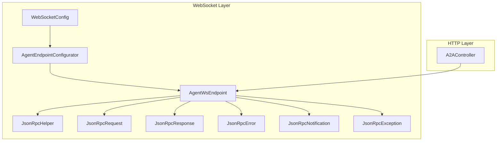
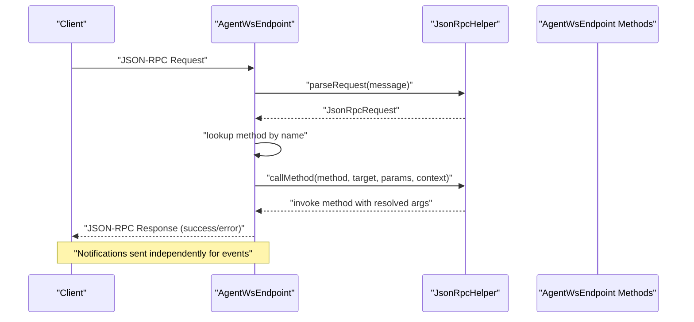
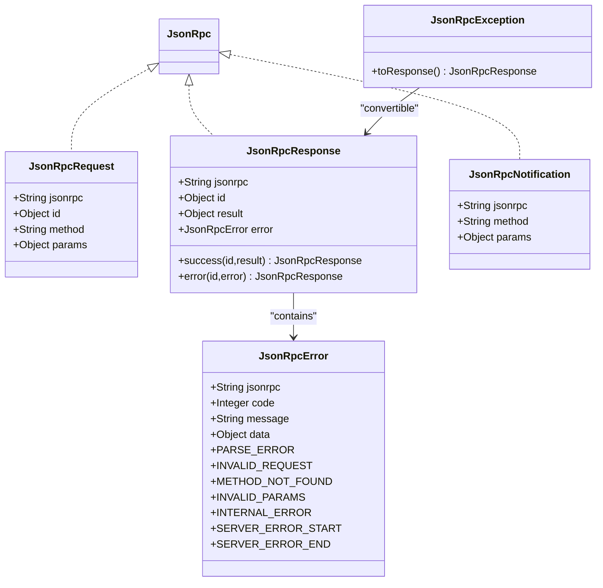
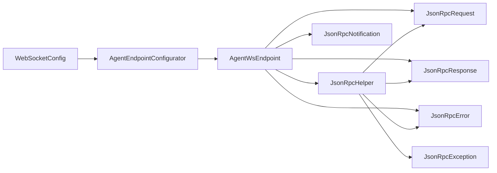

# JSON-RPC Protocol

<cite>
**Referenced Files in This Document**
- [JsonRpc.java](file://backend_java/api/src/main/java/com/aliyun/tam/x/tron/ws/jsonrpc/JsonRpc.java)
- [JsonRpcRequest.java](file://backend_java/api/src/main/java/com/aliyun/tam/x/tron/ws/jsonrpc/JsonRpcRequest.java)
- [JsonRpcResponse.java](file://backend_java/api/src/main/java/com/aliyun/tam/x/tron/ws/jsonrpc/JsonRpcResponse.java)
- [JsonRpcError.java](file://backend_java/api/src/main/java/com/aliyun/tam/x/tron/ws/jsonrpc/JsonRpcError.java)
- [JsonRpcNotification.java](file://backend_java/api/src/main/java/com/aliyun/tam/x/tron/ws/jsonrpc/JsonRpcNotification.java)
- [JsonRpcException.java](file://backend_java/api/src/main/java/com/aliyun/tam/x/tron/ws/jsonrpc/JsonRpcException.java)
- [JsonRpcHelper.java](file://backend_java/api/src/main/java/com/aliyun/tam/x/tron/ws/jsonrpc/JsonRpcHelper.java)
- [AgentWsEndpoint.java](file://backend_java/api/src/main/java/com/aliyun/tam/x/tron/ws/AgentWsEndpoint.java)
- [AgentEndpointConfigurator.java](file://backend_java/api/src/main/java/com/aliyun/tam/x/tron/ws/AgentEndpointConfigurator.java)
- [WebSocketConfig.java](file://backend_java/bootstrap/src/main/java/com/aliyun/tam/x/tron/config/WebSocketConfig.java)
- [A2AController.java](file://backend_java/api/src/main/java/com/aliyun/tam/x/tron/api/A2AController.java)
</cite>

## Table of Contents
1. [Introduction](#introduction)
2. [Project Structure](#project-structure)
3. [Core Components](#core-components)
4. [Architecture Overview](#architecture-overview)
5. [Detailed Component Analysis](#detailed-component-analysis)
6. [Dependency Analysis](#dependency-analysis)
7. [Performance Considerations](#performance-considerations)
8. [Troubleshooting Guide](#troubleshooting-guide)
9. [Conclusion](#conclusion)
10. [Appendices](#appendices)

## Introduction
This document describes the JSON-RPC protocol implementation used by Tron OneAgent for agent-to-agent communication. It covers the JSON-RPC specification adherence, request/response format, error handling, and the integration with WebSocket endpoints. It also documents the JsonRpcHelper utility functions, message validation, protocol compliance, request routing, response formatting, and practical examples of method invocation, parameter serialization, and error propagation. Finally, it addresses protocol versioning, backward compatibility, debugging techniques, security considerations, and performance optimization strategies for high-frequency RPC calls.

## Project Structure
The JSON-RPC implementation resides primarily under the WebSocket module and integrates with the A2A HTTP transport. The key elements are:
- JSON-RPC data transfer objects and exceptions under ws/jsonrpc
- WebSocket endpoint that parses requests, routes to handlers, and sends notifications and responses
- WebSocket configuration and endpoint configurator for handshake and injection
- A2A HTTP controller that wraps the A2A framework’s JSON-RPC transport

**Diagram sources**
- [AgentWsEndpoint.java:64-136](file://backend_java/api/src/main/java/com/aliyun/tam/x/tron/ws/AgentWsEndpoint.java#L64-L136)
- [JsonRpcHelper.java:38-101](file://backend_java/api/src/main/java/com/aliyun/tam/x/tron/ws/jsonrpc/JsonRpcHelper.java#L38-L101)
- [JsonRpcRequest.java:25-35](file://backend_java/api/src/main/java/com/aliyun/tam/x/tron/ws/jsonrpc/JsonRpcRequest.java#L25-L35)
- [JsonRpcResponse.java:25-42](file://backend_java/api/src/main/java/com/aliyun/tam/x/tron/ws/jsonrpc/JsonRpcResponse.java#L25-L42)
- [JsonRpcError.java:25-44](file://backend_java/api/src/main/java/com/aliyun/tam/x/tron/ws/jsonrpc/JsonRpcError.java#L25-L44)
- [JsonRpcNotification.java:25-32](file://backend_java/api/src/main/java/com/aliyun/tam/x/tron/ws/jsonrpc/JsonRpcNotification.java#L25-L32)
- [JsonRpcException.java:22-61](file://backend_java/api/src/main/java/com/aliyun/tam/x/tron/ws/jsonrpc/JsonRpcException.java#L22-L61)
- [WebSocketConfig.java:26-35](file://backend_java/bootstrap/src/main/java/com/aliyun/tam/x/tron/config/WebSocketConfig.java#L26-L35)
- [AgentEndpointConfigurator.java:31-55](file://backend_java/api/src/main/java/com/aliyun/tam/x/tron/ws/AgentEndpointConfigurator.java#L31-L55)
- [A2AController.java:107-128](file://backend_java/api/src/main/java/com/aliyun/tam/x/tron/api/A2AController.java#L107-L128)

**Section sources**
- [AgentWsEndpoint.java:64-136](file://backend_java/api/src/main/java/com/aliyun/tam/x/tron/ws/AgentWsEndpoint.java#L64-L136)
- [WebSocketConfig.java:26-35](file://backend_java/bootstrap/src/main/java/com/aliyun/tam/x/tron/config/WebSocketConfig.java#L26-L35)
- [AgentEndpointConfigurator.java:31-55](file://backend_java/api/src/main/java/com/aliyun/tam/x/tron/ws/AgentEndpointConfigurator.java#L31-L55)
- [A2AController.java:107-128](file://backend_java/api/src/main/java/com/aliyun/tam/x/tron/api/A2AController.java#L107-L128)

## Core Components
- JsonRpc: marker interface for JSON-RPC payload types.
- JsonRpcRequest: request envelope with jsonrpc version, id, method, and optional params.
- JsonRpcResponse: response envelope with jsonrpc version, id, and either result or error.
- JsonRpcNotification: fire-and-forget notification with jsonrpc version, method, and optional params.
- JsonRpcError: standardized error envelope with code, message, and optional data.
- JsonRpcException: runtime exception carrying id, code, message, and optional data; convertible to JsonRpcResponse.
- JsonRpcHelper: parsing, serialization, and reflection-based method dispatch utility.

Key protocol compliance:
- Enforces jsonrpc version "2.0".
- Validates presence and type of id (string or number).
- Validates method presence and params type (array/object or null).
- Provides helper methods to serialize/deserialize and to call annotated methods with parameter binding.

**Section sources**
- [JsonRpc.java:19-20](file://backend_java/api/src/main/java/com/aliyun/tam/x/tron/ws/jsonrpc/JsonRpc.java#L19-L20)
- [JsonRpcRequest.java:25-35](file://backend_java/api/src/main/java/com/aliyun/tam/x/tron/ws/jsonrpc/JsonRpcRequest.java#L25-L35)
- [JsonRpcResponse.java:25-42](file://backend_java/api/src/main/java/com/aliyun/tam/x/tron/ws/jsonrpc/JsonRpcResponse.java#L25-L42)
- [JsonRpcNotification.java:25-32](file://backend_java/api/src/main/java/com/aliyun/tam/x/tron/ws/jsonrpc/JsonRpcNotification.java#L25-L32)
- [JsonRpcError.java:25-44](file://backend_java/api/src/main/java/com/aliyun/tam/x/tron/ws/jsonrpc/JsonRpcError.java#L25-L44)
- [JsonRpcException.java:22-61](file://backend_java/api/src/main/java/com/aliyun/tam/x/tron/ws/jsonrpc/JsonRpcException.java#L22-L61)
- [JsonRpcHelper.java:38-101](file://backend_java/api/src/main/java/com/aliyun/tam/x/tron/ws/jsonrpc/JsonRpcHelper.java#L38-L101)

## Architecture Overview
The system supports two transports:
- WebSocket transport for real-time agent-to-agent messaging with notifications and responses.
- HTTP transport via A2AController for agent-to-agent requests over JSON-RPC.

**Diagram sources**
- [AgentWsEndpoint.java:222-261](file://backend_java/api/src/main/java/com/aliyun/tam/x/tron/ws/AgentWsEndpoint.java#L222-L261)
- [JsonRpcHelper.java:103-136](file://backend_java/api/src/main/java/com/aliyun/tam/x/tron/ws/jsonrpc/JsonRpcHelper.java#L103-L136)
- [JsonRpcResponse.java:28-34](file://backend_java/api/src/main/java/com/aliyun/tam/x/tron/ws/jsonrpc/JsonRpcResponse.java#L28-L34)

## Detailed Component Analysis

### JSON-RPC Data Model
The data model adheres to JSON-RPC 2.0 with explicit fields for version, id, method, params, result, and error.

**Diagram sources**
- [JsonRpcRequest.java:25-35](file://backend_java/api/src/main/java/com/aliyun/tam/x/tron/ws/jsonrpc/JsonRpcRequest.java#L25-L35)
- [JsonRpcResponse.java:25-42](file://backend_java/api/src/main/java/com/aliyun/tam/x/tron/ws/jsonrpc/JsonRpcResponse.java#L25-L42)
- [JsonRpcNotification.java:25-32](file://backend_java/api/src/main/java/com/aliyun/tam/x/tron/ws/jsonrpc/JsonRpcNotification.java#L25-L32)
- [JsonRpcError.java:25-44](file://backend_java/api/src/main/java/com/aliyun/tam/x/tron/ws/jsonrpc/JsonRpcError.java#L25-L44)
- [JsonRpcException.java:22-61](file://backend_java/api/src/main/java/com/aliyun/tam/x/tron/ws/jsonrpc/JsonRpcException.java#L22-L61)

**Section sources**
- [JsonRpcRequest.java:25-35](file://backend_java/api/src/main/java/com/aliyun/tam/x/tron/ws/jsonrpc/JsonRpcRequest.java#L25-L35)
- [JsonRpcResponse.java:25-42](file://backend_java/api/src/main/java/com/aliyun/tam/x/tron/ws/jsonrpc/JsonRpcResponse.java#L25-L42)
- [JsonRpcNotification.java:25-32](file://backend_java/api/src/main/java/com/aliyun/tam/x/tron/ws/jsonrpc/JsonRpcNotification.java#L25-L32)
- [JsonRpcError.java:25-44](file://backend_java/api/src/main/java/com/aliyun/tam/x/tron/ws/jsonrpc/JsonRpcError.java#L25-L44)
- [JsonRpcException.java:22-61](file://backend_java/api/src/main/java/com/aliyun/tam/x/tron/ws/jsonrpc/JsonRpcException.java#L22-L61)

### JsonRpcHelper Utility Functions
Responsibilities:
- Parse incoming JSON text into JsonRpcRequest with strict validation.
- Serialize JsonRpc envelopes to JSON text.
- Reflectively resolve and invoke handler methods with parameter binding from context and params (positional or named).
- Convert serialization errors into JsonRpcResponse with internal error code.

Validation rules enforced:
- jsonrpc field must equal "2.0".
- id must be present and of type string or number.
- method must be present.
- params must be object/array/null.

Parameter resolution:
- Uses @RequestParam annotations to map parameter names.
- Supports positional lists and named maps.
- Converts values to target types using ObjectMapper.

Serialization:
- On serialization failure, attempts to produce a JsonRpcResponse.error carrying an internal error.

**Section sources**
- [JsonRpcHelper.java:45-80](file://backend_java/api/src/main/java/com/aliyun/tam/x/tron/ws/jsonrpc/JsonRpcHelper.java#L45-L80)
- [JsonRpcHelper.java:82-101](file://backend_java/api/src/main/java/com/aliyun/tam/x/tron/ws/jsonrpc/JsonRpcHelper.java#L82-L101)
- [JsonRpcHelper.java:103-136](file://backend_java/api/src/main/java/com/aliyun/tam/x/tron/ws/jsonrpc/JsonRpcHelper.java#L103-L136)
- [JsonRpcHelper.java:138-161](file://backend_java/api/src/main/java/com/aliyun/tam/x/tron/ws/jsonrpc/JsonRpcHelper.java#L138-L161)

### WebSocket Endpoint: AgentWsEndpoint
- Exposes a WebSocket endpoint for agent sessions.
- Validates headers (X-User-Id and optional X-User-Name) and loads the agent handler.
- Sends a session snapshot and ongoing event notifications.
- Parses JSON-RPC requests, routes to registered methods, and returns responses.
- Handles method-not-found and internal errors with proper JsonRpcResponse payloads.
- Supports TTS callbacks via wrapped event sink.

Request lifecycle:
- onOpen: load agent, initialize session, send snapshot.
- onMessage: parse request, route to method, serialize result.
- onNotification: stream events and TTS updates as notifications.
- onClose/onError: cleanup and persistence.

Concurrency:
- Uses a bounded thread pool for chat processing and event streaming.

**Section sources**
- [AgentWsEndpoint.java:116-136](file://backend_java/api/src/main/java/com/aliyun/tam/x/tron/ws/AgentWsEndpoint.java#L116-L136)
- [AgentWsEndpoint.java:138-176](file://backend_java/api/src/main/java/com/aliyun/tam/x/tron/ws/AgentWsEndpoint.java#L138-L176)
- [AgentWsEndpoint.java:222-261](file://backend_java/api/src/main/java/com/aliyun/tam/x/tron/ws/AgentWsEndpoint.java#L222-L261)
- [AgentWsEndpoint.java:277-332](file://backend_java/api/src/main/java/com/aliyun/tam/x/tron/ws/AgentWsEndpoint.java#L277-L332)
- [AgentWsEndpoint.java:334-442](file://backend_java/api/src/main/java/com/aliyun/tam/x/tron/ws/AgentWsEndpoint.java#L334-L442)
- [AgentWsEndpoint.java:444-447](file://backend_java/api/src/main/java/com/aliyun/tam/x/tron/ws/AgentWsEndpoint.java#L444-L447)
- [AgentWsEndpoint.java:449-456](file://backend_java/api/src/main/java/com/aliyun/tam/x/tron/ws/AgentWsEndpoint.java#L449-L456)
- [AgentWsEndpoint.java:458-505](file://backend_java/api/src/main/java/com/aliyun/tam/x/tron/ws/AgentWsEndpoint.java#L458-L505)
- [AgentWsEndpoint.java:524-526](file://backend_java/api/src/main/java/com/aliyun/tam/x/tron/ws/AgentWsEndpoint.java#L524-L526)

### WebSocket Configuration and Endpoint Configurator
- WebSocketConfig exposes a ServerEndpointExporter bean for servlet environments.
- AgentEndpointConfigurator captures handshake headers and parameters into user properties for downstream retrieval.

**Section sources**
- [WebSocketConfig.java:26-35](file://backend_java/bootstrap/src/main/java/com/aliyun/tam/x/tron/config/WebSocketConfig.java#L26-L35)
- [AgentEndpointConfigurator.java:31-55](file://backend_java/api/src/main/java/com/aliyun/tam/x/tron/ws/AgentEndpointConfigurator.java#L31-L55)

### A2A HTTP Transport
- A2AController exposes a JSON-RPC endpoint for agent-to-agent calls over HTTP.
- Wraps the A2A framework’s JSON-RPC transport with a JsonRpcTransportWrapper.
- Builds an AgentExecutor that creates user and agent messages, streams events, and enqueues final agent response parts.

**Section sources**
- [A2AController.java:107-128](file://backend_java/api/src/main/java/com/aliyun/tam/x/tron/api/A2AController.java#L107-L128)
- [A2AController.java:130-216](file://backend_java/api/src/main/java/com/aliyun/tam/x/tron/api/A2AController.java#L130-L216)
- [A2AController.java:224-239](file://backend_java/api/src/main/java/com/aliyun/tam/x/tron/api/A2AController.java#L224-L239)

### Practical Examples

- Method invocation and parameter serialization
  - Example: chat method receives a structured request object and returns a message identifier.
  - Parameter binding: method parameters can be annotated with @RequestParam and resolved from either a named map or positional list.

- Error propagation
  - Validation failures produce JsonRpcResponse.error with appropriate codes.
  - Exceptions thrown inside handlers propagate as JsonRpcException and are converted to JsonRpcResponse.error.

- Notification delivery
  - Events and TTS updates are sent as JsonRpcNotification with method names and payload objects.

- Serialization and deserialization
  - Requests are parsed into JsonRpcRequest and responses are serialized back to JSON text.

**Section sources**
- [AgentWsEndpoint.java:277-332](file://backend_java/api/src/main/java/com/aliyun/tam/x/tron/ws/AgentWsEndpoint.java#L277-L332)
- [AgentWsEndpoint.java:334-442](file://backend_java/api/src/main/java/com/aliyun/tam/x/tron/ws/AgentWsEndpoint.java#L334-L442)
- [JsonRpcHelper.java:45-80](file://backend_java/api/src/main/java/com/aliyun/tam/x/tron/ws/jsonrpc/JsonRpcHelper.java#L45-L80)
- [JsonRpcHelper.java:82-101](file://backend_java/api/src/main/java/com/aliyun/tam/x/tron/ws/jsonrpc/JsonRpcHelper.java#L82-L101)
- [JsonRpcException.java:54-60](file://backend_java/api/src/main/java/com/aliyun/tam/x/tron/ws/jsonrpc/JsonRpcException.java#L54-L60)

## Dependency Analysis
- AgentWsEndpoint depends on JsonRpcHelper for parsing and serialization, and on domain repositories for session/message/event persistence.
- JsonRpcHelper depends on Jackson ObjectMapper for JSON conversion and Spring’s RequestParam annotations for parameter binding.
- WebSocketConfig and AgentEndpointConfigurator integrate the endpoint into the Spring container and expose it via ServerEndpointExporter.

**Diagram sources**
- [AgentWsEndpoint.java:74-78](file://backend_java/api/src/main/java/com/aliyun/tam/x/tron/ws/AgentWsEndpoint.java#L74-L78)
- [JsonRpcHelper.java:43-43](file://backend_java/api/src/main/java/com/aliyun/tam/x/tron/ws/jsonrpc/JsonRpcHelper.java#L43-L43)
- [WebSocketConfig.java:33-34](file://backend_java/bootstrap/src/main/java/com/aliyun/tam/x/tron/config/WebSocketConfig.java#L33-L34)
- [AgentEndpointConfigurator.java:48-50](file://backend_java/api/src/main/java/com/aliyun/tam/x/tron/ws/AgentEndpointConfigurator.java#L48-L50)

**Section sources**
- [AgentWsEndpoint.java:74-78](file://backend_java/api/src/main/java/com/aliyun/tam/x/tron/ws/AgentWsEndpoint.java#L74-L78)
- [JsonRpcHelper.java:43-43](file://backend_java/api/src/main/java/com/aliyun/tam/x/tron/ws/jsonrpc/JsonRpcHelper.java#L43-L43)
- [WebSocketConfig.java:33-34](file://backend_java/bootstrap/src/main/java/com/aliyun/tam/x/tron/config/WebSocketConfig.java#L33-L34)
- [AgentEndpointConfigurator.java:48-50](file://backend_java/api/src/main/java/com/aliyun/tam/x/tron/ws/AgentEndpointConfigurator.java#L48-L50)

## Performance Considerations
- Concurrency: A thread pool executor is used for chat processing and event streaming to avoid blocking the WebSocket I/O thread.
- Batching and polling: Event streaming uses periodic polling with small batches to balance responsiveness and overhead.
- Serialization cost: Prefer compact JSON and reuse ObjectMapper instances (already injected).
- Backpressure: The thread pool queue is bounded; consider tuning capacity and rejection policy for bursty workloads.
- Payload size: Limit notification payload sizes; consider compressing or paginating large event sequences.

[No sources needed since this section provides general guidance]

## Troubleshooting Guide
Common issues and diagnostics:
- Parse errors: Occur when id is missing/invalid, jsonrpc version mismatch, or method/params malformed. These raise JsonRpcException with PARSE_ERROR.
- Method not found: When the requested method name is not registered, responds with METHOD_NOT_FOUND.
- Internal errors: Unhandled exceptions during method invocation yield INTERNAL_ERROR responses.
- Serialization errors: Failures to serialize responses trigger fallback error responses.
- WebSocket connectivity: Errors are logged and the session is closed; inspect logs around onMessage and notification sending.

Debugging tips:
- Enable debug logging for the WebSocket endpoint and JSON-RPC helper.
- Inspect request id and method name in onMessage logs.
- Verify header injection for user identity in onOpen.
- Monitor thread pool saturation and adjust pool size if needed.

**Section sources**
- [JsonRpcHelper.java:45-80](file://backend_java/api/src/main/java/com/aliyun/tam/x/tron/ws/jsonrpc/JsonRpcHelper.java#L45-L80)
- [AgentWsEndpoint.java:222-261](file://backend_java/api/src/main/java/com/aliyun/tam/x/tron/ws/AgentWsEndpoint.java#L222-L261)
- [AgentWsEndpoint.java:271-275](file://backend_java/api/src/main/java/com/aliyun/tam/x/tron/ws/AgentWsEndpoint.java#L271-L275)

## Conclusion
The JSON-RPC implementation in Tron OneAgent provides a robust, spec-compliant foundation for agent-to-agent communication over both WebSocket and HTTP transports. JsonRpcHelper centralizes validation, serialization, and method dispatch, while AgentWsEndpoint orchestrates session lifecycle, notifications, and responses. The design emphasizes protocol correctness, error transparency, and extensibility for future enhancements.

[No sources needed since this section summarizes without analyzing specific files]

## Appendices

### JSON-RPC Specification Adherence
- Version: jsonrpc is "2.0" in all envelopes.
- Request: requires id and method; params may be object/array/null.
- Response: includes id and either result or error.
- Error codes: standardized codes for parse, invalid request, method not found, invalid params, and internal errors.

**Section sources**
- [JsonRpcRequest.java:26](file://backend_java/api/src/main/java/com/aliyun/tam/x/tron/ws/jsonrpc/JsonRpcRequest.java#L26)
- [JsonRpcResponse.java:26](file://backend_java/api/src/main/java/com/aliyun/tam/x/tron/ws/jsonrpc/JsonRpcResponse.java#L26)
- [JsonRpcNotification.java:26](file://backend_java/api/src/main/java/com/aliyun/tam/x/tron/ws/jsonrpc/JsonRpcNotification.java#L26)
- [JsonRpcError.java:35](file://backend_java/api/src/main/java/com/aliyun/tam/x/tron/ws/jsonrpc/JsonRpcError.java#L35)
- [JsonRpcError.java:26-33](file://backend_java/api/src/main/java/com/aliyun/tam/x/tron/ws/jsonrpc/JsonRpcError.java#L26-L33)

### Security Considerations
- Authentication and authorization: Enforce identity via headers (X-User-Id) and validate access to sessions.
- Input validation: Strict parsing prevents malformed requests; ensure downstream handlers validate business inputs.
- Transport security: Use TLS for WebSocket and HTTP endpoints.
- Rate limiting: Consider applying rate limits at the endpoint level to mitigate abuse.

[No sources needed since this section provides general guidance]