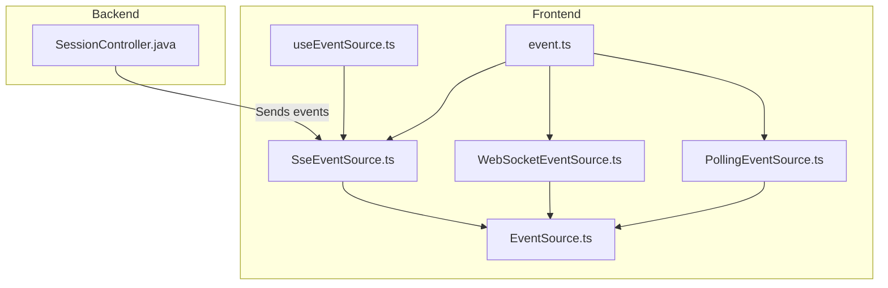
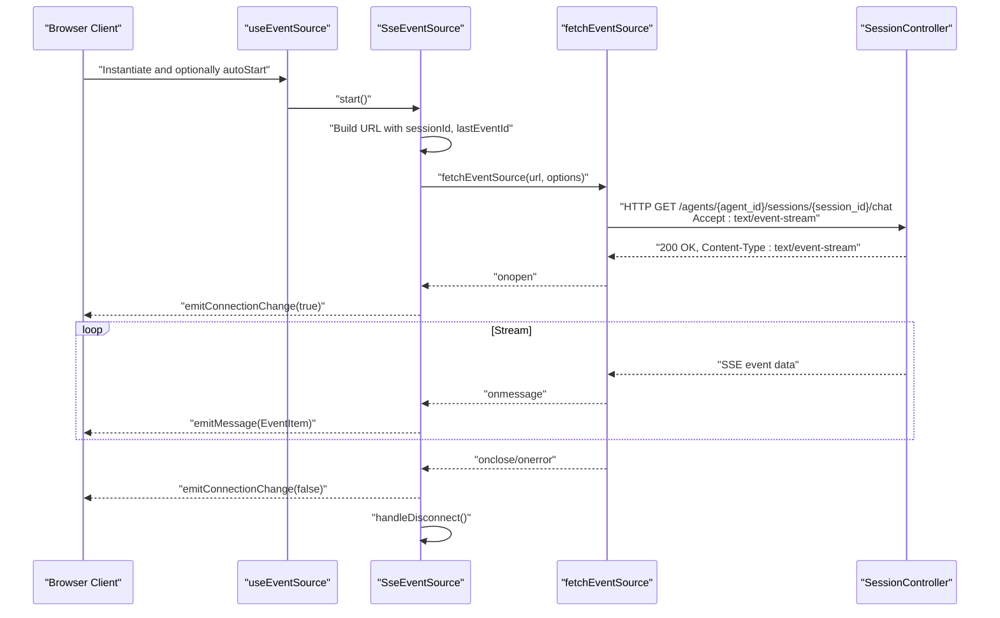
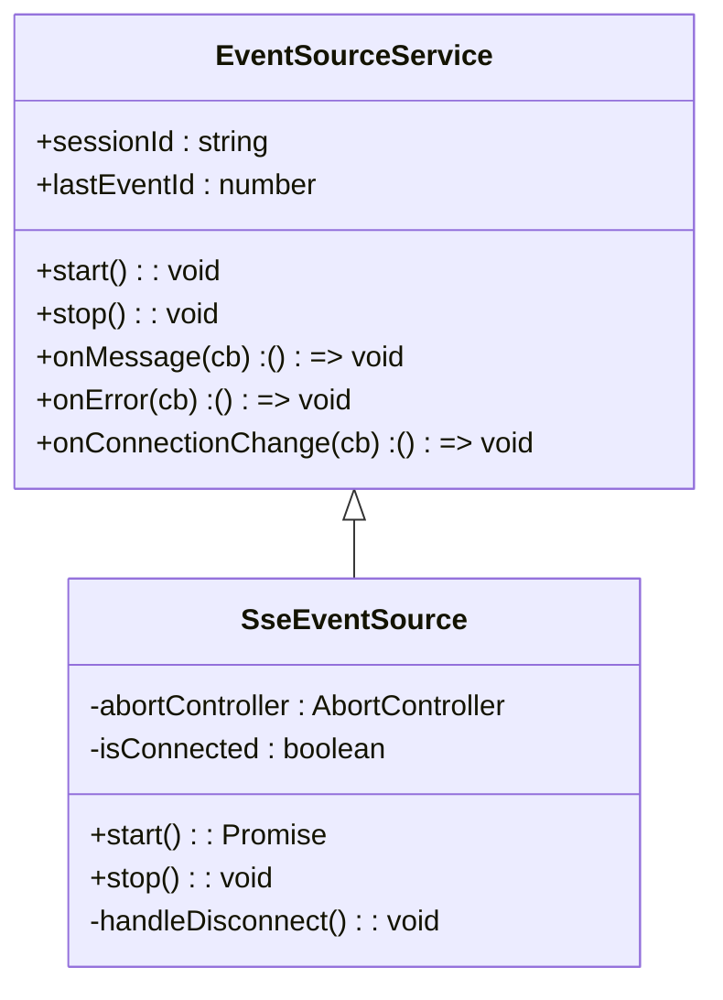
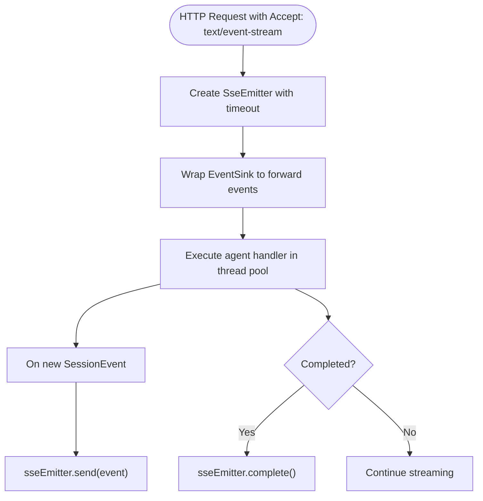
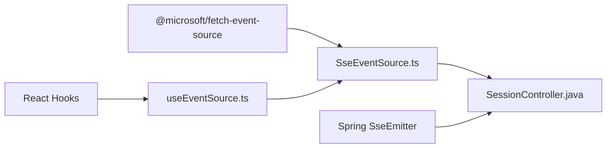

# Server-Sent Events (SSE)

<cite>
**Referenced Files in This Document**
- [SseEventSource.ts](file://frontend/packages/chatbox/eventSource/SseEventSource.ts)
- [EventSource.ts](file://frontend/packages/chatbox/eventSource/EventSource.ts)
- [useEventSource.ts](file://frontend/packages/chatbox/hooks/useEventSource.ts)
- [event.ts](file://frontend/packages/chatbox/types/event.ts)
- [WebSocketEventSource.ts](file://frontend/packages/chatbox/eventSource/WebSocketEventSource.ts)
- [PollingEventSource.ts](file://frontend/packages/chatbox/eventSource/PollingEventSource.ts)
- [SessionController.java](file://backend_java/api/src/main/java/com/aliyun/tam/x/tron/api/SessionController.java)
- [package.json](file://frontend/packages/chatbox/package.json)
- [package.json](file://frontend/package.json)
</cite>

## Table of Contents
1. [Introduction](#introduction)
2. [Project Structure](#project-structure)
3. [Core Components](#core-components)
4. [Architecture Overview](#architecture-overview)
5. [Detailed Component Analysis](#detailed-component-analysis)
6. [Dependency Analysis](#dependency-analysis)
7. [Performance Considerations](#performance-considerations)
8. [Troubleshooting Guide](#troubleshooting-guide)
9. [Conclusion](#conclusion)
10. [Appendices](#appendices)

## Introduction
This document describes the Server-Sent Events (SSE) implementation in Tron OneAgent’s frontend and backend. It focuses on the SseEventSource class, the fetchEventSource library integration, URL building strategies using sessionId and lastEventId, event parsing, connection lifecycle management, and error handling. It also covers client-side usage via a React hook, server-side SSE emission in Java, and practical guidance for browser compatibility, fallbacks, and debugging.

## Project Structure
The SSE implementation spans the frontend React packages and the backend Java API:
- Frontend: eventSource abstractions and concrete SSE implementation, plus a React hook to manage lifecycle.
- Backend: Spring MVC controller that emits Server-Sent Events to clients.

**Diagram sources**
- [useEventSource.ts:1-59](file://frontend/packages/chatbox/hooks/useEventSource.ts#L1-L59)
- [EventSource.ts:1-90](file://frontend/packages/chatbox/eventSource/EventSource.ts#L1-L90)
- [SseEventSource.ts:1-118](file://frontend/packages/chatbox/eventSource/SseEventSource.ts#L1-L118)
- [WebSocketEventSource.ts:1-135](file://frontend/packages/chatbox/eventSource/WebSocketEventSource.ts#L1-L135)
- [PollingEventSource.ts:1-45](file://frontend/packages/chatbox/eventSource/PollingEventSource.ts#L1-L45)
- [event.ts:1-116](file://frontend/packages/chatbox/types/event.ts#L1-L116)
- [SessionController.java:308-346](file://backend_java/api/src/main/java/com/aliyun/tam/x/tron/api/SessionController.java#L308-L346)

**Section sources**
- [useEventSource.ts:1-59](file://frontend/packages/chatbox/hooks/useEventSource.ts#L1-L59)
- [EventSource.ts:1-90](file://frontend/packages/chatbox/eventSource/EventSource.ts#L1-L90)
- [SseEventSource.ts:1-118](file://frontend/packages/chatbox/eventSource/SseEventSource.ts#L1-L118)
- [WebSocketEventSource.ts:1-135](file://frontend/packages/chatbox/eventSource/WebSocketEventSource.ts#L1-L135)
- [PollingEventSource.ts:1-45](file://frontend/packages/chatbox/eventSource/PollingEventSource.ts#L1-L45)
- [event.ts:1-116](file://frontend/packages/chatbox/types/event.ts#L1-L116)
- [SessionController.java:308-346](file://backend_java/api/src/main/java/com/aliyun/tam/x/tron/api/SessionController.java#L308-L346)

## Core Components
- EventSourceService: Abstract base class defining the event source contract, listener registration, and shared state (sessionId, lastEventId).
- SseEventSource: Concrete SSE implementation using the fetchEventSource library, URL building, connection state, and event parsing.
- useEventSource: React hook to instantiate and manage an EventSourceService lifecycle.
- Event types: Strongly typed event union representing session and task-related updates.

Key responsibilities:
- URL construction with sessionId and lastEventId for resuming streams.
- Parsing of streamed JSON events into strongly typed EventItem instances.
- Emitting connection change, message, and error events to listeners.
- Graceful shutdown via AbortController and cleanup.

**Section sources**
- [EventSource.ts:23-90](file://frontend/packages/chatbox/eventSource/EventSource.ts#L23-L90)
- [SseEventSource.ts:28-118](file://frontend/packages/chatbox/eventSource/SseEventSource.ts#L28-L118)
- [useEventSource.ts:27-59](file://frontend/packages/chatbox/hooks/useEventSource.ts#L27-L59)
- [event.ts:106-116](file://frontend/packages/chatbox/types/event.ts#L106-L116)

## Architecture Overview
The frontend establishes an SSE stream using fetchEventSource, while the backend uses Spring’s SseEmitter to push events. The client parses incoming events and maintains a monotonic lastEventId for resuming after interruptions.

**Diagram sources**
- [useEventSource.ts:27-59](file://frontend/packages/chatbox/hooks/useEventSource.ts#L27-L59)
- [SseEventSource.ts:36-101](file://frontend/packages/chatbox/eventSource/SseEventSource.ts#L36-L101)
- [SessionController.java:332-346](file://backend_java/api/src/main/java/com/aliyun/tam/x/tron/api/SessionController.java#L332-L346)

## Detailed Component Analysis

### SseEventSource: SSE Client Implementation
- URL building: Uses a provided urlBuilder function with sessionId and lastEventId to resume the event stream.
- Connection lifecycle: Tracks isConnected state and emits connectionChange(true/false) on open/close/error.
- Event parsing: Parses event.data as JSON and forwards strongly typed EventItem instances.
- Error handling: Emits errors (except AbortError) and ensures handleDisconnect is called; stop() cancels via AbortController.
- Headers: Optional headers can be supplied for authentication or custom routing.

**Diagram sources**
- [EventSource.ts:23-90](file://frontend/packages/chatbox/eventSource/EventSource.ts#L23-L90)
- [SseEventSource.ts:28-118](file://frontend/packages/chatbox/eventSource/SseEventSource.ts#L28-L118)

**Section sources**
- [SseEventSource.ts:23-118](file://frontend/packages/chatbox/eventSource/SseEventSource.ts#L23-L118)

### EventSourceService: Base Abstraction
- Manages three listener arrays: message, error, and connectionChange.
- Provides getters/setters for sessionId and lastEventId.
- Emits events to registered listeners and exposes a destroy flag for lifecycle control.

**Section sources**
- [EventSource.ts:23-90](file://frontend/packages/chatbox/eventSource/EventSource.ts#L23-L90)

### useEventSource: React Lifecycle Management
- Memoizes the EventSourceService instance based on dependencies.
- Supports autoStart option to immediately start the service.
- Cleans up by stopping the service on unmount.

**Section sources**
- [useEventSource.ts:27-59](file://frontend/packages/chatbox/hooks/useEventSource.ts#L27-L59)

### Event Types: Strong Typing for SSE Payloads
- EventItem unions cover session name changes, user input, agent messages, content append events, and status changes for tasks and actions.
- Ensures robust parsing and downstream handling.

**Section sources**
- [event.ts:106-116](file://frontend/packages/chatbox/types/event.ts#L106-L116)

### Backend SSE Emission: SessionController
- Accepts requests with Accept: text/event-stream to enable SSE.
- Creates an SseEmitter with a long timeout and delegates chat execution to a thread pool.
- Wraps the event sink to forward SessionEvent instances to the client via sseEmitter.send.
- Handles completion and error paths, including TTS responses.

**Diagram sources**
- [SessionController.java:332-346](file://backend_java/api/src/main/java/com/aliyun/tam/x/tron/api/SessionController.java#L332-L346)
- [SessionController.java:411-535](file://backend_java/api/src/main/java/com/aliyun/tam/x/tron/api/SessionController.java#L411-L535)

**Section sources**
- [SessionController.java:332-346](file://backend_java/api/src/main/java/com/aliyun/tam/x/tron/api/SessionController.java#L332-L346)
- [SessionController.java:411-535](file://backend_java/api/src/main/java/com/aliyun/tam/x/tron/api/SessionController.java#L411-L535)

### Alternative Implementations
- WebSocketEventSource: Provides a WebSocket-based alternative with manual reconnection scheduling and protocol support.
- PollingEventSource: Offers a polling fallback with configurable intervals.

These are useful for environments where SSE is unavailable or unreliable.

**Section sources**
- [WebSocketEventSource.ts:22-135](file://frontend/packages/chatbox/eventSource/WebSocketEventSource.ts#L22-L135)
- [PollingEventSource.ts:22-45](file://frontend/packages/chatbox/eventSource/PollingEventSource.ts#L22-L45)

## Dependency Analysis
- Frontend dependencies:
  - @microsoft/fetch-event-source powers the SSE client.
  - React hooks manage lifecycle and subscriptions.
- Backend dependencies:
  - Spring MVC SseEmitter for server-sent streaming.
  - Jackson for JSON serialization/deserialization.
  - Thread pool executor for asynchronous chat processing.

**Diagram sources**
- [SseEventSource.ts:19-21](file://frontend/packages/chatbox/eventSource/SseEventSource.ts#L19-L21)
- [useEventSource.ts:19-20](file://frontend/packages/chatbox/hooks/useEventSource.ts#L19-L20)
- [SessionController.java:64-64](file://backend_java/api/src/main/java/com/aliyun/tam/x/tron/api/SessionController.java#L64-L64)

**Section sources**
- [SseEventSource.ts:19-21](file://frontend/packages/chatbox/eventSource/SseEventSource.ts#L19-L21)
- [useEventSource.ts:19-20](file://frontend/packages/chatbox/hooks/useEventSource.ts#L19-L20)
- [SessionController.java:64-64](file://backend_java/api/src/main/java/com/aliyun/tam/x/tron/api/SessionController.java#L64-L64)

## Performance Considerations
- Use lastEventId to minimize replay and reduce load on both client and server.
- Keep event payloads compact; avoid large attachments in hot paths.
- Tune browser fetchEventSource openWhenHidden to maintain streams during tab visibility changes.
- On the backend, use a bounded thread pool and appropriate timeouts to prevent resource exhaustion.
- Consider batching frequent small events on the server to reduce overhead.

## Troubleshooting Guide
Common issues and remedies:
- Connection fails with non-SSE content-type:
  - Verify Accept header is set to text/event-stream on the request.
  - Confirm server responds with Content-Type: text/event-stream.
- Frequent disconnects:
  - Check network stability and server-side timeouts.
  - Ensure lastEventId is persisted and passed to urlBuilder.
- Parser errors:
  - Validate that server sends properly formatted JSON for each event.
  - Inspect event.data payload shape against EventItem union.
- Aborted connections:
  - Stop() uses AbortController; ensure stop is called on cleanup.
- Backend exceptions:
  - Review exception handlers and ensure sseEmitter.completeWithError is invoked on failures.

**Section sources**
- [SseEventSource.ts:57-70](file://frontend/packages/chatbox/eventSource/SseEventSource.ts#L57-L70)
- [SseEventSource.ts:84-90](file://frontend/packages/chatbox/eventSource/SseEventSource.ts#L84-L90)
- [SessionController.java:116-130](file://backend_java/api/src/main/java/com/aliyun/tam/x/tron/api/SessionController.java#L116-L130)

## Conclusion
The Tron OneAgent SSE implementation combines a robust frontend SseEventSource built on fetchEventSource with a Spring-backed server that emits events via SseEmitter. The design emphasizes resilient connection management, typed event parsing, and clean lifecycle control. Complementary WebSocket and polling implementations provide fallback strategies for diverse environments.

## Appendices

### Practical Examples

- SSE endpoint configuration (client):
  - Provide a urlBuilder that appends sessionId and lastEventId to the base SSE endpoint.
  - Optionally supply headers for authentication or routing.
  - Instantiate SseEventSource via useEventSource with autoStart enabled if desired.

- Client-side event handling:
  - Register onMessage to process EventItem updates.
  - Register onError to capture and surface errors.
  - Register onConnectionChange to reflect connectivity state.

- Backend SSE endpoint:
  - Ensure Accept: text/event-stream is present.
  - Use SseEmitter to send SessionEvent instances.
  - Complete the stream on termination and handle errors gracefully.

**Section sources**
- [SseEventSource.ts:23-26](file://frontend/packages/chatbox/eventSource/SseEventSource.ts#L23-L26)
- [useEventSource.ts:22-31](file://frontend/packages/chatbox/hooks/useEventSource.ts#L22-L31)
- [SessionController.java:332-346](file://backend_java/api/src/main/java/com/aliyun/tam/x/tron/api/SessionController.java#L332-L346)

### Browser Compatibility and Fallbacks
- Modern browsers support SSE; older browsers may require polyfills or fallbacks.
- Use WebSocketEventSource or PollingEventSource as alternatives when SSE is unavailable.
- For mobile or background tabs, rely on openWhenHidden behavior and monitor onclose/onerror.

**Section sources**
- [SseEventSource.ts:55-55](file://frontend/packages/chatbox/eventSource/SseEventSource.ts#L55-L55)
- [WebSocketEventSource.ts:22-27](file://frontend/packages/chatbox/eventSource/WebSocketEventSource.ts#L22-L27)
- [PollingEventSource.ts:22-28](file://frontend/packages/chatbox/eventSource/PollingEventSource.ts#L22-L28)