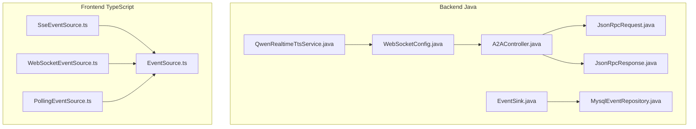
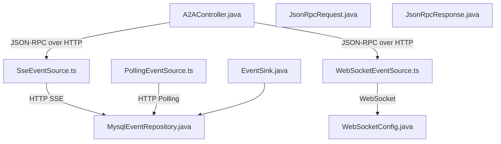
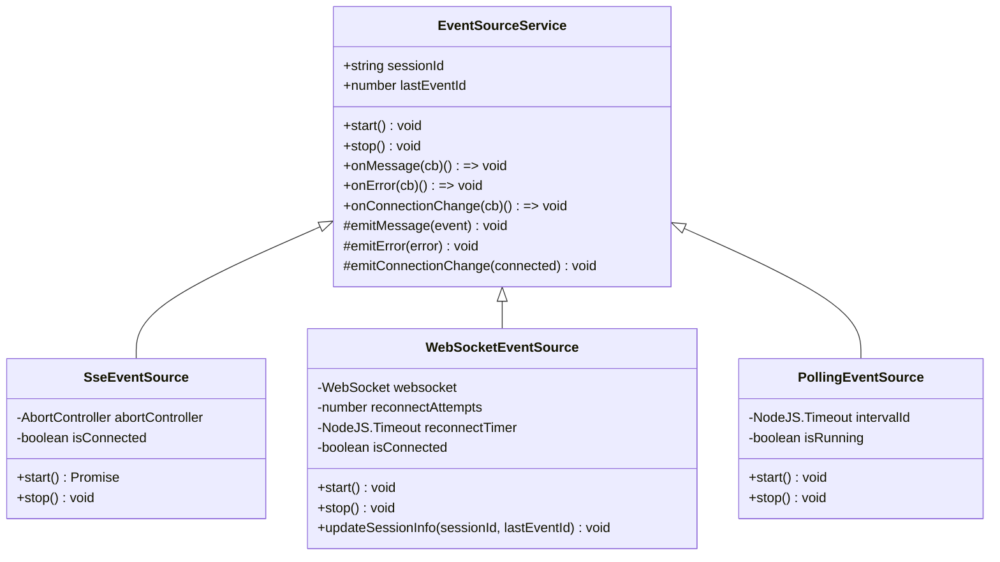
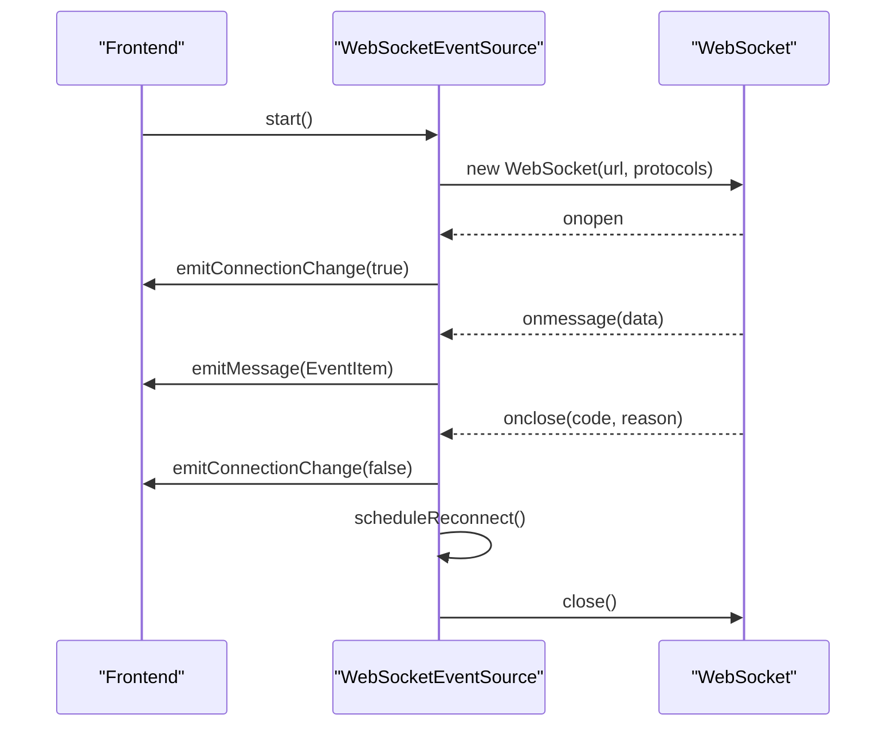
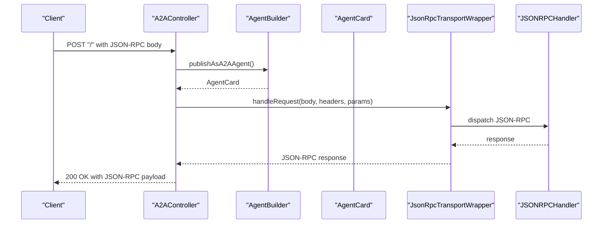
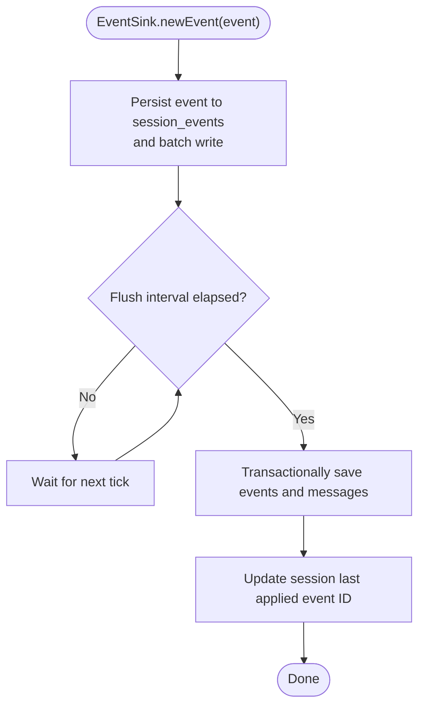
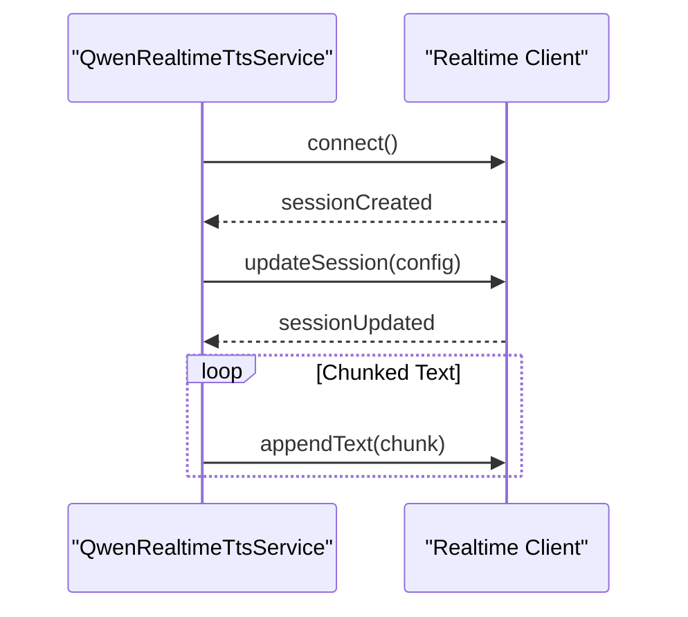
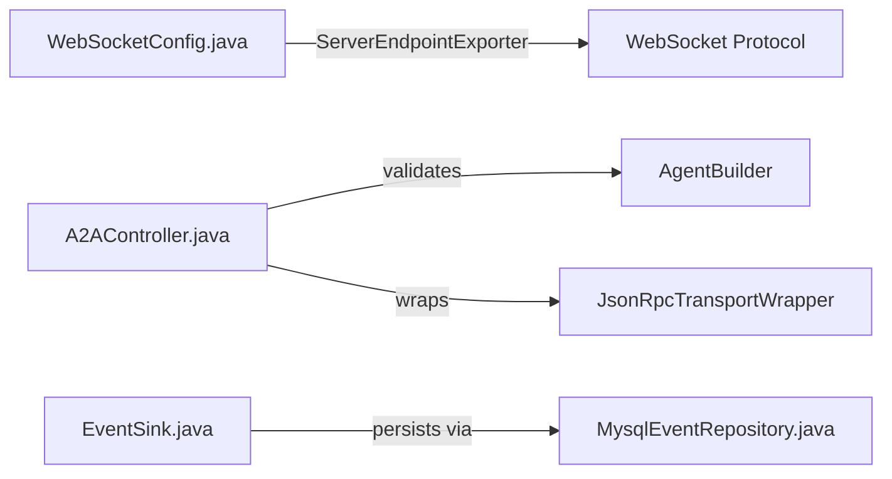

# Streaming and Communication

<cite>
**Referenced Files in This Document**
- [WebSocketConfig.java](file://backend_java/bootstrap/src/main/java/com/aliyun/tam/x/tron/config/WebSocketConfig.java)
- [A2AController.java](file://backend_java/api/src/main/java/com/aliyun/tam/x/tron/api/A2AController.java)
- [JsonRpcRequest.java](file://backend_java/api/src/main/java/com/aliyun/tam/x/tron/ws/jsonrpc/JsonRpcRequest.java)
- [JsonRpcResponse.java](file://backend_java/api/src/main/java/com/aliyun/tam/x/tron/ws/jsonrpc/JsonRpcResponse.java)
- [EventSink.java](file://backend_java/core/src/main/java/com/aliyun/tam/x/tron/core/domain/models/events/EventSink.java)
- [MysqlEventRepository.java](file://backend_java/core/src/main/java/com/aliyun/tam/x/tron/core/domain/repository/mysql/MysqlEventRepository.java)
- [SseEventSource.ts](file://frontend/packages/chatbox/eventSource/SseEventSource.ts)
- [WebSocketEventSource.ts](file://frontend/packages/chatbox/eventSource/WebSocketEventSource.ts)
- [PollingEventSource.ts](file://frontend/packages/chatbox/eventSource/PollingEventSource.ts)
- [EventSource.ts](file://frontend/packages/chatbox/eventSource/EventSource.ts)
- [QwenRealtimeTtsService.java](file://backend_java/core/src/main/java/com/aliyun/tam/x/tron/core/tts/QwenRealtimeTtsService.java)
- [develop_guide.md](file://docs/en/develop_guide.md)
- [develop_guide.md](file://docs/zh/develop_guide.md)
</cite>

## Table of Contents
1. [Introduction](#introduction)
2. [Project Structure](#project-structure)
3. [Core Components](#core-components)
4. [Architecture Overview](#architecture-overview)
5. [Detailed Component Analysis](#detailed-component-analysis)
6. [Dependency Analysis](#dependency-analysis)
7. [Performance Considerations](#performance-considerations)
8. [Troubleshooting Guide](#troubleshooting-guide)
9. [Conclusion](#conclusion)
10. [Appendices](#appendices)

## Introduction
This document explains the streaming and communication systems in Tron OneAgent with a focus on:
- Dual-protocol architecture supporting Server-Sent Events (SSE) and WebSocket for real-time event streaming
- Real-time event streaming implementation, connection management, and message routing
- JSON-RPC protocol for agent-to-agent (A2A) communication
- Event sourcing architecture enabling audit trails and state reconstruction
- Frontend integration patterns for handling streaming responses, managing connection states, and implementing real-time UI updates
- Practical examples, error handling strategies, reconnection logic, and performance optimization
- Security considerations, rate limiting, and scaling approaches for high-concurrency scenarios

## Project Structure
The streaming and communication capabilities span backend Java services and frontend TypeScript event sources:
- Backend Java:
  - WebSocket configuration and endpoints
  - JSON-RPC request/response models
  - A2A controller exposing JSON-RPC over HTTP
  - Event sourcing models and persistence
  - Real-time TTS service using WebSocket
- Frontend TypeScript:
  - SSE, WebSocket, and polling event sources
  - Shared event source service base class
  - Integration patterns for real-time UI updates

**Diagram sources**
- [WebSocketConfig.java:24-36](file://backend_java/bootstrap/src/main/java/com/aliyun/tam/x/tron/config/WebSocketConfig.java#L24-L36)
- [A2AController.java:107-240](file://backend_java/api/src/main/java/com/aliyun/tam/x/tron/api/A2AController.java#L107-L240)
- [JsonRpcRequest.java:23-35](file://backend_java/api/src/main/java/com/aliyun/tam/x/tron/ws/jsonrpc/JsonRpcRequest.java#L23-L35)
- [JsonRpcResponse.java:23-42](file://backend_java/api/src/main/java/com/aliyun/tam/x/tron/ws/jsonrpc/JsonRpcResponse.java#L23-L42)
- [EventSink.java:42-266](file://backend_java/core/src/main/java/com/aliyun/tam/x/tron/core/domain/models/events/EventSink.java#L42-L266)
- [MysqlEventRepository.java:55-200](file://backend_java/core/src/main/java/com/aliyun/tam/x/tron/core/domain/repository/mysql/MysqlEventRepository.java#L55-L200)
- [QwenRealtimeTtsService.java:86-117](file://backend_java/core/src/main/java/com/aliyun/tam/x/tron/core/tts/QwenRealtimeTtsService.java#L86-L117)
- [SseEventSource.ts:28-42](file://frontend/packages/chatbox/eventSource/SseEventSource.ts#L28-L42)
- [WebSocketEventSource.ts:29-81](file://frontend/packages/chatbox/eventSource/WebSocketEventSource.ts#L29-L81)
- [PollingEventSource.ts:30-45](file://frontend/packages/chatbox/eventSource/PollingEventSource.ts#L30-L45)
- [EventSource.ts:23-89](file://frontend/packages/chatbox/eventSource/EventSource.ts#L23-L89)

**Section sources**
- [WebSocketConfig.java:24-36](file://backend_java/bootstrap/src/main/java/com/aliyun/tam/x/tron/config/WebSocketConfig.java#L24-L36)
- [A2AController.java:107-240](file://backend_java/api/src/main/java/com/aliyun/tam/x/tron/api/A2AController.java#L107-L240)
- [EventSink.java:42-266](file://backend_java/core/src/main/java/com/aliyun/tam/x/tron/core/domain/models/events/EventSink.java#L42-L266)
- [MysqlEventRepository.java:55-200](file://backend_java/core/src/main/java/com/aliyun/tam/x/tron/core/domain/repository/mysql/MysqlEventRepository.java#L55-L200)
- [SseEventSource.ts:28-42](file://frontend/packages/chatbox/eventSource/SseEventSource.ts#L28-L42)
- [WebSocketEventSource.ts:29-81](file://frontend/packages/chatbox/eventSource/WebSocketEventSource.ts#L29-L81)
- [PollingEventSource.ts:30-45](file://frontend/packages/chatbox/eventSource/PollingEventSource.ts#L30-L45)
- [EventSource.ts:23-89](file://frontend/packages/chatbox/eventSource/EventSource.ts#L23-L89)

## Core Components
- Backend WebSocket configuration enables WebSocket endpoints in servlet environments.
- JSON-RPC models define request/response envelopes for A2A communication.
- A2AController exposes a JSON-RPC endpoint per agent, routing requests to a transport wrapper and handler.
- EventSink and MysqlEventRepository implement event sourcing: generating, persisting, and applying events to reconstruct state.
- Frontend event sources (SSE, WebSocket, polling) provide unified APIs for real-time updates and connection lifecycle management.

Key implementation references:
- [WebSocketConfig.java:24-36](file://backend_java/bootstrap/src/main/java/com/aliyun/tam/x/tron/config/WebSocketConfig.java#L24-L36)
- [JsonRpcRequest.java:23-35](file://backend_java/api/src/main/java/com/aliyun/tam/x/tron/ws/jsonrpc/JsonRpcRequest.java#L23-L35)
- [JsonRpcResponse.java:23-42](file://backend_java/api/src/main/java/com/aliyun/tam/x/tron/ws/jsonrpc/JsonRpcResponse.java#L23-L42)
- [A2AController.java:107-240](file://backend_java/api/src/main/java/com/aliyun/tam/x/tron/api/A2AController.java#L107-L240)
- [EventSink.java:42-266](file://backend_java/core/src/main/java/com/aliyun/tam/x/tron/core/domain/models/events/EventSink.java#L42-L266)
- [MysqlEventRepository.java:55-200](file://backend_java/core/src/main/java/com/aliyun/tam/x/tron/core/domain/repository/mysql/MysqlEventRepository.java#L55-L200)
- [SseEventSource.ts:28-42](file://frontend/packages/chatbox/eventSource/SseEventSource.ts#L28-L42)
- [WebSocketEventSource.ts:29-81](file://frontend/packages/chatbox/eventSource/WebSocketEventSource.ts#L29-L81)
- [PollingEventSource.ts:30-45](file://frontend/packages/chatbox/eventSource/PollingEventSource.ts#L30-L45)
- [EventSource.ts:23-89](file://frontend/packages/chatbox/eventSource/EventSource.ts#L23-L89)

**Section sources**
- [WebSocketConfig.java:24-36](file://backend_java/bootstrap/src/main/java/com/aliyun/tam/x/tron/config/WebSocketConfig.java#L24-L36)
- [JsonRpcRequest.java:23-35](file://backend_java/api/src/main/java/com/aliyun/tam/x/tron/ws/jsonrpc/JsonRpcRequest.java#L23-L35)
- [JsonRpcResponse.java:23-42](file://backend_java/api/src/main/java/com/aliyun/tam/x/tron/ws/jsonrpc/JsonRpcResponse.java#L23-L42)
- [A2AController.java:107-240](file://backend_java/api/src/main/java/com/aliyun/tam/x/tron/api/A2AController.java#L107-L240)
- [EventSink.java:42-266](file://backend_java/core/src/main/java/com/aliyun/tam/x/tron/core/domain/models/events/EventSink.java#L42-L266)
- [MysqlEventRepository.java:55-200](file://backend_java/core/src/main/java/com/aliyun/tam/x/tron/core/domain/repository/mysql/MysqlEventRepository.java#L55-L200)
- [SseEventSource.ts:28-42](file://frontend/packages/chatbox/eventSource/SseEventSource.ts#L28-L42)
- [WebSocketEventSource.ts:29-81](file://frontend/packages/chatbox/eventSource/WebSocketEventSource.ts#L29-L81)
- [PollingEventSource.ts:30-45](file://frontend/packages/chatbox/eventSource/PollingEventSource.ts#L30-L45)
- [EventSource.ts:23-89](file://frontend/packages/chatbox/eventSource/EventSource.ts#L23-L89)

## Architecture Overview
The system supports two real-time protocols on the frontend and a JSON-RPC channel for agent-to-agent communication. Backend components persist and apply events to maintain a complete audit trail and enable state reconstruction.

**Diagram sources**
- [SseEventSource.ts:28-42](file://frontend/packages/chatbox/eventSource/SseEventSource.ts#L28-L42)
- [WebSocketEventSource.ts:29-81](file://frontend/packages/chatbox/eventSource/WebSocketEventSource.ts#L29-L81)
- [PollingEventSource.ts:30-45](file://frontend/packages/chatbox/eventSource/PollingEventSource.ts#L30-L45)
- [WebSocketConfig.java:24-36](file://backend_java/bootstrap/src/main/java/com/aliyun/tam/x/tron/config/WebSocketConfig.java#L24-L36)
- [A2AController.java:107-240](file://backend_java/api/src/main/java/com/aliyun/tam/x/tron/api/A2AController.java#L107-L240)
- [JsonRpcRequest.java:23-35](file://backend_java/api/src/main/java/com/aliyun/tam/x/tron/ws/jsonrpc/JsonRpcRequest.java#L23-L35)
- [JsonRpcResponse.java:23-42](file://backend_java/api/src/main/java/com/aliyun/tam/x/tron/ws/jsonrpc/JsonRpcResponse.java#L23-L42)
- [EventSink.java:42-266](file://backend_java/core/src/main/java/com/aliyun/tam/x/tron/core/domain/models/events/EventSink.java#L42-L266)
- [MysqlEventRepository.java:55-200](file://backend_java/core/src/main/java/com/aliyun/tam/x/tron/core/domain/repository/mysql/MysqlEventRepository.java#L55-L200)

## Detailed Component Analysis

### Real-Time Streaming: SSE, WebSocket, and Polling
- SSE: Uses a fetch-based event source with an AbortController to manage lifecycle and connection state.
- WebSocket: Manages native WebSocket connections, emitting open/close/connection-change events and handling message parsing.
- Polling: Periodic HTTP polling as a fallback mechanism with configurable intervals.

**Diagram sources**
- [EventSource.ts:23-89](file://frontend/packages/chatbox/eventSource/EventSource.ts#L23-L89)
- [SseEventSource.ts:28-42](file://frontend/packages/chatbox/eventSource/SseEventSource.ts#L28-L42)
- [WebSocketEventSource.ts:29-81](file://frontend/packages/chatbox/eventSource/WebSocketEventSource.ts#L29-L81)
- [PollingEventSource.ts:30-45](file://frontend/packages/chatbox/eventSource/PollingEventSource.ts#L30-L45)

Frontend integration highlights:
- Unified listener registration for messages, errors, and connection state changes.
- SSE uses an AbortController to cancel ongoing requests; WebSocket tracks reconnect attempts and schedules retries.
- Polling maintains a running interval and stops gracefully.

References:
- [EventSource.ts:23-89](file://frontend/packages/chatbox/eventSource/EventSource.ts#L23-L89)
- [SseEventSource.ts:28-42](file://frontend/packages/chatbox/eventSource/SseEventSource.ts#L28-L42)
- [WebSocketEventSource.ts:29-81](file://frontend/packages/chatbox/eventSource/WebSocketEventSource.ts#L29-L81)
- [PollingEventSource.ts:30-45](file://frontend/packages/chatbox/eventSource/PollingEventSource.ts#L30-L45)

**Section sources**
- [EventSource.ts:23-89](file://frontend/packages/chatbox/eventSource/EventSource.ts#L23-L89)
- [SseEventSource.ts:28-42](file://frontend/packages/chatbox/eventSource/SseEventSource.ts#L28-L42)
- [WebSocketEventSource.ts:29-81](file://frontend/packages/chatbox/eventSource/WebSocketEventSource.ts#L29-L81)
- [PollingEventSource.ts:30-45](file://frontend/packages/chatbox/eventSource/PollingEventSource.ts#L30-L45)

### Connection Management and Reconnection Logic
- WebSocketEventSource implements:
  - URL building with session and last event ID
  - Protocol selection
  - Reconnection scheduling with capped attempts
  - Connection state emission and cleanup on stop

**Diagram sources**
- [WebSocketEventSource.ts:29-81](file://frontend/packages/chatbox/eventSource/WebSocketEventSource.ts#L29-L81)

Practical guidance:
- Use exponential backoff with a maximum cap for reconnectInterval and maxReconnectAttempts.
- Persist lastEventId across sessions to resume streaming after reconnection.
- On stop, clear timers and close sockets to prevent leaks.

References:
- [WebSocketEventSource.ts:29-81](file://frontend/packages/chatbox/eventSource/WebSocketEventSource.ts#L29-L81)

**Section sources**
- [WebSocketEventSource.ts:29-81](file://frontend/packages/chatbox/eventSource/WebSocketEventSource.ts#L29-L81)

### JSON-RPC for Agent-to-Agent Communication
- A2AController exposes a JSON-RPC endpoint per agent ID, validating agent builders and cards, then wrapping requests for processing.
- JSON-RPC models define standardized request/response envelopes.

**Diagram sources**
- [A2AController.java:107-240](file://backend_java/api/src/main/java/com/aliyun/tam/x/tron/api/A2AController.java#L107-L240)
- [JsonRpcRequest.java:23-35](file://backend_java/api/src/main/java/com/aliyun/tam/x/tron/ws/jsonrpc/JsonRpcRequest.java#L23-L35)
- [JsonRpcResponse.java:23-42](file://backend_java/api/src/main/java/com/aliyun/tam/x/tron/ws/jsonrpc/JsonRpcResponse.java#L23-L42)

Implementation notes:
- Validate agent existence and card readiness before processing.
- Use a transport wrapper to route requests to a handler and return structured responses.

References:
- [A2AController.java:107-240](file://backend_java/api/src/main/java/com/aliyun/tam/x/tron/api/A2AController.java#L107-L240)
- [JsonRpcRequest.java:23-35](file://backend_java/api/src/main/java/com/aliyun/tam/x/tron/ws/jsonrpc/JsonRpcRequest.java#L23-L35)
- [JsonRpcResponse.java:23-42](file://backend_java/api/src/main/java/com/aliyun/tam/x/tron/ws/jsonrpc/JsonRpcResponse.java#L23-L42)

**Section sources**
- [A2AController.java:107-240](file://backend_java/api/src/main/java/com/aliyun/tam/x/tron/api/A2AController.java#L107-L240)
- [JsonRpcRequest.java:23-35](file://backend_java/api/src/main/java/com/aliyun/tam/x/tron/ws/jsonrpc/JsonRpcRequest.java#L23-L35)
- [JsonRpcResponse.java:23-42](file://backend_java/api/src/main/java/com/aliyun/tam/x/tron/ws/jsonrpc/JsonRpcResponse.java#L23-L42)

### Event Sourcing Architecture and State Reconstruction
- EventSink defines methods to record user inputs, agent messages, content appends, and status changes.
- MysqlEventRepository persists events and applies them to update messages and session state.
- The event sourcing schema supports audit trails and replay-based state reconstruction.

**Diagram sources**
- [EventSink.java:42-266](file://backend_java/core/src/main/java/com/aliyun/tam/x/tron/core/domain/models/events/EventSink.java#L42-L266)
- [MysqlEventRepository.java:55-200](file://backend_java/core/src/main/java/com/aliyun/tam/x/tron/core/domain/repository/mysql/MysqlEventRepository.java#L55-L200)

Additional event types and relationships are documented in the developer guide.

References:
- [EventSink.java:42-266](file://backend_java/core/src/main/java/com/aliyun/tam/x/tron/core/domain/models/events/EventSink.java#L42-L266)
- [MysqlEventRepository.java:55-200](file://backend_java/core/src/main/java/com/aliyun/tam/x/tron/core/domain/repository/mysql/MysqlEventRepository.java#L55-L200)
- [develop_guide.md:165-298](file://docs/en/develop_guide.md#L165-L298)
- [develop_guide.md:1001-1034](file://docs/zh/develop_guide.md#L1001-L1034)

**Section sources**
- [EventSink.java:42-266](file://backend_java/core/src/main/java/com/aliyun/tam/x/tron/core/domain/models/events/EventSink.java#L42-L266)
- [MysqlEventRepository.java:55-200](file://backend_java/core/src/main/java/com/aliyun/tam/x/tron/core/domain/repository/mysql/MysqlEventRepository.java#L55-L200)
- [develop_guide.md:165-298](file://docs/en/develop_guide.md#L165-L298)
- [develop_guide.md:1001-1034](file://docs/zh/develop_guide.md#L1001-L1034)

### Real-Time TTS Streaming via WebSocket
- The TTS service establishes a WebSocket session, updates session configuration, and streams audio chunks with controlled pacing.

**Diagram sources**
- [QwenRealtimeTtsService.java:86-117](file://backend_java/core/src/main/java/com/aliyun/tam/x/tron/core/tts/QwenRealtimeTtsService.java#L86-L117)

References:
- [QwenRealtimeTtsService.java:86-117](file://backend_java/core/src/main/java/com/aliyun/tam/x/tron/core/tts/QwenRealtimeTtsService.java#L86-L117)

**Section sources**
- [QwenRealtimeTtsService.java:86-117](file://backend_java/core/src/main/java/com/aliyun/tam/x/tron/core/tts/QwenRealtimeTtsService.java#L86-L117)

## Dependency Analysis
- WebSocketConfig registers a ServerEndpointExporter for servlet environments, enabling annotated WebSocket endpoints.
- A2AController depends on AgentBuilder and AgentCard to validate and route JSON-RPC requests.
- EventSink and MysqlEventRepository collaborate to persist and apply events atomically within transactions.

**Diagram sources**
- [WebSocketConfig.java:24-36](file://backend_java/bootstrap/src/main/java/com/aliyun/tam/x/tron/config/WebSocketConfig.java#L24-L36)
- [A2AController.java:107-240](file://backend_java/api/src/main/java/com/aliyun/tam/x/tron/api/A2AController.java#L107-L240)
- [EventSink.java:42-266](file://backend_java/core/src/main/java/com/aliyun/tam/x/tron/core/domain/models/events/EventSink.java#L42-L266)
- [MysqlEventRepository.java:55-200](file://backend_java/core/src/main/java/com/aliyun/tam/x/tron/core/domain/repository/mysql/MysqlEventRepository.java#L55-L200)

**Section sources**
- [WebSocketConfig.java:24-36](file://backend_java/bootstrap/src/main/java/com/aliyun/tam/x/tron/config/WebSocketConfig.java#L24-L36)
- [A2AController.java:107-240](file://backend_java/api/src/main/java/com/aliyun/tam/x/tron/api/A2AController.java#L107-L240)
- [EventSink.java:42-266](file://backend_java/core/src/main/java/com/aliyun/tam/x/tron/core/domain/models/events/EventSink.java#L42-L266)
- [MysqlEventRepository.java:55-200](file://backend_java/core/src/main/java/com/aliyun/tam/x/tron/core/domain/repository/mysql/MysqlEventRepository.java#L55-L200)

## Performance Considerations
- Event batching and flushing:
  - MysqlEventRepository batches event writes and periodically flushes messages and events to reduce database load.
  - Use a bounded flush interval to balance latency and throughput.
- SSE vs WebSocket:
  - Prefer WebSocket for low-latency, bidirectional streams; use SSE for simpler server-to-client push semantics.
  - Polling should be reserved for constrained environments or as a fallback.
- JSON-RPC:
  - Keep payloads minimal; avoid unnecessary headers and large binary blobs.
  - Use connection pooling and thread pools judiciously to handle concurrent requests.
- Frontend:
  - Debounce rapid UI updates; coalesce frequent renders.
  - Use AbortController to cancel stale SSE requests and free resources promptly.

[No sources needed since this section provides general guidance]

## Troubleshooting Guide
Common issues and remedies:
- SSE connection failures:
  - Verify CORS and headers; ensure the AbortController is not prematurely aborted.
  - Confirm server-side SSE endpoints are reachable and responding with proper event stream format.
- WebSocket disconnections:
  - Implement exponential backoff and jitter; track reconnect attempts; ensure lastEventId is preserved across reconnects.
  - Validate server endpoint registration via ServerEndpointExporter.
- JSON-RPC errors:
  - Check agent builder availability and card readiness before invoking handlers.
  - Log malformed requests and return structured JSON-RPC error responses with appropriate codes and messages.
- Event sourcing anomalies:
  - Monitor flush intervals and transaction boundaries; ensure sequence generation is consistent.
  - Inspect session_events table for gaps or duplicates; rebuild state by replaying events from last applied event ID.

References:
- [SseEventSource.ts:28-42](file://frontend/packages/chatbox/eventSource/SseEventSource.ts#L28-L42)
- [WebSocketEventSource.ts:29-81](file://frontend/packages/chatbox/eventSource/WebSocketEventSource.ts#L29-L81)
- [WebSocketConfig.java:24-36](file://backend_java/bootstrap/src/main/java/com/aliyun/tam/x/tron/config/WebSocketConfig.java#L24-L36)
- [A2AController.java:107-240](file://backend_java/api/src/main/java/com/aliyun/tam/x/tron/api/A2AController.java#L107-L240)
- [MysqlEventRepository.java:55-200](file://backend_java/core/src/main/java/com/aliyun/tam/x/tron/core/domain/repository/mysql/MysqlEventRepository.java#L55-L200)

**Section sources**
- [SseEventSource.ts:28-42](file://frontend/packages/chatbox/eventSource/SseEventSource.ts#L28-L42)
- [WebSocketEventSource.ts:29-81](file://frontend/packages/chatbox/eventSource/WebSocketEventSource.ts#L29-L81)
- [WebSocketConfig.java:24-36](file://backend_java/bootstrap/src/main/java/com/aliyun/tam/x/tron/config/WebSocketConfig.java#L24-L36)
- [A2AController.java:107-240](file://backend_java/api/src/main/java/com/aliyun/tam/x/tron/api/A2AController.java#L107-L240)
- [MysqlEventRepository.java:55-200](file://backend_java/core/src/main/java/com/aliyun/tam/x/tron/core/domain/repository/mysql/MysqlEventRepository.java#L55-L200)

## Conclusion
Tron OneAgent’s streaming and communication stack combines robust frontend event sources with backend event sourcing and JSON-RPC for agent collaboration. The dual-protocol frontend supports resilient real-time updates, while the event sourcing architecture guarantees auditability and state reconstruction. Proper connection management, error handling, and performance tuning enable scalable, high-concurrency deployments.

[No sources needed since this section summarizes without analyzing specific files]

## Appendices

### Security Considerations
- Transport security:
  - Use TLS for both SSE and WebSocket endpoints.
  - Enforce strict CORS policies and origin validation.
- Authentication and authorization:
  - Attach session tokens or API keys to WebSocket handshake and SSE requests.
  - Validate agent identity and permissions before processing JSON-RPC requests.
- Rate limiting:
  - Apply per-IP and per-session limits for SSE/WS connections and JSON-RPC requests.
  - Throttle event production rates to prevent overload.

[No sources needed since this section provides general guidance]

### Scaling Approaches
- Horizontal scaling:
  - Use sticky sessions or shared state stores for WebSocket sessions.
  - Distribute JSON-RPC workloads across instances with shared queues.
- Backpressure and buffering:
  - Frontend: debounce UI updates; backend: batch and throttle event writes.
  - Implement circuit breakers for downstream services.

[No sources needed since this section provides general guidance]