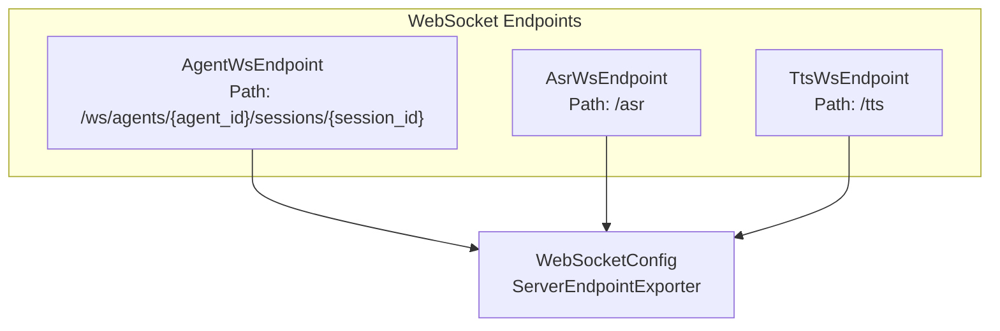
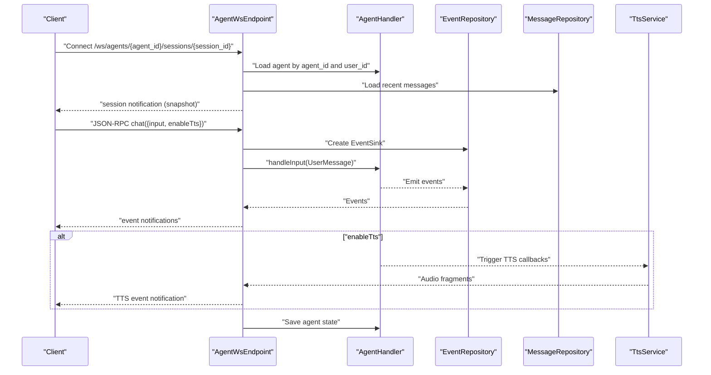
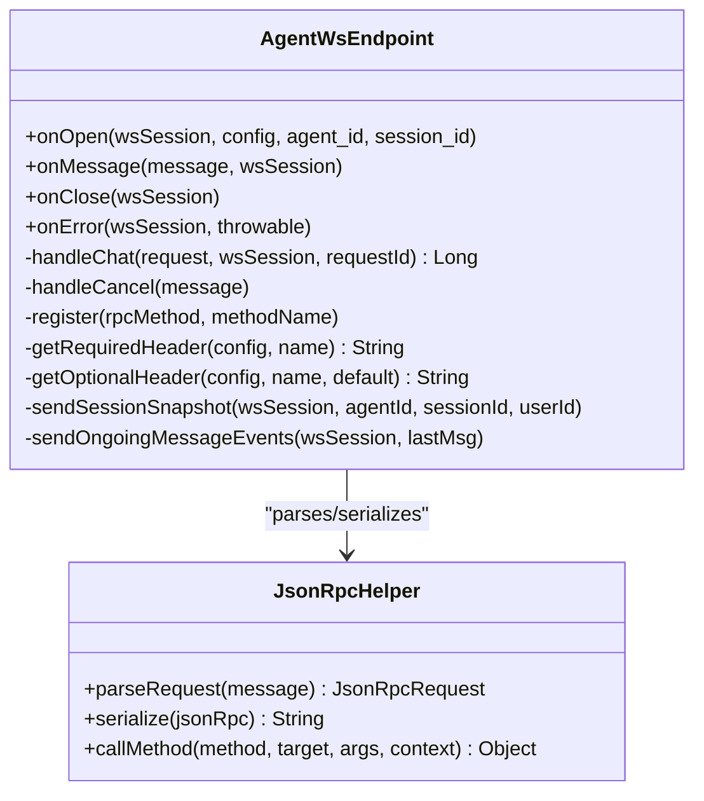
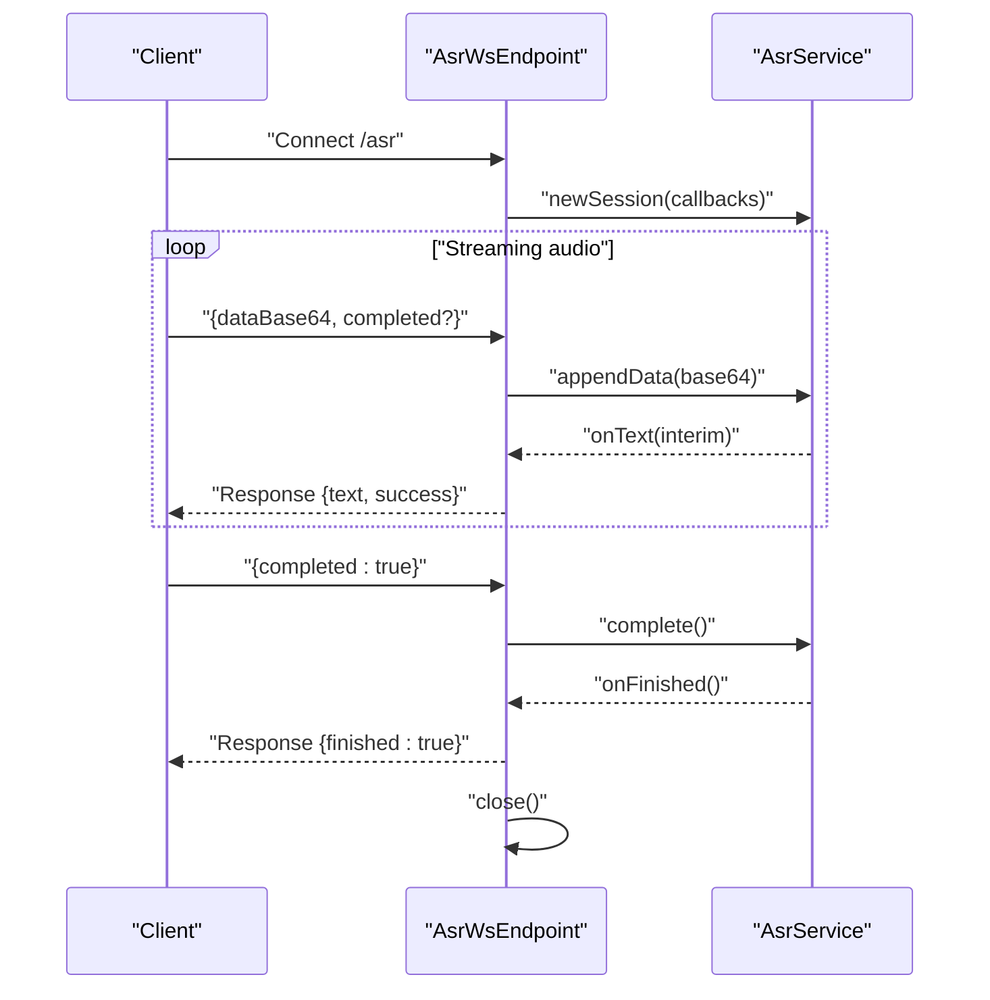
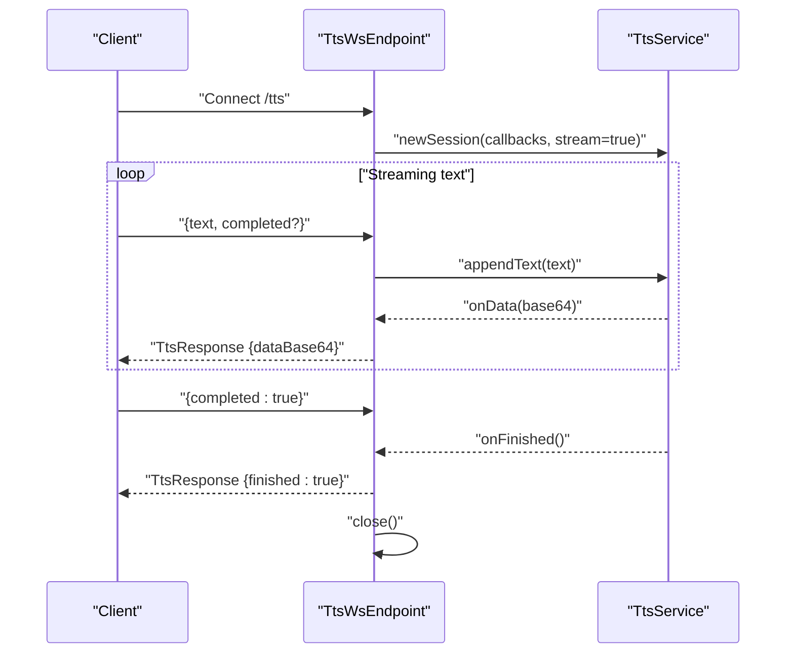
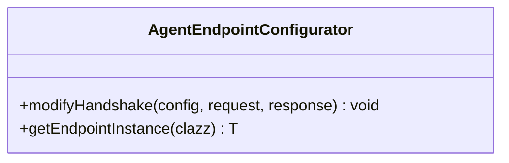
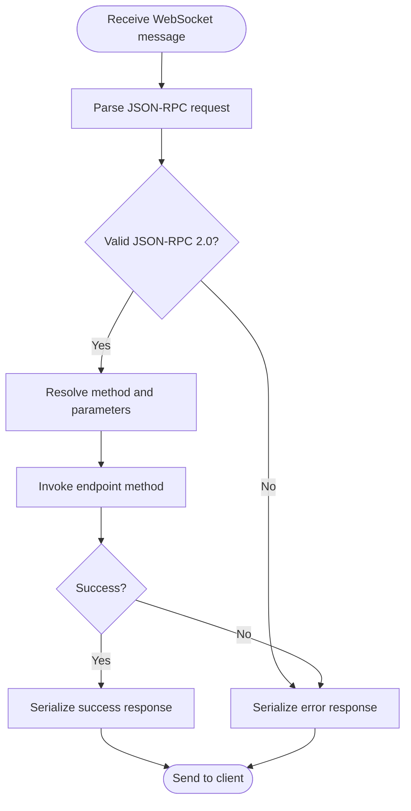
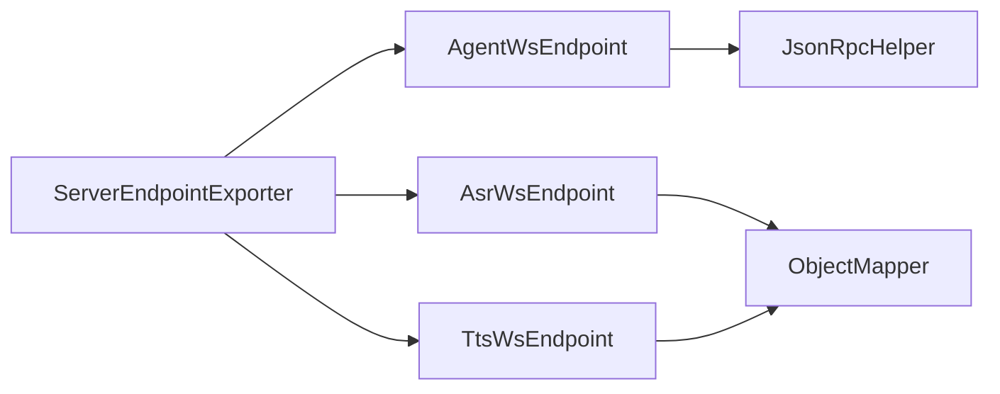

# WebSocket Communication

<cite>
**Referenced Files in This Document**
- [AgentEndpointConfigurator.java](file://backend_java/api/src/main/java/com/aliyun/tam/x/tron/ws/AgentEndpointConfigurator.java)
- [AgentWsEndpoint.java](file://backend_java/api/src/main/java/com/aliyun/tam/x/tron/ws/AgentWsEndpoint.java)
- [AsrWsEndpoint.java](file://backend_java/api/src/main/java/com/aliyun/tam/x/tron/ws/AsrWsEndpoint.java)
- [TtsWsEndpoint.java](file://backend_java/api/src/main/java/com/aliyun/tam/x/tron/ws/TtsWsEndpoint.java)
- [WebSocketConfig.java](file://backend_java/bootstrap/src/main/java/com/aliyun/tam/x/tron/config/WebSocketConfig.java)
- [JsonRpcHelper.java](file://backend_java/api/src/main/java/com/aliyun/tam/x/tron/ws/jsonrpc/JsonRpcHelper.java)
- [JsonRpcRequest.java](file://backend_java/api/src/main/java/com/aliyun/tam/x/tron/ws/jsonrpc/JsonRpcRequest.java)
- [JsonRpcResponse.java](file://backend_java/api/src/main/java/com/aliyun/tam/x/tron/ws/jsonrpc/JsonRpcResponse.java)
- [JsonRpcNotification.java](file://backend_java/api/src/main/java/com/aliyun/tam/x/tron/ws/jsonrpc/JsonRpcNotification.java)
</cite>

## Table of Contents
1. [Introduction](#introduction)
2. [Project Structure](#project-structure)
3. [Core Components](#core-components)
4. [Architecture Overview](#architecture-overview)
5. [Detailed Component Analysis](#detailed-component-analysis)
6. [Dependency Analysis](#dependency-analysis)
7. [Performance Considerations](#performance-considerations)
8. [Troubleshooting Guide](#troubleshooting-guide)
9. [Conclusion](#conclusion)
10. [Appendices](#appendices)

## Introduction
This document describes the WebSocket communication system in Tron OneAgent. It covers the WebSocket endpoint architecture, including AgentWsEndpoint, AsrWsEndpoint, and TtsWsEndpoint implementations. It explains configuration, connection establishment, message routing, session management, and the role of AgentEndpointConfigurator. It also documents real-time bidirectional communication patterns, message serialization formats, connection lifecycle management, practical client integration examples, error handling, reconnection logic, performance tuning, security considerations, authentication mechanisms, and scaling approaches for high-concurrency scenarios.

## Project Structure
The WebSocket subsystem resides in the Java backend module and is organized around three primary endpoints:
- Agent WebSocket endpoint for agent-driven conversations and streaming events
- ASR WebSocket endpoint for real-time speech-to-text
- TTS WebSocket endpoint for real-time text-to-speech

Key configuration enables automatic registration of annotated endpoints via a Spring Boot WebSocket exporter.

**Diagram sources**
- [AgentWsEndpoint.java:62](file://backend_java/api/src/main/java/com/aliyun/tam/x/tron/ws/AgentWsEndpoint.java#L62)
- [AsrWsEndpoint.java:36](file://backend_java/api/src/main/java/com/aliyun/tam/x/tron/ws/AsrWsEndpoint.java#L36)
- [TtsWsEndpoint.java:36](file://backend_java/api/src/main/java/com/aliyun/tam/x/tron/ws/TtsWsEndpoint.java#L36)
- [WebSocketConfig.java:32](file://backend_java/bootstrap/src/main/java/com/aliyun/tam/x/tron/config/WebSocketConfig.java#L32)

**Section sources**
- [WebSocketConfig.java:24-36](file://backend_java/bootstrap/src/main/java/com/aliyun/tam/x/tron/config/WebSocketConfig.java#L24-L36)

## Core Components
- AgentWsEndpoint: Implements a JSON-RPC over WebSocket interface for agent sessions, supports chat initiation, cancellation, event streaming, and optional TTS callbacks. Uses a dedicated thread pool for asynchronous processing and ensures serialized sends per session.
- AsrWsEndpoint: Provides a simple WebSocket interface for streaming audio data to an ASR service, emitting interim and final transcription results.
- TtsWsEndpoint: Provides a simple WebSocket interface for streaming text to a TTS service, emitting audio chunks and completion signals.
- AgentEndpointConfigurator: Extends the WebSocket configurator to propagate HTTP headers and query parameters into endpoint instances and enable Spring dependency injection for endpoint beans.
- JSON-RPC helpers: Parse requests, serialize responses/notifications, and support dynamic method dispatch with typed parameter conversion.

**Section sources**
- [AgentWsEndpoint.java:64-104](file://backend_java/api/src/main/java/com/aliyun/tam/x/tron/ws/AgentWsEndpoint.java#L64-L104)
- [AsrWsEndpoint.java:38-107](file://backend_java/api/src/main/java/com/aliyun/tam/x/tron/ws/AsrWsEndpoint.java#L38-L107)
- [TtsWsEndpoint.java:38-93](file://backend_java/api/src/main/java/com/aliyun/tam/x/tron/ws/TtsWsEndpoint.java#L38-L93)
- [AgentEndpointConfigurator.java:31-56](file://backend_java/api/src/main/java/com/aliyun/tam/x/tron/ws/AgentEndpointConfigurator.java#L31-L56)
- [JsonRpcHelper.java:38-161](file://backend_java/api/src/main/java/com/aliyun/tam/x/tron/ws/jsonrpc/JsonRpcHelper.java#L38-L161)

## Architecture Overview
The WebSocket subsystem integrates Spring-managed services and repositories to deliver real-time capabilities:
- AgentWsEndpoint orchestrates agent sessions, persists messages and events, streams live updates, and optionally emits TTS audio fragments.
- AsrWsEndpoint and TtsWsEndpoint expose lightweight streaming APIs for audio/text processing.
- AgentEndpointConfigurator injects Spring beans into endpoints and forwards HTTP metadata to endpoint instances.
- JSON-RPC helpers provide a structured protocol for request/response/error handling.

**Diagram sources**
- [AgentWsEndpoint.java:116-176](file://backend_java/api/src/main/java/com/aliyun/tam/x/tron/ws/AgentWsEndpoint.java#L116-L176)
- [AgentWsEndpoint.java:222-261](file://backend_java/api/src/main/java/com/aliyun/tam/x/tron/ws/AgentWsEndpoint.java#L222-L261)
- [AgentWsEndpoint.java:277-332](file://backend_java/api/src/main/java/com/aliyun/tam/x/tron/ws/AgentWsEndpoint.java#L277-L332)
- [AgentWsEndpoint.java:334-442](file://backend_java/api/src/main/java/com/aliyun/tam/x/tron/ws/AgentWsEndpoint.java#L334-L442)

## Detailed Component Analysis

### AgentWsEndpoint
- Path pattern: /ws/agents/{agent_id}/sessions/{session_id}
- Authentication and identity: Reads X-User-Id header (required) and optional X-User-Name header; otherwise falls back to user ID. These values are propagated into endpoint instances via the configurator.
- Lifecycle hooks:
  - On open: loads or creates a session, initializes agent handler state, sends a session snapshot, and starts streaming pending agent events if applicable.
  - On message: parses JSON-RPC requests, dispatches to registered methods, and returns responses or errors.
  - On close: persists agent state for the current session.
  - On error: logs and closes the session.
- Methods:
  - chat: creates user and agent messages, builds an event sink, invokes agent handler, and streams events back to the client. Supports optional TTS callback emission.
  - cancel: cancels in-flight agent tasks.
- Threading and concurrency:
  - Dedicated thread pool for chat processing with bounded queue and caller-runs policy.
  - Serialized sends per session via a lock to avoid interleaved writes.
- JSON-RPC protocol:
  - Requests parsed and responses/notifications serialized via JsonRpcHelper.
  - Registered RPC methods include "chat" and "cancel".
- Session management:
  - Ensures session ownership by validating user ID against stored session.
  - Persists agent state on close.

**Diagram sources**
- [AgentWsEndpoint.java:64-104](file://backend_java/api/src/main/java/com/aliyun/tam/x/tron/ws/AgentWsEndpoint.java#L64-L104)
- [AgentWsEndpoint.java:116-176](file://backend_java/api/src/main/java/com/aliyun/tam/x/tron/ws/AgentWsEndpoint.java#L116-L176)
- [AgentWsEndpoint.java:222-261](file://backend_java/api/src/main/java/com/aliyun/tam/x/tron/ws/AgentWsEndpoint.java#L222-L261)
- [AgentWsEndpoint.java:277-332](file://backend_java/api/src/main/java/com/aliyun/tam/x/tron/ws/AgentWsEndpoint.java#L277-L332)
- [JsonRpcHelper.java:38-161](file://backend_java/api/src/main/java/com/aliyun/tam/x/tron/ws/jsonrpc/JsonRpcHelper.java#L38-L161)

**Section sources**
- [AgentWsEndpoint.java:62-104](file://backend_java/api/src/main/java/com/aliyun/tam/x/tron/ws/AgentWsEndpoint.java#L62-L104)
- [AgentWsEndpoint.java:116-176](file://backend_java/api/src/main/java/com/aliyun/tam/x/tron/ws/AgentWsEndpoint.java#L116-L176)
- [AgentWsEndpoint.java:222-261](file://backend_java/api/src/main/java/com/aliyun/tam/x/tron/ws/AgentWsEndpoint.java#L222-L261)
- [AgentWsEndpoint.java:277-332](file://backend_java/api/src/main/java/com/aliyun/tam/x/tron/ws/AgentWsEndpoint.java#L277-L332)
- [AgentWsEndpoint.java:334-442](file://backend_java/api/src/main/java/com/aliyun/tam/x/tron/ws/AgentWsEndpoint.java#L334-L442)
- [AgentWsEndpoint.java:449-505](file://backend_java/api/src/main/java/com/aliyun/tam/x/tron/ws/AgentWsEndpoint.java#L449-L505)

### AsrWsEndpoint
- Path pattern: /asr
- Protocol:
  - Messages are JSON objects with fields for base64-encoded audio data and a completion flag.
  - Responses are JSON objects indicating success, interim text, completion, and optional error.
- Lifecycle:
  - On open: initializes an ASR session via injected service and registers callbacks for interim text, completion, and errors.
  - On message: decodes incoming messages and appends audio data or marks completion.
  - On close/error: cleans up the ASR session and closes the WebSocket.

**Diagram sources**
- [AsrWsEndpoint.java:36-107](file://backend_java/api/src/main/java/com/aliyun/tam/x/tron/ws/AsrWsEndpoint.java#L36-L107)
- [AsrWsEndpoint.java:122-141](file://backend_java/api/src/main/java/com/aliyun/tam/x/tron/ws/AsrWsEndpoint.java#L122-L141)
- [AsrWsEndpoint.java:143-161](file://backend_java/api/src/main/java/com/aliyun/tam/x/tron/ws/AsrWsEndpoint.java#L143-L161)

**Section sources**
- [AsrWsEndpoint.java:36-107](file://backend_java/api/src/main/java/com/aliyun/tam/x/tron/ws/AsrWsEndpoint.java#L36-L107)
- [AsrWsEndpoint.java:122-141](file://backend_java/api/src/main/java/com/aliyun/tam/x/tron/ws/AsrWsEndpoint.java#L122-L141)
- [AsrWsEndpoint.java:143-161](file://backend_java/api/src/main/java/com/aliyun/tam/x/tron/ws/AsrWsEndpoint.java#L143-L161)

### TtsWsEndpoint
- Path pattern: /tts
- Protocol:
  - Messages are JSON objects containing text and a completion flag.
  - Responses are TtsResponse objects with base64-encoded audio data, completion flag, and optional error.
- Lifecycle:
  - On open: initializes a TTS session via injected service and registers callbacks for audio data, completion, and errors.
  - On message: appends text or marks completion.
  - On close/error: cleans up the TTS session and closes the WebSocket.

**Diagram sources**
- [TtsWsEndpoint.java:36-93](file://backend_java/api/src/main/java/com/aliyun/tam/x/tron/ws/TtsWsEndpoint.java#L36-L93)
- [TtsWsEndpoint.java:108-127](file://backend_java/api/src/main/java/com/aliyun/tam/x/tron/ws/TtsWsEndpoint.java#L108-L127)
- [TtsWsEndpoint.java:129-147](file://backend_java/api/src/main/java/com/aliyun/tam/x/tron/ws/TtsWsEndpoint.java#L129-L147)

**Section sources**
- [TtsWsEndpoint.java:36-93](file://backend_java/api/src/main/java/com/aliyun/tam/x/tron/ws/TtsWsEndpoint.java#L36-L93)
- [TtsWsEndpoint.java:108-127](file://backend_java/api/src/main/java/com/aliyun/tam/x/tron/ws/TtsWsEndpoint.java#L108-L127)
- [TtsWsEndpoint.java:129-147](file://backend_java/api/src/main/java/com/aliyun/tam/x/tron/ws/TtsWsEndpoint.java#L129-L147)

### AgentEndpointConfigurator
- Purpose: Extends ServerEndpointConfig.Configurator to:
  - Forward HTTP headers and query parameters into endpoint instances via user properties.
  - Enable Spring dependency injection by retrieving endpoint beans from the application context.
- Usage: Applied to AgentWsEndpoint via the @ServerEndpoint annotation’s configurator attribute.

**Diagram sources**
- [AgentEndpointConfigurator.java:31-56](file://backend_java/api/src/main/java/com/aliyun/tam/x/tron/ws/AgentEndpointConfigurator.java#L31-L56)

**Section sources**
- [AgentEndpointConfigurator.java:31-56](file://backend_java/api/src/main/java/com/aliyun/tam/x/tron/ws/AgentEndpointConfigurator.java#L31-L56)

### JSON-RPC Serialization and Dispatch
- JsonRpcHelper:
  - Parses JSON-RPC 2.0 requests, validates presence of id, method, and params type.
  - Serializes responses and notifications.
  - Dynamically resolves method parameters from context and request payload, converting types as needed.
- JsonRpcRequest/JsonRpcResponse/JsonRpcNotification:
  - Strongly-typed DTOs representing JSON-RPC messages.

**Diagram sources**
- [JsonRpcHelper.java:45-80](file://backend_java/api/src/main/java/com/aliyun/tam/x/tron/ws/jsonrpc/JsonRpcHelper.java#L45-L80)
- [JsonRpcHelper.java:103-136](file://backend_java/api/src/main/java/com/aliyun/tam/x/tron/ws/jsonrpc/JsonRpcHelper.java#L103-L136)
- [JsonRpcRequest.java:25-35](file://backend_java/api/src/main/java/com/aliyun/tam/x/tron/ws/jsonrpc/JsonRpcRequest.java#L25-L35)
- [JsonRpcResponse.java:25-42](file://backend_java/api/src/main/java/com/aliyun/tam/x/tron/ws/jsonrpc/JsonRpcResponse.java#L25-L42)
- [JsonRpcNotification.java:25-32](file://backend_java/api/src/main/java/com/aliyun/tam/x/tron/ws/jsonrpc/JsonRpcNotification.java#L25-L32)

**Section sources**
- [JsonRpcHelper.java:38-161](file://backend_java/api/src/main/java/com/aliyun/tam/x/tron/ws/jsonrpc/JsonRpcHelper.java#L38-L161)
- [JsonRpcRequest.java:25-35](file://backend_java/api/src/main/java/com/aliyun/tam/x/tron/ws/jsonrpc/JsonRpcRequest.java#L25-L35)
- [JsonRpcResponse.java:25-42](file://backend_java/api/src/main/java/com/aliyun/tam/x/tron/ws/jsonrpc/JsonRpcResponse.java#L25-L42)
- [JsonRpcNotification.java:25-32](file://backend_java/api/src/main/java/com/aliyun/tam/x/tron/ws/jsonrpc/JsonRpcNotification.java#L25-L32)

## Dependency Analysis
- Endpoint registration:
  - ServerEndpointExporter bean automatically registers annotated endpoints.
- Endpoint wiring:
  - AgentWsEndpoint depends on Spring-managed services (repositories, agent registry, TTS service) via constructor injection.
  - AsrWsEndpoint and TtsWsEndpoint depend on injected AsrService/TtsService and ObjectMapper.
- JSON-RPC:
  - AgentWsEndpoint uses JsonRpcHelper for parsing and dispatching; AsrWsEndpoint/TtsWsEndpoint use Jackson ObjectMapper directly for request/response serialization.

**Diagram sources**
- [WebSocketConfig.java:32-35](file://backend_java/bootstrap/src/main/java/com/aliyun/tam/x/tron/config/WebSocketConfig.java#L32-L35)
- [AgentWsEndpoint.java:64-80](file://backend_java/api/src/main/java/com/aliyun/tam/x/tron/ws/AgentWsEndpoint.java#L64-L80)
- [AsrWsEndpoint.java:163-171](file://backend_java/api/src/main/java/com/aliyun/tam/x/tron/ws/AsrWsEndpoint.java#L163-L171)
- [TtsWsEndpoint.java:149-157](file://backend_java/api/src/main/java/com/aliyun/tam/x/tron/ws/TtsWsEndpoint.java#L149-L157)

**Section sources**
- [WebSocketConfig.java:24-36](file://backend_java/bootstrap/src/main/java/com/aliyun/tam/x/tron/config/WebSocketConfig.java#L24-L36)
- [AgentWsEndpoint.java:64-80](file://backend_java/api/src/main/java/com/aliyun/tam/x/tron/ws/AgentWsEndpoint.java#L64-L80)
- [AsrWsEndpoint.java:163-171](file://backend_java/api/src/main/java/com/aliyun/tam/x/tron/ws/AsrWsEndpoint.java#L163-L171)
- [TtsWsEndpoint.java:149-157](file://backend_java/api/src/main/java/com/aliyun/tam/x/tron/ws/TtsWsEndpoint.java#L149-L157)

## Performance Considerations
- Concurrency model:
  - AgentWsEndpoint uses a fixed-size thread pool for chat processing to bound resource consumption and prevent unbounded growth.
  - Serialized sends per session reduce contention and ensure message ordering.
- Backpressure and buffering:
  - Bounded queue in the executor prevents memory pressure under load spikes.
  - Periodic polling for events with short sleeps balances responsiveness and CPU usage.
- Serialization overhead:
  - Prefer compact JSON-RPC payloads; avoid unnecessary nested structures.
- I/O efficiency:
  - Use basic remote sends; avoid synchronous blocking operations in hot paths.
- Scaling strategies:
  - Horizontal deployment behind a load balancer with sticky sessions if session affinity is required.
  - Use separate endpoints (/asr, /tts) to distribute load across specialized services.
  - Tune thread pool sizes and queue depths according to workload characteristics.

[No sources needed since this section provides general guidance]

## Troubleshooting Guide
- Connection fails:
  - Verify endpoint registration via ServerEndpointExporter.
  - Confirm required headers/query parameters are present for AgentWsEndpoint (e.g., X-User-Id).
- JSON-RPC errors:
  - Check request id, method, and params format; ensure JSON-RPC 2.0 compliance.
  - Inspect error responses for parse or internal errors.
- Chat stuck or not progressing:
  - Ensure agent handler is available and session ownership matches user ID.
  - Verify event sink creation and event streaming.
- ASR/TTS issues:
  - Confirm service availability and proper initialization.
  - Validate base64 encoding for audio data and text payloads.
- Error handling:
  - Endpoints log errors and close sessions; clients should implement reconnection logic.

**Section sources**
- [AgentWsEndpoint.java:116-136](file://backend_java/api/src/main/java/com/aliyun/tam/x/tron/ws/AgentWsEndpoint.java#L116-L136)
- [AgentWsEndpoint.java:222-261](file://backend_java/api/src/main/java/com/aliyun/tam/x/tron/ws/AgentWsEndpoint.java#L222-L261)
- [AgentWsEndpoint.java:263-275](file://backend_java/api/src/main/java/com/aliyun/tam/x/tron/ws/AgentWsEndpoint.java#L263-L275)
- [AsrWsEndpoint.java:70-107](file://backend_java/api/src/main/java/com/aliyun/tam/x/tron/ws/AsrWsEndpoint.java#L70-L107)
- [AsrWsEndpoint.java:122-141](file://backend_java/api/src/main/java/com/aliyun/tam/x/tron/ws/AsrWsEndpoint.java#L122-L141)
- [AsrWsEndpoint.java:143-161](file://backend_java/api/src/main/java/com/aliyun/tam/x/tron/ws/AsrWsEndpoint.java#L143-L161)
- [TtsWsEndpoint.java:56-93](file://backend_java/api/src/main/java/com/aliyun/tam/x/tron/ws/TtsWsEndpoint.java#L56-L93)
- [TtsWsEndpoint.java:108-127](file://backend_java/api/src/main/java/com/aliyun/tam/x/tron/ws/TtsWsEndpoint.java#L108-L127)
- [TtsWsEndpoint.java:129-147](file://backend_java/api/src/main/java/com/aliyun/tam/x/tron/ws/TtsWsEndpoint.java#L129-L147)

## Conclusion
The WebSocket subsystem in Tron OneAgent provides a robust, extensible foundation for real-time agent interactions, ASR, and TTS. AgentWsEndpoint offers a structured JSON-RPC interface with event streaming and optional TTS integration, while AsrWsEndpoint and TtsWsEndpoint deliver efficient streaming protocols for audio processing. AgentEndpointConfigurator integrates Spring’s DI and metadata propagation, and WebSocketConfig enables automatic endpoint registration. With careful tuning of concurrency and serialization, the system can scale to high-concurrency scenarios while maintaining reliability and responsiveness.

[No sources needed since this section summarizes without analyzing specific files]

## Appendices

### Practical Client Integration Examples
- Agent WebSocket:
  - Connect to /ws/agents/{agent_id}/sessions/{session_id} with headers X-User-Id and optional X-User-Name.
  - Send JSON-RPC chat requests with input contents and optional enableTts flag.
  - Listen for session snapshot and event notifications; handle TTS event notifications when enabled.
- ASR WebSocket:
  - Connect to /asr; send base64-encoded audio data with optional completion flag; listen for interim and final text responses.
- TTS WebSocket:
  - Connect to /tts; send text with optional completion flag; listen for base64-encoded audio fragments and completion.

[No sources needed since this section provides general guidance]

### Security and Authentication
- Authentication:
  - AgentWsEndpoint reads X-User-Id and optional X-User-Name from handshake metadata; enforce presence of required headers.
- Authorization:
  - Validate session ownership by matching user ID against stored session records.
- Transport security:
  - Use TLS termination at the reverse proxy or container ingress to secure WebSocket connections.
- Rate limiting and quotas:
  - Apply rate limits at the gateway or service level to protect downstream services.

[No sources needed since this section provides general guidance]

### Reconnection Logic
- Client-side reconnection:
  - Implement exponential backoff with jitter.
  - Track last applied event ID to resume event streaming after reconnection.
  - Re-send session snapshot requests if needed to recover state.

[No sources needed since this section provides general guidance]