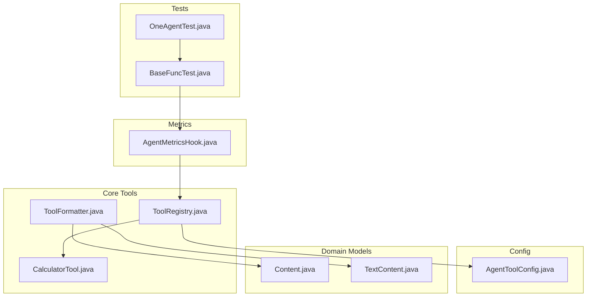
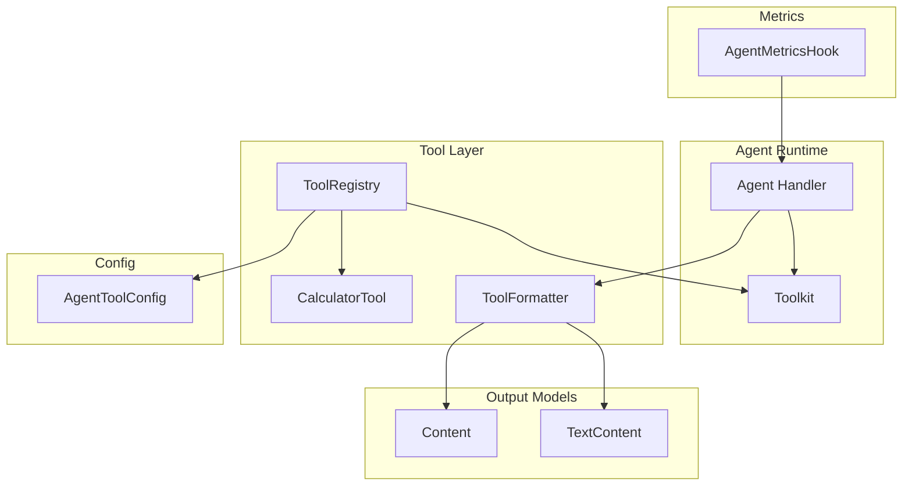
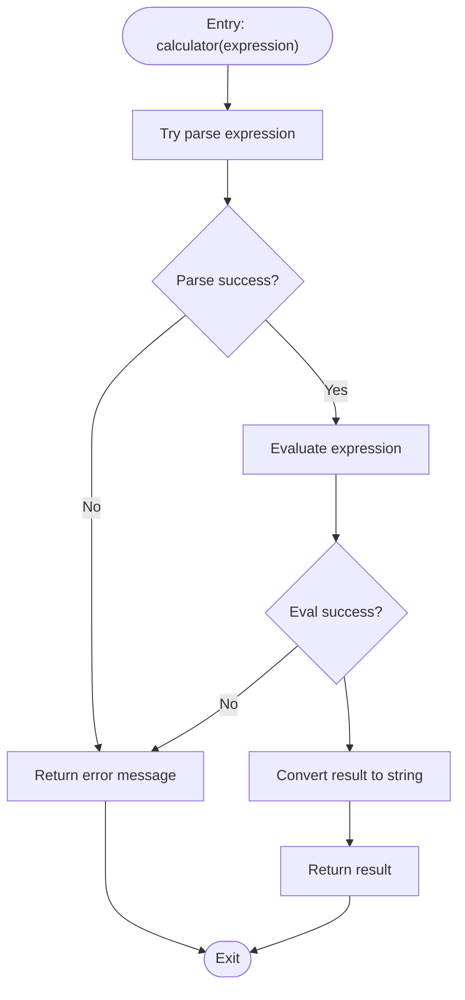
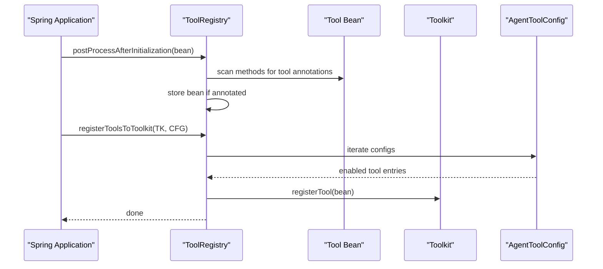
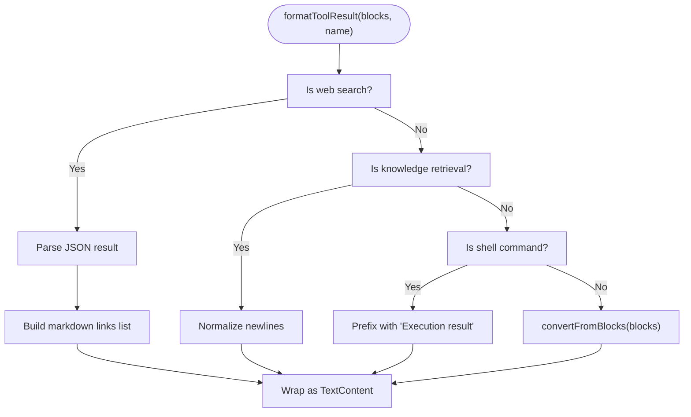
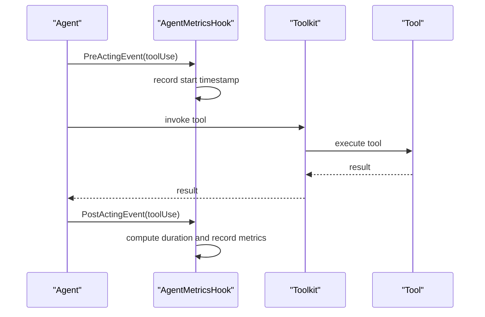
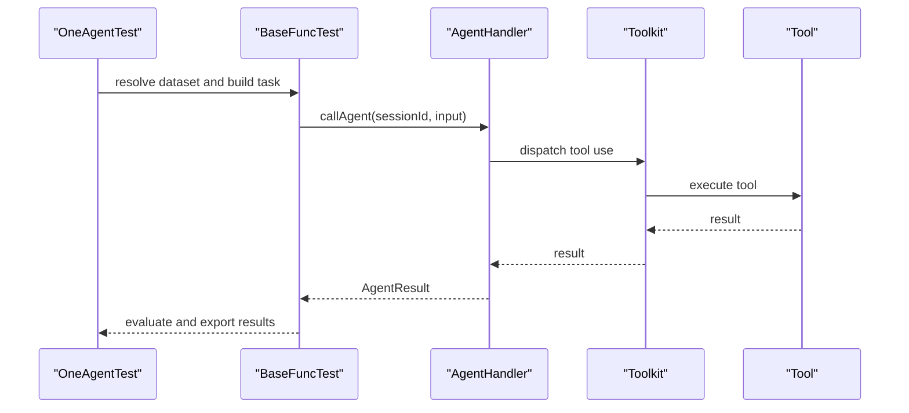
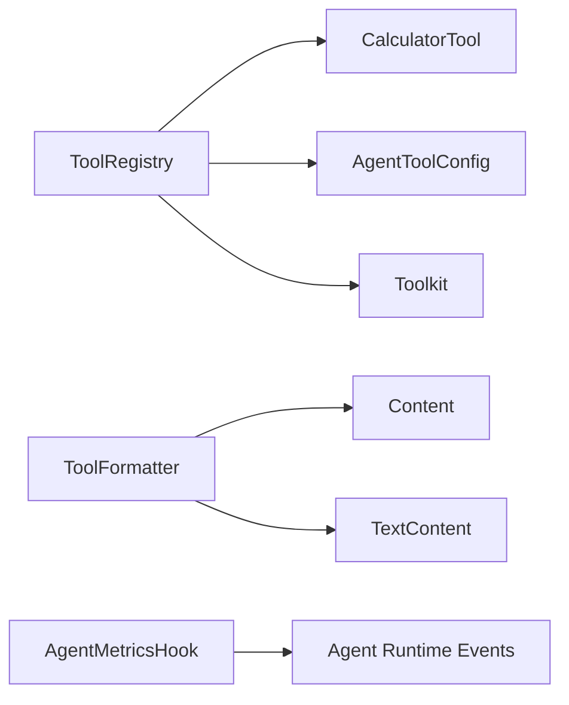

# Custom Tool Development

<cite>
**Referenced Files in This Document**
- [CalculatorTool.java](file://backend_java/core/src/main/java/com/aliyun/tam/x/tron/core/tools/CalculatorTool.java)
- [ToolFormatter.java](file://backend_java/core/src/main/java/com/aliyun/tam/x/tron/core/tools/ToolFormatter.java)
- [ToolRegistry.java](file://backend_java/core/src/main/java/com/aliyun/tam/x/tron/core/tools/ToolRegistry.java)
- [AgentToolConfig.java](file://backend_java/core/src/main/java/com/aliyun/tam/x/tron/core/config/AgentToolConfig.java)
- [Content.java](file://backend_java/core/src/main/java/com/aliyun/tam/x/tron/core/domain/models/contents/Content.java)
- [TextContent.java](file://backend_java/core/src/main/java/com/aliyun/tam/x/tron/core/domain/models/contents/TextContent.java)
- [AgentMetricsHook.java](file://backend_java/core/src/main/java/com/aliyun/tam/x/tron/core/utils/AgentMetricsHook.java)
- [BaseFuncTest.java](file://backend_java/bootstrap/src/test/java/com/aliyun/tam/x/tron/BaseFuncTest.java)
- [OneAgentTest.java](file://backend_java/bootstrap/src/test/java/com/aliyun/tam/x/tron/core/OneAgentTest.java)
</cite>

## Table of Contents
1. [Introduction](#introduction)
2. [Project Structure](#project-structure)
3. [Core Components](#core-components)
4. [Architecture Overview](#architecture-overview)
5. [Detailed Component Analysis](#detailed-component-analysis)
6. [Dependency Analysis](#dependency-analysis)
7. [Performance Considerations](#performance-considerations)
8. [Troubleshooting Guide](#troubleshooting-guide)
9. [Conclusion](#conclusion)
10. [Appendices](#appendices)

## Introduction
This document explains how to develop custom tools for the Tron OneAgent ecosystem. It covers the tool development lifecycle from design to deployment, including tool annotation usage, method signature requirements, parameter validation, and error handling. It documents the CalculatorTool example as a reference implementation, details the ToolFormatter interface for standardizing tool outputs, and explains tool configuration via AgentToolConfig. Best practices for performance, thread safety, and resource management are provided, along with testing strategies, debugging techniques, and guidelines for composing and chaining tools. Tool-specific metrics and monitoring are also addressed.

## Project Structure
The tooling subsystem resides in the Java backend core module and integrates with the agent runtime, configuration, and content models. Key areas:
- Tools: annotated tool methods and registration
- Tool formatting: standardized output rendering
- Configuration: enable/disable tools and precedence
- Metrics: per-tool timing and usage counters
- Tests: functional tests invoking the agent pipeline

**Diagram sources**
- [CalculatorTool.java:1-50](file://backend_java/core/src/main/java/com/aliyun/tam/x/tron/core/tools/CalculatorTool.java#L1-L50)
- [ToolFormatter.java:1-149](file://backend_java/core/src/main/java/com/aliyun/tam/x/tron/core/tools/ToolFormatter.java#L1-L149)
- [ToolRegistry.java:1-77](file://backend_java/core/src/main/java/com/aliyun/tam/x/tron/core/tools/ToolRegistry.java#L1-L77)
- [AgentToolConfig.java:1-44](file://backend_java/core/src/main/java/com/aliyun/tam/x/tron/core/config/AgentToolConfig.java#L1-L44)
- [Content.java:1-148](file://backend_java/core/src/main/java/com/aliyun/tam/x/tron/core/domain/models/contents/Content.java#L1-L148)
- [TextContent.java:1-46](file://backend_java/core/src/main/java/com/aliyun/tam/x/tron/core/domain/models/contents/TextContent.java#L1-L46)
- [AgentMetricsHook.java:1-116](file://backend_java/core/src/main/java/com/aliyun/tam/x/tron/core/utils/AgentMetricsHook.java#L1-L116)
- [BaseFuncTest.java:1-205](file://backend_java/bootstrap/src/test/java/com/aliyun/tam/x/tron/BaseFuncTest.java#L1-L205)
- [OneAgentTest.java:1-138](file://backend_java/bootstrap/src/test/java/com/aliyun/tam/x/tron/core/OneAgentTest.java#L1-L138)

**Section sources**
- [CalculatorTool.java:1-50](file://backend_java/core/src/main/java/com/aliyun/tam/x/tron/core/tools/CalculatorTool.java#L1-L50)
- [ToolFormatter.java:1-149](file://backend_java/core/src/main/java/com/aliyun/tam/x/tron/core/tools/ToolFormatter.java#L1-L149)
- [ToolRegistry.java:1-77](file://backend_java/core/src/main/java/com/aliyun/tam/x/tron/core/tools/ToolRegistry.java#L1-L77)
- [AgentToolConfig.java:1-44](file://backend_java/core/src/main/java/com/aliyun/tam/x/tron/core/config/AgentToolConfig.java#L1-L44)
- [Content.java:1-148](file://backend_java/core/src/main/java/com/aliyun/tam/x/tron/core/domain/models/contents/Content.java#L1-L148)
- [TextContent.java:1-46](file://backend_java/core/src/main/java/com/aliyun/tam/x/tron/core/domain/models/contents/TextContent.java#L1-L46)
- [AgentMetricsHook.java:1-116](file://backend_java/core/src/main/java/com/aliyun/tam/x/tron/core/utils/AgentMetricsHook.java#L1-L116)
- [BaseFuncTest.java:1-205](file://backend_java/bootstrap/src/test/java/com/aliyun/tam/x/tron/BaseFuncTest.java#L1-L205)
- [OneAgentTest.java:1-138](file://backend_java/bootstrap/src/test/java/com/aliyun/tam/x/tron/core/OneAgentTest.java#L1-L138)

## Core Components
- CalculatorTool: Demonstrates a minimal tool with annotation-driven metadata and parameter binding. It parses and evaluates a mathematical expression and returns a formatted string result or an error message.
- ToolFormatter: Converts raw tool results into standardized content blocks, normalizes tool names, formats arguments, and renders structured results for agent consumption.
- ToolRegistry: Scans beans for tool annotations, maintains a registry of tool instances, and registers eligible tools into the agent toolkit according to configuration.
- AgentToolConfig: Holds per-tool configuration such as enablement and tool name, used to filter and register tools during initialization.
- Content and TextContent: Domain models for typed content payloads used across the agent pipeline and tool outputs.
- AgentMetricsHook: Provides instrumentation hooks for reasoning, acting, and tool invocation timings, enabling observability and performance monitoring.

**Section sources**
- [CalculatorTool.java:29-48](file://backend_java/core/src/main/java/com/aliyun/tam/x/tron/core/tools/CalculatorTool.java#L29-L48)
- [ToolFormatter.java:41-147](file://backend_java/core/src/main/java/com/aliyun/tam/x/tron/core/tools/ToolFormatter.java#L41-L147)
- [ToolRegistry.java:34-76](file://backend_java/core/src/main/java/com/aliyun/tam/x/tron/core/tools/ToolRegistry.java#L34-L76)
- [AgentToolConfig.java:25-43](file://backend_java/core/src/main/java/com/aliyun/tam/x/tron/core/config/AgentToolConfig.java#L25-L43)
- [Content.java:38-59](file://backend_java/core/src/main/java/com/aliyun/tam/x/tron/core/domain/models/contents/Content.java#L38-L59)
- [TextContent.java:23-44](file://backend_java/core/src/main/java/com/aliyun/tam/x/tron/core/domain/models/contents/TextContent.java#L23-L44)
- [AgentMetricsHook.java:34-89](file://backend_java/core/src/main/java/com/aliyun/tam/x/tron/core/utils/AgentMetricsHook.java#L34-L89)

## Architecture Overview
The tool system integrates with the agent runtime through annotation scanning, configuration-driven registration, and standardized output formatting. The following diagram maps the major components and their relationships.

**Diagram sources**
- [ToolRegistry.java:34-76](file://backend_java/core/src/main/java/com/aliyun/tam/x/tron/core/tools/ToolRegistry.java#L34-L76)
- [CalculatorTool.java:29-48](file://backend_java/core/src/main/java/com/aliyun/tam/x/tron/core/tools/CalculatorTool.java#L29-L48)
- [ToolFormatter.java:41-147](file://backend_java/core/src/main/java/com/aliyun/tam/x/tron/core/tools/ToolFormatter.java#L41-L147)
- [AgentToolConfig.java:25-43](file://backend_java/core/src/main/java/com/aliyun/tam/x/tron/core/config/AgentToolConfig.java#L25-L43)
- [Content.java:38-59](file://backend_java/core/src/main/java/com/aliyun/tam/x/tron/core/domain/models/contents/Content.java#L38-L59)
- [TextContent.java:23-44](file://backend_java/core/src/main/java/com/aliyun/tam/x/tron/core/domain/models/contents/TextContent.java#L23-L44)
- [AgentMetricsHook.java:34-89](file://backend_java/core/src/main/java/com/aliyun/tam/x/tron/core/utils/AgentMetricsHook.java#L34-L89)

## Detailed Component Analysis

### Tool Annotation and Method Signature Requirements
- Annotation usage: Tools are declared using a framework-provided annotation on methods. The ToolRegistry scans beans and registers any method carrying this annotation.
- Method signature: Methods must be non-static and typically return a serializable result. Parameters are bound via a framework-provided parameter annotation, allowing the agent to pass structured arguments.
- Naming: Tools are identified by a bean name or configured tool name. The ToolFormatter maps internal tool names to human-readable labels.

Implementation references:
- Tool declaration and method signature: [CalculatorTool.java:29-48](file://backend_java/core/src/main/java/com/aliyun/tam/x/tron/core/tools/CalculatorTool.java#L29-L48)
- Annotation scanning and registration: [ToolRegistry.java:39-50](file://backend_java/core/src/main/java/com/aliyun/tam/x/tron/core/tools/ToolRegistry.java#L39-L50)
- Tool name normalization: [ToolFormatter.java:53-76](file://backend_java/core/src/main/java/com/aliyun/tam/x/tron/core/tools/ToolFormatter.java#L53-L76)

**Section sources**
- [CalculatorTool.java:29-48](file://backend_java/core/src/main/java/com/aliyun/tam/x/tron/core/tools/CalculatorTool.java#L29-L48)
- [ToolRegistry.java:39-50](file://backend_java/core/src/main/java/com/aliyun/tam/x/tron/core/tools/ToolRegistry.java#L39-L50)
- [ToolFormatter.java:53-76](file://backend_java/core/src/main/java/com/aliyun/tam/x/tron/core/tools/ToolFormatter.java#L53-L76)

### Parameter Validation and Error Handling
- Parameter validation: Tools should validate inputs early and fail fast with meaningful messages. The CalculatorTool demonstrates parsing and catching exceptions to return a user-friendly error string.
- Error propagation: Exceptions are caught and converted to a string result to avoid interrupting the agent loop. Consider logging errors for diagnostics.

Implementation references:
- Parsing and error handling: [CalculatorTool.java:34-47](file://backend_java/core/src/main/java/com/aliyun/tam/x/tron/core/tools/CalculatorTool.java#L34-L47)

**Section sources**
- [CalculatorTool.java:34-47](file://backend_java/core/src/main/java/com/aliyun/tam/x/tron/core/tools/CalculatorTool.java#L34-L47)

### Tool Method Implementation (CalculatorTool)
- Purpose: Evaluate a mathematical expression and return a string result.
- Steps:
  - Parse the expression using a safe expression language parser.
  - Bind read-only instance methods for evaluation.
  - Compute the value and convert to string.
  - On failure, return a descriptive error message.

**Diagram sources**
- [CalculatorTool.java:34-47](file://backend_java/core/src/main/java/com/aliyun/tam/x/tron/core/tools/CalculatorTool.java#L34-L47)

**Section sources**
- [CalculatorTool.java:31-48](file://backend_java/core/src/main/java/com/aliyun/tam/x/tron/core/tools/CalculatorTool.java#L31-L48)

### Tool Registration and Configuration (ToolRegistry and AgentToolConfig)
- Registration: ToolRegistry scans beans after initialization and collects those with tool annotations. It stores bean instances keyed by bean name.
- Filtering: registerToolsToToolkit iterates AgentToolConfig entries, skipping disabled tools, and registers matching tool beans into the agent toolkit.
- Global registration: getAllTools creates a toolkit containing all registered tools.

**Diagram sources**
- [ToolRegistry.java:39-67](file://backend_java/core/src/main/java/com/aliyun/tam/x/tron/core/tools/ToolRegistry.java#L39-L67)
- [AgentToolConfig.java:25-43](file://backend_java/core/src/main/java/com/aliyun/tam/x/tron/core/config/AgentToolConfig.java#L25-L43)

**Section sources**
- [ToolRegistry.java:52-75](file://backend_java/core/src/main/java/com/aliyun/tam/x/tron/core/tools/ToolRegistry.java#L52-L75)
- [AgentToolConfig.java:25-43](file://backend_java/core/src/main/java/com/aliyun/tam/x/tron/core/config/AgentToolConfig.java#L25-L43)

### Tool Output Formatting (ToolFormatter)
- Name formatting: Maps internal tool names to localized labels for display.
- Argument formatting: Formats arguments into readable strings; falls back to pretty-printed JSON when specialized formatting is not available.
- Result formatting: Converts raw tool results into standardized content blocks. Special-cases certain tools (e.g., web search, knowledge retrieval, shell commands) to produce human-readable summaries. Otherwise, delegates to a conversion utility to preserve block fidelity.

**Diagram sources**
- [ToolFormatter.java:102-147](file://backend_java/core/src/main/java/com/aliyun/tam/x/tron/core/tools/ToolFormatter.java#L102-L147)

**Section sources**
- [ToolFormatter.java:53-147](file://backend_java/core/src/main/java/com/aliyun/tam/x/tron/core/tools/ToolFormatter.java#L53-L147)
- [Content.java:38-59](file://backend_java/core/src/main/java/com/aliyun/tam/x/tron/core/domain/models/contents/Content.java#L38-L59)
- [TextContent.java:23-44](file://backend_java/core/src/main/java/com/aliyun/tam/x/tron/core/domain/models/contents/TextContent.java#L23-L44)

### Tool Configuration (AgentToolConfig)
- Fields:
  - enabled: Boolean flag to enable or disable a tool.
  - name: Tool identifier used to match registered tool beans.
- Behavior: Tools are filtered by this configuration before registration.

Best practices:
- Keep names consistent with the tool bean name or explicit tool name used by the framework.
- Disable tools selectively to control agent behavior and reduce cognitive load.

**Section sources**
- [AgentToolConfig.java:25-43](file://backend_java/core/src/main/java/com/aliyun/tam/x/tron/core/config/AgentToolConfig.java#L25-L43)

### Tool Composition and Chaining
- Compose tools by orchestrating multiple tool invocations within a single agent turn or across turns.
- Chain tools by passing the output of one tool as input to another, ensuring argument types align with downstream tool signatures.
- Prefer deterministic tool ordering and guard against cyclic dependencies.

[No sources needed since this section provides general guidance]

### Tool-Specific Metrics and Monitoring
- Instrumentation hook: AgentMetricsHook records reasoning, acting, and tool invocation durations, as well as model input/output tokens and time.
- Tags: agent.id and tool.name are used to segment metrics.
- Observability: Use these metrics to monitor latency, throughput, and error rates per tool.

**Diagram sources**
- [AgentMetricsHook.java:46-89](file://backend_java/core/src/main/java/com/aliyun/tam/x/tron/core/utils/AgentMetricsHook.java#L46-L89)

**Section sources**
- [AgentMetricsHook.java:34-114](file://backend_java/core/src/main/java/com/aliyun/tam/x/tron/core/utils/AgentMetricsHook.java#L34-L114)

### Testing Strategies and Debugging
- Functional tests: BaseFuncTest constructs sessions, posts user messages, and invokes the agent handler to evaluate end-to-end behavior.
- Experimentation: OneAgentTest runs experiments with evaluators to measure relevance and quality, exporting results to JSON, HTML, and Markdown.
- Debugging tips:
  - Verify tool registration by checking that ToolRegistry contains the expected tool beans.
  - Confirm configuration filtering by validating AgentToolConfig entries.
  - Inspect ToolFormatter output to ensure results render as intended.

**Diagram sources**
- [OneAgentTest.java:51-100](file://backend_java/bootstrap/src/test/java/com/aliyun/tam/x/tron/core/OneAgentTest.java#L51-L100)
- [BaseFuncTest.java:144-203](file://backend_java/bootstrap/src/test/java/com/aliyun/tam/x/tron/BaseFuncTest.java#L144-L203)

**Section sources**
- [OneAgentTest.java:51-135](file://backend_java/bootstrap/src/test/java/com/aliyun/tam/x/tron/core/OneAgentTest.java#L51-L135)
- [BaseFuncTest.java:144-203](file://backend_java/bootstrap/src/test/java/com/aliyun/tam/x/tron/BaseFuncTest.java#L144-L203)

## Dependency Analysis
- ToolRegistry depends on:
  - Tool beans discovered via annotation scanning.
  - AgentToolConfig for filtering enabled tools.
  - Toolkit for registering tools.
- ToolFormatter depends on:
  - Content models for constructing standardized outputs.
  - ObjectMapper for JSON serialization/deserialization.
- AgentMetricsHook depends on:
  - Agent runtime events to compute timings and counts.

**Diagram sources**
- [ToolRegistry.java:34-76](file://backend_java/core/src/main/java/com/aliyun/tam/x/tron/core/tools/ToolRegistry.java#L34-L76)
- [CalculatorTool.java:29-48](file://backend_java/core/src/main/java/com/aliyun/tam/x/tron/core/tools/CalculatorTool.java#L29-L48)
- [AgentToolConfig.java:25-43](file://backend_java/core/src/main/java/com/aliyun/tam/x/tron/core/config/AgentToolConfig.java#L25-L43)
- [ToolFormatter.java:41-147](file://backend_java/core/src/main/java/com/aliyun/tam/x/tron/core/tools/ToolFormatter.java#L41-L147)
- [Content.java:38-59](file://backend_java/core/src/main/java/com/aliyun/tam/x/tron/core/domain/models/contents/Content.java#L38-L59)
- [TextContent.java:23-44](file://backend_java/core/src/main/java/com/aliyun/tam/x/tron/core/domain/models/contents/TextContent.java#L23-L44)
- [AgentMetricsHook.java:34-89](file://backend_java/core/src/main/java/com/aliyun/tam/x/tron/core/utils/AgentMetricsHook.java#L34-L89)

**Section sources**
- [ToolRegistry.java:34-76](file://backend_java/core/src/main/java/com/aliyun/tam/x/tron/core/tools/ToolRegistry.java#L34-L76)
- [ToolFormatter.java:41-147](file://backend_java/core/src/main/java/com/aliyun/tam/x/tron/core/tools/ToolFormatter.java#L41-L147)
- [AgentMetricsHook.java:34-89](file://backend_java/core/src/main/java/com/aliyun/tam/x/tron/core/utils/AgentMetricsHook.java#L34-L89)

## Performance Considerations
- Thread safety: Tool methods should be stateless or use thread-safe shared resources. Avoid mutable static state inside tools.
- Resource management: Close streams and external connections promptly; prefer short-lived clients and reuse where appropriate.
- Parsing and evaluation: Limit expression complexity and enforce timeouts to prevent long-running evaluations.
- Formatting costs: Minimize heavy JSON parsing; cache frequently used formatters when safe.
- Metrics: Use AgentMetricsHook to track tool latencies and adjust concurrency accordingly.

[No sources needed since this section provides general guidance]

## Troubleshooting Guide
- Tool not registered:
  - Ensure the tool class is a Spring-managed component and contains a method annotated as a tool.
  - Verify ToolRegistry scanned the bean and stored it under the expected name.
- Tool disabled:
  - Check AgentToolConfig.enabled for the tool’s entry.
- Incorrect output format:
  - Confirm ToolFormatter special-case handling for the tool name and review content construction.
- Slow tool execution:
  - Instrument with AgentMetricsHook and profile tool-specific logic.
- Test failures:
  - Use BaseFuncTest to simulate agent input and inspect AgentResult.
  - Run OneAgentTest to evaluate quality and relevance metrics.

**Section sources**
- [ToolRegistry.java:52-75](file://backend_java/core/src/main/java/com/aliyun/tam/x/tron/core/tools/ToolRegistry.java#L52-L75)
- [AgentToolConfig.java:25-43](file://backend_java/core/src/main/java/com/aliyun/tam/x/tron/core/config/AgentToolConfig.java#L25-L43)
- [ToolFormatter.java:102-147](file://backend_java/core/src/main/java/com/aliyun/tam/x/tron/core/tools/ToolFormatter.java#L102-L147)
- [AgentMetricsHook.java:46-89](file://backend_java/core/src/main/java/com/aliyun/tam/x/tron/core/utils/AgentMetricsHook.java#L46-L89)
- [BaseFuncTest.java:144-203](file://backend_java/bootstrap/src/test/java/com/aliyun/tam/x/tron/BaseFuncTest.java#L144-L203)
- [OneAgentTest.java:51-135](file://backend_java/bootstrap/src/test/java/com/aliyun/tam/x/tron/core/OneAgentTest.java#L51-L135)

## Conclusion
The Tron OneAgent tool system provides a straightforward, annotation-driven mechanism to define, configure, and integrate tools into the agent runtime. By following the patterns demonstrated by CalculatorTool, ToolFormatter, ToolRegistry, and AgentToolConfig, developers can build robust, observable, and testable tools. Adhering to best practices around validation, error handling, performance, and metrics ensures reliable tool behavior in production scenarios.

## Appendices

### Best Practices Checklist
- Keep tool methods pure and deterministic when possible.
- Validate inputs early and return clear error messages.
- Use ToolFormatter to normalize outputs for consistent agent rendering.
- Configure tools via AgentToolConfig to control enablement and precedence.
- Instrument with AgentMetricsHook for visibility and tuning.
- Write unit and integration tests using BaseFuncTest and OneAgentTest patterns.

[No sources needed since this section provides general guidance]