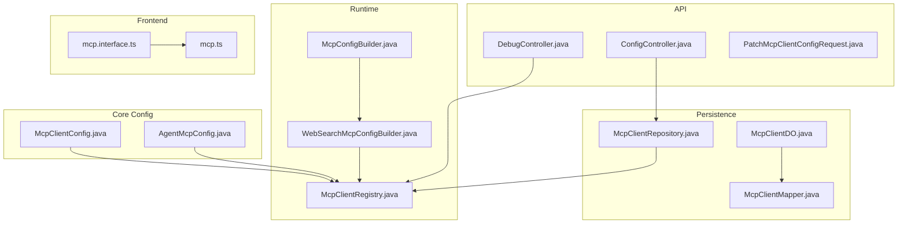
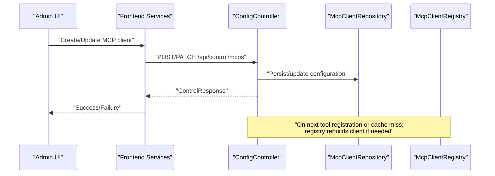
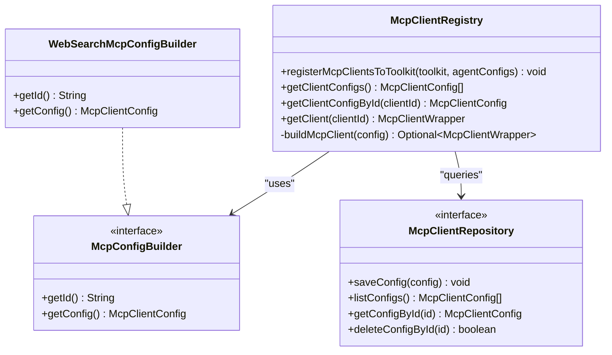
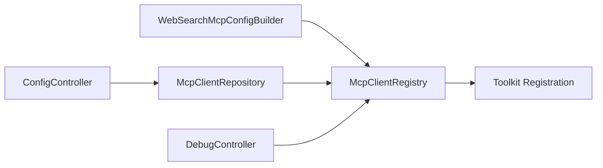

# MCP Integration

<cite>
**Referenced Files in This Document**
- [McpClientConfig.java](file://backend_java/core/src/main/java/com/aliyun/tam/x/tron/core/config/McpClientConfig.java)
- [McpClientRegistry.java](file://backend_java/core/src/main/java/com/aliyun/tam/x/tron/core/mcp/McpClientRegistry.java)
- [McpConfigBuilder.java](file://backend_java/core/src/main/java/com/aliyun/tam/x/tron/core/mcp/McpConfigBuilder.java)
- [WebSearchMcpConfigBuilder.java](file://backend_java/core/src/main/java/com/aliyun/tam/x/tron/core/mcp/WebSearchMcpConfigBuilder.java)
- [AgentMcpConfig.java](file://backend_java/core/src/main/java/com/aliyun/tam/x/tron/core/config/AgentMcpConfig.java)
- [McpClientRepository.java](file://backend_java/core/src/main/java/com/aliyun/tam/x/tron/core/domain/repository/McpClientRepository.java)
- [McpClientDO.java](file://backend_java/infra/src/main/java/com/aliyun/tam/x/tron/infra/dal/dataobject/McpClientDO.java)
- [McpClientMapper.java](file://backend_java/infra/src/main/java/com/aliyun/tam/x/tron/infra/dal/mapper/McpClientMapper.java)
- [PatchMcpClientConfigRequest.java](file://backend_java/api/src/main/java/com/aliyun/tam/x/tron/api/request/PatchMcpClientConfigRequest.java)
- [ConfigController.java](file://backend_java/api/src/main/java/com/aliyun/tam/x/tron/api/ConfigController.java)
- [DebugController.java](file://backend_java/api/src/main/java/com/aliyun/tam/x/tron/api/DebugController.java)
- [mcp.interface.ts](file://frontend/packages/control/src/types/mcp.interface.ts)
- [mcp.ts](file://frontend/packages/control/src/services/mcp.ts)
</cite>

## Table of Contents
1. [Introduction](#introduction)
2. [Project Structure](#project-structure)
3. [Core Components](#core-components)
4. [Architecture Overview](#architecture-overview)
5. [Detailed Component Analysis](#detailed-component-analysis)
6. [Dependency Analysis](#dependency-analysis)
7. [Performance Considerations](#performance-considerations)
8. [Troubleshooting Guide](#troubleshooting-guide)
9. [Conclusion](#conclusion)
10. [Appendices](#appendices)

## Introduction
This document explains the Model Context Protocol (MCP) integration in the Tron One Agent backend. It covers how MCP clients are configured, authenticated, and connected; how multiple clients are managed and initialized; and how the system supports dynamic configuration updates. It also documents the MCP configuration builder pattern, the runtime registry, and the integration points for tool discovery and invocation. Practical examples show how to integrate MCP-compatible services, configure authentication, and handle protocol errors. Guidance is included for performance optimization, connection pooling, retry strategies, and extending the integration to custom or third-party services.

## Project Structure
The MCP integration spans configuration models, a runtime registry, builders, repositories, and API controllers. The frontend provides typed interfaces and service wrappers for MCP configuration management.

**Diagram sources**
- [McpClientConfig.java:1-94](file://backend_java/core/src/main/java/com/aliyun/tam/x/tron/core/config/McpClientConfig.java#L1-L94)
- [AgentMcpConfig.java:1-56](file://backend_java/core/src/main/java/com/aliyun/tam/x/tron/core/config/AgentMcpConfig.java#L1-L56)
- [McpClientRegistry.java:1-218](file://backend_java/core/src/main/java/com/aliyun/tam/x/tron/core/mcp/McpClientRegistry.java#L1-L218)
- [McpConfigBuilder.java:1-27](file://backend_java/core/src/main/java/com/aliyun/tam/x/tron/core/mcp/McpConfigBuilder.java#L1-L27)
- [WebSearchMcpConfigBuilder.java:1-57](file://backend_java/core/src/main/java/com/aliyun/tam/x/tron/core/mcp/WebSearchMcpConfigBuilder.java#L1-L57)
- [McpClientRepository.java:1-34](file://backend_java/core/src/main/java/com/aliyun/tam/x/tron/core/domain/repository/McpClientRepository.java#L1-L34)
- [McpClientDO.java:1-74](file://backend_java/infra/src/main/java/com/aliyun/tam/x/tron/infra/dal/dataobject/McpClientDO.java#L1-L74)
- [McpClientMapper.java:1-30](file://backend_java/infra/src/main/java/com/aliyun/tam/x/tron/infra/dal/mapper/McpClientMapper.java#L1-L30)
- [ConfigController.java:226-255](file://backend_java/api/src/main/java/com/aliyun/tam/x/tron/api/ConfigController.java#L226-L255)
- [DebugController.java:110-138](file://backend_java/api/src/main/java/com/aliyun/tam/x/tron/api/DebugController.java#L110-L138)
- [PatchMcpClientConfigRequest.java:1-79](file://backend_java/api/src/main/java/com/aliyun/tam/x/tron/api/request/PatchMcpClientConfigRequest.java#L1-L79)
- [mcp.interface.ts:1-28](file://frontend/packages/control/src/types/mcp.interface.ts#L1-L28)
- [mcp.ts:1-99](file://frontend/packages/control/src/services/mcp.ts#L1-L99)

**Section sources**
- [McpClientConfig.java:1-94](file://backend_java/core/src/main/java/com/aliyun/tam/x/tron/core/config/McpClientConfig.java#L1-L94)
- [McpClientRegistry.java:1-218](file://backend_java/core/src/main/java/com/aliyun/tam/x/tron/core/mcp/McpClientRegistry.java#L1-L218)
- [McpConfigBuilder.java:1-27](file://backend_java/core/src/main/java/com/aliyun/tam/x/tron/core/mcp/McpConfigBuilder.java#L1-L27)
- [WebSearchMcpConfigBuilder.java:1-57](file://backend_java/core/src/main/java/com/aliyun/tam/x/tron/core/mcp/WebSearchMcpConfigBuilder.java#L1-L57)
- [McpClientRepository.java:1-34](file://backend_java/core/src/main/java/com/aliyun/tam/x/tron/core/domain/repository/McpClientRepository.java#L1-L34)
- [McpClientDO.java:1-74](file://backend_java/infra/src/main/java/com/aliyun/tam/x/tron/infra/dal/dataobject/McpClientDO.java#L1-L74)
- [McpClientMapper.java:1-30](file://backend_java/infra/src/main/java/com/aliyun/tam/x/tron/infra/dal/mapper/McpClientMapper.java#L1-L30)
- [AgentMcpConfig.java:1-56](file://backend_java/core/src/main/java/com/aliyun/tam/x/tron/core/config/AgentMcpConfig.java#L1-L56)
- [ConfigController.java:226-255](file://backend_java/api/src/main/java/com/aliyun/tam/x/tron/api/ConfigController.java#L226-L255)
- [DebugController.java:110-138](file://backend_java/api/src/main/java/com/aliyun/tam/x/tron/api/DebugController.java#L110-L138)
- [PatchMcpClientConfigRequest.java:1-79](file://backend_java/api/src/main/java/com/aliyun/tam/x/tron/api/request/PatchMcpClientConfigRequest.java#L1-L79)
- [mcp.interface.ts:1-28](file://frontend/packages/control/src/types/mcp.interface.ts#L1-L28)
- [mcp.ts:1-99](file://frontend/packages/control/src/services/mcp.ts#L1-L99)

## Core Components
- McpClientConfig: Defines MCP client identity, transport mode, endpoint URL, timeouts, and authentication headers. Supports SSE and streamable HTTP transports.
- McpClientRegistry: Central registry that builds, caches, initializes, and exposes MCP clients. Integrates with a repository for dynamic configuration and a set of builders for built-in clients.
- McpConfigBuilder: Interface for constructing MCP configurations programmatically (e.g., WebSearchMcpConfigBuilder).
- AgentMcpConfig: Associates an agent with a specific MCP client and controls which tools are enabled/disabled.
- McpClientRepository and persistence: Interface and DO/Mapper for storing dynamic MCP client configurations in the database.
- API controllers: Expose endpoints to manage MCP configurations and to debug tool listing and invocation.
- Frontend types and services: Typed interfaces and service wrappers for MCP configuration CRUD.

**Section sources**
- [McpClientConfig.java:35-93](file://backend_java/core/src/main/java/com/aliyun/tam/x/tron/core/config/McpClientConfig.java#L35-L93)
- [McpClientRegistry.java:49-217](file://backend_java/core/src/main/java/com/aliyun/tam/x/tron/core/mcp/McpClientRegistry.java#L49-L217)
- [McpConfigBuilder.java:22-26](file://backend_java/core/src/main/java/com/aliyun/tam/x/tron/core/mcp/McpConfigBuilder.java#L22-L26)
- [WebSearchMcpConfigBuilder.java:29-56](file://backend_java/core/src/main/java/com/aliyun/tam/x/tron/core/mcp/WebSearchMcpConfigBuilder.java#L29-L56)
- [AgentMcpConfig.java:34-55](file://backend_java/core/src/main/java/com/aliyun/tam/x/tron/core/config/AgentMcpConfig.java#L34-L55)
- [McpClientRepository.java:24-33](file://backend_java/core/src/main/java/com/aliyun/tam/x/tron/core/domain/repository/McpClientRepository.java#L24-L33)
- [McpClientDO.java:30-73](file://backend_java/infra/src/main/java/com/aliyun/tam/x/tron/infra/dal/dataobject/McpClientDO.java#L30-L73)
- [McpClientMapper.java:27-29](file://backend_java/infra/src/main/java/com/aliyun/tam/x/tron/infra/dal/mapper/McpClientMapper.java#L27-L29)
- [ConfigController.java:226-255](file://backend_java/api/src/main/java/com/aliyun/tam/x/tron/api/ConfigController.java#L226-L255)
- [DebugController.java:110-138](file://backend_java/api/src/main/java/com/aliyun/tam/x/tron/api/DebugController.java#L110-L138)
- [mcp.interface.ts:18-28](file://frontend/packages/control/src/types/mcp.interface.ts#L18-L28)
- [mcp.ts:26-97](file://frontend/packages/control/src/services/mcp.ts#L26-L97)

## Architecture Overview
The MCP integration follows a layered design:
- Configuration layer: Static and dynamic configurations via McpClientConfig and McpClientRepository.
- Builder layer: Programmatic construction of built-in clients via McpConfigBuilder implementations.
- Runtime layer: McpClientRegistry orchestrating client creation, initialization, caching, and exposure to toolkits.
- API layer: Controllers exposing management and debugging endpoints.
- Frontend layer: Typed configuration interfaces and service wrappers.

**Diagram sources**
- [ConfigController.java:226-255](file://backend_java/api/src/main/java/com/aliyun/tam/x/tron/api/ConfigController.java#L226-L255)
- [McpClientRepository.java:24-33](file://backend_java/core/src/main/java/com/aliyun/tam/x/tron/core/domain/repository/McpClientRepository.java#L24-L33)
- [McpClientRegistry.java:130-161](file://backend_java/core/src/main/java/com/aliyun/tam/x/tron/core/mcp/McpClientRegistry.java#L130-L161)

## Detailed Component Analysis

### McpClientConfig: Defining MCP Connections, Authentication, and Endpoints
- Identity and metadata: id, name, description, enabled flag, version.
- Transport: supports "sse" and "http" (streamable HTTP).
- Endpoint: url pointing to the MCP server endpoint.
- Timeouts: initializeTimeout for handshake/readiness, timeout for requests.
- Authentication: headers map; sensitive header values are encrypted at rest.

Practical guidance:
- Choose transport based on provider capabilities: SSE for server-sent events, HTTP for streamable HTTP.
- Set appropriate timeouts for initialization and request duration.
- Place authentication tokens in headers; ensure encryption is configured for secure storage.

**Section sources**
- [McpClientConfig.java:35-93](file://backend_java/core/src/main/java/com/aliyun/tam/x/tron/core/config/McpClientConfig.java#L35-L93)

### McpClientRegistry: Managing Clients and Lifecycle
Responsibilities:
- Build clients asynchronously using McpClientBuilder with selected transport and timeouts.
- Initialize clients and list tools upon first use.
- Cache clients with expiration and removal listener to close stale connections.
- Merge code-defined and repository-defined configurations.
- Register clients into a toolkit with enable/disable tool lists.

Key behaviors:
- LoadingCache with expire-after-access and removal listener.
- reload triggers rebuild when configuration changes.
- init pre-warms the cache with all known configurations.

**Diagram sources**
- [McpClientRegistry.java:49-217](file://backend_java/core/src/main/java/com/aliyun/tam/x/tron/core/mcp/McpClientRegistry.java#L49-L217)
- [McpConfigBuilder.java:22-26](file://backend_java/core/src/main/java/com/aliyun/tam/x/tron/core/mcp/McpConfigBuilder.java#L22-L26)
- [WebSearchMcpConfigBuilder.java:29-56](file://backend_java/core/src/main/java/com/aliyun/tam/x/tron/core/mcp/WebSearchMcpConfigBuilder.java#L29-L56)
- [McpClientRepository.java:24-33](file://backend_java/core/src/main/java/com/aliyun/tam/x/tron/core/domain/repository/McpClientRepository.java#L24-L33)

**Section sources**
- [McpClientRegistry.java:50-217](file://backend_java/core/src/main/java/com/aliyun/tam/x/tron/core/mcp/McpClientRegistry.java#L50-L217)

### McpConfigBuilder Pattern: Constructing Configurations Programmatically
- Interface defines getId() and getConfig().
- Example implementation: WebSearchMcpConfigBuilder reads API key from environment and constructs a McpClientConfig with HTTP transport and Authorization header.

Guidelines:
- Use builders for built-in services with minimal configuration.
- Validate required credentials before returning a config; return null to suppress client creation when missing.

**Section sources**
- [McpConfigBuilder.java:22-26](file://backend_java/core/src/main/java/com/aliyun/tam/x/tron/core/mcp/McpConfigBuilder.java#L22-L26)
- [WebSearchMcpConfigBuilder.java:29-56](file://backend_java/core/src/main/java/com/aliyun/tam/x/tron/core/mcp/WebSearchMcpConfigBuilder.java#L29-L56)

### AgentMcpConfig: Linking Agents to MCP Clients and Tools
- Associates an agent with a specific MCP client by clientId.
- Controls tool visibility via enableFuncs and disableFuncs lists.

Usage:
- Combine with McpClientRegistry.registerMcpClientsToToolkit to apply tool filtering to the toolkit.

**Section sources**
- [AgentMcpConfig.java:34-55](file://backend_java/core/src/main/java/com/aliyun/tam/x/tron/core/config/AgentMcpConfig.java#L34-L55)

### Persistence Layer: Dynamic MCP Client Management
- McpClientRepository interface defines CRUD operations for McpClientConfig.
- McpClientDO stores id, name, enabled flag, serialized config, and timestamps.
- McpClientMapper provides MyBatis access to the mcp_clients table.

Integration:
- ConfigController persists and updates configurations via the repository.
- Registry merges repository configs with code-defined configs.

**Section sources**
- [McpClientRepository.java:24-33](file://backend_java/core/src/main/java/com/aliyun/tam/x/tron/core/domain/repository/McpClientRepository.java#L24-L33)
- [McpClientDO.java:30-73](file://backend_java/infra/src/main/java/com/aliyun/tam/x/tron/infra/dal/dataobject/McpClientDO.java#L30-L73)
- [McpClientMapper.java:27-29](file://backend_java/infra/src/main/java/com/aliyun/tam/x/tron/infra/dal/mapper/McpClientMapper.java#L27-L29)
- [ConfigController.java:226-255](file://backend_java/api/src/main/java/com/aliyun/tam/x/tron/api/ConfigController.java#L226-L255)

### API Endpoints: Managing and Debugging MCP
- PATCH /api/control/mcps/{mcp_id}: Update MCP configuration fields including transport, URL, timeouts, and headers.
- GET /api/control/mcps: List MCP clients (frontend service wrapper).
- GET /api/control/mcps/{id}: Retrieve a specific MCP client.
- GET/POST /api/debug/mcp/{client_id}/tools: List tools and call a tool for debugging.

Operational notes:
- Use debug endpoints to validate tool availability and invocation before production deployment.
- Ensure headers are correctly propagated to the remote MCP service.

**Section sources**
- [ConfigController.java:226-255](file://backend_java/api/src/main/java/com/aliyun/tam/x/tron/api/ConfigController.java#L226-L255)
- [mcp.ts:38-97](file://frontend/packages/control/src/services/mcp.ts#L38-L97)
- [DebugController.java:110-138](file://backend_java/api/src/main/java/com/aliyun/tam/x/tron/api/DebugController.java#L110-L138)

### Frontend Types and Services: MCP Configuration UX
- TypeScript interface McpClientConfig mirrors backend fields and transport options.
- Service wrappers provide create, list, update, and delete operations for MCP clients.

Best practices:
- Validate required fields before sending requests.
- Handle errors gracefully and surface meaningful messages to users.

**Section sources**
- [mcp.interface.ts:18-28](file://frontend/packages/control/src/types/mcp.interface.ts#L18-L28)
- [mcp.ts:26-97](file://frontend/packages/control/src/services/mcp.ts#L26-L97)

## Dependency Analysis
The registry depends on builders and the repository to assemble configurations, then constructs and initializes MCP clients. The API controllers depend on the repository for persistence and on the registry for runtime operations.

**Diagram sources**
- [WebSearchMcpConfigBuilder.java:29-56](file://backend_java/core/src/main/java/com/aliyun/tam/x/tron/core/mcp/WebSearchMcpConfigBuilder.java#L29-L56)
- [McpClientRegistry.java:49-217](file://backend_java/core/src/main/java/com/aliyun/tam/x/tron/core/mcp/McpClientRegistry.java#L49-L217)
- [McpClientRepository.java:24-33](file://backend_java/core/src/main/java/com/aliyun/tam/x/tron/core/domain/repository/McpClientRepository.java#L24-L33)
- [ConfigController.java:226-255](file://backend_java/api/src/main/java/com/aliyun/tam/x/tron/api/ConfigController.java#L226-L255)
- [DebugController.java:110-138](file://backend_java/api/src/main/java/com/aliyun/tam/x/tron/api/DebugController.java#L110-L138)

**Section sources**
- [McpClientRegistry.java:49-217](file://backend_java/core/src/main/java/com/aliyun/tam/x/tron/core/mcp/McpClientRegistry.java#L49-L217)
- [McpClientRepository.java:24-33](file://backend_java/core/src/main/java/com/aliyun/tam/x/tron/core/domain/repository/McpClientRepository.java#L24-L33)
- [ConfigController.java:226-255](file://backend_java/api/src/main/java/com/aliyun/tam/x/tron/api/ConfigController.java#L226-L255)
- [DebugController.java:110-138](file://backend_java/api/src/main/java/com/aliyun/tam/x/tron/api/DebugController.java#L110-L138)

## Performance Considerations
- Connection pooling and reuse: The registry caches clients with expiration. Adjust cache TTL and eviction policies to balance freshness and resource usage.
- Initialization overhead: Use initializeTimeout to bound handshake time; consider lazy initialization on first use.
- Request concurrency: The registry uses bounded elastic scheduling for building and initializing clients; ensure thread pool sizing matches workload.
- Network transport: Prefer streamable HTTP for long-running operations; use SSE when supported by the provider.
- Retry strategies: Implement retries around tool invocation with exponential backoff and jitter; avoid retry loops on permanent errors.
- Monitoring and metrics: Track client initialization latency, tool invocation latency, and cache hit rates.

[No sources needed since this section provides general guidance]

## Troubleshooting Guide
Common issues and resolutions:
- Client not found: Verify clientId exists in repository or builders; check registry logs for cache misses.
- Authentication failures: Confirm Authorization header presence and correctness; ensure encrypted header values are properly stored.
- Timeout errors: Increase initializeTimeout or timeout depending on the stage of failure; validate network connectivity.
- Tool listing fails: Use debug endpoints to list tools and confirm MCP server readiness.
- Dynamic config not applied: Ensure PATCH endpoints update repository and trigger cache reload; verify merge logic precedence.

**Section sources**
- [McpClientRegistry.java:63-100](file://backend_java/core/src/main/java/com/aliyun/tam/x/tron/core/mcp/McpClientRegistry.java#L63-L100)
- [DebugController.java:110-138](file://backend_java/api/src/main/java/com/aliyun/tam/x/tron/api/DebugController.java#L110-L138)
- [ConfigController.java:226-255](file://backend_java/api/src/main/java/com/aliyun/tam/x/tron/api/ConfigController.java#L226-L255)

## Conclusion
The MCP integration provides a robust, extensible framework for connecting to external services via the Model Context Protocol. It supports dynamic configuration, secure credential handling, and flexible transport modes. The registry centralizes lifecycle management, while builders and repositories enable programmatic and persisted configurations. The API and frontend layers offer operational and administrative capabilities for managing MCP clients and debugging tool interactions.

[No sources needed since this section summarizes without analyzing specific files]

## Appendices

### Practical Examples

- Integrating a built-in MCP service (e.g., WebSearch):
  - Ensure the required API key is configured.
  - The builder constructs a McpClientConfig with HTTP transport and Authorization header.
  - The registry builds and initializes the client automatically.

- Configuring authentication:
  - Add Authorization or other headers to McpClientConfig.headers.
  - Rely on encryption for sensitive header values.

- Handling MCP protocol errors:
  - Use debug endpoints to list tools and call a tool with sample inputs.
  - Inspect error responses and adjust configuration accordingly.

- Extending to custom protocols/third-party services:
  - Implement McpConfigBuilder to construct a custom McpClientConfig.
  - Provide transport-specific builder options and timeouts.
  - Register the builder so the registry can discover and build the client.

**Section sources**
- [WebSearchMcpConfigBuilder.java:29-56](file://backend_java/core/src/main/java/com/aliyun/tam/x/tron/core/mcp/WebSearchMcpConfigBuilder.java#L29-L56)
- [McpConfigBuilder.java:22-26](file://backend_java/core/src/main/java/com/aliyun/tam/x/tron/core/mcp/McpConfigBuilder.java#L22-L26)
- [DebugController.java:110-138](file://backend_java/api/src/main/java/com/aliyun/tam/x/tron/api/DebugController.java#L110-L138)