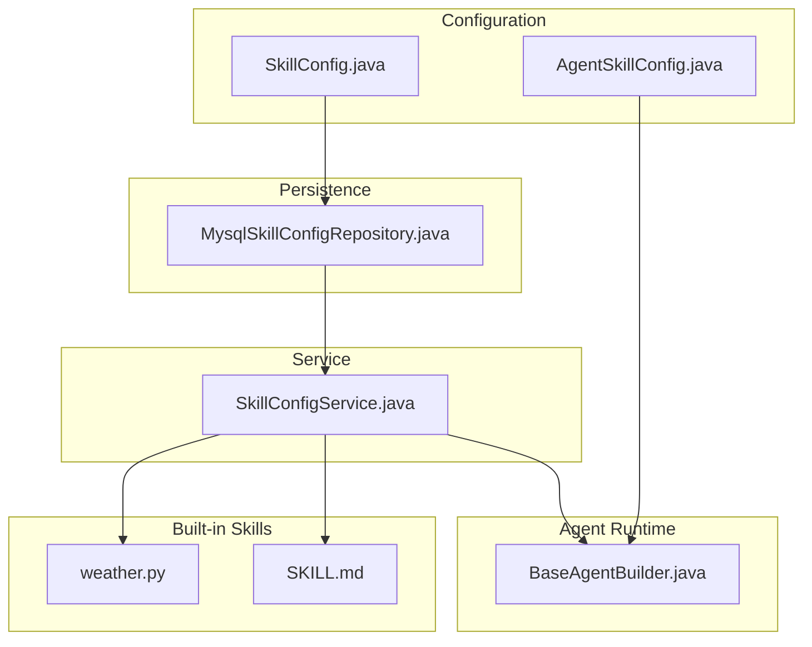
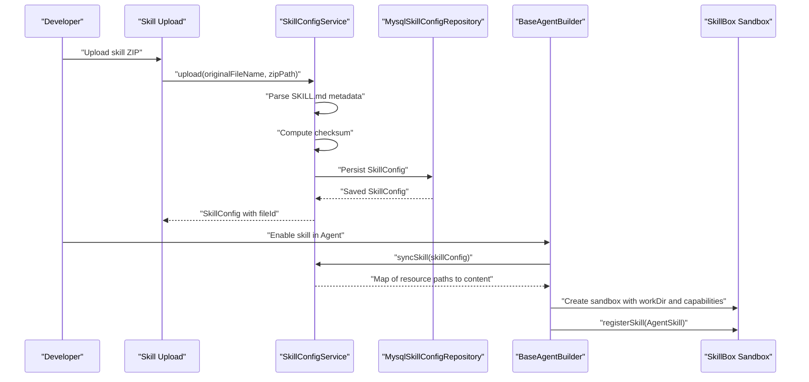
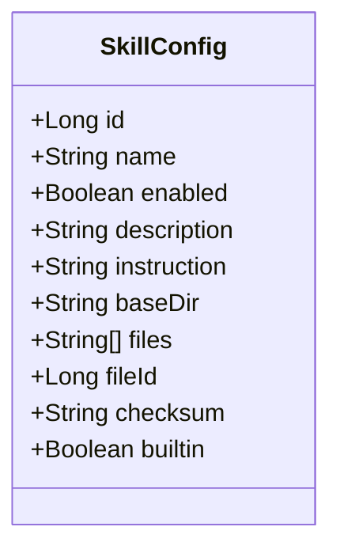
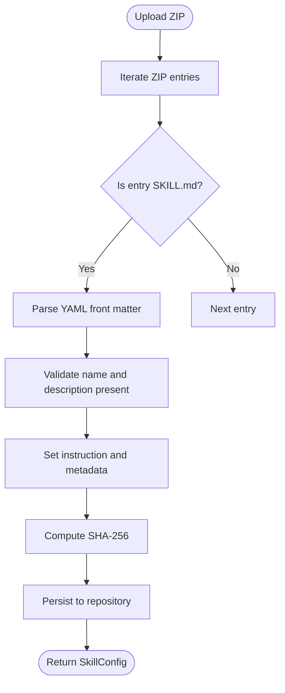
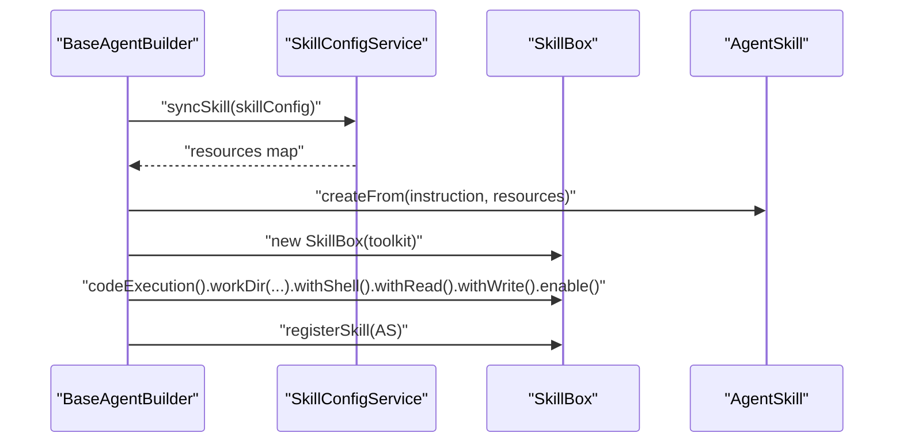
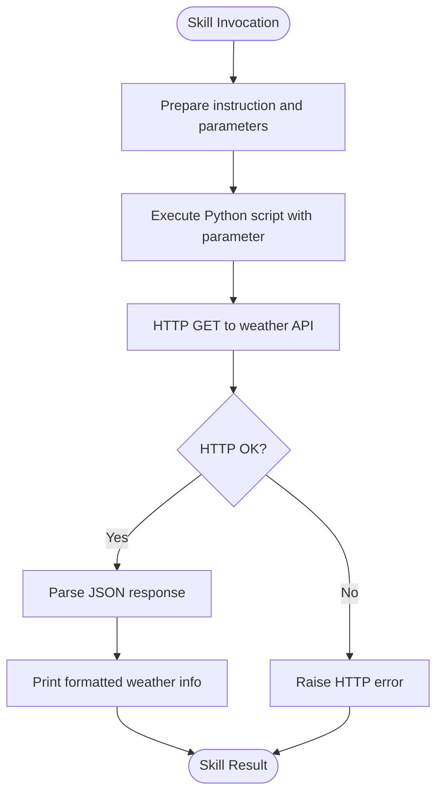
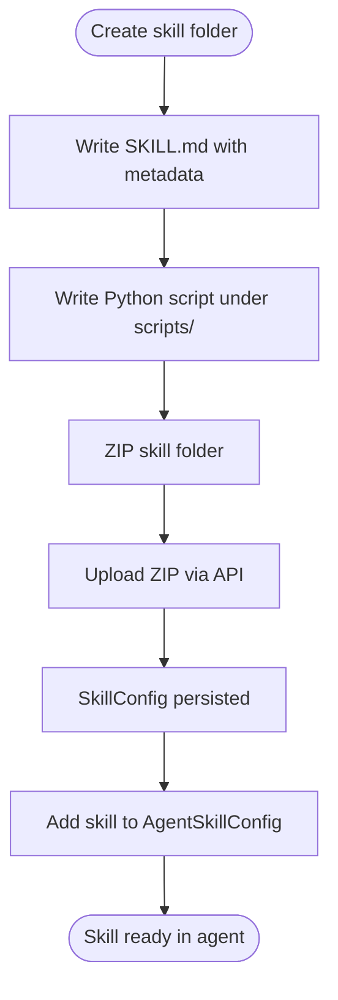
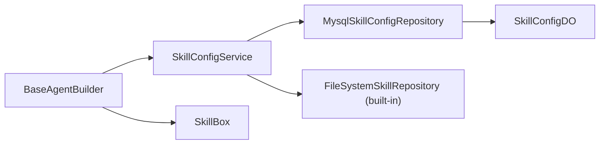

# Skill System Implementation

<cite>
**Referenced Files in This Document**
- [SkillConfig.java](file://backend_java/core/src/main/java/com/aliyun/tam/x/tron/core/config/SkillConfig.java)
- [AgentSkillConfig.java](file://backend_java/core/src/main/java/com/aliyun/tam/x/tron/core/config/AgentSkillConfig.java)
- [SkillConfigService.java](file://backend_java/core/src/main/java/com/aliyun/tam/x/tron/core/domain/service/SkillConfigService.java)
- [MysqlSkillConfigRepository.java](file://backend_java/core/src/main/java/com/aliyun/tam/x/tron/core/domain/repository/mysql/MysqlSkillConfigRepository.java)
- [BaseAgentBuilder.java](file://backend_java/core/src/main/java/com/aliyun/tam/x/tron/core/agents/BaseAgentBuilder.java)
- [weather.py](file://backend_java/skills/weather/scripts/weather.py)
- [SKILL.md](file://backend_java/skills/weather/SKILL.md)
- [develop_guide.md](file://docs/en/develop_guide.md)
- [README.MD](file://backend_java/README.MD)
</cite>

## Table of Contents
1. [Introduction](#introduction)
2. [Project Structure](#project-structure)
3. [Core Components](#core-components)
4. [Architecture Overview](#architecture-overview)
5. [Detailed Component Analysis](#detailed-component-analysis)
6. [Dependency Analysis](#dependency-analysis)
7. [Performance Considerations](#performance-considerations)
8. [Security Considerations](#security-considerations)
9. [Troubleshooting Guide](#troubleshooting-guide)
10. [Conclusion](#conclusion)
11. [Appendices](#appendices)

## Introduction
This document explains the skill system that enables Python-based extensions in the backend. It covers how skills are defined and configured, how the execution environment is set up, and how the weather skill example demonstrates parameter passing and result processing. It also provides guidelines for creating custom Python skills, managing dependencies and versions, validating skills, and integrating them into the agent’s reasoning loop. Security considerations around sandboxing and error handling are addressed to ensure safe execution of external Python code.

## Project Structure
The skill system spans several layers:
- Configuration model: defines skill metadata and runtime attributes
- Persistence: stores skill metadata and associated file artifacts
- Service: parses skill packages, validates metadata, and synchronizes resources
- Agent builder: constructs the execution sandbox and registers skills
- Built-in skills: optional filesystem-based skills packaged alongside the system
- Example skill: a practical Python weather skill demonstrating parameter passing and output

**Diagram sources**
- [SkillConfig.java:34-56](file://backend_java/core/src/main/java/com/aliyun/tam/x/tron/core/config/SkillConfig.java#L34-L56)
- [AgentSkillConfig.java:32-43](file://backend_java/core/src/main/java/com/aliyun/tam/x/tron/core/config/AgentSkillConfig.java#L32-L43)
- [MysqlSkillConfigRepository.java:35-124](file://backend_java/core/src/main/java/com/aliyun/tam/x/tron/core/domain/repository/mysql/MysqlSkillConfigRepository.java#L35-L124)
- [SkillConfigService.java:49-274](file://backend_java/core/src/main/java/com/aliyun/tam/x/tron/core/domain/service/SkillConfigService.java#L49-L274)
- [BaseAgentBuilder.java:369-401](file://backend_java/core/src/main/java/com/aliyun/tam/x/tron/core/agents/BaseAgentBuilder.java#L369-L401)
- [weather.py:1-12](file://backend_java/skills/weather/scripts/weather.py#L1-L12)
- [SKILL.md:1-32](file://backend_java/skills/weather/SKILL.md#L1-L32)

**Section sources**
- [SkillConfig.java:34-56](file://backend_java/core/src/main/java/com/aliyun/tam/x/tron/core/config/SkillConfig.java#L34-L56)
- [MysqlSkillConfigRepository.java:35-124](file://backend_java/core/src/main/java/com/aliyun/tam/x/tron/core/domain/repository/mysql/MysqlSkillConfigRepository.java#L35-L124)
- [SkillConfigService.java:49-274](file://backend_java/core/src/main/java/com/aliyun/tam/x/tron/core/domain/service/SkillConfigService.java#L49-L274)
- [BaseAgentBuilder.java:369-401](file://backend_java/core/src/main/java/com/aliyun/tam/x/tron/core/agents/BaseAgentBuilder.java#L369-L401)
- [SKILL.md:1-32](file://backend_java/skills/weather/SKILL.md#L1-L32)

## Core Components
- SkillConfig: encapsulates skill metadata, enablement flag, description, instruction (full skill content), base directory, file list, file identifier, and checksum. It supports both built-in and uploaded skills.
- AgentSkillConfig: agent-level reference to a skill by name and enablement flag.
- SkillConfigService: handles skill ZIP upload, parsing of SKILL.md metadata, checksum calculation, caching, synchronization of resources, and listing of built-in skills.
- MysqlSkillConfigRepository: persists and retrieves SkillConfig records, mapping between domain and data object representations.
- BaseAgentBuilder: orchestrates skill registration, sandbox creation, and workspace preparation for code execution.

Key responsibilities:
- Define skill identity and behavior via metadata and instruction
- Validate and parse skill packages
- Manage file artifacts and checksums
- Construct a sandboxed execution environment per agent
- Register skills into the agent runtime

**Section sources**
- [SkillConfig.java:34-56](file://backend_java/core/src/main/java/com/aliyun/tam/x/tron/core/config/SkillConfig.java#L34-L56)
- [AgentSkillConfig.java:32-43](file://backend_java/core/src/main/java/com/aliyun/tam/x/tron/core/config/AgentSkillConfig.java#L32-L43)
- [SkillConfigService.java:72-134](file://backend_java/core/src/main/java/com/aliyun/tam/x/tron/core/domain/service/SkillConfigService.java#L72-L134)
- [MysqlSkillConfigRepository.java:40-95](file://backend_java/core/src/main/java/com/aliyun/tam/x/tron/core/domain/repository/mysql/MysqlSkillConfigRepository.java#L40-L95)
- [BaseAgentBuilder.java:369-401](file://backend_java/core/src/main/java/com/aliyun/tam/x/tron/core/agents/BaseAgentBuilder.java#L369-L401)

## Architecture Overview
The skill system integrates configuration, persistence, packaging, and runtime execution:

**Diagram sources**
- [SkillConfigService.java:72-134](file://backend_java/core/src/main/java/com/aliyun/tam/x/tron/core/domain/service/SkillConfigService.java#L72-L134)
- [MysqlSkillConfigRepository.java:40-95](file://backend_java/core/src/main/java/com/aliyun/tam/x/tron/core/domain/repository/mysql/MysqlSkillConfigRepository.java#L40-L95)
- [BaseAgentBuilder.java:369-401](file://backend_java/core/src/main/java/com/aliyun/tam/x/tron/core/agents/BaseAgentBuilder.java#L369-L401)

## Detailed Component Analysis

### SkillConfig Model
SkillConfig holds the skill’s identity and runtime configuration:
- id: unique identifier
- name: skill name (must match SKILL.md name)
- enabled: whether the skill is active
- description: human-readable description
- instruction: full skill content (used to construct AgentSkill)
- baseDir: base directory inside the ZIP
- files: list of file paths included in the ZIP
- fileId: identifier of the stored ZIP artifact
- checksum: SHA-256 hash of the ZIP for cache invalidation
- builtin: indicates if the skill is built-in

**Diagram sources**
- [SkillConfig.java:34-56](file://backend_java/core/src/main/java/com/aliyun/tam/x/tron/core/config/SkillConfig.java#L34-L56)

**Section sources**
- [SkillConfig.java:34-56](file://backend_java/core/src/main/java/com/aliyun/tam/x/tron/core/config/SkillConfig.java#L34-L56)

### Skill Packaging and Metadata Parsing
SkillConfigService parses the skill ZIP and extracts metadata from SKILL.md:
- Validates presence of SKILL.md and YAML front matter
- Extracts name and description
- Stores instruction (full skill content)
- Computes checksum and persists file mapping
- Caches resources keyed by checksum for fast reuse

**Diagram sources**
- [SkillConfigService.java:72-134](file://backend_java/core/src/main/java/com/aliyun/tam/x/tron/core/domain/service/SkillConfigService.java#L72-L134)
- [SkillConfigService.java:188-234](file://backend_java/core/src/main/java/com/aliyun/tam/x/tron/core/domain/service/SkillConfigService.java#L188-L234)

**Section sources**
- [SkillConfigService.java:72-134](file://backend_java/core/src/main/java/com/aliyun/tam/x/tron/core/domain/service/SkillConfigService.java#L72-L134)
- [SkillConfigService.java:188-234](file://backend_java/core/src/main/java/com/aliyun/tam/x/tron/core/domain/service/SkillConfigService.java#L188-L234)

### Execution Environment and Sandbox Setup
BaseAgentBuilder constructs a sandboxed execution environment for skills:
- Syncs skill resources via SkillConfigService
- Creates AgentSkill from instruction and resources
- Builds a workspace directory derived from agentId and a hash of skill checksums
- Initializes SkillBox with code execution capabilities:
  - workDir: isolated working directory
  - withShell(): allows shell command execution
  - withRead()/withWrite(): grants read/write access to the workDir
  - enable(): activates the sandbox
- Registers skills into the sandbox

**Diagram sources**
- [BaseAgentBuilder.java:369-401](file://backend_java/core/src/main/java/com/aliyun/tam/x/tron/core/agents/BaseAgentBuilder.java#L369-L401)

**Section sources**
- [BaseAgentBuilder.java:369-401](file://backend_java/core/src/main/java/com/aliyun/tam/x/tron/core/agents/BaseAgentBuilder.java#L369-L401)

### Weather Skill Example
The weather skill demonstrates:
- Skill structure: SKILL.md with metadata and instruction, plus a Python script under scripts/
- Parameter passing: the instruction references a Python script and expects a city parameter placeholder
- Result processing: the script prints a formatted weather summary

**Diagram sources**
- [SKILL.md:10-12](file://backend_java/skills/weather/SKILL.md#L10-L12)
- [weather.py:6-12](file://backend_java/skills/weather/scripts/weather.py#L6-L12)

**Section sources**
- [SKILL.md:1-32](file://backend_java/skills/weather/SKILL.md#L1-L32)
- [weather.py:1-12](file://backend_java/skills/weather/scripts/weather.py#L1-L12)

### Creating Custom Python Skills
Follow these steps to create a new Python skill:
- Create a directory for the skill
- Write SKILL.md with YAML front matter (name, description) and an instruction that references a Python script
- Implement the Python script under scripts/, accepting parameters via command-line arguments and printing the result
- Package the skill directory into a ZIP
- Upload the ZIP; the system stores it and persists a SkillConfig record
- Reference the skill by name in the agent configuration to enable it

**Diagram sources**
- [develop_guide.md:1897-1960](file://docs/en/develop_guide.md#L1897-L1960)

**Section sources**
- [develop_guide.md:1897-1960](file://docs/en/develop_guide.md#L1897-L1960)

### Managing Dependencies and Versions
- Dependencies: Python scripts can import standard libraries and third-party packages installed in the environment. The sandbox grants shell access, so pip install can be executed during initialization if needed.
- Versioning: use checksums to detect changes in the ZIP. SkillConfigService caches resources keyed by checksum, ensuring that updates invalidate the cache and re-sync resources.
- Built-in vs uploaded: built-in skills are discovered from a filesystem directory and merged into the list of available skills. Uploaded skills are stored and referenced by name.

**Section sources**
- [SkillConfigService.java:136-186](file://backend_java/core/src/main/java/com/aliyun/tam/x/tron/core/domain/service/SkillConfigService.java#L136-L186)
- [SkillConfigService.java:259-272](file://backend_java/core/src/main/java/com/aliyun/tam/x/tron/core/domain/service/SkillConfigService.java#L259-L272)

### Skill Validation and Error Handling
- Metadata validation: SKILL.md must include a valid YAML front matter with name and description; otherwise, an exception is thrown.
- Duplicate SKILL.md detection: if multiple SKILL.md files are found, an exception is raised.
- Existence checks: repository methods throw exceptions when updating non-existent skills or deleting missing skills.
- Runtime errors: skill execution failures propagate to the caller; ensure scripts raise meaningful exceptions and print actionable output.

**Section sources**
- [SkillConfigService.java:188-234](file://backend_java/core/src/main/java/com/aliyun/tam/x/tron/core/domain/service/SkillConfigService.java#L188-L234)
- [MysqlSkillConfigRepository.java:57-95](file://backend_java/core/src/main/java/com/aliyun/tam/x/tron/core/domain/repository/mysql/MysqlSkillConfigRepository.java#L57-L95)

### Integration with the Agent’s Reasoning Loop
- The agent loads skills during construction and registers them into the sandbox.
- The agent can invoke skills as part of its reasoning and action pipeline.
- The sandbox ensures isolation and controlled capabilities (shell, read, write) for each skill invocation.

**Section sources**
- [README.MD:407-441](file://backend_java/README.MD#L407-L441)
- [BaseAgentBuilder.java:369-401](file://backend_java/core/src/main/java/com/aliyun/tam/x/tron/core/agents/BaseAgentBuilder.java#L369-L401)

## Dependency Analysis
The following diagram shows key dependencies among components:

**Diagram sources**
- [SkillConfigService.java:67-70](file://backend_java/core/src/main/java/com/aliyun/tam/x/tron/core/domain/service/SkillConfigService.java#L67-L70)
- [MysqlSkillConfigRepository.java:35-124](file://backend_java/core/src/main/java/com/aliyun/tam/x/tron/core/domain/repository/mysql/MysqlSkillConfigRepository.java#L35-L124)
- [BaseAgentBuilder.java:369-401](file://backend_java/core/src/main/java/com/aliyun/tam/x/tron/core/agents/BaseAgentBuilder.java#L369-L401)

**Section sources**
- [SkillConfigService.java:67-70](file://backend_java/core/src/main/java/com/aliyun/tam/x/tron/core/domain/service/SkillConfigService.java#L67-L70)
- [MysqlSkillConfigRepository.java:35-124](file://backend_java/core/src/main/java/com/aliyun/tam/x/tron/core/domain/repository/mysql/MysqlSkillConfigRepository.java#L35-L124)
- [BaseAgentBuilder.java:369-401](file://backend_java/core/src/main/java/com/aliyun/tam/x/tron/core/agents/BaseAgentBuilder.java#L369-L401)

## Performance Considerations
- Caching: SkillConfigService caches resource maps and checksums to avoid repeated extraction and hashing.
- Incremental sync: Only skills whose checksum differs are re-synced.
- Workspace isolation: Each agent gets a unique workspace derived from a hash of skill checksums, preventing collisions and enabling deterministic cleanup.

**Section sources**
- [SkillConfigService.java:136-186](file://backend_java/core/src/main/java/com/aliyun/tam/x/tron/core/domain/service/SkillConfigService.java#L136-L186)
- [BaseAgentBuilder.java:389-401](file://backend_java/core/src/main/java/com/aliyun/tam/x/tron/core/agents/BaseAgentBuilder.java#L389-L401)

## Security Considerations
- Sandboxing: SkillBox is configured with shell access and read/write capabilities restricted to the workDir. Limit capabilities to the minimum required for the skill.
- Resource isolation: Each agent has a separate workspace directory to prevent cross-agent interference.
- Input sanitization: Validate and sanitize parameters passed to Python scripts to avoid injection attacks.
- Least privilege: Prefer disabling shell access when not needed; restrict network access if possible.
- Integrity: Use checksums to detect tampering and ensure only trusted skills are enabled.
- Error containment: Ensure scripts raise explicit exceptions and avoid leaking sensitive stack traces.

**Section sources**
- [BaseAgentBuilder.java:392-401](file://backend_java/core/src/main/java/com/aliyun/tam/x/tron/core/agents/BaseAgentBuilder.java#L392-L401)
- [SkillConfigService.java:117-134](file://backend_java/core/src/main/java/com/aliyun/tam/x/tron/core/domain/service/SkillConfigService.java#L117-L134)

## Troubleshooting Guide
Common issues and resolutions:
- Missing SKILL.md or invalid YAML: ensure the front matter includes name and description
- Duplicated SKILL.md: only one metadata file is allowed per skill package
- Skill not found: verify the skill name matches the AgentSkillConfig and that the skill is enabled
- Sync failures: check logs for IO exceptions during ZIP extraction or file download
- Execution errors: inspect printed output and ensure the Python script raises clear exceptions

**Section sources**
- [SkillConfigService.java:188-234](file://backend_java/core/src/main/java/com/aliyun/tam/x/tron/core/domain/service/SkillConfigService.java#L188-L234)
- [MysqlSkillConfigRepository.java:57-95](file://backend_java/core/src/main/java/com/aliyun/tam/x/tron/core/domain/repository/mysql/MysqlSkillConfigRepository.java#L57-L95)
- [BaseAgentBuilder.java:369-375](file://backend_java/core/src/main/java/com/aliyun/tam/x/tron/core/agents/BaseAgentBuilder.java#L369-L375)

## Conclusion
The skill system provides a robust framework for integrating Python-based extensions safely and efficiently. By leveraging structured metadata, secure sandboxing, and incremental synchronization, it supports rapid development and deployment of skills while maintaining system integrity. Following the guidelines for validation, dependency management, and security hardening ensures reliable operation within the agent’s reasoning loop.

## Appendices

### Appendix A: Skill Composition and Parameter Validation
- Composition: skills can be combined in an agent; each skill operates independently within its sandbox.
- Parameter validation: define expected parameters in SKILL.md and enforce validation in the Python script; print clear error messages for invalid inputs.

**Section sources**
- [SKILL.md:14-16](file://backend_java/skills/weather/SKILL.md#L14-L16)
- [weather.py:6-12](file://backend_java/skills/weather/scripts/weather.py#L6-L12)