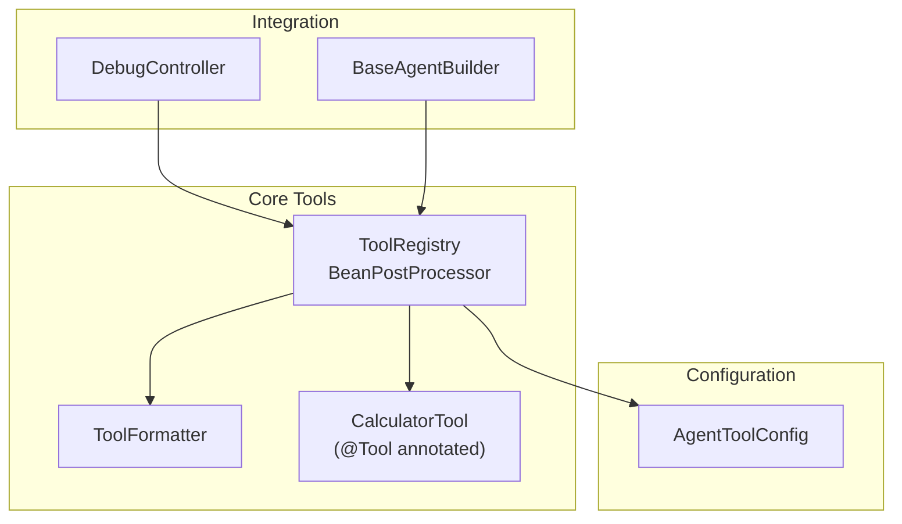
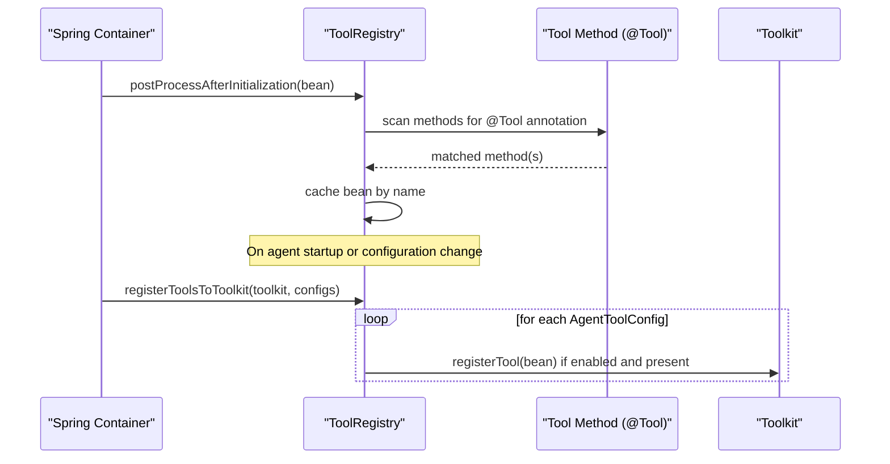
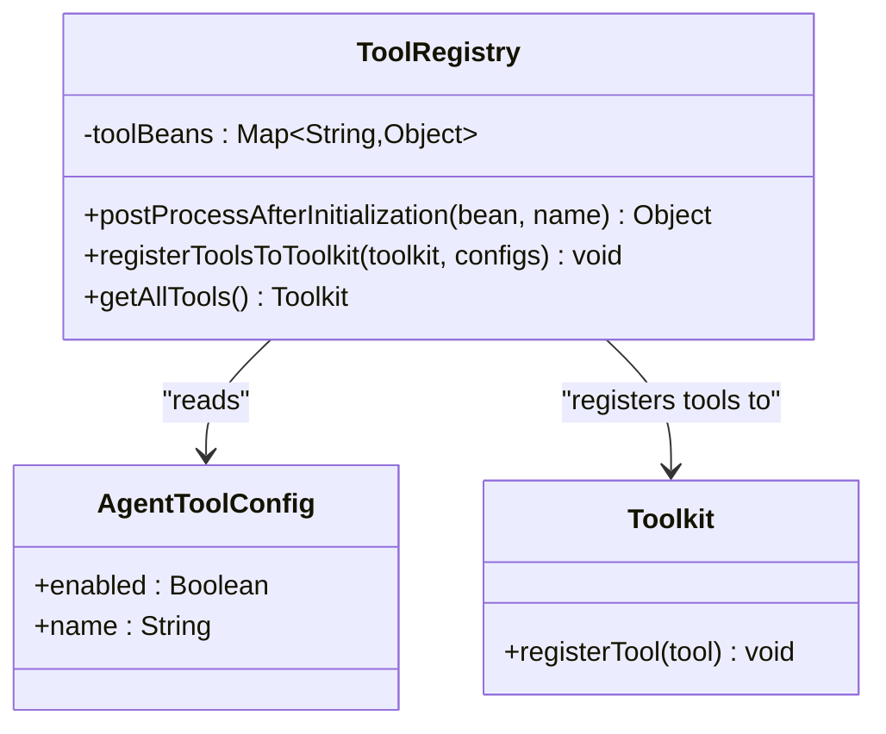
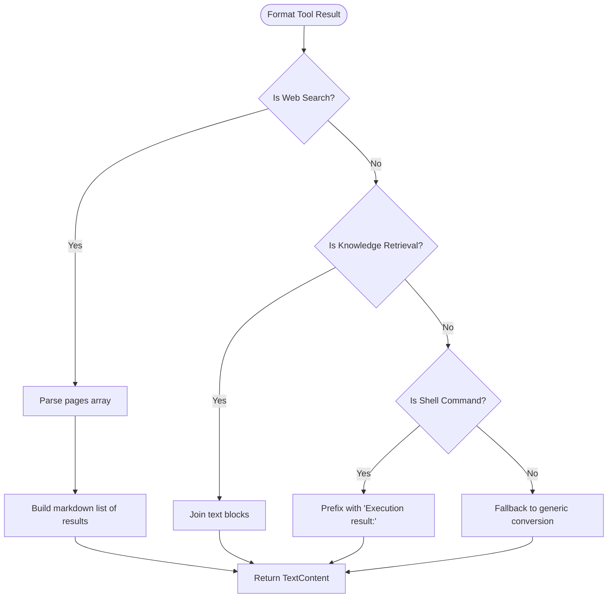
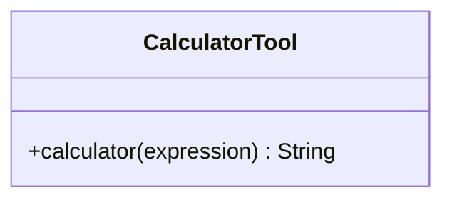
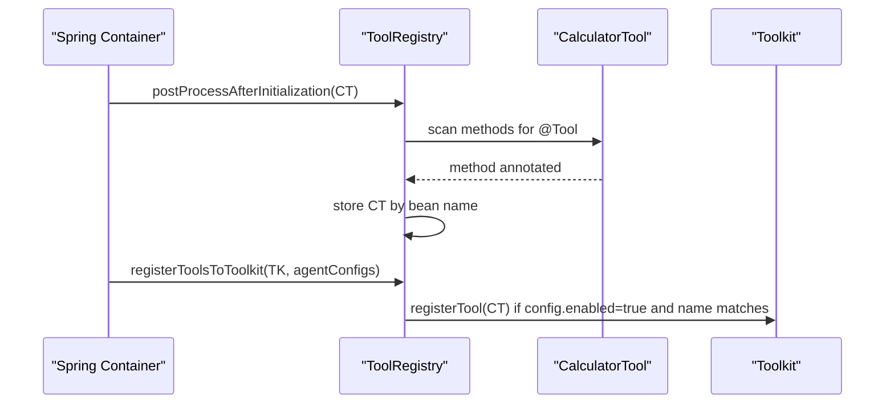
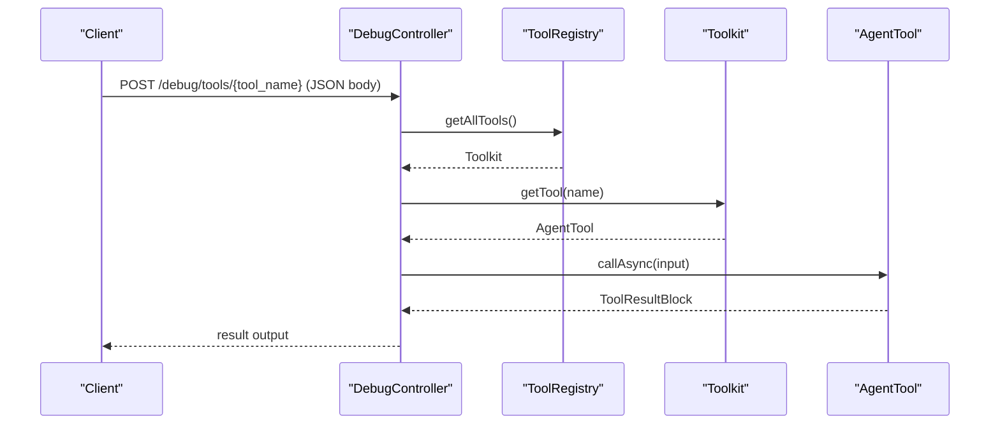
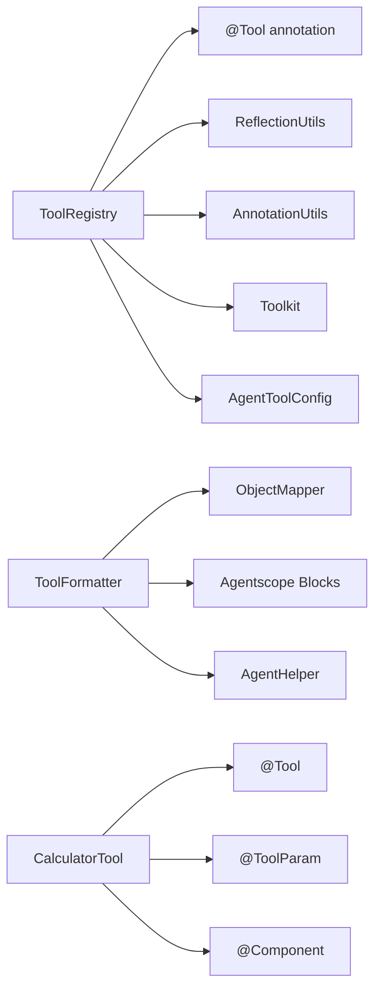

# Tool Registry and Management

<cite>
**Referenced Files in This Document**
- [ToolRegistry.java](file://backend_java/core/src/main/java/com/aliyun/tam/x/tron/core/tools/ToolRegistry.java)
- [ToolFormatter.java](file://backend_java/core/src/main/java/com/aliyun/tam/x/tron/core/tools/ToolFormatter.java)
- [CalculatorTool.java](file://backend_java/core/src/main/java/com/aliyun/tam/x/tron/core/tools/CalculatorTool.java)
- [AgentToolConfig.java](file://backend_java/core/src/main/java/com/aliyun/tam/x/tron/core/config/AgentToolConfig.java)
- [DebugController.java](file://backend_java/api/src/main/java/com/aliyun/tam/x/tron/api/DebugController.java)
- [BaseAgentBuilder.java](file://backend_java/core/src/main/java/com/aliyun/tam/x/tron/core/agents/BaseAgentBuilder.java)
</cite>

## Table of Contents
1. [Introduction](#introduction)
2. [Project Structure](#project-structure)
3. [Core Components](#core-components)
4. [Architecture Overview](#architecture-overview)
5. [Detailed Component Analysis](#detailed-component-analysis)
6. [Dependency Analysis](#dependency-analysis)
7. [Performance Considerations](#performance-considerations)
8. [Troubleshooting Guide](#troubleshooting-guide)
9. [Conclusion](#conclusion)

## Introduction
This document explains the Tool Registry and Management system used to dynamically discover, register, and manage tools annotated with @Tool annotations. It covers:
- The ToolRegistry BeanPostProcessor that scans Spring beans for tool methods during initialization
- The ToolFormatter interface for standardizing tool output formats
- The registration process to Toolkit for agent consumption
- Tool discovery via reflection and annotation processing
- Practical examples for registering custom tools, configuring tool availability, and managing tool lifecycles
- Validation, error handling, and performance considerations for large registries

## Project Structure
The tool system spans three primary areas:
- Tools module: ToolRegistry, ToolFormatter, and sample tools
- Configuration module: AgentToolConfig representing per-agent tool availability
- API/Agent integration: DebugController and BaseAgentBuilder demonstrate usage

**Diagram sources**
- [ToolRegistry.java:34-76](file://backend_java/core/src/main/java/com/aliyun/tam/x/tron/core/tools/ToolRegistry.java#L34-L76)
- [ToolFormatter.java:41-149](file://backend_java/core/src/main/java/com/aliyun/tam/x/tron/core/tools/ToolFormatter.java#L41-L149)
- [CalculatorTool.java:29-49](file://backend_java/core/src/main/java/com/aliyun/tam/x/tron/core/tools/CalculatorTool.java#L29-L49)
- [AgentToolConfig.java:32-43](file://backend_java/core/src/main/java/com/aliyun/tam/x/tron/core/config/AgentToolConfig.java#L32-L43)
- [DebugController.java:85-108](file://backend_java/api/src/main/java/com/aliyun/tam/x/tron/api/DebugController.java#L85-L108)
- [BaseAgentBuilder.java:155-155](file://backend_java/core/src/main/java/com/aliyun/tam/x/tron/core/agents/BaseAgentBuilder.java#L155-L155)

**Section sources**
- [ToolRegistry.java:34-76](file://backend_java/core/src/main/java/com/aliyun/tam/x/tron/core/tools/ToolRegistry.java#L34-L76)
- [ToolFormatter.java:41-149](file://backend_java/core/src/main/java/com/aliyun/tam/x/tron/core/tools/ToolFormatter.java#L41-L149)
- [CalculatorTool.java:29-49](file://backend_java/core/src/main/java/com/aliyun/tam/x/tron/core/tools/CalculatorTool.java#L29-L49)
- [AgentToolConfig.java:32-43](file://backend_java/core/src/main/java/com/aliyun/tam/x/tron/core/config/AgentToolConfig.java#L32-L43)
- [DebugController.java:85-108](file://backend_java/api/src/main/java/com/aliyun/tam/x/tron/api/DebugController.java#L85-L108)
- [BaseAgentBuilder.java:155-155](file://backend_java/core/src/main/java/com/aliyun/tam/x/tron/core/agents/BaseAgentBuilder.java#L155-L155)

## Core Components
- ToolRegistry: Spring-managed BeanPostProcessor that discovers methods annotated with @Tool and maintains a registry of tool beans. It also supports registering tools into a Toolkit based on AgentToolConfig lists and exposes a Toolkit containing all discovered tools.
- ToolFormatter: Standardizes tool name display, argument formatting, and result rendering for consistent presentation across tools.
- CalculatorTool: Sample tool demonstrating @Tool and @ToolParam annotations and a simple calculation operation.
- AgentToolConfig: Lightweight configuration model representing tool availability per agent, including name and enabled flag.

**Section sources**
- [ToolRegistry.java:34-76](file://backend_java/core/src/main/java/com/aliyun/tam/x/tron/core/tools/ToolRegistry.java#L34-L76)
- [ToolFormatter.java:41-149](file://backend_java/core/src/main/java/com/aliyun/tam/x/tron/core/tools/ToolFormatter.java#L41-L149)
- [CalculatorTool.java:29-49](file://backend_java/core/src/main/java/com/aliyun/tam/x/tron/core/tools/CalculatorTool.java#L29-L49)
- [AgentToolConfig.java:32-43](file://backend_java/core/src/main/java/com/aliyun/tam/x/tron/core/config/AgentToolConfig.java#L32-L43)

## Architecture Overview
The system integrates Spring lifecycle hooks with the Agentscope Toolkit to enable dynamic tool discovery and controlled activation per agent.

**Diagram sources**
- [ToolRegistry.java:39-67](file://backend_java/core/src/main/java/com/aliyun/tam/x/tron/core/tools/ToolRegistry.java#L39-L67)

## Detailed Component Analysis

### ToolRegistry
Responsibilities:
- Discover tools: During BeanPostProcessor callback, scan each bean’s methods for @Tool annotations and store the bean instance keyed by bean name.
- Register tools: Given a list of AgentToolConfig entries, register only those marked enabled into a provided Toolkit.
- Expose tools: Build and return a Toolkit containing all discovered tools.

Key behaviors:
- Uses reflection to iterate methods and AnnotationUtils to detect @Tool.
- Maintains an internal concurrent map of tool beans for fast lookup.
- Skips disabled tools and logs no-ops when a configured tool name is not found in the registry.

**Diagram sources**
- [ToolRegistry.java:34-76](file://backend_java/core/src/main/java/com/aliyun/tam/x/tron/core/tools/ToolRegistry.java#L34-L76)
- [AgentToolConfig.java:32-43](file://backend_java/core/src/main/java/com/aliyun/tam/x/tron/core/config/AgentToolConfig.java#L32-L43)

**Section sources**
- [ToolRegistry.java:34-76](file://backend_java/core/src/main/java/com/aliyun/tam/x/tron/core/tools/ToolRegistry.java#L34-L76)

### ToolFormatter
Responsibilities:
- Normalize tool names for display (e.g., mapping internal names to localized labels).
- Format tool arguments into human-readable summaries.
- Convert raw tool results into structured content blocks suitable for agent consumption.

Implementation highlights:
- Provides localized labels for known tool names.
- Formats common tool arguments (e.g., queries, commands) into concise strings.
- Parses and renders specialized results (e.g., web search pages, knowledge retrieval, shell command outputs) into readable text content.

**Diagram sources**
- [ToolFormatter.java:102-147](file://backend_java/core/src/main/java/com/aliyun/tam/x/tron/core/tools/ToolFormatter.java#L102-L147)

**Section sources**
- [ToolFormatter.java:41-149](file://backend_java/core/src/main/java/com/aliyun/tam/x/tron/core/tools/ToolFormatter.java#L41-L149)

### CalculatorTool
A minimal example of a tool:
- Annotated with @Tool to mark the callable method.
- Uses @ToolParam to describe input parameters.
- Returns a string result after evaluating an expression.

**Diagram sources**
- [CalculatorTool.java:29-49](file://backend_java/core/src/main/java/com/aliyun/tam/x/tron/core/tools/CalculatorTool.java#L29-L49)

**Section sources**
- [CalculatorTool.java:29-49](file://backend_java/core/src/main/java/com/aliyun/tam/x/tron/core/tools/CalculatorTool.java#L29-L49)

### AgentToolConfig
Represents per-agent tool availability:
- enabled: Boolean flag controlling whether a tool is included in agent toolkits.
- name: Matches the tool bean name used by ToolRegistry.

**Section sources**
- [AgentToolConfig.java:32-43](file://backend_java/core/src/main/java/com/aliyun/tam/x/tron/core/config/AgentToolConfig.java#L32-L43)

### Integration Examples

#### Tool Discovery and Registration Flow

**Diagram sources**
- [ToolRegistry.java:39-67](file://backend_java/core/src/main/java/com/aliyun/tam/x/tron/core/tools/ToolRegistry.java#L39-L67)
- [CalculatorTool.java:29-49](file://backend_java/core/src/main/java/com/aliyun/tam/x/tron/core/tools/CalculatorTool.java#L29-L49)

#### Debugging Tool Calls
The DebugController demonstrates runtime tool invocation against the current Toolkit.

**Diagram sources**
- [DebugController.java:85-108](file://backend_java/api/src/main/java/com/aliyun/tam/x/tron/api/DebugController.java#L85-L108)
- [ToolRegistry.java:69-75](file://backend_java/core/src/main/java/com/aliyun/tam/x/tron/core/tools/ToolRegistry.java#L69-L75)

#### Agent Builder Integration
BaseAgentBuilder holds a reference to ToolRegistry to integrate tool registration into agent construction.

**Section sources**
- [BaseAgentBuilder.java:155-155](file://backend_java/core/src/main/java/com/aliyun/tam/x/tron/core/agents/BaseAgentBuilder.java#L155-L155)

## Dependency Analysis
- ToolRegistry depends on:
  - Spring’s BeanPostProcessor SPI for lifecycle scanning
  - Reflection utilities to inspect methods and annotations
  - Agentscope Toolkit for tool registration
  - AgentToolConfig for per-agent activation decisions
- ToolFormatter depends on:
  - Jackson ObjectMapper for JSON serialization
  - Agentscope message types for content block conversion
  - Internal helpers to convert content blocks to domain content
- CalculatorTool depends on:
  - Agentscope @Tool/@ToolParam annotations
  - Spring stereotype @Component for discovery

**Diagram sources**
- [ToolRegistry.java:20-32](file://backend_java/core/src/main/java/com/aliyun/tam/x/tron/core/tools/ToolRegistry.java#L20-L32)
- [ToolFormatter.java:20-36](file://backend_java/core/src/main/java/com/aliyun/tam/x/tron/core/tools/ToolFormatter.java#L20-L36)
- [CalculatorTool.java:20-27](file://backend_java/core/src/main/java/com/aliyun/tam/x/tron/core/tools/CalculatorTool.java#L20-L27)

**Section sources**
- [ToolRegistry.java:20-32](file://backend_java/core/src/main/java/com/aliyun/tam/x/tron/core/tools/ToolRegistry.java#L20-L32)
- [ToolFormatter.java:20-36](file://backend_java/core/src/main/java/com/aliyun/tam/x/tron/core/tools/ToolFormatter.java#L20-L36)
- [CalculatorTool.java:20-27](file://backend_java/core/src/main/java/com/aliyun/tam/x/tron/core/tools/CalculatorTool.java#L20-L27)

## Performance Considerations
- Reflection cost: Scanning methods for annotations occurs during BeanPostProcessor callbacks. For large applications, consider limiting scanned packages or caching discovered methods.
- Concurrency: ToolRegistry stores tool beans in a concurrent map, enabling safe reads during agent runtime while avoiding synchronization overhead on hot paths.
- Registration filtering: registerToolsToToolkit short-circuits disabled tools and missing beans, minimizing unnecessary work.
- Toolkit creation: getAllTools constructs a new Toolkit each time; cache and reuse where appropriate to avoid repeated allocations.

## Troubleshooting Guide
Common issues and resolutions:
- Tool not appearing in agent:
  - Verify the tool method is annotated with @Tool and the class is a Spring-managed bean.
  - Confirm the tool bean name matches the name field in AgentToolConfig.
  - Ensure the AgentToolConfig entry is enabled.
- Tool registered but not callable:
  - Check that the method signature aligns with Agentscope expectations and that required dependencies are available.
- Formatting anomalies:
  - Review ToolFormatter special-case branches for the tool name; ensure the tool name matches expected identifiers.
- Debugging failures:
  - Use DebugController to invoke tools directly and inspect returned ToolResultBlock output.

Operational checks:
- Validate that ToolRegistry.postProcessAfterInitialization runs for the tool class.
- Confirm registerToolsToToolkit receives non-empty and correctly named AgentToolConfig entries.
- Inspect ToolFormatter.formatToolResult for parsing errors when dealing with structured results.

**Section sources**
- [ToolRegistry.java:39-67](file://backend_java/core/src/main/java/com/aliyun/tam/x/tron/core/tools/ToolRegistry.java#L39-L67)
- [ToolFormatter.java:102-147](file://backend_java/core/src/main/java/com/aliyun/tam/x/tron/core/tools/ToolFormatter.java#L102-L147)
- [DebugController.java:85-108](file://backend_java/api/src/main/java/com/aliyun/tam/x/tron/api/DebugController.java#L85-L108)

## Conclusion
The Tool Registry and Management system provides a robust, annotation-driven mechanism for discovering tools, standardizing their presentation, and integrating them into agent toolkits. By leveraging Spring’s BeanPostProcessor lifecycle and Agentscope’s Toolkit, it enables flexible, per-agent tool availability control, efficient registration, and consistent output formatting. For large-scale deployments, consider optimizing reflection scans and caching strategies to maintain responsiveness.