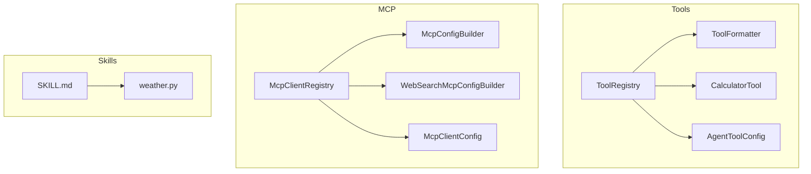
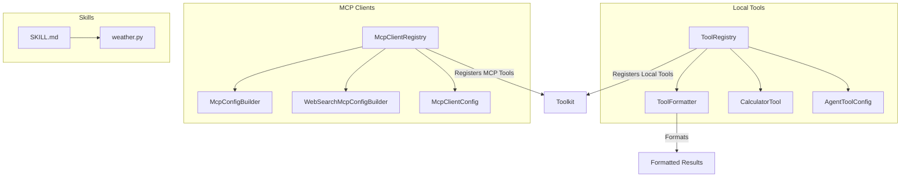
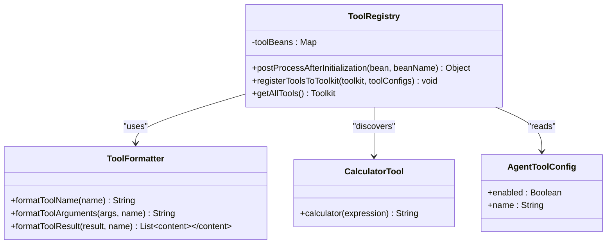
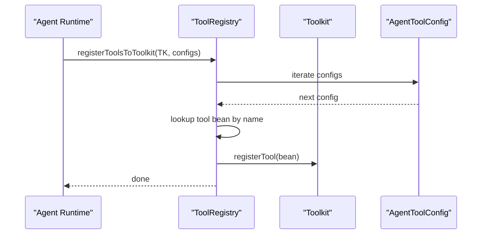
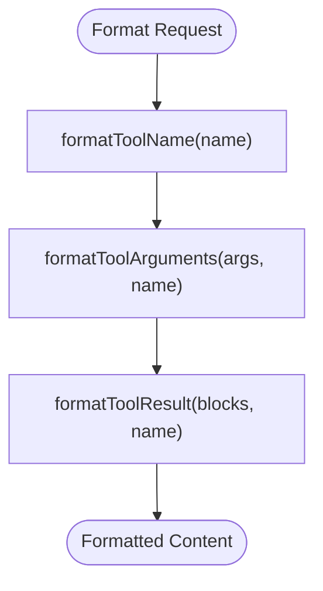
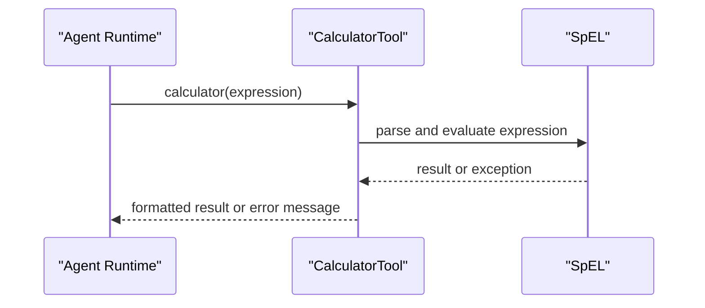
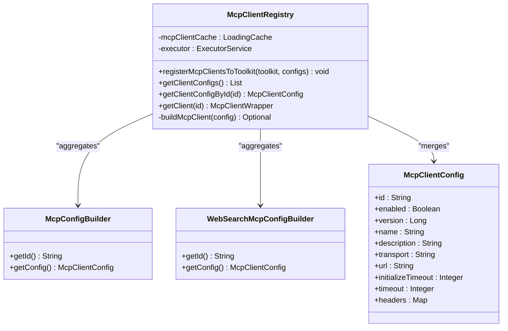
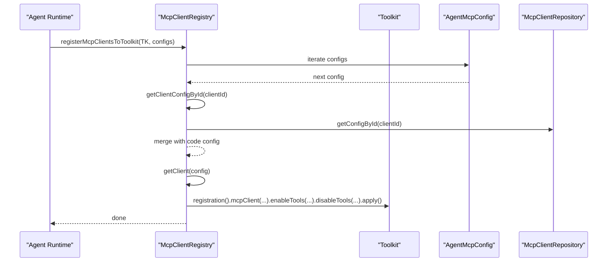
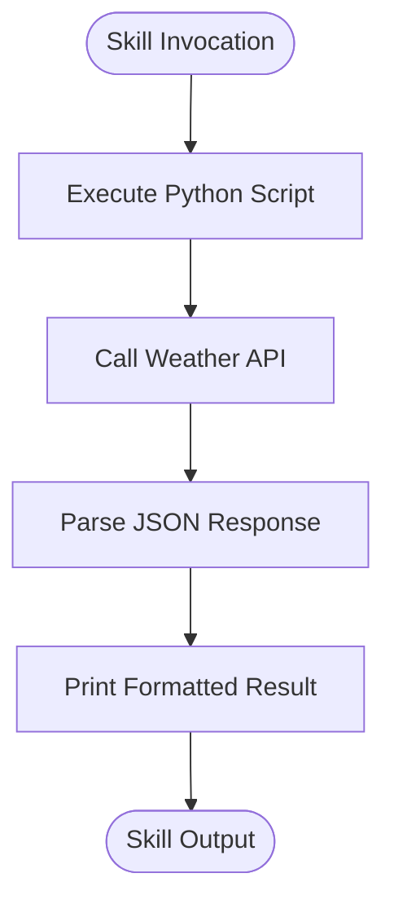
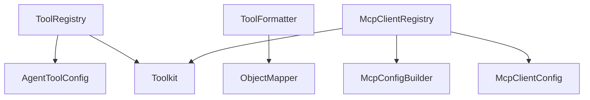

# Tools and Skills System

<cite>
**Referenced Files in This Document**
- [ToolRegistry.java](file://backend_java/core/src/main/java/com/aliyun/tam/x/tron/core/tools/ToolRegistry.java)
- [ToolFormatter.java](file://backend_java/core/src/main/java/com/aliyun/tam/x/tron/core/tools/ToolFormatter.java)
- [CalculatorTool.java](file://backend_java/core/src/main/java/com/aliyun/tam/x/tron/core/tools/CalculatorTool.java)
- [AgentToolConfig.java](file://backend_java/core/src/main/java/com/aliyun/tam/x/tron/core/config/AgentToolConfig.java)
- [AgentSkillConfig.java](file://backend_java/core/src/main/java/com/aliyun/tam/x/tron/core/config/AgentSkillConfig.java)
- [McpClientRegistry.java](file://backend_java/core/src/main/java/com/aliyun/tam/x/tron/core/mcp/McpClientRegistry.java)
- [McpConfigBuilder.java](file://backend_java/core/src/main/java/com/aliyun/tam/x/tron/core/mcp/McpConfigBuilder.java)
- [WebSearchMcpConfigBuilder.java](file://backend_java/core/src/main/java/com/aliyun/tam/x/tron/core/mcp/WebSearchMcpConfigBuilder.java)
- [McpClientConfig.java](file://backend_java/core/src/main/java/com/aliyun/tam/x/tron/core/config/McpClientConfig.java)
- [weather.py](file://backend_java/skills/weather/scripts/weather.py)
- [SKILL.md](file://backend_java/skills/weather/SKILL.md)
- [README.md](file://README.md)
</cite>

## Table of Contents
1. [Introduction](#introduction)
2. [Project Structure](#project-structure)
3. [Core Components](#core-components)
4. [Architecture Overview](#architecture-overview)
5. [Detailed Component Analysis](#detailed-component-analysis)
6. [Dependency Analysis](#dependency-analysis)
7. [Performance Considerations](#performance-considerations)
8. [Troubleshooting Guide](#troubleshooting-guide)
9. [Conclusion](#conclusion)
10. [Appendices](#appendices)

## Introduction
This document explains the extensible tools and skills system in Tron OneAgent. It covers:
- The ToolRegistry architecture for dynamic tool discovery and registration into a Toolkit
- The ToolFormatter interface for formatting tool names, arguments, and results
- The skill system enabling Python-based extensions, illustrated by the weather skill
- MCP (Model Context Protocol) integration for connecting external services and third-party tools
- The tool development lifecycle: registration, configuration, execution context management, and result processing
- Practical examples for creating custom tools, implementing Python skills, integrating external APIs, and handling tool errors
- Security considerations, performance optimization, and best practices for composing and reusing tools

## Project Structure
The tools and skills system spans several packages:
- tools: ToolRegistry, ToolFormatter, CalculatorTool, and AgentToolConfig
- mcp: McpClientRegistry, McpConfigBuilder, WebSearchMcpConfigBuilder, and McpClientConfig
- skills: Python-based skills such as weather skill
- config: AgentToolConfig, AgentSkillConfig, and McpClientConfig

**Diagram sources**
- [ToolRegistry.java:35-76](file://backend_java/core/src/main/java/com/aliyun/tam/x/tron/core/tools/ToolRegistry.java#L35-L76)
- [ToolFormatter.java:41-148](file://backend_java/core/src/main/java/com/aliyun/tam/x/tron/core/tools/ToolFormatter.java#L41-L148)
- [CalculatorTool.java:29-49](file://backend_java/core/src/main/java/com/aliyun/tam/x/tron/core/tools/CalculatorTool.java#L29-L49)
- [AgentToolConfig.java:32-43](file://backend_java/core/src/main/java/com/aliyun/tam/x/tron/core/config/AgentToolConfig.java#L32-L43)
- [McpClientRegistry.java:49-217](file://backend_java/core/src/main/java/com/aliyun/tam/x/tron/core/mcp/McpClientRegistry.java#L49-L217)
- [McpConfigBuilder.java:22-26](file://backend_java/core/src/main/java/com/aliyun/tam/x/tron/core/mcp/McpConfigBuilder.java#L22-L26)
- [WebSearchMcpConfigBuilder.java:29-56](file://backend_java/core/src/main/java/com/aliyun/tam/x/tron/core/mcp/WebSearchMcpConfigBuilder.java#L29-L56)
- [McpClientConfig.java:35-93](file://backend_java/core/src/main/java/com/aliyun/tam/x/tron/core/config/McpClientConfig.java#L35-L93)
- [weather.py:1-12](file://backend_java/skills/weather/scripts/weather.py#L1-L12)
- [SKILL.md:1-32](file://backend_java/skills/weather/SKILL.md#L1-L32)

**Section sources**
- [README.md:56-94](file://README.md#L56-L94)

## Core Components
- ToolRegistry: Discovers tools annotated with a specific annotation and registers them into a Toolkit based on AgentToolConfig entries. It leverages Spring’s BeanPostProcessor to scan beans after initialization and stores tool instances keyed by bean name.
- ToolFormatter: Formats tool names for display, argument summaries for readability, and transforms raw tool results into structured content blocks suitable for downstream consumption.
- CalculatorTool: Demonstrates a simple tool implementation using the Tool annotation and ToolParam parameters, with basic error handling returning a user-friendly message on failure.
- AgentToolConfig and AgentSkillConfig: Lightweight configuration DTOs controlling whether a tool or skill is enabled and identifying it by name.
- McpClientRegistry: Central registry for MCP clients, building and caching wrappers, merging runtime and database configurations, and registering MCP-enabled tools into a Toolkit with enable/disable filters.
- McpConfigBuilder and WebSearchMcpConfigBuilder: Builders that produce McpClientConfig instances, including transport type, URL, headers, and timeouts.
- McpClientConfig: Configuration model for MCP clients, including ID, name, description, transport, URL, timeouts, and encrypted headers.
- Weather Skill: A Python script packaged as a skill with a markdown descriptor detailing inputs, examples, and scripts.

**Section sources**
- [ToolRegistry.java:35-76](file://backend_java/core/src/main/java/com/aliyun/tam/x/tron/core/tools/ToolRegistry.java#L35-L76)
- [ToolFormatter.java:41-148](file://backend_java/core/src/main/java/com/aliyun/tam/x/tron/core/tools/ToolFormatter.java#L41-L148)
- [CalculatorTool.java:29-49](file://backend_java/core/src/main/java/com/aliyun/tam/x/tron/core/tools/CalculatorTool.java#L29-L49)
- [AgentToolConfig.java:32-43](file://backend_java/core/src/main/java/com/aliyun/tam/x/tron/core/config/AgentToolConfig.java#L32-L43)
- [AgentSkillConfig.java:32-43](file://backend_java/core/src/main/java/com/aliyun/tam/x/tron/core/config/AgentSkillConfig.java#L32-L43)
- [McpClientRegistry.java:49-217](file://backend_java/core/src/main/java/com/aliyun/tam/x/tron/core/mcp/McpClientRegistry.java#L49-L217)
- [McpConfigBuilder.java:22-26](file://backend_java/core/src/main/java/com/aliyun/tam/x/tron/core/mcp/McpConfigBuilder.java#L22-L26)
- [WebSearchMcpConfigBuilder.java:29-56](file://backend_java/core/src/main/java/com/aliyun/tam/x/tron/core/mcp/WebSearchMcpConfigBuilder.java#L29-L56)
- [McpClientConfig.java:35-93](file://backend_java/core/src/main/java/com/aliyun/tam/x/tron/core/config/McpClientConfig.java#L35-L93)
- [weather.py:1-12](file://backend_java/skills/weather/scripts/weather.py#L1-L12)
- [SKILL.md:1-32](file://backend_java/skills/weather/SKILL.md#L1-L32)

## Architecture Overview
The system integrates three extension points:
- Local Java tools discovered and registered via ToolRegistry
- MCP clients that expose external toolsets via McpClientRegistry
- Python-based skills executed as external processes

**Diagram sources**
- [ToolRegistry.java:35-76](file://backend_java/core/src/main/java/com/aliyun/tam/x/tron/core/tools/ToolRegistry.java#L35-L76)
- [ToolFormatter.java:41-148](file://backend_java/core/src/main/java/com/aliyun/tam/x/tron/core/tools/ToolFormatter.java#L41-L148)
- [CalculatorTool.java:29-49](file://backend_java/core/src/main/java/com/aliyun/tam/x/tron/core/tools/CalculatorTool.java#L29-L49)
- [AgentToolConfig.java:32-43](file://backend_java/core/src/main/java/com/aliyun/tam/x/tron/core/config/AgentToolConfig.java#L32-L43)
- [McpClientRegistry.java:49-217](file://backend_java/core/src/main/java/com/aliyun/tam/x/tron/core/mcp/McpClientRegistry.java#L49-L217)
- [McpConfigBuilder.java:22-26](file://backend_java/core/src/main/java/com/aliyun/tam/x/tron/core/mcp/McpConfigBuilder.java#L22-L26)
- [WebSearchMcpConfigBuilder.java:29-56](file://backend_java/core/src/main/java/com/aliyun/tam/x/tron/core/mcp/WebSearchMcpConfigBuilder.java#L29-L56)
- [McpClientConfig.java:35-93](file://backend_java/core/src/main/java/com/aliyun/tam/x/tron/core/config/McpClientConfig.java#L35-L93)
- [weather.py:1-12](file://backend_java/skills/weather/scripts/weather.py#L1-L12)
- [SKILL.md:1-32](file://backend_java/skills/weather/SKILL.md#L1-L32)

## Detailed Component Analysis

### ToolRegistry: Dynamic Tool Discovery and Registration
ToolRegistry implements Spring’s BeanPostProcessor to scan beans after initialization. For each bean, it reflects over methods annotated with the Tool annotation and records the bean under its bean name. Later, during agent execution, ToolRegistry registers matching tools into a Toolkit according to AgentToolConfig entries.

**Diagram sources**
- [ToolRegistry.java:35-76](file://backend_java/core/src/main/java/com/aliyun/tam/x/tron/core/tools/ToolRegistry.java#L35-L76)
- [ToolFormatter.java:41-148](file://backend_java/core/src/main/java/com/aliyun/tam/x/tron/core/tools/ToolFormatter.java#L41-L148)
- [CalculatorTool.java:29-49](file://backend_java/core/src/main/java/com/aliyun/tam/x/tron/core/tools/CalculatorTool.java#L29-L49)
- [AgentToolConfig.java:32-43](file://backend_java/core/src/main/java/com/aliyun/tam/x/tron/core/config/AgentToolConfig.java#L32-L43)

Key behaviors:
- Discovery: Scans methods for Tool annotation and stores tool beans keyed by bean name.
- Registration: Iterates AgentToolConfig entries, skipping disabled tools, and registers matching tool beans into the provided Toolkit.
- All-tools: Builds a Toolkit containing all discovered tools.

Operational flow for registration:

**Diagram sources**
- [ToolRegistry.java:52-67](file://backend_java/core/src/main/java/com/aliyun/tam/x/tron/core/tools/ToolRegistry.java#L52-L67)

**Section sources**
- [ToolRegistry.java:35-76](file://backend_java/core/src/main/java/com/aliyun/tam/x/tron/core/tools/ToolRegistry.java#L35-L76)
- [AgentToolConfig.java:32-43](file://backend_java/core/src/main/java/com/aliyun/tam/x/tron/core/config/AgentToolConfig.java#L32-L43)

### ToolFormatter: Name, Arguments, and Result Formatting
ToolFormatter provides localized tool names, concise argument summaries, and structured result rendering tailored to specific tools. It delegates generic formatting to a JSON representation and converts raw content blocks to TextContent for consistent downstream processing.

**Diagram sources**
- [ToolFormatter.java:53-147](file://backend_java/core/src/main/java/com/aliyun/tam/x/tron/core/tools/ToolFormatter.java#L53-L147)

Behavior highlights:
- Name mapping: Maps internal tool identifiers to readable names.
- Argument summary: Produces human-readable summaries for specific tools; falls back to pretty-printed JSON for others.
- Result processing: Parses and formats specialized results (e.g., web search snippets, knowledge retrieval text, shell command outputs) into structured text content.

**Section sources**
- [ToolFormatter.java:41-148](file://backend_java/core/src/main/java/com/aliyun/tam/x/tron/core/tools/ToolFormatter.java#L41-L148)

### CalculatorTool: Simple Tool Implementation
CalculatorTool demonstrates a minimal tool with:
- A Tool-annotated method that accepts a mathematical expression via ToolParam
- Safe evaluation using Spring Expression Language (SpEL)
- Graceful error handling returning a user-friendly message

**Diagram sources**
- [CalculatorTool.java:31-48](file://backend_java/core/src/main/java/com/aliyun/tam/x/tron/core/tools/CalculatorTool.java#L31-L48)

**Section sources**
- [CalculatorTool.java:29-49](file://backend_java/core/src/main/java/com/aliyun/tam/x/tron/core/tools/CalculatorTool.java#L29-L49)

### MCP Integration: McpClientRegistry and Builders
McpClientRegistry manages MCP clients with:
- A configurable thread pool and a cache with expiration and removal listeners
- Merging runtime and database configurations via McpConfigBuilder and repository
- Building clients for SSE or HTTP transports, initializing them, and listing available tools
- Registering MCP tools into a Toolkit with per-client enable/disable filters

**Diagram sources**
- [McpClientRegistry.java:49-217](file://backend_java/core/src/main/java/com/aliyun/tam/x/tron/core/mcp/McpClientRegistry.java#L49-L217)
- [McpConfigBuilder.java:22-26](file://backend_java/core/src/main/java/com/aliyun/tam/x/tron/core/mcp/McpConfigBuilder.java#L22-L26)
- [WebSearchMcpConfigBuilder.java:29-56](file://backend_java/core/src/main/java/com/aliyun/tam/x/tron/core/mcp/WebSearchMcpConfigBuilder.java#L29-L56)
- [McpClientConfig.java:35-93](file://backend_java/core/src/main/java/com/aliyun/tam/x/tron/core/config/McpClientConfig.java#L35-L93)

Operational flow for registering MCP tools:

**Diagram sources**
- [McpClientRegistry.java:102-128](file://backend_java/core/src/main/java/com/aliyun/tam/x/tron/core/mcp/McpClientRegistry.java#L102-L128)

**Section sources**
- [McpClientRegistry.java:49-217](file://backend_java/core/src/main/java/com/aliyun/tam/x/tron/core/mcp/McpClientRegistry.java#L49-L217)
- [McpConfigBuilder.java:22-26](file://backend_java/core/src/main/java/com/aliyun/tam/x/tron/core/mcp/McpConfigBuilder.java#L22-L26)
- [WebSearchMcpConfigBuilder.java:29-56](file://backend_java/core/src/main/java/com/aliyun/tam/x/tron/core/mcp/WebSearchMcpConfigBuilder.java#L29-L56)
- [McpClientConfig.java:35-93](file://backend_java/core/src/main/java/com/aliyun/tam/x/tron/core/config/McpClientConfig.java#L35-L93)

### Skills System: Python-Based Extensions (Weather Skill)
The weather skill demonstrates a Python-based extension packaged as a skill:
- A Python script that queries a weather API and prints a formatted message
- A markdown descriptor specifying inputs, examples, and scripts

**Diagram sources**
- [weather.py:6-12](file://backend_java/skills/weather/scripts/weather.py#L6-L12)
- [SKILL.md:8-26](file://backend_java/skills/weather/SKILL.md#L8-L26)

Practical usage:
- The skill’s markdown describes how to run the script with a city parameter and shows expected output.
- Integration into the system is managed by the broader skill configuration and execution pipeline.

**Section sources**
- [weather.py:1-12](file://backend_java/skills/weather/scripts/weather.py#L1-L12)
- [SKILL.md:1-32](file://backend_java/skills/weather/SKILL.md#L1-L32)

## Dependency Analysis
- ToolRegistry depends on:
  - Tool annotation presence via reflection
  - AgentToolConfig for enabling/disabling tools
  - Toolkit for registration
- ToolFormatter depends on:
  - ObjectMapper for JSON serialization
  - Conversion utilities for content blocks
- McpClientRegistry depends on:
  - McpConfigBuilder implementations
  - McpClientRepository for database-backed configs
  - Guava caches and reactive scheduling for client lifecycle
  - Toolkit for MCP tool registration

**Diagram sources**
- [ToolRegistry.java:35-76](file://backend_java/core/src/main/java/com/aliyun/tam/x/tron/core/tools/ToolRegistry.java#L35-L76)
- [ToolFormatter.java:51-51](file://backend_java/core/src/main/java/com/aliyun/tam/x/tron/core/tools/ToolFormatter.java#L51-L51)
- [McpClientRegistry.java:49-217](file://backend_java/core/src/main/java/com/aliyun/tam/x/tron/core/mcp/McpClientRegistry.java#L49-L217)
- [McpConfigBuilder.java:22-26](file://backend_java/core/src/main/java/com/aliyun/tam/x/tron/core/mcp/McpConfigBuilder.java#L22-L26)
- [McpClientConfig.java:35-93](file://backend_java/core/src/main/java/com/aliyun/tam/x/tron/core/config/McpClientConfig.java#L35-L93)

**Section sources**
- [ToolRegistry.java:35-76](file://backend_java/core/src/main/java/com/aliyun/tam/x/tron/core/tools/ToolRegistry.java#L35-L76)
- [ToolFormatter.java:51-51](file://backend_java/core/src/main/java/com/aliyun/tam/x/tron/core/tools/ToolFormatter.java#L51-L51)
- [McpClientRegistry.java:49-217](file://backend_java/core/src/main/java/com/aliyun/tam/x/tron/core/mcp/McpClientRegistry.java#L49-L217)
- [McpConfigBuilder.java:22-26](file://backend_java/core/src/main/java/com/aliyun/tam/x/tron/core/mcp/McpConfigBuilder.java#L22-L26)
- [McpClientConfig.java:35-93](file://backend_java/core/src/main/java/com/aliyun/tam/x/tron/core/config/McpClientConfig.java#L35-L93)

## Performance Considerations
- ToolRegistry
  - Uses concurrent map for tool beans to avoid synchronization overhead during registration
  - Registration is O(n) over configured tools
- ToolFormatter
  - JSON serialization occurs only for generic cases; specialized tools avoid extra parsing
  - Stream-based aggregation of text blocks minimizes intermediate allocations
- McpClientRegistry
  - Caching with expiration reduces repeated client builds
  - Asynchronous initialization and tool listing prevent blocking the main thread
  - Thread pool limits concurrency while allowing background rebuilds

[No sources needed since this section provides general guidance]

## Troubleshooting Guide
Common issues and remedies:
- Tool not found during registration
  - Verify the Tool annotation is present on the method and the bean name matches AgentToolConfig.name
  - Confirm the tool bean is initialized and scanned by ToolRegistry
- Tool fails with an error
  - Inspect ToolFormatter’s fallback JSON summary to locate problematic arguments
  - Review CalculatorTool’s error handling pattern for guidance
- MCP client not available
  - Check McpClientRegistry’s cache and logs for build/rebuild attempts
  - Validate transport type, URL, and headers in McpClientConfig
  - Ensure McpConfigBuilder produces a non-null configuration and credentials are set

**Section sources**
- [ToolRegistry.java:52-67](file://backend_java/core/src/main/java/com/aliyun/tam/x/tron/core/tools/ToolRegistry.java#L52-L67)
- [ToolFormatter.java:78-100](file://backend_java/core/src/main/java/com/aliyun/tam/x/tron/core/tools/ToolFormatter.java#L78-L100)
- [CalculatorTool.java:45-48](file://backend_java/core/src/main/java/com/aliyun/tam/x/tron/core/tools/CalculatorTool.java#L45-L48)
- [McpClientRegistry.java:175-211](file://backend_java/core/src/main/java/com/aliyun/tam/x/tron/core/mcp/McpClientRegistry.java#L175-L211)
- [McpClientConfig.java:89-92](file://backend_java/core/src/main/java/com/aliyun/tam/x/tron/core/config/McpClientConfig.java#L89-L92)

## Conclusion
Tron OneAgent’s tools and skills system combines local Java tools, MCP-integrated external services, and Python-based skills into a cohesive, extensible framework. ToolRegistry and ToolFormatter provide robust discovery, registration, and presentation of tools, while McpClientRegistry offers dynamic integration with external providers. The weather skill exemplifies a practical Python extension. Together, these components support secure, performant, and reusable tool compositions across diverse use cases.

[No sources needed since this section summarizes without analyzing specific files]

## Appendices

### Tool Development Lifecycle Checklist
- Define a Tool-annotated method with ToolParam parameters
- Ensure the bean is discoverable by Spring and registered into Toolkit via ToolRegistry
- Configure AgentToolConfig to enable the tool by name
- Use ToolFormatter to present readable names, arguments, and results
- For MCP tools, configure McpClientConfig and use McpClientRegistry to register tools into Toolkit
- For Python skills, package scripts and metadata in a skill directory and reference them via skill configuration

**Section sources**
- [CalculatorTool.java:31-33](file://backend_java/core/src/main/java/com/aliyun/tam/x/tron/core/tools/CalculatorTool.java#L31-L33)
- [ToolRegistry.java:52-67](file://backend_java/core/src/main/java/com/aliyun/tam/x/tron/core/tools/ToolRegistry.java#L52-L67)
- [ToolFormatter.java:53-100](file://backend_java/core/src/main/java/com/aliyun/tam/x/tron/core/tools/ToolFormatter.java#L53-L100)
- [AgentToolConfig.java:32-43](file://backend_java/core/src/main/java/com/aliyun/tam/x/tron/core/config/AgentToolConfig.java#L32-L43)
- [McpClientRegistry.java:102-128](file://backend_java/core/src/main/java/com/aliyun/tam/x/tron/core/mcp/McpClientRegistry.java#L102-L128)
- [McpClientConfig.java:35-93](file://backend_java/core/src/main/java/com/aliyun/tam/x/tron/core/config/McpClientConfig.java#L35-L93)
- [SKILL.md:1-32](file://backend_java/skills/weather/SKILL.md#L1-L32)