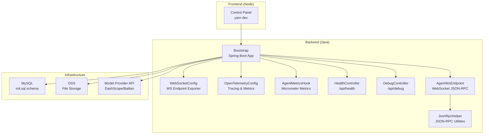
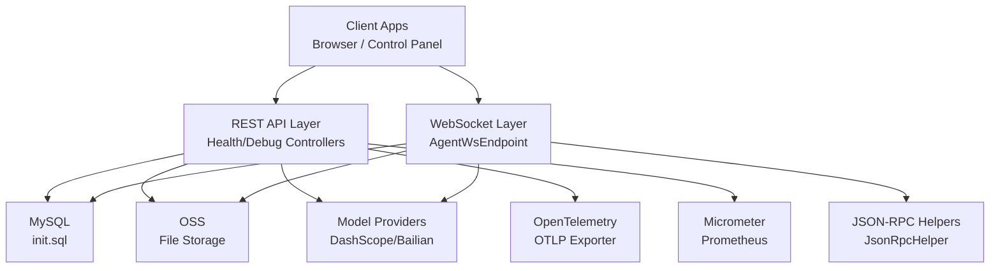
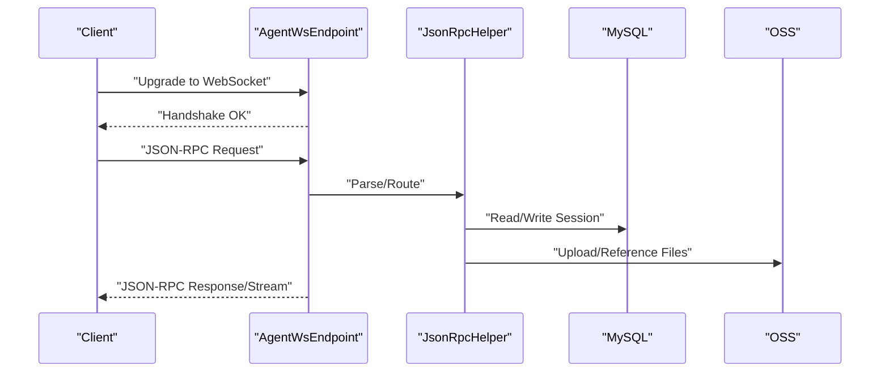
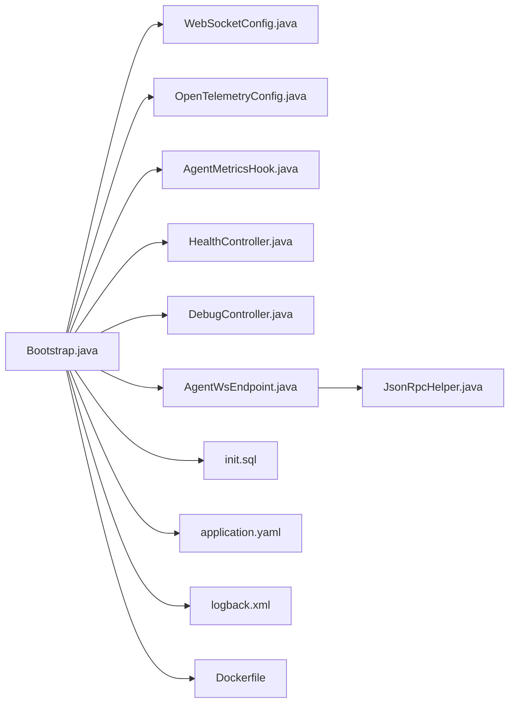
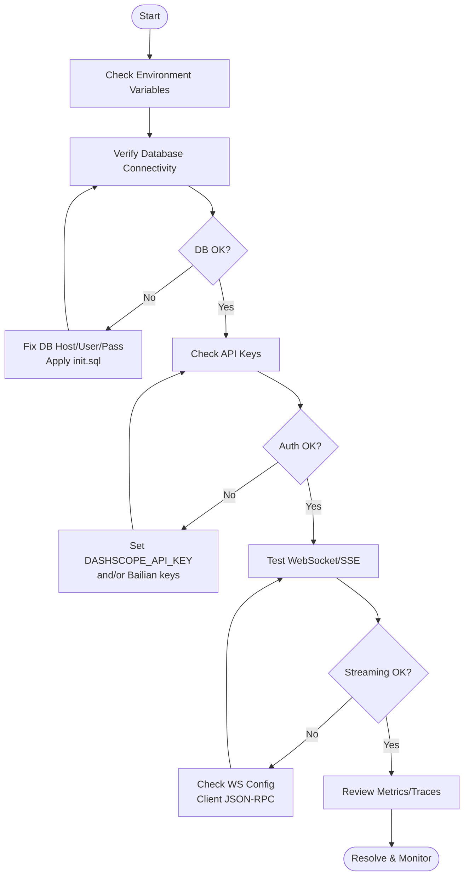

# Troubleshooting and FAQ

<cite>
**Referenced Files in This Document**
- [README_en.md](file://README_en.md)
- [README.md](file://README.md)
- [application.yaml](file://backend_java/bootstrap/src/main/resources/application.yaml)
- [logback.xml](file://backend_java/bootstrap/src/main/resources/logback.xml)
- [Dockerfile](file://backend_java/Dockerfile)
- [init.sql](file://backend_java/bootstrap/src/main/resources/schema/init.sql)
- [Bootstrap.java](file://backend_java/bootstrap/src/main/java/com/aliyun/tam/x/tron/Bootstrap.java)
- [WebSocketConfig.java](file://backend_java/bootstrap/src/main/java/com/aliyun/tam/x/tron/config/WebSocketConfig.java)
- [OpenTelemetryConfig.java](file://backend_java/bootstrap/src/main/java/com/aliyun/tam/x/tron/config/OpenTelemetryConfig.java)
- [AgentMetricsHook.java](file://backend_java/core/src/main/java/com/aliyun/tam/x/tron/core/utils/AgentMetricsHook.java)
- [HealthController.java](file://backend_java/api/src/main/java/com/aliyun/tam/x/tron/api/HealthController.java)
- [DebugController.java](file://backend_java/api/src/main/java/com/aliyun/tam/x/tron/api/DebugController.java)
- [AgentWsEndpoint.java](file://backend_java/api/src/main/java/com/aliyun/tam/x/tron/ws/AgentWsEndpoint.java)
- [JsonRpcHelper.java](file://backend_java/api/src/main/java/com/aliyun/tam/x/tron/ws/jsonrpc/JsonRpcHelper.java)
</cite>

## Table of Contents
1. [Introduction](#introduction)
2. [Project Structure](#project-structure)
3. [Core Components](#core-components)
4. [Architecture Overview](#architecture-overview)
5. [Detailed Component Analysis](#detailed-component-analysis)
6. [Dependency Analysis](#dependency-analysis)
7. [Performance Considerations](#performance-considerations)
8. [Troubleshooting Guide](#troubleshooting-guide)
9. [FAQ](#faq)
10. [Conclusion](#conclusion)
11. [Appendices](#appendices)

## Introduction
This document provides a comprehensive troubleshooting and FAQ guide for Tron OneAgent. It focuses on diagnosing and resolving common issues during setup, configuration, and operation, including database connectivity, API authentication, streaming connection problems, and performance bottlenecks. It also covers debugging techniques using logs, metrics, and tracing data, plus systematic approaches to identifying and resolving problems. Platform-specific and environment-related concerns are addressed alongside integration challenges with external services such as databases, cloud storage, and model providers.

## Project Structure
Tron OneAgent consists of:
- A Spring Boot backend (Java) exposing REST APIs and WebSocket endpoints
- A frontend control panel (Node) for configuration and debugging
- Optional infrastructure integrations (MySQL, OSS, model providers)

**Diagram sources**
- [Bootstrap.java:25-32](file://backend_java/bootstrap/src/main/java/com/aliyun/tam/x/tron/Bootstrap.java#L25-L32)
- [WebSocketConfig.java:24-36](file://backend_java/bootstrap/src/main/java/com/aliyun/tam/x/tron/config/WebSocketConfig.java#L24-L36)
- [OpenTelemetryConfig.java:66-140](file://backend_java/bootstrap/src/main/java/com/aliyun/tam/x/tron/config/OpenTelemetryConfig.java#L66-L140)
- [AgentMetricsHook.java:34-89](file://backend_java/core/src/main/java/com/aliyun/tam/x/tron/core/utils/AgentMetricsHook.java#L34-L89)
- [HealthController.java](file://backend_java/api/src/main/java/com/aliyun/tam/x/tron/api/HealthController.java)
- [DebugController.java](file://backend_java/api/src/main/java/com/aliyun/tam/x/tron/api/DebugController.java)
- [AgentWsEndpoint.java](file://backend_java/api/src/main/java/com/aliyun/tam/x/tron/ws/AgentWsEndpoint.java)
- [JsonRpcHelper.java](file://backend_java/api/src/main/java/com/aliyun/tam/x/tron/ws/jsonrpc/JsonRpcHelper.java)
- [init.sql:15-207](file://backend_java/bootstrap/src/main/resources/schema/init.sql#L15-L207)
- [application.yaml:1-63](file://backend_java/bootstrap/src/main/resources/application.yaml#L1-L63)

**Section sources**
- [README_en.md:57-94](file://README_en.md#L57-L94)
- [README.md:56-93](file://README.md#L56-L93)

## Core Components
- Backend application bootstrap and configuration
- WebSocket streaming endpoints and JSON-RPC helpers
- OpenTelemetry tracing and Micrometer metrics
- Health and debug endpoints
- Database schema and environment configuration

Key configuration and runtime aspects:
- Application port, context path, and multipart limits
- Database connection via JDBC with environment variables
- File storage provider selection and OSS configuration
- Model provider credentials for DashScope/Bailian
- Management endpoints for health, metrics, and Prometheus scraping
- OpenTelemetry tracing configuration and sampler behavior
- Micrometer metrics hooks for agent reasoning, acting, and usage

**Section sources**
- [application.yaml:1-63](file://backend_java/bootstrap/src/main/resources/application.yaml#L1-L63)
- [logback.xml:1-38](file://backend_java/bootstrap/src/main/resources/logback.xml#L1-L38)
- [Dockerfile:1-18](file://backend_java/Dockerfile#L1-L18)
- [OpenTelemetryConfig.java:66-140](file://backend_java/bootstrap/src/main/java/com/aliyun/tam/x/tron/config/OpenTelemetryConfig.java#L66-L140)
- [AgentMetricsHook.java:34-114](file://backend_java/core/src/main/java/com/aliyun/tam/x/tron/core/utils/AgentMetricsHook.java#L34-L114)
- [init.sql:15-207](file://backend_java/bootstrap/src/main/resources/schema/init.sql#L15-L207)

## Architecture Overview
The backend exposes REST APIs and WebSocket endpoints for streaming interactions. It integrates with MySQL for persistence, OSS for file storage, and model providers for LLM inference. OpenTelemetry is configured for tracing, and Micrometer for metrics. The frontend control panel communicates with the backend over HTTP.

**Diagram sources**
- [HealthController.java](file://backend_java/api/src/main/java/com/aliyun/tam/x/tron/api/HealthController.java)
- [DebugController.java](file://backend_java/api/src/main/java/com/aliyun/tam/x/tron/api/DebugController.java)
- [AgentWsEndpoint.java](file://backend_java/api/src/main/java/com/aliyun/tam/x/tron/ws/AgentWsEndpoint.java)
- [JsonRpcHelper.java](file://backend_java/api/src/main/java/com/aliyun/tam/x/tron/ws/jsonrpc/JsonRpcHelper.java)
- [init.sql:15-207](file://backend_java/bootstrap/src/main/resources/schema/init.sql#L15-L207)
- [application.yaml:1-63](file://backend_java/bootstrap/src/main/resources/application.yaml#L1-L63)
- [OpenTelemetryConfig.java:120-139](file://backend_java/bootstrap/src/main/java/com/aliyun/tam/x/tron/config/OpenTelemetryConfig.java#L120-L139)
- [AgentMetricsHook.java:34-114](file://backend_java/core/src/main/java/com/aliyun/tam/x/tron/core/utils/AgentMetricsHook.java#L34-L114)

## Detailed Component Analysis

### Database Connectivity
Common symptoms:
- Application fails to start or throws connection errors
- Session/message persistence issues
- Schema mismatch or missing tables

Diagnostic steps:
- Verify environment variables for database host, port, name, user, and password
- Confirm MySQL availability and network accessibility
- Ensure the schema initialization SQL has been applied
- Review application logs for JDBC exceptions

Resolution tips:
- Set DB_HOST, DB_PORT, DB_NAME, DB_USER, DB_PASS before startup
- Apply the schema using the provided initialization script
- Check firewall/security group rules if connecting remotely
- Validate MySQL version compatibility

**Section sources**
- [application.yaml:9-13](file://backend_java/bootstrap/src/main/resources/application.yaml#L9-L13)
- [init.sql:15-207](file://backend_java/bootstrap/src/main/resources/schema/init.sql#L15-L207)
- [logback.xml:31-37](file://backend_java/bootstrap/src/main/resources/logback.xml#L31-L37)

### API Authentication Failures
Common symptoms:
- Unauthorized or invalid API key responses when invoking model providers
- 401/403 responses from backend endpoints

Diagnostic steps:
- Confirm DASHSCOPE_API_KEY is set
- Validate Bailian credentials if using RAG features
- Check model provider quotas and account status
- Inspect backend logs for authentication-related errors

Resolution tips:
- Export the required API keys before starting the backend
- Use a valid model provider account and ensure sufficient credits
- Re-export keys if changed externally

**Section sources**
- [application.yaml:33-34](file://backend_java/bootstrap/src/main/resources/application.yaml#L33-L34)
- [application.yaml:35-39](file://backend_java/bootstrap/src/main/resources/application.yaml#L35-L39)

### Streaming Connection Issues (WebSocket and SSE)
Common symptoms:
- WebSocket handshake failures
- Streaming stops mid-conversation
- JSON-RPC parsing errors

Diagnostic steps:
- Verify WebSocket configuration is enabled and beans are loaded
- Check browser/network console for WS upgrade failures
- Validate JSON-RPC payload and helper logic
- Monitor backend logs for endpoint exceptions

Resolution tips:
- Ensure the WebSocket endpoint exporter is present in the servlet environment
- Confirm client-side JSON-RPC compliance
- Restart backend after configuration changes

**Diagram sources**
- [WebSocketConfig.java:24-36](file://backend_java/bootstrap/src/main/java/com/aliyun/tam/x/tron/config/WebSocketConfig.java#L24-L36)
- [AgentWsEndpoint.java](file://backend_java/api/src/main/java/com/aliyun/tam/x/tron/ws/AgentWsEndpoint.java)
- [JsonRpcHelper.java](file://backend_java/api/src/main/java/com/aliyun/tam/x/tron/ws/jsonrpc/JsonRpcHelper.java)
- [init.sql:61-110](file://backend_java/bootstrap/src/main/resources/schema/init.sql#L61-L110)
- [application.yaml:39-49](file://backend_java/bootstrap/src/main/resources/application.yaml#L39-L49)

**Section sources**
- [WebSocketConfig.java:24-36](file://backend_java/bootstrap/src/main/java/com/aliyun/tam/x/tron/config/WebSocketConfig.java#L24-L36)
- [AgentWsEndpoint.java](file://backend_java/api/src/main/java/com/aliyun/tam/x/tron/ws/AgentWsEndpoint.java)
- [JsonRpcHelper.java](file://backend_java/api/src/main/java/com/aliyun/tam/x/tron/ws/jsonrpc/JsonRpcHelper.java)

### Performance Bottlenecks
Common symptoms:
- Slow response times
- High CPU/memory usage
- Excessive database queries or file uploads

Diagnostic steps:
- Collect metrics from management endpoints
- Enable OpenTelemetry tracing to identify slow spans
- Monitor agent metrics for tool usage and reasoning durations
- Profile database queries and file transfer speeds

Resolution tips:
- Scale horizontally and optimize model provider usage
- Tune JVM and application thread pools
- Reduce file sizes and leverage CDN for OSS
- Adjust sampling and exporters for tracing overhead

**Section sources**
- [application.yaml:53-63](file://backend_java/bootstrap/src/main/resources/application.yaml#L53-L63)
- [OpenTelemetryConfig.java:105-140](file://backend_java/bootstrap/src/main/java/com/aliyun/tam/x/tron/config/OpenTelemetryConfig.java#L105-L140)
- [AgentMetricsHook.java:34-114](file://backend_java/core/src/main/java/com/aliyun/tam/x/tron/core/utils/AgentMetricsHook.java#L34-L114)

### Logging, Metrics, and Tracing
- Logs: Console and rolling file appenders with trace span ID enrichment
- Metrics: Health, metrics, and Prometheus endpoints exposed for scraping
- Tracing: OTLP HTTP exporter configured with a server-only sampler

Diagnostic steps:
- Tail application logs for error stacks and WARN/ERROR levels
- Scrape Prometheus metrics endpoint for trends
- Export traces to the configured OTLP endpoint for correlation

**Section sources**
- [logback.xml:1-38](file://backend_java/bootstrap/src/main/resources/logback.xml#L1-L38)
- [application.yaml:53-63](file://backend_java/bootstrap/src/main/resources/application.yaml#L53-L63)
- [OpenTelemetryConfig.java:120-139](file://backend_java/bootstrap/src/main/java/com/aliyun/tam/x/tron/config/OpenTelemetryConfig.java#L120-L139)

## Dependency Analysis

**Diagram sources**
- [Bootstrap.java:25-32](file://backend_java/bootstrap/src/main/java/com/aliyun/tam/x/tron/Bootstrap.java#L25-L32)
- [WebSocketConfig.java:24-36](file://backend_java/bootstrap/src/main/java/com/aliyun/tam/x/tron/config/WebSocketConfig.java#L24-L36)
- [OpenTelemetryConfig.java:66-140](file://backend_java/bootstrap/src/main/java/com/aliyun/tam/x/tron/config/OpenTelemetryConfig.java#L66-L140)
- [AgentMetricsHook.java:34-114](file://backend_java/core/src/main/java/com/aliyun/tam/x/tron/core/utils/AgentMetricsHook.java#L34-L114)
- [HealthController.java](file://backend_java/api/src/main/java/com/aliyun/tam/x/tron/api/HealthController.java)
- [DebugController.java](file://backend_java/api/src/main/java/com/aliyun/tam/x/tron/api/DebugController.java)
- [AgentWsEndpoint.java](file://backend_java/api/src/main/java/com/aliyun/tam/x/tron/ws/AgentWsEndpoint.java)
- [JsonRpcHelper.java](file://backend_java/api/src/main/java/com/aliyun/tam/x/tron/ws/jsonrpc/JsonRpcHelper.java)
- [init.sql:15-207](file://backend_java/bootstrap/src/main/resources/schema/init.sql#L15-L207)
- [application.yaml:1-63](file://backend_java/bootstrap/src/main/resources/application.yaml#L1-L63)
- [logback.xml:1-38](file://backend_java/bootstrap/src/main/resources/logback.xml#L1-L38)
- [Dockerfile:1-18](file://backend_java/Dockerfile#L1-L18)

**Section sources**
- [application.yaml:1-63](file://backend_java/bootstrap/src/main/resources/application.yaml#L1-L63)
- [init.sql:15-207](file://backend_java/bootstrap/src/main/resources/schema/init.sql#L15-L207)

## Performance Considerations
- Database tuning: ensure proper indexing and connection pooling
- File handling: limit multipart sizes and use CDN-backed URLs
- Model provider costs: monitor token usage and latency via metrics
- Tracing overhead: keep sampling conservative in production
- Container sizing: allocate adequate CPU/memory in containerized deployments

[No sources needed since this section provides general guidance]

## Troubleshooting Guide

### Systematic Troubleshooting Flow

[No sources needed since this diagram shows conceptual workflow, not actual code structure]

### Database Connectivity Problems
- Symptoms: startup errors, persistence failures
- Checks: DB_HOST/PORT/NAME/USER/PASS, schema applied, network access
- Actions: re-export env vars, apply init.sql, verify network/firewall

**Section sources**
- [application.yaml:9-13](file://backend_java/bootstrap/src/main/resources/application.yaml#L9-L13)
- [init.sql:15-207](file://backend_java/bootstrap/src/main/resources/schema/init.sql#L15-L207)

### API Authentication Failures
- Symptoms: unauthorized responses from model providers
- Checks: DASHSCOPE_API_KEY, Bailian keys, quota status
- Actions: export correct keys, validate provider accounts

**Section sources**
- [application.yaml:33-39](file://backend_java/bootstrap/src/main/resources/application.yaml#L33-L39)

### Streaming Connection Issues
- Symptoms: handshake failures, stream interruptions
- Checks: WebSocket exporter, JSON-RPC compliance, backend logs
- Actions: confirm servlet environment, fix client payloads

**Section sources**
- [WebSocketConfig.java:24-36](file://backend_java/bootstrap/src/main/java/com/aliyun/tam/x/tron/config/WebSocketConfig.java#L24-L36)
- [AgentWsEndpoint.java](file://backend_java/api/src/main/java/com/aliyun/tam/x/tron/ws/AgentWsEndpoint.java)
- [JsonRpcHelper.java](file://backend_java/api/src/main/java/com/aliyun/tam/x/tron/ws/jsonrpc/JsonRpcHelper.java)

### Performance Bottlenecks
- Symptoms: slow responses, high resource usage
- Checks: metrics, traces, DB/file throughput
- Actions: scale out, optimize queries, reduce payload sizes

**Section sources**
- [application.yaml:53-63](file://backend_java/bootstrap/src/main/resources/application.yaml#L53-L63)
- [OpenTelemetryConfig.java:105-140](file://backend_java/bootstrap/src/main/java/com/aliyun/tam/x/tron/config/OpenTelemetryConfig.java#L105-L140)
- [AgentMetricsHook.java:34-114](file://backend_java/core/src/main/java/com/aliyun/tam/x/tron/core/utils/AgentMetricsHook.java#L34-L114)

### Debugging Techniques
- Logs: inspect console and rolling file logs with trace span IDs
- Metrics: scrape Prometheus endpoint for trends and anomalies
- Traces: export OTLP spans and correlate with logs and metrics

**Section sources**
- [logback.xml:1-38](file://backend_java/bootstrap/src/main/resources/logback.xml#L1-L38)
- [application.yaml:53-63](file://backend_java/bootstrap/src/main/resources/application.yaml#L53-L63)
- [OpenTelemetryConfig.java:120-139](file://backend_java/bootstrap/src/main/java/com/aliyun/tam/x/tron/config/OpenTelemetryConfig.java#L120-L139)

### Error Message Interpretation
- JDBC connection errors: usually indicate wrong DB credentials or unreachable host
- 401/403 responses: missing or invalid API keys for model providers
- WebSocket upgrade failures: misconfigured endpoints or client-side issues
- JSON-RPC parse errors: malformed requests or incompatible client libraries

**Section sources**
- [application.yaml:9-13](file://backend_java/bootstrap/src/main/resources/application.yaml#L9-L13)
- [application.yaml:33-39](file://backend_java/bootstrap/src/main/resources/application.yaml#L33-L39)
- [WebSocketConfig.java:24-36](file://backend_java/bootstrap/src/main/java/com/aliyun/tam/x/tron/config/WebSocketConfig.java#L24-L36)
- [JsonRpcHelper.java](file://backend_java/api/src/main/java/com/aliyun/tam/x/tron/ws/jsonrpc/JsonRpcHelper.java)

### Diagnostic Commands
- Health check: GET /api/health
- Metrics: GET /api/metrics (Prometheus format)
- Debug endpoints: /api/debug (as implemented by the backend)
- Container logs: docker logs <container>

Note: Replace placeholders with actual endpoint paths as defined in the backend.

**Section sources**
- [HealthController.java](file://backend_java/api/src/main/java/com/aliyun/tam/x/tron/api/HealthController.java)
- [application.yaml:53-63](file://backend_java/bootstrap/src/main/resources/application.yaml#L53-L63)

### Escalation Procedures and Support
- Capture logs, metrics, and traces for the incident window
- Provide environment details: OS, Java version, database version, deployment method
- Open an issue with reproducible steps and collected artifacts
- Engage community channels for initial assistance

[No sources needed since this section summarizes without analyzing specific files]

## FAQ

Q: What are the minimum system requirements?
- Java 17+, Node 18+, MySQL 5.7+/8.0+, and sufficient disk space for logs and files.

Q: How do I configure file storage for multimodal features?
- Set OSS bucket, region, endpoint, and credentials; provide a base URL for file server.

Q: Can I disable OpenTelemetry or change the OTLP endpoint?
- Yes, configure opentelemetry.enabled and related properties accordingly.

Q: How do I enable Prometheus metrics scraping?
- Expose the management server port and ensure the prometheus endpoint is included.

Q: What ports does the backend use?
- Application port 8080; management port 8091 by default.

Q: How do I initialize the database schema?
- Create the database and run the provided init.sql script.

Q: Are there environment-specific considerations?
- Ensure timezone alignment, network access to external services, and container user permissions.

Q: How do I integrate with model providers?
- Provide API keys for DashScope/Bailian and ensure network access to their endpoints.

Q: What logging options are available?
- Console and rolling file appenders with trace span ID enrichment.

Q: How do I troubleshoot WebSocket streaming?
- Verify WebSocket exporter availability and client-side JSON-RPC compliance.

Q: How do I interpret metrics and traces?
- Use Prometheus metrics for trends and OTLP traces for end-to-end correlation.

**Section sources**
- [application.yaml:1-63](file://backend_java/bootstrap/src/main/resources/application.yaml#L1-L63)
- [logback.xml:1-38](file://backend_java/bootstrap/src/main/resources/logback.xml#L1-L38)
- [Dockerfile:1-18](file://backend_java/Dockerfile#L1-L18)
- [init.sql:15-207](file://backend_java/bootstrap/src/main/resources/schema/init.sql#L15-L207)
- [README_en.md:110-140](file://README_en.md#L110-L140)

## Conclusion
This guide consolidates practical troubleshooting and FAQ content for Tron OneAgent. By systematically validating environment configuration, database connectivity, authentication, streaming endpoints, and performance metrics, most operational issues can be identified and resolved quickly. For persistent problems, collect logs, metrics, and traces, and escalate with comprehensive diagnostics.

[No sources needed since this section summarizes without analyzing specific files]

## Appendices

### Appendix A: Environment Variables Reference
- DB_HOST, DB_PORT, DB_NAME, DB_USER, DB_PASS
- DASHSCOPE_API_KEY
- ALIBABA_CLOUD_ACCESS_KEY_ID, ALIBABA_CLOUD_ACCESS_KEY_SECRET
- OSS_BUCKET, OSS_REGION, OSS_ENDPOINT
- FILE_SERVER_BASE_URL
- TRON_ENCRYPT_KEY (optional)

**Section sources**
- [application.yaml:11-51](file://backend_java/bootstrap/src/main/resources/application.yaml#L11-L51)

### Appendix B: Default Ports and Paths
- Application: port 8080, context path /api
- Management: port 8091, endpoints health, metrics, prometheus
- Logs: application.log with rolling policy

**Section sources**
- [application.yaml:1-63](file://backend_java/bootstrap/src/main/resources/application.yaml#L1-L63)
- [logback.xml:16-29](file://backend_java/bootstrap/src/main/resources/logback.xml#L16-L29)