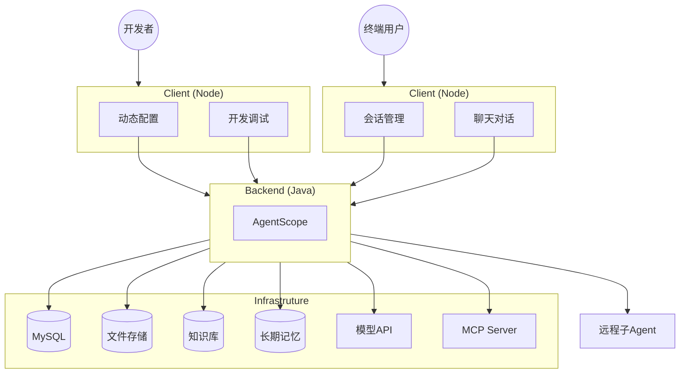

<div align="center">

# Tron OneAgent

[](https://github.com/alibaba/tron-one-agent)
[]()
[]()
[](LICENSE)
[](https://github.com/alibaba/tron-one-agent/stargazers)
[](https://github.com/alibaba/tron-one-agent/network)


<p align="center">
  <a href="README_en.md">English</a>
</p>
</div>

## 简介

Tron OneAgent 是一个企业级 AI Agent 高代码开发框架，提供开箱即用的后端服务与前端交互能力，涵盖 Agent 构建的完整流程。

### 核心特性

- **多智能体架构**：面向业务划分的多智能体架构，支持本地与远程子智能体集成
- **双协议支持**：同时支持 SSE 和 WebSocket 协议，满足不同场景需求，WebSocket 提供更低延迟的实时交互
- **异步事件驱动**：基于异步事件驱动的交互协议，实现纯异步流式输出
- **会话级持久化**：按 Agent → User → Session 三层隔离，提供完整的会话生命周期管理
- **Agent 控制**：支持对话中断（Cancel）功能，用户可随时停止正在执行的 Agent 任务
- **智能建议**：内置 Follow-up Suggestion 功能，自动为用户生成后续对话建议
- **动态配置能力**：无需重启服务即可动态调整配置、工具、MCP、知识库、长期记忆和技能
- **现代化前端**：开箱即用的现代化 UI 界面和丰富的交互组件
- **多模态支持**：除多模态大模型外，还支持外挂 TTS、ASR 功能
- **评估框架**：集成 Dokimos 评估框架，支持 Agent 能力评估与测试

Tron OneAgent 基于 [Alibaba AgentScope Java](https://java.agentscope.io/zh/intro.html) 构建，完全兼容其生态能力。

## 为什么选择 Tron OneAgent

- **开箱即用的企业级特性**：开发者无需从零构建智能体，显著降低开发门槛，提升开发效率
- **灵活的通信协议**：支持 SSE 和 WebSocket 双协议，WebSocket 模式提供更低的延迟和更好的实时性
- **多 Agent 协作**：支持 ReAct 单 Agent 模式，同时支持本地和远程（A2A 协议）多智能体编排，适用于企业多部门协作的复杂场景
- **完善的会话状态管理**：提供完整的会话生命周期管理和纯异步流式输出
- **强大的交互控制**：支持对话中断（Cancel）功能，用户可随时停止 Agent 执行；内置 Follow-up Suggestion 智能推荐后续问题
- **动态配置与调试**：支持热更新配置，便于开发调试和生产环境应急处理
- **丰富的前端交互**：提供开箱即用的现代化 UI 界面和丰富的交互组件
- **多模态能力**：支持语音交互（TTS/ASR），扩展 Agent 的适用场景
- **评估与测试**：集成 Dokimos 评估框架，方便进行 Agent 能力评估和持续优化

## 应用场景

- **企业智能助手**：支持多智能体协作、工具调用、知识库检索的企业级 AI 助手
- **智能客服系统**：支持用户会话隔离、长期记忆、业务系统 API 接入的智能客服解决方案

## 架构



## 技术栈

### 后端技术

| 组件 | 版本 | 说明 |
|------|------|------|
| Spring Boot | 3.5.9 | Web 框架 |
| JDK | 17 | Java 运行环境 |
| AgentScope | 1.0.11 | AI Agent 框架 |
| MyBatis-Plus | 3.5.15 | ORM 框架 |
| MySQL | 5.7+ / 8.0+ | 数据库 |
| A2A SDK | 0.3.2 | Agent-to-Agent 协议 |
| 阿里云百炼 SDK | 2.6.2 | 阿里云 AI 服务 |

### 前端技术

| 组件 | 版本 | 说明 |
|------|------|------|
| React | 18.x | 前端框架 |
| TypeScript | 5.x | 类型检查 |
| Ant Design | 5.x | UI 组件库 |
| Webpack | 5.x | 模块打包器 |
| Yarn | 1.x/2.x | 包管理器 |

## 快速开始（本地部署）

### 启动后端服务

```bash
cd backend_java

# 1. 数据库初始化
mysql -u root -p -e "CREATE DATABASE tron_agent_java DEFAULT CHARACTER SET utf8mb4;"
mysql -u root -p tron_agent_java < bootstrap/src/main/resources/schema/init.sql

# 2. 配置环境变量
export DB_HOST=localhost
export DB_PORT=3306
export DB_NAME=tron_agent_java
export DB_USER=root
export DB_PASS=your_password
export DASHSCOPE_API_KEY=your_dashscope_api_key

# 3. 编译并启动
mvn clean package -DskipTests
java -jar bootstrap/target/tron-java-bootstrap-1.0-SNAPSHOT.jar
```

服务启动后访问：`http://localhost:8080`

### 启动前端应用

```bash
cd frontend

# 1. 安装依赖
yarn install

# 2. 启动开发服务器
yarn dev:client    # 启动客户端应用
yarn dev:control   # 启动控制台应用
```

客户端启动后访问：`http://localhost:3000`

## 文档

| 主题                                                      | 说明                                 |
| --------------------------------------------------------- | ------------------------------------ |
| [开发指南](docs/zh/develop_guide.md) | 针对企业特定业务的前后端定制开发 |
| [部署指南](docs/zh/deploy_guide.md) | 通过虚拟机机或者K8S部署到生产环境 |

## 开源许可

本项目采用 [Apache 2.0 许可证](LICENSE)。

```
Copyright 2026 the original author or authors.

Licensed under the Apache License, Version 2.0 (the "License");
you may not use this file except in compliance with the License.
You may obtain a copy of the License at

    http://www.apache.org/licenses/LICENSE-2.0

Unless required by applicable law or agreed to in writing, software
distributed under the License is distributed on an "AS IS" BASIS,
WITHOUT WARRANTIES OR CONDITIONS OF ANY KIND, either express or implied.
See the License for the specific language governing permissions and
limitations under the License.
```
