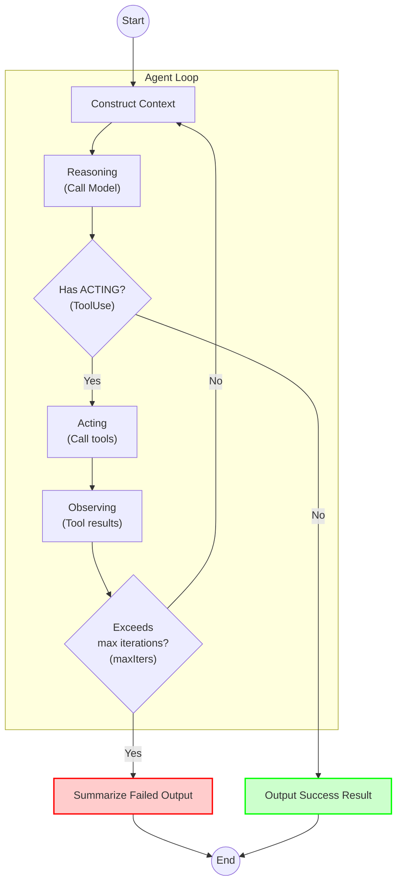
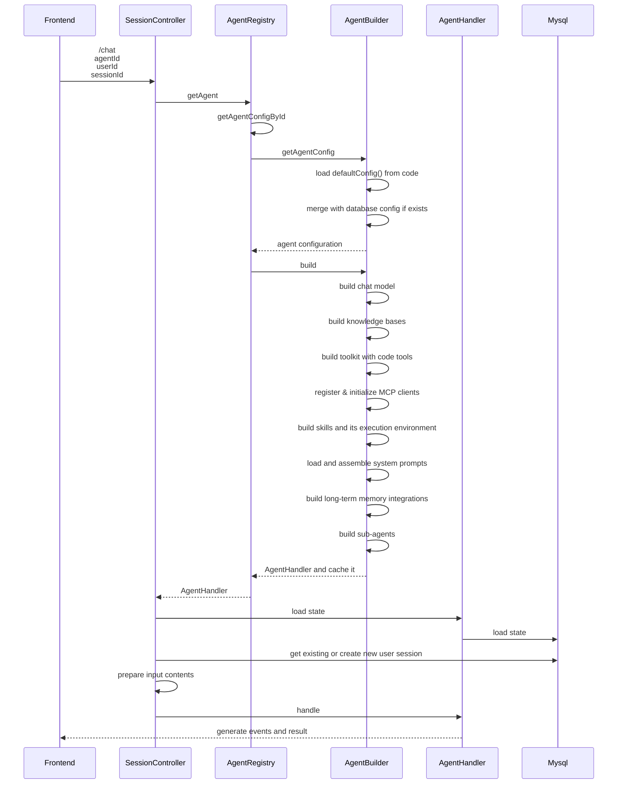
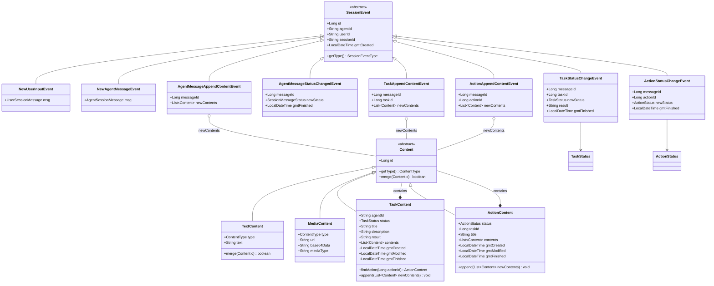
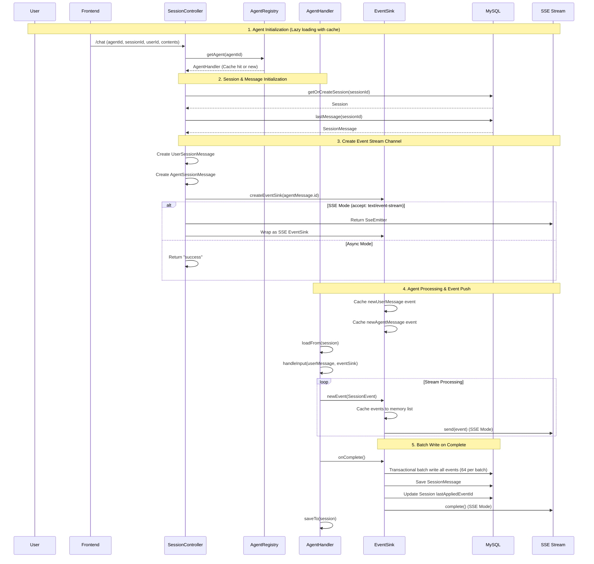
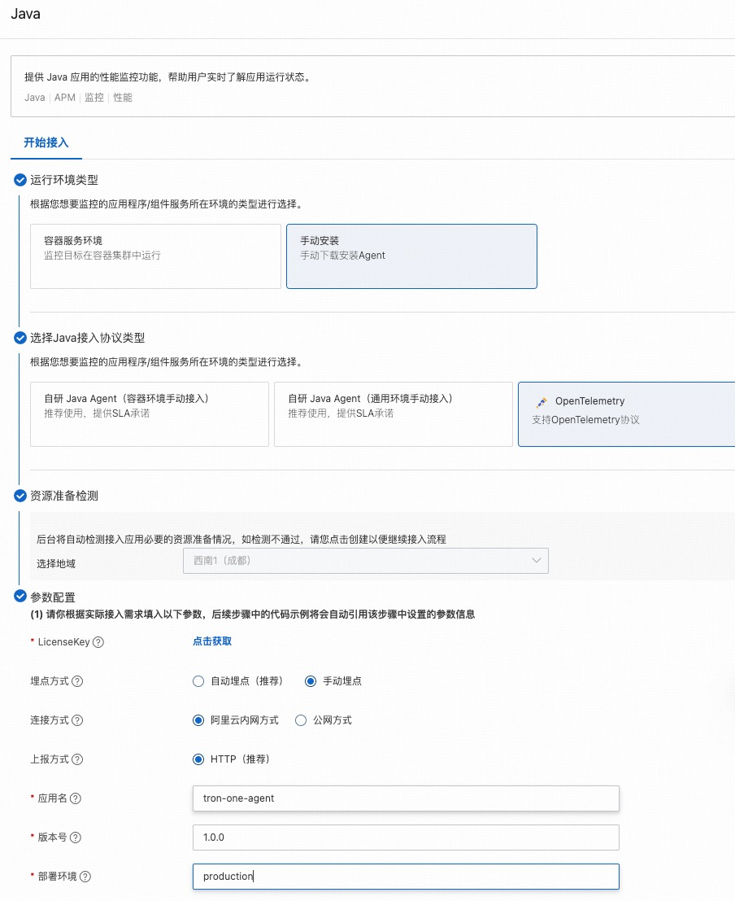
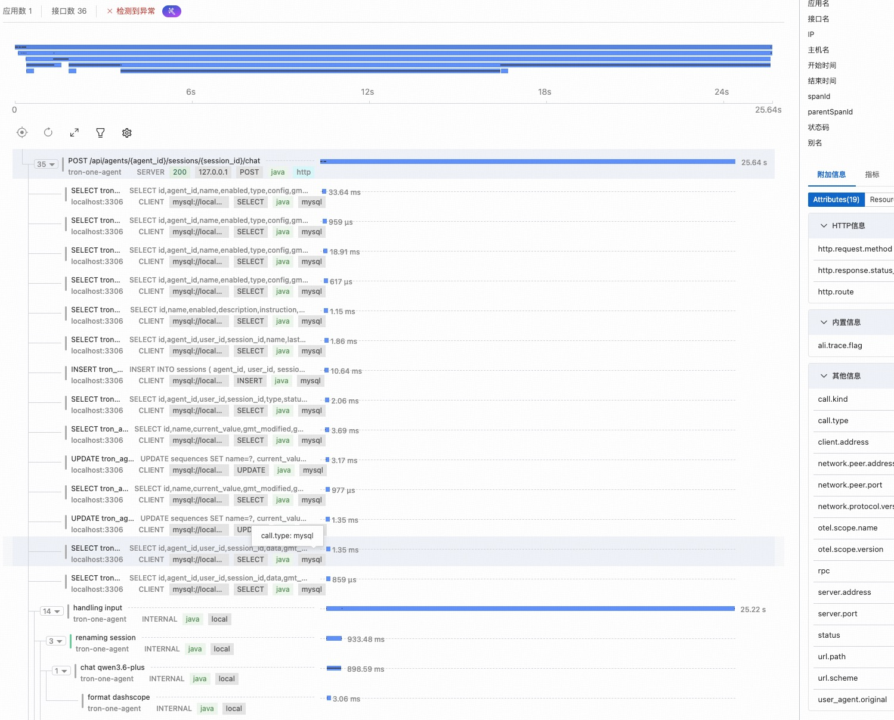
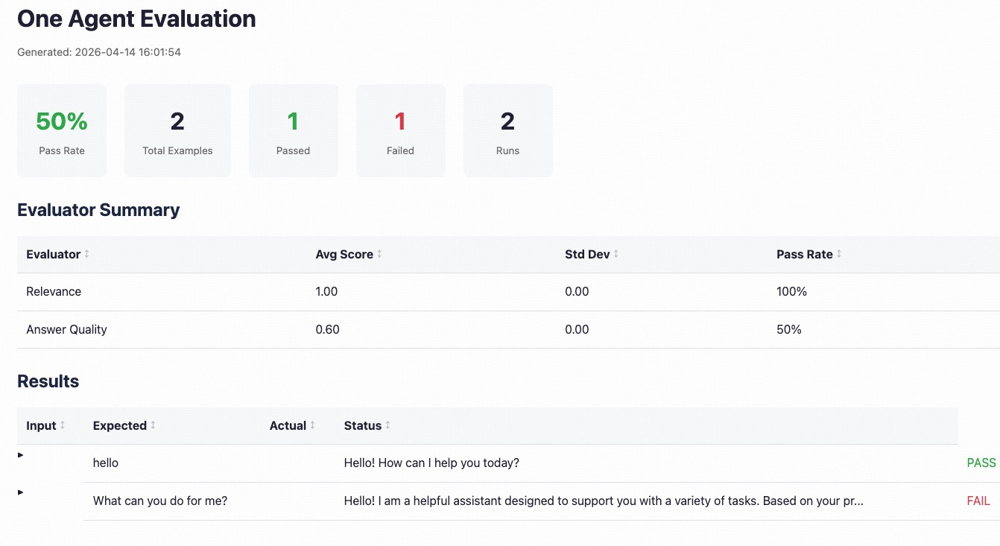

# Development Guide

## Table of Contents

- [Core Processes](#core-processes)
  - [ReAct Agent Loop](#react-agent-loop)
  - [Agent Initialization](#agent-initialization)
  - [Asynchronous Event Stream](#asynchronous-event-stream)
  - [Complete Chat Flow](#complete-chat-flow)
- [API](#api)
  - [Create Session](#1-create-session)
  - [Get Session List](#2-get-session-list)
  - [Get Session Details](#3-get-session-details)
  - [Delete Session](#4-delete-session)
  - [Get Session Messages](#5-get-session-messages)
  - [Get Session Events](#6-get-session-events)
  - [Send Chat Message (Core API)](#7-send-chat-message-core-api)
- [Database Schema](#database-schema)
  - [sequences (Sequence Number Table)](#1-sequences-sequence-number-table)
  - [agents (Agent Configuration Table)](#2-agents-agent-configuration-table)
  - [agent_states (Agent State Table)](#3-agent_states-agent-state-table)
  - [sessions (Session Table)](#4-sessions-session-table)
  - [messages (Message Table)](#5-messages-message-table)
  - [session_events (Session Event Table)](#6-session_events-session-event-table)
  - [mcp_clients (MCP Client Configuration Table)](#7-mcp_clients-mcp-client-configuration-table)
  - [knowledge_base_configs (Knowledge Base Configuration Table)](#8-knowledge_base_configs-knowledge-base-configuration-table)
  - [skill_configs (Skill Configuration Table)](#9-skill_configs-skill-configuration-table)
  - [files (File Table)](#10-files-file-table)
  - [oss_files (OSS File Mapping Table)](#11-oss_files-oss-file-mapping-table)
  - [Event Sourcing Data Flow](#event-sourcing-data-flow)
- [Model Configuration](#model-configuration)
  - [Supported Model Types](#1-supported-model-types)
  - [Configure via Code](#2-configure-via-code)
  - [Use OpenAI Compatible Interface](#3-use-openai-compatible-interface)
- [Tool Development & Registration](#tool-development--registration)
  - [Create Tool Class](#1-create-tool-class)
  - [Register to ToolRegistry](#2-register-to-toolregistry)
  - [Enable Tool in Agent](#3-enable-tool-in-agent)
- [Knowledge Base Integration](#knowledge-base-integration)
  - [Built-in Support: Bailian Knowledge Base](#1-built-in-support-bailian-knowledge-base)
  - [Enable Knowledge Base in Agent](#2-enable-knowledge-base-in-agent)
  - [RAG Mode Explanation](#3-rag-mode-explanation)
  - [Extend with Other Knowledge Bases](#4-extend-with-other-knowledge-bases)
- [Long-Term Memory Integration](#long-term-memory-integration)
  - [Built-in Support: Bailian Long-Term Memory](#1-built-in-support-bailian-long-term-memory)
  - [Enable Long-Term Memory in Agent](#2-enable-long-term-memory-in-agent)
  - [Long-Term Memory Modes](#3-long-term-memory-modes)
  - [Configure Memory Library ID](#4-configure-memory-library-id)
  - [Extend with Other Long-Term Memory](#5-extend-with-other-long-term-memory)
- [MCP Server Integration](#mcp-server-integration)
  - [Implement McpConfigBuilder](#1-implement-mcpconfigbuilder)
  - [Enable MCP in Agent](#2-enable-mcp-in-agent)
  - [MCP Transport Protocols](#3-mcp-transport-protocols)
- [Add Skills](#add-skills)
  - [Skill Structure](#1-skill-structure)
  - [Create SKILL.md](#2-create-skillmd)
  - [Create Execution Script](#3-create-execution-script)
  - [Package Skill](#4-package-skill)
  - [Enable Skill in Agent](#5-enable-skill-in-agent)
  - [Difference Between Skill and Tool](#6-difference-between-skill-and-tool)
- [Multimodal Integration](#multimodal-integration)
  - [Image Input](#image-input)
    - [Interface Definition](#1-interface-definition)
    - [Current Supported Component: OSS](#2-current-supported-component-oss)
    - [Extend with Other Storage Components](#3-extend-with-other-storage-components)
  - [Automatic Speech Recognition (ASR)](#automatic-speech-recognition-asr)
    - [Interface Definition](#1-interface-definition-1)
    - [Current Supported Component: Bailian Qwen3-ASR-Flash-Realtime](#2-current-supported-component-bailian-qwen3-asr-flash-realtime)
    - [Extend with Other ASR Components](#3-extend-with-other-asr-components)
  - [Text-to-Speech (TTS)](#text-to-speech-tts)
    - [Interface Definition](#1-interface-definition-2)
    - [Current Supported Component: Bailian Qwen3-TTS-Flash-Realtime](#2-current-supported-component-bailian-qwen3-tts-flash-realtime)
    - [Extend with Other TTS Components](#3-extend-with-other-tts-components)
- [Observability](#observability)
  - [Tracing](#tracing-1)
  - [Metrics](#metrics-1)
  - [Logging](#logging-1)
- [Evaluation](#evaluation)

---

## Core Processes

The core process of OneAgent is Chat. The following describes the different stages of a conversation (SSE API), with detailed explanations of related processes and principles.

### ReAct Agent Loop

Based on the ReAct Agent principle of AgentScope, this describes the workflow of a single run.



Note: A single Agent call may involve multiple iterations, ultimately outputting a success/failure result. OneAgent also streams the Reasoning, Acting, and Observing processes as asynchronous events.

### Agent Initialization



- SessionController: Responsible for providing the /chat API, processing input content, driving the conversation flow, and returning responses (SSE)
- AgentRegistry: Agent registry that manages and initializes all Agents in the application
- AgentBuilder: Agent constructor that loads Agent configuration and initializes AgentHandler
- AgentHandler: Agent instance that generates streaming output and final results based on user input and intelligent agent configuration


### Asynchronous Event Stream

OneAgent supports rich input and output content, with flexible support for different scenarios through up to three levels of nested structures.



### Complete Chat Flow



## API

OneAgent provides runtime APIs for session management and conversation interaction.

**Base Path**: `/api/agents/{agent_id}` (configured by `server.servlet.context-path` as `/api`)

---

### 1. Create Session

**Path**: `POST /agents/{agent_id}/sessions`

**Purpose**: Create a new session for a specified Agent

**Path Parameters**:

| Parameter | Type | Required | Description |
|------|------|------|------|
| agent_id | string | Yes | Agent ID |

**Request Headers**:

| Parameter | Type | Required | Description |
|------|------|------|------|
| X-User-Id | string | Yes | User ID |

**Request Body**:

| Field | Type | Required | Description |
|------|------|------|------|
| name | string | Yes | Session name |

**Return Value**: Session ID (string)

**Example**:

```bash
curl -X POST http://localhost:8080/api/agents/one_agent/sessions \
  -H "Content-Type: application/json" \
  -H "X-User-Id: test_user" \
  -d '{"name":"Test Session"}'
```

```json
"b6aa5fad7ff84271b59a897baa159d26"
```

### 2. Get Session List

**Path**: `GET /agents/{agent_id}/sessions`

**Purpose**: Get user's session list with pagination

**Path Parameters**:

| Parameter | Type | Required | Description |
|------|------|------|------|
| agent_id | string | Yes | Agent ID |

**Request Headers**:

| Parameter | Type | Required | Description |
|------|------|------|------|
| X-User-Id | string | Yes | User ID |

**Query Parameters**:

| Parameter | Type | Required | Default | Description |
|------|------|------|--------|------|
| pageNo | int | No | 1 | Page number (starting from 1) |
| pageSize | int | No | 10 | Number of items per page (1-100) |

**Return Value**:

| Field | Type | Description |
|------|------|------|
| totalRecords | int | Total number of records |
| records | array | Session list |
| pageNum | int | Current page number |
| pageSize | int | Items per page |
| totalPages | int | Total pages |

**Example**:

```bash
curl http://localhost:8080/api/agents/one_agent/sessions \
  -H "X-User-Id: test_user"
```

```json
{
  "totalRecords": 1,
  "records": [
    {
      "id": "b6aa5fad7ff84271b59a897baa159d26",
      "name": "Test Session",
      "lastAppliedEventId": 0,
      "gmtCreated": "2026-04-08 11:24:54",
      "gmtModified": "2026-04-08 11:24:54"
    }
  ],
  "pageNum": 1,
  "pageSize": 10,
  "totalPages": 1
}
```

### 3. Get Session Details

**Path**: `GET /agents/{agent_id}/sessions/{session_id}`

**Purpose**: Get detailed information of a specified session (including message list)

**Path Parameters**:

| Parameter | Type | Required | Description |
|------|------|------|------|
| agent_id | string | Yes | Agent ID |
| session_id | string | Yes | Session ID |

**Request Headers**:

| Parameter | Type | Required | Description |
|------|------|------|------|
| X-User-Id | string | Yes | User ID |

**Return Value**: Session details (including messages field)

**Example**:

```bash
curl http://localhost:8080/api/agents/one_agent/sessions/b6aa5fad7ff84271b59a897baa159d26 \
  -H "X-User-Id: test_user"
```

```json
{
  "id": "b6aa5fad7ff84271b59a897baa159d26",
  "userId": "test_user",
  "agentId": "one_agent",
  "name": "Test Session",
  "lastAppliedEventId": 0,
  "gmtCreated": "2026-04-08 11:24:54",
  "gmtModified": "2026-04-08 11:24:54",
  "messages": {
    "totalRecords": 0,
    "records": [],
    "pageNum": 1,
    "pageSize": 10,
    "totalPages": 0
  }
}
```

### 4. Delete Session

**Path**: `DELETE /agents/{agent_id}/sessions/{session_id}`

**Purpose**: Delete a specified session

**Path Parameters**: Same as above

**Request Headers**: Same as above

### 5. Get Session Messages

**Path**: `GET /agents/{agent_id}/sessions/{session_id}/messages`

**Purpose**: Get session message list with pagination

**Query Parameters**:

| Parameter | Type | Required | Default | Description |
|------|------|------|--------|------|
| pageNo | int | No | 1 | Page number |
| pageSize | int | No | 10 | Items per page |

**Return Value**: Paginated message list

### 6. Get Session Events

**Path**: `GET /agents/{agent_id}/sessions/{session_id}/events`

**Purpose**: Get session event list with pagination (Event Sourcing mode)

**Query Parameters**:

| Parameter | Type | Required | Default | Description |
|------|------|------|--------|------|
| offset | long | No | 0 | Offset |
| size | int | No | 10 | Number of items to retrieve (1-100) |

**Return Value**: Event list (SessionEvent array)

### 7. Send Chat Message (Core API)

**Path**: `POST /agents/{agent_id}/sessions/{session_id}/chat`

**Purpose**: Send message to Agent and get response

**Path Parameters**:

| Parameter | Type | Required | Description |
|------|------|------|------|
| agent_id | string | Yes | Agent ID |
| session_id | string | Yes | Session ID |

**Request Headers**:

| Parameter | Type | Required | Description |
|------|------|------|------|
| X-User-Id | string | Yes | User ID |
| X-User-Name | string | No | User name |
| Accept | string | No | Response format: `text/event-stream` (SSE streaming) or omitted (async) |

**Request Body**:

| Field | Type | Required | Description |
|------|------|------|------|
| input | array | Yes | Input content list |

**input array elements**:

| Field | Type | Required | Description |
|------|------|------|------|
| type | int | Yes | Content type: 1=text, 3=image, 4=video, 5=audio |
| text | string | Conditional | Text content (required when type=1) |
| url | string | Conditional | Media URL (required when type=3/4/5) |
| base64Data | string | Conditional | Media Base64 data (optional when type=3/4/5) |

**Response Modes**:

1. **SSE Streaming Mode** (Recommended): Set `Accept: text/event-stream`, returns Server-Sent Events stream
2. **WebSocket Mode** (Low Latency): Real-time bidirectional communication via WebSocket protocol
3. **Async Mode**: Do not set Accept header, immediately returns "success", processed in background

**SSE Event Types**:

- `NEW_USER_INPUT` (10): User input event
- `NEW_AGENT_MESSAGE` (20): New Agent message event
- `AGENT_MESSAGE_APPEND_CONTENT` (21): Agent message content append
- `AGENT_MESSAGE_STATUS_CHANGED` (22): Agent Message status change
- `TASK_APPEND_CONTENT` (30): Task content append
- `TASK_STATUS_CHANGED` (31): Task status change
- `ACTION_APPEND_CONTENT` (40): Action content append
- `ACTION_STATUS_CHANGED` (41): Action status change
- `TTS_RESPONSE` (1001): TTS audio data event

> Note: SSE mode **does NOT support**:
> - **Cancel**: No active interrupt API, only passive trigger by closing connection
> - **Follow-up Suggestion**: Suggestion questions are NOT pushed in SSE mode (WebSocket only)

**Example (SSE Mode)**:

```bash
curl -N -X POST http://localhost:8080/api/agents/one_agent/sessions/b6aa5fad7ff84271b59a897baa159d26/chat \
  -H "Content-Type: application/json" \
  -H "X-User-Id: test_user" \
  -H "Accept: text/event-stream" \
  -d '{"input":[{"type":1,"text":"Hello"}]}'
```

**SSE Stream Output Example**:

```
event:NEW_AGENT_MESSAGE
data:{"id":2,"agentId":"one_agent","userId":"test_user","sessionId":"b6aa5fad7ff84271b59a897baa159d26","msg":{"id":2,"status":"EXECUTING","gmtCreate":"2026-04-08 11:30:00"},"type":20}

event:AGENT_MESSAGE_APPEND_CONTENT
data:{"id":3,"agentId":"one_agent","userId":"test_user","sessionId":"b6aa5fad7ff84271b59a897baa159d26","messageId":2,"newContents":[{"id":1,"type":1,"text":"Hello!"}],"type":21}

event:AGENT_MESSAGE_STATUS_CHANGED
data:{"id":4,"agentId":"one_agent","userId":"test_user","sessionId":"b6aa5fad7ff84271b59a897baa159d26","messageId":2,"newStatus":"SUCCEED","gmtFinished":"2026-04-08 11:30:05","type":22}
```

**Cancel Conversation**:

SSE mode **does NOT support active cancel**, only passive trigger by closing connection:
- Frontend calls `EventSource.stop()` or `AbortController.abort()`
- Backend detects connection closure and automatically interrupts task
- No additional API call needed

> Note: For active cancel and Follow-up Suggestion features, please use **WebSocket mode**.

```

---

### 8. WebSocket Protocol (Low-Latency Real-Time Communication)

**Endpoint**: `ws://host:port/ws/agents/{agent_id}/sessions/{session_id}`

**Purpose**: Real-time bidirectional communication via WebSocket protocol, providing lower latency and better interactive experience compared to SSE.

**Path Parameters**:

| Parameter | Type | Required | Description |
|------|------|------|------|
| agent_id | string | Yes | Agent ID |
| session_id | string | Yes | Session ID |

**Headers**:

| Parameter | Type | Required | Description |
|------|------|------|------|
| X-User-Id | string | Yes | User ID |
| X-User-Name | string | No | User name (optional, defaults to userId)

> Note: Authentication info is preferably passed via HTTP Headers, but also supports URL query params as fallback (e.g., `?X-User-Id=test_user`)

**JSON-RPC 2.0 Protocol**:

WebSocket communication is based on JSON-RPC 2.0 protocol, all messages are in JSON format.

**Client Request Message Format**:

```json
{
  "jsonrpc": "2.0",
  "method": "chat",
  "id": 1,
  "params": {
    "input": [{"type": 1, "text": "Hello"}],
    "enableTts": false
  }
}
```

**Server Response Message Format**:

```json
{
  "jsonrpc": "2.0",
  "id": 1,
  "result": "success"
}
```

**Server Push Event Format**:

Server pushes events via JSON-RPC Notification (no id field):

```json
{
  "jsonrpc": "2.0",
  "method": "event",
  "params": {
    "id": 1,
    "agentId": "one_agent",
    "userId": "test_user",
    "sessionId": "session_123",
    "type": 20,
    "msg": {...}
  }
}
```

**Supported Methods**:

| Method | Description |
|------|------|
| `chat` | Start conversation |
| `cancel` | Cancel ongoing conversation |

**Cancel Functionality**:

Users can interrupt ongoing Agent tasks at any time:

```json
{
  "jsonrpc": "2.0",
  "method": "cancel",
  "id": 2,
  "params": []
}
```

> Note: `params` is optional, can pass cancel reason (string) or empty array `[]`.

> ⚠️ **Important**: Cancel functionality is **only available in WebSocket mode**, SSE mode does not support active cancel.

**Follow-up Suggestion Event**:

After Agent completes conversation, it may push suggestion questions:

```json
{
  "jsonrpc": "2.0",
  "method": "event",
  "params": {
    "type": 2002,
    "data": ["Suggestion 1", "Suggestion 2", "Suggestion 3"]
  }
}
```

> ⚠️ **Important**: Follow-up Suggestion is **only available in WebSocket mode**, SSE mode will NOT push this event.

**TTS Audio Event**:

When TTS is enabled (`enableTts: true`), TTS audio data will be pushed:

```json
{
  "jsonrpc": "2.0",
  "method": "event",
  "params": {
    "type": 1001,
    "needPersistent": false,
    "data": {
      "success": true,
      "dataBase64": "Audio data Base64 encoded",
      "finished": false,
      "error": null
    }
  }
}
```

> Note: TTS event uses `CustomEvent` wrapper, `data` field is `TtsResponse` object. `finished: true` indicates TTS completion.

**WebSocket Example**:

```javascript
// Establish connection
const ws = new WebSocket(
  `ws://localhost:8080/ws/agents/one_agent/sessions/session_123`,
  {
    headers: {
      'X-User-Id': 'test_user',
      'X-User-Name': 'Test User'
    }
  }
);

ws.onopen = () => {
  console.log('WebSocket connection established');
  
  // Send chat message
  ws.send(JSON.stringify({
    jsonrpc: '2.0',
    method: 'chat',
    id: 1,
    params: {
      input: [{type: 1, text: 'Hello'}],
      enableTts: false
    }
  }));
};

ws.onmessage = (event) => {
  const message = JSON.parse(event.data);
  
  if (message.method === 'session') {
    // Handle session info pushed on connection
    console.log('Session info:', message.params);
  } else if (message.method === 'event') {
    // Handle server-pushed events
    console.log('Received event:', message.params);
  } else if (message.result) {
    // Handle method response
    console.log('Response:', message.result);
  } else if (message.error) {
    // Handle errors
    console.error('Error:', message.error);
  }
};

// Cancel conversation
function cancelConversation() {
  ws.send(JSON.stringify({
    jsonrpc: '2.0',
    method: 'cancel',
    id: 2
  }));
}
```

**WebSocket vs SSE Comparison**:

| Feature | WebSocket | SSE |
|------|-----------|-----|
| Latency | Lower (bidirectional) | Higher (unidirectional stream) |
| Communication | Bidirectional | Unidirectional (server→client) |
| Cancel Support | ✅ Real-time interrupt | ❌ Not supported (passive close only) |
| Follow-up Suggestion | ✅ Supported | ❌ Not supported |
| TTS Support | ✅ Supported | ✅ Supported |
| Use Cases | Low latency, complex interactions, full features | Simple streaming, basic chat |
| Browser Compatibility | Modern browsers | Modern browsers |

---

## Database Schema

OneAgent uses MySQL database with **Event Sourcing** pattern to store session and event data. Below are detailed descriptions of all tables.

---

### 1. sequences (Sequence Number Table)

**Purpose**: Global unique ID generator, providing auto-increment sequence numbers for events, messages, tasks, etc.

| Field | Type | Description |
|------|------|------|
| id | BIGINT UNSIGNED | Primary key, auto-increment |
| name | SMALLINT | Sequence name (enum values: EVENT=1, MESSAGE=2, TASK=3, ACTION=4) |
| current_value | BIGINT UNSIGNED | Current sequence value |
| gmt_modified | TIMESTAMP | Modification time |
| gmt_created | TIMESTAMP | Creation time |

---

### 2. agents (Agent Configuration Table)

**Purpose**: Store Agent configuration information (optional, mainly used for configuration override)

> Note: OneAgent uses **pure code configuration** approach. Core Agent configurations are defined in code by implementing the `AgentBuilder` interface. The `agents` table in the database is used for optional configuration overrides, allowing fine-tuning of code configurations at runtime.

| Field | Type | Description |
|------|------|------|
| id | BIGINT UNSIGNED | Primary key, auto-increment |
| agent_id | VARCHAR(32) | Agent unique identifier (e.g., one_agent) |
| name | VARCHAR(128) | Agent display name |
| enabled | TINYINT | Whether enabled (1=enabled, 0=disabled) |
| type | SMALLINT | Agent type (1=normal Agent, 2=main Agent) |
| config | MEDIUMTEXT | Complete Agent configuration (JSON format, including model, tools, knowledge bases, etc.) |
| gmt_modified | TIMESTAMP | Modification time |
| gmt_created | TIMESTAMP | Creation time |

**Sample Data**:

```json
{
  "id": 1,
  "agent_id": "one_agent",
  "name": "Little AI",
  "enabled": 1,
  "type": 2,
  "config": "{\"chatModel\":{\"type\":2,\"modelName\":\"qwen3.6-plus\"},\"systemPrompt\":\"You are a helpful assistant.\",\"maxIters\":10,\"tools\":[],\"mcpClients\":[]}",
  "gmt_created": "2026-04-01 10:00:00"
}
```

---

### 3. agent_states (Agent State Table)

**Purpose**: Store Agent session states, supporting context persistence and recovery

| Field | Type | Description |
|------|------|------|
| id | BIGINT UNSIGNED | Primary key, auto-increment |
| agent_id | VARCHAR(32) | Agent ID |
| user_id | VARCHAR(64) | User ID |
| session_id | VARCHAR(64) | Session ID |
| data | MEDIUMTEXT | Agent state data (JSON format, including conversation history, etc.) |
| gmt_modified | TIMESTAMP | Modification time |
| gmt_created | TIMESTAMP | Creation time |

**Index**: `uk_session_agent` (session_id, agent_id) - Unique index

**Sample Data**:

```json
{
  "id": 1,
  "agent_id": "one_agent",
  "user_id": "user_001",
  "session_id": "sess_abc123",
  "data": "{\"messages\":[{\"role\":\"user\",\"content\":\"Hello\"},{\"role\":\"assistant\",\"content\":\"Hello! How can I help you?\"}]}",
  "gmt_modified": "2026-04-08 11:30:00"
}
```

---

### 4. sessions (Session Table)

**Purpose**: Store basic session information, tracking session event application progress

| Field | Type | Description |
|------|------|------|
| id | BIGINT UNSIGNED | Primary key, auto-increment |
| agent_id | VARCHAR(32) | Agent ID |
| user_id | VARCHAR(64) | User ID |
| session_id | VARCHAR(64) | Session unique identifier |
| name | VARCHAR(128) | Session name (default empty string) |
| last_applied_event_id | BIGINT UNSIGNED | Last applied event ID (for event replay) |
| gmt_modified | TIMESTAMP | Modification time |
| gmt_created | TIMESTAMP | Creation time |

**Index**:
- `uk_session` (session_id, agent_id) - Unique index
- `idx_agent_user` (agent_id, user_id) - Normal index, used to query user's session list

**Sample Data**:

```json
{
  "id": 1,
  "agent_id": "one_agent",
  "user_id": "user_001",
  "session_id": "b6aa5fad7ff84271b59a897baa159d26",
  "name": "Test Session",
  "last_applied_event_id": 15,
  "gmt_created": "2026-04-08 11:24:54"
}
```

---

### 5. messages (Message Table)

**Purpose**: Store snapshots of user messages and Agent messages (final state)

| Field | Type | Description |
|------|------|------|
| id | BIGINT UNSIGNED | Primary key (obtained from sequence table) |
| agent_id | VARCHAR(32) | Agent ID |
| user_id | VARCHAR(64) | User ID |
| session_id | VARCHAR(64) | Session ID |
| type | SMALLINT | Message type (1=user message, 2=Agent message) |
| status | SMALLINT | Message status (10=executing, 20=succeeded, 30=failed) |
| data | MEDIUMTEXT | Complete message content (JSON format) |
| gmt_modified | TIMESTAMP | Modification time |
| gmt_created | TIMESTAMP | Creation time |

**Index**: `idx_session_id` (session_id, agent_id)

**Sample Data**:

```json
{
  "id": 100,
  "agent_id": "one_agent",
  "user_id": "user_001",
  "session_id": "sess_abc123",
  "type": 1,
  "status": 20,
  "data": "{\"id\":100,\"contents\":[{\"type\":1,\"text\":\"Hello\"}]}",
  "gmt_created": "2026-04-08 11:25:00"
}
```

---

### 6. session_events (Session Event Table)

**Purpose**: Event Sourcing core table, storing complete history of all session events, supporting event replay and state reconstruction

| Field | Type | Description |
|------|------|------|
| id | BIGINT UNSIGNED | Primary key (obtained from sequence table) |
| agent_id | VARCHAR(32) | Agent ID |
| user_id | VARCHAR(64) | User ID |
| session_id | VARCHAR(64) | Session ID |
| message_id | BIGINT UNSIGNED | Associated message ID (can be NULL) |
| type | SMALLINT | Event type (10=new user input, 20=new Agent message, 21=message content append, 22=message status change, 30=task content append, 31=task status change, 40=action content append, 41=action status change) |
| status | SMALLINT | Event status (only used for status change events) |
| data | MEDIUMTEXT | Complete event data (JSON format, containing all fields of the event) |
| gmt_modified | TIMESTAMP | Modification time |
| gmt_created | TIMESTAMP | Creation time |

**Index**: `idx_session_id` (session_id, agent_id)

**Sample Data**:

```json
{
  "id": 1,
  "agent_id": "one_agent",
  "user_id": "user_001",
  "session_id": "sess_abc123",
  "message_id": 100,
  "type": 20,
  "status": null,
  "data": "{\"id\":1,\"agentId\":\"one_agent\",\"userId\":\"user_001\",\"sessionId\":\"sess_abc123\",\"msg\":{\"id\":100,\"status\":\"EXECUTING\"},\"type\":20}",
  "gmt_created": "2026-04-08 11:25:00"
}
```

**Event Type Description**:

| Event Type Value | Event Name | Description |
|-----------|---------|------|
| 10 | NEW_USER_INPUT | User input event |
| 20 | NEW_AGENT_MESSAGE | New Agent message event |
| 21 | AGENT_MESSAGE_APPEND_CONTENT | Agent message content append (streaming output) |
| 22 | AGENT_MESSAGE_STATUS_CHANGED | Agent Message status change |
| 30 | TASK_APPEND_CONTENT | Sub-task content append |
| 31 | TASK_STATUS_CHANGED | Sub-task status change |
| 40 | ACTION_APPEND_CONTENT | Tool invocation content append |
| 41 | ACTION_STATUS_CHANGED | Tool invocation status change |

---

### 7. mcp_clients (MCP Client Configuration Table)

**Purpose**: Store MCP (Model Context Protocol) client configurations, supporting dynamic addition of external tool services

| Field | Type | Description |
|------|------|------|
| id | BIGINT UNSIGNED | Primary key, auto-increment |
| mcp_id | VARCHAR(32) | MCP client unique identifier |
| name | VARCHAR(128) | MCP client name |
| enabled | TINYINT | Whether enabled (1=enabled, 0=disabled) |
| config | MEDIUMTEXT | MCP configuration (JSON format, including transport, URL, timeout, etc.) |
| gmt_modified | TIMESTAMP | Modification time |
| gmt_created | TIMESTAMP | Creation time |

**Sample Data**:

```json
{
  "id": 1,
  "mcp_id": "WebSearch",
  "name": "Internet Search",
  "enabled": 1,
  "config": "{\"transport\":\"SSE\",\"url\":\"https://mcp.example.com/sse\",\"timeout\":30000}",
  "gmt_created": "2026-04-01 10:00:00"
}
```

---

### 8. knowledge_base_configs (Knowledge Base Configuration Table)

**Purpose**: Store knowledge base configurations, supporting RAG (Retrieval-Augmented Generation) functionality

| Field | Type | Description |
|------|------|------|
| id | BIGINT UNSIGNED | Primary key, auto-increment |
| knowledge_base_id | VARCHAR(32) | Knowledge base unique identifier |
| name | VARCHAR(128) | Knowledge base name |
| enabled | TINYINT | Whether enabled (1=enabled, 0=disabled) |
| config | MEDIUMTEXT | Knowledge base configuration (JSON format, including type, index ID, etc.) |
| gmt_modified | TIMESTAMP | Modification time |
| gmt_created | TIMESTAMP | Creation time |

**Sample Data**:

```json
{
  "id": 1,
  "knowledge_base_id": "kb_001",
  "name": "Product Documentation Library",
  "enabled": 1,
  "config": "{\"type\":\"bailian\",\"workspaceId\":\"ws_123\",\"indexId\":\"idx_456\"}",
  "gmt_created": "2026-04-01 10:00:00"
}
```

---

### 9. skill_configs (Skill Configuration Table)

**Purpose**: Store Skill configurations, Skills are pluggable functional modules (such as weather query, code execution, etc.)

| Field | Type | Description |
|------|------|------|
| id | BIGINT UNSIGNED | Primary key, auto-increment |
| name | VARCHAR(32) | Skill name |
| enabled | TINYINT | Whether enabled (1=enabled, 0=disabled) |
| description | VARCHAR(1024) | Skill description |
| instruction | MEDIUMTEXT | Skill instruction (prompts for Agent to use the skill) |
| base_dir | VARCHAR(1024) | Skill base directory |
| files | MEDIUMTEXT | Skill file list (JSON format) |
| file_id | BIGINT UNSIGNED | Associated file ID (ZIP package in skills table) |
| checksum | VARCHAR(1024) | File checksum |
| gmt_modified | TIMESTAMP | Modification time |
| gmt_created | TIMESTAMP | Creation time |

**Sample Data**:

```json
{
  "id": 1,
  "name": "weather",
  "enabled": 1,
  "description": "Query weather information",
  "instruction": "When user asks about weather, use weather skill to query",
  "base_dir": "/skills/weather",
  "files": "[\"SKILL.md\", \"scripts/weather.py\"]",
  "file_id": 10,
  "checksum": "sha256:abc123...",
  "gmt_created": "2026-04-01 10:00:00"
}
```

---

### 10. files (File Table)

**Purpose**: Store uploaded file content (local file storage mode)

| Field | Type | Description |
|------|------|------|
| id | BIGINT UNSIGNED | Primary key, auto-increment |
| name | VARCHAR(1024) | File name |
| size | BIGINT | File size (bytes) |
| content | LONGBLOB | File binary content |
| gmt_modified | TIMESTAMP | Modification time |
| gmt_created | TIMESTAMP | Creation time |

**Index**: `idx_name` (name(512))

**Usage Scenario**: Store small files like Skill ZIP packages

---

### 11. oss_files (OSS File Mapping Table)

**Purpose**: Store Alibaba Cloud OSS file mapping relationships (cloud file storage mode)

| Field | Type | Description |
|------|------|------|
| id | BIGINT UNSIGNED | Primary key (non-auto-increment, generated by application) |
| user_id | VARCHAR(64) | User ID |
| oss_region | VARCHAR(32) | OSS region (e.g., oss-cn-hangzhou) |
| oss_bucket | VARCHAR(32) | OSS Bucket name |
| oss_file_key | VARCHAR(1024) | OSS file key (path) |
| gmt_modified | TIMESTAMP | Modification time |
| gmt_created | TIMESTAMP | Creation time |

**Index**:
- `idx_user` (user_id) - Query files uploaded by user
- `uk_oss_bucket_file_key` (oss_region, oss_bucket, oss_file_key) - Unique index, preventing duplicate uploads

**Sample Data**:

```json
{
  "id": 1001,
  "user_id": "user_001",
  "oss_region": "oss-cn-hangzhou",
  "oss_bucket": "tron-agent-files",
  "oss_file_key": "users/user_001/skills/weather_v1.zip",
  "gmt_created": "2026-04-08 10:00:00"
}
```

---

### Event Sourcing Data Flow 

OneAgent uses Event Sourcing architecture, core data flow:

1. **Event Writing**: During conversation, all changes are appended as events to memory cache, and batch written to `session_events` table on `onComplete`
2. **Message Snapshot**: After events complete, final message state is written to `messages` table on `onComplete`
3. **State Reconstruction**: By replaying events in `session_events` table, session state can be reconstructed at any point in time
4. **Progress Tracking**: `sessions.last_applied_event_id` records applied event ID, supporting breakpoint resumption


## Model Configuration

### 1. Supported Model Types

OneAgent supports two model configuration approaches:

| Type | Enum Value | Description |
|------|--------|------|
| DASHSCOPE | 1 | Alibaba Cloud Bailian DashScope SDK |
| OPENAI_COMPATIBLE | 2 | OpenAI compatible interface (can connect to any service compatible with OpenAI API format) |

### 2. Configure via Code

Inherit `BaseAgentBuilder` class and configure model in `defaultConfig()` method:

```java
@Component
public class MyAgentBuilder extends BaseAgentBuilder {
    public static final String AGENT_ID = "my_agent";

    @Value("${tron.dashscope.api-key}")
    private String apiKey;

    protected MyAgentBuilder() {
        super(AGENT_ID);
    }

    @Override
    protected AgentConfig defaultConfig() {
        return AgentConfig.builder()
                .name("My Intelligent Assistant")
                .enabled(true)
                .type(LocalAgentType.REACT)  // or LocalAgentType.ONE
                .chatModel(
                        ChatModelConfig.builder()
                                .type(ChatModelType.DASHSCOPE)  // or OPENAI_COMPATIBLE
                                .apiKey(apiKey)
                                .modelName("qwen3-max")  // Model name
                                .baseUrl(null)  // Not required for DASHSCOPE type, required for OPENAI_COMPATIBLE
                                .stream(true)  // Enable streaming output
                                .thinking(false)  // Whether to enable deep thinking
                                .build()
                )
                .systemPrompt("You are a professional AI assistant, helping users solve problems.")
                .maxIters(10)  // Maximum iterations
                .build();
    }
}
```

### 3. Use OpenAI Compatible Interface

Can connect to any model service compatible with OpenAI API format (e.g., Ollama, vLLM, etc.):

```java
.chatModel(
        ChatModelConfig.builder()
                .type(ChatModelType.OPENAI_COMPATIBLE)
                .baseUrl("http://localhost:11434/v1")  // Ollama local service
                .apiKey("ollama")  // Set according to service requirements
                .modelName("qwen2.5:72b")  // Model name
                .stream(true)
                .build()
)
```

---

## Tool Development & Registration

### 1. Create Tool Class

Define tools using AgentScope's `@Tool` and `@ToolParam` annotations:

```java
package com.example.tools;

import io.agentscope.core.tool.Tool;
import io.agentscope.core.tool.ToolParam;
import org.springframework.stereotype.Component;

@Component
public class WeatherTool {
    
    @Tool(description = "Query weather information for a specified city")
    public String getWeather(
            @ToolParam(name = "city", description = "City name, e.g., Beijing, Shanghai") String city
    ) {
        // Call weather API
        String weather = callWeatherAPI(city);
        return String.format("Today's weather in %s: %s", city, weather);
    }
    
    @Tool(description = "Calculate distance between two cities")
    public String calculateDistance(
            @ToolParam(name = "from", description = "Departure city") String from,
            @ToolParam(name = "to", description = "Destination city") String to
    ) {
        // Distance calculation logic
        return String.format("Distance from %s to %s is approximately 1000 kilometers", from, to);
    }
}
```

### 2. Register to ToolRegistry

`ToolRegistry` will automatically scan and register all Tool classes with `@Component` annotation:

```java
@Component
public class ToolRegistry {
    private final Toolkit toolkit = new Toolkit();
    
    @Autowired
    public ToolRegistry(List<Object> tools) {
        // Automatically register all Tool classes
        for (Object tool : tools) {
            toolkit.registration().tool(tool).apply();
        }
    }
    
    public Toolkit getAllTools() {
        return toolkit;
    }
}
```

**Actual Example**: [CalculatorTool.java](../../backend_java/core/src/main/java/com/aliyun/tam/x/tron/core/tools/CalculatorTool.java)

```java
public class CalculatorTool {
    @Tool(description = "Calculator tool, input a mathematical expression and return the result")
    public String calculator(
            @ToolParam(name = "expression", description = "Mathematical expression") String expression) {
        try {
            ExpressionParser parser = new SpelExpressionParser();
            EvaluationContext context = SimpleEvaluationContext.forReadOnlyDataBinding()
                    .withInstanceMethods()
                    .build();

            Expression exp = parser.parseExpression(expression);
            Object result = exp.getValue(context);
            return String.valueOf(result);
        } catch (Exception e) {
            return "Calculation error: " + e.getMessage();
        }
    }
}
```

### 3. Enable Tool in Agent

Specify the tools to use in Agent configuration:

```java
@Override
protected AgentConfig defaultConfig() {
    return AgentConfig.builder()
            .name("Intelligent Assistant")
            .enabled(true)
            .chatModel(/* ... */)
            .tools(Lists.newArrayList(
                    AgentToolConfig.builder()
                            .name("calculator")  // Tool method name
                            .enabled(true)
                            .build()
            ))
            .build();
}
```

---

## Knowledge Base Integration

### 1. Built-in Support: Bailian Knowledge Base

The system has built-in complete support for Alibaba Cloud Bailian Knowledge Base, using the `BailianKnowledgeBaseConfig` configuration class.

**Supported Configuration Items**:

| Configuration Item | Type | Default | Description |
|--------|------|--------|------|
| workspaceId | String | - | Bailian workspace ID |
| indexId | String | - | Bailian index ID |
| accessKeyId | String | - | Alibaba Cloud AccessKey ID |
| accessKeySecret | String | - | Alibaba Cloud AccessKey Secret |
| enableRewrite | Boolean | true | Whether to enable query rewriting |
| rewriteModelName | String | - | Rewriting model name |
| enableRerank | Boolean | true | Whether to enable reranking |
| rerankModelName | String | qwen3-rerank | Reranking model |
| rerankMinScore | Float | 0.2 | Minimum score threshold for reranking |
| rerankTopK | Integer | 5 | Return Top K after reranking |
| denseSimilarityTopK | Integer | 50 | Dense vector retrieval Top K |
| sparseSimilarityTopK | Integer | 50 | Sparse vector retrieval Top K |
| saveRetrieverHistory | Boolean | true | Whether to save retrieval history |

**Usage Example**:

```java
package com.example.rag;

import com.aliyun.tam.x.tron.core.config.BailianKnowledgeBaseConfig;
import com.aliyun.tam.x.tron.core.config.KnowledgeBaseConfig;
import com.aliyun.tam.x.tron.core.rag.KnowledgeBaseConfigBuilder;
import org.springframework.beans.factory.annotation.Value;
import org.springframework.stereotype.Component;

@Component
public class MyKnowledgeBaseConfigBuilder implements KnowledgeBaseConfigBuilder {
    
    @Value("${tron.bailian.rag.access-key-id}")
    private String accessKeyId;

    @Value("${tron.bailian.rag.access-key-secret}")
    private String accessKeySecret;

    @Override
    public String getId() {
        return "product_docs";
    }

    @Override
    public KnowledgeBaseConfig getConfig() {
        return BailianKnowledgeBaseConfig.builder()
                .id(getId())
                .name("Product Documentation Knowledge Base")
                .accessKeyId(accessKeyId)
                .accessKeySecret(accessKeySecret)
                .workspaceId("your_workspace_id")
                .indexId("your_index_id")
                .enableRewrite(true)
                .enableRerank(true)
                .rerankModelName("qwen3-rerank")
                .rerankTopK(5)
                .build();
    }
}
```

**Actual Example**: [ExampleKnowledgeBaseConfigBuilder.java](../../backend_java/core/src/main/java/com/aliyun/tam/x/tron/core/rag/ExampleKnowledgeBaseConfigBuilder.java)

### 2. Enable Knowledge Base in Agent

```java
@Override
protected AgentConfig defaultConfig() {
    return AgentConfig.builder()
            .name("RAG Assistant")
            .enabled(true)
            .chatModel(/* ... */)
            .ragMode("AGENTIC")  // or "GENERIC"
            .knowledgeBases(Lists.newArrayList(
                    AgentKnowledgeBaseConfig.builder()
                            .knowledgeId("my_knowledge_base")
                            .enabled(true)
                            .mode("generic")  // generic or agentic
                            .defaultLimit(10)
                            .defaultScoreThreshold(0.7)
                            .build()
            ))
            .build();
}
```

### 3. RAG Mode Description

| Mode | Description |
|------|------|
| GENERIC | Generic mode: Automatically retrieves from knowledge base before each conversation, injects retrieval results into context |
| AGENTIC | Agentic mode: Agent autonomously decides when to use knowledge base retrieval tool |

### 4. Extend with Other Knowledge Bases

The system implements knowledge base extensibility through the `KnowledgeBaseConfigBuilder` interface:

```java
public interface KnowledgeBaseConfigBuilder {
    /**
     * Get knowledge base unique identifier
     */
    String getId();

    /**
     * Get knowledge base configuration
     */
    KnowledgeBaseConfig getConfig();
}
```

**Extension Example (using custom vector database as example)**:

```java
@Component
@ConditionalOnProperty(name = "knowledge.base.type", havingValue = "custom_vector_db")
public class CustomVectorKnowledgeBaseBuilder implements KnowledgeBaseConfigBuilder {

    @Value("${knowledge.base.custom.url}")
    private String url;

    @Value("${knowledge.base.custom.api-key}")
    private String apiKey;

    @Override
    public String getId() {
        return "custom_vector_db";
    }

    @Override
    public KnowledgeBaseConfig getConfig() {
        return CustomVectorKnowledgeBaseConfig.builder()
                .id(getId())
                .name("Custom Vector Knowledge Base")
                .url(url)
                .apiKey(apiKey)
                .collectionName("my_collection")
                .embeddingModel("text-embedding-3-small")
                .topK(10)
                .build();
    }
}
```

**Key Points**:

1. Create a custom `KnowledgeBaseConfig` subclass to define configuration fields
2. Implement the `KnowledgeBaseConfigBuilder` interface
3. Use `@ConditionalOnProperty` for conditional loading
4. Add support for new configuration types in the `KnowledgeRegistry.buildKnowledge()` method
5. Implement the `Knowledge` interface to provide actual retrieval logic

---

## Long-Term Memory Integration

### 1. Built-in Support: Bailian Long-Term Memory

The system has built-in complete support for Alibaba Cloud Bailian Long-Term Memory, using the `BailianLongTermMemoryFactory` implementation class.

**Working Principle**:

1. When user sends a message, the system automatically saves the user message to Bailian memory library
2. Before each conversation, retrieves relevant historical memories from Bailian memory library based on current query
3. Injects retrieved memories into Agent context, helping Agent remember user preferences and history
4. Supports cross-session long-term memory, enabling truly personalized conversations

**Configuration Parameters**:

| Configuration Item | Type | Default | Description |
|--------|------|--------|------|
| memory_library_id | String | - | Bailian memory library ID (Required) |
| apiKey | String | ${DASHSCOPE_API_KEY} | Bailian API Key |

**Usage Example**:

```java
package com.example.mem;

import com.aliyun.tam.x.tron.core.mem.LongTermMemoryFactory;
import io.agentscope.core.memory.LongTermMemory;
import io.agentscope.core.message.Msg;
import io.agentscope.core.message.MsgRole;
import org.springframework.beans.factory.annotation.Value;
import org.springframework.stereotype.Component;
import org.springframework.util.StringUtils;
import org.springframework.web.client.RestClient;

import java.util.List;
import java.util.Map;

@Component
public class BailianLongTermMemoryFactory implements LongTermMemoryFactory {

    @Value("${tron.dashscope.api-key}")
    private String apiKey;

    @Value("${memory.long.bailian.memory_library_id:}")
    private String memoryLibraryId;

    @Override
    public LongTermMemory create(String userId) {
        if (!StringUtils.hasText(memoryLibraryId)) {
            return null;  // Memory library ID not configured, long-term memory not enabled
        }
        
        return new LongTermMemory() {
            private final RestClient client = RestClient.builder()
                    .baseUrl("https://dashscope.aliyuncs.com/api/v1")
                    .defaultHeader("Authorization", "Bearer " + apiKey)
                    .build();

            @Override
            public Mono<List<Msg>> retrieve(Msg query, int limit) {
                // Retrieve relevant memories from Bailian memory library
                Map<String, Object> requestBody = ImmutableMap.of(
                        "memory_library_id", memoryLibraryId,
                        "user_id", userId,
                        "query", query.getTextContent().orElse(""),
                        "limit", limit
                );

                return Mono.fromCallable(() -> {
                    var response = client.post()
                            .uri("/memories/retrieve")
                            .contentType(MediaType.APPLICATION_JSON)
                            .body(requestBody)
                            .retrieve()
                            .body(String.class);
                    return parseMemories(response);
                });
            }

            @Override
            public Mono<Void> addMessage(Msg message) {
                // Only save user messages to memory library
                if (message.getRole() == MsgRole.USER) {
                    return saveToMemoryLibrary(userId, message);
                }
                return Mono.empty();
            }
        };
    }
}
```

**Actual Example**: [BailianLongTermMemoryFactory.java](../../backend_java/core/src/main/java/com/aliyun/tam/x/tron/core/mem/BailianLongTermMemoryFactory.java)

### 2. Enable Long-Term Memory in Agent

```java
@Override
protected AgentConfig defaultConfig() {
    return AgentConfig.builder()
            .name("Memory Assistant")
            .enabled(true)
            .chatModel(/* ... */)
            .enableLongTermMemory(true)  // Enable long-term memory
            .longTermMemoryMode("BOTH")  // RECALL (retrieve) or WRITE (save) or BOTH
            .build();
}
```

### 3. Long-Term Memory Modes

| Mode | Description |
|------|------|
| RECALL | Retrieve only: Retrieve historical memories during conversation, but do not write new memories |
| WRITE | Write only: Write new memories, but do not retrieve |
| BOTH | Bidirectional: Both retrieve and write (recommended) |

### 4. Configure Memory Library ID

Configure in `application.yaml`:

```yaml
memory:
  long:
    bailian:
      memory_library_id: "your_memory_library_id"
```

### 5. Extend with Other Long-Term Memory

The system implements long-term memory extensibility through the `LongTermMemoryFactory` interface:

```java
public interface LongTermMemoryFactory {
    /**
     * Create long-term memory instance
     * @param userId User ID
     * @return Long-term memory instance
     */
    LongTermMemory create(String userId);
}
```

**AgentScope's LongTermMemory Interface**:

```java
public interface LongTermMemory {
    /**
     * Retrieve related memories
     * @param query Query message
     * @param limit Return limit
     * @return Related memory list
     */
    Mono<List<Msg>> retrieve(Msg query, int limit);

    /**
     * Add message to long-term memory
     * @param message Message
     * @return Async result
     */
    Mono<Void> addMessage(Msg message);
}
```

**Extension Example (using Redis as example)**:

```java
@Component
@ConditionalOnProperty(name = "memory.long.type", havingValue = "redis")
public class RedisLongTermMemoryFactory implements LongTermMemoryFactory {

    @Value("${memory.long.redis.url}")
    private String redisUrl;

    @Value("${memory.long.redis.max-messages:100}")
    private int maxMessages;

    private final RedisClient redisClient;

    public RedisLongTermMemoryFactory() {
        // Initialize Redis client
        this.redisClient = RedisClient.create(redisUrl);
    }

    @Override
    public LongTermMemory create(String userId) {
        return new LongTermMemory() {
            private final String memoryKey = "user:" + userId + ":memory";

            @Override
            public Mono<List<Msg>> retrieve(Msg query, int limit) {
                return Mono.fromCallable(() -> {
                    // Get recent messages from Redis
                    List<String> messages = redisClient.lrange(memoryKey, 0, limit - 1);
                    return messages.stream()
                            .map(json -> Msg.fromJson(json))
                            .collect(Collectors.toList());
                });
            }

            @Override
            public Mono<Void> addMessage(Msg message) {
                return Mono.fromRunnable(() -> {
                    // Add message to Redis list
                    redisClient.lpush(memoryKey, message.toJson());
                    // Limit list length
                    redisClient.ltrim(memoryKey, 0, maxMessages - 1);
                });
            }
        };
    }
}
```

**Configuration Class**:

```java
@ConditionalOnProperty(name = "memory.long.type", havingValue = "redis")
@EnableConfigurationProperties(RedisLongTermMemoryConfig.RedisLongTermMemoryProperties.class)
public class RedisLongTermMemoryConfig {

    @Data
    @ConfigurationProperties("memory.long.redis")
    public static class RedisLongTermMemoryProperties {
        private String url = "redis://localhost:6379";
        private int maxMessages = 100;
    }

    @Bean
    public RedisLongTermMemoryFactory redisLongTermMemoryFactory(
            RedisLongTermMemoryProperties properties) {
        return new RedisLongTermMemoryFactory(properties);
    }
}
```

**Key Points**:

1. Implement `LongTermMemoryFactory` interface, return `LongTermMemory` instance
2. Use `@ConditionalOnProperty` for conditional loading
3. Create configuration class to register Bean
4. Implement memory retrieval logic in `retrieve()` method (can be based on vector similarity, time, etc.)
5. Implement memory storage logic in `addMessage()` method
6. Configure `memory.long.type=redis` in `application.yml` to switch

---

## MCP Server Integration

### 1. Implement McpConfigBuilder

Create MCP client configuration builder:

```java
package com.example.mcp;

import com.aliyun.tam.x.tron.core.config.McpClientConfig;
import com.aliyun.tam.x.tron.core.mcp.McpConfigBuilder;
import com.google.common.collect.ImmutableMap;
import org.springframework.beans.factory.annotation.Value;
import org.springframework.stereotype.Component;

@Component
public class CustomMcpConfigBuilder implements McpConfigBuilder {
    
    @Value("${custom.mcp.api-key}")
    private String apiKey;

    @Override
    public String getId() {
        return "my_mcp_server";
    }

    @Override
    public McpClientConfig getConfig() {
        return McpClientConfig.builder()
                .id(getId())
                .name("My MCP Service")
                .description("MCP service providing XXX functionality")
                .transport(McpClientConfig.TRANSPORT_HTTP)  // or TRANSPORT_SSE
                .url("https://your-mcp-server.com/mcp")
                .timeout(30)  // Request timeout (seconds)
                .initializeTimeout(10)  // Initialization timeout (seconds)
                .headers(ImmutableMap.of(
                        "Authorization", "Bearer " + apiKey,
                        "Content-Type", "application/json"
                ))
                .build();
    }
}
```

**Actual Example**: [WebSearchMcpConfigBuilder.java](../../backend_java/core/src/main/java/com/aliyun/tam/x/tron/core/mcp/WebSearchMcpConfigBuilder.java)

```java
@Component
public class WebSearchMcpConfigBuilder implements McpConfigBuilder {

    @Value("${tron.dashscope.api-key}")
    private String apiKey;

    @Override
    public String getId() {
        return "WebSearch";
    }

    @Override
    public McpClientConfig getConfig() {
        return McpClientConfig.builder()
                .id(getId())
                .name("Alibaba Cloud Bailian_WebSearch")
                .description("Provides real-time internet search based on multiple retrieval models from Tongyi Lab")
                .transport(McpClientConfig.TRANSPORT_HTTP)
                .url("https://dashscope.aliyuncs.com/api/v1/mcps/WebSearch/mcp")
                .headers(ImmutableMap.of(
                        "Authorization", "Bearer " + apiKey
                ))
                .build();
    }
}
```

### 2. Enable MCP in Agent

```java
@Override
protected AgentConfig defaultConfig() {
    return AgentConfig.builder()
            .name("MCP Assistant")
            .enabled(true)
            .chatModel(/* ... */)
            .mcpClients(Lists.newArrayList(
                    AgentMcpConfig.builder()
                            .clientId("WebSearch")
                            .enabled(true)
                            .enableFuncs(Lists.newArrayList("search", "fetch"))  // Optional: enable specific functions
                            .disableFuncs(Lists.newArrayList())  // Optional: disable specific functions
                            .build()
            ))
            .build();
}
```

---

| Protocol | Constant | Description |
|------|------|------|
| HTTP | `http` | Streamable HTTP transport (recommended) |
| SSE | `sse` | Server-Sent Events transport |

---

## Add Skills

### 1. Skill Structure

Skill is a pluggable functional module, containing the following files:

```
skills/weather/
├── SKILL.md              # Skill description file (required)
└── scripts/
    └── weather.py        # Execution script (optional)
```

### 2. Create SKILL.md

**Actual Example**: [SKILL.md](../../backend_java/skills/weather/SKILL.md)

```markdown
---
name: weather
description: Used to query today's weather for a location
---

# Weather Query Skill

Execute the following Python code to obtain weather information for a city, where <<city>> is the city name

```shell
python3 scripts/weather.py <<city>>
```

# Input Parameters
- city: City name

# Examples
---

### 3. Create Execution Script

**Actual Example**: [weather.py](../../backend_java/skills/weather/scripts/weather.py)

```python
import sys
import requests
from urllib.parse import quote

resp = requests.get(
    f"https://uapis.cn/api/v1/misc/weather?city={quote(sys.argv[1])}"
)

resp.raise_for_status()
data = resp.json()
print(f"Today's weather in {data['city']} is {data['weather']}, current temperature is {data['temperature']} degrees Celsius")
```

### 4. Package Skill

Package the Skill directory into a ZIP file:

```bash
cd skills/weather
zip -r weather.zip SKILL.md scripts/
```

> Note: Skills need to be uploaded via API, the system will store the ZIP package in the file system and enable it in the Agent configuration.

### 5. Enable Skill in Agent

```java
@Override
protected AgentConfig defaultConfig() {
    return AgentConfig.builder()
**Travel Assistant**
            .enabled(true)
            .chatModel(/* ... */)
            .skills(Lists.newArrayList(
                    AgentSkillConfig.builder()
                            .name("weather")  // Skill name
                            .enabled(true)
                            .build()
            ))
            .build();
}
```

### 6. Difference Between Skill and Tool

| Feature | Tool | Skill |
|------|------|-------|
| Implementation | Java code with @Tool annotation | Markdown description + any script |
| Registration | Auto-scan @Component classes | Upload ZIP package |
| Execution | Direct Java method invocation | Agent reads SKILL.md and executes script |
| Applicable Scenario | Complex logic, requires type safety | Quick integration, script tools |
| Code Execution | No external process dependency | Requires code execution environment (Python, etc.) |

## Multimodal Integration

### Image Input

#### 1. Interface Definition

**Upload File**: `POST /api/file`

**Request Headers**:

| Parameter | Type | Required | Description |
|------|------|------|------|
| X-User-Id | string | Yes | User ID |
| Content-Type | string | Yes | multipart/form-data |

**Request Body**:

| Parameter | Type | Required | Description |
|------|------|------|------|
| file | MultipartFile | Yes | Image file (supports jpg, jpeg, png) |

**Return Value**: HTTP 201 Created, Location header contains file access URL

**Get File**: `GET /api/file/{id}`

**Path Parameters**：

| Parameter | Type | Required | Description |
|------|------|------|------|
| id | long | Yes | File ID |

**Return Value**: 302 redirect to file actual location (OSS presigned URL)

#### 2. Currently Supported Component: OSS

The system uses Alibaba Cloud OSS as the image storage backend, implemented by `OssStorageProvider`.

**Configuration**:

```yaml
tron:
  file:
    provider:
      type: oss  # Storage provider type
  oss:
    bucket: your-bucket-name
    region: oss-cn-hangzhou
    endpoint: oss-cn-hangzhou.aliyuncs.com
    access-key-id: ${OSS_ACCESS_KEY_ID}
    access-key-secret: ${OSS_ACCESS_KEY_SECRET}
```

**Working Principle**:

1. Frontend uploads image via `POST /api/file` (multipart/form-data)
2. Backend uploads file to OSS with path format: `tron/{userId}/{fileId}.{suffix}`
3. File ID stored in `oss_files` table
4. Returns file access URL: `/api/file/{id}`
5. Generates OSS presigned URL (valid for 2 hours) and 302 redirects on access
6. Frontend uses this URL as image input in chat messages

**Supported Image Formats**: jpg, jpeg, png

#### 3. Extend with Other Storage Components

The system implements storage backend extensibility through the `StorageProvider` interface:

```java
public interface StorageProvider {
    /**
     * Upload file
     * @param userId User ID
     * @param suffix File suffix
     * @param is File input stream
     * @return File ID
     */
    Long upload(String userId, String suffix, InputStream is) throws IOException;

    /**
     * Get file (returns ResponseEntity)
     */
    ResponseEntity<?> get(String userId, Long id);

    /**
     * Convert to public URL
     */
    default String toPublicUrl(String userId, String url) {
        return url;
    }
}
```

**Extension Example (using local file system as example)**:

```java
@Component
@ConditionalOnProperty(name = "tron.file.provider.type", havingValue = "local")
public class LocalStorageProvider implements StorageProvider {

    @Value("${tron.file.local.base-path:/tmp/tron-files}")
    private String basePath;

    @Override
    public Long upload(String userId, String suffix, InputStream is) throws IOException {
        long id = System.currentTimeMillis();
        Path filePath = Paths.get(basePath, userId, id + "." + suffix);
        Files.createDirectories(filePath.getParent());
        Files.copy(is, filePath, StandardCopyOption.REPLACE_EXISTING);
        return id;
    }

    @Override
    public ResponseEntity<?> get(String userId, Long id) {
        try {
            Path filePath = Paths.get(basePath, userId, id + ".*");
            // Use wildcard to find file
            Path actualPath = findFile(filePath);
            if (actualPath == null || !Files.exists(actualPath)) {
                return ResponseEntity.notFound().build();
            }
            byte[] content = Files.readAllBytes(actualPath);
            return ResponseEntity.ok()
                    .contentType(MediaType.IMAGE_JPEG)
                    .body(content);
        } catch (IOException e) {
            return ResponseEntity.internalServerError().build();
        }
    }
}
```

**Key Points**:

1. Use `@ConditionalOnProperty` for conditional loading
2. Implement the two core methods of `StorageProvider` interface
3. Configure `tron.file.provider.type=local` in `application.yml` to switch

---

### Automatic Speech Recognition (ASR)

#### 1. Interface Definition

**WebSocket Endpoint**: `ws://host:port/api/asr`

**Client → Server Message Format**:

```json
{
  "dataBase64": "Base64 encoded audio data (PCM format)",
  "completed": false
}
```

| Field | Type | Required | Description |
|------|------|------|------|
| dataBase64 | string | No | Base64 encoded PCM audio data (16kHz, 16bit, mono) |
| completed | boolean | No | Whether recording is completed, default false |

**Server → Client Message Format**:

```json
{
  "success": true,
  "text": "Recognized text",
  "finished": false,
  "error": null
}
```

| Field | Type | Required | Description |
|------|------|------|------|
| success | boolean | Yes | Whether successful |
| text | string | No | Recognition result text (intermediate or final result) |
| finished | boolean | Yes | Whether recognition is completed |
| error | string | No | Error message |

#### 2. Currently Supported Component: Bailian Qwen3-ASR-Flash-Realtime

The system uses Alibaba Cloud Bailian platform's Qwen3-ASR-Flash-Realtime model for real-time speech recognition.

**Configuration**:

```yaml
asr:
  type: qwen  # ASR provider type
  qwen:
    model: qwen3-asr-flash-realtime
    url: wss://dashscope.aliyuncs.com/api-ws/v1/realtime
    apiKey: ${DASHSCOPE_API_KEY}  # Bailian API Key
    language: zh  # Recognition language
    inputSampleRate: 16000  # Input sample rate
    inputAudioFormat: pcm  # Input audio format
    sessionCreateTimeoutInMills: 10000  # Session creation timeout (milliseconds)
```

**Working Principle**:

1. Frontend obtains microphone permission via `navigator.mediaDevices.getUserMedia`
2. Captures 16kHz PCM audio using `AudioContext` and `ScriptProcessorNode`
3. Establishes WebSocket connection to `/api/asr`
4. Splits audio into chunks (1024 samples), converts to Base64, and sends via WebSocket
5. Backend receives audio data through `AsrWsEndpoint`
6. Backend calls Bailian Qwen3-ASR real-time model for recognition
7. Returns recognition results in real-time (intermediate and final results)
8. Sends `completed: true` when user releases microphone, returns final result

**Audio Format Requirements**:

- Sample rate: 16000 Hz
- Bit depth: 16 bit
- Channels: Mono
- Encoding: PCM
- Transmission format: Base64 encoded

#### 3. Extend with Other ASR Components

The system implements ASR service extensibility through `AsrService` and `AsrSession` interfaces:

```java
public interface AsrService {
    interface AsrCallback {
        void onText(String text);      // Recognition result callback
        void onFinished();              // Completion callback
        void onError(Throwable t);        // Error callback
    }

    AsrSession newSession(AsrCallback callback);
}

public interface AsrSession {
    void appendData(String dataBase64);  // Append audio data
    void complete();                      // Mark as completed
    void close();                         // Close session
}
```

**Extension Example (using iFlytek as example)**:

```java
@Component
@ConditionalOnProperty(name = "asr.type", havingValue = "iflytek")
public class IflytekAsrService implements AsrService {

    @Value("${asr.iflytek.app-id}")
    private String appId;

    @Value("${asr.iflytek.api-key}")
    private String apiKey;

    @Override
    public AsrSession newSession(AsrCallback callback) {
        // 1. Establish WebSocket connection with iFlytek
        // 2. Configure recognition parameters
        // 3. Implement callback forwarding
        
        return new AsrSession() {
            @Override
            public void appendData(String dataBase64) {
                // Send Base64 audio data to iFlytek
            }

            @Override
            public void complete() {
                // Send completion signal
            }

            @Override
            public void close() {
                // Close WebSocket connection
            }
        };
    }
}
```

**Configuration Class**:

```java
@ConditionalOnProperty(name = "asr.type", havingValue = "iflytek")
@EnableConfigurationProperties(IflytekAsrConfig.IflytekAsrProperties.class)
public class IflytekAsrConfig {

    @Data
    @ConfigurationProperties("asr.iflytek")
    public static class IflytekAsrProperties {
        private String appId;
        private String apiKey;
        private String apiSecret;
        private String language = "zh_cn";
    }

    @Bean
    public IflytekAsrService iflytekAsrService(IflytekAsrProperties properties) {
        return new IflytekAsrService(properties);
    }
}
```

**Key Points**:

1. Implement `AsrService` and `AsrSession` interfaces
2. Use `@ConditionalOnProperty` for conditional loading
3. Create configuration class to register Bean
4. Configure `asr.type=iflytek` in `application.yml` to switch
5. Audio format requirements: 16kHz PCM 16bit mono

---

### Text-to-Speech (TTS)

#### 1. Interface Definition

**WebSocket Endpoint**: `ws://host:port/api/tts`

**Client → Server Message Format**:

```json
{
  "text": "Text to convert to speech",
  "completed": false
}
```

| Field | Type | Required | Description |
|------|------|------|------|
| text | string | No | Text content to synthesize |
| completed | boolean | No | Whether text stream is completed, default false |

**Server → Client Message Format**:

```json
{
  "success": true,
  "dataBase64": "Base64 encoded audio data (PCM format)",
  "finished": false,
  "error": null
}
```

| Field | Type | Required | Description |
|------|------|------|------|
| success | boolean | Yes | Whether successful |
| dataBase64 | string | No | Base64 encoded PCM audio data |
| finished | boolean | Yes | Whether synthesis is completed |
| error | string | No | Error message |

#### 2. Currently Supported Component: Bailian Qwen3-TTS-Flash-Realtime

The system uses Alibaba Cloud Bailian platform's Qwen3-TTS-Flash-Realtime model for real-time speech synthesis.

**Configuration**:

```yaml
tts:
  type: qwen  # TTS provider type
  qwen:
    model: qwen3-tts-flash-realtime
    url: wss://dashscope.aliyuncs.com/api-ws/v1/realtime
    apiKey: ${DASHSCOPE_API_KEY}  # Bailian API Key
    voice: Cherry  # Voice name
    languageType: Auto  # Language type (Auto/Chinese/English)
    mode: server_commit  # Mode
    format: PCM_24000HZ_MONO_16BIT  # Audio format
    instructions: ""  # Voice instructions
    optimizeInstructions: false  # Whether to optimize instructions
    maxChunkSize: 50  # Maximum text chunk size
    chunkIntervalInMills: 100  # Text chunk interval (milliseconds)
    sessionCreateTimeoutInMills: 10000  # Session creation timeout (milliseconds)
```

**Working Principle**:

1. Frontend establishes WebSocket connection to `/api/tts`
2. Backend creates TTS session through `TtsWsEndpoint`
3. Frontend sends text chunks (streaming transmission)
4. Backend calls Bailian Qwen3-TTS real-time model for synthesis
5. Returns audio data chunks in real-time (Base64 encoded PCM)
6. Frontend buffers and plays audio using `AudioContext`
7. Sends `completed: true` to mark text stream end
8. Backend returns `finished: true` and closes connection

**Output Audio Format**:

- Sample rate: 24000 Hz
- Bit depth: 16 bit
- Channels: Mono
- Encoding: PCM
- Transmission format: Base64 encoded

**Supported Voices**: Cherry, Ethan, Chelsie, etc. (see Bailian documentation for details)

#### 3. Extend with Other TTS Components

The system implements TTS service extensibility through `TtsService` and `TtsSession` interfaces:

```java
public interface TtsService {
    interface TtsCallback {
        void onData(String dataBase64);  // Audio data callback
        void onFinished();                // Completion callback
        void onError(Throwable t);    // Error callback
    }

    TtsSession newSession(TtsCallback callback);
}

public interface TtsSession {
    void appendText(String text);  // Append text
    void complete();                // Mark as completed
    void close();                   // Close session
}
```

**Extension Example (using Azure TTS as example)**:

```java
@Component
@ConditionalOnProperty(name = "tts.type", havingValue = "azure")
public class AzureTtsService implements TtsService {

    @Value("${tts.azure.api-key}")
    private String apiKey;

    @Value("${tts.azure.region}")
    private String region;

    @Override
    public TtsSession newSession(TtsCallback callback) {
        // 1. Create Azure Speech Synthesizer
        // 2. Configure audio output format
        // 3. Implement streaming synthesis
        
        return new TtsSession() {
            private StringBuilder textBuffer = new StringBuilder();

            @Override
            public void appendText(String text) {
                textBuffer.append(text);
                // Accumulate to certain size before synthesis
                if (textBuffer.length() >= 50) {
                    synthesizeAndSend(callback);
                }
            }

            @Override
            public void complete() {
                // Synthesize remaining text
                if (textBuffer.length() > 0) {
                    synthesizeAndSend(callback);
                }
                callback.onFinished();
            }

            @Override
            public void close() {
                // Release resources
            }

            private void synthesizeAndSend(TtsCallback callback) {
                // Call Azure TTS API
                // Convert PCM data to Base64
                // callback.onData(base64Data)
            }
        };
    }
}
```

**Configuration Class**:

```java
@ConditionalOnProperty(name = "tts.type", havingValue = "azure")
@EnableConfigurationProperties(AzureTtsConfig.AzureTtsProperties.class)
public class AzureTtsConfig {

    @Data
    @ConfigurationProperties("tts.azure")
    public static class AzureTtsProperties {
        private String apiKey;
        private String region;
        private String voice = "zh-CN-XiaoxiaoNeural";
        private String outputFormat = "raw-24khz-16bit-mono-pcm";
    }

    @Bean
    public AzureTtsService azureTtsService(AzureTtsProperties properties) {
        return new AzureTtsService(properties);
    }
}
```

**Key Points**:

1. Implement `TtsService` and `TtsSession` interfaces
2. Use `@ConditionalOnProperty` for conditional loading
3. Create configuration class to register Bean
4. Supports streaming text input and streaming audio output
5. Recommended output audio format: 24kHz PCM 16bit mono

## HITL (Human-in-the-Loop)

HITL allows the Agent to pause during conversation and wait for users to answer questionnaires or make decisions, enabling human-machine collaborative interaction.

### Content Type Definition

| Enum Value | Description |
|------|------|
| HITL = 6 | HITL collaborative content |

### HitlContent Data Structure

```java
public class HitlContent implements Content {
    private String id;           // HITL content ID
    private HitlStatus status;   // Status: PENDING(1), APPROVED(2), REJECTED(3)
    private String method;       // Interaction method, currently only supports "question"
    private HitlProperties properties; // Questionnaire properties
    private String result;       // User submitted result (JSON string)
}
```

**HitlStatus Enum**:

| Status Value | Description |
|------|------|
| 1 | PENDING - Waiting for user response |
| 2 | APPROVED - User submitted and accepted |
| 3 | REJECTED - User rejected |

**properties Structure**:

```json
{
  "questions": [
    {
      "header": "Climbing Type",
      "question": "What type of climbing activity do you plan?",
      "options": [
        {"label": "Hiking", "description": "Low intensity, suitable for beginners"},
        {"label": "Rock Climbing", "description": "Medium-high intensity, requires experience"}
      ],
      "multiSelect": false
    }
  ]
}
```

### Frontend Interaction Flow

1. **Rendering Trigger**: When a message contains HITL content with `type=6`, `status=1`, `method="question"`, a questionnaire component is rendered above the input box
2. **Multi-Tab Questionnaire**: Each question is a Tab, supporting single-select (radio) and multi-select (checkbox). An "Other" option is automatically appended to each question for free-text input
3. **Skip & Submit**: Users can skip questions. Unanswered questions are marked in the result as `{"label": "skip", "description": "user skipped this question"}`
4. **Submit API**: Submit via Chat API (SSE or WebSocket) by constructing a HITL content in the request body:
   ```json
   {
     "input": [{
       "type": 6,
       "id": "hitl_content_id",
       "agentMessageId": 12345,
       "result": "[{\"header\":\"...\",\"question\":\"...\",\"values\":[{\"label\":\"...\",\"description\":\"...\"}]}]"
     }],
     "enableTts": false
   }
   ```
5. **Interaction After Message Completion**: The HITL questionnaire is only interactive when the message status is `SUCCEED` (completed). Otherwise, the input box and buttons remain disabled
6. **Read-only Display**:
   - `status=2` (APPROVED): Parses the `result` JSON and displays all selected options
   - `status=3` (REJECTED): Displays a red "User Rejected" badge, rendering only header and question text

### Backend Processing

When receiving a HITL submission, the backend will:

1. Extract HITL content from ChatRequest input
2. Parse the `result` JSON to get user selections
3. Update HitlContent status to APPROVED(2) or REJECTED(3)
4. Continue Agent execution flow, incorporating user feedback as context

## Observability

OneAgent extends AgentScope Java to establish a comprehensive observability mechanism, which mainly includes the following:

### Tracing

Supports full-link tracing with OpenTelemetry, which can be enabled through configuration. Taking Alibaba Cloud CMS 2.0 Application Observability as an example:

- Resource Activation. Activate [Alibaba Cloud CMS 2.0](https://help.aliyun.com/zh/cms/cloudmonitor-2-0/what-is-cloud-monitor-2-0?spm=a2c4g.11186623.0.i1). In the console, click [Access Center] - [Java], and select "Manual Installation", "OpenTelemetry", "Manual Instrumentation", and "Alibaba Cloud Internal Network/Public Network" respectively. Then fill in "Application Name (defaults to spring.application.name)", "Version (defaults to 1.0.0)", and "Deployment Environment (defaults to production)". Obtain LicenseKey, Endpoint, Workspace, and Project.



- OneAgent Backend Configuration. Add the following configuration to OneAgent to integrate with CMS 2.0 OpenTelemetry service.

```yaml
opentelemetry:
  enabled: true
  attributes:
    "[acs.cms.workspace]": <<Workspace obtained in previous step>>
  headers:
    x-arms-license-key: <<LicenseKey obtained in previous step>>
    x-arms-project: <<Project obtained in previous step>>
    x-cms-workspace: <<Workspace obtained in previous step>>
  endpoint: <<Endpoint obtained in previous step>>
```

- Initiate a conversation and observe tracing results. Find the application in CMS 2.0's [Application Monitoring] and open [Trace Analysis].




### Metrics

OneAgent supports Prometheus metrics collection through SpringBoot Actuator. Extended metrics include:

|Name|Labels|Type|Description|
|----|------|----|------------|
|one.agent.e2el|agent.id|histogram|End-to-end latency statistics for OneAgent conversations|
|one.agent.ttft|agent.id|histogram|Time to first token latency (including thinking and reasoning) statistics for OneAgent conversations|
|one.agent.response.ttft|agent.id|histogram|Final response time to first token latency (excluding thinking and reasoning) statistics for OneAgent conversations|
|one.agent.times.reasoning|agent.id, model.name|counter|OneAgent reasoning times|
|one.agent.times.acting|agent.id|counter|OneAgent action times|
|one.agent.times.summary|agent.id, model.name|counter|OneAgent summary output times after exceeding max loops|
|one.agent.times.error|agent.id|counter|OneAgent error times|
|one.agent.tool.time|agent.id, tool.name|histogram|OneAgent tool invocation time statistics|
|one.agent.model.input|agent.id, model.name|histogram|OneAgent model invocation input token statistics|
|one.agent.model.output|agent.id, model.name|histogram|OneAgent model invocation output token statistics|
|one.agent.model.time|agent.id, model.name|histogram|OneAgent model invocation time statistics|

In addition to the extended metrics above, Actuator native metrics are also supported. Access through the following endpoints:

- http://<backend-service>:8091/actuator/metrics: Get all metric names
- http://<backend-service>:8091/actuator/prometheus: Get all metric detail data

### Logging

It is recommended to collect OneAgent logs through Alibaba Cloud SLS or self-built ELK. Logs are mainly output to two locations:

1. Console. All logs are output to the console, which can be collected using cloud-native solutions;
2. Log Files. Output to application.log in the working directory, rotating by day and 500MB size, with a default maximum of 50 historical files retained.

If Tracing is enabled, logs will also output associated traceId and spanId.

## Evaluation

OneAgent integrates [Dokimos](https://dokimos.dev/) for Agent evaluation, running locally with JUnit5 + MariaDB. It mainly includes the following components:

- Test Dataset: Refer to [test-one-agent-v1.json](backend_java/bootstrap/src/test/resources/datasets/test-one-agent-v1.json)

```json
{
  "name": "one-agent-test-dataset",
  "description": "example test dataset for one agent",
  "examples": [
    {
      "input": "hello"
    },
    {
      "input": "What can you do for me?"
    }
  ]
}
```

- Test Code and Evaluators: Refer to [OneAgentTest.java](backend_java/bootstrap/src/test/java/com/aliyun/tam/x/tron/core/OneAgentTest.java)

```java
        Dataset dataset = DatasetResolverRegistry.getInstance().resolve("classpath:datasets/test-one-agent-v1.json");

        Task task = example -> {
            String sessionId = UUID.randomUUID().toString();
            AgentResult result = callAgent(sessionId, example.input());
            return Map.of(
                    "sessionId", sessionId,
                    "output", result.getResponse()
            );
        };

        List<Evaluator> evaluators = List.of(
                LLMJudgeEvaluator.builder()
                        .name("Relevance")
                        .criteria("Is the answer relevant to the question?")
                        .threshold(0.7)
                        .evaluationParams(List.of(
                                EvalTestCaseParam.INPUT,
                                EvalTestCaseParam.ACTUAL_OUTPUT
                        ))
                        .judge(judgeLMFactory.create())
                        .build(),
                LLMJudgeEvaluator.builder()
                        .name("Answer Quality")
                        .criteria("Is the answer helpful and addresses the user's question?")
                        .evaluationParams(List.of(
                                EvalTestCaseParam.INPUT,
                                EvalTestCaseParam.ACTUAL_OUTPUT
                        ))
                        .threshold(0.5)
                        .judge(judgeLMFactory.create())
                        .build()
        );

        String timestamp = Instant.now().toString();

        ExperimentResult result = Experiment.builder()
                .name("One Agent Evaluation")
                .dataset(dataset)
                .task(task)
                .evaluators(evaluators)
                .metadata("agnet", agentId())
                .metadata("timestamp", timestamp)
                .metadata("version", "1.0.0")
                .runs(2)
                .parallelism(4)
                .build()
                .run()
```

- Evaluation Results. On one hand, test cases determine pass/fail based on thresholds defined by evaluators; on the other hand, detailed results of agent input/output and evaluators are output to:
    
1. Console
```bash
Experiment: One Agent Evaluation
Description: 
Total examples: 2
Passed: 1.0
Failed: 1.0
Pass rate: 50.00%

Average scores:
Relevance: 1.0
Answer Quality: 0.6

Score stability (standard deviation):
Relevance: 0.0
Answer Quality: 0.0

…………
```
2. HTML File


3. Markdown File
```markdown
# Experiment: One Agent Evaluation

**Date:** 2026-04-14 16:01:54  
**Pass Rate:** 50% (1/2)

## Evaluator Summary

| Evaluator | Avg Score | Std Dev | Pass Rate |
|-----------|-----------|---------|----------|
| Relevance | 1.00 | 0.00 | 100% |
| Answer Quality | 0.60 | 0.00 | 50% |

## Failed Examples

### What can you do for me?

**Expected:**   
**Actual:** Hello! I am a helpful assistant designed to support you with a variety of tasks. Based on your profile and my capabilities, here is what I can do for you:

…………
```
4. JSON File
```json
{
  "version" : 1,
  "experimentName" : "One Agent Evaluation",
  "timestamp" : "2026-04-14T08:01:54.565563Z",
  "description" : "",
  "metadata" : {
    "timestamp" : "2026-04-14T08:01:11.801611Z",
    "version" : "1.0.0",
    "agnet" : "one_agent"
  },
  "config" : {
    "runs" : 2
  },
  "summary" : {
    "totalExamples" : 2,

…………

```

For more usage, refer to the official Dokimos website.
